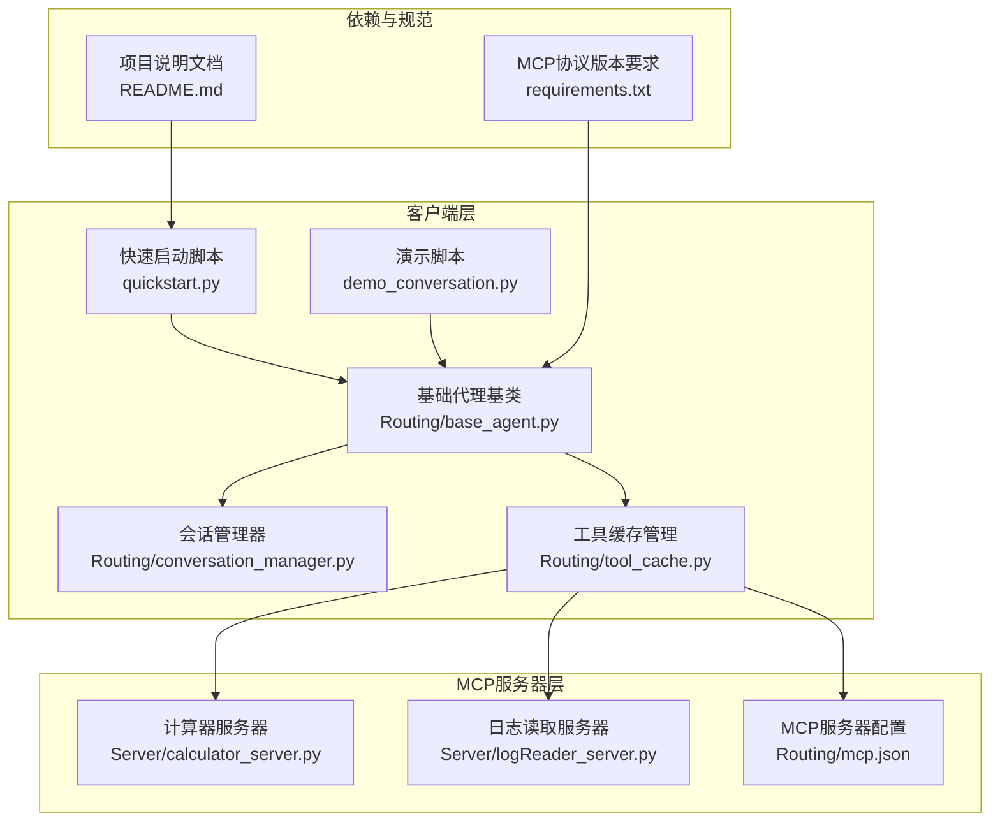
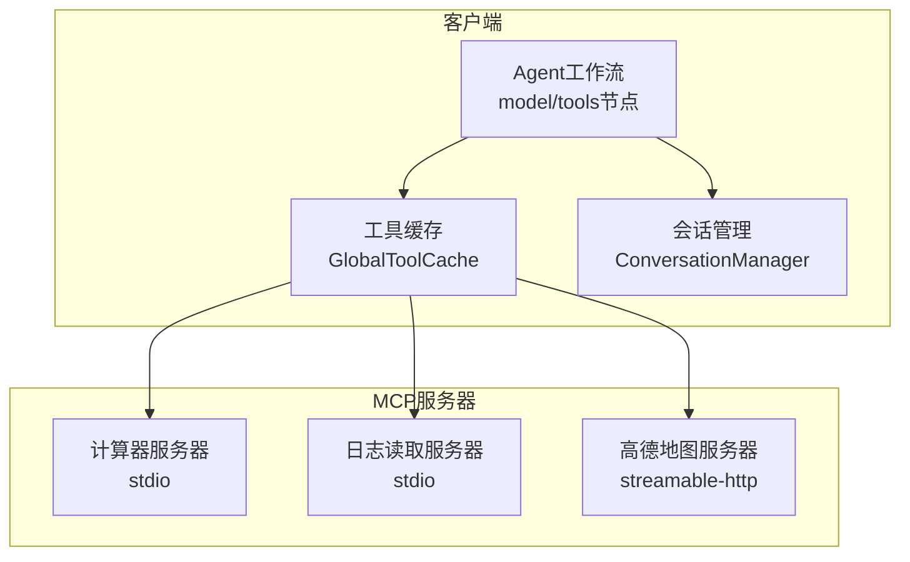
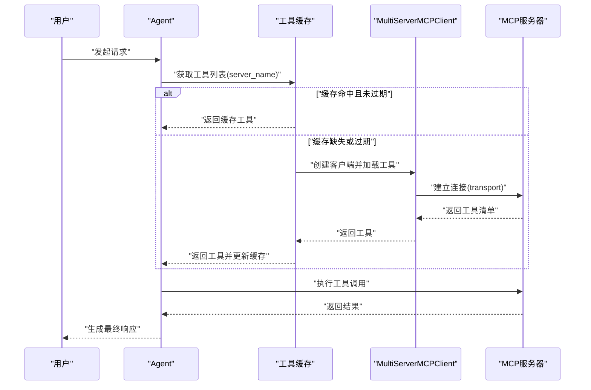
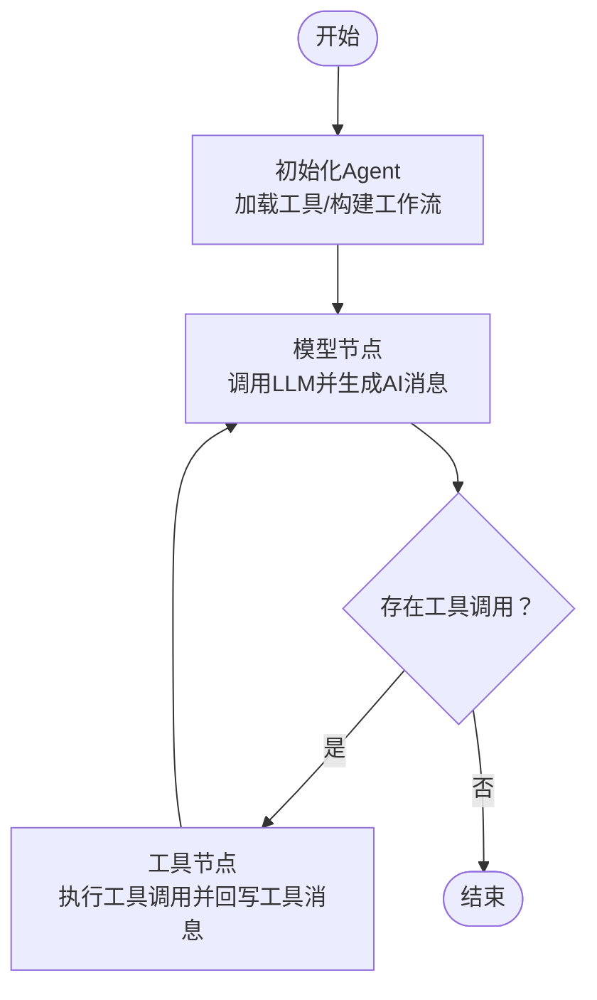
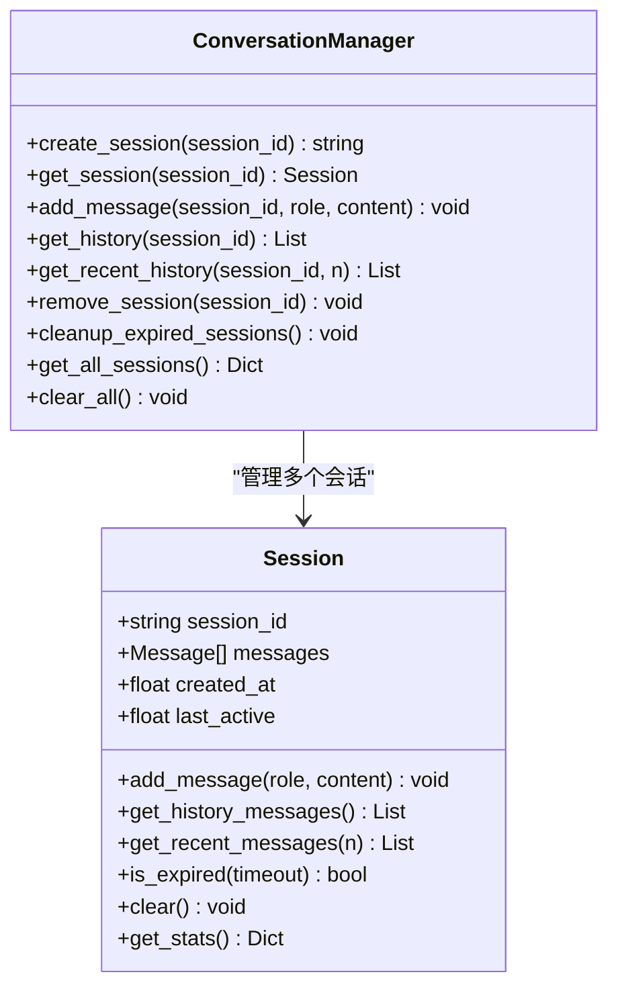
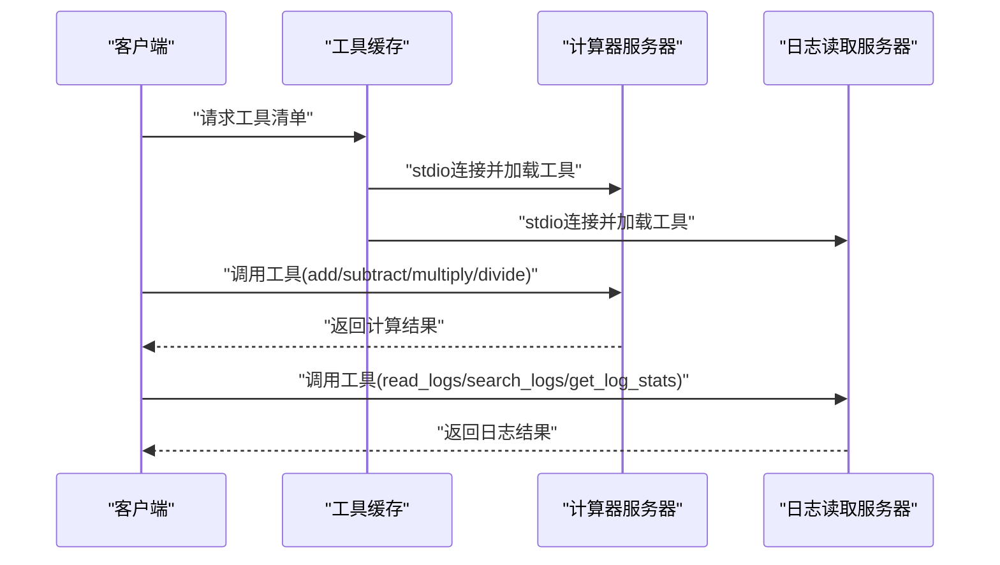
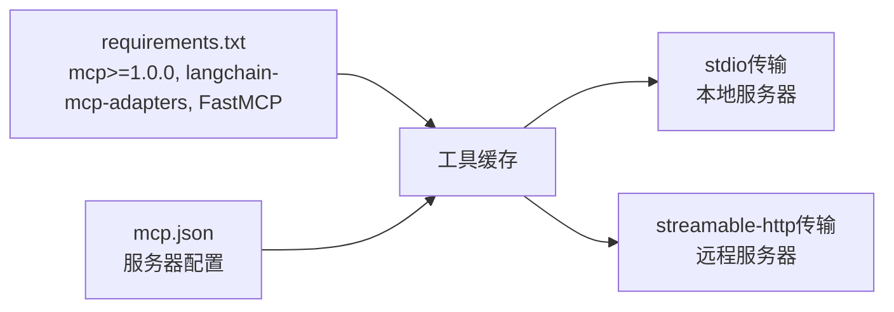

# MCP协议概述

<cite>
**本文档引用的文件**
- [README.md](file://README.md)
- [requirements.txt](file://requirements.txt)
- [mcp.json](file://Routing/mcp.json)
- [tool_cache.py](file://Routing/tool_cache.py)
- [base_agent.py](file://Routing/base_agent.py)
- [conversation_manager.py](file://Routing/conversation_manager.py)
- [calculator_server.py](file://Server/calculator_server.py)
- [logReader_server.py](file://Server/logReader_server.py)
- [quickstart.py](file://quickstart.py)
- [demo_conversation.py](file://demo_conversation.py)
</cite>

## 目录
1. [引言](#引言)
2. [项目结构](#项目结构)
3. [核心组件](#核心组件)
4. [架构总览](#架构总览)
5. [详细组件分析](#详细组件分析)
6. [依赖关系分析](#依赖关系分析)
7. [性能考虑](#性能考虑)
8. [故障排除指南](#故障排除指南)
9. [结论](#结论)
10. [附录](#附录)

## 引言
本项目基于 Model Context Protocol（MCP）构建了一个智能代理系统，通过标准化协议将大语言模型（LLM）与外部工具/数据源连接起来。系统支持动态工具加载、多服务器协作、会话管理与缓存优化，适用于复杂业务场景下的智能问答与自动化任务执行。

## 项目结构
项目采用模块化组织，围绕“客户端代理”和“MCP服务器”两大层面展开，同时提供会话管理、工具缓存、路由与测试等支撑模块。

**图表来源**
- [quickstart.py:1-68](file://quickstart.py#L1-L68)
- [demo_conversation.py:1-102](file://demo_conversation.py#L1-L102)
- [base_agent.py:1-497](file://Routing/base_agent.py#L1-L497)
- [conversation_manager.py:1-275](file://Routing/conversation_manager.py#L1-L275)
- [tool_cache.py:1-302](file://Routing/tool_cache.py#L1-L302)
- [calculator_server.py:1-111](file://Server/calculator_server.py#L1-L111)
- [logReader_server.py:1-151](file://Server/logReader_server.py#L1-L151)
- [mcp.json:1-29](file://Routing/mcp.json#L1-L29)
- [requirements.txt:1-17](file://requirements.txt#L1-L17)
- [README.md:1-125](file://README.md#L1-L125)

**章节来源**
- [README.md:1-125](file://README.md#L1-L125)
- [requirements.txt:1-17](file://requirements.txt#L1-L17)

## 核心组件
- 客户端代理体系：基于LangGraph的工作流，封装模型节点、工具节点与路由逻辑，支持统一的状态管理与错误处理。
- 工具缓存与会话管理：全局工具缓存减少重复连接与加载；会话管理器支持多轮对话与历史上下文持久化。
- MCP服务器：提供计算器与日志读取等工具，支持stdio与streamable-http两种传输方式。
- 配置与依赖：通过mcp.json集中管理服务器配置，requirements.txt声明MCP协议版本与相关依赖。

**章节来源**
- [base_agent.py:19-318](file://Routing/base_agent.py#L19-L318)
- [tool_cache.py:27-298](file://Routing/tool_cache.py#L27-L298)
- [conversation_manager.py:18-275](file://Routing/conversation_manager.py#L18-L275)
- [mcp.json:1-29](file://Routing/mcp.json#L1-L29)
- [requirements.txt:1-17](file://requirements.txt#L1-L17)

## 架构总览
系统采用“客户端代理 + 工具缓存 + 多MCP服务器”的分层架构。客户端代理通过工具缓存动态发现并绑定MCP工具，结合会话管理实现多轮对话；MCP服务器通过stdio或streamable-http暴露工具接口。

**图表来源**
- [base_agent.py:102-256](file://Routing/base_agent.py#L102-L256)
- [tool_cache.py:85-243](file://Routing/tool_cache.py#L85-L243)
- [calculator_server.py:108-111](file://Server/calculator_server.py#L108-L111)
- [logReader_server.py:148-151](file://Server/logReader_server.py#L148-L151)
- [mcp.json:1-29](file://Routing/mcp.json#L1-L29)

## 详细组件分析

### 工具缓存与多服务器加载
- 缓存策略：按服务器名称分组缓存工具列表，支持TTL过期与会话复用。
- 传输适配：支持stdio与streamable-http两种传输方式，分别对应本地进程与HTTP长连接。
- 连接生命周期：缓存中保存会话句柄，确保工具调用期间连接稳定；清理阶段统一关闭。

**图表来源**
- [tool_cache.py:85-243](file://Routing/tool_cache.py#L85-L243)
- [mcp.json:1-29](file://Routing/mcp.json#L1-L29)

**章节来源**
- [tool_cache.py:85-243](file://Routing/tool_cache.py#L85-L243)
- [mcp.json:1-29](file://Routing/mcp.json#L1-L29)

### 基础代理与工作流
- 状态模型：统一的AgentState包含消息队列、当前步骤、工具调用与结果、最终响应与错误字段。
- 节点职责：
  - 模型节点：注入系统提示词，调用LLM并接收AI消息（可能包含工具调用）。
  - 工具节点：解析AI消息中的工具调用，从缓存中查找工具并执行，构造工具消息回写状态。
- 路由逻辑：模型节点根据是否存在工具调用决定跳转至工具节点或结束；工具节点执行完成后回到模型节点处理结果。

**图表来源**
- [base_agent.py:19-318](file://Routing/base_agent.py#L19-L318)

**章节来源**
- [base_agent.py:19-318](file://Routing/base_agent.py#L19-L318)

### 会话管理与上下文保持
- 会话对象：记录消息历史、创建时间、活跃时间与过期策略，支持内存与Redis双层持久化。
- 接口能力：创建/获取/追加消息、获取历史/近期消息、清理过期会话、统计信息查询。
- 多轮对话：通过会话ID关联消息序列，配合Agent工作流实现上下文延续。

**图表来源**
- [conversation_manager.py:35-275](file://Routing/conversation_manager.py#L35-L275)

**章节来源**
- [conversation_manager.py:35-275](file://Routing/conversation_manager.py#L35-L275)

### MCP服务器实现（示例）
- 计算器服务器：提供加减乘除工具，通过stdio传输方式运行，工具方法装饰器注册为MCP工具。
- 日志读取服务器：提供读取最新日志、按关键词搜索与统计信息查询等工具，同样通过stdio传输。

**图表来源**
- [calculator_server.py:16-111](file://Server/calculator_server.py#L16-L111)
- [logReader_server.py:18-151](file://Server/logReader_server.py#L18-L151)
- [tool_cache.py:141-197](file://Routing/tool_cache.py#L141-L197)

**章节来源**
- [calculator_server.py:1-111](file://Server/calculator_server.py#L1-L111)
- [logReader_server.py:1-151](file://Server/logReader_server.py#L1-L151)

### 快速启动与演示
- 快速启动：创建Agent、显示可用工具、执行示例对话，验证工具加载与调用链路。
- 演示脚本：展示工具缓存机制、多轮对话上下文保持与会话管理功能。

**章节来源**
- [quickstart.py:1-68](file://quickstart.py#L1-L68)
- [demo_conversation.py:1-102](file://demo_conversation.py#L1-L102)

## 依赖关系分析
- 协议版本：MCP协议版本要求≥1.0.0，langchain-mcp-adapters与FastMCP提供适配与运行时支持。
- 传输协议：stdio用于本地进程间通信，streamable-http用于HTTP长连接，二者在工具缓存中统一处理。
- 配置驱动：mcp.json集中声明服务器URL、命令与参数、传输类型，工具缓存据此建立连接。

**图表来源**
- [requirements.txt:1-17](file://requirements.txt#L1-L17)
- [mcp.json:1-29](file://Routing/mcp.json#L1-L29)
- [tool_cache.py:134-243](file://Routing/tool_cache.py#L134-L243)

**章节来源**
- [requirements.txt:1-17](file://requirements.txt#L1-L17)
- [mcp.json:1-29](file://Routing/mcp.json#L1-L29)
- [tool_cache.py:134-243](file://Routing/tool_cache.py#L134-L243)

## 性能考虑
- 工具缓存：避免重复加载与连接，显著降低冷启动开销；TTL策略平衡新鲜度与性能。
- 传输选择：stdio适合本地低延迟场景；streamable-http适合跨网络与远程服务，注意超时与重试策略。
- 会话持久化：Redis持久化可提升多实例部署下的会话一致性与可用性。
- 并发与清理：工具缓存与会话管理在清理阶段统一关闭连接，防止资源泄漏。

## 故障排除指南
- 工具加载失败：检查mcp.json中服务器配置与传输类型，确认stdio命令路径与参数正确，或streamable-http URL与API密钥有效。
- 连接超时：增大超时阈值或检查网络连通性；streamable-http场景建议增加重试与降级策略。
- 缓存异常：清理过期缓存并重建会话；确认环境变量（如AMAP_API_KEY）已正确配置。
- 会话丢失：启用Redis持久化或调整会话超时策略；定期清理过期会话。

**章节来源**
- [tool_cache.py:212-242](file://Routing/tool_cache.py#L212-L242)
- [mcp.json:1-29](file://Routing/mcp.json#L1-L29)

## 结论
本项目以MCP协议为核心，构建了可扩展、可维护的智能代理系统。通过工具缓存与会话管理，系统实现了高效的动态工具加载与多轮对话上下文保持；通过多服务器支持与标准化传输，系统具备良好的可扩展性与跨平台能力。对于初学者，建议从快速启动与演示脚本入手；对于高级用户，可在工具缓存策略、传输协议与会话持久化方面进一步优化。

## 附录

### MCP协议在智能代理系统中的作用与价值
- 标准化接口：统一工具暴露与调用方式，降低集成成本。
- 动态能力：按需加载工具，支持灵活的功能组合与扩展。
- 可观测性：通过工具调用与结果回写，便于审计与调试。
- 多服务器协作：支持本地与远程工具的混合编排，满足复杂业务需求。

### 与其他AI工具协议的区别与优势
- 相比传统REST API：MCP提供面向工具的抽象，更贴合LLM的工具调用范式。
- 相比LangChain工具：MCP强调协议标准与跨语言/跨进程能力，适配更广泛的工具生态。
- 相比自定义适配器：MCP协议版本与适配器库提供一致的开发体验与升级路径。

### 消息格式、通信流程与状态管理
- 消息格式：人类消息、AI消息（可能包含工具调用）、工具消息；状态包含消息队列与工具调用/结果。
- 通信流程：客户端代理通过工具缓存获取工具→LLM生成AI消息→工具节点执行→回写工具消息→模型节点处理结果。
- 状态管理：统一AgentState与会话管理器，确保多轮对话的上下文一致性。

### 协议版本兼容性与升级策略
- 版本要求：MCP协议≥1.0.0，langchain-mcp-adapters与FastMCP提供配套支持。
- 升级策略：遵循语义化版本，优先在测试环境验证工具兼容性；通过工具缓存的TTL与清理机制降低升级风险。

### 多服务器协作的应用场景与最佳实践
- 应用场景：本地计算工具（计算器）、日志分析工具、远程地图服务、RAG知识检索等。
- 最佳实践：
  - 使用mcp.json集中管理服务器配置；
  - 在工具缓存中设置合理的TTL与超时；
  - 对远程HTTP服务器启用重试与降级；
  - 利用会话管理器实现多轮对话与上下文保持；
  - 在生产环境启用Redis持久化以提升可靠性。