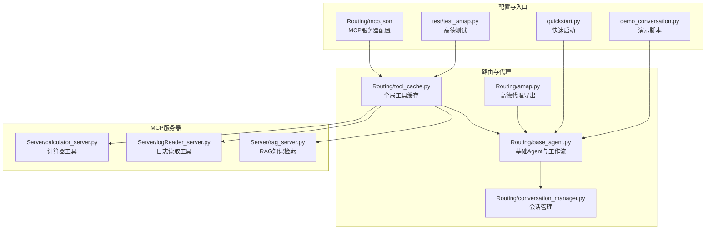
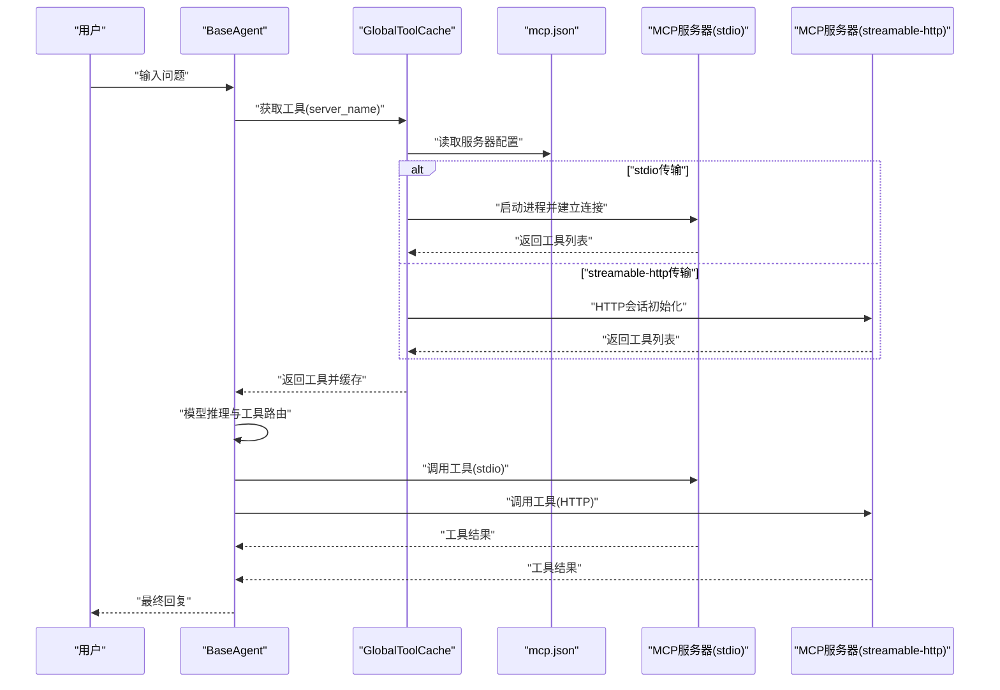
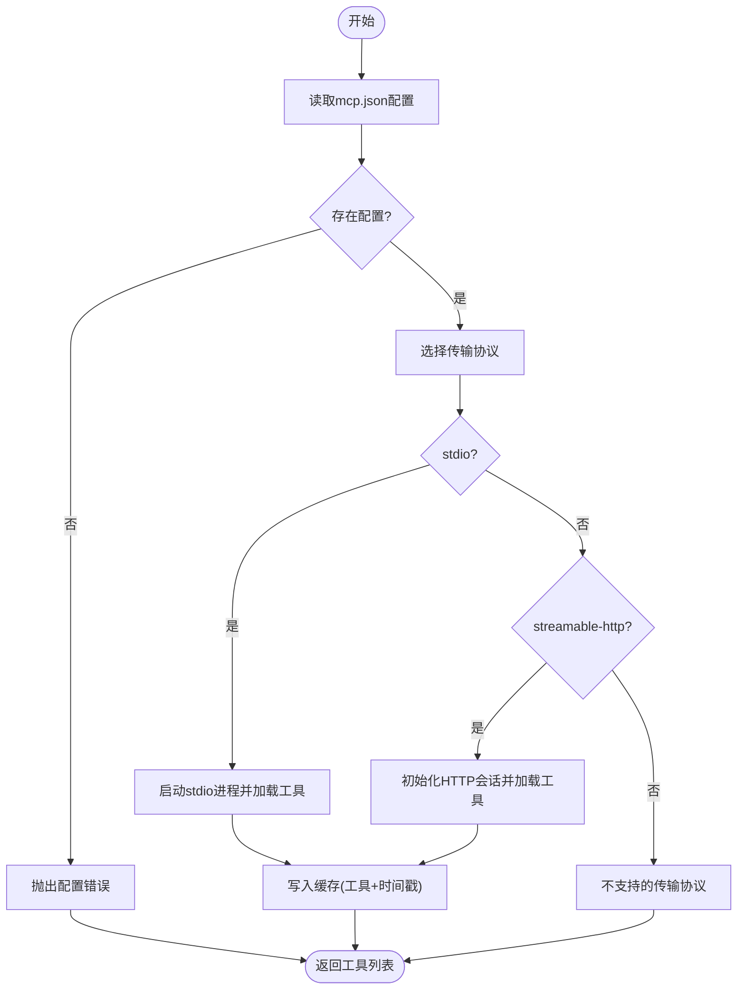
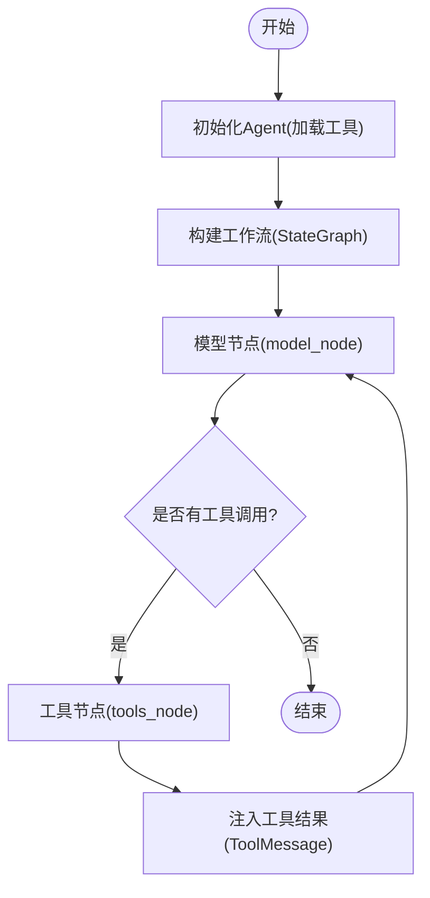
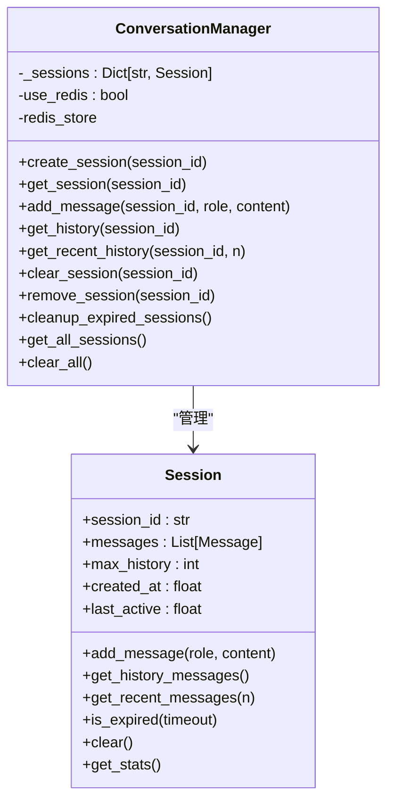
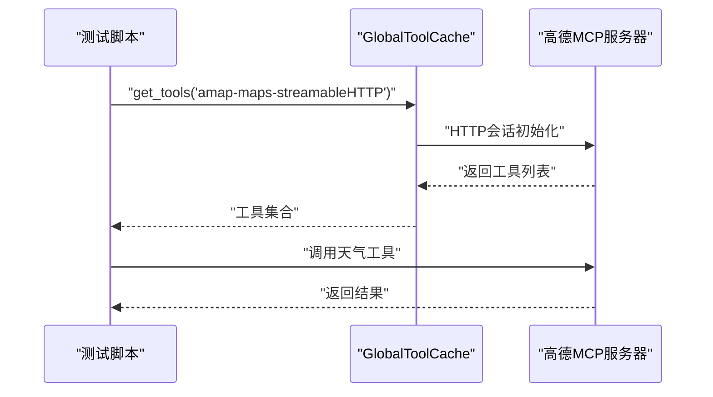
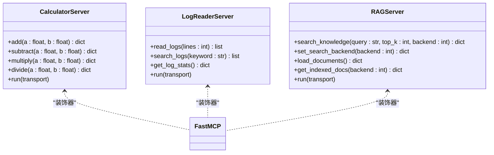
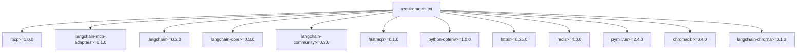

# MCP协议集成

<cite>
**本文档引用的文件**
- [README.md](file://README.md)
- [requirements.txt](file://requirements.txt)
- [Routing/mcp.json](file://Routing/mcp.json)
- [Routing/tool_cache.py](file://Routing/tool_cache.py)
- [Routing/base_agent.py](file://Routing/base_agent.py)
- [Routing/conversation_manager.py](file://Routing/conversation_manager.py)
- [Routing/amap.py](file://Routing/amap.py)
- [Server/calculator_server.py](file://Server/calculator_server.py)
- [Server/logReader_server.py](file://Server/logReader_server.py)
- [Server/rag_server.py](file://Server/rag_server.py)
- [quickstart.py](file://quickstart.py)
- [demo_conversation.py](file://demo_conversation.py)
- [test/test_amap.py](file://test/test_amap.py)
</cite>

## 目录
1. [简介](#简介)
2. [项目结构](#项目结构)
3. [核心组件](#核心组件)
4. [架构总览](#架构总览)
5. [详细组件分析](#详细组件分析)
6. [依赖分析](#依赖分析)
7. [性能考虑](#性能考虑)
8. [故障排除指南](#故障排除指南)
9. [结论](#结论)
10. [附录](#附录)

## 简介
本项目基于 Model Context Protocol（MCP）协议，构建了一个可扩展的智能代理系统。系统通过标准化协议连接大模型与外部工具/数据源，支持动态工具加载、多服务器协作、高德地图服务集成、RAG知识检索、日志分析与计算器等多种能力。项目采用LangGraph与LangChain生态，结合FastMCP与langchain-mcp-adapters，实现了稳定高效的MCP工具加载与调用流程。

## 项目结构
项目采用模块化组织，围绕“路由与代理”“MCP服务器”“会话管理”“测试与演示”四个维度展开：
- 路由与代理：Routing目录包含工具缓存、基础Agent、会话管理等核心逻辑
- MCP服务器：Server目录包含计算器、日志读取、RAG知识库等MCP工具服务
- 配置与依赖：mcp.json定义MCP服务器清单；requirements.txt声明运行依赖
- 快速开始与演示：quickstart.py提供快速体验；demo_conversation.py演示工具缓存与多轮对话
- 测试：test目录包含高德地图工具加载与调用的测试脚本

**图表来源**
- [Routing/tool_cache.py:1-302](file://Routing/tool_cache.py#L1-L302)
- [Routing/base_agent.py:1-497](file://Routing/base_agent.py#L1-L497)
- [Routing/conversation_manager.py:1-275](file://Routing/conversation_manager.py#L1-L275)
- [Routing/amap.py:1-11](file://Routing/amap.py#L1-L11)
- [Routing/mcp.json:1-29](file://Routing/mcp.json#L1-L29)
- [Server/calculator_server.py:1-111](file://Server/calculator_server.py#L1-L111)
- [Server/logReader_server.py:1-151](file://Server/logReader_server.py#L1-L151)
- [Server/rag_server.py:1-363](file://Server/rag_server.py#L1-L363)
- [quickstart.py:1-68](file://quickstart.py#L1-L68)
- [demo_conversation.py:1-102](file://demo_conversation.py#L1-L102)
- [test/test_amap.py:1-68](file://test/test_amap.py#L1-L68)

**章节来源**
- [README.md:1-125](file://README.md#L1-L125)
- [Routing/mcp.json:1-29](file://Routing/mcp.json#L1-L29)

## 核心组件
- 全局工具缓存（GlobalToolCache）：负责MCP服务器的发现、连接、工具加载与缓存，支持stdio与streamable-http两种传输协议，具备TTL过期与线程安全机制
- 基础Agent（BaseAgent）：统一抽象Agent的初始化、模型绑定工具、工作流构建与执行，支持多轮对话与工具调用路由
- 会话管理（ConversationManager）：管理多轮对话上下文，支持内存与Redis持久化，提供会话生命周期管理
- MCP服务器：计算器、日志读取、RAG知识库等工具服务，通过FastMCP装饰器暴露工具接口

**章节来源**
- [Routing/tool_cache.py:39-302](file://Routing/tool_cache.py#L39-L302)
- [Routing/base_agent.py:29-318](file://Routing/base_agent.py#L29-L318)
- [Routing/conversation_manager.py:82-275](file://Routing/conversation_manager.py#L82-L275)
- [Server/calculator_server.py:1-111](file://Server/calculator_server.py#L1-L111)
- [Server/logReader_server.py:1-151](file://Server/logReader_server.py#L1-L151)
- [Server/rag_server.py:1-363](file://Server/rag_server.py#L1-L363)

## 架构总览
系统通过mcp.json配置MCP服务器，工具缓存根据配置选择stdio或streamable-http协议连接对应服务器，动态加载工具并注入到Agent的LLM模型中。Agent工作流包含模型节点与工具节点，根据模型输出的工具调用决定执行路径，最终将工具结果反馈给模型以生成最终回复。

**图表来源**
- [Routing/tool_cache.py:85-242](file://Routing/tool_cache.py#L85-L242)
- [Routing/mcp.json:1-29](file://Routing/mcp.json#L1-L29)
- [Routing/base_agent.py:102-217](file://Routing/base_agent.py#L102-L217)

**章节来源**
- [Routing/tool_cache.py:85-242](file://Routing/tool_cache.py#L85-L242)
- [Routing/base_agent.py:238-318](file://Routing/base_agent.py#L238-L318)
- [Routing/mcp.json:1-29](file://Routing/mcp.json#L1-L29)

## 详细组件分析

### 工具缓存与动态加载
- 配置发现：从mcp.json读取服务器清单，按名称匹配目标服务器配置
- 传输协议适配：stdio协议通过MultiServerMCPClient与StdioServerParameters启动外部进程；streamable-http协议通过streamable_http_client建立HTTP会话
- 缓存策略：以服务器名为键，存储工具列表与时间戳，支持TTL过期；过期后自动清理并重建连接
- 异常处理：连接超时、工具加载失败、HTTP会话异常均被捕获并抛出，保证Agent执行稳定性

**图表来源**
- [Routing/tool_cache.py:67-140](file://Routing/tool_cache.py#L67-L140)
- [Routing/tool_cache.py:141-242](file://Routing/tool_cache.py#L141-L242)

**章节来源**
- [Routing/tool_cache.py:67-242](file://Routing/tool_cache.py#L67-L242)
- [Routing/mcp.json:1-29](file://Routing/mcp.json#L1-L29)

### 基础Agent与工作流
- 初始化：延迟初始化，首次使用时从工具缓存加载工具并绑定到LLM
- 工作流：基于LangGraph的状态机，包含模型节点与工具节点，根据模型输出的工具调用决定路由
- 工具执行：将工具调用结果转换为ToolMessage并注入到消息序列，驱动模型继续推理
- 错误处理：捕获模型调用与工具执行异常，生成错误消息并终止流程

**图表来源**
- [Routing/base_agent.py:44-66](file://Routing/base_agent.py#L44-L66)
- [Routing/base_agent.py:102-217](file://Routing/base_agent.py#L102-L217)
- [Routing/base_agent.py:238-256](file://Routing/base_agent.py#L238-L256)

**章节来源**
- [Routing/base_agent.py:44-318](file://Routing/base_agent.py#L44-L318)

### 会话管理
- 单例模式：全局会话管理器，支持内存与Redis双层持久化
- 生命周期：创建、添加消息、获取历史、清理过期会话、删除会话
- 上下文：限制历史消息数量，支持最近N条消息获取，便于控制上下文长度

**图表来源**
- [Routing/conversation_manager.py:82-275](file://Routing/conversation_manager.py#L82-L275)

**章节来源**
- [Routing/conversation_manager.py:82-275](file://Routing/conversation_manager.py#L82-L275)

### 高德地图MCP服务集成
- 配置：mcp.json中定义amap-maps-streamableHTTP服务器，使用streamable-http传输
- 工具加载：通过工具缓存加载高德地图工具，测试脚本验证工具列表与调用
- 使用：Agent通过系统提示词引导，将用户问题转化为高德地图工具调用（如天气查询、路径规划等）

**图表来源**
- [test/test_amap.py:14-64](file://test/test_amap.py#L14-L64)
- [Routing/tool_cache.py:198-242](file://Routing/tool_cache.py#L198-L242)
- [Routing/mcp.json:3-6](file://Routing/mcp.json#L3-L6)

**章节来源**
- [Routing/mcp.json:1-29](file://Routing/mcp.json#L1-L29)
- [test/test_amap.py:1-68](file://test/test_amap.py#L1-L68)

### MCP服务器开发指南
- 接口规范：使用FastMCP装饰器声明工具函数，明确参数类型与返回结构
- 消息格式：工具返回应包含可被模型消费的字段（如结果值、元数据等）
- 错误处理：对异常场景返回结构化错误信息，便于上层Agent处理
- 传输协议：stdio适用于本地工具；streamable-http适用于远程服务

**图表来源**
- [Server/calculator_server.py:1-111](file://Server/calculator_server.py#L1-L111)
- [Server/logReader_server.py:1-151](file://Server/logReader_server.py#L1-L151)
- [Server/rag_server.py:1-363](file://Server/rag_server.py#L1-L363)

**章节来源**
- [Server/calculator_server.py:1-111](file://Server/calculator_server.py#L1-L111)
- [Server/logReader_server.py:1-151](file://Server/logReader_server.py#L1-L151)
- [Server/rag_server.py:1-363](file://Server/rag_server.py#L1-L363)

## 依赖分析
项目依赖MCP生态与LangChain生态的关键组件，确保MCP协议的工具加载与模型推理无缝衔接。

**图表来源**
- [requirements.txt:1-17](file://requirements.txt#L1-L17)

**章节来源**
- [requirements.txt:1-17](file://requirements.txt#L1-L17)

## 性能考虑
- 工具缓存：避免重复加载MCP服务器工具，显著降低冷启动延迟
- 传输协议：stdio适合本地低延迟工具；streamable-http适合远程服务，注意超时与重试
- 会话管理：限制历史消息数量，控制上下文长度，减少模型推理成本
- 并发与清理：工具缓存支持多服务器并发，过期后自动清理，防止资源泄漏

## 故障排除指南
- 环境变量缺失：AMAP_API_KEY未设置会导致高德地图工具加载失败；DASHSCOPE_API_KEY影响LLM调用
- 配置文件错误：mcp.json格式错误或服务器名称不匹配会导致工具加载异常
- 连接超时：streamable-http连接超时（默认10秒）需检查网络与API密钥
- 工具调用失败：工具返回错误信息或模型无法解析结果时，查看工具缓存统计与会话历史
- 资源清理：对话结束后调用清理接口，确保会话与连接被释放

**章节来源**
- [Routing/tool_cache.py:217-242](file://Routing/tool_cache.py#L217-L242)
- [Routing/conversation_manager.py:267-271](file://Routing/conversation_manager.py#L267-L271)
- [test/test_amap.py:20-27](file://test/test_amap.py#L20-L27)

## 结论
本项目通过标准化的MCP协议，将多种外部工具与数据源整合进统一的智能代理框架。工具缓存、基础Agent与会话管理三者协同，既保证了系统的可扩展性，又提升了用户体验。高德地图、计算器、日志读取与RAG知识库等MCP服务器的集成，展示了MCP在实际业务场景中的强大能力。建议在生产环境中进一步完善监控与告警，优化缓存策略与超时配置，以获得更稳定的性能表现。

## 附录
- 快速开始：参考README与quickstart.py，配置环境变量后即可运行
- 演示脚本：demo_conversation.py展示工具缓存与多轮对话效果
- 测试用例：test/test_amap.py验证高德地图工具加载与调用流程

**章节来源**
- [README.md:51-78](file://README.md#L51-L78)
- [quickstart.py:1-68](file://quickstart.py#L1-L68)
- [demo_conversation.py:1-102](file://demo_conversation.py#L1-L102)
- [test/test_amap.py:1-68](file://test/test_amap.py#L1-L68)