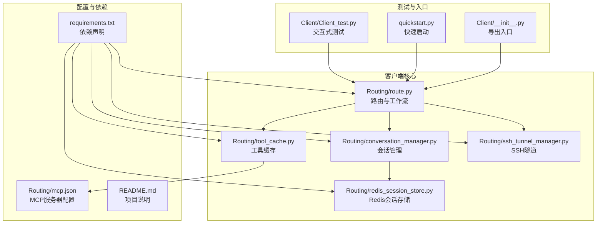
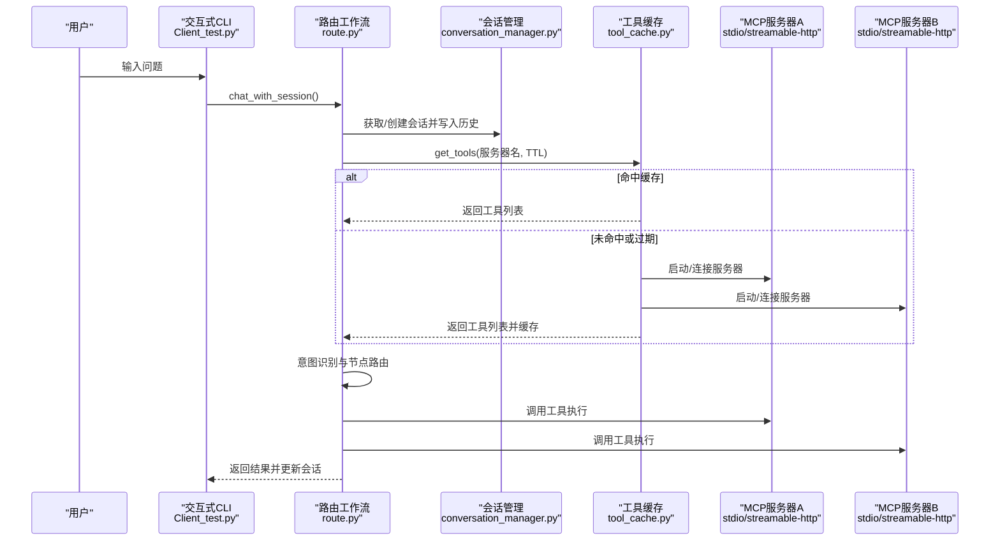
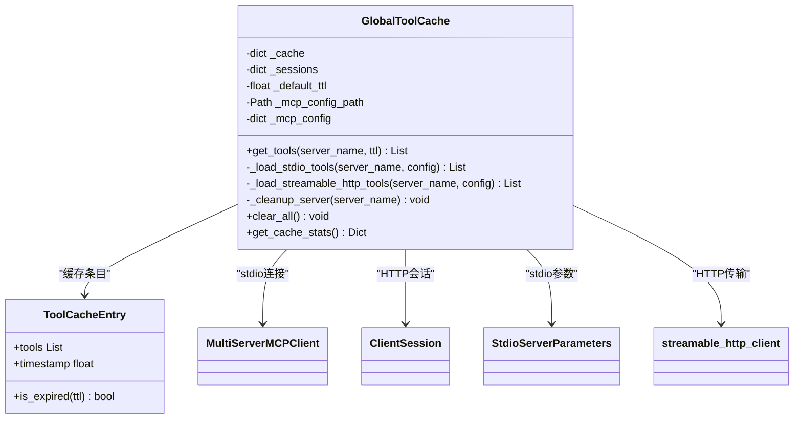
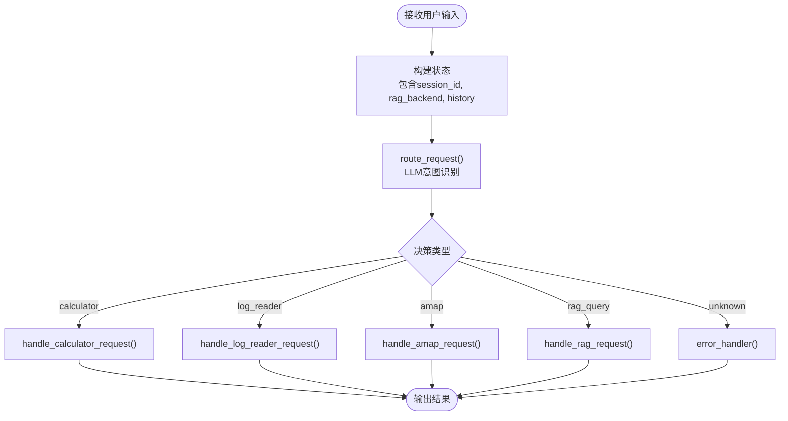
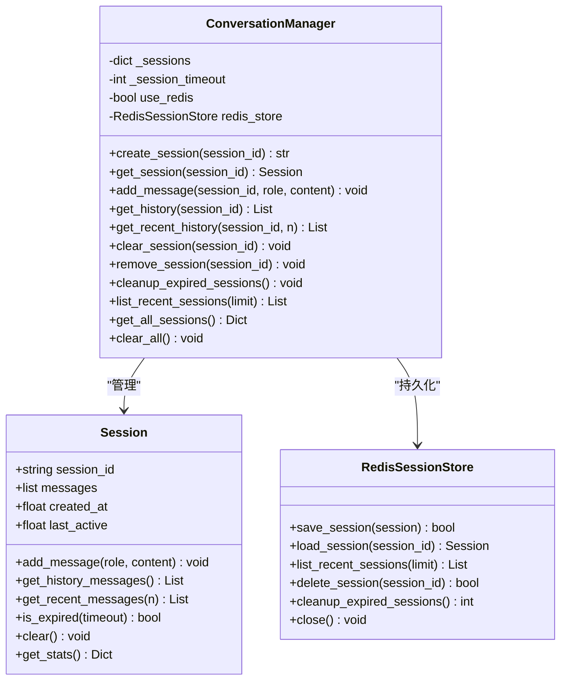
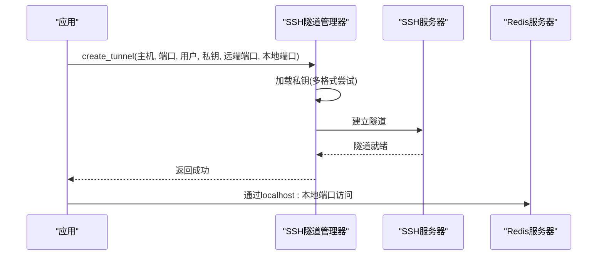
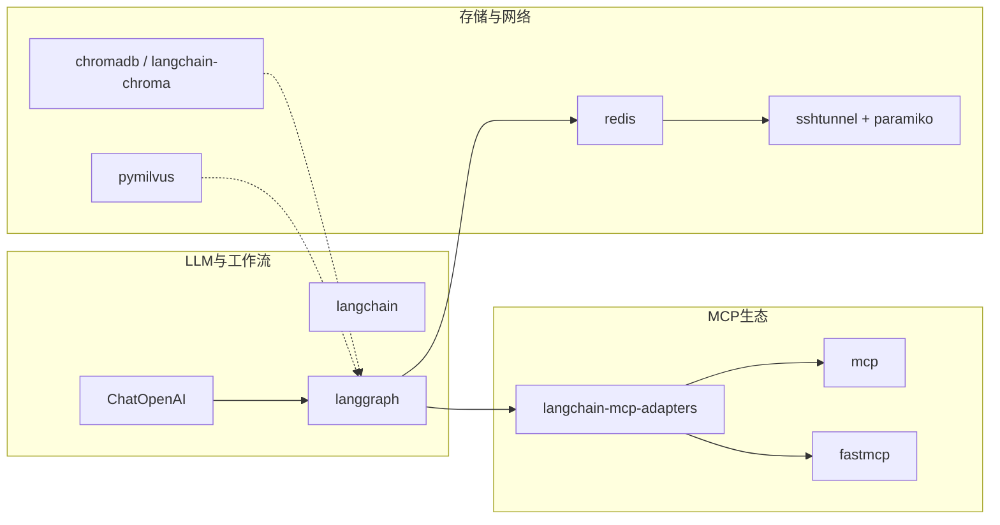

# MCP客户端集成

<cite>
**本文档引用的文件**
- [README.md](file://README.md)
- [requirements.txt](file://requirements.txt)
- [mcp.json](file://Routing/mcp.json)
- [tool_cache.py](file://Routing/tool_cache.py)
- [route.py](file://Routing/route.py)
- [conversation_manager.py](file://Routing/conversation_manager.py)
- [redis_session_store.py](file://Routing/redis_session_store.py)
- [ssh_tunnel_manager.py](file://Routing/ssh_tunnel_manager.py)
- [Client_test.py](file://Client/Client_test.py)
- [__init__.py](file://Client/__init__.py)
- [quickstart.py](file://quickstart.py)
</cite>

## 目录
1. [简介](#简介)
2. [项目结构](#项目结构)
3. [核心组件](#核心组件)
4. [架构总览](#架构总览)
5. [详细组件分析](#详细组件分析)
6. [依赖关系分析](#依赖关系分析)
7. [性能考虑](#性能考虑)
8. [故障排查指南](#故障排查指南)
9. [结论](#结论)
10. [附录](#附录)

## 简介
本文件面向希望集成和扩展MCP（Model Context Protocol）客户端的开发者，系统性阐述客户端如何发现、连接与管理MCP服务器，工具缓存机制的实现原理与性能优化策略，配置管理、连接池与重连机制，动态工具加载的工作流程与最佳实践，以及错误处理、超时管理与异常恢复机制。同时覆盖客户端与多个MCP服务器的并发处理与资源协调，以及调试与监控方法，帮助诊断连接问题。

## 项目结构
该项目采用模块化分层设计，围绕Routing路由模块、会话管理、工具缓存、SSH隧道与Redis持久化展开，形成“路由决策-工具加载-会话上下文-持久化存储”的闭环。

**图表来源**
- [route.py:1-553](file://Routing/route.py#L1-L553)
- [tool_cache.py:1-302](file://Routing/tool_cache.py#L1-L302)
- [conversation_manager.py:1-275](file://Routing/conversation_manager.py#L1-L275)
- [redis_session_store.py:1-228](file://Routing/redis_session_store.py#L1-L228)
- [ssh_tunnel_manager.py:1-100](file://Routing/ssh_tunnel_manager.py#L1-L100)
- [mcp.json:1-29](file://Routing/mcp.json#L1-L29)
- [requirements.txt:1-17](file://requirements.txt#L1-L17)
- [README.md:1-125](file://README.md#L1-L125)
- [Client_test.py:1-230](file://Client/Client_test.py#L1-L230)
- [__init__.py:1-12](file://Client/__init__.py#L1-L12)
- [quickstart.py:1-68](file://quickstart.py#L1-L68)

**章节来源**
- [README.md:1-125](file://README.md#L1-L125)
- [requirements.txt:1-17](file://requirements.txt#L1-L17)

## 核心组件
- 工具缓存与MCP服务器管理：负责从配置文件加载服务器信息，按传输协议（stdio/streamable-http）动态加载工具，维护TTL缓存与会话生命周期。
- 路由与工作流：基于LangGraph的状态机路由，结合会话历史进行意图识别与节点调度。
- 会话管理与持久化：内存会话对象与Redis持久化双层存储，支持过期清理与历史回放。
- SSH隧道与网络安全：通过SSH私钥认证建立本地到远端Redis的安全隧道。
- 测试与交互入口：提供交互式CLI与快速启动脚本，验证工具缓存与路由链路。

**章节来源**
- [tool_cache.py:1-302](file://Routing/tool_cache.py#L1-L302)
- [route.py:1-553](file://Routing/route.py#L1-L553)
- [conversation_manager.py:1-275](file://Routing/conversation_manager.py#L1-L275)
- [redis_session_store.py:1-228](file://Routing/redis_session_store.py#L1-L228)
- [ssh_tunnel_manager.py:1-100](file://Routing/ssh_tunnel_manager.py#L1-L100)
- [Client_test.py:1-230](file://Client/Client_test.py#L1-L230)
- [quickstart.py:1-68](file://quickstart.py#L1-L68)

## 架构总览
下图展示MCP客户端从用户输入到工具执行的端到端流程，包括工具缓存、路由决策、会话上下文与持久化存储。

**图表来源**
- [Client_test.py:1-230](file://Client/Client_test.py#L1-L230)
- [route.py:351-414](file://Routing/route.py#L351-L414)
- [conversation_manager.py:122-184](file://Routing/conversation_manager.py#L122-L184)
- [tool_cache.py:85-140](file://Routing/tool_cache.py#L85-L140)

## 详细组件分析

### 工具缓存与MCP服务器管理
- 配置驱动：通过mcp.json集中管理服务器清单，支持stdio与streamable-http两种传输协议。
- 动态加载：根据服务器配置选择启动参数或HTTP URL，使用MultiServerMCPClient或load_mcp_tools加载工具。
- TTL缓存：按服务器名缓存工具列表，默认5分钟；过期自动清理并重建连接。
- 会话管理：记录每个服务器的ClientSession或HTTP传输句柄，支持统一清理。
- 超时控制：HTTP连接设置10秒超时，避免阻塞。
- 错误处理：捕获并抛出异常，保证上层可观测性。

**图表来源**
- [tool_cache.py:27-298](file://Routing/tool_cache.py#L27-L298)

**章节来源**
- [tool_cache.py:1-302](file://Routing/tool_cache.py#L1-L302)
- [mcp.json:1-29](file://Routing/mcp.json#L1-L29)

### 路由与工作流
- 状态机：基于LangGraph构建StateGraph，包含路由节点、各工具节点与错误处理节点。
- 上下文构建：从会话管理器读取最近N轮消息，拼接成带历史的输入。
- 意图识别：调用LLM对SystemMessage+历史+当前输入进行分类，返回目标工具节点。
- 并发执行：LangGraph原生支持异步执行，工具节点可并行调用不同MCP服务器。

**图表来源**
- [route.py:149-256](file://Routing/route.py#L149-L256)

**章节来源**
- [route.py:1-553](file://Routing/route.py#L1-L553)

### 会话管理与持久化
- 内存会话：Session对象维护消息队列、创建时间与最后活跃时间，支持历史截断与过期检查。
- Redis持久化：RedisSessionStore将会话元数据与消息列表序列化存储，使用Hash、List与Sorted Set组织数据，支持活跃会话索引与历史列表。
- 双层加载：优先内存，缺失时从Redis加载并回填内存，提升读性能。
- 过期清理：定时清理超过1小时未活跃的会话，减少内存占用。

**图表来源**
- [conversation_manager.py:35-275](file://Routing/conversation_manager.py#L35-L275)
- [redis_session_store.py:14-228](file://Routing/redis_session_store.py#L14-L228)

**章节来源**
- [conversation_manager.py:1-275](file://Routing/conversation_manager.py#L1-L275)
- [redis_session_store.py:1-228](file://Routing/redis_session_store.py#L1-L228)

### SSH隧道与网络安全
- 私钥加载：支持RSA、ECDSA、Ed25519三种常见SSH密钥格式，自动探测可用类型。
- 隧道建立：将本地端口转发到远端Redis，实现内网安全访问。
- 异常处理：密钥文件不存在、隧道启动失败等场景均有明确错误提示与降级策略。

**图表来源**
- [ssh_tunnel_manager.py:19-81](file://Routing/ssh_tunnel_manager.py#L19-L81)

**章节来源**
- [ssh_tunnel_manager.py:1-100](file://Routing/ssh_tunnel_manager.py#L1-L100)

### 测试与交互入口
- 交互式CLI：支持连续对话、会话管理命令、工具缓存统计、RAG后端切换等。
- 快速启动：演示Agent创建、工具枚举与示例对话。
- 资源清理：统一清理工具缓存、会话、Redis连接与SSH隧道，避免资源泄漏。

**章节来源**
- [Client_test.py:1-230](file://Client/Client_test.py#L1-L230)
- [quickstart.py:1-68](file://quickstart.py#L1-L68)
- [__init__.py:1-12](file://Client/__init__.py#L1-L12)

## 依赖关系分析
- MCP生态：langchain-mcp-adapters、mcp、fastmcp提供MCP客户端能力与适配。
- LLM与LangGraph：ChatOpenAI、LangGraph构建路由工作流。
- 存储与网络：redis、sshtunnel、paramiko支撑会话持久化与安全隧道。
- 向量化检索：chromadb、langchain-chroma、pymilvus支持RAG后端切换。

**图表来源**
- [requirements.txt:1-17](file://requirements.txt#L1-L17)
- [route.py:154-159](file://Routing/route.py#L154-L159)

**章节来源**
- [requirements.txt:1-17](file://requirements.txt#L1-L17)

## 性能考虑
- 工具缓存TTL：默认5分钟，平衡新鲜度与性能；可根据工具变更频率调整。
- 连接复用：stdio与HTTP会话在GlobalToolCache中复用，避免重复启动/握手。
- 异步执行：LangGraph与asyncio原生支持，工具节点可并行执行。
- 会话截断：Session仅保留最近N轮消息，降低LLM上下文开销。
- Redis批量操作：消息列表使用LPUSH/RPOP批量写入，减少网络往返。
- 超时控制：HTTP连接10秒超时，防止阻塞影响整体吞吐。
- 过期清理：定期清理内存与Redis中的过期会话，释放资源。

[本节为通用性能建议，无需特定文件引用]

## 故障排查指南
- 工具加载失败
  - 检查mcp.json中服务器配置与传输协议是否正确。
  - 确认stdio命令与参数可执行且路径正确。
  - 检查streamable-http URL与AMAP_API_KEY环境变量。
  - 观察工具缓存统计，确认缓存命中与活跃会话数。
- 连接超时
  - HTTP连接默认10秒超时，必要时调整或增加重试。
  - 检查网络连通性与防火墙策略。
- 会话异常
  - 使用info命令查看会话统计；使用clear命令清空历史。
  - 检查Redis连接配置与隧道状态。
- 资源泄漏
  - 应用退出时调用cleanup_all，确保工具缓存、会话、Redis与SSH隧道被清理。

**章节来源**
- [tool_cache.py:217-242](file://Routing/tool_cache.py#L217-L242)
- [route.py:434-456](file://Routing/route.py#L434-L456)
- [Client_test.py:202-216](file://Client/Client_test.py#L202-L216)

## 结论
该MCP客户端集成方案通过“配置驱动的工具缓存、LangGraph路由工作流、内存+Redis双层会话管理、SSH隧道安全访问”实现了稳定高效的多服务器工具调用链路。其TTL缓存、异步执行与过期清理等机制在保证实时性的同时兼顾性能与资源管理。配合完善的错误处理与清理流程，能够满足生产环境的可靠性要求。

[本节为总结性内容，无需特定文件引用]

## 附录

### MCP服务器配置示例
- stdio：本地Python脚本作为MCP服务器，支持命令与参数替换。
- streamable-http：通过URL与AMAP API Key访问远程MCP服务。

**章节来源**
- [mcp.json:1-29](file://Routing/mcp.json#L1-L29)

### 关键API与流程路径
- 交互式对话与缓存统计：[Client_test.py:149-157](file://Client/Client_test.py#L149-L157)
- 路由与工作流执行：[route.py:351-414](file://Routing/route.py#L351-L414)
- 工具缓存加载与清理：[tool_cache.py:85-140](file://Routing/tool_cache.py#L85-L140)
- 会话创建与持久化：[conversation_manager.py:122-184](file://Routing/conversation_manager.py#L122-L184)
- SSH隧道建立与关闭：[ssh_tunnel_manager.py:19-81](file://Routing/ssh_tunnel_manager.py#L19-L81)