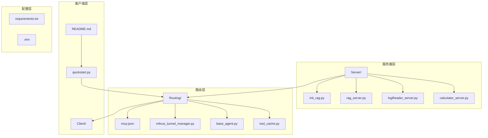
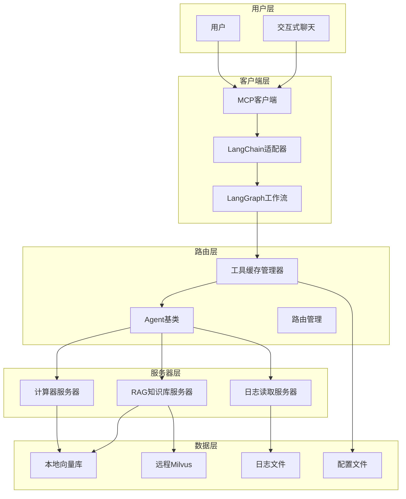
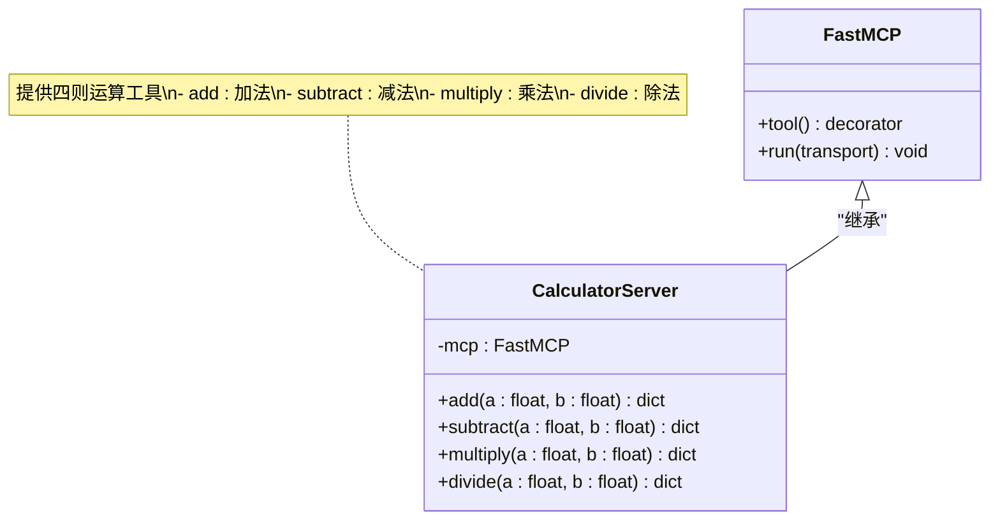
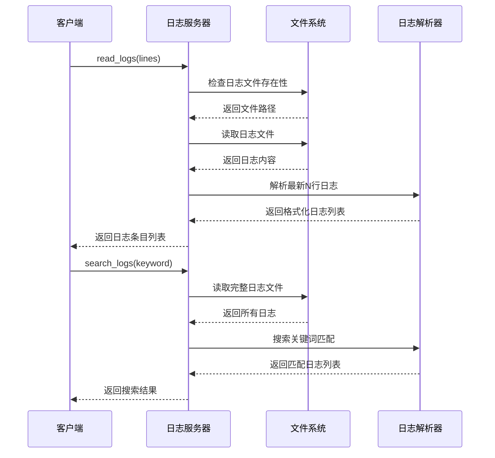
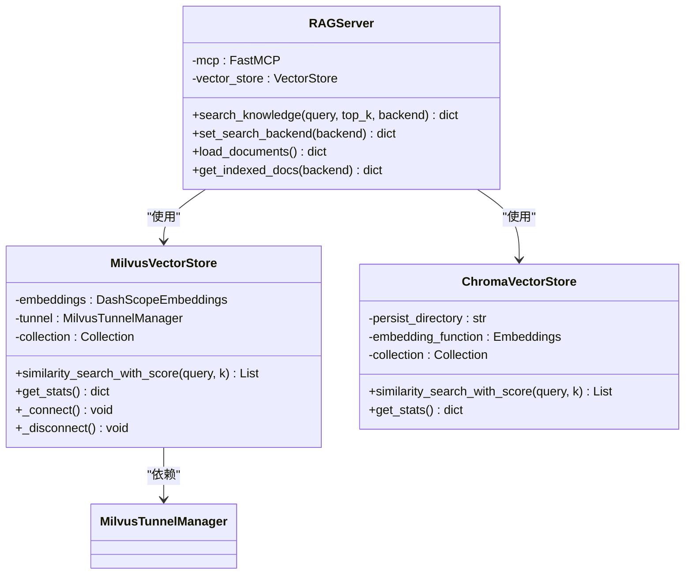
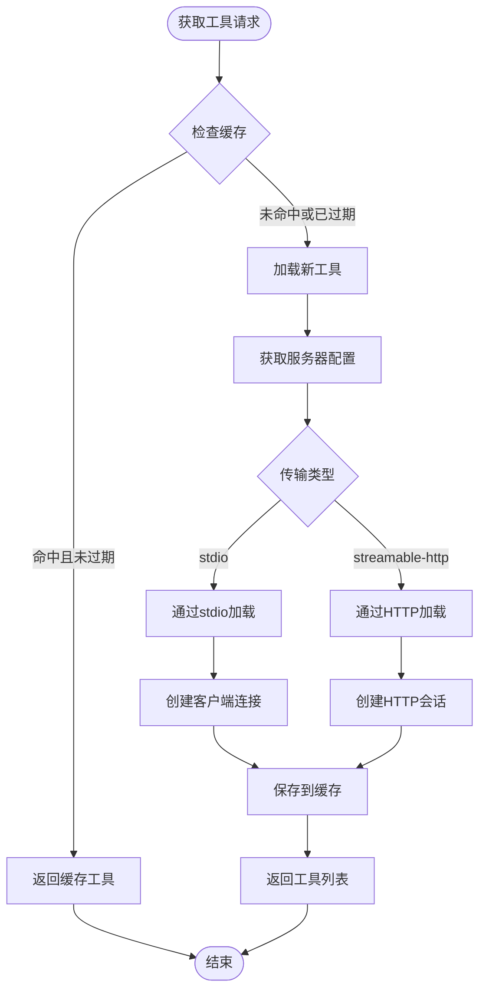
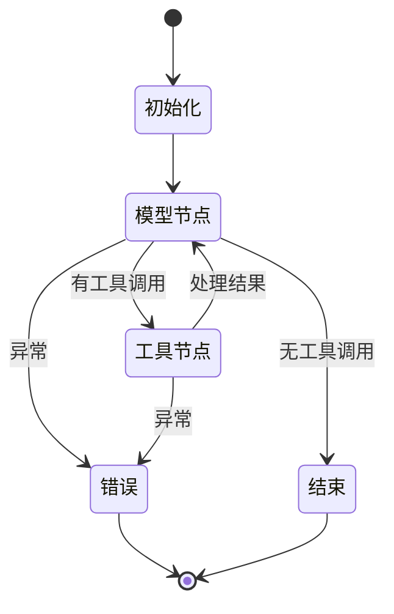
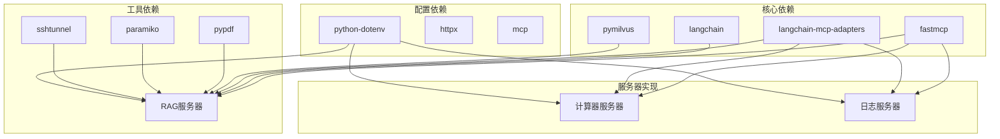

# MCP服务器实现

<cite>
**本文档引用的文件**
- [Server/__init__.py](file://Server/__init__.py)
- [Server/calculator_server.py](file://Server/calculator_server.py)
- [Server/logReader_server.py](file://Server/logReader_server.py)
- [Server/rag_server.py](file://Server/rag_server.py)
- [Server/init_rag.py](file://Server/init_rag.py)
- [Routing/tool_cache.py](file://Routing/tool_cache.py)
- [Routing/base_agent.py](file://Routing/base_agent.py)
- [Routing/calculator.py](file://Routing/calculator.py)
- [Routing/log_reader.py](file://Routing/log_reader.py)
- [Routing/rag_agent.py](file://Routing/rag_agent.py)
- [Routing/milvus_tunnel_manager.py](file://Routing/milvus_tunnel_manager.py)
- [Routing/mcp.json](file://Routing/mcp.json)
- [requirements.txt](file://requirements.txt)
- [README.md](file://README.md)
- [quickstart.py](file://quickstart.py)
</cite>

## 目录
1. [简介](#简介)
2. [项目结构](#项目结构)
3. [核心组件](#核心组件)
4. [架构总览](#架构总览)
5. [详细组件分析](#详细组件分析)
6. [依赖关系分析](#依赖关系分析)
7. [性能考虑](#性能考虑)
8. [故障排除指南](#故障排除指南)
9. [结论](#结论)
10. [附录](#附录)

## 简介
本项目实现了基于 Model Context Protocol (MCP) 的多服务器架构，通过标准化协议将 AI 模型与外部工具/数据源连接起来。系统包含三个核心 MCP 服务器：计算器服务器、日志读取服务器和 RAG 知识库服务器，配合全局工具缓存管理器和 Agent 工作流引擎，形成完整的智能代理系统。

该系统采用模块化设计，支持多种传输协议（stdio、streamable-http），具备良好的扩展性和可维护性。通过 LangChain MCP 适配器实现动态工具加载，支持高德地图、计算器、日志读取、RAG 知识库等多种功能。

## 项目结构
项目采用功能模块化组织，主要目录结构如下：

**图表来源**
- [Server/__init__.py](file://Server/__init__.py)
- [Routing/tool_cache.py](file://Routing/tool_cache.py)
- [Routing/mcp.json](file://Routing/mcp.json)

**章节来源**
- [README.md:1-125](file://README.md#L1-L125)

## 核心组件
系统的核心组件包括 MCP 服务器、工具缓存管理器、Agent 工作流引擎和配置管理。

### MCP 服务器
- **计算器服务器**：提供加减乘除四则运算功能
- **日志读取服务器**：支持日志文件读取、关键词搜索和统计信息获取
- **RAG 知识库服务器**：基于向量检索的知识问答服务，支持 ChromaDB 和 Milvus

### 工具缓存管理器
实现全局工具缓存，支持 TTL 过期策略和多服务器连接管理，避免重复加载和连接开销。

### Agent 工作流引擎
基于 LangGraph 的状态机工作流，支持模型推理和工具调用的自动化编排。

**章节来源**
- [Server/calculator_server.py:1-111](file://Server/calculator_server.py#L1-L111)
- [Server/logReader_server.py:1-151](file://Server/logReader_server.py#L1-L151)
- [Server/rag_server.py:1-363](file://Server/rag_server.py#L1-L363)
- [Routing/tool_cache.py:1-302](file://Routing/tool_cache.py#L1-L302)
- [Routing/base_agent.py:1-497](file://Routing/base_agent.py#L1-L497)

## 架构总览
系统采用分层架构设计，各层职责明确，耦合度低，便于扩展和维护。

**图表来源**
- [Routing/tool_cache.py:39-302](file://Routing/tool_cache.py#L39-L302)
- [Routing/base_agent.py:29-497](file://Routing/base_agent.py#L29-L497)
- [Server/rag_server.py:44-45](file://Server/rag_server.py#L44-L45)

## 详细组件分析

### 计算器MCP服务器
计算器服务器实现了基础的数学运算功能，采用装饰器模式注册工具函数。

**图表来源**
- [Server/calculator_server.py:5-111](file://Server/calculator_server.py#L5-L111)

#### 工具接口规范
- **add**: 接受两个浮点数参数，返回包含运算结果的字典
- **subtract**: 接受两个浮点数参数，返回包含运算结果的字典  
- **multiply**: 接受两个浮点数参数，返回包含运算结果的字典
- **divide**: 接受两个浮点数参数，返回包含运算结果或错误信息的字典

#### 请求处理机制
服务器启动时创建 FastMCP 实例，使用装饰器注册工具函数，通过 stdio 传输协议对外提供服务。

**章节来源**
- [Server/calculator_server.py:16-106](file://Server/calculator_server.py#L16-L106)

### 日志读取MCP服务器
日志读取服务器提供了完整的日志管理功能，包括文件读取、关键词搜索和统计分析。

**图表来源**
- [Server/logReader_server.py:18-102](file://Server/logReader_server.py#L18-L102)

#### 核心功能模块
- **read_logs**: 读取最新 N 行日志，支持 app.log 和 Logs.txt
- **search_logs**: 基于关键词搜索日志内容
- **get_log_stats**: 获取日志文件统计信息（大小、修改时间、行数）

#### 错误处理机制
- 文件不存在时返回可用文件列表
- 读取异常时返回详细错误信息
- 关键词未匹配时返回友好提示

**章节来源**
- [Server/logReader_server.py:18-146](file://Server/logReader_server.py#L18-L146)

### RAG知识库MCP服务器
RAG服务器是最复杂的组件，实现了向量检索、文档索引和多后端支持。

**图表来源**
- [Server/rag_server.py:51-190](file://Server/rag_server.py#L51-L190)
- [Routing/milvus_tunnel_manager.py:14-101](file://Routing/milvus_tunnel_manager.py#L14-L101)

#### 向量存储后端
- **ChromaDB**: 本地向量存储，支持持久化
- **Milvus**: 远程分布式向量数据库，通过 SSH 隧道连接

#### 搜索算法
- 使用 DashScope 文本嵌入模型生成向量
- 支持余弦相似度计算
- 可配置返回结果数量（top_k）

**章节来源**
- [Server/rag_server.py:193-354](file://Server/rag_server.py#L193-L354)

### 工具缓存管理器
工具缓存管理器实现了全局工具缓存，支持多服务器连接管理和 TTL 过期策略。

**图表来源**
- [Routing/tool_cache.py:85-196](file://Routing/tool_cache.py#L85-L196)

#### 缓存策略
- 默认TTL: 300秒（5分钟）
- 支持按服务器名称的独立缓存
- 自动清理过期缓存和连接

#### 传输协议支持
- **stdio**: 本地进程通信，适用于计算器和日志服务器
- **streamable-http**: HTTP流式通信，适用于高德地图等远程服务

**章节来源**
- [Routing/tool_cache.py:39-298](file://Routing/tool_cache.py#L39-L298)

### Agent工作流引擎
Agent基类提供了统一的工作流编排，支持模型推理和工具调用的自动化。

**图表来源**
- [Routing/base_agent.py:102-256](file://Routing/base_agent.py#L102-L256)

#### 工作流节点
- **模型节点**: 调用LLM进行推理，生成AI消息
- **工具节点**: 执行具体的工具调用，处理返回结果
- **路由逻辑**: 根据AI消息中的工具调用决定后续流程

#### 错误处理
- 统一的异常捕获和错误消息生成
- 工具调用失败时的降级处理
- 状态机的错误恢复机制

**章节来源**
- [Routing/base_agent.py:29-318](file://Routing/base_agent.py#L29-L318)

## 依赖关系分析

**图表来源**
- [requirements.txt:1-17](file://requirements.txt#L1-L17)

### 外部依赖
- **fastmcp**: MCP协议实现，提供工具装饰器和运行时管理
- **langchain系列**: 提供向量存储、文档加载、嵌入模型等AI功能
- **pymilvus**: Milvus分布式向量数据库客户端
- **pypdf**: PDF文档解析
- **paramiko/sshtunnel**: SSH隧道管理，用于安全连接远程服务

### 内部依赖
- **tool_cache**: 工具缓存管理，避免重复连接
- **milvus_tunnel_manager**: SSH隧道管理器
- **mcp.json**: 服务器配置文件

**章节来源**
- [requirements.txt:1-17](file://requirements.txt#L1-L17)
- [Routing/mcp.json:1-29](file://Routing/mcp.json#L1-L29)

## 性能考虑
系统在设计时充分考虑了性能优化和资源管理。

### 缓存策略
- 工具缓存默认TTL为300秒，平衡性能和新鲜度
- 支持按服务器名称的独立缓存，避免全局锁竞争
- 自动清理过期缓存，防止内存泄漏

### 连接管理
- 复用MCP客户端连接，减少启动开销
- SSH隧道按需创建和销毁，避免资源占用
- HTTP会话超时控制，防止阻塞

### 向量检索优化
- Milvus使用IVF_FLAT索引类型，平衡查询速度和精度
- Cosine相似度计算，适合文本向量匹配
- 批量处理机制，提高向量化效率

### 并发处理
- 异步工具调用，支持并发执行
- 事件循环管理，避免阻塞主线程
- 连接池管理，优化网络资源利用

## 故障排除指南

### 常见问题诊断

#### MCP服务器启动失败
- 检查Python环境和依赖安装
- 验证mcp.json配置文件格式
- 确认服务器脚本权限和路径

#### 工具加载错误
- 查看工具缓存日志，确认服务器连接状态
- 检查环境变量配置（API密钥等）
- 验证服务器进程是否正常运行

#### 向量检索失败
- 检查向量库初始化状态
- 验证嵌入模型配置
- 确认Milvus连接参数

#### 日志读取异常
- 验证日志文件路径和权限
- 检查文件编码格式
- 确认日志文件是否存在

### 调试技巧
- 启用详细日志输出
- 使用单元测试验证核心功能
- 通过quickstart.py进行功能演示
- 检查系统资源使用情况

**章节来源**
- [Routing/tool_cache.py:194-242](file://Routing/tool_cache.py#L194-L242)
- [Server/rag_server.py:356-362](file://Server/rag_server.py#L356-L362)

## 结论
本MCP服务器实现展现了现代AI代理系统的最佳实践，通过标准化协议实现了灵活的工具集成和工作流编排。系统具有以下特点：

1. **模块化设计**: 清晰的分层架构，职责分离，易于维护和扩展
2. **多协议支持**: 同时支持stdio和streamable-http传输协议
3. **智能缓存**: 全局工具缓存管理，显著提升性能
4. **向量检索**: 完整的RAG实现，支持本地和远程向量存储
5. **错误处理**: 完善的异常处理和恢复机制
6. **配置管理**: 灵活的环境变量和配置文件支持

该系统为构建复杂的AI代理应用提供了坚实的基础，可以根据具体需求进行功能扩展和性能优化。

## 附录

### 部署指南
1. 创建Python虚拟环境并激活
2. 安装依赖包：`pip install -r requirements.txt`
3. 配置环境变量文件（.env）
4. 启动MCP服务器进程
5. 运行Agent客户端进行测试

### 配置选项
- **环境变量**: DASHSCOPE_API_KEY、AMAP_API_KEY、MILVUS_*等
- **服务器配置**: mcp.json中的服务器参数和传输设置
- **缓存配置**: TTL时间、缓存路径等

### 监控指标
- 服务器启动和运行状态
- 工具调用成功率和响应时间
- 向量检索性能指标
- 内存和CPU使用情况