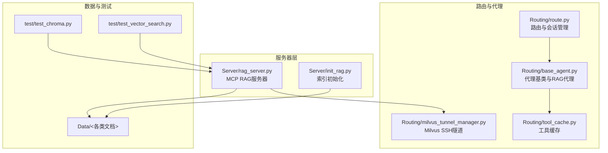
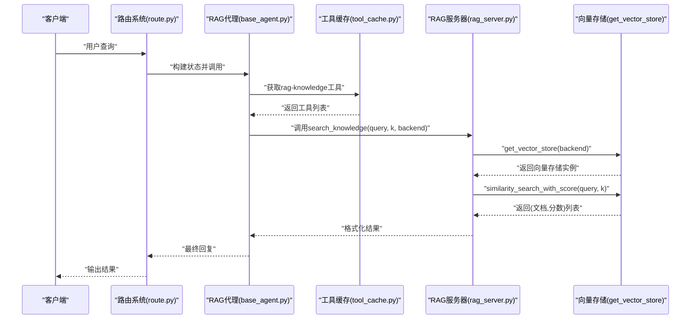
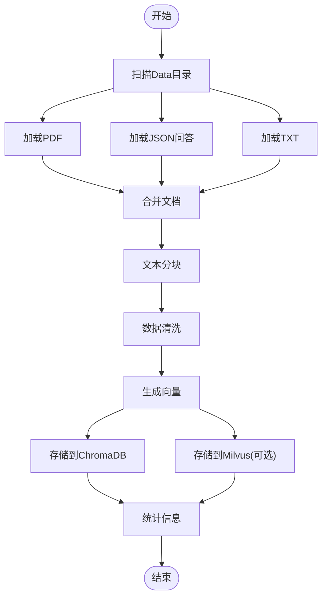
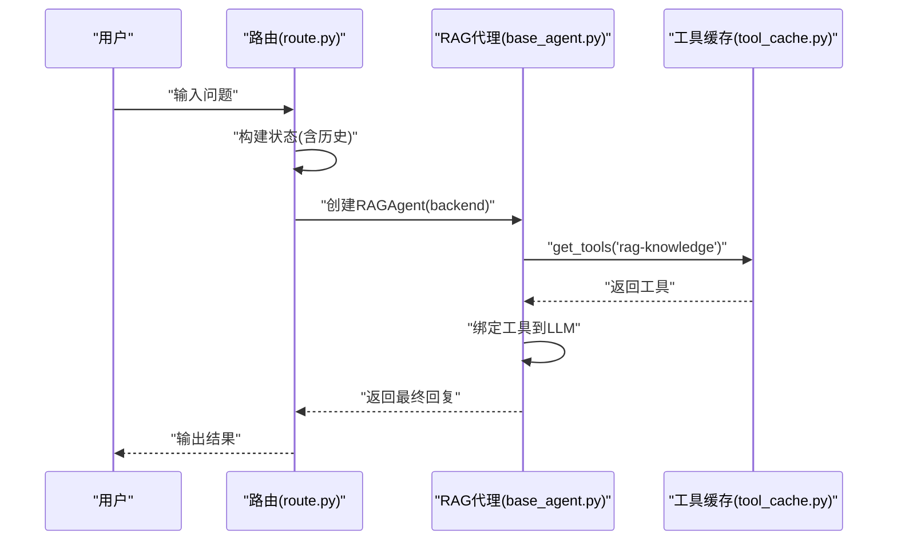
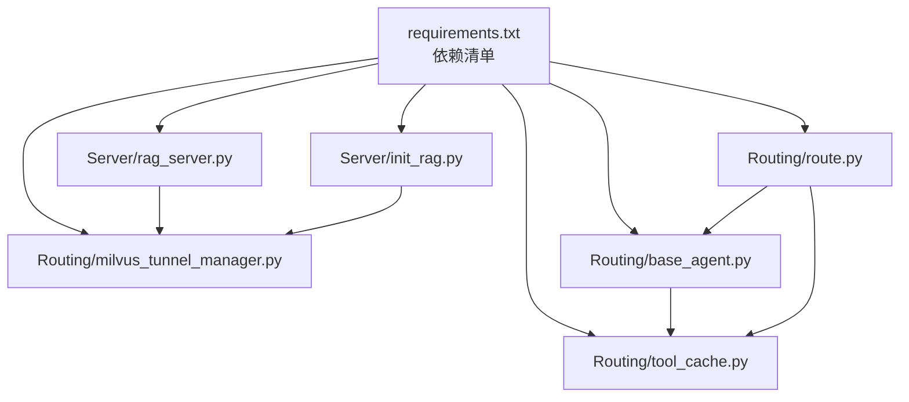

# RAG知识库MCP服务器

<cite>
**本文档引用的文件**
- [Server/rag_server.py](file://Server/rag_server.py)
- [Server/init_rag.py](file://Server/init_rag.py)
- [Routing/milvus_tunnel_manager.py](file://Routing/milvus_tunnel_manager.py)
- [Routing/base_agent.py](file://Routing/base_agent.py)
- [Routing/tool_cache.py](file://Routing/tool_cache.py)
- [Routing/route.py](file://Routing/route.py)
- [test/test_chroma.py](file://test/test_chroma.py)
- [test/test_vector_search.py](file://test/test_vector_search.py)
- [requirements.txt](file://requirements.txt)
- [README.md](file://README.md)
- [Data/测评.json](file://Data/测评.json)
</cite>

## 目录
1. [简介](#简介)
2. [项目结构](#项目结构)
3. [核心组件](#核心组件)
4. [架构总览](#架构总览)
5. [详细组件分析](#详细组件分析)
6. [依赖关系分析](#依赖关系分析)
7. [性能考量](#性能考量)
8. [故障排除指南](#故障排除指南)
9. [结论](#结论)
10. [附录](#附录)

## 简介
本项目实现了一个基于MCP（Model Context Protocol）的RAG知识库服务器，提供向量检索与知识问答能力。系统支持两种向量存储后端：本地ChromaDB与远程Milvus（通过SSH隧道）。服务器以stdio形式运行，暴露工具接口供路由系统调用，实现从文档加载、向量化、索引构建到查询检索的完整闭环。

## 项目结构
项目采用模块化组织，关键目录与文件如下：
- Server：MCP服务器实现与RAG工具
- Routing：路由与代理、工具缓存、隧道管理
- Data：知识库文档（PDF、JSON、TXT）
- test：向量检索与索引初始化测试
- requirements.txt：依赖清单
- README.md：项目说明与使用指南

**图表来源**
- [Server/rag_server.py:1-363](file://Server/rag_server.py#L1-L363)
- [Server/init_rag.py:1-506](file://Server/init_rag.py#L1-L506)
- [Routing/route.py:1-553](file://Routing/route.py#L1-L553)
- [Routing/base_agent.py:1-497](file://Routing/base_agent.py#L1-L497)
- [Routing/tool_cache.py:1-302](file://Routing/tool_cache.py#L1-L302)
- [Routing/milvus_tunnel_manager.py:1-101](file://Routing/milvus_tunnel_manager.py#L1-L101)
- [test/test_chroma.py:1-29](file://test/test_chroma.py#L1-L29)
- [test/test_vector_search.py:1-66](file://test/test_vector_search.py#L1-L66)

**章节来源**
- [README.md:1-125](file://README.md#L1-L125)
- [requirements.txt:1-17](file://requirements.txt#L1-L17)

## 核心组件
- RAG MCP服务器：提供知识检索工具、后端切换、文档加载与统计查询
- 向量存储适配器：统一ChromaDB与Milvus的相似度搜索接口
- 索引初始化器：扫描Data目录，加载文档，分块，向量化并写入向量库
- 路由与代理：基于LangGraph的意图识别与工具调用
- 工具缓存：跨会话复用MCP服务器连接与工具列表
- SSH隧道：为Milvus远程访问提供安全通道

**章节来源**
- [Server/rag_server.py:193-354](file://Server/rag_server.py#L193-L354)
- [Server/init_rag.py:294-496](file://Server/init_rag.py#L294-L496)
- [Routing/base_agent.py:433-463](file://Routing/base_agent.py#L433-L463)
- [Routing/tool_cache.py:39-117](file://Routing/tool_cache.py#L39-L117)
- [Routing/milvus_tunnel_manager.py:14-101](file://Routing/milvus_tunnel_manager.py#L14-L101)

## 架构总览
系统采用“工具即服务”的MCP架构，RAG服务器通过FastMCP注册工具，路由系统通过工具缓存动态加载并调用。向量检索抽象为统一接口，支持本地ChromaDB与远程Milvus。

**图表来源**
- [Routing/route.py:98-108](file://Routing/route.py#L98-L108)
- [Routing/base_agent.py:433-463](file://Routing/base_agent.py#L433-L463)
- [Routing/tool_cache.py:85-117](file://Routing/tool_cache.py#L85-L117)
- [Server/rag_server.py:193-244](file://Server/rag_server.py#L193-L244)

## 详细组件分析

### RAG MCP服务器
- 工具接口
  - search_knowledge：执行相似度搜索，返回相关文档与分数
  - set_search_backend：切换ChromaDB或Milvus
  - load_documents：手动触发索引构建
  - get_indexed_docs：查询已索引统计信息
- 向量存储工厂
  - get_vector_store：按后端返回Chroma或Milvus适配器
  - MilvusVectorStore：封装SSH隧道连接、集合加载、相似度搜索与统计查询
- 环境与配置
  - 通过dotenv加载DASHSCOPE_API_KEY、MILVUS_LOCAL_PORT等
  - 默认ChromaDB持久化目录位于vector_store

```mermaid
classDiagram
class MilvusVectorStore {
-embeddings
-_tunnel
-_collection
+_connect()
+_disconnect()
+similarity_search_with_score(query, k)
+get_stats()
}
class FastMCP {
+tool()
+run(transport)
}
class RAGServer {
+search_knowledge(query, top_k, backend)
+set_search_backend(backend)
+load_documents()
+get_indexed_docs(backend)
+get_vector_store(backend)
}
RAGServer --> MilvusVectorStore : "使用"
RAGServer --> FastMCP : "注册工具"
```

**图表来源**
- [Server/rag_server.py:51-159](file://Server/rag_server.py#L51-L159)
- [Server/rag_server.py:161-190](file://Server/rag_server.py#L161-L190)
- [Server/rag_server.py:193-354](file://Server/rag_server.py#L193-L354)

**章节来源**
- [Server/rag_server.py:193-354](file://Server/rag_server.py#L193-L354)

### 索引初始化器
- 文档加载
  - 支持PDF、JSON问答、TXT文本，自动添加source与file_type元数据
- 文本分块
  - 使用RecursiveCharacterTextSplitter，过滤空内容，设定chunk大小与重叠
- 向量化与存储
  - 使用DashScope text-embedding-v3生成向量
  - ChromaDB：批量add_texts，自动持久化
  - Milvus：通过SSH隧道连接，创建Collection并建立IVF_FLAT索引，分批insert
- 数据清洗
  - 移除控制字符与特殊Unicode，确保有效文本

**图表来源**
- [Server/init_rag.py:294-496](file://Server/init_rag.py#L294-L496)

**章节来源**
- [Server/init_rag.py:48-158](file://Server/init_rag.py#L48-L158)
- [Server/init_rag.py:208-292](file://Server/init_rag.py#L208-L292)
- [Server/init_rag.py:294-496](file://Server/init_rag.py#L294-L496)
- [Data/测评.json:1-93](file://Data/测评.json#L1-L93)

### 路由与代理
- 路由系统
  - 基于LangGraph的状态机，结合会话历史进行意图识别
  - 支持calculator、log_reader、amap、rag_query四类意图
- RAG代理
  - 根据后端参数选择ChromaDB或Milvus提示词
  - 通过工具缓存获取search_knowledge与get_indexed_docs工具
- 会话管理
  - 支持Redis持久化（可选），提供会话创建、消息记录与清理

**图表来源**
- [Routing/route.py:98-108](file://Routing/route.py#L98-L108)
- [Routing/base_agent.py:433-463](file://Routing/base_agent.py#L433-L463)
- [Routing/tool_cache.py:85-117](file://Routing/tool_cache.py#L85-L117)

**章节来源**
- [Routing/route.py:149-234](file://Routing/route.py#L149-L234)
- [Routing/base_agent.py:433-463](file://Routing/base_agent.py#L433-L463)
- [Routing/tool_cache.py:118-197](file://Routing/tool_cache.py#L118-L197)

### 工具缓存与会话
- 全局单例缓存，按服务器名称与TTL管理工具列表
- 支持stdio与streamable-http两种传输协议
- 会话管理器支持Redis持久化，提供会话创建、消息记录与清理

**章节来源**
- [Routing/tool_cache.py:39-117](file://Routing/tool_cache.py#L39-L117)
- [Routing/route.py:298-347](file://Routing/route.py#L298-L347)

### SSH隧道与Milvus集成
- MilvusTunnelManager
  - 自动加载SSH密钥，建立本地端口到远程Milvus gRPC端口的隧道
  - 提供创建与关闭隧道的方法
- MilvusVectorStore
  - 连接Milvus集合，加载索引
  - 生成查询向量，执行COSINE相似度搜索
  - 提供统计查询与断开连接

**章节来源**
- [Routing/milvus_tunnel_manager.py:14-101](file://Routing/milvus_tunnel_manager.py#L14-L101)
- [Server/rag_server.py:51-159](file://Server/rag_server.py#L51-L159)

## 依赖关系分析
- 运行时依赖
  - fastmcp、langchain系列、chromadb、pymilvus、paramiko/sshtunnel等
- 模块间耦合
  - RAG服务器与向量存储解耦，通过统一接口适配不同后端
  - 路由系统与代理通过工具缓存解耦，支持动态加载
  - 工具缓存与会话管理器通过配置文件解耦

**图表来源**
- [requirements.txt:1-17](file://requirements.txt#L1-L17)
- [Server/rag_server.py:1-50](file://Server/rag_server.py#L1-L50)
- [Server/init_rag.py:1-32](file://Server/init_rag.py#L1-L32)
- [Routing/milvus_tunnel_manager.py:1-12](file://Routing/milvus_tunnel_manager.py#L1-L12)
- [Routing/base_agent.py:1-18](file://Routing/base_agent.py#L1-L18)
- [Routing/tool_cache.py:1-26](file://Routing/tool_cache.py#L1-L26)
- [Routing/route.py:1-29](file://Routing/route.py#L1-L29)

**章节来源**
- [requirements.txt:1-17](file://requirements.txt#L1-L17)

## 性能考量
- 向量检索
  - ChromaDB：本地磁盘持久化，适合中小规模知识库
  - Milvus：远程集群，支持大规模向量索引与高并发查询
- 批处理与限流
  - 索引初始化与向量存储采用分批处理，避免API限制
  - 查询时可调整top_k与搜索参数（如nprobe）
- 内存与缓存
  - 工具缓存按服务器名称与TTL管理，减少重复连接
  - 会话管理器可选Redis持久化，降低内存压力
- 网络与安全
  - Milvus通过SSH隧道加密访问，避免明文传输
  - 环境变量集中管理API密钥与端口

[本节为通用性能建议，不直接分析具体文件]

## 故障排除指南
- 环境变量缺失
  - DASHSCOPE_API_KEY：导致嵌入模型初始化失败
  - MILVUS_*：隧道端口或凭据错误导致连接失败
- Milvus不可用
  - 缺少pymilvus或SSH密钥格式不支持，回退到ChromaDB
- 向量检索无结果
  - 检查向量库是否已初始化与持久化
  - 使用测试脚本验证ChromaDB检索
- 索引构建失败
  - 检查Data目录权限与文件格式
  - 关注分块与清洗阶段的异常输出

**章节来源**
- [Server/rag_server.py:31-35](file://Server/rag_server.py#L31-L35)
- [test/test_chroma.py:1-29](file://test/test_chroma.py#L1-L29)
- [test/test_vector_search.py:1-66](file://test/test_vector_search.py#L1-L66)

## 结论
本项目通过MCP协议将RAG知识库能力标准化为工具，结合路由系统实现智能意图识别与工具调用。系统同时支持本地ChromaDB与远程Milvus，具备良好的扩展性与安全性。通过分批处理、工具缓存与SSH隧道等机制，在性能与可靠性方面取得平衡。

[本节为总结性内容，不直接分析具体文件]

## 附录

### 配置选项与环境变量
- DASHSCOPE_API_KEY：DashScope API密钥
- MILVUS_LOCAL_PORT：本地转发端口（默认19531）
- 其他LLM与MCP相关环境变量（参考项目README）

**章节来源**
- [Server/rag_server.py:35-42](file://Server/rag_server.py#L35-L42)
- [README.md:64-69](file://README.md#L64-L69)

### 数据库连接参数
- ChromaDB：本地持久化目录（vector_store），集合名称“knowledge_base”
- Milvus：通过SSH隧道连接，默认远程端口19530，本地端口19531

**章节来源**
- [Server/rag_server.py:48-49](file://Server/rag_server.py#L48-L49)
- [Server/rag_server.py:67-72](file://Server/rag_server.py#L67-L72)
- [Server/init_rag.py:43-44](file://Server/init_rag.py#L43-L44)

### 安全考虑
- 使用SSH隧道访问远程Milvus，避免明文传输
- 工具缓存与会话管理器支持Redis持久化，注意密码与TTL配置
- 环境变量集中管理敏感信息

**章节来源**
- [Routing/milvus_tunnel_manager.py:42-48](file://Routing/milvus_tunnel_manager.py#L42-L48)
- [Routing/route.py:298-347](file://Routing/route.py#L298-L347)

### 部署架构与监控
- 部署架构：MCP服务器以stdio运行，路由系统通过工具缓存动态加载
- 监控指标：工具缓存统计、会话消息数量、向量库统计（ChromaDB/Milvus）
- 故障排除：检查环境变量、隧道连通性、向量库持久化路径

**章节来源**
- [Routing/tool_cache.py:291-297](file://Routing/tool_cache.py#L291-L297)
- [Routing/route.py:351-414](file://Routing/route.py#L351-L414)
- [Server/rag_server.py:317-353](file://Server/rag_server.py#L317-L353)