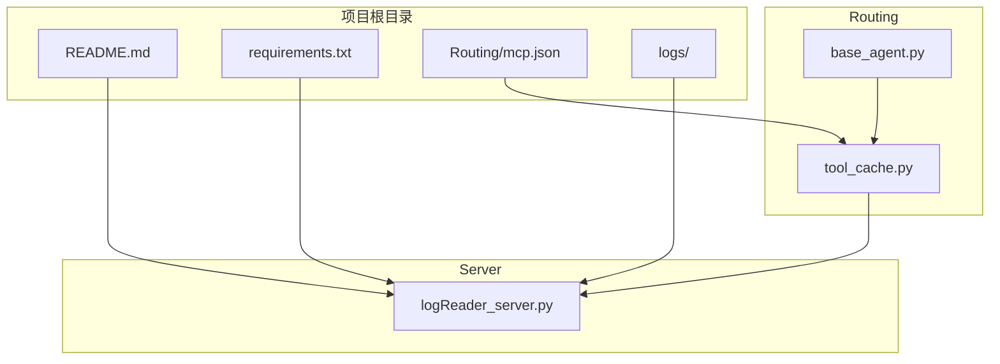
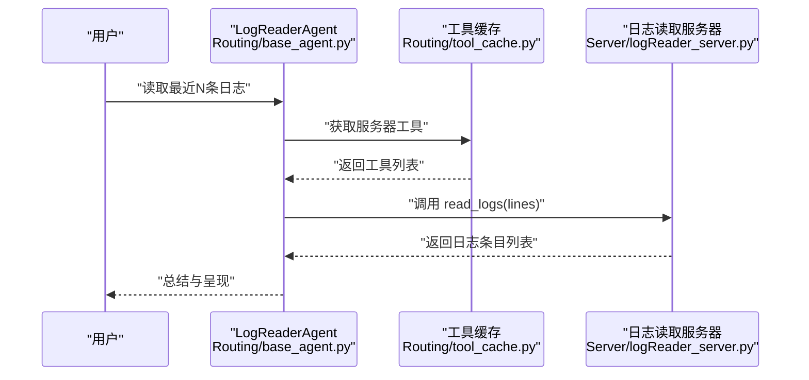
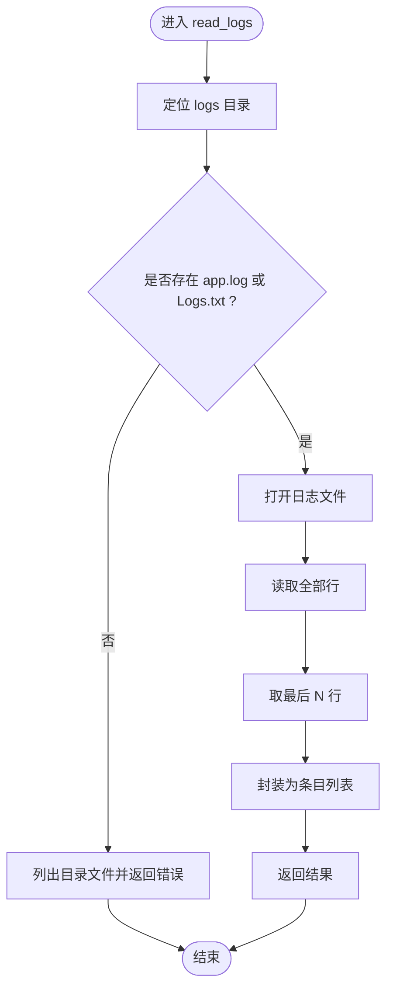
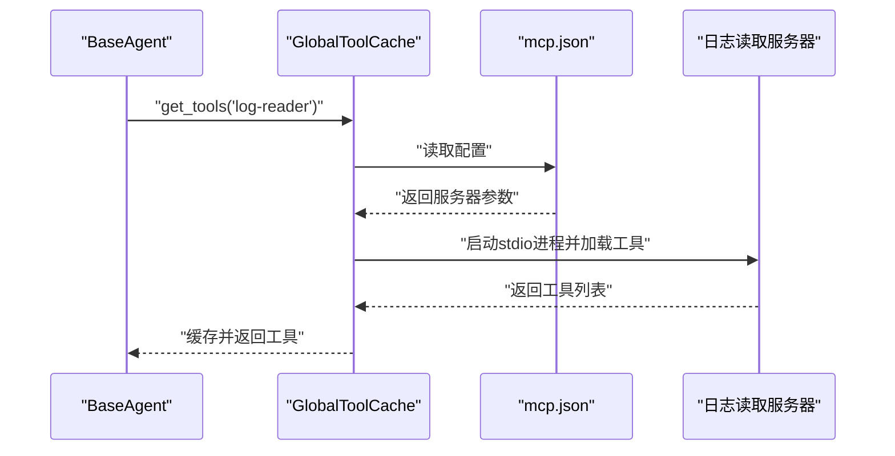
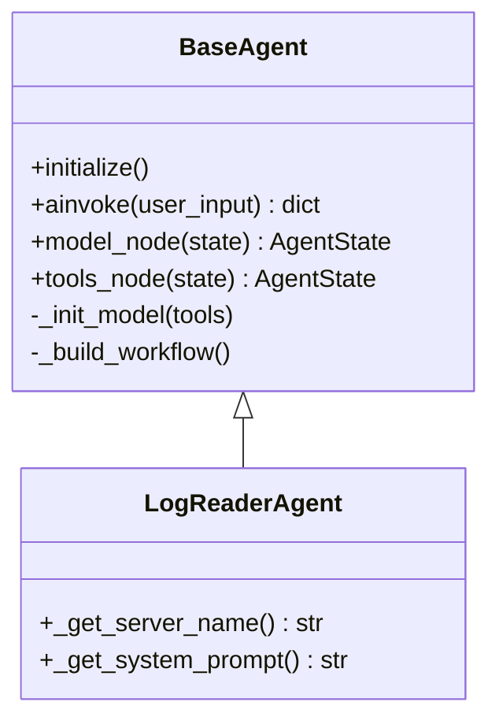
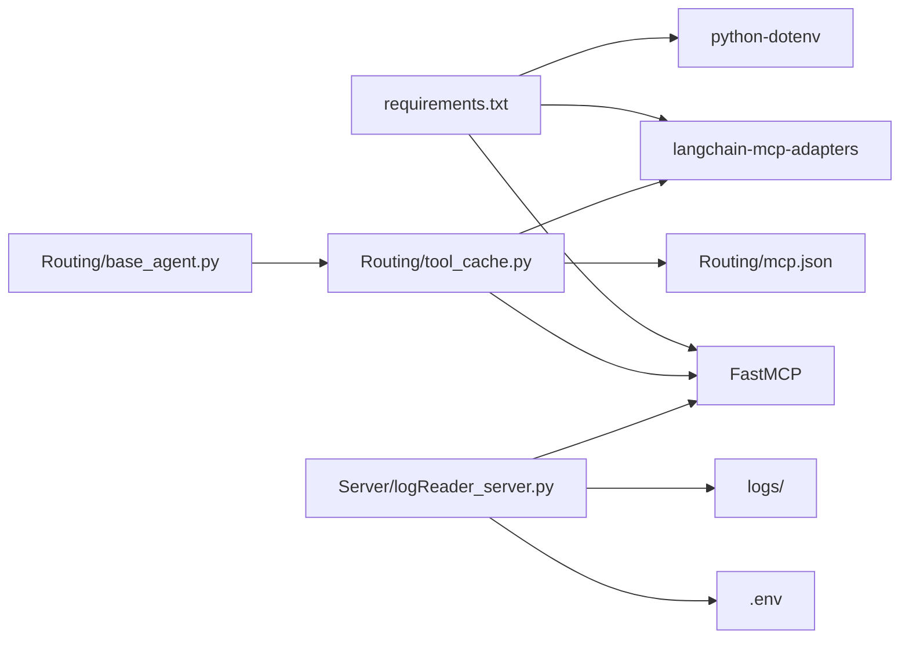

# 日志读取MCP服务器

<cite>
**本文档引用的文件**
- [Server/logReader_server.py](file://Server/logReader_server.py)
- [Routing/base_agent.py](file://Routing/base_agent.py)
- [Routing/tool_cache.py](file://Routing/tool_cache.py)
- [Routing/mcp.json](file://Routing/mcp.json)
- [README.md](file://README.md)
- [requirements.txt](file://requirements.txt)
- [quickstart.py](file://quickstart.py)
</cite>

## 目录
1. [简介](#简介)
2. [项目结构](#项目结构)
3. [核心组件](#核心组件)
4. [架构总览](#架构总览)
5. [详细组件分析](#详细组件分析)
6. [依赖关系分析](#依赖关系分析)
7. [性能考虑](#性能考虑)
8. [故障排除指南](#故障排除指南)
9. [结论](#结论)
10. [附录](#附录)

## 简介
本文件面向“日志读取MCP服务器”的实现与使用，系统性阐述其架构设计、日志处理功能、工具函数实现、文件系统集成、权限管理与异常处理机制，并提供配置参数、性能调优建议、监控指标、部署指南与故障排除方法。该服务器通过标准输入输出（stdio）协议对外提供日志读取、关键词搜索与基础统计能力，作为MCP生态中的工具被上层智能代理按需调用。

## 项目结构
日志读取MCP服务器位于Server目录下，配合Routing中的工具缓存与MCP配置，形成完整的动态工具加载与调用链路。README与requirements提供了项目背景、技术栈与运行指引。

图表来源
- [README.md:1-125](file://README.md#L1-L125)
- [requirements.txt:1-17](file://requirements.txt#L1-L17)
- [Routing/mcp.json:1-29](file://Routing/mcp.json#L1-L29)
- [Server/logReader_server.py:1-151](file://Server/logReader_server.py#L1-L151)
- [Routing/base_agent.py:1-497](file://Routing/base_agent.py#L1-L497)
- [Routing/tool_cache.py:1-302](file://Routing/tool_cache.py#L1-L302)

章节来源
- [README.md:1-125](file://README.md#L1-L125)
- [requirements.txt:1-17](file://requirements.txt#L1-L17)
- [Routing/mcp.json:1-29](file://Routing/mcp.json#L1-L29)

## 核心组件
- 日志读取MCP服务器：提供读取最新日志、按关键词搜索、获取日志统计三项工具函数，均通过FastMCP装饰器注册为MCP工具。
- 工具缓存与动态加载：Routing/tool_cache.py负责从MCP配置文件加载服务器参数，建立stdio连接并缓存工具，避免重复加载。
- 基类Agent：Routing/base_agent.py提供统一的模型绑定、工具调用、错误处理与工作流编排，日志读取Agent继承该基类。
- MCP配置：Routing/mcp.json定义各服务器的传输协议、命令与参数，其中日志读取服务器使用stdio并指向Server/logReader_server.py。

章节来源
- [Server/logReader_server.py:18-151](file://Server/logReader_server.py#L18-L151)
- [Routing/tool_cache.py:85-196](file://Routing/tool_cache.py#L85-L196)
- [Routing/base_agent.py:44-318](file://Routing/base_agent.py#L44-L318)
- [Routing/mcp.json:14-20](file://Routing/mcp.json#L14-L20)

## 架构总览
日志读取MCP服务器采用“stdio传输 + FastMCP工具注册”的轻量架构。上层Agent通过工具缓存加载服务器工具，调用时由LLM生成工具调用计划，经工具节点执行具体操作，返回结果给模型节点进行总结。

图表来源
- [Routing/base_agent.py:102-130](file://Routing/base_agent.py#L102-L130)
- [Routing/base_agent.py:131-217](file://Routing/base_agent.py#L131-L217)
- [Routing/tool_cache.py:85-116](file://Routing/tool_cache.py#L85-L116)
- [Server/logReader_server.py:18-58](file://Server/logReader_server.py#L18-L58)

## 详细组件分析

### 日志读取MCP服务器（Server/logReader_server.py）
- 工具函数
  - read_logs(lines: int = 10)：读取最新日志条目，支持指定行数，默认10行；返回条目列表或错误信息。
  - search_logs(keyword: str)：按关键词搜索日志，大小写不敏感；返回匹配条目列表或提示信息。
  - get_log_stats()：返回日志文件大小、最后修改时间、完整路径与行数等统计信息。
- 文件系统与路径
  - 日志目录固定为项目根/logs，服务器尝试两种常见文件名：app.log、Logs.txt；若均不存在，返回可用文件列表。
- 时间戳与格式
  - 当前实现直接读取文本行，不做时间戳解析与日志级别拆分；如需增强，可在工具内部引入正则解析与结构化字段提取。
- 异常处理
  - 文件读取、路径遍历与统计均包裹try-except，返回统一的错误字典或列表，便于上层Agent处理。
- 运行模式
  - 以stdio传输模式启动，符合MCP协议要求。

图表来源
- [Server/logReader_server.py:19-57](file://Server/logReader_server.py#L19-L57)

章节来源
- [Server/logReader_server.py:18-151](file://Server/logReader_server.py#L18-L151)

### 工具缓存与动态加载（Routing/tool_cache.py）
- 功能要点
  - 从mcp.json加载服务器配置，支持stdio与streamable-http两种传输。
  - 通过MultiServerMCPClient建立连接并加载工具，使用TTL缓存减少重复加载。
  - 提供清理过期缓存与会话的能力，保证资源回收。
- 关键流程
  - get_tools：检查缓存、加载新工具、更新缓存。
  - _load_stdio_tools/_load_streamable_http_tools：分别处理stdio与HTTP传输。
  - _cleanup_server：关闭会话与客户端，释放资源。
- 并发与线程安全
  - 使用异步锁保护缓存访问，避免并发冲突。

图表来源
- [Routing/tool_cache.py:85-116](file://Routing/tool_cache.py#L85-L116)
- [Routing/tool_cache.py:141-196](file://Routing/tool_cache.py#L141-L196)
- [Routing/mcp.json:14-20](file://Routing/mcp.json#L14-L20)

章节来源
- [Routing/tool_cache.py:1-302](file://Routing/tool_cache.py#L1-L302)
- [Routing/mcp.json:1-29](file://Routing/mcp.json#L1-L29)

### 基类Agent与日志读取Agent（Routing/base_agent.py）
- BaseAgent职责
  - 统一初始化：从环境变量读取LLM配置，绑定工具。
  - 工作流编排：模型节点与工具节点的条件路由，错误处理与状态管理。
  - 工具执行：将LLM生成的工具调用映射到实际工具，仅传递必要字段，避免泄露原始数据。
- LogReaderAgent
  - 指定服务器名为"log-reader"，系统提示词强调日志分析与错误/告警信息关注。
- 与工具缓存协作
  - 通过tool_cache获取工具，避免重复加载，提升性能。

图表来源
- [Routing/base_agent.py:29-318](file://Routing/base_agent.py#L29-L318)

章节来源
- [Routing/base_agent.py:403-416](file://Routing/base_agent.py#L403-L416)

### MCP配置（Routing/mcp.json）
- 配置项
  - 服务器名称：log-reader
  - 传输协议：stdio
  - 命令与参数：指向Server/logReader_server.py
- 作用
  - 工具缓存依据此配置启动stdio进程并加载工具，实现动态工具发现与调用。

章节来源
- [Routing/mcp.json:14-20](file://Routing/mcp.json#L14-L20)

## 依赖关系分析
- 技术栈
  - FastMCP：MCP协议实现与工具注册。
  - langchain-mcp-adapters：MCP客户端适配，支持多服务器连接与工具加载。
  - python-dotenv：环境变量加载。
  - 其他：httpx、chromadb、redis、milvus等（与日志服务器无直接耦合）。
- 组件耦合
  - 日志读取服务器与工具缓存通过MCP配置解耦；工具缓存与Agent通过接口解耦。
  - 文件系统耦合点：固定logs目录与两种文件名选项。

图表来源
- [requirements.txt:1-17](file://requirements.txt#L1-L17)
- [Routing/tool_cache.py:18-24](file://Routing/tool_cache.py#L18-L24)
- [Routing/mcp.json:1-29](file://Routing/mcp.json#L1-L29)
- [Server/logReader_server.py:5-12](file://Server/logReader_server.py#L5-L12)

章节来源
- [requirements.txt:1-17](file://requirements.txt#L1-L17)
- [Routing/tool_cache.py:18-24](file://Routing/tool_cache.py#L18-L24)

## 性能考虑
- 工具缓存
  - 默认TTL为300秒，避免频繁重连与重复加载；可根据场景调整。
- I/O优化
  - read_logs采用一次性读取并切片，适合中小规模日志；对于大文件，建议分块读取或限制lines上限。
- 并发与资源
  - 工具缓存使用异步锁，避免竞态；清理过期会话与客户端，防止资源泄漏。
- 环境变量与LLM
  - LLM配置来自环境变量，建议在生产环境统一管理。

章节来源
- [Routing/tool_cache.py:62](file://Routing/tool_cache.py#L62)
- [Routing/tool_cache.py:106-107](file://Routing/tool_cache.py#L106-L107)
- [Routing/base_agent.py:73-85](file://Routing/base_agent.py#L73-L85)

## 故障排除指南
- 无法找到日志文件
  - 现象：返回“日志文件不存在于预期位置。可用文件: [...]”
  - 排查：确认logs目录存在且包含app.log或Logs.txt；检查路径拼接逻辑。
  - 参考：[Server/logReader_server.py:41-44](file://Server/logReader_server.py#L41-L44)
- 读取/搜索异常
  - 现象：返回错误字典
  - 排查：检查文件编码（当前使用utf-8）、权限、磁盘空间；查看系统异常堆栈。
  - 参考：[Server/logReader_server.py:56-57](file://Server/logReader_server.py#L56-L57)，[Server/logReader_server.py:101-102](file://Server/logReader_server.py#L101-L102)，[Server/logReader_server.py:144-145](file://Server/logReader_server.py#L144-L145)
- MCP连接失败
  - 现象：工具加载失败或超时
  - 排查：确认mcp.json中命令与参数正确；stdio进程能否正常启动；网络与权限。
  - 参考：[Routing/mcp.json:14-20](file://Routing/mcp.json#L14-L20)，[Routing/tool_cache.py:167-196](file://Routing/tool_cache.py#L167-L196)
- 工具缓存过期或污染
  - 现象：工具列表不一致或加载缓慢
  - 排查：检查TTL设置；必要时调用清理接口；观察缓存统计。
  - 参考：[Routing/tool_cache.py:34-36](file://Routing/tool_cache.py#L34-L36)，[Routing/tool_cache.py:281-297](file://Routing/tool_cache.py#L281-L297)

## 结论
日志读取MCP服务器以简洁的stdio协议实现了基础的日志读取、搜索与统计功能，结合工具缓存与Agent基类，形成了可扩展、可维护的MCP工具体系。当前实现聚焦于文本行读取与简单统计，未来可在时间戳解析、日志级别过滤与内容提取方面进一步增强，以满足更复杂的日志分析需求。

## 附录

### 部署指南
- 环境准备
  - 创建并激活虚拟环境，安装依赖。
  - 参考：[README.md:53-62](file://README.md#L53-L62)，[requirements.txt:1-17](file://requirements.txt#L1-L17)
- 配置环境变量
  - 在.env中配置API密钥（如DashScope、高德地图等，日志服务器本身无需特定密钥）。
  - 参考：[README.md:64-69](file://README.md#L64-L69)
- 启动Agent并验证
  - 运行快速启动脚本，观察工具加载与调用效果。
  - 参考：[quickstart.py:14-18](file://quickstart.py#L14-L18)，[quickstart.py:41-51](file://quickstart.py#L41-L51)

### 监控指标建议
- 工具调用成功率与失败率
- 工具平均响应时间与P95延迟
- 缓存命中率与过期频率
- 日志文件大小与行数趋势
- MCP连接状态与会话存活时间

### 代码示例（路径指引）
- 读取最新日志
  - [Server/logReader_server.py:19-57](file://Server/logReader_server.py#L19-L57)
- 按关键词搜索
  - [Server/logReader_server.py:61-102](file://Server/logReader_server.py#L61-L102)
- 获取日志统计
  - [Server/logReader_server.py:106-145](file://Server/logReader_server.py#L106-L145)
- 工具缓存加载流程
  - [Routing/tool_cache.py:85-116](file://Routing/tool_cache.py#L85-L116)
- Agent工作流与工具执行
  - [Routing/base_agent.py:102-130](file://Routing/base_agent.py#L102-L130)，[Routing/base_agent.py:131-217](file://Routing/base_agent.py#L131-L217)