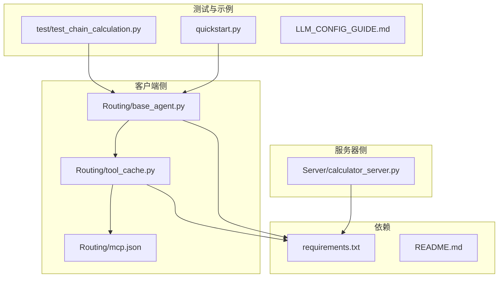
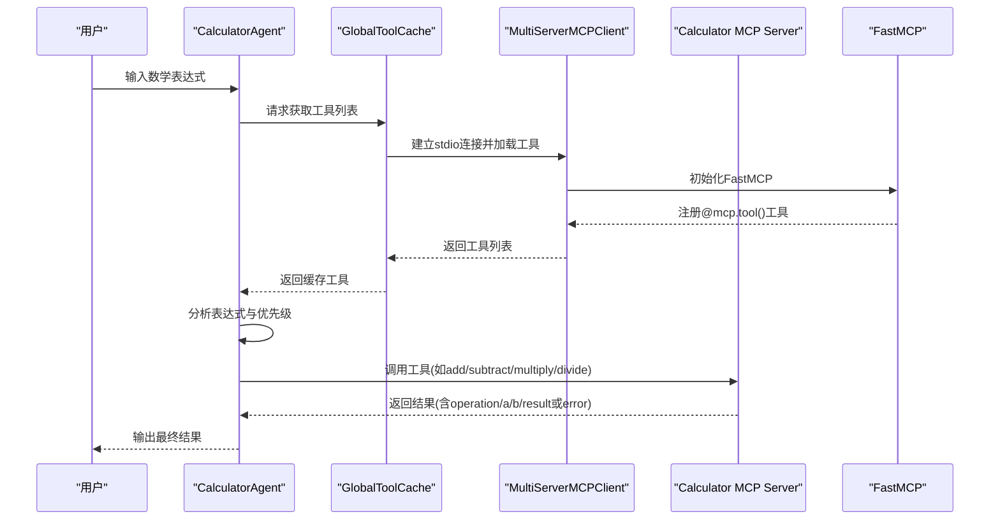
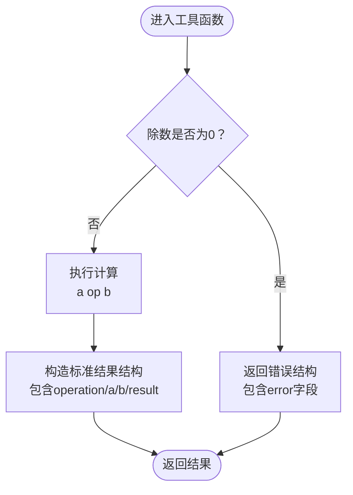
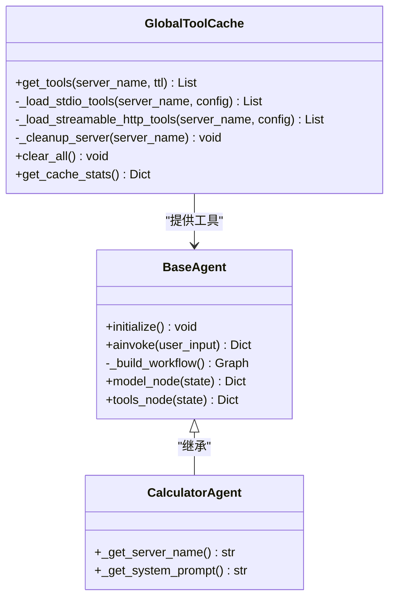
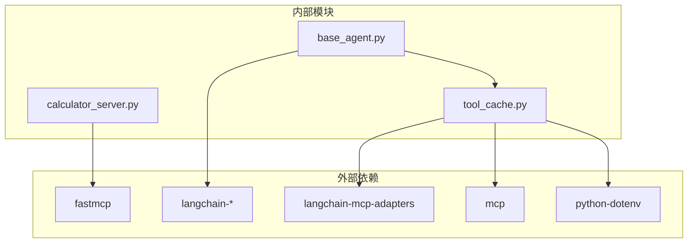

# 计算器MCP服务器

<cite>
**本文档引用的文件**
- [Server/calculator_server.py](file://Server/calculator_server.py)
- [Routing/base_agent.py](file://Routing/base_agent.py)
- [Routing/tool_cache.py](file://Routing/tool_cache.py)
- [Routing/mcp.json](file://Routing/mcp.json)
- [test/test_chain_calculation.py](file://test/test_chain_calculation.py)
- [quickstart.py](file://quickstart.py)
- [requirements.txt](file://requirements.txt)
- [README.md](file://README.md)
- [LLM_CONFIG_GUIDE.md](file://LLM_CONFIG_GUIDE.md)
- [test_output.txt](file://test_output.txt)
</cite>

## 目录
1. [简介](#简介)
2. [项目结构](#项目结构)
3. [核心组件](#核心组件)
4. [架构总览](#架构总览)
5. [详细组件分析](#详细组件分析)
6. [依赖关系分析](#依赖关系分析)
7. [性能考虑](#性能考虑)
8. [故障排查指南](#故障排查指南)
9. [结论](#结论)
10. [附录](#附录)

## 简介
本文件面向“计算器MCP服务器”的实现与使用，系统性阐述其架构设计、数学计算功能实现、服务器初始化流程、工具注册机制与stdIO传输协议的使用。文档同时提供加法、减法、乘法、除法四个核心工具函数的实现原理、参数处理机制、错误处理与结果格式化说明，并给出服务器启动方法、调试技巧与常见问题解决方案。目标读者既包括需要快速上手的使用者，也包括希望深入理解实现细节的开发者。

## 项目结构
该项目采用模块化设计，围绕MCP协议构建智能代理系统，支持多服务器工具接入与链式计算。与计算器MCP服务器直接相关的模块与文件如下：
- 服务器侧：Server/calculator_server.py 实现加减乘除工具并通过FastMCP以stdio模式暴露
- 客户端侧：Routing/base_agent.py 定义通用Agent基类与CalculatorAgent；Routing/tool_cache.py 提供MCP服务器连接与工具缓存；Routing/mcp.json 描述各MCP服务器配置
- 测试与示例：test/test_chain_calculation.py 展示链式计算测试；quickstart.py 提供快速启动示例；LLM_CONFIG_GUIDE.md 提供LLM配置指南
- 依赖：requirements.txt 管理第三方库；README.md 提供总体说明

图表来源
- [Server/calculator_server.py:1-111](file://Server/calculator_server.py#L1-L111)
- [Routing/base_agent.py:1-497](file://Routing/base_agent.py#L1-L497)
- [Routing/tool_cache.py:1-302](file://Routing/tool_cache.py#L1-L302)
- [Routing/mcp.json:1-29](file://Routing/mcp.json#L1-L29)
- [test/test_chain_calculation.py:1-65](file://test/test_chain_calculation.py#L1-L65)
- [quickstart.py:1-68](file://quickstart.py#L1-L68)
- [requirements.txt:1-17](file://requirements.txt#L1-L17)
- [README.md:1-125](file://README.md#L1-L125)

章节来源
- [README.md:1-125](file://README.md#L1-L125)
- [requirements.txt:1-17](file://requirements.txt#L1-L17)

## 核心组件
- 计算器MCP服务器：在Server/calculator_server.py中通过FastMCP框架暴露add、subtract、multiply、divide四个工具，使用装饰器@mcp.tool()注册，以stdio协议对外提供服务
- 工具缓存与客户端：Routing/tool_cache.py负责从mcp.json读取服务器配置，按transport类型（stdio/streamable-http）建立连接并缓存工具；Routing/base_agent.py定义通用Agent基类与CalculatorAgent，统一消息处理、工具绑定与工作流编排
- 配置与测试：Routing/mcp.json定义“calculator”服务器的stdio命令与参数；test/test_chain_calculation.py演示链式计算；quickstart.py展示Agent创建与工具列表查看

章节来源
- [Server/calculator_server.py:16-105](file://Server/calculator_server.py#L16-L105)
- [Routing/tool_cache.py:85-196](file://Routing/tool_cache.py#L85-L196)
- [Routing/base_agent.py:29-318](file://Routing/base_agent.py#L29-L318)
- [Routing/mcp.json:7-13](file://Routing/mcp.json#L7-L13)
- [test/test_chain_calculation.py:14-64](file://test/test_chain_calculation.py#L14-L64)

## 架构总览
下图展示了从用户输入到工具调用再到结果返回的完整链路，体现客户端Agent、工具缓存、MCP服务器与stdio传输协议的协作关系。

图表来源
- [Routing/base_agent.py:44-66](file://Routing/base_agent.py#L44-L66)
- [Routing/tool_cache.py:118-196](file://Routing/tool_cache.py#L118-L196)
- [Server/calculator_server.py:16-105](file://Server/calculator_server.py#L16-L105)

## 详细组件分析

### 计算器MCP服务器（Server/calculator_server.py）
- 初始化与注册
  - 通过FastMCP创建实例并命名为“Calculator MCP Server”
  - 使用@mcp.tool()装饰器注册四个工具函数：add、subtract、multiply、divide
  - 在__main__中以transport="stdio"启动服务器
- 工具实现要点
  - 加法：接收两个浮点数参数，打印调用日志，执行计算并返回包含operation、a、b、result的标准结果结构
  - 减法：接收两个浮点数参数，打印调用日志，执行计算并返回标准结果结构
  - 乘法：接收两个浮点数参数，打印调用日志，执行计算并返回标准结果结构
  - 除法：接收两个浮点数参数，打印调用日志；若除数为0，返回包含error字段的错误结构；否则返回标准结果结构
- 参数与返回
  - 参数均为float类型，工具内部未做显式类型校验，但FastMCP会进行类型推断与约束
  - 返回结构统一包含operation、a、b、result字段；除法在错误时返回error字段
- 错误处理
  - 除法对b==0进行显式检查并返回错误结构
  - 其他工具未显式检查参数合法性，建议在业务层或上游Agent中进行前置校验

图表来源
- [Server/calculator_server.py:82-105](file://Server/calculator_server.py#L82-L105)

章节来源
- [Server/calculator_server.py:16-105](file://Server/calculator_server.py#L16-L105)

### 工具缓存与客户端（Routing/tool_cache.py、Routing/base_agent.py）
- 工具缓存
  - GlobalToolCache单例管理缓存，支持TTL过期策略，默认5分钟
  - 通过mcp.json读取服务器配置，按transport类型选择stdio或streamable-http
  - stdio模式下，使用MultiServerMCPClient与StdioServerParameters启动服务器进程并加载工具
  - 缓存命中时直接返回工具列表；过期则清理并重新加载
- 客户端Agent
  - BaseAgent统一初始化流程：从缓存加载工具、绑定LLM、构建LangGraph工作流
  - CalculatorAgent重写_get_server_name返回"calculator"，绑定系统提示词与链式计算规则
  - 工具节点tools_node中，对计算器工具仅提取result字段作为ToolMessage内容，避免LLM看到原始结构
  - 工作流：START -> model -> 条件边 -> tools -> model，循环直到无工具调用

图表来源
- [Routing/tool_cache.py:39-297](file://Routing/tool_cache.py#L39-L297)
- [Routing/base_agent.py:29-497](file://Routing/base_agent.py#L29-L497)

章节来源
- [Routing/tool_cache.py:85-196](file://Routing/tool_cache.py#L85-L196)
- [Routing/base_agent.py:44-318](file://Routing/base_agent.py#L44-L318)

### 配置与启动（Routing/mcp.json、quickstart.py、README.md）
- mcp.json
  - 定义"calculator"服务器：transport为stdio，command为python，args指向Server/calculator_server.py
- 启动方式
  - 通过tool_cache.py的stdio加载流程启动服务器进程
  - README提供LangGraph Agent运行方式与交互式聊天入口
- 快速启动
  - quickstart.py展示Agent创建、工具列表查看与示例对话流程

章节来源
- [Routing/mcp.json:7-13](file://Routing/mcp.json#L7-L13)
- [quickstart.py:8-67](file://quickstart.py#L8-L67)
- [README.md:71-78](file://README.md#L71-L78)

### 链式计算测试（test/test_chain_calculation.py）
- 测试覆盖
  - 简单计算：12 + 6
  - 链式计算：12 + 6 - 95
  - 复杂链式：5 * 3 + 10 - 2
  - 运算优先级：59 + 8 - 8 - 9 / 7
- 结果输出
  - 打印最终响应内容与工具调用次数
  - 若存在tool_results，逐条打印每一步工具调用与结果

章节来源
- [test/test_chain_calculation.py:14-64](file://test/test_chain_calculation.py#L14-L64)

## 依赖关系分析
- 外部依赖
  - fastmcp：提供FastMCP框架与@mcp.tool()装饰器
  - langchain系列：ChatOpenAI、消息类型与LangGraph工作流
  - langchain-mcp-adapters：MultiServerMCPClient与工具加载
  - mcp：ClientSession与stdio/streamable-http传输
  - python-dotenv：环境变量加载
- 内部依赖
  - tool_cache依赖mcp.json配置与环境变量
  - base_agent依赖tool_cache进行工具加载与绑定
  - calculator_server独立于客户端，仅通过FastMCP暴露工具

图表来源
- [requirements.txt:1-17](file://requirements.txt#L1-L17)
- [Routing/tool_cache.py:18-24](file://Routing/tool_cache.py#L18-L24)
- [Routing/base_agent.py:70-88](file://Routing/base_agent.py#L70-L88)
- [Server/calculator_server.py:5-7](file://Server/calculator_server.py#L5-L7)

章节来源
- [requirements.txt:1-17](file://requirements.txt#L1-L17)

## 性能考虑
- 工具缓存与复用
  - GlobalToolCache默认TTL为300秒，减少重复连接与工具加载开销
  - 多Agent共享同一缓存，降低服务器启动频率
- 并发与异步
  - BaseAgent与tool_cache均采用async/await，适合高并发场景
  - 工具节点按顺序执行，避免并行调用导致的竞态
- 传输协议
  - stdio协议轻量，适合本地进程内通信；streamable-http适用于远程服务器
- LLM配置
  - LLM_BASE_URL、LLM_MODEL、LLM_TEMPERATURE可通过.env调整，影响响应速度与稳定性

章节来源
- [Routing/tool_cache.py:62-65](file://Routing/tool_cache.py#L62-L65)
- [Routing/base_agent.py:70-88](file://Routing/base_agent.py#L70-L88)
- [LLM_CONFIG_GUIDE.md:6-16](file://LLM_CONFIG_GUIDE.md#L6-L16)

## 故障排查指南
- 服务器未启动或工具不可见
  - 检查mcp.json中"calculator"服务器配置与transport是否为"stdio"
  - 确认args指向的Server/calculator_server.py路径正确
  - 查看tool_cache的stdio加载流程是否成功启动进程
- 除法报错“除数不能为零”
  - 确认输入参数b为0时，工具返回error字段
  - 在上游Agent中增加前置校验或提示用户修正
- 工具调用结果不符合预期
  - 检查CalculatorAgent的系统提示词与链式计算规则
  - 确认tools_node仅提取result字段，避免LLM误解原始结构
- LLM调用失败
  - 检查DASHSCOPE_API_KEY与LLM_BASE_URL配置
  - 调整LLM_TEMPERATURE以平衡确定性与创造性
- 日志参考
  - 可参考test_output.txt中FastMCP启动与服务器日志输出，定位stdio启动与工具加载阶段的问题

章节来源
- [Routing/mcp.json:7-13](file://Routing/mcp.json#L7-L13)
- [Routing/tool_cache.py:141-196](file://Routing/tool_cache.py#L141-L196)
- [Server/calculator_server.py:95-98](file://Server/calculator_server.py#L95-L98)
- [Routing/base_agent.py:173-180](file://Routing/base_agent.py#L173-L180)
- [LLM_CONFIG_GUIDE.md:68-81](file://LLM_CONFIG_GUIDE.md#L68-L81)
- [test_output.txt:174-176](file://test_output.txt#L174-L176)

## 结论
计算器MCP服务器通过FastMCP与stdio协议实现了简洁高效的数学工具暴露，配合工具缓存与Agent工作流，能够稳定支持链式计算与多步推理。其设计强调模块解耦、配置驱动与异步并发，具备良好的可扩展性与可维护性。建议在生产环境中结合环境变量配置、缓存策略与日志监控，持续优化性能与稳定性。

## 附录

### 服务器启动方法
- 通过tool_cache的stdio加载流程自动启动Server/calculator_server.py
- README提供了LangGraph Agent运行方式与交互式聊天入口
- quickstart.py展示了Agent创建与工具列表查看

章节来源
- [README.md:71-78](file://README.md#L71-L78)
- [quickstart.py:14-18](file://quickstart.py#L14-L18)

### 调试技巧
- 观察tool_cache的加载日志与FastMCP启动日志，确认stdio连接与工具注册
- 使用test/test_chain_calculation.py验证链式计算与优先级处理
- 在CalculatorAgent中打印中间状态与tool_results，辅助定位问题

章节来源
- [test_output.txt:174-176](file://test_output.txt#L174-L176)
- [test/test_chain_calculation.py:26-57](file://test/test_chain_calculation.py#L26-L57)