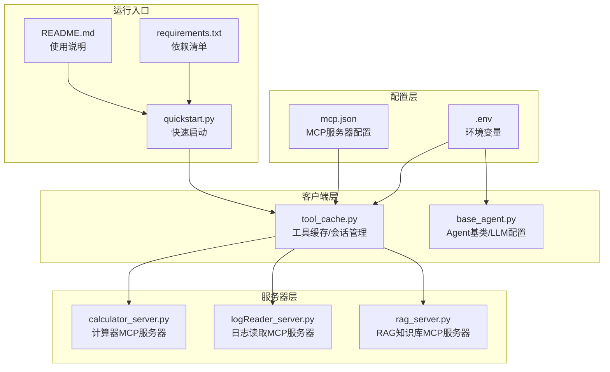
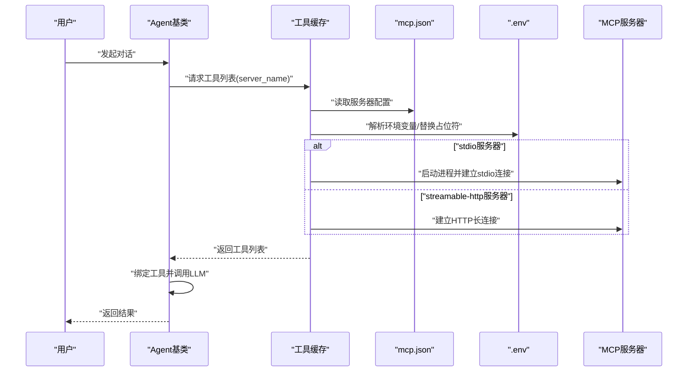
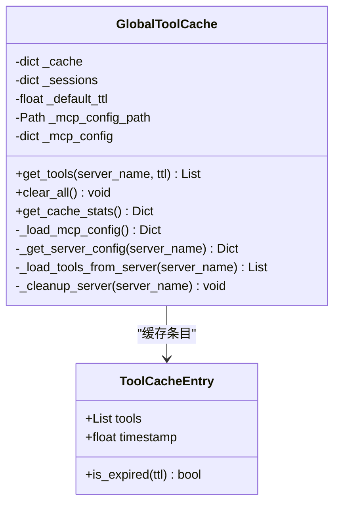
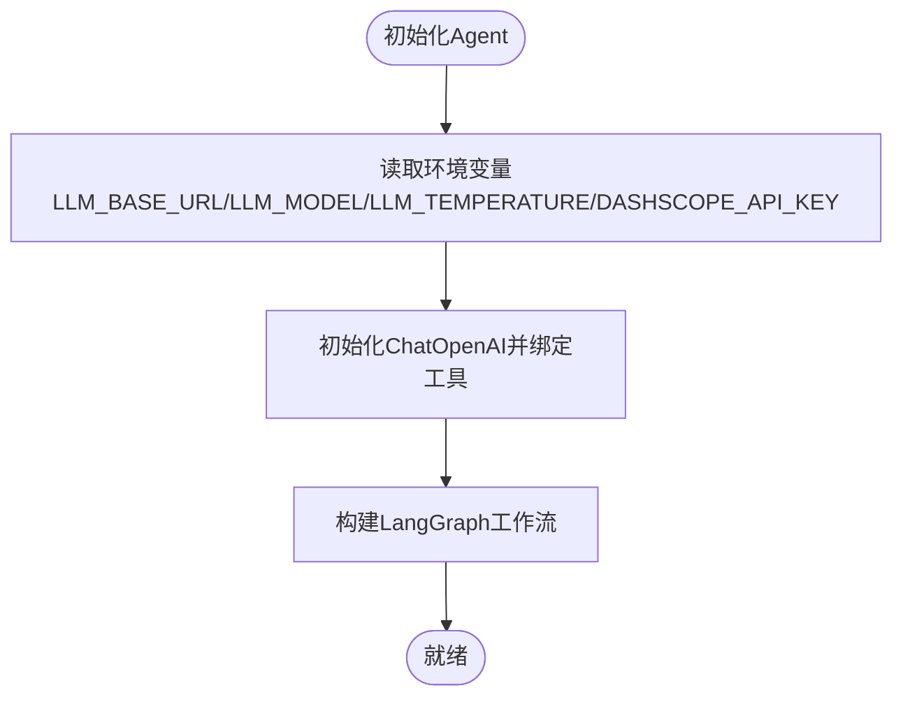
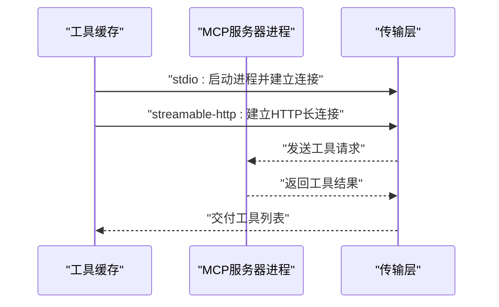
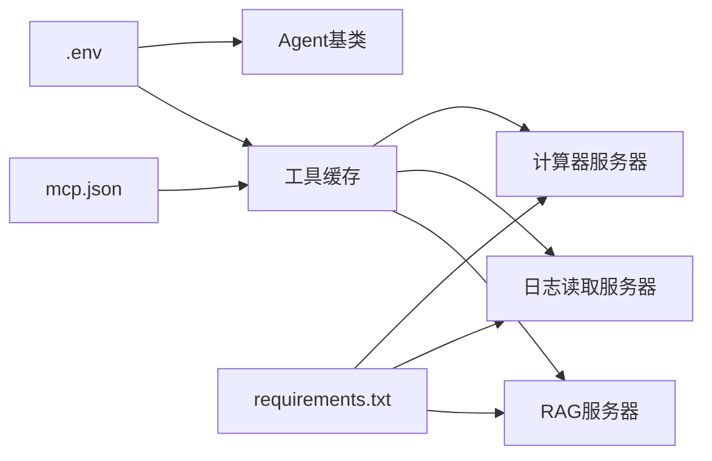

# MCP配置管理

<cite>
**本文引用的文件**
- [mcp.json](file://Routing/mcp.json)
- [tool_cache.py](file://Routing/tool_cache.py)
- [base_agent.py](file://Routing/base_agent.py)
- [calculator_server.py](file://Server/calculator_server.py)
- [logReader_server.py](file://Server/logReader_server.py)
- [rag_server.py](file://Server/rag_server.py)
- [quickstart.py](file://quickstart.py)
- [README.md](file://README.md)
- [requirements.txt](file://requirements.txt)
</cite>

## 目录
1. [简介](#简介)
2. [项目结构](#项目结构)
3. [核心组件](#核心组件)
4. [架构总览](#架构总览)
5. [详细组件分析](#详细组件分析)
6. [依赖关系分析](#依赖关系分析)
7. [性能考量](#性能考量)
8. [故障排除指南](#故障排除指南)
9. [结论](#结论)
10. [附录](#附录)

## 简介
本文件系统性阐述MCP配置管理的设计与实现，聚焦以下方面：
- MCP配置文件结构、字段含义与配置规则
- 服务器参数配置、连接设置与认证信息管理
- 环境变量配置最佳实践与安全考虑
- 配置加载顺序、优先级与覆盖机制
- 配置验证、热更新与回滚策略
- 不同环境下的配置差异与部署注意事项
- 配置模板与示例，帮助快速搭建MCP环境
- 常见问题排查与解决方案

## 项目结构
该项目围绕“LangGraph MCP Agent + 多MCP服务器”的架构组织，关键配置与实现分布如下：
- 配置层：Routing/mcp.json（MCP服务器清单与传输方式）、.env（环境变量）
- 客户端层：Routing/tool_cache.py（工具缓存与会话管理）、Routing/base_agent.py（Agent基类与LLM配置）
- 服务器层：Server/calculator_server.py、Server/logReader_server.py、Server/rag_server.py（各MCP服务器实现）
- 快速启动与文档：quickstart.py、README.md、requirements.txt

**图表来源**
- [mcp.json:1-29](file://Routing/mcp.json#L1-L29)
- [tool_cache.py:63-83](file://Routing/tool_cache.py#L63-L83)
- [base_agent.py:73-88](file://Routing/base_agent.py#L73-L88)
- [calculator_server.py:108-111](file://Server/calculator_server.py#L108-L111)
- [logReader_server.py:148-151](file://Server/logReader_server.py#L148-L151)
- [rag_server.py:356-363](file://Server/rag_server.py#L356-L363)
- [quickstart.py:1-68](file://quickstart.py#L1-L68)
- [README.md:1-125](file://README.md#L1-L125)
- [requirements.txt:1-17](file://requirements.txt#L1-L17)

**章节来源**
- [README.md:1-125](file://README.md#L1-L125)

## 核心组件
本节对MCP配置管理涉及的核心组件进行深入解析。

- MCP配置文件（mcp.json）
  - 作用：定义MCP服务器清单、URL与传输方式、命令与参数等
  - 结构要点：顶层键为mcpServers；每个服务器包含url（HTTP）或command/args（stdio）及transport字段
  - 传输类型：streamable-http（HTTP长连接）与stdio（进程标准输入输出）

- 工具缓存与会话管理（tool_cache.py）
  - 单例模式：全局唯一实例，贯穿Agent生命周期
  - 缓存策略：按服务器名缓存工具列表，支持TTL过期与清理
  - 会话管理：记录活跃会话，支持stdio与streamable-http两种传输
  - 配置加载：从mcp.json读取服务器配置，解析环境变量与相对路径
  - 异常处理：超时、JSON解析错误、文件缺失等均有明确处理

- Agent基类与LLM配置（base_agent.py）
  - LLM参数：从环境变量读取基础URL、模型名、温度等
  - 工具绑定：将工具列表绑定至LLM，形成可调用的工具集合
  - 统一错误处理：模型调用与工具执行异常均被捕获并反馈

- MCP服务器实现（Server/*.py）
  - 计算器服务器：提供加减乘除工具，以stdio运行
  - 日志读取服务器：提供日志读取、搜索、统计工具，以stdio运行
  - RAG服务器：提供知识检索、后端切换、文档加载等工具，以stdio运行

**章节来源**
- [mcp.json:1-29](file://Routing/mcp.json#L1-L29)
- [tool_cache.py:39-116](file://Routing/tool_cache.py#L39-L116)
- [base_agent.py:68-88](file://Routing/base_agent.py#L68-L88)
- [calculator_server.py:108-111](file://Server/calculator_server.py#L108-L111)
- [logReader_server.py:148-151](file://Server/logReader_server.py#L148-L151)
- [rag_server.py:356-363](file://Server/rag_server.py#L356-L363)

## 架构总览
下图展示MCP配置在系统中的作用与数据流：

**图表来源**
- [tool_cache.py:85-185](file://Routing/tool_cache.py#L85-L185)
- [mcp.json:1-29](file://Routing/mcp.json#L1-L29)
- [base_agent.py:68-88](file://Routing/base_agent.py#L68-L88)

## 详细组件分析

### MCP配置文件结构与字段说明
- 文件位置：Routing/mcp.json
- 顶层结构：mcpServers（服务器清单）
- 服务器字段：
  - url：HTTP访问地址，支持占位符替换（如AMAP_API_KEY）
  - transport：传输方式，支持streamable-http与stdio
  - command/args：stdio服务器的命令与参数，支持相对路径自动转换为绝对路径
- 配置示例与字段对应关系参见下表：

| 服务器标识 | 传输方式 | URL/命令与参数 | 说明 |
| --- | --- | --- | --- |
| amap-maps-streamableHTTP | streamable-http | url包含占位符 | 通过HTTP访问高德地图服务 |
| calculator | stdio | command=python, args指向计算器服务器脚本 | 本地进程提供加减乘除工具 |
| log-reader | stdio | command=python, args指向日志服务器脚本 | 本地进程提供日志读取工具 |
| rag-knowledge | stdio | command=python, args指向RAG服务器脚本 | 本地进程提供知识检索工具 |

**章节来源**
- [mcp.json:1-29](file://Routing/mcp.json#L1-L29)

### 工具缓存与会话管理（tool_cache.py）
- 单例与生命周期：全局唯一实例，随应用启动到结束存在
- 缓存策略：
  - 按服务器名缓存工具列表
  - TTL过期控制，默认5分钟
  - 过期后清理并重建
- 会话管理：
  - stdio：通过MultiServerMCPClient与服务器进程通信
  - streamable-http：通过ClientSession与HTTP服务器建立长连接
  - 超时控制：HTTP连接超时10秒
- 配置加载与解析：
  - 从mcp.json读取配置
  - 替换URL中的API密钥占位符
  - 将相对路径（..开头）转换为绝对路径
- 异常处理：
  - JSON解析错误、文件缺失、连接超时、工具加载失败均有明确处理

**图表来源**
- [tool_cache.py:39-116](file://Routing/tool_cache.py#L39-L116)
- [tool_cache.py:27-37](file://Routing/tool_cache.py#L27-L37)

**章节来源**
- [tool_cache.py:39-116](file://Routing/tool_cache.py#L39-L116)
- [tool_cache.py:118-243](file://Routing/tool_cache.py#L118-L243)
- [tool_cache.py:244-298](file://Routing/tool_cache.py#L244-L298)

### Agent基类与LLM配置（base_agent.py）
- LLM参数来源：环境变量（DASHSCOPE_API_KEY、LLM_BASE_URL、LLM_MODEL、LLM_TEMPERATURE）
- 参数默认值：若未设置则采用默认值
- 工具绑定：将工具列表绑定至ChatOpenAI，形成可调用的工具集合
- 统一错误处理：模型调用与工具执行异常均被捕获并反馈

**图表来源**
- [base_agent.py:68-88](file://Routing/base_agent.py#L68-L88)
- [base_agent.py:238-256](file://Routing/base_agent.py#L238-L256)

**章节来源**
- [base_agent.py:68-88](file://Routing/base_agent.py#L68-L88)
- [base_agent.py:238-256](file://Routing/base_agent.py#L238-L256)

### MCP服务器实现（Server/*.py）
- 计算器服务器：提供加减乘除工具，以stdio运行
- 日志读取服务器：提供日志读取、搜索、统计工具，以stdio运行
- RAG服务器：提供知识检索、后端切换、文档加载等工具，以stdio运行

**图表来源**
- [tool_cache.py:169-184](file://Routing/tool_cache.py#L169-L184)
- [tool_cache.py:216-238](file://Routing/tool_cache.py#L216-L238)

**章节来源**
- [calculator_server.py:108-111](file://Server/calculator_server.py#L108-L111)
- [logReader_server.py:148-151](file://Server/logReader_server.py#L148-L151)
- [rag_server.py:356-363](file://Server/rag_server.py#L356-L363)

## 依赖关系分析
- 配置依赖：tool_cache.py依赖mcp.json与.env；Agent基类依赖.env
- 运行依赖：各MCP服务器脚本依赖FastMCP与dotenv；RAG服务器额外依赖向量库
- 传输依赖：stdio与streamable-http分别由langchain-mcp-adapters与mcp库提供

**图表来源**
- [requirements.txt:1-17](file://requirements.txt#L1-L17)
- [tool_cache.py:63-83](file://Routing/tool_cache.py#L63-L83)
- [base_agent.py:73-88](file://Routing/base_agent.py#L73-L88)

**章节来源**
- [requirements.txt:1-17](file://requirements.txt#L1-L17)

## 性能考量
- 缓存命中率：工具缓存默认TTL为5分钟，减少重复连接与工具加载开销
- 传输选择：stdio适合本地进程，延迟低；streamable-http适合远端HTTP服务，需考虑网络与超时
- 并发与锁：工具缓存内部使用异步锁保证线程安全
- 向量库性能：Milvus通过SSH隧道连接，注意网络抖动与查询参数（如nprobe）影响

[本节为通用指导，无需具体文件分析]

## 故障排除指南
- 配置文件缺失
  - 现象：工具缓存加载mcp.json时报文件不存在
  - 处理：确认Routing/mcp.json存在且路径正确
  - 参考
    - [tool_cache.py:73-76](file://Routing/tool_cache.py#L73-L76)

- 配置文件格式错误
  - 现象：JSON解析失败
  - 处理：检查mcp.json语法，确保为合法JSON
  - 参考
    - [tool_cache.py:75-76](file://Routing/tool_cache.py#L75-L76)

- 环境变量未设置
  - 现象：LLM初始化失败或API密钥为空
  - 处理：在.env中设置DASHSCOPE_API_KEY、AMAP_API_KEY等
  - 参考
    - [base_agent.py:73-84](file://Routing/base_agent.py#L73-L84)
    - [README.md:64-69](file://README.md#L64-L69)

- HTTP连接超时
  - 现象：streamable-http连接超时（默认10秒）
  - 处理：检查服务器可达性、网络状况与防火墙；必要时调整超时策略
  - 参考
    - [tool_cache.py:222-223](file://Routing/tool_cache.py#L222-L223)

- stdio服务器启动失败
  - 现象：无法启动计算器/日志/RAG服务器进程
  - 处理：确认Python路径与脚本路径正确；检查args中的相对路径是否被正确转换
  - 参考
    - [tool_cache.py:156-163](file://Routing/tool_cache.py#L156-L163)
    - [calculator_server.py:108-111](file://Server/calculator_server.py#L108-L111)
    - [logReader_server.py:148-151](file://Server/logReader_server.py#L148-L151)
    - [rag_server.py:356-363](file://Server/rag_server.py#L356-L363)

- Milvus不可用
  - 现象：Milvus相关依赖缺失，RAG服务器回退到ChromaDB
  - 处理：安装pymilvus或使用ChromaDB作为默认后端
  - 参考
    - [rag_server.py:23-32](file://Server/rag_server.py#L23-L32)

**章节来源**
- [tool_cache.py:73-76](file://Routing/tool_cache.py#L73-L76)
- [tool_cache.py:222-223](file://Routing/tool_cache.py#L222-L223)
- [base_agent.py:73-84](file://Routing/base_agent.py#L73-L84)
- [README.md:64-69](file://README.md#L64-L69)
- [calculator_server.py:108-111](file://Server/calculator_server.py#L108-L111)
- [logReader_server.py:148-151](file://Server/logReader_server.py#L148-L151)
- [rag_server.py:23-32](file://Server/rag_server.py#L23-L32)

## 结论
本项目的MCP配置管理通过mcp.json集中定义服务器与传输方式，结合tool_cache.py的缓存与会话管理，实现了高效、稳定的工具加载与调用流程。配合.env的环境变量配置，系统在不同环境下具备良好的可移植性与安全性。建议在生产环境中强化配置校验、完善监控与告警，并根据实际网络条件优化传输与超时策略。

[本节为总结，无需具体文件分析]

## 附录

### 配置验证清单
- mcp.json语法正确，字段完整
- 服务器清单与实际脚本一致
- 环境变量齐全（DASHSCOPE_API_KEY、AMAP_API_KEY等）
- 相对路径转换正确，进程可正常启动
- HTTP服务器可达，超时合理

**章节来源**
- [mcp.json:1-29](file://Routing/mcp.json#L1-L29)
- [tool_cache.py:156-163](file://Routing/tool_cache.py#L156-L163)
- [README.md:64-69](file://README.md#L64-L69)

### 环境变量配置最佳实践与安全考虑
- 最佳实践
  - 将敏感信息统一放入.env，避免硬编码
  - 使用默认值降低配置复杂度
  - 为不同环境（开发/测试/生产）准备独立的.env文件
- 安全考虑
  - .env文件不应纳入版本控制
  - 定期轮换API密钥
  - 限制服务器访问权限，避免暴露在公网

**章节来源**
- [base_agent.py:73-84](file://Routing/base_agent.py#L73-L84)
- [README.md:64-69](file://README.md#L64-L69)

### 配置加载顺序、优先级与覆盖机制
- 加载顺序
  - Agent初始化时读取.env（LLM参数）
  - 工具缓存初始化时读取mcp.json（服务器配置）
  - 运行时根据transport类型建立连接
- 优先级
  - 环境变量优先于默认值
  - mcp.json中的配置优先于硬编码
- 覆盖机制
  - 工具缓存可通过TTL控制覆盖旧缓存
  - HTTP会话在异常时自动清理并重建

**章节来源**
- [base_agent.py:73-84](file://Routing/base_agent.py#L73-L84)
- [tool_cache.py:67-83](file://Routing/tool_cache.py#L67-L83)
- [tool_cache.py:96-116](file://Routing/tool_cache.py#L96-L116)

### 热更新与回滚策略
- 热更新
  - 工具缓存支持TTL过期后自动刷新
  - HTTP会话异常时自动清理并重建
- 回滚策略
  - 当前实现未内置配置回滚；建议通过版本化配置文件与CI/CD流程实现回滚

**章节来源**
- [tool_cache.py:96-116](file://Routing/tool_cache.py#L96-L116)
- [tool_cache.py:244-279](file://Routing/tool_cache.py#L244-L279)

### 不同环境下的配置差异与部署注意事项
- 开发环境
  - 使用本地stdio服务器，便于调试
  - 可临时使用较低的LLM温度
- 测试环境
  - 使用与生产相近的HTTP服务器配置
  - 控制并发与超时，避免资源争用
- 生产环境
  - 严格管理.env与密钥
  - 使用稳定网络与合理的超时设置
  - 监控工具缓存命中率与会话健康度

**章节来源**
- [README.md:51-78](file://README.md#L51-L78)
- [requirements.txt:1-17](file://requirements.txt#L1-L17)

### 配置模板与示例
- mcp.json模板要点
  - 服务器标识、transport类型、url或command/args
  - 占位符替换（如AMAP_API_KEY）
- .env模板要点
  - DASHSCOPE_API_KEY、AMAP_API_KEY等
- 快速启动
  - 运行quickstart.py验证配置与工具加载

**章节来源**
- [mcp.json:1-29](file://Routing/mcp.json#L1-L29)
- [README.md:64-78](file://README.md#L64-L78)
- [quickstart.py:1-68](file://quickstart.py#L1-L68)