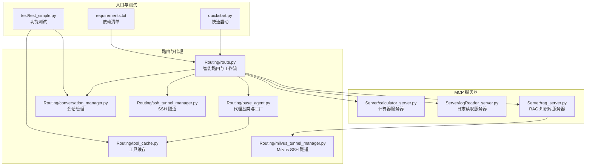
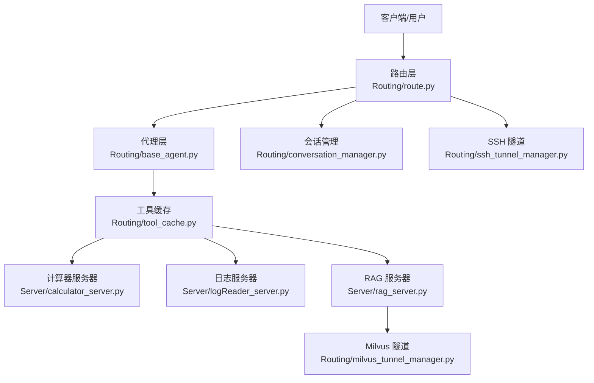
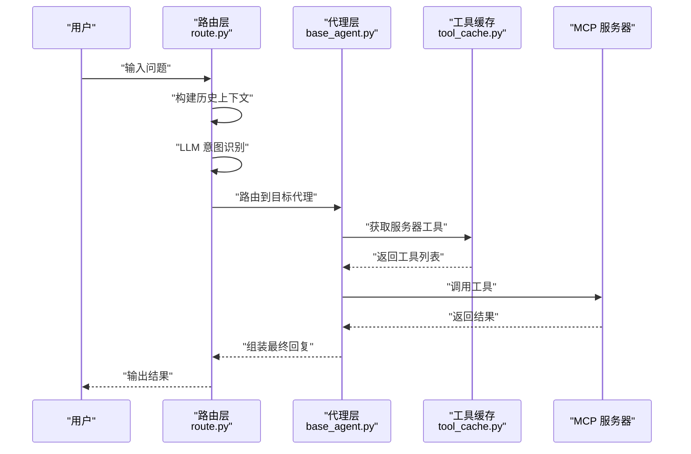
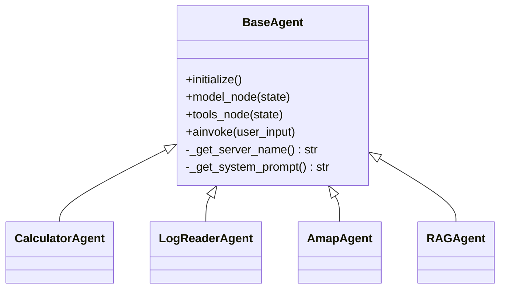
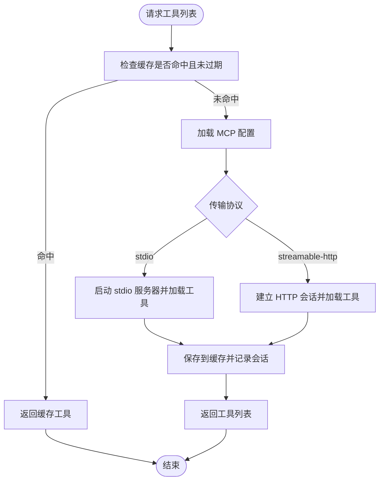
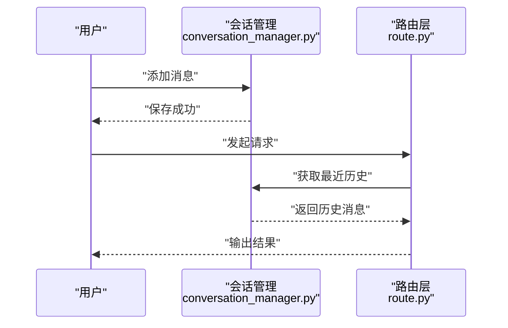
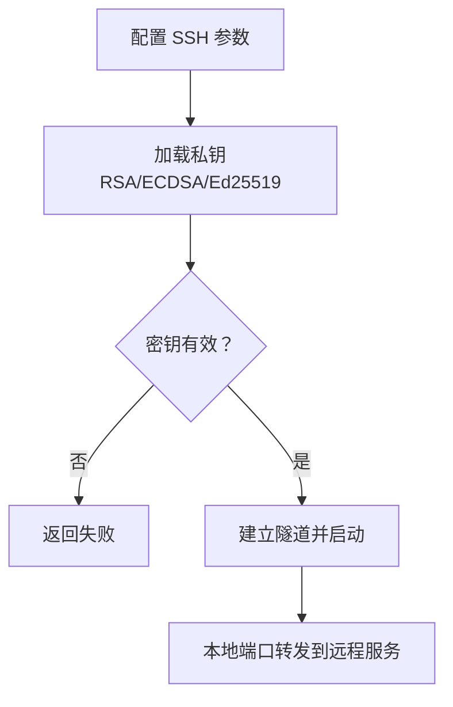
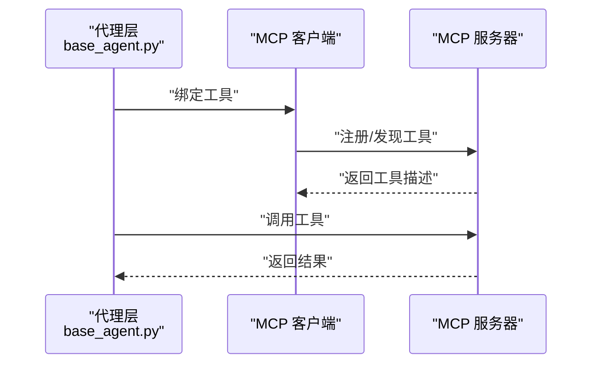
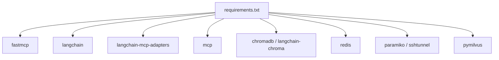

# 功能实现

<cite>
**本文引用的文件**
- [README.md](file://README.md)
- [quickstart.py](file://quickstart.py)
- [Routing/route.py](file://Routing/route.py)
- [Routing/base_agent.py](file://Routing/base_agent.py)
- [Routing/tool_cache.py](file://Routing/tool_cache.py)
- [Routing/conversation_manager.py](file://Routing/conversation_manager.py)
- [Routing/ssh_tunnel_manager.py](file://Routing/ssh_tunnel_manager.py)
- [Routing/milvus_tunnel_manager.py](file://Routing/milvus_tunnel_manager.py)
- [Server/calculator_server.py](file://Server/calculator_server.py)
- [Server/logReader_server.py](file://Server/logReader_server.py)
- [Server/rag_server.py](file://Server/rag_server.py)
- [test/test_simple.py](file://test/test_simple.py)
- [requirements.txt](file://requirements.txt)
</cite>

## 目录
1. [简介](#简介)
2. [项目结构](#项目结构)
3. [核心组件](#核心组件)
4. [架构总览](#架构总览)
5. [详细组件分析](#详细组件分析)
6. [依赖分析](#依赖分析)
7. [性能考虑](#性能考虑)
8. [故障排查指南](#故障排查指南)
9. [结论](#结论)
10. [附录](#附录)

## 简介
本项目基于 Model Context Protocol（MCP）协议，构建了一个智能代理系统，通过标准化协议连接 AI 模型与外部工具/数据源。系统提供如下核心能力：
- 智能路由：根据用户输入自动识别意图并路由到合适的代理（计算器、日志读取、高德地图、RAG 知识库）。
- 动态工具加载：通过 langchain-mcp-adapters 动态加载 MCP 服务器提供的工具，支持 stdio 与 streamable-http 两种传输协议。
- 多服务器支持：同时连接多个 MCP 服务器（计算器、日志读取、RAG 知识库、高德地图等）。
- 高德地图集成：集成高德地图 MCP 服务，支持天气查询、地理编码、路径规划、POI 搜索、IP 定位等。
- 会话管理与历史上下文：支持多轮对话、历史消息管理、Redis 持久化与 SSH 隧道安全连接。

## 项目结构
项目采用模块化组织，围绕“路由”“代理基类”“工具缓存”“会话管理”“MCP 服务器”等核心模块展开，配合测试与快速启动脚本，形成完整的功能闭环。

**图表来源**
- [Routing/route.py:258-291](file://Routing/route.py#L258-L291)
- [Routing/base_agent.py:238-256](file://Routing/base_agent.py#L238-L256)
- [Routing/tool_cache.py:85-116](file://Routing/tool_cache.py#L85-L116)
- [Routing/conversation_manager.py:100-120](file://Routing/conversation_manager.py#L100-L120)
- [Routing/ssh_tunnel_manager.py:19-40](file://Routing/ssh_tunnel_manager.py#L19-L40)
- [Routing/milvus_tunnel_manager.py:20-48](file://Routing/milvus_tunnel_manager.py#L20-L48)
- [Server/calculator_server.py:108-111](file://Server/calculator_server.py#L108-L111)
- [Server/logReader_server.py:148-151](file://Server/logReader_server.py#L148-L151)
- [Server/rag_server.py:356-363](file://Server/rag_server.py#L356-L363)
- [quickstart.py:8-57](file://quickstart.py#L8-L57)
- [test/test_simple.py:11-43](file://test/test_simple.py#L11-L43)
- [requirements.txt:1-17](file://requirements.txt#L1-L17)

**章节来源**
- [README.md:5-36](file://README.md#L5-L36)
- [requirements.txt:1-17](file://requirements.txt#L1-L17)

## 核心组件
- 智能路由与工作流：基于 LangGraph 的状态机，负责意图识别、决策与节点调度，支持会话历史注入与多轮对话。
- 代理基类与工厂：统一工具加载、消息处理、错误处理，提供计算器、日志读取、高德地图、RAG 四类专用代理。
- 工具缓存：全局单例缓存，按服务器名称与 TTL 策略管理 MCP 工具，支持 stdio 与 streamable-http 两种传输协议。
- 会话管理：多轮对话历史管理，支持内存与 Redis 持久化，自动清理过期会话。
- SSH 隧道：安全连接远程 Redis 与 Milvus，支持多种 SSH 密钥格式与端口转发。
- MCP 服务器：计算器、日志读取、RAG 知识库三类服务器，以 stdio 方式运行，提供工具注册与调用。

**章节来源**
- [Routing/route.py:149-233](file://Routing/route.py#L149-L233)
- [Routing/base_agent.py:29-66](file://Routing/base_agent.py#L29-L66)
- [Routing/tool_cache.py:39-65](file://Routing/tool_cache.py#L39-L65)
- [Routing/conversation_manager.py:82-120](file://Routing/conversation_manager.py#L82-L120)
- [Routing/ssh_tunnel_manager.py:12-40](file://Routing/ssh_tunnel_manager.py#L12-L40)
- [Routing/milvus_tunnel_manager.py:14-48](file://Routing/milvus_tunnel_manager.py#L14-L48)
- [Server/calculator_server.py:12-13](file://Server/calculator_server.py#L12-L13)
- [Server/logReader_server.py:14-15](file://Server/logReader_server.py#L14-L15)
- [Server/rag_server.py:44-45](file://Server/rag_server.py#L44-L45)

## 架构总览
系统采用“路由层 + 代理层 + 工具层 + 数据层”的分层架构。路由层负责意图识别与工作流编排；代理层通过工具缓存统一加载外部工具；会话管理层提供历史上下文；数据层由本地/远程向量库与 Redis 提供支撑。

**图表来源**
- [Routing/route.py:258-291](file://Routing/route.py#L258-L291)
- [Routing/base_agent.py:44-66](file://Routing/base_agent.py#L44-L66)
- [Routing/tool_cache.py:118-139](file://Routing/tool_cache.py#L118-L139)
- [Routing/conversation_manager.py:100-120](file://Routing/conversation_manager.py#L100-L120)
- [Routing/ssh_tunnel_manager.py:19-40](file://Routing/ssh_tunnel_manager.py#L19-L40)
- [Routing/milvus_tunnel_manager.py:20-48](file://Routing/milvus_tunnel_manager.py#L20-L48)
- [Server/calculator_server.py:108-111](file://Server/calculator_server.py#L108-L111)
- [Server/logReader_server.py:148-151](file://Server/logReader_server.py#L148-L151)
- [Server/rag_server.py:356-363](file://Server/rag_server.py#L356-L363)

## 详细组件分析

### 智能路由与工作流
- 意图识别：通过 LLM 对当前输入与历史上下文进行分类，返回“calculator”“log_reader”“amap”“rag_query”四类意图。
- 节点调度：根据意图路由到对应代理节点，执行工具调用与结果汇总。
- 历史注入：将最近若干轮对话注入当前输入，提升上下文理解能力。
- 会话管理：自动创建/复用会话 ID，保存用户与 AI 消息，支持清空与统计。

**图表来源**
- [Routing/route.py:149-233](file://Routing/route.py#L149-L233)
- [Routing/base_agent.py:44-66](file://Routing/base_agent.py#L44-L66)
- [Routing/tool_cache.py:85-116](file://Routing/tool_cache.py#L85-L116)
- [Server/calculator_server.py:16-105](file://Server/calculator_server.py#L16-L105)
- [Server/logReader_server.py:18-102](file://Server/logReader_server.py#L18-L102)
- [Server/rag_server.py:193-244](file://Server/rag_server.py#L193-L244)

**章节来源**
- [Routing/route.py:149-233](file://Routing/route.py#L149-L233)
- [Routing/route.py:351-414](file://Routing/route.py#L351-L414)

### 代理基类与工厂
- 统一初始化：延迟初始化，按服务器名称从工具缓存加载工具，绑定到 LLM。
- 工作流构建：模型节点与工具节点的条件边，支持多次工具调用与结果回传。
- 错误处理：捕获模型调用与工具执行异常，返回结构化错误信息。
- 专用代理：CalculatorAgent、LogReaderAgent、AmapAgent、RAGAgent，分别绑定不同服务器名称与系统提示词。

**图表来源**
- [Routing/base_agent.py:29-66](file://Routing/base_agent.py#L29-L66)
- [Routing/base_agent.py:322-330](file://Routing/base_agent.py#L322-L330)
- [Routing/base_agent.py:403-415](file://Routing/base_agent.py#L403-L415)
- [Routing/base_agent.py:418-431](file://Routing/base_agent.py#L418-L431)
- [Routing/base_agent.py:433-462](file://Routing/base_agent.py#L433-L462)

**章节来源**
- [Routing/base_agent.py:44-66](file://Routing/base_agent.py#L44-L66)
- [Routing/base_agent.py:102-130](file://Routing/base_agent.py#L102-L130)
- [Routing/base_agent.py:131-217](file://Routing/base_agent.py#L131-L217)
- [Routing/base_agent.py:238-256](file://Routing/base_agent.py#L238-L256)
- [Routing/base_agent.py:258-317](file://Routing/base_agent.py#L258-L317)
- [Routing/base_agent.py:467-496](file://Routing/base_agent.py#L467-L496)

### 工具缓存与动态加载
- 缓存策略：按服务器名称与 TTL 管理工具列表，避免重复加载。
- 传输协议：支持 stdio 与 streamable-http，自动解析环境变量与路径。
- 会话管理：记录活跃会话，提供清理与统计接口。
- 异常处理：连接超时、协议不支持、环境变量缺失等情况均有明确报错。

**图表来源**
- [Routing/tool_cache.py:85-116](file://Routing/tool_cache.py#L85-L116)
- [Routing/tool_cache.py:118-139](file://Routing/tool_cache.py#L118-L139)
- [Routing/tool_cache.py:141-193](file://Routing/tool_cache.py#L141-L193)
- [Routing/tool_cache.py:198-242](file://Routing/tool_cache.py#L198-L242)

**章节来源**
- [Routing/tool_cache.py:39-65](file://Routing/tool_cache.py#L39-L65)
- [Routing/tool_cache.py:85-116](file://Routing/tool_cache.py#L85-L116)
- [Routing/tool_cache.py:118-139](file://Routing/tool_cache.py#L118-L139)
- [Routing/tool_cache.py:198-242](file://Routing/tool_cache.py#L198-L242)
- [Routing/tool_cache.py:281-297](file://Routing/tool_cache.py#L281-L297)

### 会话管理与历史上下文
- 会话生命周期：创建、消息追加、历史获取、过期清理、持久化。
- 内存与 Redis：默认内存存储，可启用 Redis 持久化与自动清理。
- 上下文注入：路由层将最近 N 轮对话注入当前输入，增强理解能力。

**图表来源**
- [Routing/conversation_manager.py:166-184](file://Routing/conversation_manager.py#L166-L184)
- [Routing/conversation_manager.py:200-214](file://Routing/conversation_manager.py#L200-L214)
- [Routing/route.py:111-146](file://Routing/route.py#L111-L146)

**章节来源**
- [Routing/conversation_manager.py:82-120](file://Routing/conversation_manager.py#L82-L120)
- [Routing/conversation_manager.py:166-184](file://Routing/conversation_manager.py#L166-L184)
- [Routing/conversation_manager.py:234-253](file://Routing/conversation_manager.py#L234-L253)
- [Routing/route.py:111-146](file://Routing/route.py#L111-L146)

### SSH 隧道与远程服务
- Redis 隧道：通过 SSH 私钥建立本地到远程 Redis 的端口转发，支持多种密钥格式。
- Milvus 隧道：与 Redis 隧道一致的实现，用于连接远程 Milvus gRPC 服务。
- 安全性：自动识别密钥类型，失败时提供明确错误信息。

**图表来源**
- [Routing/ssh_tunnel_manager.py:19-40](file://Routing/ssh_tunnel_manager.py#L19-L40)
- [Routing/ssh_tunnel_manager.py:42-59](file://Routing/ssh_tunnel_manager.py#L42-L59)
- [Routing/milvus_tunnel_manager.py:20-48](file://Routing/milvus_tunnel_manager.py#L20-L48)
- [Routing/milvus_tunnel_manager.py:50-67](file://Routing/milvus_tunnel_manager.py#L50-L67)

**章节来源**
- [Routing/ssh_tunnel_manager.py:12-40](file://Routing/ssh_tunnel_manager.py#L12-L40)
- [Routing/ssh_tunnel_manager.py:75-80](file://Routing/ssh_tunnel_manager.py#L75-L80)
- [Routing/milvus_tunnel_manager.py:14-48](file://Routing/milvus_tunnel_manager.py#L14-L48)
- [Routing/milvus_tunnel_manager.py:82-88](file://Routing/milvus_tunnel_manager.py#L82-L88)

### MCP 服务器
- 计算器服务器：提供加减乘除工具，以 stdio 模式运行。
- 日志读取服务器：提供读取最新日志、按关键词搜索、获取统计信息等工具。
- RAG 知识库服务器：提供知识检索、切换后端、手动加载文档、统计信息查询等工具，支持 ChromaDB 与 Milvus。

**图表来源**
- [Server/calculator_server.py:16-105](file://Server/calculator_server.py#L16-L105)
- [Server/logReader_server.py:18-102](file://Server/logReader_server.py#L18-L102)
- [Server/rag_server.py:193-244](file://Server/rag_server.py#L193-L244)
- [Server/rag_server.py:247-276](file://Server/rag_server.py#L247-L276)
- [Server/rag_server.py:279-303](file://Server/rag_server.py#L279-L303)
- [Server/rag_server.py:306-353](file://Server/rag_server.py#L306-L353)
- [Server/rag_server.py:356-363](file://Server/rag_server.py#L356-L363)

**章节来源**
- [Server/calculator_server.py:12-13](file://Server/calculator_server.py#L12-L13)
- [Server/calculator_server.py:16-105](file://Server/calculator_server.py#L16-L105)
- [Server/logReader_server.py:14-15](file://Server/logReader_server.py#L14-L15)
- [Server/logReader_server.py:18-102](file://Server/logReader_server.py#L18-L102)
- [Server/logReader_server.py:105-145](file://Server/logReader_server.py#L105-L145)
- [Server/rag_server.py:44-45](file://Server/rag_server.py#L44-L45)
- [Server/rag_server.py:193-244](file://Server/rag_server.py#L193-L244)
- [Server/rag_server.py:247-276](file://Server/rag_server.py#L247-L276)
- [Server/rag_server.py:279-303](file://Server/rag_server.py#L279-L303)
- [Server/rag_server.py:306-353](file://Server/rag_server.py#L306-L353)
- [Server/rag_server.py:356-363](file://Server/rag_server.py#L356-L363)

## 依赖分析
- 核心依赖：fastmcp、langchain、langchain-mcp-adapters、mcp、chromadb、langchain-chroma、redis、paramiko、sshtunnel、pymilvus 等。
- 模块耦合：路由层依赖代理层与会话管理；代理层依赖工具缓存；RAG 服务器依赖 Milvus 隧道与嵌入模型；SSH 隧道为远程服务提供安全通道。
- 外部集成：高德地图通过 streamable-http 协议接入；计算器与日志服务器通过 stdio 接入。

**图表来源**
- [requirements.txt:1-17](file://requirements.txt#L1-L17)

**章节来源**
- [requirements.txt:1-17](file://requirements.txt#L1-L17)

## 性能考虑
- 工具缓存：通过 TTL 与单例缓存减少重复连接与加载开销，建议合理设置 TTL 以平衡新鲜度与性能。
- 并发与异步：路由与代理均采用异步实现，适合高并发场景；工具调用按序执行，避免竞争条件。
- 向量检索：Milvus 后端支持批量查询与分页统计，建议根据数据规模调整 nprobe 与分片策略。
- 网络与隧道：SSH 隧道建立与 HTTP 会话初始化存在超时控制，建议在网络不稳定环境下适当放宽超时阈值。
- 会话清理：定期清理过期会话，避免内存与 Redis 压力过大。

## 故障排查指南
- 环境变量缺失：确认 .env 中 DASHSCOPE_API_KEY、AMAP_API_KEY、LLM_* 等配置正确。
- 工具加载失败：检查 mcp.json 中服务器配置与传输协议；stdio 服务器命令与参数是否正确；streamable-http URL 与 AMAP_API_KEY 是否有效。
- SSH 隧道失败：确认密钥文件路径与权限、主机与端口可达、密钥类型受支持。
- RAG 后端不可用：Milvus 依赖缺失时会回退到 ChromaDB；检查 pymilvus 安装与隧道端口。
- 会话持久化失败：Redis 连接失败时自动降级为内存模式；检查 Redis 地址、端口与密码。

**章节来源**
- [Routing/tool_cache.py:198-242](file://Routing/tool_cache.py#L198-L242)
- [Routing/tool_cache.py:244-279](file://Routing/tool_cache.py#L244-L279)
- [Routing/ssh_tunnel_manager.py:75-80](file://Routing/ssh_tunnel_manager.py#L75-L80)
- [Routing/milvus_tunnel_manager.py:84-88](file://Routing/milvus_tunnel_manager.py#L84-L88)
- [Server/rag_server.py:31-32](file://Server/rag_server.py#L31-L32)
- [Routing/conversation_manager.py:112-118](file://Routing/conversation_manager.py#L112-L118)

## 结论
本项目通过标准化的 MCP 协议与模块化设计，实现了从意图识别到工具调用的完整链路。工具缓存、会话管理、SSH 隧道与多服务器支持共同构成了高可用、可扩展的 AiOps 能力体系。通过合理的参数配置与性能优化，可在生产环境中稳定运行并持续演进。

## 附录

### 快速启动与示例
- 运行快速启动脚本，查看可用工具并进行示例对话。
- 交互式聊天入口与多服务器演示可参考 README 与 quickstart。

**章节来源**
- [quickstart.py:8-57](file://quickstart.py#L8-L57)
- [README.md:51-78](file://README.md#L51-L78)

### 功能测试方法
- 缓存与会话测试：验证工具缓存命中、会话历史与统计信息。
- 路由与代理测试：模拟多轮对话，观察历史上下文注入与代理路由行为。

**章节来源**
- [test/test_simple.py:11-43](file://test/test_simple.py#L11-L43)
- [test/test_simple.py:46-78](file://test/test_simple.py#L46-L78)