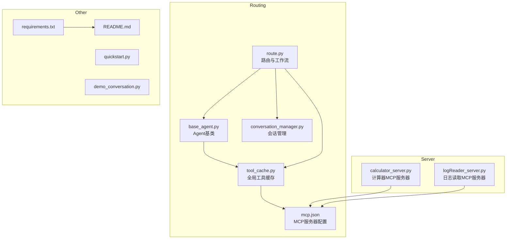
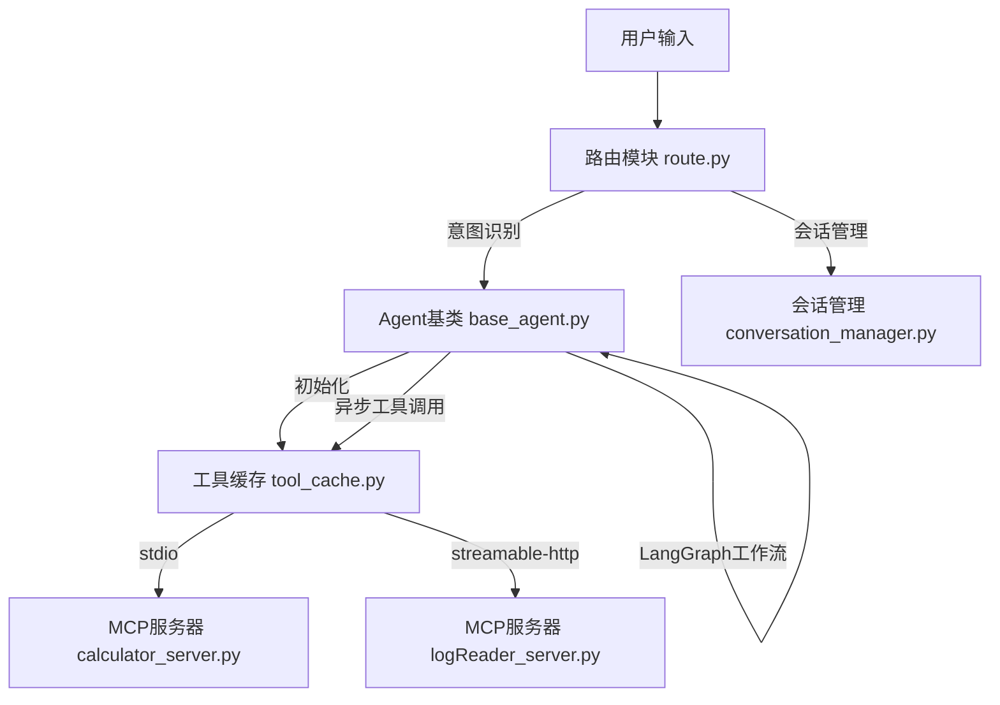
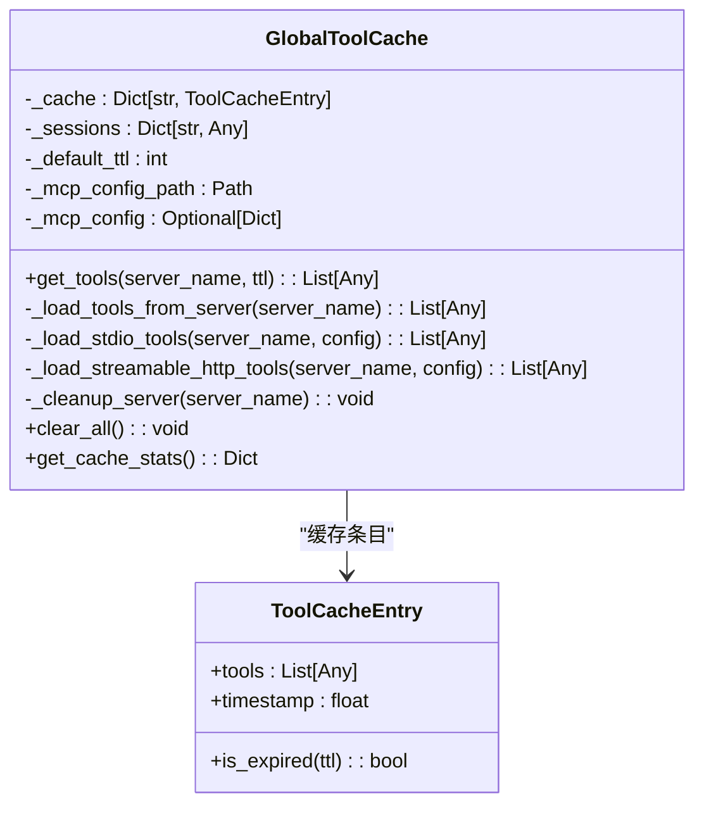
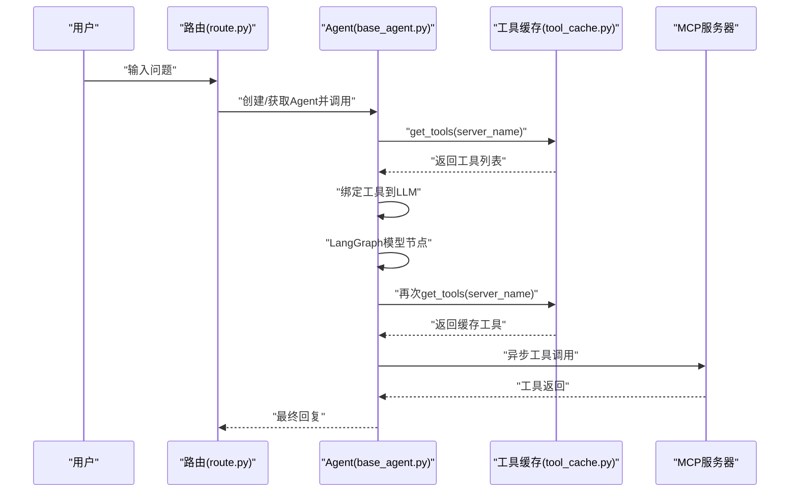
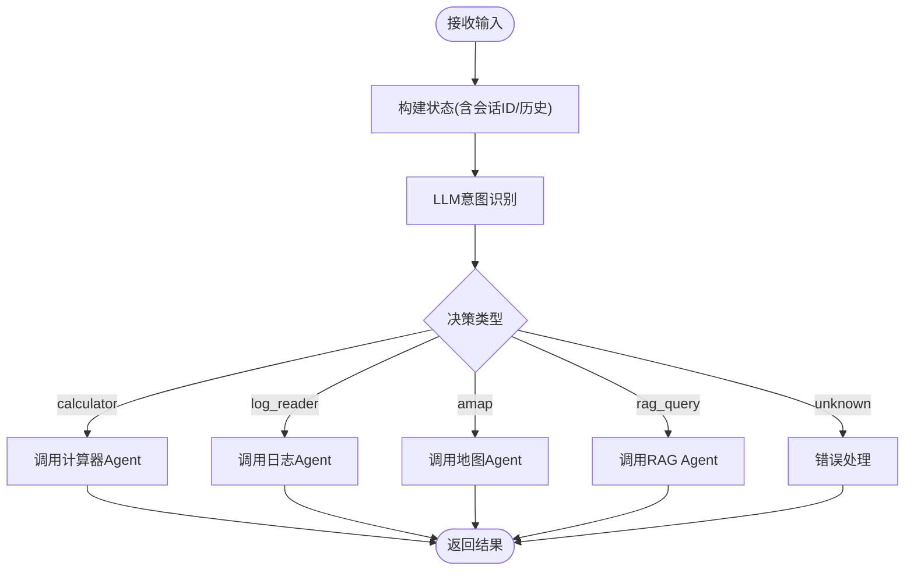
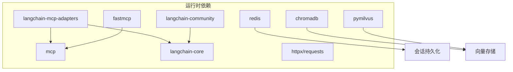

# 动态工具加载

<cite>
**本文档引用的文件**
- [tool_cache.py](file://Routing/tool_cache.py)
- [mcp.json](file://Routing/mcp.json)
- [base_agent.py](file://Routing/base_agent.py)
- [route.py](file://Routing/route.py)
- [conversation_manager.py](file://Routing/conversation_manager.py)
- [calculator_server.py](file://Server/calculator_server.py)
- [logReader_server.py](file://Server/logReader_server.py)
- [requirements.txt](file://requirements.txt)
- [README.md](file://README.md)
- [quickstart.py](file://quickstart.py)
- [demo_conversation.py](file://demo_conversation.py)
</cite>

## 目录
1. [简介](#简介)
2. [项目结构](#项目结构)
3. [核心组件](#核心组件)
4. [架构总览](#架构总览)
5. [详细组件分析](#详细组件分析)
6. [依赖分析](#依赖分析)
7. [性能考虑](#性能考虑)
8. [故障排除指南](#故障排除指南)
9. [结论](#结论)
10. [附录](#附录)

## 简介
本项目基于 Model Context Protocol (MCP) 构建，通过 langchain-mcp-adapters 实现动态工具加载。系统围绕“全局工具缓存”“连接管理”“会话持久化”三大支柱展开，提供：
- 基于服务器名称的 TTL 缓存，避免重复加载 MCP 工具
- 支持 stdio 与 streamable-http 两种传输协议的连接管理
- 统一的 Agent 基类与 LangGraph 工作流，实现工具调用与异步处理
- 会话管理与 Redis 持久化，支撑多轮对话与上下文保持

## 项目结构
项目采用按功能域划分的模块化组织方式，核心目录与职责如下：
- Routing：路由与工具加载、会话管理、Agent 基类
- Server：MCP 工具服务器（计算器、日志读取等）
- requirements.txt：运行依赖
- README.md：项目说明与使用指南
- quickstart.py：快速启动脚本
- demo_conversation.py：演示脚本，展示缓存与会话功能

图表来源
- [tool_cache.py:1-302](file://Routing/tool_cache.py#L1-L302)
- [mcp.json:1-29](file://Routing/mcp.json#L1-L29)
- [base_agent.py:1-497](file://Routing/base_agent.py#L1-L497)
- [route.py:1-553](file://Routing/route.py#L1-L553)
- [conversation_manager.py:1-275](file://Routing/conversation_manager.py#L1-L275)
- [calculator_server.py:1-111](file://Server/calculator_server.py#L1-L111)
- [logReader_server.py:1-151](file://Server/logReader_server.py#L1-L151)
- [requirements.txt:1-17](file://requirements.txt#L1-L17)
- [README.md:1-125](file://README.md#L1-L125)
- [quickstart.py:1-68](file://quickstart.py#L1-L68)
- [demo_conversation.py:1-102](file://demo_conversation.py#L1-L102)

章节来源
- [README.md:1-125](file://README.md#L1-L125)
- [requirements.txt:1-17](file://requirements.txt#L1-L17)

## 核心组件
- 全局工具缓存 GlobalToolCache：负责 MCP 工具的加载、缓存、TTL 过期、连接管理与清理
- Agent 基类 BaseAgent：封装工具绑定、LangGraph 工作流、工具调用与异步处理
- 路由与会话 route.py：意图识别、路由到具体 Agent、会话管理与上下文拼接
- 会话管理 ConversationManager：内存与 Redis 双层会话存储，支持过期清理
- MCP 服务器：计算器、日志读取等工具服务器，通过 stdio 或 HTTP 暴露工具

章节来源
- [tool_cache.py:39-302](file://Routing/tool_cache.py#L39-L302)
- [base_agent.py:29-318](file://Routing/base_agent.py#L29-L318)
- [route.py:149-291](file://Routing/route.py#L149-L291)
- [conversation_manager.py:82-275](file://Routing/conversation_manager.py#L82-L275)

## 架构总览
系统通过“路由 → Agent → 工具缓存 → MCP 服务器”的链路实现动态工具加载与调用。Agent 在初始化时从全局缓存获取工具，工具调用通过异步方式执行，路由层支持多轮对话与上下文拼接。

图表来源
- [route.py:149-291](file://Routing/route.py#L149-L291)
- [base_agent.py:44-318](file://Routing/base_agent.py#L44-L318)
- [tool_cache.py:85-243](file://Routing/tool_cache.py#L85-L243)
- [calculator_server.py:108-111](file://Server/calculator_server.py#L108-L111)
- [logReader_server.py:148-151](file://Server/logReader_server.py#L148-L151)
- [conversation_manager.py:122-275](file://Routing/conversation_manager.py#L122-L275)

## 详细组件分析

### 工具缓存架构与连接管理
- 缓存策略
  - 以服务器名为键，缓存工具列表与时间戳
  - 默认 TTL 300 秒，可通过参数覆盖
  - 过期检查基于时间戳差值
- 连接管理
  - stdio：通过 MultiServerMCPClient 启动子进程，保存客户端引用以维持连接
  - streamable-http：通过 streamable_http_client 建立 HTTP 会话，初始化后加载工具
  - 超时控制：HTTP 连接超时 10 秒
- 清理机制
  - 过期缓存清理与会话关闭
  - 应用关闭时统一清理所有缓存与会话

图表来源
- [tool_cache.py:27-302](file://Routing/tool_cache.py#L27-L302)

章节来源
- [tool_cache.py:85-243](file://Routing/tool_cache.py#L85-L243)
- [tool_cache.py:244-297](file://Routing/tool_cache.py#L244-L297)

### Agent 初始化与工具调用流程
- 初始化
  - 从全局缓存按服务器名获取工具
  - 绑定 LLM 并构建 LangGraph 工作流
- 工具调用
  - 从缓存重建工具映射，逐个异步执行
  - 对计算器工具提取 result 字段，避免 LLM 解释原始数据
  - 捕获异常并生成工具消息

图表来源
- [base_agent.py:44-318](file://Routing/base_agent.py#L44-L318)
- [tool_cache.py:85-116](file://Routing/tool_cache.py#L85-L116)
- [route.py:351-414](file://Routing/route.py#L351-L414)

章节来源
- [base_agent.py:44-318](file://Routing/base_agent.py#L44-L318)

### 路由与会话管理
- 路由
  - 基于 LLM 的意图识别，将输入路由到对应 Agent
  - 支持历史上下文拼接，增强理解能力
- 会话
  - 内存会话与 Redis 持久化双层存储
  - 自动清理过期会话，支持多轮对话

图表来源
- [route.py:149-233](file://Routing/route.py#L149-L233)
- [route.py:242-256](file://Routing/route.py#L242-L256)
- [conversation_manager.py:122-275](file://Routing/conversation_manager.py#L122-L275)

章节来源
- [route.py:149-291](file://Routing/route.py#L149-L291)
- [conversation_manager.py:82-275](file://Routing/conversation_manager.py#L82-L275)

### MCP 服务器示例
- 计算器服务器：提供加减乘除工具，通过 stdio 启动
- 日志读取服务器：提供读取日志、关键词搜索、统计信息工具，通过 stdio 启动

章节来源
- [calculator_server.py:16-105](file://Server/calculator_server.py#L16-L105)
- [logReader_server.py:18-145](file://Server/logReader_server.py#L18-L145)

## 依赖分析
- langchain-mcp-adapters：动态加载 MCP 工具的核心适配器
- mcp：MCP 协议客户端（stdio/streamable-http）
- fastmcp：MCP 服务器框架
- langchain/langchain-community/langchain-core：LLM 与工具绑定
- redis/chromadb/pymilvus：会话与知识库后端（按需）

图表来源
- [requirements.txt:1-17](file://requirements.txt#L1-L17)
- [tool_cache.py:18-25](file://Routing/tool_cache.py#L18-L25)

章节来源
- [requirements.txt:1-17](file://requirements.txt#L1-L17)

## 性能考虑
- 工具缓存
  - TTL 控制减少重复加载，建议根据工具稳定性调整默认 TTL
  - 缓存命中率与会话复用率成正比
- 连接管理
  - stdio：进程启动成本较高，适合轻量工具；保持客户端引用避免频繁重启
  - streamable-http：长连接复用，适合高频调用；注意超时与重试策略
- 异步处理
  - 工具调用采用异步，避免阻塞；建议在高并发场景下限制并发度
- 会话持久化
  - Redis 持久化降低内存压力；合理设置 TTL 与清理策略

[本节为通用性能指导，不直接分析特定文件]

## 故障排除指南
- 工具加载失败
  - 检查 mcp.json 中服务器配置与传输协议
  - 确认 stdio 命令与参数路径正确，必要时使用绝对路径
  - streamable-http 需要 AMAP_API_KEY 环境变量
- 连接超时
  - HTTP 连接默认超时 10 秒，网络不稳定时适当增加超时
- 缓存未生效
  - 确认 TTL 设置与时间戳逻辑
  - 使用 get_cache_stats 查看缓存状态
- 会话异常
  - 检查 Redis 连接配置与权限
  - 观察过期清理日志，确认会话是否被提前移除

章节来源
- [tool_cache.py:67-78](file://Routing/tool_cache.py#L67-L78)
- [tool_cache.py:198-242](file://Routing/tool_cache.py#L198-L242)
- [tool_cache.py:244-297](file://Routing/tool_cache.py#L244-L297)
- [route.py:434-456](file://Routing/route.py#L434-L456)

## 结论
本系统通过“全局工具缓存 + 连接管理 + 会话持久化”的组合，实现了高性能、可扩展的动态工具加载与调用。配合 LangGraph 工作流与统一 Agent 基类，能够稳定支撑多轮对话与复杂业务场景。建议在生产环境中结合实际负载调整 TTL、连接超时与并发策略，并完善监控与告警机制。

[本节为总结性内容，不直接分析特定文件]

## 附录

### 配置示例与使用指南
- MCP 服务器配置
  - 在 mcp.json 中定义服务器名称、传输协议与参数
  - stdio：command 与 args；支持相对路径解析与环境变量替换
  - streamable-http：url 支持 AMAP_API_KEY 环境变量替换
- 环境变量
  - DASHSCOPE_API_KEY：LLM 接入密钥
  - AMAP_API_KEY：高德 MCP 服务密钥
  - LLM_BASE_URL/LLM_MODEL/LLM_TEMPERATURE：LLM 参数
  - Redis 相关：REDIS_HOST/PORT/PASSWORD/TTL
- 快速启动
  - 运行 quickstart.py 或 LangGraph 客户端脚本体验工具加载与调用

章节来源
- [mcp.json:1-29](file://Routing/mcp.json#L1-L29)
- [base_agent.py:73-88](file://Routing/base_agent.py#L73-L88)
- [route.py:298-347](file://Routing/route.py#L298-L347)
- [quickstart.py:1-68](file://quickstart.py#L1-L68)

### 添加新工具与服务器
- 新增 MCP 服务器
  - 实现工具函数并以 stdio 或 HTTP 暴露
  - 在 mcp.json 中新增服务器配置
- 注册到 Agent
  - 在 Agent 子类中返回新的服务器名称
  - 初始化时自动从缓存加载工具
- 生命周期管理
  - 工具缓存在 TTL 到期后自动清理
  - 应用关闭时统一清理缓存与会话

章节来源
- [calculator_server.py:108-111](file://Server/calculator_server.py#L108-L111)
- [logReader_server.py:148-151](file://Server/logReader_server.py#L148-L151)
- [base_agent.py:322-497](file://Routing/base_agent.py#L322-L497)
- [route.py:434-456](file://Routing/route.py#L434-L456)

### 异步处理与最佳实践
- 异步工具调用
  - 工具调用采用异步，避免阻塞主线程
  - 对计算器工具提取 result 字段，减少 LLM 解释负担
- 最佳实践
  - 合理设置 TTL，平衡性能与新鲜度
  - 对 HTTP 连接设置超时与重试
  - 使用会话管理保持上下文，提升用户体验
  - 在高并发场景下限制工具调用并发度

章节来源
- [base_agent.py:169-217](file://Routing/base_agent.py#L169-L217)
- [tool_cache.py:217-223](file://Routing/tool_cache.py#L217-L223)