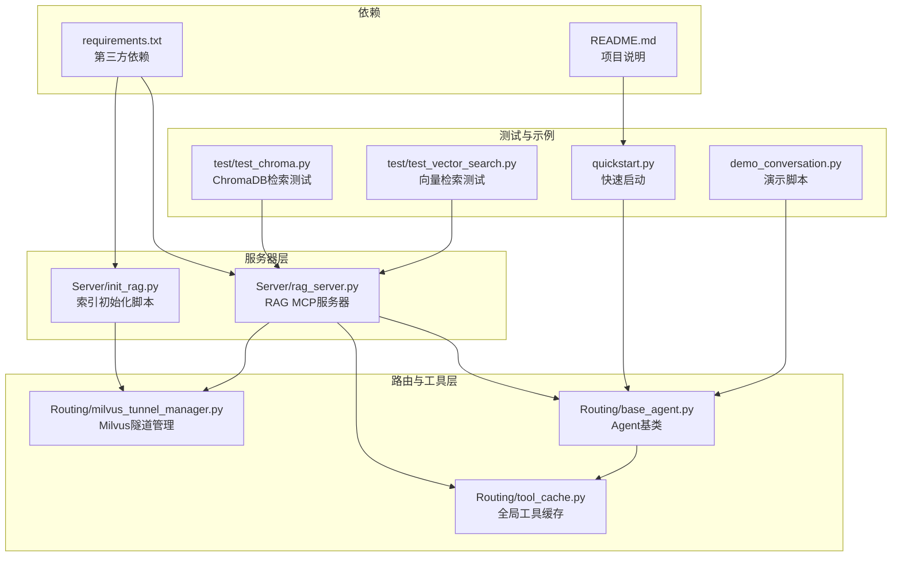
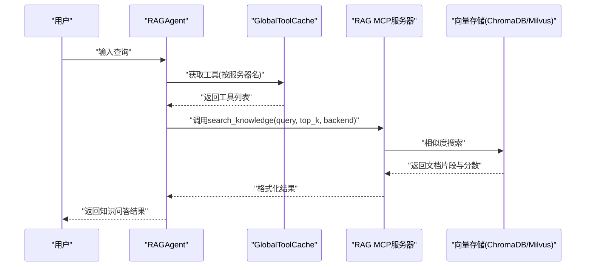
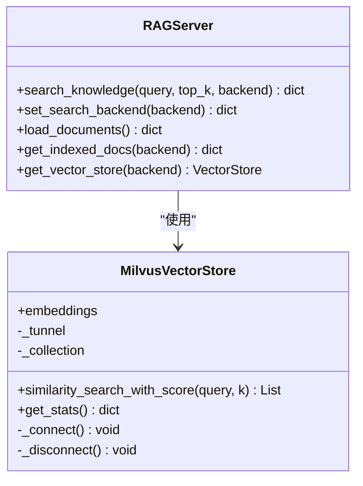
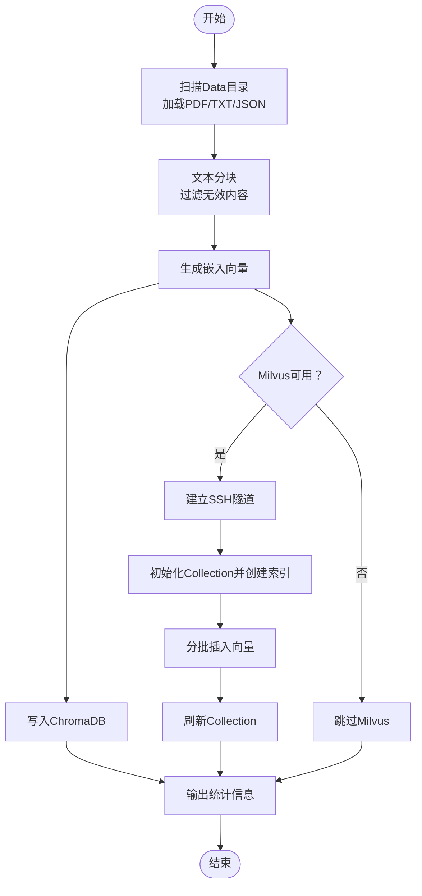
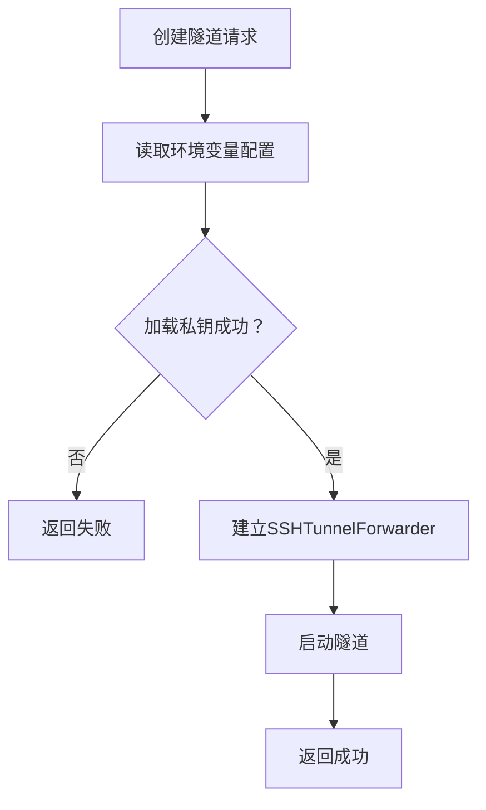
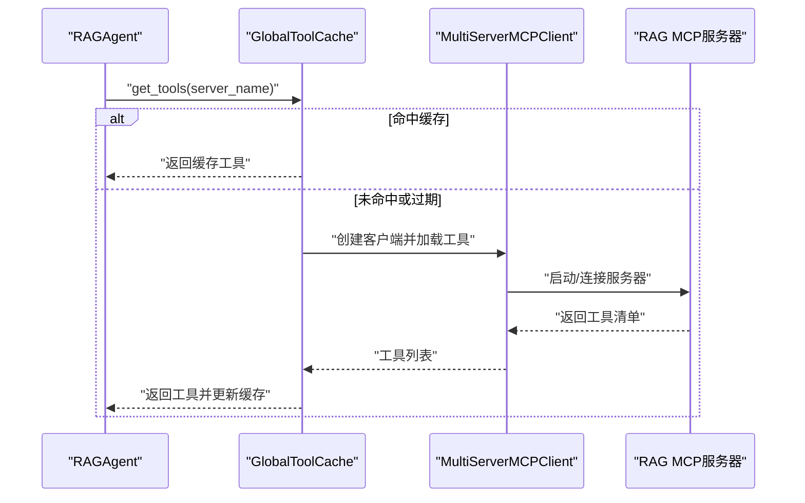
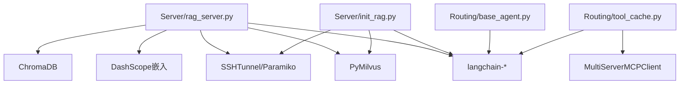

# RAG知识库服务器

<cite>
**本文档引用的文件**
- [Server/rag_server.py](file://Server/rag_server.py)
- [Server/init_rag.py](file://Server/init_rag.py)
- [Routing/milvus_tunnel_manager.py](file://Routing/milvus_tunnel_manager.py)
- [Routing/base_agent.py](file://Routing/base_agent.py)
- [Routing/tool_cache.py](file://Routing/tool_cache.py)
- [test/test_chroma.py](file://test/test_chroma.py)
- [test/test_vector_search.py](file://test/test_vector_search.py)
- [requirements.txt](file://requirements.txt)
- [README.md](file://README.md)
- [quickstart.py](file://quickstart.py)
- [demo_conversation.py](file://demo_conversation.py)
</cite>

## 目录
1. [简介](#简介)
2. [项目结构](#项目结构)
3. [核心组件](#核心组件)
4. [架构总览](#架构总览)
5. [详细组件分析](#详细组件分析)
6. [依赖关系分析](#依赖关系分析)
7. [性能考虑](#性能考虑)
8. [故障排除指南](#故障排除指南)
9. [结论](#结论)
10. [附录](#附录)

## 简介
本文件面向RAG知识库MCP服务器，系统性阐述其功能实现与工程实践，涵盖向量检索、文档索引、知识问答等核心能力；详解RAG工具参数配置、向量数据库集成（ChromaDB与Milvus）、查询优化机制；提供服务器初始化与配置指南（含ChromaDB与Milvus配置项）、实际应用场景与调用示例、向量数据库管理与维护建议、性能调优与内存优化策略，以及扩展开发指导。

## 项目结构
该项目采用模块化组织，围绕MCP协议构建智能代理系统，RAG知识库服务器作为MCP工具提供者，配合全局工具缓存与Agent基类实现统一的工具加载、状态管理与工作流编排。

**图表来源**
- [Server/rag_server.py:1-363](file://Server/rag_server.py#L1-L363)
- [Server/init_rag.py:1-506](file://Server/init_rag.py#L1-L506)
- [Routing/base_agent.py:1-497](file://Routing/base_agent.py#L1-L497)
- [Routing/tool_cache.py:1-302](file://Routing/tool_cache.py#L1-L302)
- [Routing/milvus_tunnel_manager.py:1-101](file://Routing/milvus_tunnel_manager.py#L1-L101)
- [test/test_chroma.py:1-29](file://test/test_chroma.py#L1-L29)
- [test/test_vector_search.py:1-66](file://test/test_vector_search.py#L1-L66)
- [quickstart.py:1-68](file://quickstart.py#L1-L68)
- [demo_conversation.py:1-102](file://demo_conversation.py#L1-L102)
- [requirements.txt:1-17](file://requirements.txt#L1-L17)
- [README.md:1-125](file://README.md#L1-L125)

**章节来源**
- [README.md:1-125](file://README.md#L1-L125)
- [requirements.txt:1-17](file://requirements.txt#L1-L17)

## 核心组件
- RAG MCP服务器：提供search_knowledge、set_search_backend、load_documents、get_indexed_docs等工具，支持ChromaDB与Milvus双后端，通过FastMCP暴露标准MCP接口。
- 索引初始化脚本：扫描Data目录，加载PDF/TXT/JSON文件，文本分块，生成向量并写入ChromaDB与Milvus。
- Milvus隧道管理器：通过SSH隧道将本地端口转发至远程Milvus gRPC端口，保障安全连接。
- Agent基类与工具缓存：统一Agent初始化、工具加载、状态管理与工作流编排，支持RAG Agent按后端选择提示词与工具调用约束。
- 测试与示例：提供ChromaDB检索测试、向量检索测试、快速启动与演示脚本，便于验证与集成。

**章节来源**
- [Server/rag_server.py:193-354](file://Server/rag_server.py#L193-L354)
- [Server/init_rag.py:294-496](file://Server/init_rag.py#L294-L496)
- [Routing/milvus_tunnel_manager.py:14-101](file://Routing/milvus_tunnel_manager.py#L14-L101)
- [Routing/base_agent.py:433-496](file://Routing/base_agent.py#L433-L496)
- [Routing/tool_cache.py:85-196](file://Routing/tool_cache.py#L85-L196)

## 架构总览
RAG知识库服务器通过FastMCP将工具注册为MCP服务，Agent通过全局工具缓存按需加载并绑定工具，形成“模型推理-工具调用-结果反馈”的闭环工作流。

**图表来源**
- [Routing/base_agent.py:102-130](file://Routing/base_agent.py#L102-L130)
- [Routing/tool_cache.py:85-196](file://Routing/tool_cache.py#L85-L196)
- [Server/rag_server.py:193-244](file://Server/rag_server.py#L193-L244)

## 详细组件分析

### RAG MCP服务器
- 工具定义
  - search_knowledge：在知识库中检索相关文档片段，支持top_k与后端选择。
  - set_search_backend：切换ChromaDB或Milvus作为搜索后端。
  - load_documents：手动触发Data目录文档加载与索引。
  - get_indexed_docs：查询当前后端的索引统计信息。
- 向量存储抽象
  - get_vector_store：根据后端参数返回ChromaDB或Milvus封装实例。
  - MilvusVectorStore：提供与ChromaDB兼容的相似度搜索接口，内置SSH隧道连接与断开。
- 环境与配置
  - 通过dotenv加载DASHSCOPE_API_KEY、MILVUS_LOCAL_PORT等环境变量。
  - 默认集合名为knowledge_base，持久化目录为vector_store。

**图表来源**
- [Server/rag_server.py:51-190](file://Server/rag_server.py#L51-L190)

**章节来源**
- [Server/rag_server.py:193-354](file://Server/rag_server.py#L193-L354)

### 索引初始化脚本
- 数据加载
  - PDF/TXT/JSON文件扫描与加载，为每个文档块添加source与file_type元数据。
- 文本分块
  - 使用递归字符分块器，设定chunk_size与chunk_overlap，过滤空内容。
- 向量生成与存储
  - 使用DashScope文本嵌入模型生成向量，批量写入ChromaDB。
  - 同步尝试写入Milvus，通过隧道连接远程服务，分批插入并刷新。
- 统计与报告
  - 输出源文件数、文件类型分布、向量总数等统计信息。

**图表来源**
- [Server/init_rag.py:294-496](file://Server/init_rag.py#L294-L496)

**章节来源**
- [Server/init_rag.py:1-506](file://Server/init_rag.py#L1-L506)

### Milvus隧道管理器
- 功能：通过SSH隧道将本地端口转发到远程Milvus gRPC端口，支持RSA/ECDSA/Ed25519私钥加载。
- 参数：支持从环境变量读取SSH主机、端口、用户名、私钥路径、远程端口与本地端口。
- 生命周期：创建隧道、启动、停止与异常处理。

**图表来源**
- [Routing/milvus_tunnel_manager.py:20-90](file://Routing/milvus_tunnel_manager.py#L20-L90)

**章节来源**
- [Routing/milvus_tunnel_manager.py:1-101](file://Routing/milvus_tunnel_manager.py#L1-L101)

### Agent基类与工具缓存
- Agent基类
  - 统一初始化流程：从工具缓存获取工具、绑定LLM、构建工作流。
  - 模型节点与工具节点：按条件路由，支持多轮对话与错误处理。
  - RAGAgent：根据后端选择系统提示词，明确工具调用时的backend参数要求。
- 工具缓存
  - 支持stdio与streamable-http两种传输协议，自动解析路径与环境变量。
  - TTL缓存策略，线程安全，支持清理过期缓存与会话。

**图表来源**
- [Routing/base_agent.py:44-66](file://Routing/base_agent.py#L44-L66)
- [Routing/tool_cache.py:85-196](file://Routing/tool_cache.py#L85-L196)

**章节来源**
- [Routing/base_agent.py:29-318](file://Routing/base_agent.py#L29-L318)
- [Routing/tool_cache.py:1-302](file://Routing/tool_cache.py#L1-L302)

## 依赖关系分析
- 第三方依赖：FastMCP、LangChain系列、DashScope嵌入、ChromaDB、PyMilvus、Paramiko、SSHTunnel等。
- 运行时依赖：MCP配置文件、.env环境变量、Data目录、vector_store持久化目录。

**图表来源**
- [requirements.txt:1-17](file://requirements.txt#L1-L17)
- [Server/rag_server.py:10-35](file://Server/rag_server.py#L10-L35)
- [Server/init_rag.py:6-31](file://Server/init_rag.py#L6-L31)
- [Routing/tool_cache.py:18-25](file://Routing/tool_cache.py#L18-L25)

**章节来源**
- [requirements.txt:1-17](file://requirements.txt#L1-L17)

## 性能考虑
- 向量检索
  - ChromaDB：本地嵌入模型与向量存储，适合小规模知识库与开发测试。
  - Milvus：远程集群部署，支持大规模向量检索，通过SSH隧道降低网络风险。
- 批处理与分片
  - 索引初始化与Milvus写入采用分批处理，减少API限制与内存峰值。
- 缓存策略
  - 工具缓存采用TTL机制，避免重复加载MCP服务器，提升Agent响应速度。
- 内存优化
  - 文本分块时过滤无效内容，减少向量维度与存储压力。
  - Milvus写入后flush，确保数据落盘与查询稳定性。
- 查询优化
  - Milvus搜索参数可调（如nprobe），平衡召回率与延迟。
  - ChromaDB使用相似度分数排序，top_k裁剪结果数量。

[本节为通用性能建议，不直接分析具体文件]

## 故障排除指南
- Milvus不可用
  - 现象：RAG服务器回退到ChromaDB，或MilvusVectorStore抛出不可用错误。
  - 排查：确认pymilvus安装、MCP配置文件中的传输协议、SSH隧道是否建立成功。
- SSH隧道失败
  - 现象：隧道创建失败或找不到密钥文件。
  - 排查：检查密钥格式（RSA/ECDSA/Ed25519）、密钥路径与权限、远程端口与本地端口映射。
- 环境变量缺失
  - 现象：DashScope API调用失败或LLM初始化异常。
  - 排查：确保.DASHSCOPE_API_KEY正确配置，必要时检查LLM_BASE_URL与LLM_MODEL。
- 索引为空或结果为零
  - 现象：search_knowledge返回无结果。
  - 排查：确认Data目录存在且包含可识别文件，执行load_documents初始化索引，检查vector_store目录权限。
- 工具加载失败
  - 现象：Agent初始化时报工具加载错误。
  - 排查：检查MCP配置文件路径与格式，stdio命令与参数，HTTP连接超时与鉴权。

**章节来源**
- [Server/rag_server.py:31-35](file://Server/rag_server.py#L31-L35)
- [Routing/milvus_tunnel_manager.py:84-89](file://Routing/milvus_tunnel_manager.py#L84-L89)
- [Routing/tool_cache.py:194-196](file://Routing/tool_cache.py#L194-L196)

## 结论
RAG知识库MCP服务器通过标准化的MCP接口与统一的Agent基类，实现了知识问答的自动化与可扩展化。结合ChromaDB与Milvus双后端，既能满足本地开发与小规模部署，也能支撑远程集群的大规模检索需求。借助工具缓存与分批处理策略，系统在性能与稳定性方面具备良好表现。建议在生产环境中优先采用Milvus后端，并结合监控与容量规划持续优化查询参数与索引策略。

[本节为总结性内容，不直接分析具体文件]

## 附录

### 服务器初始化与配置指南
- 环境准备
  - 安装依赖：参考requirements.txt。
  - 配置环境变量：在.env中设置DASHSCOPE_API_KEY等。
- ChromaDB配置
  - 持久化目录：vector_store（相对项目根目录）。
  - 集合名称：knowledge_base。
- Milvus配置
  - 本地端口：MILVUS_LOCAL_PORT（默认19531）。
  - 远程端口：MILVUS_REMOTE_PORT（默认19530）。
  - SSH隧道：通过MilvusTunnelManager建立，支持RSA/ECDSA/Ed25519密钥。
  - 集合名称：knowledge_base，向量维度：1024（DashScope text-embedding-v3）。
- MCP配置
  - 服务器名称：rag-knowledge。
  - 传输协议：stdio（默认）。
  - 命令与参数：由Routing/mcp.json配置，支持路径解析与环境变量替换。

**章节来源**
- [Server/rag_server.py:35-48](file://Server/rag_server.py#L35-L48)
- [Server/init_rag.py:36-45](file://Server/init_rag.py#L36-L45)
- [Routing/milvus_tunnel_manager.py:42-48](file://Routing/milvus_tunnel_manager.py#L42-L48)
- [Routing/tool_cache.py:132-139](file://Routing/tool_cache.py#L132-L139)

### RAG工具参数与调用示例
- search_knowledge
  - 参数：query（查询文本）、top_k（返回数量，默认5）、backend（0=ChromaDB，1=Milvus）。
  - 返回：状态、查询、结果数量、结果列表（包含content、metadata、similarity_score）、后端标识。
- set_search_backend
  - 参数：backend（0或1）。
  - 返回：状态、消息、前后端名称与代码。
- load_documents
  - 行为：扫描Data目录并建立索引。
  - 返回：状态、消息与统计详情。
- get_indexed_docs
  - 参数：backend（0或1）。
  - 返回：状态、总数、索引文件列表与数量、后端标识。

**章节来源**
- [Server/rag_server.py:193-354](file://Server/rag_server.py#L193-L354)

### 实际应用场景与维护建议
- 应用场景
  - 企业知识库问答：将产品文档、FAQ、技术规范等结构化为JSON或PDF，定期索引更新。
  - 运维知识检索：结合日志分析与地图服务，提供故障定位与路径规划辅助。
- 维护建议
  - 定期执行load_documents以同步新增文档。
  - 监控Milvus写入进度与查询延迟，调整nprobe与索引类型。
  - 控制chunk_size与overlap，平衡召回与速度。
  - 使用get_indexed_docs核对索引统计，排查重复或无效内容。

**章节来源**
- [Server/init_rag.py:294-496](file://Server/init_rag.py#L294-L496)
- [Server/rag_server.py:306-354](file://Server/rag_server.py#L306-L354)

### 测试与验证
- ChromaDB检索测试：验证向量存储加载与相似度搜索。
- 向量检索测试：直接使用ChromaDB客户端进行查询。
- 快速启动：演示Agent工具加载与对话流程。
- 演示脚本：展示工具缓存与多轮对话能力。

**章节来源**
- [test/test_chroma.py:1-29](file://test/test_chroma.py#L1-L29)
- [test/test_vector_search.py:1-66](file://test/test_vector_search.py#L1-L66)
- [quickstart.py:1-68](file://quickstart.py#L1-L68)
- [demo_conversation.py:1-102](file://demo_conversation.py#L1-L102)