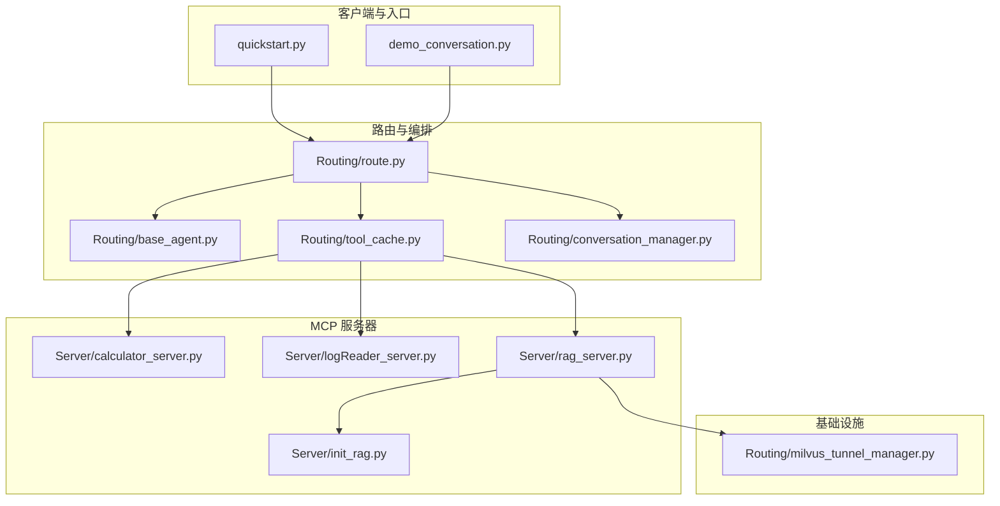
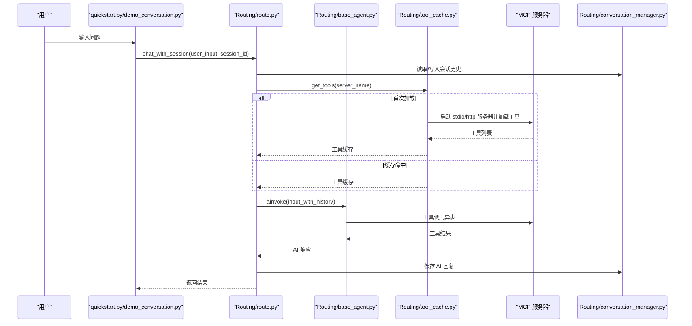
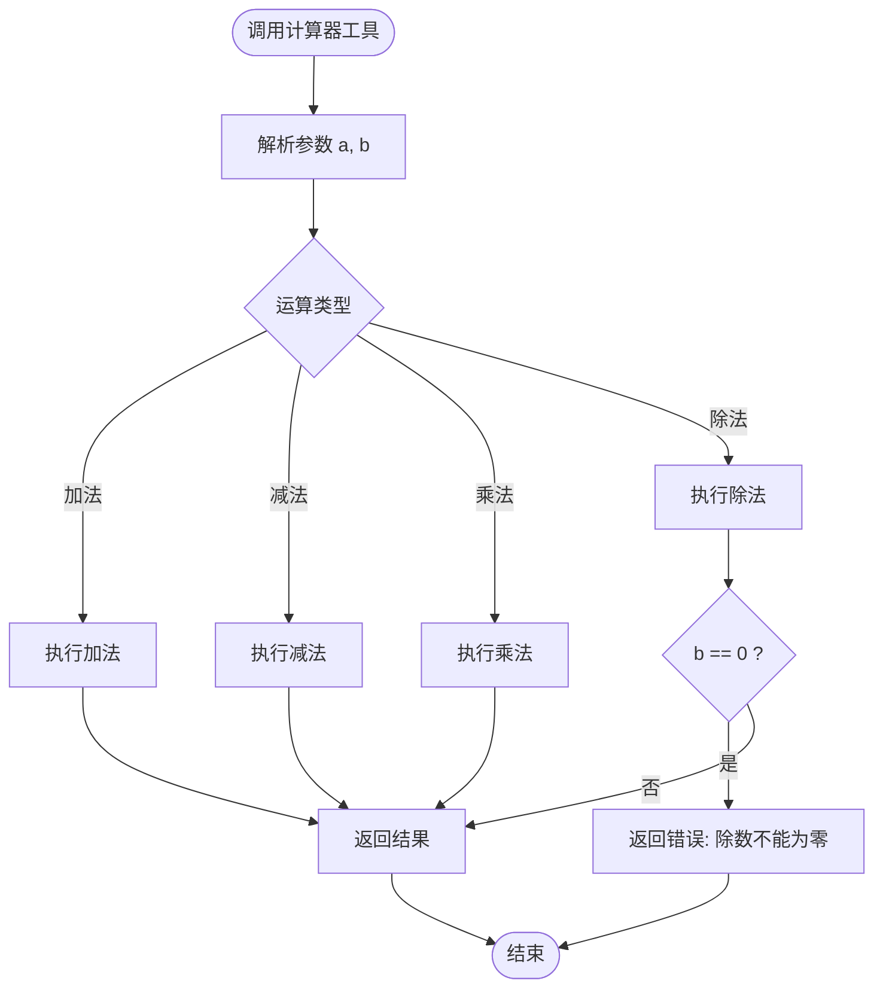
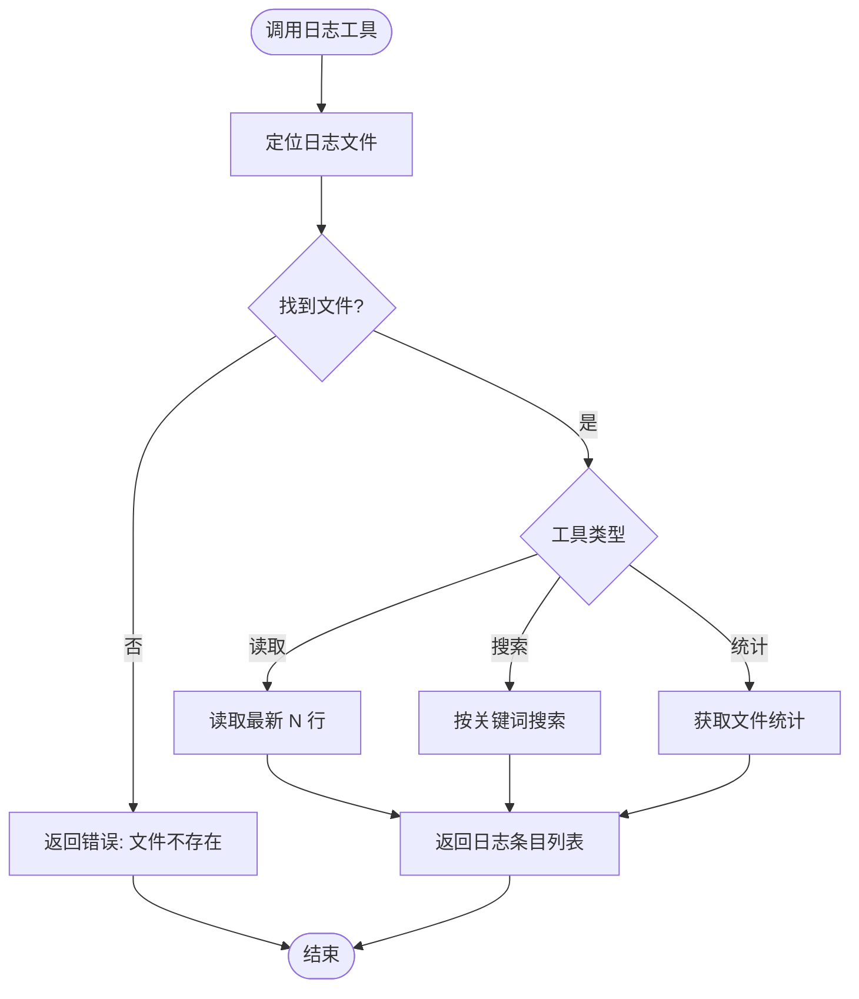
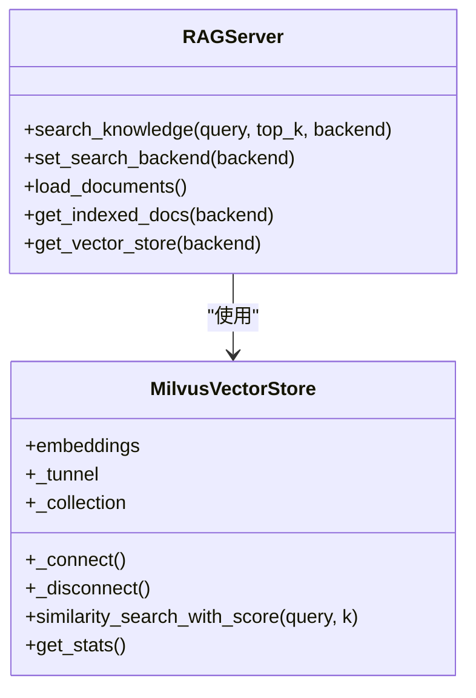
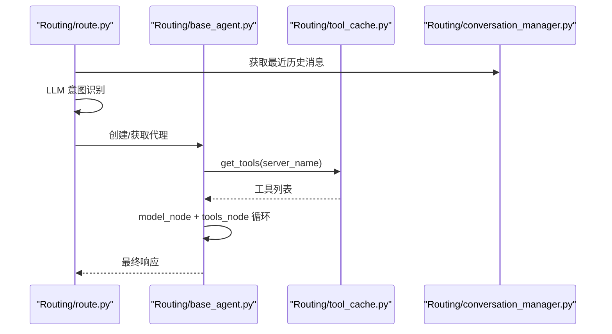
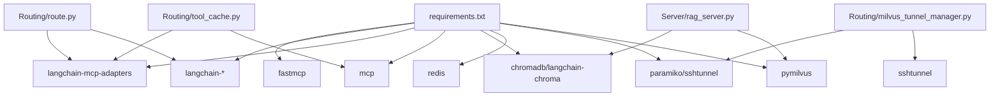

# 多服务器支持

<cite>
**本文档引用的文件**
- [README.md](file://README.md)
- [requirements.txt](file://requirements.txt)
- [quickstart.py](file://quickstart.py)
- [demo_conversation.py](file://demo_conversation.py)
- [Server/calculator_server.py](file://Server/calculator_server.py)
- [Server/logReader_server.py](file://Server/logReader_server.py)
- [Server/rag_server.py](file://Server/rag_server.py)
- [Server/init_rag.py](file://Server/init_rag.py)
- [Routing/base_agent.py](file://Routing/base_agent.py)
- [Routing/route.py](file://Routing/route.py)
- [Routing/tool_cache.py](file://Routing/tool_cache.py)
- [Routing/conversation_manager.py](file://Routing/conversation_manager.py)
- [Routing/milvus_tunnel_manager.py](file://Routing/milvus_tunnel_manager.py)
</cite>

## 目录
1. [简介](#简介)
2. [项目结构](#项目结构)
3. [核心组件](#核心组件)
4. [架构总览](#架构总览)
5. [详细组件分析](#详细组件分析)
6. [依赖关系分析](#依赖关系分析)
7. [性能考虑](#性能考虑)
8. [故障排查指南](#故障排查指南)
9. [结论](#结论)
10. [附录](#附录)

## 简介
本项目是一个基于 Model Context Protocol (MCP) 的多服务器支持系统，通过标准化协议连接 AI 模型与外部工具/数据源。系统支持多种 MCP 服务器类型，包括计算器服务器、日志读取服务器、RAG 知识库服务器等。系统采用 LangGraph 工作流引擎，结合全局工具缓存与会话管理，实现智能路由、多轮对话、工具缓存复用与资源生命周期管理。

## 项目结构
项目采用模块化设计，核心目录与文件如下：
- Server：MCP 服务器实现（计算器、日志读取、RAG 知识库）
- Routing：路由与代理、工具缓存、会话管理、隧道管理
- Client：客户端与交互式聊天入口
- Data：RAG 知识库文档数据
- vector_store：ChromaDB 向量存储持久化目录
- logs：日志读取服务器的目标日志目录
- requirements.txt：依赖声明
- README.md：项目说明与快速开始

**图表来源**
- [quickstart.py:1-68](file://quickstart.py#L1-L68)
- [demo_conversation.py:1-102](file://demo_conversation.py#L1-L102)
- [Routing/route.py:1-553](file://Routing/route.py#L1-L553)
- [Routing/base_agent.py:1-497](file://Routing/base_agent.py#L1-L497)
- [Routing/tool_cache.py:1-302](file://Routing/tool_cache.py#L1-L302)
- [Routing/conversation_manager.py:1-275](file://Routing/conversation_manager.py#L1-L275)
- [Server/calculator_server.py:1-111](file://Server/calculator_server.py#L1-L111)
- [Server/logReader_server.py:1-151](file://Server/logReader_server.py#L1-L151)
- [Server/rag_server.py:1-363](file://Server/rag_server.py#L1-L363)
- [Server/init_rag.py:1-506](file://Server/init_rag.py#L1-L506)
- [Routing/milvus_tunnel_manager.py:1-101](file://Routing/milvus_tunnel_manager.py#L1-L101)

**章节来源**
- [README.md:1-125](file://README.md#L1-L125)
- [requirements.txt:1-17](file://requirements.txt#L1-L17)

## 核心组件
- LangGraph 路由器：根据用户输入与历史上下文，动态路由到计算器、日志读取、高德地图或 RAG 知识库代理。
- BaseAgent 基类：统一工具加载、消息处理、错误处理与工作流构建，减少重复代码。
- 工具缓存（GlobalToolCache）：按服务器名称缓存 MCP 工具与会话，支持 TTL 过期与多传输协议（stdio、streamable-http）。
- 会话管理（ConversationManager）：支持多轮对话历史、Redis 持久化、过期清理与并发会话管理。
- MCP 服务器：计算器、日志读取、RAG 知识库（ChromaDB 本地与 Milvus 远程 SSH 隧道）。

**章节来源**
- [Routing/route.py:149-256](file://Routing/route.py#L149-L256)
- [Routing/base_agent.py:29-318](file://Routing/base_agent.py#L29-L318)
- [Routing/tool_cache.py:39-298](file://Routing/tool_cache.py#L39-L298)
- [Routing/conversation_manager.py:82-275](file://Routing/conversation_manager.py#L82-L275)

## 架构总览
系统采用“路由器 + 代理 + 工具缓存 + 会话管理”的分层架构。路由器负责意图识别与路由；代理负责工具调用与结果整合；工具缓存负责跨进程/跨会话的工具复用；会话管理负责上下文与生命周期。

**图表来源**
- [quickstart.py:8-58](file://quickstart.py#L8-L58)
- [demo_conversation.py:19-98](file://demo_conversation.py#L19-L98)
- [Routing/route.py:351-414](file://Routing/route.py#L351-L414)
- [Routing/base_agent.py:102-318](file://Routing/base_agent.py#L102-L318)
- [Routing/tool_cache.py:85-196](file://Routing/tool_cache.py#L85-L196)
- [Routing/conversation_manager.py:166-184](file://Routing/conversation_manager.py#L166-L184)

## 详细组件分析

### 计算器 MCP 服务器
- 功能特性：提供加、减、乘、除四则运算工具，支持 stdio 传输模式。
- 配置参数：通过环境变量加载，服务器以 stdio 方式启动。
- 使用方法：通过工具缓存自动发现并调用，代理按优先级与链式计算规则逐步执行。
- 错误处理：除数为零时返回错误信息，避免异常传播。

**图表来源**
- [Server/calculator_server.py:16-105](file://Server/calculator_server.py#L16-L105)

**章节来源**
- [Server/calculator_server.py:1-111](file://Server/calculator_server.py#L1-L111)
- [Routing/base_agent.py:322-401](file://Routing/base_agent.py#L322-L401)

### 日志读取 MCP 服务器
- 功能特性：读取最新日志条目、按关键词搜索、获取日志统计信息；自动定位 logs 目录下的日志文件。
- 配置参数：通过环境变量加载；日志文件名支持 app.log 与 Logs.txt。
- 使用方法：代理调用 read_logs、search_logs、get_log_stats 工具，返回结构化结果。
- 错误处理：文件不存在或读取异常时返回错误信息。

**图表来源**
- [Server/logReader_server.py:18-145](file://Server/logReader_server.py#L18-L145)

**章节来源**
- [Server/logReader_server.py:1-151](file://Server/logReader_server.py#L1-L151)
- [Routing/base_agent.py:403-416](file://Routing/base_agent.py#L403-L416)

### RAG 知识库 MCP 服务器
- 功能特性：基于向量检索的知识问答服务，支持 ChromaDB（本地）与 Milvus（远程 SSH 隧道）两种后端；支持手动加载文档、切换后端、查询统计。
- 配置参数：DASHSCOPE_API_KEY、MILVUS_LOCAL_PORT、MILVUS_COLLECTION_NAME；可动态切换后端。
- 使用方法：代理调用 search_knowledge、set_search_backend、load_documents、get_indexed_docs 等工具。
- 错误处理：Milvus 不可用时回退到 ChromaDB；异常捕获并返回错误信息。

**图表来源**
- [Server/rag_server.py:51-191](file://Server/rag_server.py#L51-L191)
- [Server/rag_server.py:193-362](file://Server/rag_server.py#L193-L362)

**章节来源**
- [Server/rag_server.py:1-363](file://Server/rag_server.py#L1-L363)
- [Server/init_rag.py:294-496](file://Server/init_rag.py#L294-L496)
- [Routing/milvus_tunnel_manager.py:14-101](file://Routing/milvus_tunnel_manager.py#L14-L101)

### 路由与代理（LangGraph）
- 路由器：根据历史上下文与当前输入，调用 LLM 识别意图，路由到相应代理节点。
- 代理：统一模型绑定工具、工具节点执行、错误处理与工作流编译。
- 会话管理：支持多轮对话、历史截断、Redis 持久化与过期清理。

**图表来源**
- [Routing/route.py:149-233](file://Routing/route.py#L149-L233)
- [Routing/base_agent.py:102-257](file://Routing/base_agent.py#L102-L257)
- [Routing/tool_cache.py:85-196](file://Routing/tool_cache.py#L85-L196)
- [Routing/conversation_manager.py:166-184](file://Routing/conversation_manager.py#L166-L184)

**章节来源**
- [Routing/route.py:1-553](file://Routing/route.py#L1-L553)
- [Routing/base_agent.py:1-497](file://Routing/base_agent.py#L1-L497)
- [Routing/conversation_manager.py:1-275](file://Routing/conversation_manager.py#L1-L275)

## 依赖关系分析
系统依赖包括 MCP 协议适配、LangChain 生态、向量数据库与 SSH 隧道等。核心依赖通过 requirements.txt 声明，MCP 服务器通过 fastmcp 与 langchain-mcp-adapters 进行工具加载与会话管理。

**图表来源**
- [requirements.txt:1-17](file://requirements.txt#L1-L17)
- [Routing/route.py:14-28](file://Routing/route.py#L14-L28)
- [Routing/tool_cache.py:18-24](file://Routing/tool_cache.py#L18-L24)
- [Server/rag_server.py:6-16](file://Server/rag_server.py#L6-L16)
- [Routing/milvus_tunnel_manager.py:8-11](file://Routing/milvus_tunnel_manager.py#L8-L11)

**章节来源**
- [requirements.txt:1-17](file://requirements.txt#L1-L17)
- [README.md:91-101](file://README.md#L91-L101)

## 性能考虑
- 工具缓存：通过 GlobalToolCache 缓存工具与会话，避免重复启动 MCP 服务器，降低冷启动开销。
- 会话截断：会话历史限制在固定轮次，减少上下文长度带来的推理成本。
- 向量检索优化：Milvus 支持 COSINE 距离与 IVF_FLAT 索引，可按需调整 nlist 与 nprobe；ChromaDB 自动持久化，批量添加向量提升索引效率。
- 并发与清理：会话过期清理与资源清理（工具缓存、Redis、SSH 隧道）确保长期运行稳定性。

[本节为通用性能建议，不直接分析具体文件]

## 故障排查指南
- MCP 服务器启动失败：检查 stdio 命令与参数、环境变量、日志输出；确认工具缓存加载日志。
- 日志读取异常：确认 logs 目录与文件名，检查读取权限与编码；查看错误返回信息。
- RAG 搜索失败：检查 DASHSCOPE_API_KEY、Milvus SSH 隧道是否建立；查看 Milvus 可用性与回退逻辑。
- 会话历史异常：检查 Redis 连接与隧道；确认会话过期策略与清理流程。
- 工具调用错误：查看代理工具节点的错误消息封装与返回内容，定位具体工具参数与返回格式。

**章节来源**
- [Routing/tool_cache.py:194-242](file://Routing/tool_cache.py#L194-L242)
- [Server/logReader_server.py:46-57](file://Server/logReader_server.py#L46-L57)
- [Server/rag_server.py:239-244](file://Server/rag_server.py#L239-L244)
- [Routing/conversation_manager.py:234-253](file://Routing/conversation_manager.py#L234-L253)

## 结论
本系统通过 MCP 协议实现了多服务器工具的统一接入与编排，结合 LangGraph 的工作流能力与全局缓存、会话管理机制，提供了稳定、可扩展的多服务器支持方案。RAG 知识库同时支持本地与远程向量库，具备良好的可运维性与扩展性。

[本节为总结性内容，不直接分析具体文件]

## 附录

### 部署与配置指南
- 环境准备：创建并激活虚拟环境，安装 requirements.txt 中的依赖。
- 环境变量：在 .env 中配置 DASHSCOPE_API_KEY、AMAP_API_KEY（如需高德地图）、Milvus SSH 参数等。
- 启动 MCP 服务器：分别启动计算器、日志读取、RAG 知识库服务器（stdio 模式）。
- 启动路由器：运行 quickstart.py 或 demo_conversation.py，体验多轮对话与工具缓存效果。
- RAG 初始化：运行 Server/init_rag.py 或在 RAG 服务器中调用 load_documents，完成文档加载与索引。

**章节来源**
- [README.md:51-79](file://README.md#L51-L79)
- [quickstart.py:8-68](file://quickstart.py#L8-L68)
- [demo_conversation.py:19-98](file://demo_conversation.py#L19-L98)
- [Server/init_rag.py:294-496](file://Server/init_rag.py#L294-L496)

### 服务器间数据交换与负载均衡
- 数据交换：通过 MCP 协议的标准工具调用进行数据传递，代理仅接收结构化结果，避免泄露底层细节。
- 负载均衡：工具缓存按服务器维度进行 TTL 缓存，避免同一服务器的重复连接；可通过多实例部署与反向代理实现横向扩展（需在实际部署中配置）。

[本节为概念性说明，不直接分析具体文件]

### 监控、故障恢复与性能调优
- 监控：关注工具缓存命中率、会话数量与历史长度、RAG 向量库统计信息；通过日志与错误返回进行可观测性。
- 故障恢复：Milvus 不可用时自动回退到 ChromaDB；会话过期自动清理；资源清理流程确保长时间运行稳定性。
- 性能调优：调整会话历史轮次、Milvus 索引参数、批量添加向量大小；利用工具缓存减少冷启动。

**章节来源**
- [Routing/tool_cache.py:34-36](file://Routing/tool_cache.py#L34-L36)
- [Routing/conversation_manager.py:63-65](file://Routing/conversation_manager.py#L63-L65)
- [Server/rag_server.py:177-182](file://Server/rag_server.py#L177-L182)

### 扩展与自定义开发
- 新增 MCP 服务器：参考现有服务器实现，使用 @mcp.tool() 注册工具，以 stdio 模式运行。
- 新增代理：继承 BaseAgent，实现 _get_server_name 与 _get_system_prompt，复用统一的工作流与工具绑定。
- 新增路由：在路由节点中新增处理函数与条件边，扩展意图识别逻辑。
- 向量库扩展：实现与 ChromaDB 兼容的向量存储接口，支持更多后端。

**章节来源**
- [Server/calculator_server.py:16-105](file://Server/calculator_server.py#L16-L105)
- [Server/logReader_server.py:18-145](file://Server/logReader_server.py#L18-L145)
- [Server/rag_server.py:51-191](file://Server/rag_server.py#L51-L191)
- [Routing/base_agent.py:322-497](file://Routing/base_agent.py#L322-L497)
- [Routing/route.py:264-291](file://Routing/route.py#L264-L291)