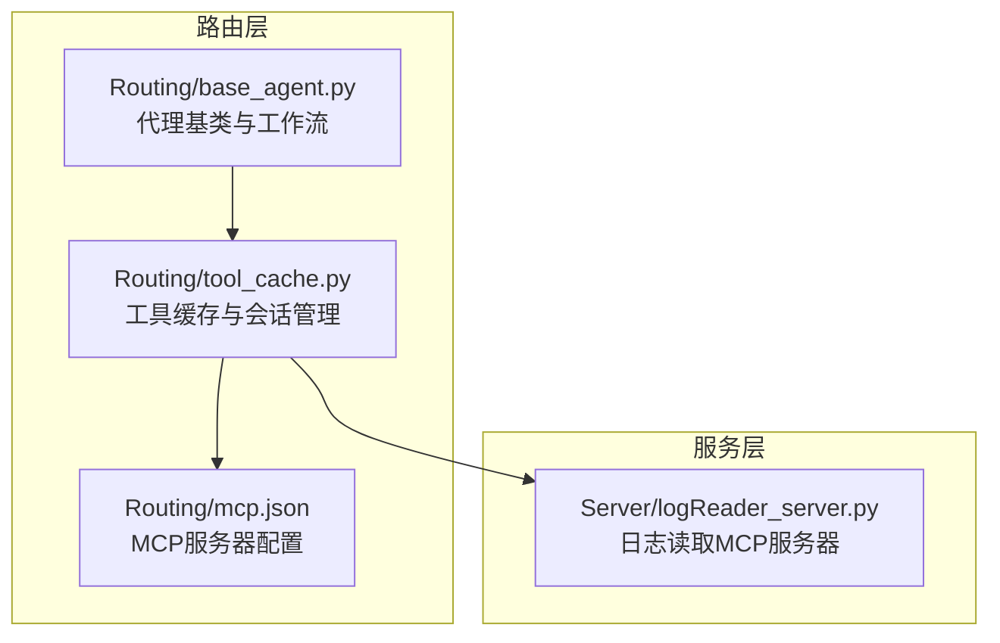
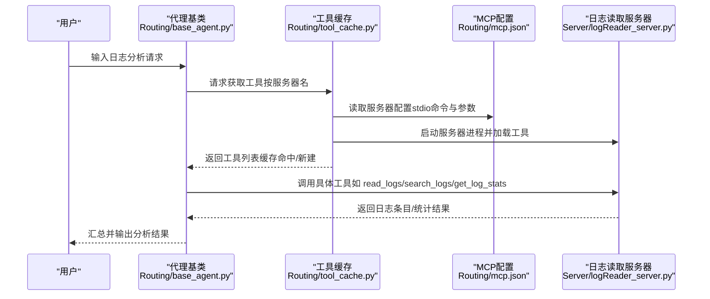
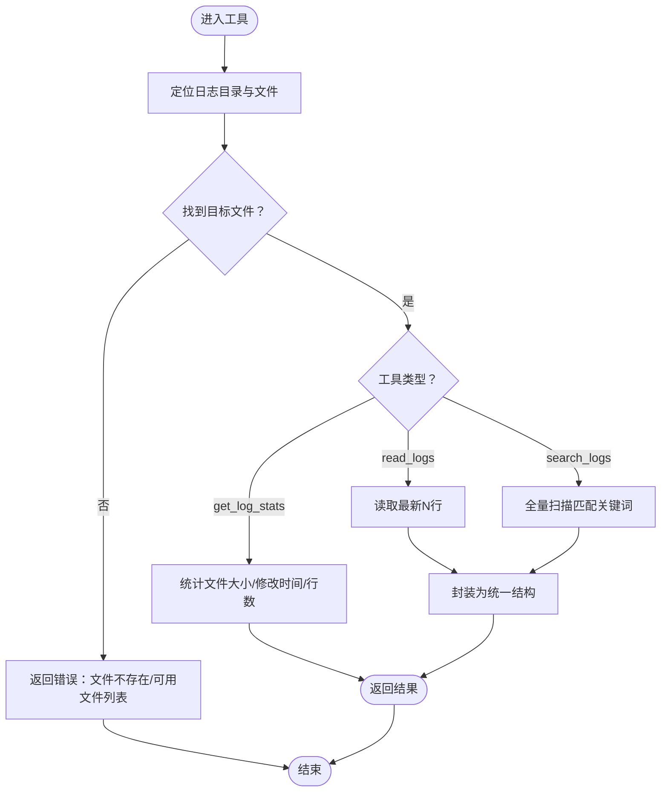
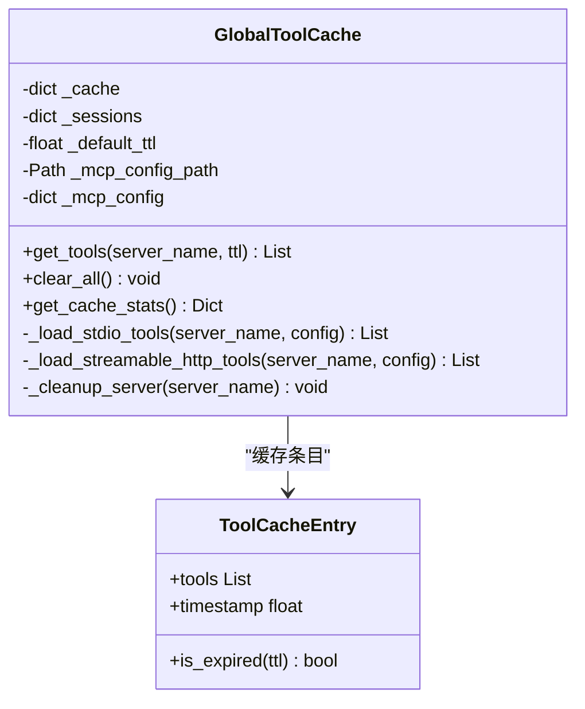
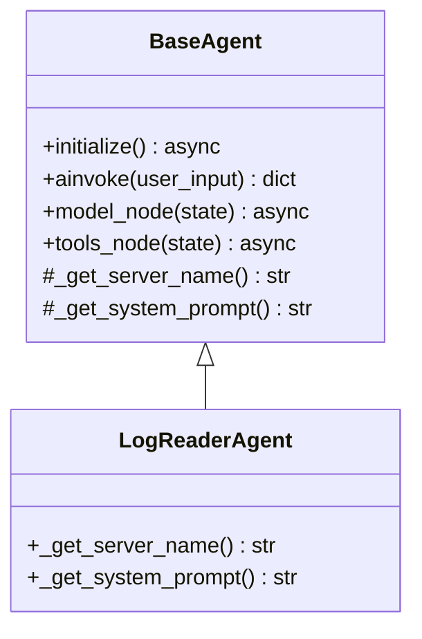
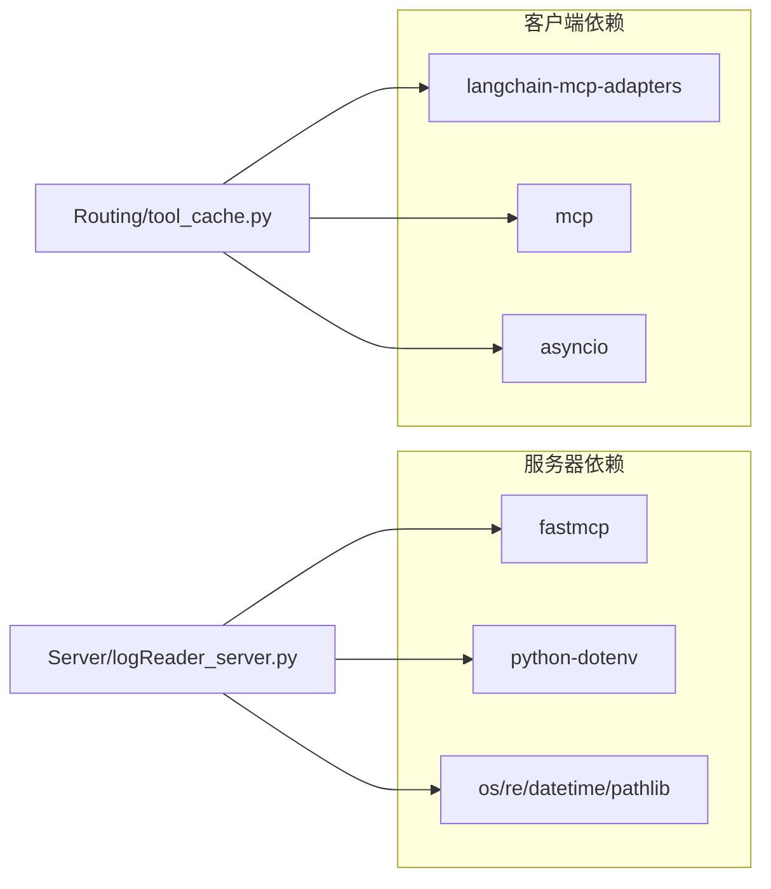

# 日志读取服务器

<cite>
**本文档引用的文件**
- [Server/logReader_server.py](file://Server/logReader_server.py)
- [Routing/base_agent.py](file://Routing/base_agent.py)
- [Routing/tool_cache.py](file://Routing/tool_cache.py)
- [Routing/mcp.json](file://Routing/mcp.json)
- [README.md](file://README.md)
- [requirements.txt](file://requirements.txt)
- [quickstart.py](file://quickstart.py)
- [test/test_simple.py](file://test/test_simple.py)
</cite>

## 目录
1. [简介](#简介)
2. [项目结构](#项目结构)
3. [核心组件](#核心组件)
4. [架构总览](#架构总览)
5. [详细组件分析](#详细组件分析)
6. [依赖关系分析](#依赖关系分析)
7. [性能考量](#性能考量)
8. [故障排查指南](#故障排查指南)
9. [结论](#结论)
10. [附录](#附录)

## 简介
本文件面向“日志读取MCP服务器”，系统性阐述其功能实现、参数配置、数据格式、处理逻辑与部署运维要点。该服务器通过标准传输协议对外暴露三类工具：
- 读取最新日志条目
- 按关键词搜索日志
- 获取日志文件基础统计信息

同时，文档提供在智能路由场景下的实际应用与调用示例，覆盖故障诊断与性能监控的典型用法，并给出监控指标、性能调优与安全建议。

## 项目结构
日志读取服务器位于 Server 目录，配合 Routing 中的工具缓存与代理基类，通过 MCP 配置文件统一注册与发现。核心文件如下：
- Server/logReader_server.py：MCP 服务器实现，提供 read_logs、search_logs、get_log_stats 三个工具
- Routing/mcp.json：MCP 服务器配置，声明 stdio 传输与启动参数
- Routing/tool_cache.py：全局工具缓存与会话管理，负责按配置拉起服务器并缓存工具
- Routing/base_agent.py：代理基类，封装工具加载、消息处理与路由逻辑
- README.md、requirements.txt：项目说明与依赖清单
- quickstart.py、test/test_simple.py：示例与缓存/会话测试脚本

图表来源
- [Routing/base_agent.py](file://Routing/base_agent.py)
- [Routing/tool_cache.py](file://Routing/tool_cache.py)
- [Routing/mcp.json](file://Routing/mcp.json)
- [Server/logReader_server.py](file://Server/logReader_server.py)

章节来源
- [README.md:1-125](file://README.md#L1-L125)
- [requirements.txt:1-17](file://requirements.txt#L1-L17)

## 核心组件
- MCP 服务器（日志读取）
  - 工具 read_logs：读取最新 N 行日志条目
  - 工具 search_logs：按关键词检索日志条目
  - 工具 get_log_stats：返回日志文件大小、修改时间、行数等统计
- 工具缓存与会话管理
  - 依据 mcp.json 配置，通过 stdio 启动服务器进程并加载工具
  - 支持 TTL 缓存、会话复用与清理
- 代理基类
  - 统一模型绑定、消息处理、工具执行与路由控制
  - 日志读取代理继承自该基类，按服务器名称关联工具

章节来源
- [Server/logReader_server.py:18-151](file://Server/logReader_server.py#L18-L151)
- [Routing/tool_cache.py:85-196](file://Routing/tool_cache.py#L85-L196)
- [Routing/base_agent.py:403-416](file://Routing/base_agent.py#L403-L416)

## 架构总览
下图展示了从用户输入到日志工具调用的端到端流程，以及工具加载与缓存的关键环节。

图表来源
- [Routing/base_agent.py](file://Routing/base_agent.py)
- [Routing/tool_cache.py](file://Routing/tool_cache.py)
- [Routing/mcp.json](file://Routing/mcp.json)
- [Server/logReader_server.py](file://Server/logReader_server.py)

## 详细组件分析

### MCP 服务器（日志读取）
- 工具 read_logs
  - 参数：lines（默认10）
  - 行为：定位日志目录与文件（app.log 或 Logs.txt），读取最新 N 行并逐条封装为统一结构
  - 异常：文件不存在或读取异常时返回错误信息
- 工具 search_logs
  - 参数：keyword（关键词）
  - 行为：全量扫描日志文件，大小写不敏感匹配，返回匹配条目
  - 异常：未找到匹配或读取异常时返回相应提示或错误
- 工具 get_log_stats
  - 行为：返回文件大小、最后修改时间、绝对路径与行数
  - 异常：文件不存在或统计异常时返回错误
- 运行方式：以 stdio 传输模式启动，供工具缓存通过进程管理器加载

图表来源
- [Server/logReader_server.py:18-151](file://Server/logReader_server.py#L18-L151)

章节来源
- [Server/logReader_server.py:18-151](file://Server/logReader_server.py#L18-L151)

### 工具缓存与会话管理
- 配置加载：从 mcp.json 读取服务器配置，支持 stdio 与 streamable-http 两种传输
- 进程启动：通过 MultiServerMCPClient 以 stdio 启动服务器进程，解析相对路径与环境变量
- 工具加载：一次性拉取工具列表并缓存，支持 TTL 过期策略
- 会话管理：记录活跃会话，提供清理接口，避免资源泄露
- 错误处理：捕获连接超时、加载失败等异常并抛出明确错误

图表来源
- [Routing/tool_cache.py:39-302](file://Routing/tool_cache.py#L39-L302)

章节来源
- [Routing/tool_cache.py:85-196](file://Routing/tool_cache.py#L85-L196)
- [Routing/tool_cache.py:244-298](file://Routing/tool_cache.py#L244-L298)

### 代理基类与日志读取代理
- 代理基类
  - 统一初始化：从环境变量读取 LLM 配置，绑定工具
  - 工作流：模型节点 -> 工具节点 -> 回到模型节点，循环处理
  - 工具执行：按名称查找缓存工具并调用，仅传递必要字段
- 日志读取代理
  - 服务器名称：log-reader
  - 系统提示词：强调日志分析与错误/告警信息总结

图表来源
- [Routing/base_agent.py:29-318](file://Routing/base_agent.py#L29-L318)
- [Routing/base_agent.py:403-416](file://Routing/base_agent.py#L403-L416)

章节来源
- [Routing/base_agent.py:68-89](file://Routing/base_agent.py#L68-L89)
- [Routing/base_agent.py:131-217](file://Routing/base_agent.py#L131-L217)
- [Routing/base_agent.py:403-416](file://Routing/base_agent.py#L403-L416)

### MCP 配置与部署
- 配置文件：mcp.json
  - 服务器名称：log-reader
  - 传输协议：stdio
  - 启动参数：指向 Server/logReader_server.py 的相对路径
- 启动方式：工具缓存通过 stdio 启动服务器进程；服务器以 stdio 模式运行
- 环境变量：.env 文件中配置 API Key（如 DashScope、高德地图等）

章节来源
- [Routing/mcp.json:14-20](file://Routing/mcp.json#L14-L20)
- [Server/logReader_server.py:148-151](file://Server/logReader_server.py#L148-L151)
- [README.md:64-69](file://README.md#L64-L69)

## 依赖关系分析
- 服务器侧依赖
  - fastmcp：MCP 协议与工具装饰器
  - python-dotenv：加载 .env 环境变量
  - 标准库：os、re、datetime、pathlib
- 客户端侧依赖
  - langchain-mcp-adapters：动态加载 MCP 工具
  - mcp：客户端会话与传输抽象
  - asyncio：异步工具加载与会话管理

图表来源
- [requirements.txt:1-17](file://requirements.txt#L1-L17)
- [Server/logReader_server.py:5-9](file://Server/logReader_server.py#L5-L9)
- [Routing/tool_cache.py:18-24](file://Routing/tool_cache.py#L18-L24)

章节来源
- [requirements.txt:1-17](file://requirements.txt#L1-L17)

## 性能考量
- 工具缓存
  - 通过 TTL 缓存减少重复加载开销；默认缓存周期可在工具缓存中调整
  - 复用会话避免频繁进程启停
- I/O 优化
  - read_logs 采用切片读取最新 N 行，避免全量读取
  - search_logs 逐行扫描，适合小到中等规模日志文件
- 并发与稳定性
  - 工具执行在异步工作流中串行化，避免并发竞争
  - 会话清理在异常时静默处理，保证系统稳定退出

章节来源
- [Routing/tool_cache.py:62](file://Routing/tool_cache.py#L62)
- [Routing/tool_cache.py:109-116](file://Routing/tool_cache.py#L109-L116)
- [Server/logReader_server.py:47-57](file://Server/logReader_server.py#L47-L57)
- [Server/logReader_server.py:88-102](file://Server/logReader_server.py#L88-L102)

## 故障排查指南
- 常见问题与定位
  - 日志文件不存在：服务器会在找不到 app.log/Logs.txt 时返回可用文件列表，检查 logs 目录与文件命名
  - 读取异常：捕获底层异常并返回错误信息，检查文件权限与编码
  - 工具加载失败：确认 mcp.json 中命令与参数正确，stdio 启动路径可被解析
  - 连接超时：HTTP 传输存在超时保护，stdio 启动失败时检查进程是否正常启动
- 排查步骤
  - 检查 .env 中 API Key 配置
  - 在工具缓存中查看缓存统计与活跃会话
  - 使用测试脚本验证缓存与会话管理功能
- 相关实现参考
  - 工具缓存加载与清理、超时处理
  - 代理基类的错误传播与状态回退

章节来源
- [Server/logReader_server.py:41-44](file://Server/logReader_server.py#L41-L44)
- [Server/logReader_server.py:56](file://Server/logReader_server.py#L56)
- [Routing/tool_cache.py:194-196](file://Routing/tool_cache.py#L194-L196)
- [Routing/tool_cache.py:217-223](file://Routing/tool_cache.py#L217-L223)
- [Routing/tool_cache.py:244-298](file://Routing/tool_cache.py#L244-L298)
- [test/test_simple.py:11-43](file://test/test_simple.py#L11-L43)

## 结论
日志读取MCP服务器以简洁稳定的工具集实现了日志读取、搜索与统计能力，结合工具缓存与代理基类，能够在智能路由场景中高效完成故障诊断与性能监控任务。通过合理的配置与运维实践，可进一步提升可靠性与可维护性。

## 附录

### 部署与配置指南
- 环境准备
  - 创建并激活虚拟环境，安装依赖
  - 配置 .env 文件中的 API Key
- 服务器启动
  - 通过工具缓存以 stdio 方式启动日志读取服务器
  - 确认 mcp.json 中命令与参数正确
- 日志文件路径
  - 服务器默认在项目根目录 logs 下查找 app.log 或 Logs.txt
  - 若文件不在预期位置，工具会返回可用文件列表以便定位

章节来源
- [README.md:53-78](file://README.md#L53-L78)
- [README.md:64-69](file://README.md#L64-L69)
- [Server/logReader_server.py:29-44](file://Server/logReader_server.py#L29-L44)
- [Routing/mcp.json:14-20](file://Routing/mcp.json#L14-L20)

### 参数与数据格式
- read_logs
  - 参数：lines（整数，默认10）
  - 返回：日志条目数组，每条包含统一字段
- search_logs
  - 参数：keyword（字符串）
  - 返回：匹配的日志条目数组或未找到提示
- get_log_stats
  - 返回：文件大小、最后修改时间、绝对路径、行数等统计信息

章节来源
- [Server/logReader_server.py:19-57](file://Server/logReader_server.py#L19-L57)
- [Server/logReader_server.py:61-102](file://Server/logReader_server.py#L61-L102)
- [Server/logReader_server.py:106-145](file://Server/logReader_server.py#L106-L145)

### 应用场景与调用示例
- 故障诊断
  - 使用 search_logs 检索错误/异常关键词
  - 使用 get_log_stats 快速评估日志体量与更新频率
- 性能监控
  - 使用 read_logs 获取最新日志片段，辅助实时观测
- 智能路由集成
  - 通过代理基类与工具缓存，将日志工具纳入多轮对话与工具编排

章节来源
- [quickstart.py:35-38](file://quickstart.py#L35-L38)
- [Routing/base_agent.py:131-217](file://Routing/base_agent.py#L131-L217)
- [Routing/tool_cache.py:85-196](file://Routing/tool_cache.py#L85-L196)

### 监控指标与安全建议
- 监控指标
  - 工具缓存命中率、活跃会话数、加载耗时
  - 日志文件大小与行数趋势、最近修改时间
- 安全建议
  - 限制日志文件读取权限，避免敏感信息泄露
  - 在生产环境启用 HTTPS 传输（如使用 streamable-http）
  - 定期清理旧日志与缓存，防止磁盘与内存占用膨胀

章节来源
- [Routing/tool_cache.py:291-298](file://Routing/tool_cache.py#L291-L298)
- [Server/logReader_server.py:130-145](file://Server/logReader_server.py#L130-L145)