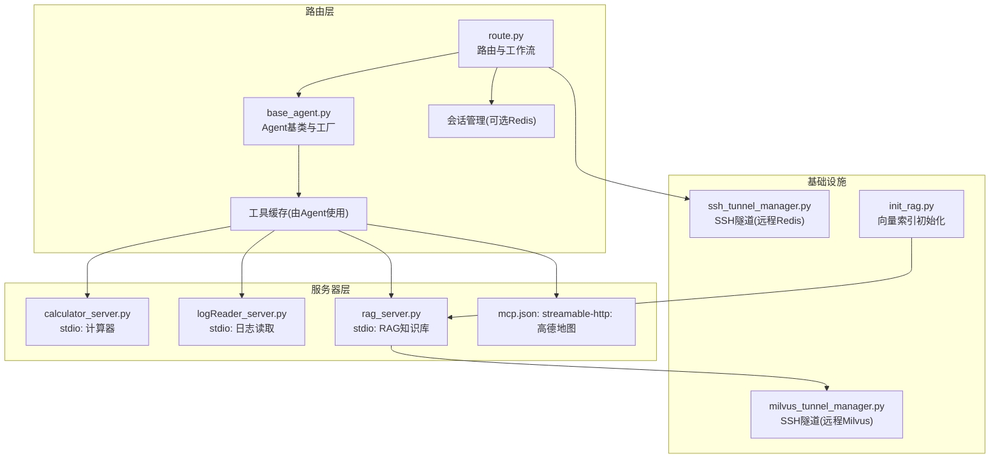
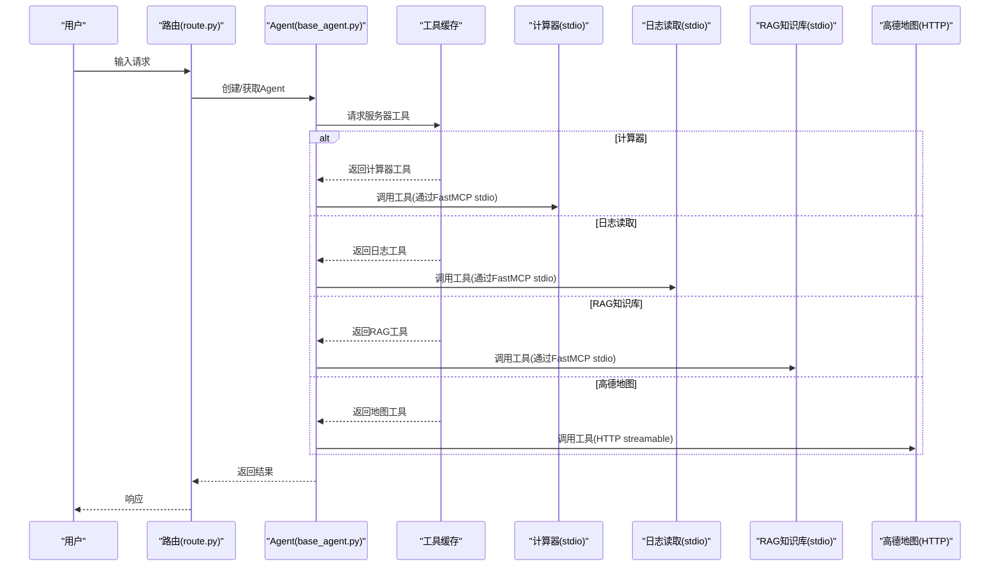
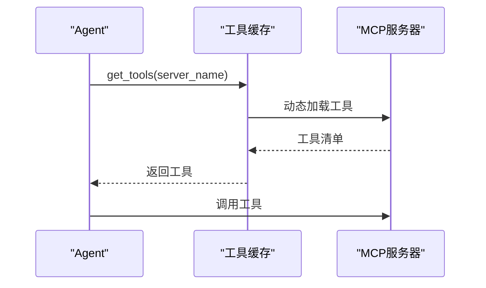
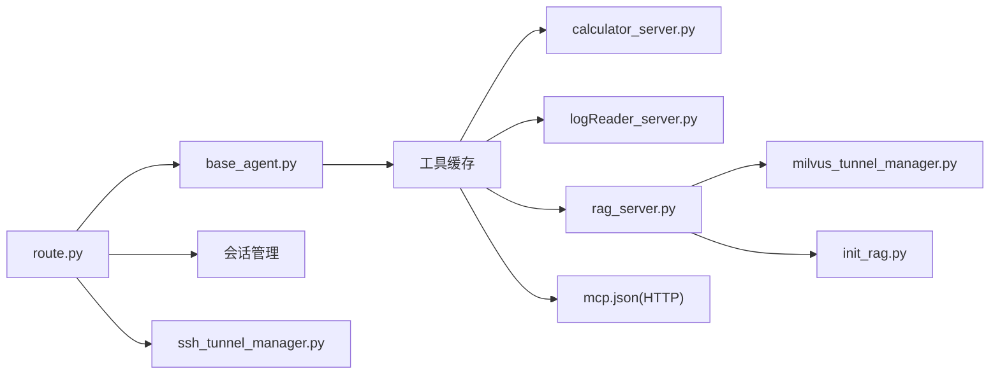

# 服务器配置管理

<cite>
**本文引用的文件**
- [mcp.json](file://Routing/mcp.json)
- [calculator_server.py](file://Server/calculator_server.py)
- [logReader_server.py](file://Server/logReader_server.py)
- [rag_server.py](file://Server/rag_server.py)
- [milvus_tunnel_manager.py](file://Routing/milvus_tunnel_manager.py)
- [ssh_tunnel_manager.py](file://Routing/ssh_tunnel_manager.py)
- [init_rag.py](file://Server/init_rag.py)
- [base_agent.py](file://Routing/base_agent.py)
- [route.py](file://Routing/route.py)
- [quickstart.py](file://quickstart.py)
- [requirements.txt](file://requirements.txt)
- [README.md](file://README.md)
- [LLM_CONFIG_GUIDE.md](file://LLM_CONFIG_GUIDE.md)
</cite>

## 目录
1. [简介](#简介)
2. [项目结构](#项目结构)
3. [核心组件](#核心组件)
4. [架构总览](#架构总览)
5. [详细组件分析](#详细组件分析)
6. [依赖分析](#依赖分析)
7. [性能考虑](#性能考虑)
8. [故障排查指南](#故障排查指南)
9. [结论](#结论)
10. [附录](#附录)

## 简介
本文件系统化梳理本仓库的 MCP 服务器配置管理，覆盖配置文件结构、传输协议与端口、认证与密钥、服务器注册与发现、路由系统动态加载与管理、配置验证与热重载建议、备份策略，以及常见问题排查。文档面向不同技术背景读者，既提供高层概览，也给出代码级映射与最佳实践。

## 项目结构
项目采用“路由层 + 服务器层 + 工具缓存 + 会话持久化”的分层组织，MCP 服务器以进程形式运行并通过标准输入输出（stdio）或 HTTP（streamable-http）与客户端交互；路由系统通过工具缓存统一加载各服务器工具，实现动态调度与多实例管理。

图表来源
- [route.py:1-553](file://Routing/route.py#L1-L553)
- [base_agent.py:1-497](file://Routing/base_agent.py#L1-L497)
- [calculator_server.py:1-111](file://Server/calculator_server.py#L1-L111)
- [logReader_server.py:1-151](file://Server/logReader_server.py#L1-L151)
- [rag_server.py:1-363](file://Server/rag_server.py#L1-L363)
- [mcp.json:1-29](file://Routing/mcp.json#L1-L29)
- [milvus_tunnel_manager.py:1-101](file://Routing/milvus_tunnel_manager.py#L1-L101)
- [ssh_tunnel_manager.py:1-100](file://Routing/ssh_tunnel_manager.py#L1-L100)
- [init_rag.py:1-506](file://Server/init_rag.py#L1-L506)

章节来源
- [README.md:1-125](file://README.md#L1-L125)
- [requirements.txt:1-17](file://requirements.txt#L1-L17)

## 核心组件
- MCP 服务器配置文件：集中定义服务器别名、传输方式、命令与参数、URL 等。
- 服务器实现：以 stdio 方式运行的计算器、日志读取、RAG 知识库服务器。
- 路由与工具缓存：按需动态加载服务器工具，支持多实例与后端切换。
- SSH 隧道：为远程 Milvus/Redis 提供安全连接。
- 环境变量与 LLM 配置：统一管理 API Key、模型与温度等。

章节来源
- [mcp.json:1-29](file://Routing/mcp.json#L1-L29)
- [calculator_server.py:108-111](file://Server/calculator_server.py#L108-L111)
- [logReader_server.py:149-151](file://Server/logReader_server.py#L149-L151)
- [rag_server.py:356-363](file://Server/rag_server.py#L356-L363)
- [base_agent.py:44-66](file://Routing/base_agent.py#L44-L66)
- [milvus_tunnel_manager.py:20-89](file://Routing/milvus_tunnel_manager.py#L20-L89)
- [ssh_tunnel_manager.py:19-80](file://Routing/ssh_tunnel_manager.py#L19-L80)
- [LLM_CONFIG_GUIDE.md:1-92](file://LLM_CONFIG_GUIDE.md#L1-L92)

## 架构总览
下图展示 MCP 服务器配置、路由系统与工具缓存的交互关系，以及 stdio 与 HTTP 两种传输方式的差异。

图表来源
- [route.py:60-108](file://Routing/route.py#L60-L108)
- [base_agent.py:52-66](file://Routing/base_agent.py#L52-L66)
- [calculator_server.py:108-111](file://Server/calculator_server.py#L108-L111)
- [logReader_server.py:149-151](file://Server/logReader_server.py#L149-L151)
- [rag_server.py:356-363](file://Server/rag_server.py#L356-L363)
- [mcp.json:3-27](file://Routing/mcp.json#L3-L27)

## 详细组件分析

### MCP 服务器配置文件结构与参数
- 服务器分组：顶层键为服务器集合，典型键为“mcpServers”。
- 服务器条目：每个条目包含服务器别名与配置。
- 关键字段：
  - url：HTTP 类型服务器的访问地址（如高德地图）。
  - transport：传输方式，支持“stdio”“streamable-http”等。
  - command/args：stdio 服务器的命令与参数（如 Python 脚本路径）。
- 示例映射：
  - 计算器：stdio 传输，命令为 Python，参数为计算器服务器脚本。
  - 日志读取：stdio 传输，命令为 Python，参数为日志服务器脚本。
  - RAG 知识库：stdio 传输，命令为 Python，参数为 RAG 服务器脚本。
  - 高德地图：HTTP 传输，URL 模板包含 API Key 占位符。

章节来源
- [mcp.json:1-29](file://Routing/mcp.json#L1-L29)

### 传输协议与端口配置
- stdio 传输：
  - 服务器通过标准输入输出与客户端通信，无需显式监听端口。
  - 适用于本地进程内嵌或容器内运行的 MCP 服务器。
- HTTP 传输（streamable-http）：
  - 服务器通过 HTTP 接口暴露工具，适合远程或跨网络访问。
  - 配置中提供 URL 模板，实际运行时由客户端解析并发起请求。
- 端口说明：
  - stdio 服务器不涉及 TCP 端口。
  - HTTP 服务器端口由远端服务决定，配置文件中体现为 URL 的主机与路径。

章节来源
- [mcp.json:3-27](file://Routing/mcp.json#L3-L27)
- [calculator_server.py:111](file://Server/calculator_server.py#L111)
- [logReader_server.py:151](file://Server/logReader_server.py#L151)
- [rag_server.py:363](file://Server/rag_server.py#L363)

### 认证设置与密钥管理
- LLM 与第三方服务：
  - DashScope API Key 通过环境变量注入，用于 LLM 与嵌入模型。
  - 高德地图 API Key 通过 URL 模板占位符注入。
- SSH 隧道密钥：
  - Milvus/Redis SSH 隧道使用私钥文件与用户名凭据，支持多种密钥类型。
- 环境变量与配置文件：
  - .env 文件集中存放敏感配置，LLM_CONFIG_GUIDE.md 提供切换与示例。
  - 路由与服务器均通过环境变量读取配置。

章节来源
- [LLM_CONFIG_GUIDE.md:8-16](file://LLM_CONFIG_GUIDE.md#L8-L16)
- [milvus_tunnel_manager.py:42-48](file://Routing/milvus_tunnel_manager.py#L42-L48)
- [ssh_tunnel_manager.py:42-58](file://Routing/ssh_tunnel_manager.py#L42-L58)
- [README.md:64-69](file://README.md#L64-L69)

### 服务器注册与发现机制
- 注册：
  - 工具缓存负责按服务器别名加载对应工具集合。
  - Agent 工厂函数根据服务器名称选择相应 Agent，从而间接注册该服务器的工具。
- 发现：
  - 路由系统在运行时通过缓存获取工具清单，实现动态发现。
- 多实例管理：
  - 通过不同服务器别名与工具缓存隔离，支持在同一路由中动态加载多个服务器实例。

图表来源
- [base_agent.py:52-66](file://Routing/base_agent.py#L52-L66)
- [route.py:60-108](file://Routing/route.py#L60-L108)

章节来源
- [base_agent.py:44-66](file://Routing/base_agent.py#L44-L66)
- [route.py:149-234](file://Routing/route.py#L149-L234)

### 不同类型 MCP 服务器的配置与设置
- 计算器服务器（stdio）
  - 配置：command/args 指向计算器脚本，transport=stdio。
  - 运行：脚本内部以 stdio 模式启动 FastMCP。
- 日志读取服务器（stdio）
  - 配置：command/args 指向日志服务器脚本，transport=stdio。
  - 运行：脚本内部以 stdio 模式启动 FastMCP。
- RAG 知识库服务器（stdio）
  - 配置：command/args 指向 RAG 服务器脚本，transport=stdio。
  - 运行：脚本内部以 stdio 模式启动 FastMCP。
  - 后端切换：支持在 ChromaDB 与 Milvus 之间切换，必要时通过 SSH 隧道连接远程 Milvus。
- 高德地图（HTTP streamable）
  - 配置：url 模板包含 API Key 占位符，transport=streamable-http。
  - 运行：由客户端解析 URL 并发起 HTTP 请求。

章节来源
- [mcp.json:3-27](file://Routing/mcp.json#L3-L27)
- [calculator_server.py:108-111](file://Server/calculator_server.py#L108-L111)
- [logReader_server.py:149-151](file://Server/logReader_server.py#L149-L151)
- [rag_server.py:356-363](file://Server/rag_server.py#L356-L363)
- [milvus_tunnel_manager.py:20-89](file://Routing/milvus_tunnel_manager.py#L20-L89)

### 配置验证、热重载与备份建议
- 配置验证
  - JSON 格式校验：确保 mcp.json 语法正确。
  - 服务器可达性：对于 HTTP 服务器，可在启动前尝试解析 URL 并探测连通性。
  - 工具可用性：通过工具缓存获取工具清单，确认工具名称与描述符合预期。
- 热重载
  - 工具缓存：Agent 初始化时从缓存获取工具，若需热重载，可提供刷新缓存的接口（例如清空缓存后重新加载）。
  - 服务器进程：stdio 服务器可通过进程管理器（如 systemd/docker）实现优雅重启。
  - 配置变更：LLM 配置等需重启进程生效，建议在维护窗口执行。
- 备份
  - 配置文件：定期备份 mcp.json 与 .env。
  - 向量索引：RAG 的 ChromaDB 持久化目录需纳入备份策略。
  - SSH 密钥：妥善保管并加密存储，定期轮换。

章节来源
- [route.py:374-414](file://Routing/route.py#L374-L414)
- [init_rag.py:343-461](file://Server/init_rag.py#L343-L461)
- [LLM_CONFIG_GUIDE.md:76-82](file://LLM_CONFIG_GUIDE.md#L76-L82)

### 常见配置问题与排查
- 服务器无法启动（stdio）
  - 检查 Python 路径与脚本可执行性。
  - 确认 FastMCP 依赖已安装。
- HTTP 服务器访问失败
  - 校验 URL 模板与 API Key 注入。
  - 检查网络连通性与防火墙。
- Milvus 连接失败
  - 确认 SSH 私钥格式与路径正确。
  - 检查本地端口与远程端口映射。
- 工具未显示
  - 确认服务器别名与 Agent 工厂函数一致。
  - 检查工具缓存是否已加载对应服务器工具。
- LLM 配置不生效
  - 修改 .env 后需重启进程。
  - 核对 API Key 与 BASE_URL 匹配。

章节来源
- [milvus_tunnel_manager.py:66-89](file://Routing/milvus_tunnel_manager.py#L66-L89)
- [ssh_tunnel_manager.py:57-80](file://Routing/ssh_tunnel_manager.py#L57-L80)
- [LLM_CONFIG_GUIDE.md:76-92](file://LLM_CONFIG_GUIDE.md#L76-L92)
- [quickstart.py:60-68](file://quickstart.py#L60-L68)

## 依赖分析
- 外部依赖：fastmcp、langchain、chromadb、pymilvus、paramiko、sshtunnel 等。
- 组件耦合：
  - 路由层依赖工具缓存与会话管理。
  - 服务器层依赖 FastMCP 与嵌入模型。
  - RAG 服务器依赖 Milvus 隧道与向量存储。
- 循环依赖：未发现直接循环导入。

图表来源
- [requirements.txt:1-17](file://requirements.txt#L1-L17)
- [route.py:16-24](file://Routing/route.py#L16-L24)
- [base_agent.py:49-50](file://Routing/base_agent.py#L49-L50)
- [rag_server.py:23-32](file://Server/rag_server.py#L23-L32)

章节来源
- [requirements.txt:1-17](file://requirements.txt#L1-L17)

## 性能考虑
- 工具缓存：减少重复加载，提升响应速度。
- 向量检索：批量处理与分片插入，降低 API 调用频率。
- SSH 隧道：合理设置超时与重试，避免阻塞。
- LLM 调用：控制温度与上下文长度，平衡质量与延迟。

## 故障排查指南
- 启动失败
  - 检查 Python 版本与虚拟环境。
  - 确认依赖安装完整。
- 工具不可用
  - 核对服务器别名与工具名称。
  - 查看缓存统计与日志。
- 网络问题
  - 验证 SSH 隧道状态与端口映射。
  - 检查防火墙与安全组规则。
- 配置错误
  - 对比 .env 与 LLM_CONFIG_GUIDE.md 的示例。
  - 逐项核对 API Key 与 URL 模板。

章节来源
- [quickstart.py:60-68](file://quickstart.py#L60-L68)
- [LLM_CONFIG_GUIDE.md:76-92](file://LLM_CONFIG_GUIDE.md#L76-L92)

## 结论
本项目的 MCP 服务器配置管理以 mcp.json 为中心，结合工具缓存与路由系统实现动态加载与多实例管理。通过 stdio 与 HTTP 两种传输方式满足本地与远程场景需求，配合 SSH 隧道与环境变量实现安全与灵活的部署。建议在生产环境中完善配置验证、热重载与备份流程，持续优化工具缓存与向量检索性能。

## 附录
- 快速开始与示例调用参见 quickstart.py。
- LLM 模型配置参考 LLM_CONFIG_GUIDE.md。
- 项目整体结构与说明参见 README.md。

章节来源
- [quickstart.py:8-58](file://quickstart.py#L8-L58)
- [LLM_CONFIG_GUIDE.md:1-92](file://LLM_CONFIG_GUIDE.md#L1-L92)
- [README.md:1-125](file://README.md#L1-L125)