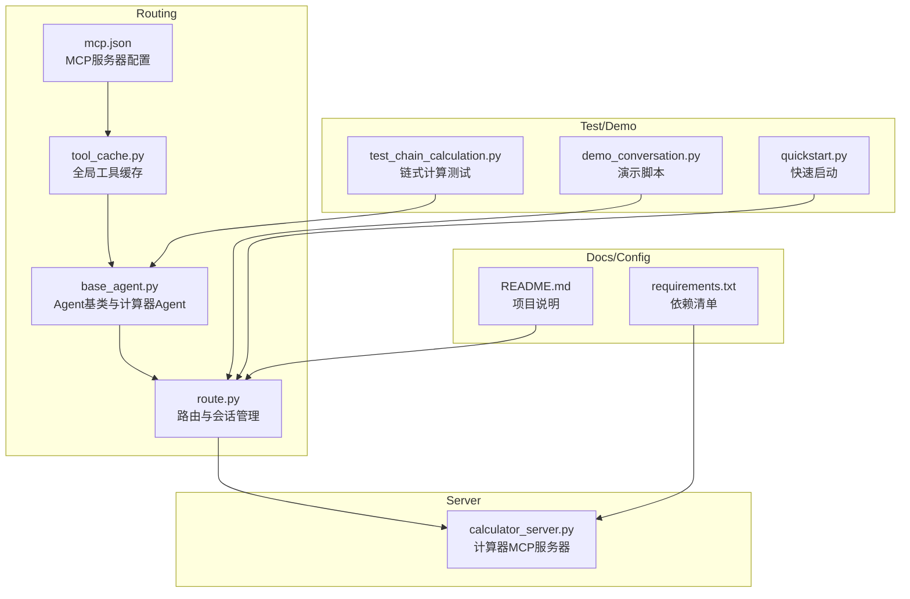
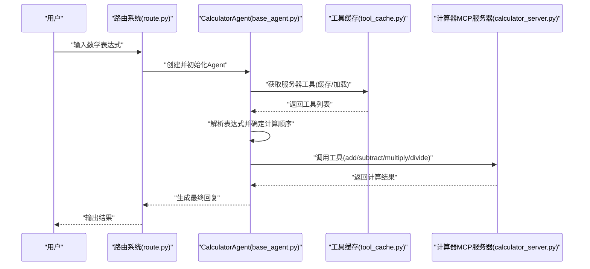
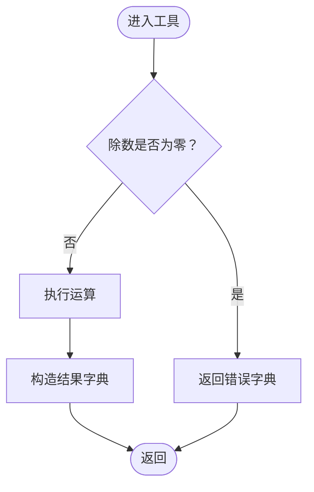
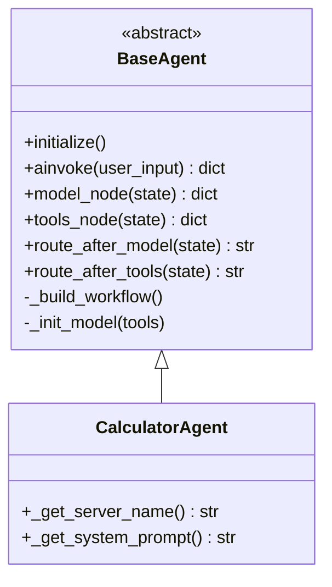
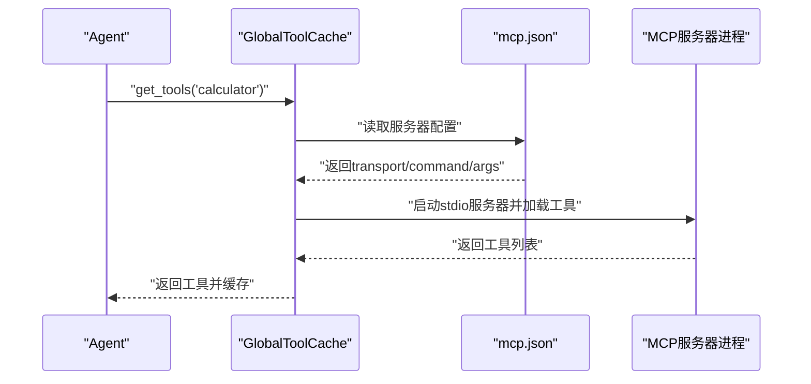
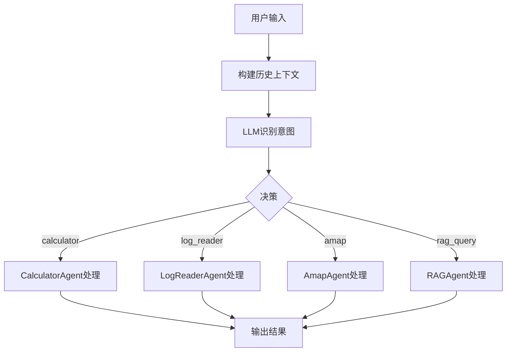
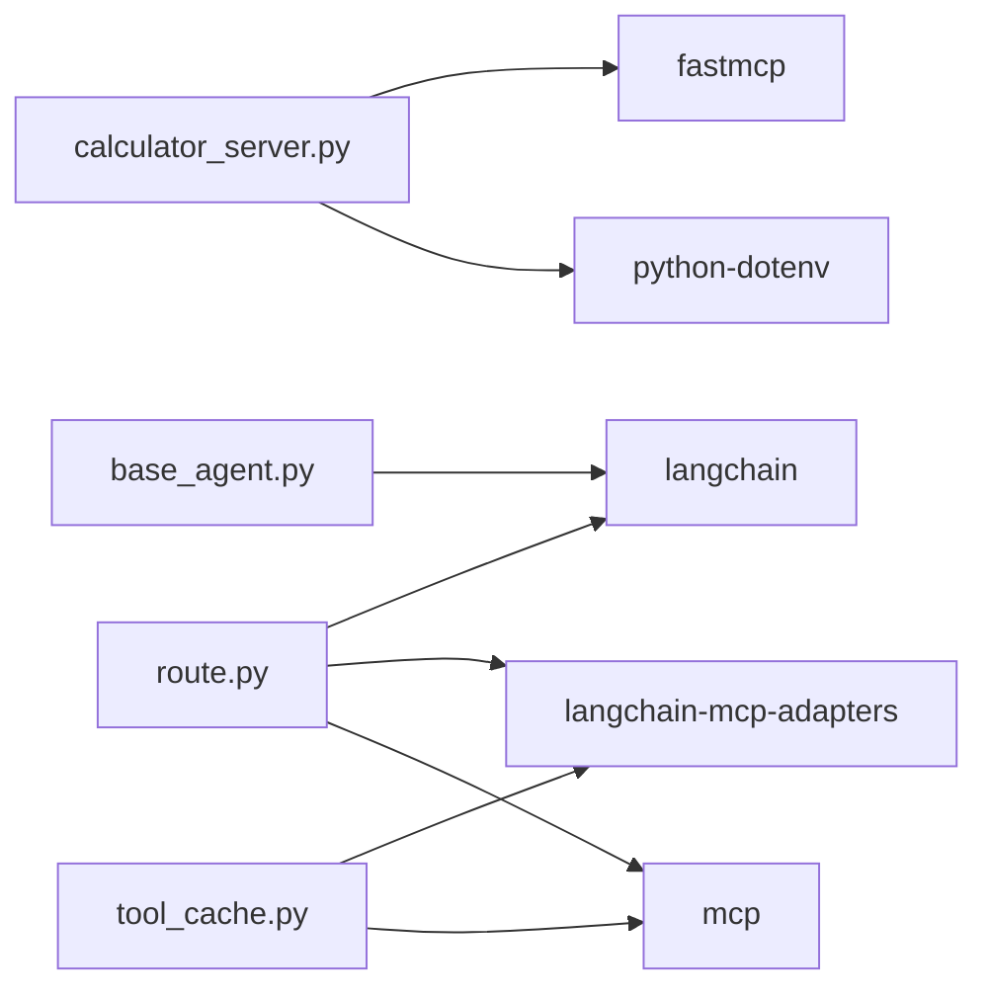

# 计算器服务器

<cite>
**本文档引用的文件**
- [Server/calculator_server.py](file://Server/calculator_server.py)
- [Routing/base_agent.py](file://Routing/base_agent.py)
- [Routing/tool_cache.py](file://Routing/tool_cache.py)
- [Routing/mcp.json](file://Routing/mcp.json)
- [Routing/route.py](file://Routing/route.py)
- [test/test_chain_calculation.py](file://test/test_chain_calculation.py)
- [demo_conversation.py](file://demo_conversation.py)
- [quickstart.py](file://quickstart.py)
- [README.md](file://README.md)
- [requirements.txt](file://requirements.txt)
</cite>

## 目录
1. [简介](#简介)
2. [项目结构](#项目结构)
3. [核心组件](#核心组件)
4. [架构总览](#架构总览)
5. [详细组件分析](#详细组件分析)
6. [依赖分析](#依赖分析)
7. [性能考虑](#性能考虑)
8. [故障排除指南](#故障排除指南)
9. [结论](#结论)
10. [附录](#附录)

## 简介
本文件面向“计算器MCP服务器”的使用者与维护者，系统性阐述其功能实现、工具函数参数与返回值规范、错误处理机制、启动与配置流程（尤其是stdio传输模式）、在路由系统中的集成方式、监控与性能优化建议，以及常见问题排查方法。该服务器通过FastMCP框架暴露加法、减法、乘法、除法四个数学工具，供上层Agent与路由系统按需调用。

## 项目结构
该项目采用模块化设计，围绕MCP协议构建智能代理系统，计算器服务器位于Server目录，路由与工具缓存位于Routing目录，测试与演示位于test与根目录。

图表来源
- [Server/calculator_server.py:1-111](file://Server/calculator_server.py#L1-L111)
- [Routing/base_agent.py:1-497](file://Routing/base_agent.py#L1-L497)
- [Routing/tool_cache.py:1-302](file://Routing/tool_cache.py#L1-L302)
- [Routing/mcp.json:1-29](file://Routing/mcp.json#L1-L29)
- [Routing/route.py:1-553](file://Routing/route.py#L1-L553)
- [test/test_chain_calculation.py:1-65](file://test/test_chain_calculation.py#L1-L65)
- [demo_conversation.py:1-102](file://demo_conversation.py#L1-L102)
- [quickstart.py:1-68](file://quickstart.py#L1-L68)
- [README.md:1-125](file://README.md#L1-L125)
- [requirements.txt:1-17](file://requirements.txt#L1-L17)

章节来源
- [README.md:1-125](file://README.md#L1-L125)
- [requirements.txt:1-17](file://requirements.txt#L1-L17)

## 核心组件
- 计算器MCP服务器：提供四个数学工具（加法、减法、乘法、除法），以stdio传输模式运行。
- Agent基类与计算器Agent：封装统一的工具加载、消息处理、错误处理与工作流编排。
- 工具缓存：集中管理MCP服务器连接与工具列表，支持TTL缓存与多协议（stdio/streamable-http）加载。
- 路由系统：根据用户输入与历史上下文识别意图，路由到相应Agent并执行工具调用。
- 配置文件：mcp.json定义各MCP服务器的传输方式、命令与参数。

章节来源
- [Server/calculator_server.py:16-105](file://Server/calculator_server.py#L16-L105)
- [Routing/base_agent.py:29-401](file://Routing/base_agent.py#L29-L401)
- [Routing/tool_cache.py:39-298](file://Routing/tool_cache.py#L39-L298)
- [Routing/mcp.json:1-29](file://Routing/mcp.json#L1-L29)
- [Routing/route.py:149-256](file://Routing/route.py#L149-L256)

## 架构总览
计算器服务器通过FastMCP装饰器注册工具，以stdio模式对外提供服务；路由系统通过工具缓存加载服务器工具，CalculatorAgent负责将用户输入解析为链式计算步骤并逐个调用工具，最终汇总结果。

图表来源
- [Routing/route.py:61-71](file://Routing/route.py#L61-L71)
- [Routing/base_agent.py:102-130](file://Routing/base_agent.py#L102-L130)
- [Routing/base_agent.py:131-217](file://Routing/base_agent.py#L131-L217)
- [Routing/tool_cache.py:85-117](file://Routing/tool_cache.py#L85-L117)
- [Server/calculator_server.py:16-105](file://Server/calculator_server.py#L16-L105)

## 详细组件分析

### 计算器MCP服务器
- 工具注册：使用@mcp.tool()装饰器注册四个工具函数。
- 参数与返回值：
  - add(a: float, b: float) -> dict
  - subtract(a: float, b: float) -> dict
  - multiply(a: float, b: float) -> dict
  - divide(a: float, b: float) -> dict
- 返回值格式：
  - 成功：包含操作类型、输入参数与结果的字典
  - 除法错误：返回包含错误信息的字典
- 错误处理：除法对除数为零进行显式校验并返回错误字典
- 启动方式：以stdio模式运行，通过mcp.run(transport="stdio")

图表来源
- [Server/calculator_server.py:82-105](file://Server/calculator_server.py#L82-L105)

章节来源
- [Server/calculator_server.py:16-105](file://Server/calculator_server.py#L16-L105)

### Agent基类与计算器Agent
- 统一工具加载：通过全局工具缓存获取服务器工具，避免重复加载
- 消息处理：封装模型节点与工具节点，支持条件路由与错误处理
- 计算器Agent特化：
  - 系统提示词强调链式计算、运算优先级与每步仅调用一个工具
  - 工具节点对计算器工具返回的result字段进行提取，避免泄露原始数据结构
- 工作流：模型节点 -> 工具节点 -> 模型节点（再次推理整合结果）

图表来源
- [Routing/base_agent.py:29-401](file://Routing/base_agent.py#L29-L401)

章节来源
- [Routing/base_agent.py:29-401](file://Routing/base_agent.py#L29-L401)

### 工具缓存与MCP配置
- 工具缓存：
  - 单例模式，支持TTL过期策略
  - 支持stdio与streamable-http两种传输协议
  - 自动管理连接生命周期并在清理时优雅关闭
- MCP配置：
  - mcp.json定义服务器名称、传输方式、命令与参数
  - 计算器服务器使用stdio，命令为python，参数为服务器脚本路径

图表来源
- [Routing/tool_cache.py:85-117](file://Routing/tool_cache.py#L85-L117)
- [Routing/mcp.json:7-13](file://Routing/mcp.json#L7-L13)

章节来源
- [Routing/tool_cache.py:39-298](file://Routing/tool_cache.py#L39-L298)
- [Routing/mcp.json:1-29](file://Routing/mcp.json#L1-L29)

### 路由系统与会话管理
- 路由逻辑：根据用户输入与历史上下文，使用LLM识别意图并路由到对应Agent
- 会话管理：支持Redis持久化（可选），记录用户与AI消息，维持多轮对话上下文
- 高级API：chat_with_session支持循环对话，返回会话ID与缓存统计

图表来源
- [Routing/route.py:149-256](file://Routing/route.py#L149-L256)
- [Routing/route.py:351-414](file://Routing/route.py#L351-L414)

章节来源
- [Routing/route.py:149-256](file://Routing/route.py#L149-L256)
- [Routing/route.py:351-414](file://Routing/route.py#L351-L414)

## 依赖分析
- 运行时依赖：FastMCP、langchain系列、langchain-mcp-adapters、mcp协议库、dotenv等
- 服务器与客户端通信：通过stdio或streamable-http协议
- 环境变量：DASHSCOPE_API_KEY、AMAP_API_KEY等

图表来源
- [requirements.txt:1-17](file://requirements.txt#L1-L17)
- [Server/calculator_server.py:5-10](file://Server/calculator_server.py#L5-L10)
- [Routing/route.py:14-28](file://Routing/route.py#L14-L28)
- [Routing/tool_cache.py:18-24](file://Routing/tool_cache.py#L18-L24)
- [Routing/base_agent.py:70-88](file://Routing/base_agent.py#L70-L88)

章节来源
- [requirements.txt:1-17](file://requirements.txt#L1-L17)

## 性能考虑
- 工具缓存：避免重复加载MCP服务器工具，显著降低延迟
- 传输协议：stdio适合本地脚本，streamable-http适合远端HTTP服务
- 并发与超时：工具缓存对HTTP连接设置了超时保护
- 会话持久化：Redis可选持久化，减少重复初始化成本
- 输出精简：工具节点仅传递result字段给LLM，减少上下文噪声

章节来源
- [Routing/tool_cache.py:134-139](file://Routing/tool_cache.py#L134-L139)
- [Routing/tool_cache.py:212-223](file://Routing/tool_cache.py#L212-L223)
- [Routing/base_agent.py:173-181](file://Routing/base_agent.py#L173-L181)

## 故障排除指南
- 服务器未启动或无法连接
  - 检查mcp.json中命令与参数是否正确，确认路径与权限
  - 确认Python解释器可用且依赖已安装
- 除法错误
  - 当除数为零时，服务器返回错误字典，需在上层Agent中处理
- 工具加载失败
  - 查看工具缓存日志，确认传输协议与超时设置
  - 对于HTTP服务器，检查AMAP_API_KEY环境变量
- 会话与缓存问题
  - 使用清理接口清理缓存与会话，重新初始化
  - 检查Redis配置（若启用），确认网络与认证

章节来源
- [Routing/mcp.json:7-13](file://Routing/mcp.json#L7-L13)
- [Server/calculator_server.py:95-98](file://Server/calculator_server.py#L95-L98)
- [Routing/tool_cache.py:194-196](file://Routing/tool_cache.py#L194-L196)
- [Routing/route.py:434-456](file://Routing/route.py#L434-L456)

## 结论
计算器MCP服务器通过标准化的工具接口与stdio传输模式，为上层Agent与路由系统提供了可靠的数学计算能力。配合统一的Agent基类、全局工具缓存与会话管理，系统实现了高性能、可扩展与易维护的智能代理架构。建议在生产环境中启用工具缓存与可选的Redis持久化，并严格处理除法等边界条件。

## 附录

### 工具函数定义与返回值规范
- add(a: float, b: float) -> dict
  - 成功返回：包含operation、a、b、result
  - 错误返回：包含error字段（本实现中未覆盖，但可扩展）
- subtract(a: float, b: float) -> dict
  - 成功返回：包含operation、a、b、result
- multiply(a: float, b: float) -> dict
  - 成功返回：包含operation、a、b、result
- divide(a: float, b: float) -> dict
  - 成功返回：包含operation、a、b、result
  - 错误返回：当b==0时，返回包含error字段的字典

章节来源
- [Server/calculator_server.py:16-105](file://Server/calculator_server.py#L16-L105)

### 启动与配置指南（stdio传输模式）
- 环境准备
  - 创建并激活虚拟环境
  - 安装依赖：pip install -r requirements.txt
- 配置环境变量
  - 在.env中配置DASHSCOPE_API_KEY等必要密钥
- 运行服务器
  - 以stdio模式运行：python ../Server/calculator_server.py
- 验证工具
  - 使用路由系统或测试脚本验证工具可用性

章节来源
- [README.md:53-78](file://README.md#L53-L78)
- [Server/calculator_server.py:108-111](file://Server/calculator_server.py#L108-L111)
- [Routing/mcp.json:7-13](file://Routing/mcp.json#L7-L13)

### 在路由系统中集成与使用
- 工具加载
  - 路由系统通过工具缓存加载服务器工具，支持stdio与streamable-http
- Agent调用
  - CalculatorAgent解析表达式，按优先级链式调用工具
  - 工具节点仅传递result字段，避免泄露内部结构
- 会话与上下文
  - 支持多轮对话，历史消息参与意图识别与上下文构建

章节来源
- [Routing/tool_cache.py:85-117](file://Routing/tool_cache.py#L85-L117)
- [Routing/base_agent.py:131-217](file://Routing/base_agent.py#L131-L217)
- [Routing/route.py:111-147](file://Routing/route.py#L111-L147)

### 实际调用示例与响应格式
- 示例场景
  - 简单计算：12 + 6
  - 链式计算：12 + 6 - 95
  - 复杂优先级：5 * 3 + 10 - 2
  - 运算优先级：59 + 8 - 8 - 9 / 7
- 响应特征
  - 成功：包含最终结果的自然语言回复
  - 失败：错误信息或提示无法计算

章节来源
- [test/test_chain_calculation.py:14-64](file://test/test_chain_calculation.py#L14-L64)