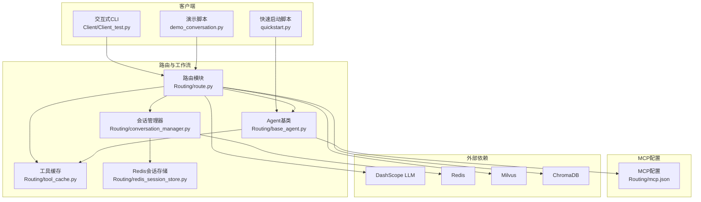
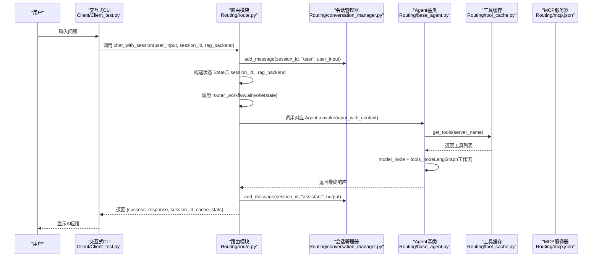
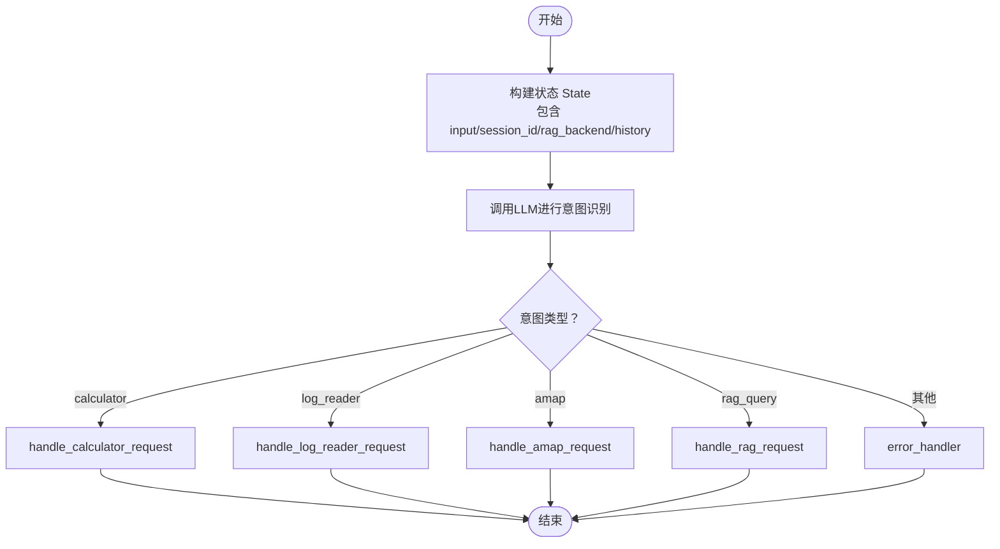
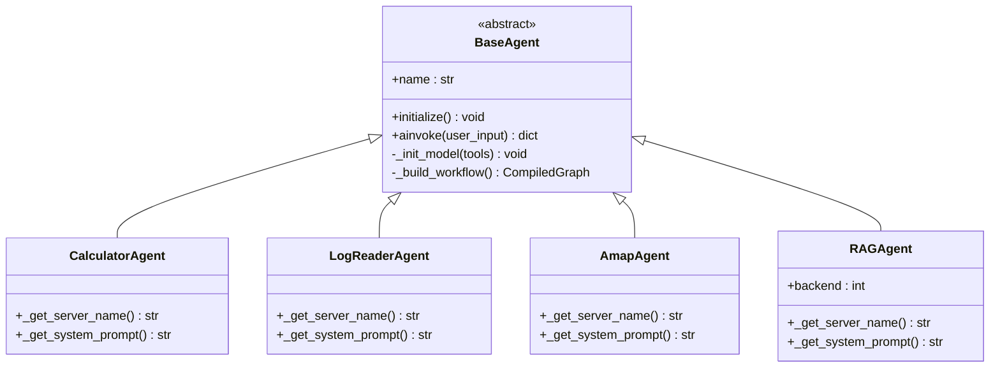
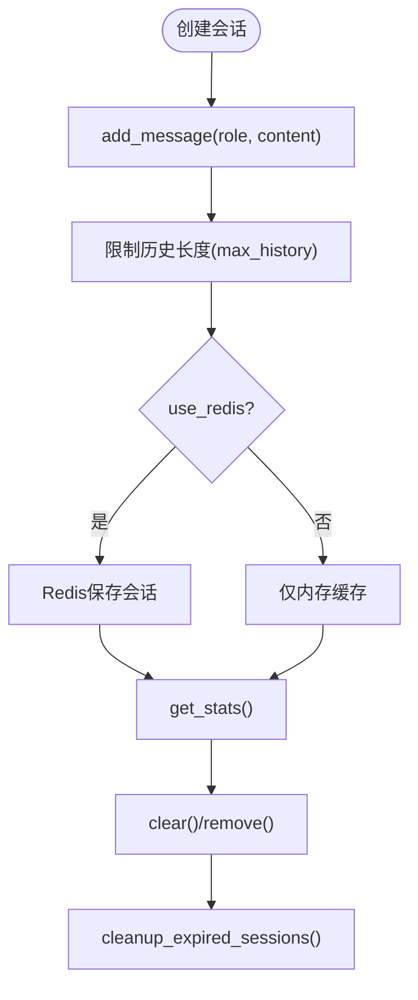
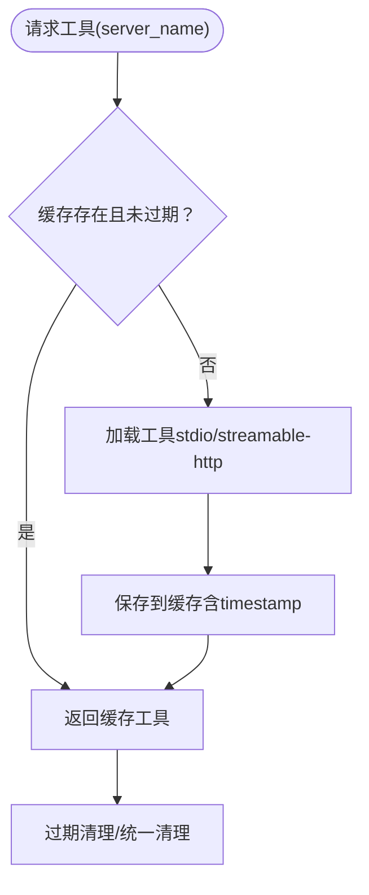
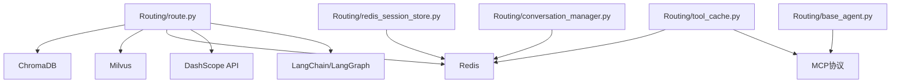

# 客户端交互

<cite>
**本文引用的文件**
- [README.md](file://README.md)
- [requirements.txt](file://requirements.txt)
- [quickstart.py](file://quickstart.py)
- [demo_conversation.py](file://demo_conversation.py)
- [Client/Client_test.py](file://Client/Client_test.py)
- [Routing/route.py](file://Routing/route.py)
- [Routing/base_agent.py](file://Routing/base_agent.py)
- [Routing/conversation_manager.py](file://Routing/conversation_manager.py)
- [Routing/tool_cache.py](file://Routing/tool_cache.py)
- [Routing/redis_session_store.py](file://Routing/redis_session_store.py)
- [Routing/mcp.json](file://Routing/mcp.json)
</cite>

## 目录
1. [简介](#简介)
2. [项目结构](#项目结构)
3. [核心组件](#核心组件)
4. [架构总览](#架构总览)
5. [详细组件分析](#详细组件分析)
6. [依赖关系分析](#依赖关系分析)
7. [性能考量](#性能考量)
8. [故障排查指南](#故障排查指南)
9. [结论](#结论)
10. [附录](#附录)

## 简介
本文件面向“客户端交互系统”的使用者与开发者，系统性阐述用户交互接口的设计与实现，重点覆盖：
- 循环对话机制与会话管理
- 会话管理命令与用户界面设计
- 客户端 API 的使用方法、参数配置与响应处理
- 完整交互示例：建立会话、发送消息、获取响应
- 客户端与路由系统的通信协议与数据格式
- 用户体验优化、输入验证与错误处理
- 客户端扩展与自定义交互流程的开发指南

## 项目结构
该项目采用模块化分层设计，围绕“路由”“会话管理”“工具缓存”“Agent 基类”“MCP 配置”等核心模块组织代码，形成可扩展、可维护的客户端交互体系。

图表来源
- [Client/Client_test.py:1-230](file://Client/Client_test.py#L1-L230)
- [demo_conversation.py:1-102](file://demo_conversation.py#L1-L102)
- [quickstart.py:1-68](file://quickstart.py#L1-L68)
- [Routing/route.py:1-553](file://Routing/route.py#L1-L553)
- [Routing/base_agent.py:1-497](file://Routing/base_agent.py#L1-L497)
- [Routing/conversation_manager.py:1-275](file://Routing/conversation_manager.py#L1-L275)
- [Routing/tool_cache.py:1-302](file://Routing/tool_cache.py#L1-L302)
- [Routing/redis_session_store.py:1-228](file://Routing/redis_session_store.py#L1-L228)
- [Routing/mcp.json:1-29](file://Routing/mcp.json#L1-L29)

章节来源
- [README.md:1-125](file://README.md#L1-L125)
- [requirements.txt:1-17](file://requirements.txt#L1-L17)

## 核心组件
- 路由模块（Routing/route.py）：负责意图识别与路由到相应 Agent；支持会话上下文注入；提供高级 API 以支持循环对话。
- Agent 基类（Routing/base_agent.py）：统一工具加载、消息处理、错误处理；构建 LangGraph 工作流；支持多 Agent 扩展。
- 会话管理器（Routing/conversation_manager.py）：管理多轮对话历史、会话生命周期、Redis 持久化；提供会话查询与清理。
- 工具缓存（Routing/tool_cache.py）：全局缓存 MCP 服务器连接与工具列表，避免重复加载；支持 TTL 过期与连接管理。
- Redis 会话存储（Routing/redis_session_store.py）：提供会话数据的持久化存储与索引。
- MCP 配置（Routing/mcp.json）：定义各 MCP 服务器的传输协议与参数。
- 客户端交互脚本：Client/Client_test.py 与 demo_conversation.py 展示循环对话、会话管理命令与工具缓存效果。

章节来源
- [Routing/route.py:351-415](file://Routing/route.py#L351-L415)
- [Routing/base_agent.py:29-318](file://Routing/base_agent.py#L29-L318)
- [Routing/conversation_manager.py:82-275](file://Routing/conversation_manager.py#L82-L275)
- [Routing/tool_cache.py:39-302](file://Routing/tool_cache.py#L39-L302)
- [Routing/redis_session_store.py:14-228](file://Routing/redis_session_store.py#L14-L228)
- [Routing/mcp.json:1-29](file://Routing/mcp.json#L1-L29)

## 架构总览
系统采用“LangGraph 工作流 + Agent 基类 + 工具缓存 + 会话管理 + MCP 协议”的组合架构。用户输入经由路由模块进行意图识别，随后注入会话上下文，调用对应 Agent，Agent 通过工具缓存加载工具并执行，最终将结果写回会话历史并返回。

图表来源
- [Client/Client_test.py:180-198](file://Client/Client_test.py#L180-L198)
- [Routing/route.py:351-415](file://Routing/route.py#L351-L415)
- [Routing/base_agent.py:258-318](file://Routing/base_agent.py#L258-L318)
- [Routing/tool_cache.py:85-117](file://Routing/tool_cache.py#L85-L117)
- [Routing/conversation_manager.py:166-184](file://Routing/conversation_manager.py#L166-L184)

## 详细组件分析

### 路由模块（Routing/route.py）
- 意图识别：基于 LLM 的 Structured Output，返回“calculator”“log_reader”“amap”“rag_query”四类意图。
- 上下文注入：将最近 N 轮对话历史拼接到当前输入，增强语义理解。
- 路由决策：根据意图条件边路由到对应处理节点。
- 高级 API：chat_with_session 支持循环对话，自动创建/更新会话，记录用户与 AI 消息，返回缓存统计。
- 资源清理：cleanup_all 统一清理工具缓存、会话与 SSH/Redis 连接。

图表来源
- [Routing/route.py:149-256](file://Routing/route.py#L149-L256)
- [Routing/route.py:351-415](file://Routing/route.py#L351-L415)

章节来源
- [Routing/route.py:149-256](file://Routing/route.py#L149-L256)
- [Routing/route.py:351-415](file://Routing/route.py#L351-L415)
- [Routing/route.py:434-456](file://Routing/route.py#L434-L456)

### Agent 基类（Routing/base_agent.py）
- 统一初始化：延迟初始化，从工具缓存加载工具并绑定到 LLM。
- LangGraph 工作流：model_node + tools_node + 条件路由，支持工具调用与结果回传。
- 系统提示词：每个具体 Agent 定义专属系统提示词，指导工具调用与输出格式。
- 错误处理：捕获模型调用与工具执行异常，返回结构化错误信息。

图表来源
- [Routing/base_agent.py:29-318](file://Routing/base_agent.py#L29-L318)
- [Routing/base_agent.py:322-497](file://Routing/base_agent.py#L322-L497)

章节来源
- [Routing/base_agent.py:29-318](file://Routing/base_agent.py#L29-L318)
- [Routing/base_agent.py:322-497](file://Routing/base_agent.py#L322-L497)

### 会话管理器（Routing/conversation_manager.py）
- 单例模式：全局唯一实例，支持内存与 Redis 双层持久化。
- 会话生命周期：创建、添加消息、获取历史、清空、删除、过期清理。
- Redis 集成：Meta、Messages、Active Index、History List 等键空间设计，支持最近会话列表与过期清理。
- 会话统计：提供消息数、创建时间、活跃时间、持续时长等指标。

图表来源
- [Routing/conversation_manager.py:122-147](file://Routing/conversation_manager.py#L122-L147)
- [Routing/conversation_manager.py:166-184](file://Routing/conversation_manager.py#L166-L184)
- [Routing/conversation_manager.py:254-259](file://Routing/conversation_manager.py#L254-L259)
- [Routing/redis_session_store.py:36-89](file://Routing/redis_session_store.py#L36-L89)

章节来源
- [Routing/conversation_manager.py:82-275](file://Routing/conversation_manager.py#L82-L275)
- [Routing/redis_session_store.py:14-228](file://Routing/redis_session_store.py#L14-L228)

### 工具缓存（Routing/tool_cache.py）
- 全局单例：跨 Agent 复用，避免重复加载 MCP 服务器工具。
- 两种传输协议：stdio（本地进程）与 streamable-http（远程服务），支持超时与异常处理。
- TTL 策略：默认 5 分钟，过期自动清理并重建连接。
- 统一管理：保存 ClientSession 与 MultiServerMCPClient 引用，支持统一清理。

图表来源
- [Routing/tool_cache.py:85-117](file://Routing/tool_cache.py#L85-L117)
- [Routing/tool_cache.py:118-243](file://Routing/tool_cache.py#L118-L243)
- [Routing/tool_cache.py:281-290](file://Routing/tool_cache.py#L281-L290)

章节来源
- [Routing/tool_cache.py:39-302](file://Routing/tool_cache.py#L39-L302)

### MCP 配置（Routing/mcp.json）
- 定义四个 MCP 服务器：高德地图（streamable-http）、计算器（stdio）、日志读取（stdio）、RAG 知识库（stdio）。
- 传输协议与参数：URL、命令、参数、API Key 占位符替换。

章节来源
- [Routing/mcp.json:1-29](file://Routing/mcp.json#L1-L29)

### 客户端交互脚本
- Client/Client_test.py：支持循环对话、会话管理命令（quit/clear/info/stats/backend/help）、工具缓存统计显示、RAG 后端切换。
- demo_conversation.py：演示工具缓存、循环对话、会话管理与资源清理。
- quickstart.py：展示 MCP Agent 的快速启动与工具列表。

章节来源
- [Client/Client_test.py:40-230](file://Client/Client_test.py#L40-L230)
- [demo_conversation.py:19-102](file://demo_conversation.py#L19-L102)
- [quickstart.py:8-68](file://quickstart.py#L8-L68)

## 依赖关系分析
- LangChain/LangGraph：工作流编排与消息处理。
- DashScope API：LLM 推理与意图识别。
- MCP 协议：与外部工具/数据源的标准连接。
- Redis：会话持久化与索引。
- Milvus/ChromaDB：RAG 向量检索后端（通过 Agent 参数切换）。
- SSH 隧道：在远程 Redis 环境下建立本地连接。

图表来源
- [Routing/route.py:149-256](file://Routing/route.py#L149-L256)
- [Routing/base_agent.py:68-89](file://Routing/base_agent.py#L68-L89)
- [Routing/tool_cache.py:18-25](file://Routing/tool_cache.py#L18-L25)
- [Routing/conversation_manager.py:108-121](file://Routing/conversation_manager.py#L108-L121)
- [Routing/redis_session_store.py:27-34](file://Routing/redis_session_store.py#L27-L34)

章节来源
- [requirements.txt:1-17](file://requirements.txt#L1-L17)

## 性能考量
- 工具缓存：避免重复加载 MCP 服务器工具，显著降低延迟；TTL 控制连接生命周期。
- 会话历史限制：限制最近 N 轮消息注入，平衡上下文质量与性能。
- 并发与异步：全链路使用 asyncio，提高 I/O 密集场景吞吐。
- 过期清理：定期清理过期会话与缓存，防止内存泄漏与资源占用。
- RAG 后端选择：根据网络与数据规模选择本地（ChromaDB）或远程（Milvus）后端。

## 故障排查指南
- LLM 推理失败：检查 DASHSCOPE_API_KEY、LLM_BASE_URL、LLM_MODEL、LLM_TEMPERATURE 环境变量。
- MCP 工具加载失败：确认 mcp.json 中服务器配置与传输协议；stdio 服务器路径是否正确；streamable-http URL 与 AMAP_API_KEY。
- Redis 连接失败：检查 REDIS_HOST/PORT/PASSWORD/TTL；若远程 Redis，确认 SSH 隧道配置与端口转发。
- 会话历史为空：确认 session_id 是否正确传递；检查 conversation_manager.add_message 是否被调用。
- RAG 查询异常：确认 rag_backend 参数（0=ChromaDB, 1=Milvus）与 Agent 系统提示词中的后端指令一致。
- 资源未清理：调用 cleanup_all，确保工具缓存、会话、Redis、SSH 隧道被正确关闭。

章节来源
- [Routing/route.py:298-347](file://Routing/route.py#L298-L347)
- [Routing/tool_cache.py:118-243](file://Routing/tool_cache.py#L118-L243)
- [Routing/redis_session_store.py:193-220](file://Routing/redis_session_store.py#L193-L220)

## 结论
该客户端交互系统通过“路由 + Agent + 工具缓存 + 会话管理 + MCP 协议”的协同，实现了稳定、可扩展、高性能的多轮对话体验。其设计兼顾易用性与可维护性，既适合快速集成，也为二次开发提供了清晰的扩展点。

## 附录

### 客户端 API 使用指南
- chat_with_session(user_input, session_id=None, rag_backend=0)
  - 功能：发起一次对话，支持循环对话与会话上下文注入。
  - 参数：
    - user_input：用户输入文本
    - session_id：可选，不提供则自动创建
    - rag_backend：0=ChromaDB，1=Milvus
  - 返回：包含 success、response、session_id、cache_stats 的字典
- clear_session(session_id)：清空指定会话历史
- get_session_info(session_id)：获取会话统计信息
- cleanup_all()：清理所有资源（工具缓存、会话、Redis、SSH）

章节来源
- [Routing/route.py:351-415](file://Routing/route.py#L351-L415)
- [Routing/route.py:417-432](file://Routing/route.py#L417-L432)
- [Routing/route.py:434-456](file://Routing/route.py#L434-L456)

### 会话管理命令
- quit/exit/q：退出程序
- help：显示使用提示
- clear：清空当前会话历史
- info：查看会话信息（消息数、持续时间、RAG 后端）
- stats：查看工具缓存统计（缓存服务器、缓存数量、活跃会话）
- backend：交互式切换 RAG 向量库（ChromaDB / Milvus）

章节来源
- [Client/Client_test.py:104-178](file://Client/Client_test.py#L104-L178)

### 交互示例（步骤说明）
- 建立会话：首次调用 chat_with_session 时，系统自动创建会话并返回 session_id。
- 发送消息：将用户输入与 session_id 传入 chat_with_session，系统自动注入上下文并返回 AI 回复。
- 获取响应：解析返回字典中的 response 字段；若 success=False，查看 error 字段。
- 清理会话：调用 clear_session 或在 CLI 中输入 clear。
- 查看统计：在 CLI 中输入 stats 查看工具缓存命中情况。

章节来源
- [demo_conversation.py:19-89](file://demo_conversation.py#L19-L89)
- [Client/Client_test.py:180-198](file://Client/Client_test.py#L180-L198)

### 通信协议与数据格式
- LLM 推理：通过 DashScope API，使用 OpenAI 兼容接口。
- MCP 协议：通过 langchain-mcp-adapters 与外部工具交互，支持 stdio 与 streamable-http。
- 会话数据：Redis 使用哈希（meta）、列表（messages）、有序集合（active）与列表（history）存储。
- 路由状态：State 包含 input、session_id、rag_backend、decision、output、history。

章节来源
- [Routing/route.py:32-36](file://Routing/route.py#L32-L36)
- [Routing/tool_cache.py:18-25](file://Routing/tool_cache.py#L18-L25)
- [Routing/redis_session_store.py:48-83](file://Routing/redis_session_store.py#L48-L83)

### 开发扩展指南
- 新增 Agent：继承 BaseAgent，实现 _get_server_name 与 _get_system_prompt，即可接入统一工作流。
- 自定义路由：在 route.py 中新增节点与条件边，扩展意图识别逻辑。
- 自定义会话存储：实现与 RedisStore 相同接口的存储适配器，替换持久化层。
- 自定义 MCP 服务器：在 mcp.json 中新增服务器配置，支持 stdio 或 streamable-http。

章节来源
- [Routing/base_agent.py:29-318](file://Routing/base_agent.py#L29-L318)
- [Routing/route.py:258-292](file://Routing/route.py#L258-L292)
- [Routing/redis_session_store.py:14-228](file://Routing/redis_session_store.py#L14-L228)
- [Routing/mcp.json:1-29](file://Routing/mcp.json#L1-L29)