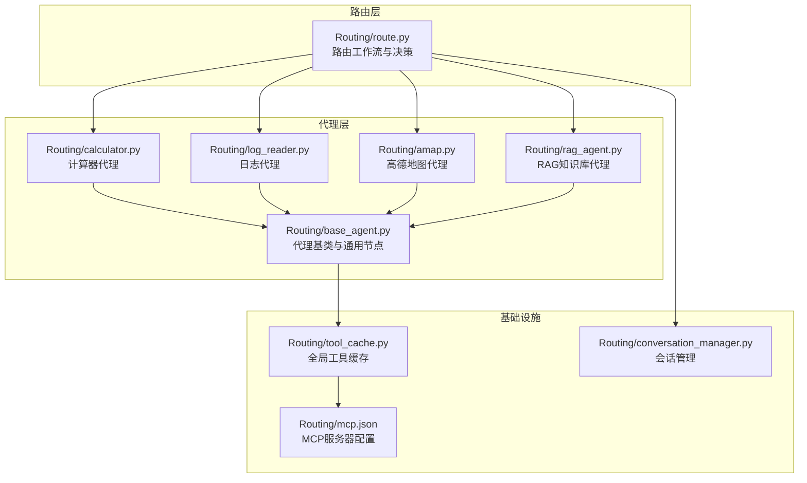
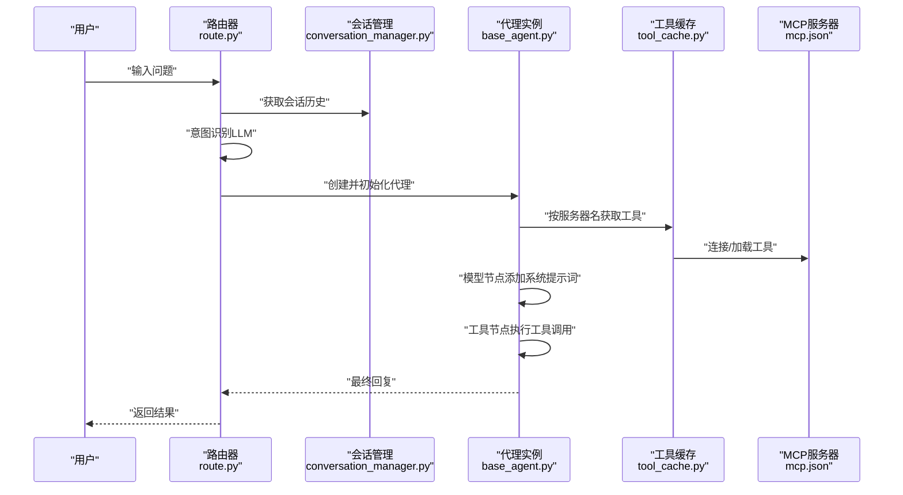
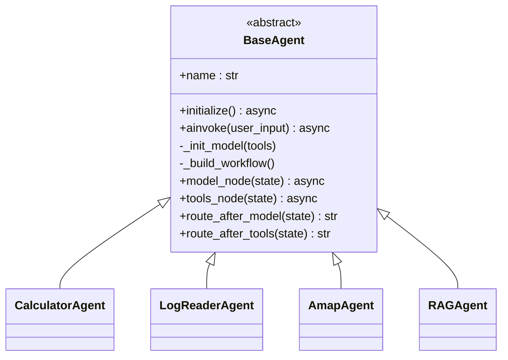
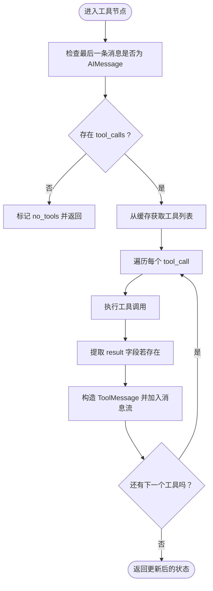
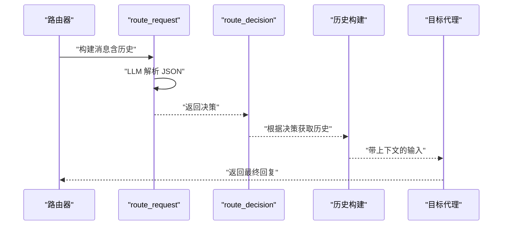
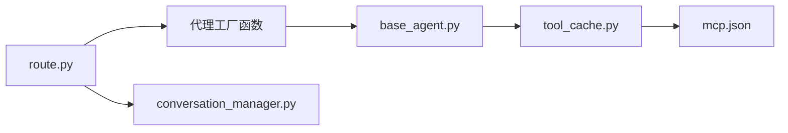

# 代理调度机制

<cite>
**本文档引用的文件**
- [Routing/base_agent.py](file://Routing/base_agent.py)
- [Routing/route.py](file://Routing/route.py)
- [Routing/tool_cache.py](file://Routing/tool_cache.py)
- [Routing/conversation_manager.py](file://Routing/conversation_manager.py)
- [Routing/mcp.json](file://Routing/mcp.json)
- [Routing/calculator.py](file://Routing/calculator.py)
- [Routing/log_reader.py](file://Routing/log_reader.py)
- [Routing/amap.py](file://Routing/amap.py)
- [Routing/rag_agent.py](file://Routing/rag_agent.py)
- [demo_conversation.py](file://demo_conversation.py)
- [test/test_chain_calculation.py](file://test/test_chain_calculation.py)
- [test/test_route_weather.py](file://test/test_route_weather.py)
- [quickstart.py](file://quickstart.py)
- [README.md](file://README.md)
</cite>

## 目录
1. [引言](#引言)
2. [项目结构](#项目结构)
3. [核心组件](#核心组件)
4. [架构总览](#架构总览)
5. [详细组件分析](#详细组件分析)
6. [依赖分析](#依赖分析)
7. [性能考虑](#性能考虑)
8. [故障排查指南](#故障排查指南)
9. [结论](#结论)
10. [附录](#附录)

## 引言
本文件系统性阐述该 AI 运维系统中的“代理调度机制”。重点覆盖如下方面：
- 代理创建与调度的完整流程
- 代理工厂函数 create_calculator_agent、create_log_reader_agent、create_amap_agent、create_rag_agent 的实现原理
- 代理实例生命周期管理、工具缓存使用策略与代理状态传递机制
- 代理调度的条件逻辑，包括 route_decision 的路由判断规则与错误处理机制
- 如何创建自定义代理（基类继承、工具注册、消息处理）
- 性能优化建议与并发处理策略

## 项目结构
该项目采用模块化设计，围绕“路由”“代理基类”“工具缓存”“会话管理”“MCP 服务器配置”等模块协同工作，形成“意图识别 -> 代理选择 -> 工具调用 -> 结果返回”的闭环。

图表来源
- [Routing/route.py:1-553](file://Routing/route.py#L1-L553)
- [Routing/base_agent.py:1-497](file://Routing/base_agent.py#L1-L497)
- [Routing/tool_cache.py:1-302](file://Routing/tool_cache.py#L1-L302)
- [Routing/conversation_manager.py:1-275](file://Routing/conversation_manager.py#L1-L275)
- [Routing/mcp.json:1-29](file://Routing/mcp.json#L1-L29)

章节来源
- [README.md:1-125](file://README.md#L1-L125)
- [Routing/route.py:1-553](file://Routing/route.py#L1-L553)
- [Routing/base_agent.py:1-497](file://Routing/base_agent.py#L1-L497)
- [Routing/tool_cache.py:1-302](file://Routing/tool_cache.py#L1-L302)
- [Routing/conversation_manager.py:1-275](file://Routing/conversation_manager.py#L1-L275)
- [Routing/mcp.json:1-29](file://Routing/mcp.json#L1-L29)

## 核心组件
- 代理基类 BaseAgent：统一工具加载、消息处理、错误处理与工作流构建；提供模型节点、工具节点与路由逻辑。
- 工具缓存 GlobalToolCache：按服务器名缓存工具与会话，支持 TTL 过期与连接复用。
- 会话管理 ConversationManager：多会话生命周期管理、历史消息持久化与过期清理。
- 路由器 RouterWorkflow：基于 LangGraph 的状态机，负责意图识别与代理选择。
- 代理工厂函数：create_calculator_agent、create_log_reader_agent、create_amap_agent、create_rag_agent。

章节来源
- [Routing/base_agent.py:29-318](file://Routing/base_agent.py#L29-L318)
- [Routing/tool_cache.py:39-302](file://Routing/tool_cache.py#L39-L302)
- [Routing/conversation_manager.py:82-275](file://Routing/conversation_manager.py#L82-L275)
- [Routing/route.py:149-291](file://Routing/route.py#L149-L291)

## 架构总览
系统通过“路由器”接收用户输入，结合会话历史进行意图识别，选择对应代理；代理内部通过“模型节点”生成工具调用计划，“工具节点”执行工具并将结果回填至消息流，最终由 LLM 生成自然语言回复。

图表来源
- [Routing/route.py:149-233](file://Routing/route.py#L149-L233)
- [Routing/conversation_manager.py:185-214](file://Routing/conversation_manager.py#L185-L214)
- [Routing/base_agent.py:44-66](file://Routing/base_agent.py#L44-L66)
- [Routing/tool_cache.py:85-116](file://Routing/tool_cache.py#L85-L116)
- [Routing/mcp.json:1-29](file://Routing/mcp.json#L1-L29)

## 详细组件分析

### 代理基类与生命周期
- 初始化策略：延迟初始化，首次调用 ainvoke 时才加载工具、构建工作流。
- 工具加载：从全局缓存获取工具列表，绑定到 LLM；支持 stdio 与 streamable-http 两种传输协议。
- 工作流：模型节点 -> 工具节点（条件边）-> 模型节点（回环）-> 结束。
- 状态传递：AgentState 包含 messages、current_step、tool_calls、tool_results、final_response、error 等字段，贯穿整个工作流。

图表来源
- [Routing/base_agent.py:29-497](file://Routing/base_agent.py#L29-L497)

章节来源
- [Routing/base_agent.py:44-66](file://Routing/base_agent.py#L44-L66)
- [Routing/base_agent.py:102-130](file://Routing/base_agent.py#L102-L130)
- [Routing/base_agent.py:131-217](file://Routing/base_agent.py#L131-L217)
- [Routing/base_agent.py:238-256](file://Routing/base_agent.py#L238-L256)
- [Routing/base_agent.py:258-318](file://Routing/base_agent.py#L258-L318)

### 工具缓存与代理状态传递
- 缓存策略：按服务器名缓存工具与会话，TTL 默认 300 秒；支持 stdio 与 streamable-http 两类加载路径。
- 状态传递：代理内部通过 AgentState 在节点间传递 messages、tool_calls、tool_results、current_step 等，保证链式工具调用的上下文一致性。
- 工具执行：工具节点根据 AIMessage 中的 tool_calls 逐个执行，构造 ToolMessage 并回填消息流。

图表来源
- [Routing/base_agent.py:131-217](file://Routing/base_agent.py#L131-L217)
- [Routing/tool_cache.py:85-116](file://Routing/tool_cache.py#L85-L116)

章节来源
- [Routing/tool_cache.py:85-116](file://Routing/tool_cache.py#L85-L116)
- [Routing/tool_cache.py:118-243](file://Routing/tool_cache.py#L118-L243)
- [Routing/base_agent.py:131-217](file://Routing/base_agent.py#L131-L217)

### 代理工厂函数与调度
- 工厂函数：create_calculator_agent、create_log_reader_agent、create_amap_agent、create_rag_agent 负责创建具体代理并完成初始化。
- 路由器：route_request 节点结合会话历史与 LLM 判断意图，route_decision 根据决策路由到相应代理节点；错误意图则进入 error_handler。
- 会话上下文：_build_input_with_history 将最近历史拼接到当前输入，增强上下文理解。

图表来源
- [Routing/route.py:149-233](file://Routing/route.py#L149-L233)
- [Routing/route.py:243-255](file://Routing/route.py#L243-L255)
- [Routing/route.py:111-146](file://Routing/route.py#L111-L146)

章节来源
- [Routing/route.py:61-108](file://Routing/route.py#L61-L108)
- [Routing/route.py:149-233](file://Routing/route.py#L149-L233)
- [Routing/route.py:243-255](file://Routing/route.py#L243-L255)
- [Routing/route.py:351-414](file://Routing/route.py#L351-L414)

### 代理类型与系统提示词
- 计算器代理：强调链式计算、运算优先级与逐步调用工具的原则。
- 日志代理：专注于日志读取与错误/警告信息总结。
- 高德地图代理：提供地图、位置、导航、天气等信息服务。
- RAG 代理：基于知识库检索，支持本地 ChromaDB 与远程 Milvus 后端切换。

章节来源
- [Routing/base_agent.py:322-401](file://Routing/base_agent.py#L322-L401)
- [Routing/base_agent.py:403-415](file://Routing/base_agent.py#L403-L415)
- [Routing/base_agent.py:418-431](file://Routing/base_agent.py#L418-L431)
- [Routing/base_agent.py:433-463](file://Routing/base_agent.py#L433-L463)

### 自定义代理开发指南
- 继承 BaseAgent，实现 _get_server_name 与 _get_system_prompt。
- 在 mcp.json 中配置对应 MCP 服务器（stdio 或 streamable-http）。
- 使用 create_*_agent 工厂函数创建实例并初始化。
- 通过代理的 ainvoke 接口进行消息处理，查看 tool_calls 与 tool_results 以调试链式工具调用。

章节来源
- [Routing/base_agent.py:90-98](file://Routing/base_agent.py#L90-L98)
- [Routing/mcp.json:1-29](file://Routing/mcp.json#L1-L29)
- [Routing/calculator.py:6-10](file://Routing/calculator.py#L6-L10)
- [Routing/log_reader.py:6-10](file://Routing/log_reader.py#L6-L10)
- [Routing/amap.py:6-10](file://Routing/amap.py#L6-L10)
- [Routing/rag_agent.py:6-10](file://Routing/rag_agent.py#L6-L10)

## 依赖分析
- 组件耦合：路由器依赖各代理工厂；代理依赖工具缓存；工具缓存依赖 MCP 配置；路由器与会话管理相互协作。
- 外部依赖：LangChain、LangGraph、MCP 协议适配器、Redis（可选）、SSH 隧道（可选）。

图表来源
- [Routing/route.py:16-24](file://Routing/route.py#L16-L24)
- [Routing/base_agent.py:50-57](file://Routing/base_agent.py#L50-L57)
- [Routing/tool_cache.py:63-84](file://Routing/tool_cache.py#L63-L84)
- [Routing/mcp.json:1-29](file://Routing/mcp.json#L1-L29)
- [Routing/conversation_manager.py:108-120](file://Routing/conversation_manager.py#L108-L120)

章节来源
- [Routing/route.py:16-24](file://Routing/route.py#L16-L24)
- [Routing/base_agent.py:50-57](file://Routing/base_agent.py#L50-L57)
- [Routing/tool_cache.py:63-84](file://Routing/tool_cache.py#L63-L84)
- [Routing/conversation_manager.py:108-120](file://Routing/conversation_manager.py#L108-L120)

## 性能考虑
- 工具缓存：通过 GlobalToolCache 复用工具与会话，避免重复加载 MCP 服务器，显著降低冷启动开销。
- 会话复用：ConversationManager 支持内存与 Redis 双重存储，减少重复序列化与网络往返。
- 超时与清理：HTTP 传输设置超时，异常时及时清理会话与连接，防止资源泄漏。
- 并发策略：代理内部节点为异步执行；路由器与会话管理采用单例与线程安全锁，避免竞态。
- 建议：
  - 合理设置 TTL，平衡新鲜度与性能。
  - 对高频工具调用场景，预热代理实例。
  - 控制会话历史长度，避免消息过大影响 LLM 推理。

章节来源
- [Routing/tool_cache.py:281-297](file://Routing/tool_cache.py#L281-L297)
- [Routing/conversation_manager.py:122-146](file://Routing/conversation_manager.py#L122-L146)
- [Routing/tool_cache.py:212-223](file://Routing/tool_cache.py#L212-L223)

## 故障排查指南
- 工具加载失败：检查 mcp.json 中服务器配置与传输协议；确认环境变量（如 AMAP_API_KEY）已设置；查看工具缓存异常日志。
- 代理执行错误：查看代理节点返回的 error 字段；核对 AIMessage 是否包含 tool_calls。
- 路由错误：确认 route_request 的 JSON 解析逻辑；若解析失败，回退到关键词匹配。
- 会话异常：确认 Redis 配置与隧道连接；必要时降级为内存模式。
- 清理资源：应用退出时调用 cleanup_all，确保缓存、会话与连接被正确释放。

章节来源
- [Routing/tool_cache.py:194-196](file://Routing/tool_cache.py#L194-L196)
- [Routing/route.py:196-231](file://Routing/route.py#L196-L231)
- [Routing/base_agent.py:122-129](file://Routing/base_agent.py#L122-L129)
- [Routing/route.py:434-456](file://Routing/route.py#L434-L456)

## 结论
该系统通过“路由器 + 代理基类 + 工具缓存 + 会话管理”的分层架构，实现了稳定、可扩展且高性能的代理调度机制。工厂函数与统一基类降低了接入成本，工具缓存与会话管理提升了吞吐与用户体验，LangGraph 工作流保证了状态一致与可追踪性。按本文建议进行优化与排障，可在生产环境中获得更好的稳定性与性能表现。

## 附录

### 代理工厂函数与示例
- 工厂函数位置与职责：
  - [create_calculator_agent:467-471](file://Routing/base_agent.py#L467-L471)
  - [create_log_reader_agent:474-478](file://Routing/base_agent.py#L474-L478)
  - [create_amap_agent:481-485](file://Routing/base_agent.py#L481-L485)
  - [create_rag_agent:488-496](file://Routing/base_agent.py#L488-L496)
- 示例脚本：
  - [demo_conversation.py:19-102](file://demo_conversation.py#L19-L102)
  - [test/test_chain_calculation.py:14-65](file://test/test_chain_calculation.py#L14-L65)
  - [test/test_route_weather.py:14-56](file://test/test_route_weather.py#L14-L56)
  - [quickstart.py:8-68](file://quickstart.py#L8-L68)

章节来源
- [Routing/base_agent.py:467-496](file://Routing/base_agent.py#L467-L496)
- [demo_conversation.py:19-102](file://demo_conversation.py#L19-L102)
- [test/test_chain_calculation.py:14-65](file://test/test_chain_calculation.py#L14-L65)
- [test/test_route_weather.py:14-56](file://test/test_route_weather.py#L14-L56)
- [quickstart.py:8-68](file://quickstart.py#L8-L68)