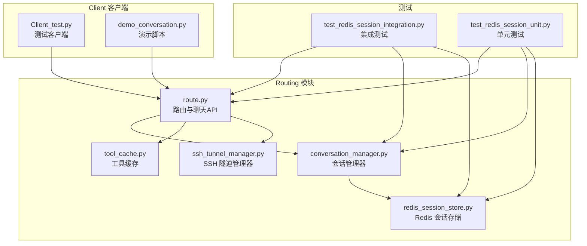
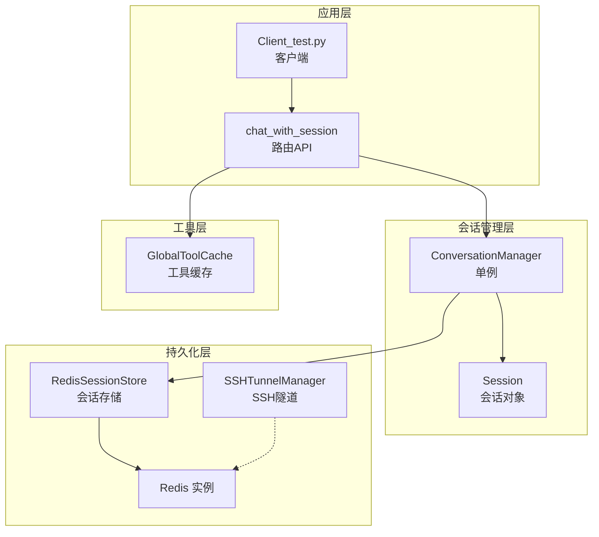
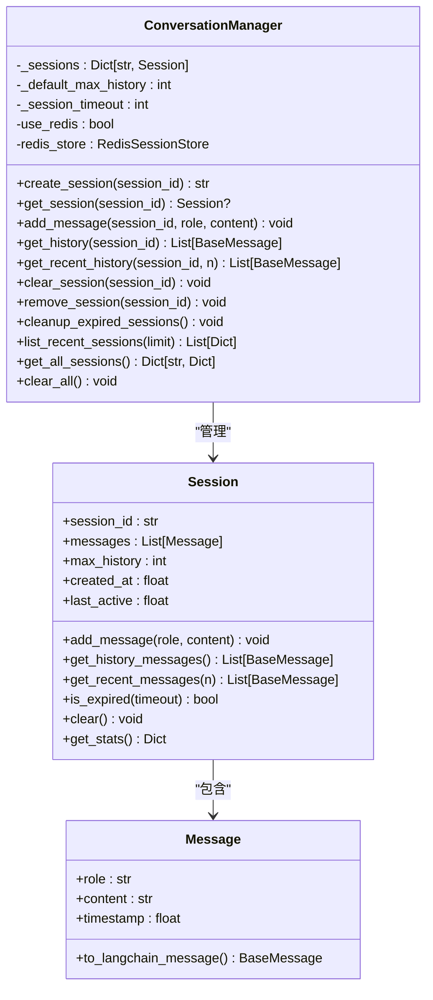
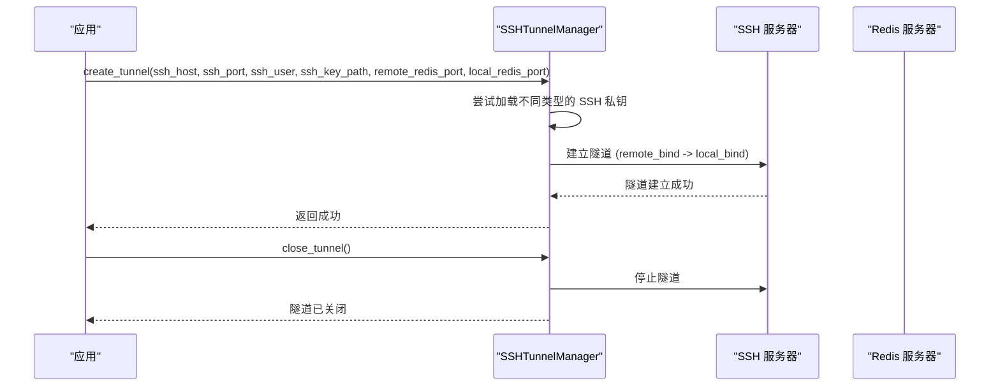
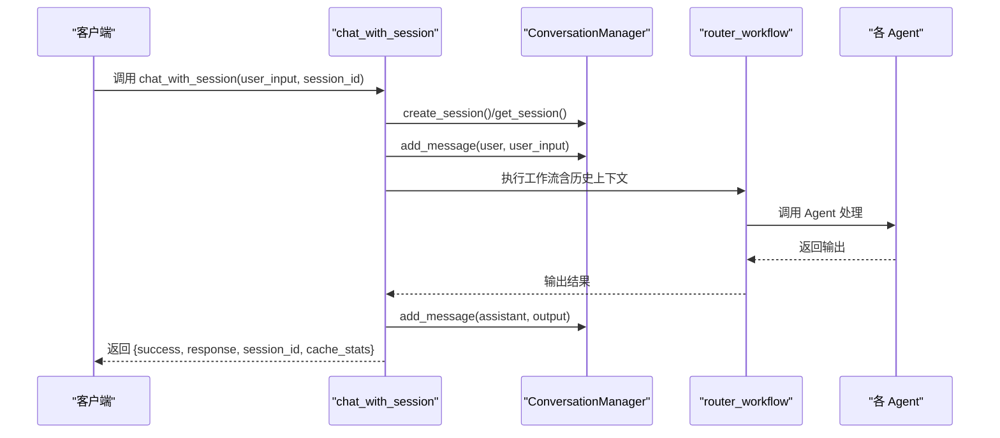
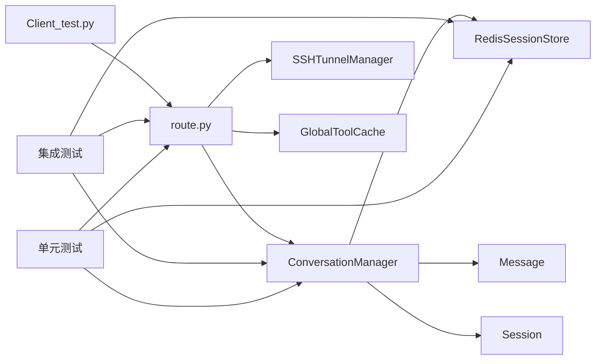

# 会话管理系统

<cite>
**本文档引用的文件**
- [conversation_manager.py](file://Routing/conversation_manager.py)
- [redis_session_store.py](file://Routing/redis_session_store.py)
- [ssh_tunnel_manager.py](file://Routing/ssh_tunnel_manager.py)
- [route.py](file://Routing/route.py)
- [tool_cache.py](file://Routing/tool_cache.py)
- [Client_test.py](file://Client/Client_test.py)
- [demo_conversation.py](file://demo_conversation.py)
- [test_redis_session_integration.py](file://test/test_redis_session_integration.py)
- [test_redis_session_unit.py](file://test/test_redis_session_unit.py)
</cite>

## 目录
1. [简介](#简介)
2. [项目结构](#项目结构)
3. [核心组件](#核心组件)
4. [架构总览](#架构总览)
5. [详细组件分析](#详细组件分析)
6. [依赖关系分析](#依赖关系分析)
7. [性能考虑](#性能考虑)
8. [故障排除指南](#故障排除指南)
9. [结论](#结论)
10. [附录](#附录)

## 简介
本文件面向会话管理系统，重点阐述多轮对话的会话管理机制，包括会话ID生成策略、消息历史存储、会话状态维护、Redis持久化集成方案（含SSH隧道管理）、会话API使用示例、超时处理与内存管理、性能优化策略以及会话管理与路由系统的集成方式和历史上下文构建机制。文档以代码为依据，提供分层次的技术说明与可视化图表，便于不同技术背景的读者理解与实践。

## 项目结构
会话管理系统位于 Routing 子模块中，核心文件包括会话管理器、Redis存储、SSH隧道管理、路由与聊天API、工具缓存等。客户端通过 Client_test.py 与路由模块交互，演示循环对话与会话管理。

**图表来源**
- [route.py:1-553](file://Routing/route.py#L1-L553)
- [conversation_manager.py:1-275](file://Routing/conversation_manager.py#L1-L275)
- [redis_session_store.py:1-228](file://Routing/redis_session_store.py#L1-L228)
- [ssh_tunnel_manager.py:1-100](file://Routing/ssh_tunnel_manager.py#L1-L100)
- [tool_cache.py:1-302](file://Routing/tool_cache.py#L1-L302)
- [Client_test.py:1-230](file://Client/Client_test.py#L1-L230)
- [demo_conversation.py:1-102](file://demo_conversation.py#L1-L102)
- [test_redis_session_integration.py:1-328](file://test/test_redis_session_integration.py#L1-L328)
- [test_redis_session_unit.py:1-294](file://test/test_redis_session_unit.py#L1-L294)

**章节来源**
- [route.py:1-553](file://Routing/route.py#L1-L553)
- [conversation_manager.py:1-275](file://Routing/conversation_manager.py#L1-L275)
- [redis_session_store.py:1-228](file://Routing/redis_session_store.py#L1-L228)
- [ssh_tunnel_manager.py:1-100](file://Routing/ssh_tunnel_manager.py#L1-L100)
- [tool_cache.py:1-302](file://Routing/tool_cache.py#L1-L302)
- [Client_test.py:1-230](file://Client/Client_test.py#L1-L230)
- [demo_conversation.py:1-102](file://demo_conversation.py#L1-L102)
- [test_redis_session_integration.py:1-328](file://test/test_redis_session_integration.py#L1-L328)
- [test_redis_session_unit.py:1-294](file://test/test_redis_session_unit.py#L1-L294)

## 核心组件
- 会话管理器（ConversationManager）：单例模式，负责创建、获取、添加消息、清理过期会话、列出最近会话、统计会话信息等。
- 会话对象（Session）：封装单个会话的状态，包括消息列表、最大历史条数、创建时间、最后活跃时间等。
- Redis 会话存储（RedisSessionStore）：提供会话元数据与消息列表的持久化、加载、删除、活跃会话索引与历史列表维护。
- SSH 隧道管理器（SSHTunnelManager）：用于安全连接远程 Redis，通过本地端口转发实现内网访问。
- 路由与聊天API（route.py）：提供 chat_with_session 等API，构建包含历史上下文的输入，并与各Agent协作。
- 工具缓存（tool_cache.py）：缓存MCP工具与会话，避免重复加载，支持TTL过期与清理。

**章节来源**
- [conversation_manager.py:82-275](file://Routing/conversation_manager.py#L82-L275)
- [redis_session_store.py:14-228](file://Routing/redis_session_store.py#L14-L228)
- [ssh_tunnel_manager.py:12-100](file://Routing/ssh_tunnel_manager.py#L12-L100)
- [route.py:351-456](file://Routing/route.py#L351-L456)
- [tool_cache.py:39-302](file://Routing/tool_cache.py#L39-L302)

## 架构总览
会话管理采用“内存为主、Redis为辅”的双层架构：内存中维护活跃会话，Redis持久化存储会话元数据与消息列表；当内存会话缺失时，从Redis加载；同时通过SSH隧道安全访问远程Redis。

**图表来源**
- [route.py:351-456](file://Routing/route.py#L351-L456)
- [conversation_manager.py:100-275](file://Routing/conversation_manager.py#L100-L275)
- [redis_session_store.py:14-228](file://Routing/redis_session_store.py#L14-L228)
- [ssh_tunnel_manager.py:12-100](file://Routing/ssh_tunnel_manager.py#L12-L100)
- [tool_cache.py:39-302](file://Routing/tool_cache.py#L39-L302)

## 详细组件分析

### 会话管理器（ConversationManager）
- 单例模式：确保全局仅有一个会话管理器实例，避免重复初始化。
- 会话ID生成：若未提供 session_id，则使用UUID v4 自动生成唯一ID。
- 会话生命周期：
  - create_session：创建会话并持久化到Redis（若启用）。
  - get_session：优先从内存获取，否则从Redis加载并缓存到内存。
  - add_message：向指定会话添加消息并持久化到Redis。
  - get_history / get_recent_history：获取历史消息（LangChain格式）。
  - clear_session / remove_session：清空或删除会话，并同步到Redis。
  - cleanup_expired_sessions：清理内存与Redis中的过期会话（默认1小时）。
  - list_recent_sessions / get_all_sessions / clear_all：管理最近会话列表、统计信息与全局清理。
- 会话状态维护：记录创建时间、最后活跃时间、最大历史条数，支持统计查询。

**图表来源**
- [conversation_manager.py:18-275](file://Routing/conversation_manager.py#L18-L275)

**章节来源**
- [conversation_manager.py:82-275](file://Routing/conversation_manager.py#L82-L275)

### Redis 会话存储（RedisSessionStore）
- 连接配置：主机、端口、数据库、密码、TTL（默认7天）。
- 数据结构设计：
  - 元数据键：session:{id}:meta，哈希存储会话元信息（创建时间、最后活跃、最大历史、消息计数）。
  - 消息列表键：session:{id}:messages，列表存储消息（JSON序列化）。
  - 活跃会话索引：zset sessions:active，按 last_active 排序。
  - 会话历史：list sessions:history，保留最近50个会话ID。
- 操作流程：
  - save_session：写入元数据、消息列表、更新活跃索引与历史列表。
  - load_session：读取元数据与消息列表，重建Session对象。
  - list_recent_sessions：从活跃索引读取最近活跃会话。
  - delete_session：删除元数据与消息，从活跃索引移除。
  - cleanup_expired_sessions：扫描活跃索引，删除超过1小时未活跃的会话。
  - close：关闭Redis连接。

```mermaid
flowchart TD
Start(["保存会话"]) --> SaveMeta["写入元数据<br/>session:{id}:meta"]
SaveMeta --> SaveMsgs["写入消息列表<br/>session:{id}:messages"]
SaveMsgs --> UpdateActive["更新活跃索引<br/>sessions:active"]
UpdateActive --> UpdateHistory["更新历史列表<br/>sessions:history"]
UpdateHistory --> End(["完成"])
LoadStart(["加载会话"]) --> LoadMeta["读取元数据"]
LoadMeta --> CreateSession["重建 Session 对象"]
CreateSession --> LoadMsgs["读取消息列表并反序列化"]
LoadMsgs --> LoadEnd(["完成"])
```

**图表来源**
- [redis_session_store.py:36-131](file://Routing/redis_session_store.py#L36-L131)

**章节来源**
- [redis_session_store.py:14-228](file://Routing/redis_session_store.py#L14-L228)

### SSH 隧道管理器（SSHTunnelManager）
- 功能：通过SSH私钥加载不同类型（RSA/ECDSA/Ed25519），建立本地端口到远程Redis的隧道。
- 关键流程：尝试加载私钥 -> 创建隧道 -> 启动隧道 -> 记录日志。
- 资源管理：close_tunnel 停止隧道并关闭SSH客户端。

**图表来源**
- [ssh_tunnel_manager.py:19-100](file://Routing/ssh_tunnel_manager.py#L19-L100)

**章节来源**
- [ssh_tunnel_manager.py:12-100](file://Routing/ssh_tunnel_manager.py#L12-L100)

### 路由与聊天API（route.py）
- chat_with_session：支持多轮对话的高级API，内部自动创建会话、保存用户消息、调用路由工作流、保存AI回复、返回结果与缓存统计。
- 历史上下文构建：_build_input_with_history 从 ConversationManager 获取最近N条消息，拼接为带上下文的输入。
- 初始化：initialize_redis_and_tunnel 读取环境变量，创建SSH隧道，配置并启用Redis持久化。
- 资源清理：cleanup_all 清理工具缓存、会话、关闭Redis连接与SSH隧道。

**图表来源**
- [route.py:351-414](file://Routing/route.py#L351-L414)

**章节来源**
- [route.py:111-147](file://Routing/route.py#L111-L147)
- [route.py:298-347](file://Routing/route.py#L298-L347)
- [route.py:351-456](file://Routing/route.py#L351-L456)

### 工具缓存（tool_cache.py）
- 单例模式：全局共享缓存，生命周期贯穿应用。
- 缓存策略：按服务器名分组，支持TTL过期；首次加载后缓存，后续命中。
- 传输协议：支持 stdio 与 streamable-http 两种协议，分别处理本地进程与HTTP服务。
- 资源管理：clear_all 清理所有缓存与会话，避免资源泄漏。

**章节来源**
- [tool_cache.py:39-302](file://Routing/tool_cache.py#L39-L302)

## 依赖关系分析
- ConversationManager 依赖 RedisSessionStore（可选）与 Session/Message 类型。
- route.py 依赖 ConversationManager、SSHTunnelManager、GlobalToolCache，并编译 LangGraph 工作流。
- Client_test.py 依赖 route.py 的API，实现循环对话与会话管理命令。
- 测试模块依赖路由与会话管理器，验证集成与单元场景。

**图表来源**
- [conversation_manager.py:100-120](file://Routing/conversation_manager.py#L100-L120)
- [route.py:21-25](file://Routing/route.py#L21-L25)
- [Client_test.py:21-24](file://Client/Client_test.py#L21-L24)
- [test_redis_session_integration.py:32-34](file://test/test_redis_session_integration.py#L32-L34)
- [test_redis_session_unit.py:96-101](file://test/test_redis_session_unit.py#L96-L101)

**章节来源**
- [conversation_manager.py:100-120](file://Routing/conversation_manager.py#L100-L120)
- [route.py:21-25](file://Routing/route.py#L21-L25)
- [Client_test.py:21-24](file://Client/Client_test.py#L21-L24)
- [test_redis_session_integration.py:32-34](file://test/test_redis_session_integration.py#L32-L34)
- [test_redis_session_unit.py:96-101](file://test/test_redis_session_unit.py#L96-L101)

## 性能考虑
- 内存与Redis双层缓存：内存会话用于高频读写，Redis用于持久化与跨进程共享，减少重复加载。
- 消息历史限制：Session.max_history 控制消息列表长度，默认20条，避免历史无限增长。
- Redis TTL：会话元数据与消息列表设置TTL（默认7天），结合过期清理降低存储压力。
- 批量写入：消息列表使用RPUSH批量插入，减少网络往返。
- 过期清理：定期清理内存与Redis中的过期会话，释放资源。
- 工具缓存：避免重复加载MCP工具，显著降低延迟与CPU开销。

[本节为通用性能讨论，不直接分析具体文件]

## 故障排除指南
- Redis连接失败：
  - 检查Redis服务是否运行、端口是否开放、密码是否正确。
  - 若使用远程Redis，确认SSH隧道已成功建立。
- SSH隧道问题：
  - 确认私钥格式与路径正确，支持RSA/ECDSA/Ed25519。
  - 检查防火墙与网络策略。
- 会话恢复失败：
  - 确认Redis中存在对应键空间（meta与messages）。
  - 检查消息序列化/反序列化是否一致。
- 过期清理不生效：
  - 确认会话 last_active 更新逻辑与清理阈值（默认1小时）。
- 资源未清理：
  - 确认调用 cleanup_all 并检查Redis与SSH隧道关闭日志。

**章节来源**
- [ssh_tunnel_manager.py:41-80](file://Routing/ssh_tunnel_manager.py#L41-L80)
- [redis_session_store.py:193-219](file://Routing/redis_session_store.py#L193-L219)
- [route.py:434-456](file://Routing/route.py#L434-L456)

## 结论
会话管理系统通过“内存+Redis”的双层架构实现了高效、可靠的多轮对话管理。会话ID采用UUID v4保证唯一性；消息历史与会话状态在内存中快速访问，同时持久化到Redis；通过SSH隧道实现安全访问远程Redis；路由系统将历史上下文注入到各Agent，提升对话连贯性；工具缓存进一步优化性能。测试覆盖了完整生命周期、恢复、并发与过期清理，确保系统稳定性与可靠性。

[本节为总结性内容，不直接分析具体文件]

## 附录

### 会话API使用示例（路径指引）
- 创建新会话并进行多轮对话：
  - 调用 chat_with_session(user_input, session_id=None) 自动创建会话。
  - 下一次调用传入同一 session_id 继续对话。
  - 示例参考：[demo_conversation.py:35-68](file://demo_conversation.py#L35-L68)
- 添加消息与获取历史：
  - 使用 conversation_manager.add_message(session_id, role, content) 添加消息。
  - 使用 conversation_manager.get_history(session_id) 获取全部历史。
  - 使用 conversation_manager.get_recent_history(session_id, n) 获取最近n条。
  - 示例参考：[route.py:351-414](file://Routing/route.py#L351-L414)
- 清理与关闭：
  - 使用 conversation_manager.remove_session(session_id) 删除会话。
  - 使用 conversation_manager.cleanup_expired_sessions() 清理过期会话。
  - 使用 cleanup_all() 清理工具缓存、会话、Redis连接与SSH隧道。
  - 示例参考：[route.py:417-456](file://Routing/route.py#L417-L456)

**章节来源**
- [demo_conversation.py:35-68](file://demo_conversation.py#L35-L68)
- [route.py:351-456](file://Routing/route.py#L351-L456)

### 会话超时与内存管理策略
- 会话超时：Session.is_expired 默认1小时；Redis侧也有TTL保护。
- 内存管理：Session.max_history 限制消息数量；cleanup_expired_sessions 清理内存与Redis过期会话。
- 资源管理：cleanup_all 关闭Redis连接与SSH隧道，避免资源泄漏。

**章节来源**
- [conversation_manager.py:63-65](file://Routing/conversation_manager.py#L63-L65)
- [conversation_manager.py:234-252](file://Routing/conversation_manager.py#L234-L252)
- [redis_session_store.py:193-219](file://Routing/redis_session_store.py#L193-L219)
- [route.py:434-456](file://Routing/route.py#L434-L456)

### 会话管理与路由系统的集成
- 历史上下文构建：_build_input_with_history 从 ConversationManager 获取最近消息，拼接为带上下文的输入。
- 路由决策：route_request 结合历史消息与当前输入，调用LLM进行意图识别，决定下一跳Agent。
- 会话ID传递：chat_with_session 将 session_id 传入状态，确保各节点共享上下文。

**章节来源**
- [route.py:111-147](file://Routing/route.py#L111-L147)
- [route.py:149-234](file://Routing/route.py#L149-L234)
- [route.py:351-414](file://Routing/route.py#L351-L414)