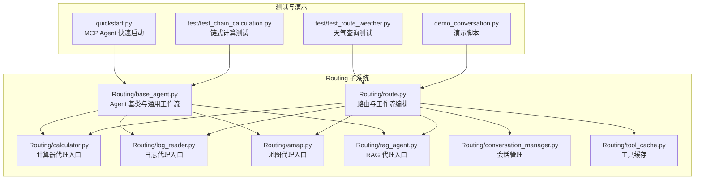
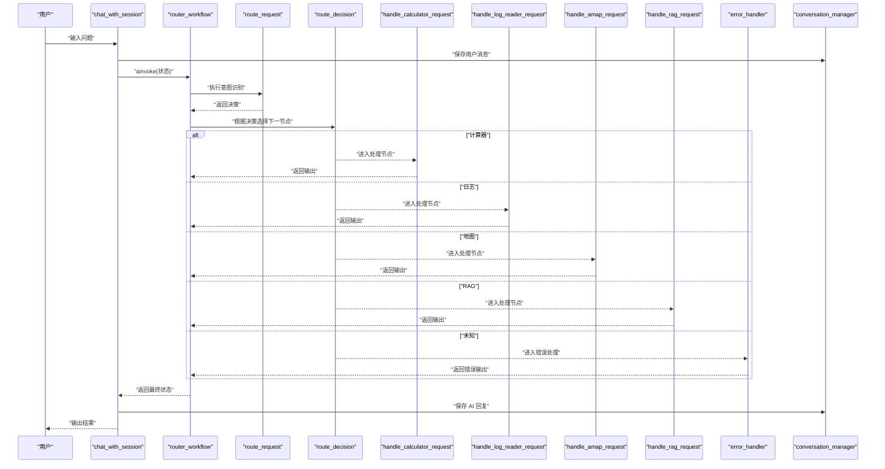
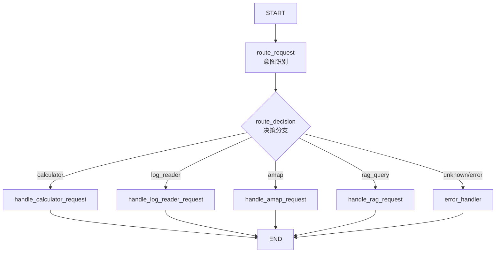
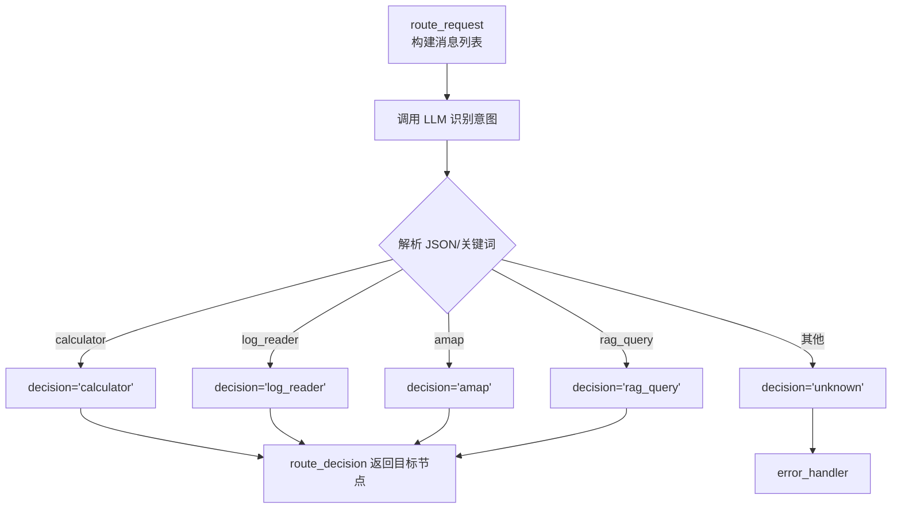
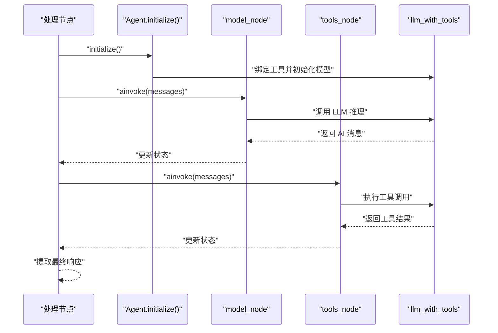
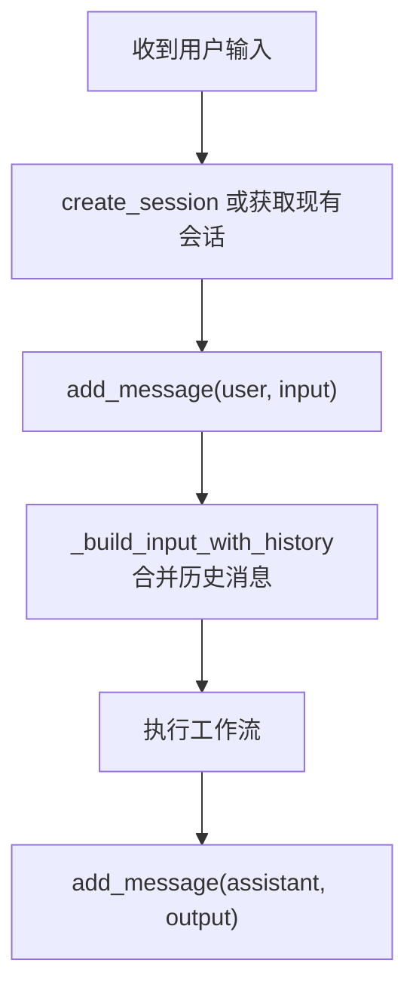
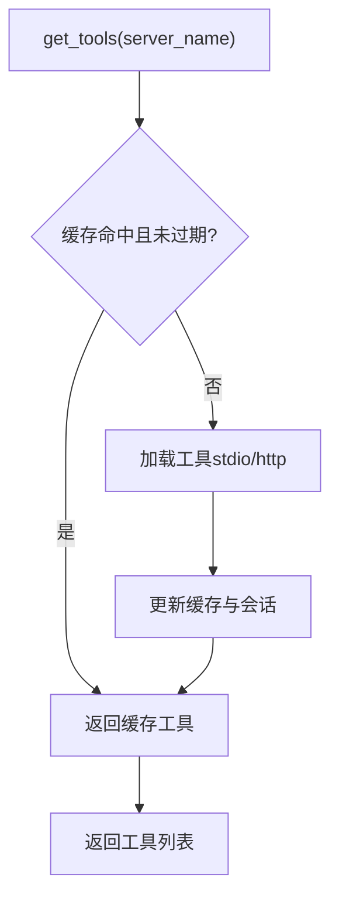
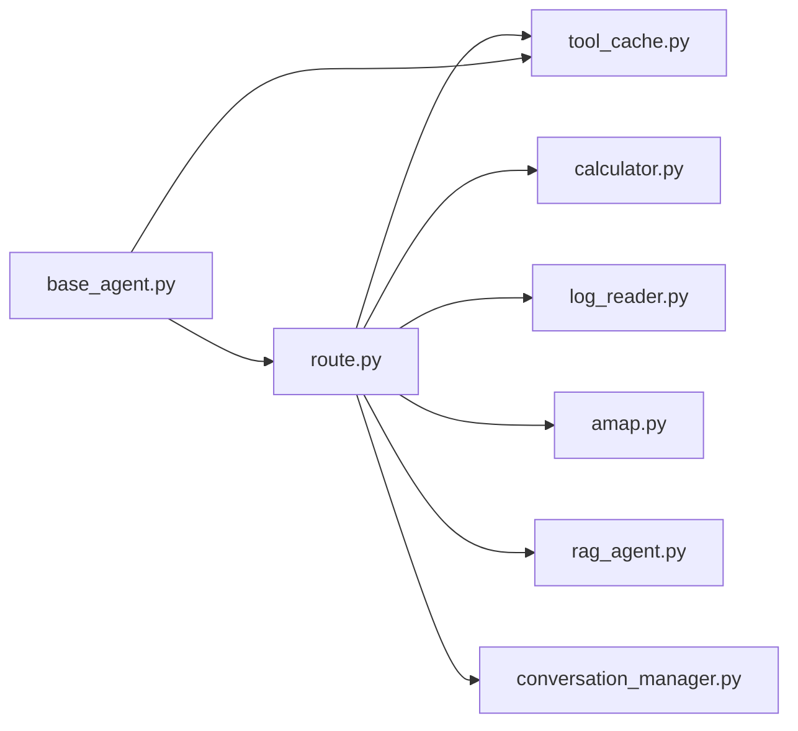

# 工作流编排

<cite>
**本文引用的文件**
- [Routing/route.py](file://Routing/route.py)
- [Routing/base_agent.py](file://Routing/base_agent.py)
- [Routing/conversation_manager.py](file://Routing/conversation_manager.py)
- [Routing/tool_cache.py](file://Routing/tool_cache.py)
- [Routing/calculator.py](file://Routing/calculator.py)
- [Routing/log_reader.py](file://Routing/log_reader.py)
- [Routing/amap.py](file://Routing/amap.py)
- [Routing/rag_agent.py](file://Routing/rag_agent.py)
- [test/test_route_weather.py](file://test/test_route_weather.py)
- [test/test_chain_calculation.py](file://test/test_chain_calculation.py)
- [demo_conversation.py](file://demo_conversation.py)
- [quickstart.py](file://quickstart.py)
- [Prompt提示词整理/router.md](file://Prompt提示词整理/router.md)
</cite>

## 目录
1. [简介](#简介)
2. [项目结构](#项目结构)
3. [核心组件](#核心组件)
4. [架构总览](#架构总览)
5. [详细组件分析](#详细组件分析)
6. [依赖分析](#依赖分析)
7. [性能考虑](#性能考虑)
8. [故障排查指南](#故障排查指南)
9. [结论](#结论)
10. [附录](#附录)

## 简介
本文件围绕基于 LangGraph 的工作流编排进行系统化说明，重点覆盖：
- 基于 StateGraph 的状态图设计与构建流程
- 节点注册、边定义与条件边配置
- 工作流生命周期管理（构建、编译、执行）
- 状态转换逻辑（START、路由节点、处理节点、错误节点、END）
- 自定义工作流扩展方法（新增节点、条件边、错误处理）
- 性能监控、状态检查点与调试技巧
- 异步执行与并发控制策略

## 项目结构
本项目采用“按功能域划分”的模块组织方式，Routing 子系统负责意图识别与工作流编排；基础 Agent 抽象与工具缓存提供统一的工具加载与执行框架；会话管理器支撑多轮对话与上下文持久化。

**图表来源**
- [Routing/route.py:1-553](file://Routing/route.py#L1-L553)
- [Routing/base_agent.py:1-497](file://Routing/base_agent.py#L1-L497)
- [Routing/conversation_manager.py:1-275](file://Routing/conversation_manager.py#L1-L275)
- [Routing/tool_cache.py:1-302](file://Routing/tool_cache.py#L1-L302)
- [Routing/calculator.py:1-11](file://Routing/calculator.py#L1-L11)
- [Routing/log_reader.py:1-11](file://Routing/log_reader.py#L1-L11)
- [Routing/amap.py:1-11](file://Routing/amap.py#L1-L11)
- [Routing/rag_agent.py:1-11](file://Routing/rag_agent.py#L1-L11)
- [demo_conversation.py:1-102](file://demo_conversation.py#L1-L102)
- [test/test_route_weather.py:1-56](file://test/test_route_weather.py#L1-L56)
- [test/test_chain_calculation.py:1-65](file://test/test_chain_calculation.py#L1-L65)
- [quickstart.py:1-68](file://quickstart.py#L1-L68)

**章节来源**
- [Routing/route.py:1-553](file://Routing/route.py#L1-L553)
- [Routing/base_agent.py:1-497](file://Routing/base_agent.py#L1-L497)
- [Routing/conversation_manager.py:1-275](file://Routing/conversation_manager.py#L1-L275)
- [Routing/tool_cache.py:1-302](file://Routing/tool_cache.py#L1-L302)

## 核心组件
- StateGraph 工作流构建器：在路由模块中通过 StateGraph 定义状态、节点与边，形成完整的编排图。
- 路由节点：负责意图识别与决策，输出决策标签。
- 处理节点：根据决策标签调用具体 Agent 或工具，产出最终输出。
- 错误处理节点：兜底处理无法识别的意图。
- 会话管理器：维护多轮对话历史，支持 Redis 持久化。
- 工具缓存：统一管理 MCP 工具加载与缓存，减少重复开销。
- Agent 基类：提供模型节点与工具节点的通用工作流，支持链式工具调用。

**章节来源**
- [Routing/route.py:50-295](file://Routing/route.py#L50-L295)
- [Routing/base_agent.py:19-256](file://Routing/base_agent.py#L19-L256)
- [Routing/conversation_manager.py:82-275](file://Routing/conversation_manager.py#L82-L275)
- [Routing/tool_cache.py:39-302](file://Routing/tool_cache.py#L39-L302)

## 架构总览
下图展示了从用户输入到最终输出的完整工作流路径，包括会话上下文注入、意图识别、节点调度与结果回写。

**图表来源**
- [Routing/route.py:351-414](file://Routing/route.py#L351-L414)
- [Routing/route.py:149-233](file://Routing/route.py#L149-L233)
- [Routing/route.py:242-255](file://Routing/route.py#L242-L255)
- [Routing/conversation_manager.py:166-184](file://Routing/conversation_manager.py#L166-L184)

**章节来源**
- [Routing/route.py:258-291](file://Routing/route.py#L258-L291)

## 详细组件分析

### StateGraph 构建与节点连接策略
- 状态定义：包含输入、会话 ID、RAG 后端、决策、输出与历史消息等字段，支持会话上下文注入。
- 节点注册：注册路由节点与四个处理节点，以及错误处理节点。
- 边定义：
  - START → 路由节点
  - 路由节点 → 条件边 → 多个处理节点或错误节点
  - 各处理节点 → END
- 条件边配置：根据决策标签精确路由至对应处理节点或错误节点。

**图表来源**
- [Routing/route.py:258-291](file://Routing/route.py#L258-L291)
- [Routing/route.py:242-255](file://Routing/route.py#L242-L255)

**章节来源**
- [Routing/route.py:50-58](file://Routing/route.py#L50-L58)
- [Routing/route.py:258-291](file://Routing/route.py#L258-L291)

### 路由节点与条件边
- 路由节点：使用结构化输出与系统提示词进行意图识别，结合会话历史提升准确性。
- 条件边：根据决策标签精确路由，未知意图统一进入错误处理节点。

**图表来源**
- [Routing/route.py:149-233](file://Routing/route.py#L149-L233)
- [Routing/route.py:242-255](file://Routing/route.py#L242-L255)

**章节来源**
- [Routing/route.py:149-233](file://Routing/route.py#L149-L233)
- [Routing/route.py:242-255](file://Routing/route.py#L242-L255)

### 处理节点与 Agent 集成
- 处理节点：封装具体 Agent 的调用，构建带历史的输入，执行并返回输出。
- Agent 基类：提供模型节点与工具节点的通用工作流，支持链式工具调用与错误处理。
- 工具缓存：统一加载与缓存 MCP 工具，避免重复开销。

**图表来源**
- [Routing/base_agent.py:44-66](file://Routing/base_agent.py#L44-L66)
- [Routing/base_agent.py:102-129](file://Routing/base_agent.py#L102-L129)
- [Routing/base_agent.py:131-217](file://Routing/base_agent.py#L131-L217)
- [Routing/tool_cache.py:85-116](file://Routing/tool_cache.py#L85-L116)

**章节来源**
- [Routing/route.py:61-108](file://Routing/route.py#L61-L108)
- [Routing/base_agent.py:102-217](file://Routing/base_agent.py#L102-L217)
- [Routing/tool_cache.py:85-116](file://Routing/tool_cache.py#L85-L116)

### 会话管理与上下文注入
- 会话管理器：支持创建、添加消息、获取历史、清理过期会话与 Redis 持久化。
- 上下文注入：在构建输入时合并最近对话历史，增强意图识别与回答一致性。

**图表来源**
- [Routing/conversation_manager.py:122-184](file://Routing/conversation_manager.py#L122-L184)
- [Routing/route.py:111-146](file://Routing/route.py#L111-L146)

**章节来源**
- [Routing/conversation_manager.py:18-80](file://Routing/conversation_manager.py#L18-L80)
- [Routing/route.py:111-146](file://Routing/route.py#L111-L146)

### 工具缓存与性能优化
- 缓存策略：基于服务器名与 TTL 的缓存，避免重复加载 MCP 工具。
- 传输协议：支持 stdio 与 streamable-http 两种方式，自动选择并管理会话。
- 统计与清理：提供缓存统计与清理接口，便于监控与资源回收。

**图表来源**
- [Routing/tool_cache.py:85-116](file://Routing/tool_cache.py#L85-L116)
- [Routing/tool_cache.py:141-242](file://Routing/tool_cache.py#L141-L242)

**章节来源**
- [Routing/tool_cache.py:39-302](file://Routing/tool_cache.py#L39-L302)

### 错误处理与健壮性
- 未知意图：当无法识别决策时，进入错误处理节点并返回错误信息。
- 异常捕获：工作流执行与 Agent 调用均包含异常捕获与错误返回。
- 清理流程：提供统一的资源清理接口，确保会话与缓存正确释放。

**章节来源**
- [Routing/route.py:236-239](file://Routing/route.py#L236-L239)
- [Routing/route.py:404-414](file://Routing/route.py#L404-L414)
- [Routing/base_agent.py:122-129](file://Routing/base_agent.py#L122-L129)
- [Routing/base_agent.py:306-317](file://Routing/base_agent.py#L306-L317)

## 依赖分析
- 路由模块依赖各 Agent 创建函数与会话管理器，同时通过工具缓存共享工具资源。
- Agent 基类依赖工具缓存与 LangGraph，提供统一的模型-工具工作流。
- 会话管理器与工具缓存均为单例，保证全局一致的状态与资源管理。

**图表来源**
- [Routing/route.py:16-24](file://Routing/route.py#L16-L24)
- [Routing/base_agent.py:50-66](file://Routing/base_agent.py#L50-L66)

**章节来源**
- [Routing/route.py:16-24](file://Routing/route.py#L16-L24)
- [Routing/base_agent.py:50-66](file://Routing/base_agent.py#L50-L66)

## 性能考虑
- 工具缓存：通过 TTL 与会话复用显著降低工具加载开销，建议合理设置 TTL 并在长会话中复用。
- 传输协议：HTTP 传输支持超时控制，必要时可调整超时阈值以平衡稳定性与性能。
- 历史长度：上下文注入限制最近 N 轮消息，避免过长历史导致性能下降。
- 并发控制：工作流执行为异步，建议在外部调用处进行并发限制与队列化，避免资源争用。

[本节为通用指导，无需特定文件引用]

## 故障排查指南
- 会话历史为空：确认会话 ID 是否正确传递，检查会话管理器的创建与添加消息流程。
- 工具加载失败：检查 MCP 配置文件与传输参数，查看工具缓存的加载日志与异常信息。
- 意图识别错误：调整系统提示词与历史消息拼接策略，确保上下文清晰。
- 资源清理：在应用退出时调用清理接口，确保会话与缓存正确释放。

**章节来源**
- [Routing/conversation_manager.py:166-184](file://Routing/conversation_manager.py#L166-L184)
- [Routing/tool_cache.py:194-196](file://Routing/tool_cache.py#L194-L196)
- [Routing/route.py:434-455](file://Routing/route.py#L434-L455)

## 结论
本项目通过 LangGraph 将意图识别、节点调度与 Agent 执行有机整合，配合会话管理与工具缓存，实现了高性能、可扩展的多轮对话工作流。其模块化设计便于新增节点与条件边，满足多样化的业务需求。

[本节为总结，无需特定文件引用]

## 附录

### 自定义工作流扩展指南
- 新增节点
  - 定义节点函数，返回状态更新（如输出字段）。
  - 在工作流构建函数中注册节点。
  - 在条件边函数中增加决策分支，指向新节点。
- 条件边配置
  - 根据状态中的决策字段返回目标节点名称。
  - 为未知或异常情况预留兜底分支。
- 错误处理
  - 新增错误处理节点，返回可读的错误信息。
  - 在工作流执行与 Agent 调用处捕获异常并返回错误状态。
- 示例参考
  - 路由工作流构建与节点注册：[Routing/route.py:258-291](file://Routing/route.py#L258-L291)
  - 条件边与错误处理：[Routing/route.py:242-255](file://Routing/route.py#L242-L255)

**章节来源**
- [Routing/route.py:258-291](file://Routing/route.py#L258-L291)
- [Routing/route.py:242-255](file://Routing/route.py#L242-L255)

### 异步执行与并发控制
- 异步执行：工作流与 Agent 均采用异步调用，适合高并发场景。
- 并发控制：建议在应用入口对并发数进行限制，避免工具加载与网络请求过载。
- 调试技巧：利用缓存统计与会话统计接口，定位性能瓶颈与资源占用。

**章节来源**
- [Routing/route.py:351-414](file://Routing/route.py#L351-L414)
- [Routing/tool_cache.py:291-297](file://Routing/tool_cache.py#L291-L297)
- [Routing/conversation_manager.py:260-265](file://Routing/conversation_manager.py#L260-L265)

### 使用示例与测试
- 路由演示与多轮对话：[demo_conversation.py:19-92](file://demo_conversation.py#L19-L92)
- 天气查询测试：[test/test_route_weather.py:14-52](file://test/test_route_weather.py#L14-L52)
- 链式计算测试：[test/test_chain_calculation.py:14-61](file://test/test_chain_calculation.py#L14-L61)
- MCP Agent 快速启动：[quickstart.py:8-57](file://quickstart.py#L8-L57)

**章节来源**
- [demo_conversation.py:19-92](file://demo_conversation.py#L19-L92)
- [test/test_route_weather.py:14-52](file://test/test_route_weather.py#L14-L52)
- [test/test_chain_calculation.py:14-61](file://test/test_chain_calculation.py#L14-L61)
- [quickstart.py:8-57](file://quickstart.py#L8-L57)