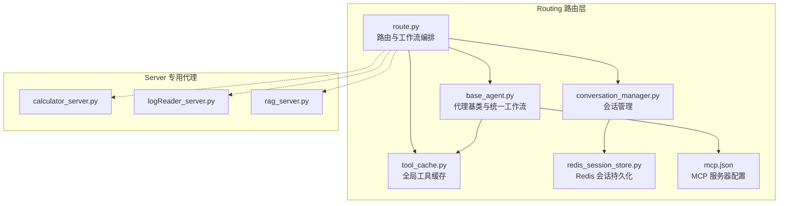
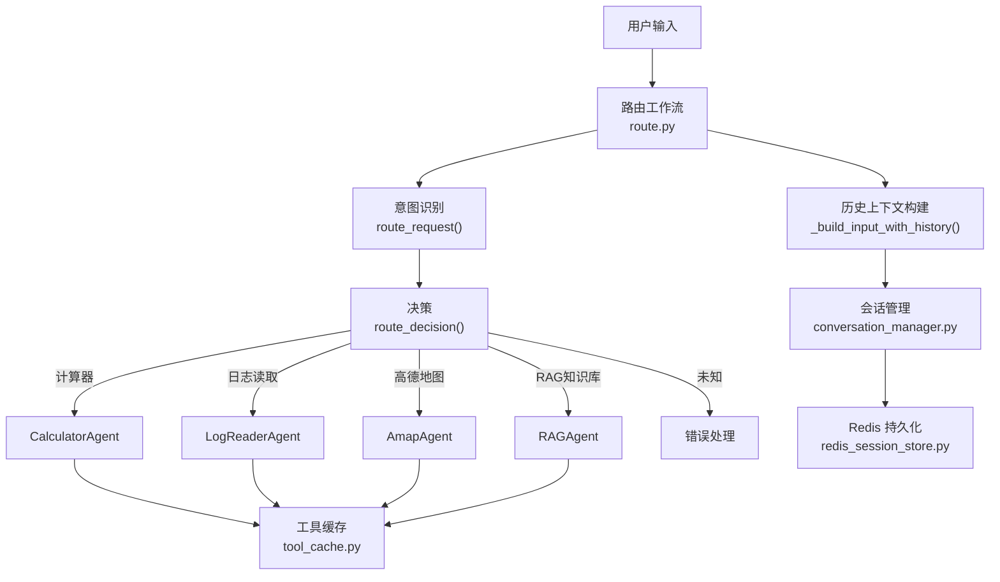
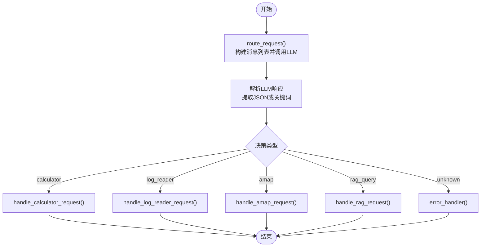
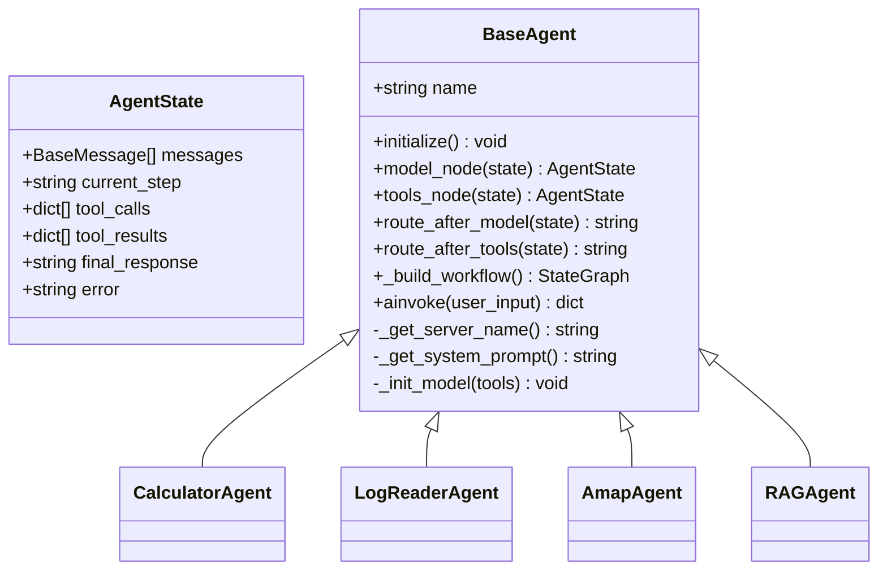
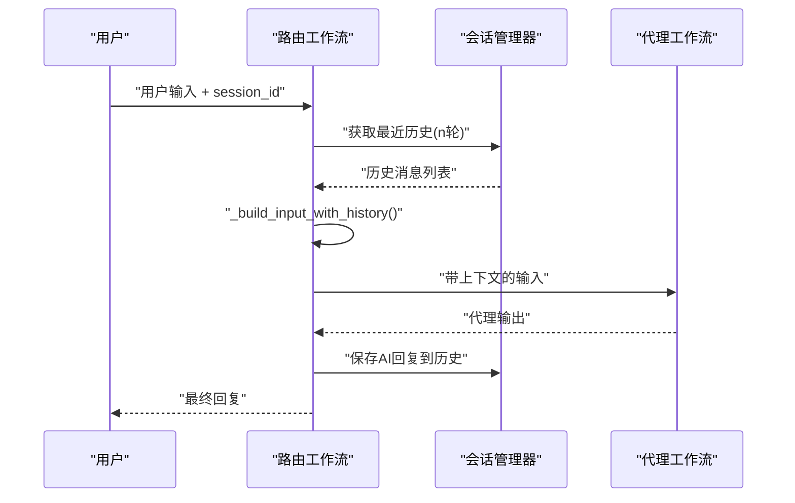
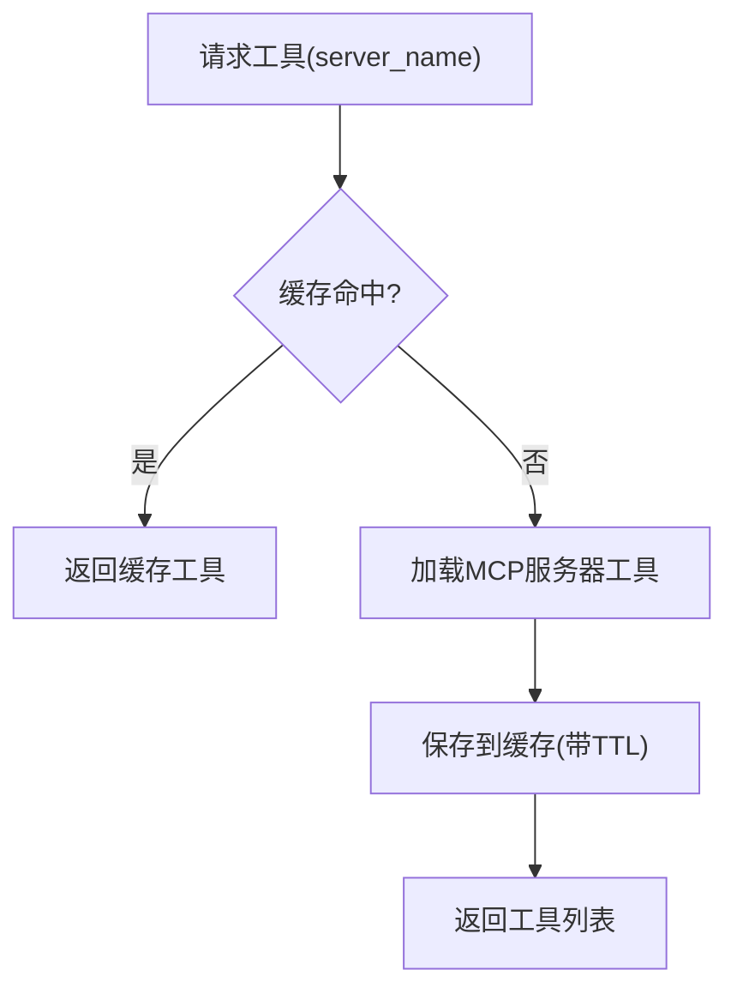
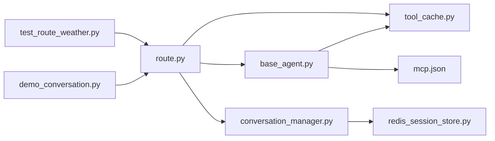

# 智能路由系统

<cite>
**本文档引用的文件**
- [route.py](file://Routing/route.py)
- [base_agent.py](file://Routing/base_agent.py)
- [conversation_manager.py](file://Routing/conversation_manager.py)
- [redis_session_store.py](file://Routing/redis_session_store.py)
- [tool_cache.py](file://Routing/tool_cache.py)
- [mcp.json](file://Routing/mcp.json)
- [router.md](file://Prompt提示词整理/router.md)
- [CACHE_AND_CONVERSATION.md](file://CACHE_AND_CONVERSATION.md)
- [README.md](file://README.md)
- [test_route_weather.py](file://test/test_route_weather.py)
- [demo_conversation.py](file://demo_conversation.py)
</cite>

## 目录
1. [简介](#简介)
2. [项目结构](#项目结构)
3. [核心组件](#核心组件)
4. [架构总览](#架构总览)
5. [详细组件分析](#详细组件分析)
6. [依赖关系分析](#依赖关系分析)
7. [性能考虑](#性能考虑)
8. [故障排查指南](#故障排查指南)
9. [结论](#结论)
10. [附录](#附录)

## 简介
本项目基于 LangGraph 实现了一个智能路由系统，负责将用户输入进行意图识别，并将其路由到相应的专用代理（计算器、日志读取、高德地图、RAG知识库）。系统采用工作流编排架构，支持会话管理与历史上下文传递，确保多轮对话的连贯性；同时引入全局工具缓存与会话持久化，显著提升性能与稳定性。

## 项目结构
- Routing 目录为核心业务模块，包含路由、代理基类、会话管理、工具缓存、MCP 配置等。
- Server 目录包含各专用代理的 MCP 服务器实现。
- test 目录包含路由与会话功能的测试脚本。
- 文档与配置文件位于根目录，提供使用说明、架构说明与环境配置。

**图表来源**
- [route.py:259-291](file://Routing/route.py#L259-L291)
- [base_agent.py:238-256](file://Routing/base_agent.py#L238-L256)
- [tool_cache.py:85-116](file://Routing/tool_cache.py#L85-L116)
- [conversation_manager.py:122-146](file://Routing/conversation_manager.py#L122-L146)
- [redis_session_store.py:36-88](file://Routing/redis_session_store.py#L36-L88)
- [mcp.json:1-29](file://Routing/mcp.json#L1-L29)

**章节来源**
- [README.md:1-125](file://README.md#L1-L125)
- [CACHE_AND_CONVERSATION.md:1-335](file://CACHE_AND_CONVERSATION.md#L1-L335)

## 核心组件
- 路由工作流与状态管理：通过 StateGraph 定义状态与节点，实现意图识别与条件路由。
- 代理基类与统一工作流：BaseAgent 抽象出模型节点、工具节点与路由逻辑，统一各专用代理的行为。
- 会话管理与历史上下文：ConversationManager 管理多轮对话历史，支持内存与 Redis 持久化。
- 全局工具缓存：GlobalToolCache 缓存 MCP 服务器连接与工具列表，避免重复加载。
- MCP 服务器配置：mcp.json 定义各代理的 MCP 服务器连接方式与参数。

**章节来源**
- [route.py:50-147](file://Routing/route.py#L50-L147)
- [base_agent.py:19-27](file://Routing/base_agent.py#L19-L27)
- [base_agent.py:238-256](file://Routing/base_agent.py#L238-L256)
- [conversation_manager.py:82-121](file://Routing/conversation_manager.py#L82-L121)
- [tool_cache.py:39-66](file://Routing/tool_cache.py#L39-L66)
- [mcp.json:1-29](file://Routing/mcp.json#L1-L29)

## 架构总览
系统采用“路由层 + 代理层 + 基础设施层”的三层架构：
- 路由层：负责意图识别与工作流编排，将用户输入路由到相应代理。
- 代理层：各专用代理基于 BaseAgent 统一实现，使用全局工具缓存与 LangGraph 工作流。
- 基础设施层：提供工具缓存与会话管理，支持 TTL 过期与 Redis 持久化。

**图表来源**
- [route.py:149-255](file://Routing/route.py#L149-L255)
- [route.py:111-146](file://Routing/route.py#L111-L146)
- [base_agent.py:238-256](file://Routing/base_agent.py#L238-L256)
- [tool_cache.py:85-116](file://Routing/tool_cache.py#L85-L116)
- [conversation_manager.py:122-146](file://Routing/conversation_manager.py#L122-L146)
- [redis_session_store.py:36-88](file://Routing/redis_session_store.py#L36-L88)

## 详细组件分析

### 路由工作流与意图识别
- 状态定义：包含 input、session_id、rag_backend、decision、output、history 等字段，支持会话与历史上下文。
- 节点函数：分别为计算器、日志读取、高德地图、RAG知识库与错误处理节点。
- 意图识别：通过结构化输出（Route 模型）与系统提示词，将用户输入分类为 calculator、log_reader、amap、rag_query。
- 条件路由：根据决策结果将流程导向对应节点或错误处理节点。

**图表来源**
- [route.py:149-255](file://Routing/route.py#L149-L255)
- [route.py:44-48](file://Routing/route.py#L44-L48)

**章节来源**
- [route.py:50-147](file://Routing/route.py#L50-L147)
- [route.py:149-255](file://Routing/route.py#L149-L255)
- [router.md:11-39](file://Prompt提示词整理/router.md#L11-L39)

### 代理基类与统一工作流
- AgentState：统一的消息、工具调用、工具结果、最终响应与错误状态。
- 模型节点：添加系统提示词并调用 LLM，支持错误处理。
- 工具节点：根据 AI 消息中的工具调用执行工具，构造 ToolMessage 并记录结果。
- 路由逻辑：模型节点根据是否存在工具调用决定下一步；工具节点执行完成后回到模型节点处理结果。

**图表来源**
- [base_agent.py:19-27](file://Routing/base_agent.py#L19-L27)
- [base_agent.py:29-66](file://Routing/base_agent.py#L29-L66)
- [base_agent.py:102-130](file://Routing/base_agent.py#L102-L130)
- [base_agent.py:131-217](file://Routing/base_agent.py#L131-L217)
- [base_agent.py:219-236](file://Routing/base_agent.py#L219-L236)
- [base_agent.py:238-256](file://Routing/base_agent.py#L238-L256)

**章节来源**
- [base_agent.py:19-318](file://Routing/base_agent.py#L19-L318)

### 会话管理与历史上下文
- 会话对象：维护消息列表、创建时间、最后活跃时间与过期检查。
- 会话管理器：支持创建、添加消息、获取历史、清空会话、删除会话与过期清理。
- Redis 持久化：提供会话元数据与消息列表的持久化存储，支持活跃会话索引与历史列表。
- 历史上下文构建：将最近 N 轮对话打包到当前输入中，传递给代理以保持上下文。

**图表来源**
- [route.py:111-146](file://Routing/route.py#L111-L146)
- [conversation_manager.py:166-184](file://Routing/conversation_manager.py#L166-L184)

**章节来源**
- [conversation_manager.py:35-80](file://Routing/conversation_manager.py#L35-L80)
- [conversation_manager.py:82-275](file://Routing/conversation_manager.py#L82-L275)
- [redis_session_store.py:14-228](file://Routing/redis_session_store.py#L14-L228)

### 全局工具缓存
- 缓存条目：包含工具列表与时间戳，支持 TTL 过期检查。
- 缓存管理器：单例模式，支持 stdio 与 streamable-http 两种传输协议，自动管理 MCP 会话生命周期。
- 工具加载：根据 mcp.json 配置加载工具，支持环境变量替换与路径转换。
- 统计信息：提供缓存服务器数量、缓存数量与活跃会话数。

**图表来源**
- [tool_cache.py:85-116](file://Routing/tool_cache.py#L85-L116)
- [tool_cache.py:118-243](file://Routing/tool_cache.py#L118-L243)
- [mcp.json:1-29](file://Routing/mcp.json#L1-L29)

**章节来源**
- [tool_cache.py:27-302](file://Routing/tool_cache.py#L27-L302)
- [mcp.json:1-29](file://Routing/mcp.json#L1-L29)

### MCP 服务器配置与代理工厂
- mcp.json：定义 amap-maps-streamableHTTP、calculator、log-reader、rag-knowledge 四个服务器及其传输方式。
- 代理工厂：提供 create_calculator_agent、create_log_reader_agent、create_amap_agent、create_rag_agent 工厂方法，内部通过 BaseAgent 初始化并编译工作流。

**章节来源**
- [mcp.json:1-29](file://Routing/mcp.json#L1-L29)
- [base_agent.py:467-497](file://Routing/base_agent.py#L467-L497)

## 依赖关系分析
- 路由层依赖代理基类与会话管理器，通过工具缓存获取工具列表。
- 代理基类依赖全局工具缓存与 MCP 配置，构建统一工作流。
- 会话管理器依赖 Redis 存储以实现持久化。
- 测试脚本验证路由与会话功能，演示多轮对话与缓存统计。

**图表来源**
- [route.py:16-24](file://Routing/route.py#L16-L24)
- [base_agent.py:50-60](file://Routing/base_agent.py#L50-L60)
- [conversation_manager.py:113-118](file://Routing/conversation_manager.py#L113-L118)
- [redis_session_store.py:14-35](file://Routing/redis_session_store.py#L14-L35)
- [test_route_weather.py:20](file://test/test_route_weather.py#L20)
- [demo_conversation.py:16](file://demo_conversation.py#L16)

**章节来源**
- [route.py:16-28](file://Routing/route.py#L16-L28)
- [base_agent.py:50-60](file://Routing/base_agent.py#L50-L60)
- [conversation_manager.py:113-118](file://Routing/conversation_manager.py#L113-L118)
- [redis_session_store.py:14-35](file://Routing/redis_session_store.py#L14-L35)
- [test_route_weather.py:20](file://test/test_route_weather.py#L20)
- [demo_conversation.py:16](file://demo_conversation.py#L16)

## 性能考虑
- 工具缓存：通过 TTL 过期策略避免重复加载 MCP 服务器，显著降低延迟（二次调用延迟远小于首次）。
- 会话历史限制：限制最大消息数与会话超时，防止内存占用持续增长。
- 异步执行：路由与代理均采用异步调用，提升并发处理能力。
- 连接池管理：全局工具缓存统一管理 MCP 会话生命周期，减少连接开销。

**章节来源**
- [CACHE_AND_CONVERSATION.md:229-244](file://CACHE_AND_CONVERSATION.md#L229-L244)
- [tool_cache.py:301](file://Routing/tool_cache.py#L301)
- [conversation_manager.py:38-66](file://Routing/conversation_manager.py#L38-L66)

## 故障排查指南
- 工具加载失败：检查 mcp.json 中服务器配置与路径，确认 Python 环境与依赖安装正确。
- 会话历史未保持：确认传递了正确的 session_id，检查历史消息数量与打包逻辑。
- 内存占用过高：调低会话历史上限与会话超时时间，定期清理过期会话。
- 资源未释放：应用退出时调用清理函数，确保工具缓存与会话持久化连接被正确关闭。

**章节来源**
- [CACHE_AND_CONVERSATION.md:296-324](file://CACHE_AND_CONVERSATION.md#L296-L324)
- [route.py:434-456](file://Routing/route.py#L434-L456)

## 结论
本智能路由系统通过 LangGraph 实现了意图识别与代理调度，结合全局工具缓存与会话管理，提供了高性能、可扩展的多轮对话能力。代理基类统一了工作流结构，MCP 配置简化了工具接入，Redis 持久化增强了会话可靠性。系统架构清晰、模块职责明确，适合进一步扩展更多代理与功能。

## 附录

### 使用示例与测试
- 天气查询测试：演示从路由到代理的完整流程，支持多轮追问。
- 循环对话演示：展示工具缓存与上下文保持的效果。

**章节来源**
- [test_route_weather.py:14-56](file://test/test_route_weather.py#L14-L56)
- [demo_conversation.py:19-102](file://demo_conversation.py#L19-L102)