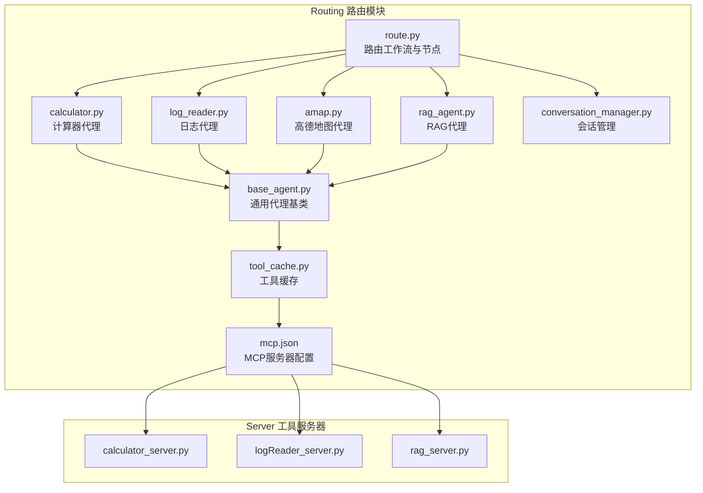
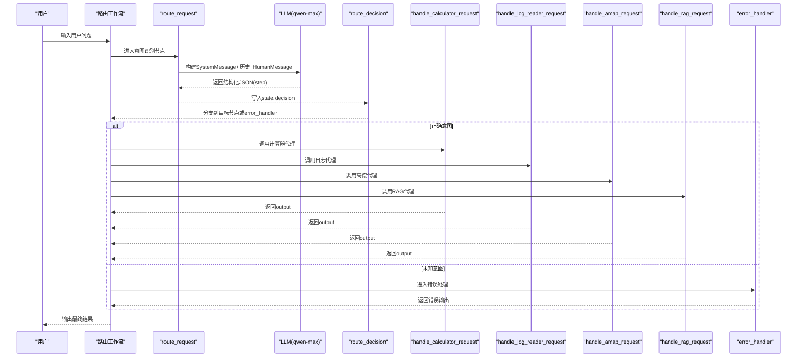
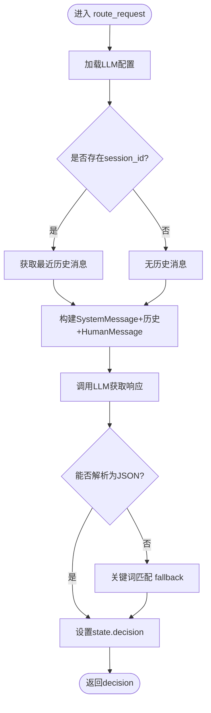
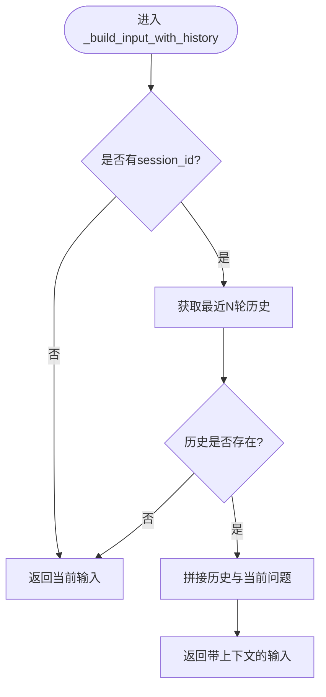
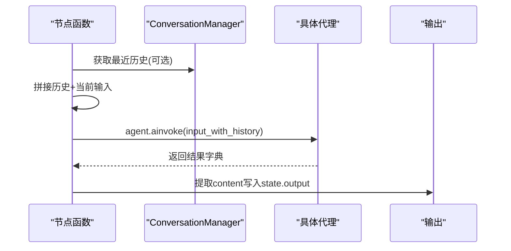
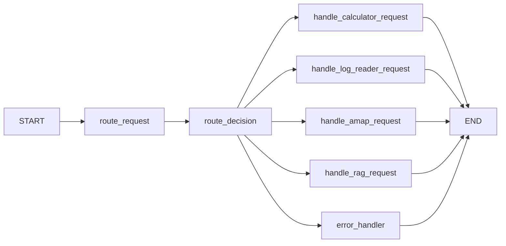
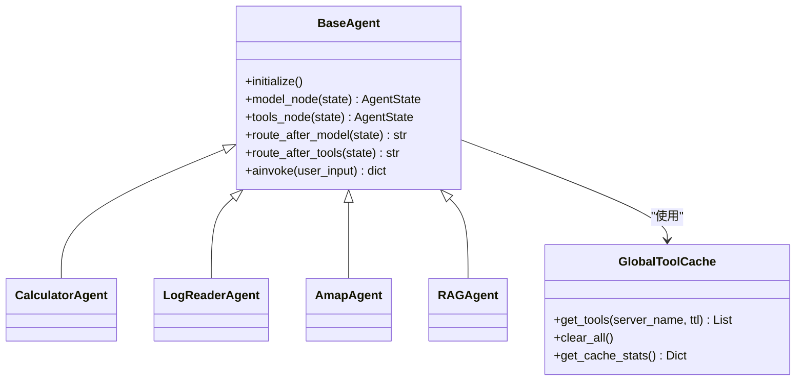
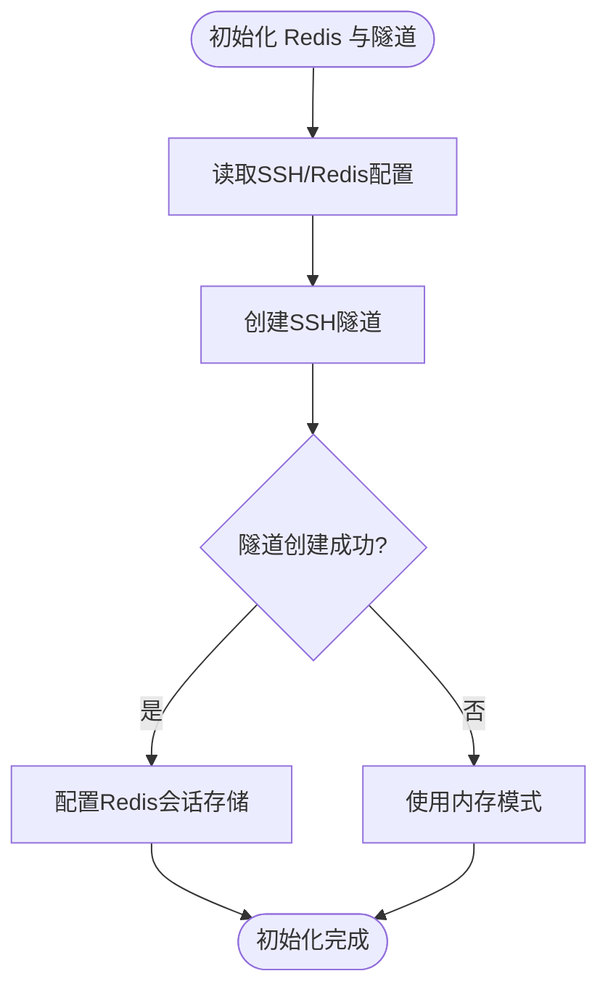
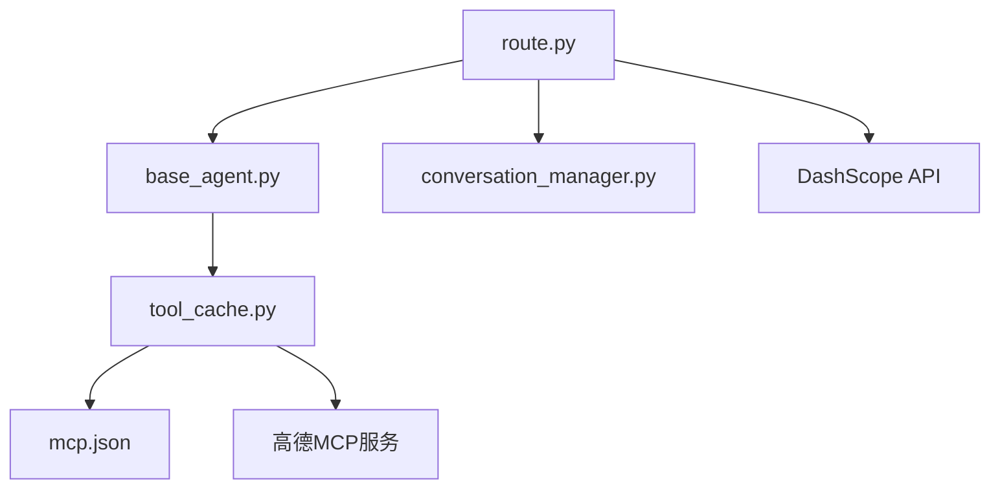

# 路由算法实现

<cite>
**本文档引用的文件**
- [route.py](file://Routing/route.py)
- [base_agent.py](file://Routing/base_agent.py)
- [calculator.py](file://Routing/calculator.py)
- [log_reader.py](file://Routing/log_reader.py)
- [amap.py](file://Routing/amap.py)
- [rag_agent.py](file://Routing/rag_agent.py)
- [conversation_manager.py](file://Routing/conversation_manager.py)
- [tool_cache.py](file://Routing/tool_cache.py)
- [mcp.json](file://Routing/mcp.json)
- [router.md](file://Prompt提示词整理/router.md)
- [README.md](file://README.md)
- [test_route_weather.py](file://test/test_route_weather.py)
- [test_automated.py](file://test/test_automated.py)
</cite>

## 目录
1. [简介](#简介)
2. [项目结构](#项目结构)
3. [核心组件](#核心组件)
4. [架构总览](#架构总览)
5. [详细组件分析](#详细组件分析)
6. [依赖分析](#依赖分析)
7. [性能考虑](#性能考虑)
8. [故障排查指南](#故障排查指南)
9. [结论](#结论)
10. [附录](#附录)

## 简介
本文件面向“基于LangGraph的路由算法实现”，系统性阐述意图识别与路由决策机制，重点覆盖：
- 意图识别算法的实现原理与SystemMessage提示词设计
- Route模型定义与状态管理机制
- 路由节点函数的实现细节（handle_calculator_request、handle_log_reader_request、handle_amap_request、handle_rag_request）
- route_request函数如何使用LLM进行意图分类，包括消息构建策略与JSON解析机制
- 如何扩展新的路由节点（状态定义、节点函数实现、条件边配置）
- 错误处理机制与异常情况处理策略

## 项目结构
该项目采用模块化设计，围绕Routing目录下的路由与代理模块组织，配合Server侧的MCP工具服务器，形成“意图识别 + 代理路由 + 工具调用”的完整链路。

**图表来源**
- [route.py:260-291](file://Routing/route.py#L260-L291)
- [base_agent.py:238-256](file://Routing/base_agent.py#L238-L256)
- [mcp.json:1-29](file://Routing/mcp.json#L1-L29)

**章节来源**
- [README.md:1-125](file://README.md#L1-L125)
- [route.py:258-291](file://Routing/route.py#L258-L291)

## 核心组件
- 路由工作流与状态
  - State类型定义：包含input、session_id、rag_backend、decision、output、history等字段，支撑会话与历史上下文。
  - Route模型：使用Pydantic的Literal类型限定step取值集合，作为LLM结构化输出的约束。
- 节点函数
  - handle_calculator_request、handle_log_reader_request、handle_amap_request、handle_rag_request：异步节点，负责调用对应代理并返回output。
  - route_request：基于LLM的意图识别节点，构建SystemMessage与HumanMessage，解析JSON并写入decision。
  - error_handler：兜底节点，处理未知意图。
- 条件路由
  - route_decision：根据state.decision返回目标节点或error_handler。
- 会话与历史
  - ConversationManager：管理多轮对话历史，支持Redis持久化与内存回退。
  - _build_input_with_history：将最近N轮对话拼接到当前输入，增强上下文理解。
- 工具与代理
  - BaseAgent：统一模型初始化、工具绑定、消息处理与错误处理。
  - GlobalToolCache：统一管理MCP服务器连接与工具缓存，避免重复加载。

**章节来源**
- [route.py:44-58](file://Routing/route.py#L44-L58)
- [route.py:61-109](file://Routing/route.py#L61-L109)
- [route.py:149-233](file://Routing/route.py#L149-L233)
- [route.py:237-255](file://Routing/route.py#L237-L255)
- [route.py:111-147](file://Routing/route.py#L111-L147)
- [base_agent.py:19-27](file://Routing/base_agent.py#L19-L27)
- [base_agent.py:29-496](file://Routing/base_agent.py#L29-L496)
- [tool_cache.py:39-301](file://Routing/tool_cache.py#L39-L301)
- [conversation_manager.py:82-274](file://Routing/conversation_manager.py#L82-L274)

## 架构总览
路由系统采用LangGraph的StateGraph构建，整体流程如下：

**图表来源**
- [route.py:258-291](file://Routing/route.py#L258-L291)
- [route.py:149-233](file://Routing/route.py#L149-L233)
- [route.py:243-255](file://Routing/route.py#L243-L255)

## 详细组件分析

### 意图识别与路由决策（route_request）
- LLM配置：从环境变量读取DashScope的API Key、基础URL、模型名与温度。
- SystemMessage提示词设计要点：
  - 明确要求返回JSON格式，且step仅允许特定枚举值。
  - 强调结合对话历史判断真实意图，避免断章取义。
  - 禁止返回其他内容，仅返回指定JSON。
- 消息构建策略：
  - 若存在session_id，则从ConversationManager获取最近历史消息。
  - 将SystemMessage、历史消息（若有）、当前HumanMessage按序拼接。
- JSON解析机制：
  - 首先尝试提取大括号包裹的JSON字符串并解析。
  - 若失败，回退到关键词匹配（calculator、log_reader、amap、rag_query）。
  - 若仍失败，标记为unknown并交由错误处理节点。

**图表来源**
- [route.py:149-233](file://Routing/route.py#L149-L233)

**章节来源**
- [route.py:149-233](file://Routing/route.py#L149-L233)

### 状态管理与历史上下文（State与_build_input_with_history）
- State字段：
  - input：当前用户输入
  - session_id：会话标识，驱动历史获取
  - rag_backend：RAG后端选择（0=ChromaDB, 1=Milvus）
  - decision：LLM输出的意图分类
  - output：最终输出
  - history：LangChain消息列表，用于工作流内部传递
- 历史拼接策略：
  - 若无session_id，直接返回当前输入。
  - 从ConversationManager获取最近N轮消息，限制每条长度，拼接成“对话历史”和“当前问题”。

**图表来源**
- [route.py:111-147](file://Routing/route.py#L111-L147)
- [conversation_manager.py:200-214](file://Routing/conversation_manager.py#L200-L214)

**章节来源**
- [route.py:51-58](file://Routing/route.py#L51-L58)
- [route.py:111-147](file://Routing/route.py#L111-L147)
- [conversation_manager.py:18-33](file://Routing/conversation_manager.py#L18-L33)

### 路由节点函数实现
- handle_calculator_request
  - 调用create_calculator_agent，传入带历史的输入，提取响应内容写入output。
- handle_log_reader_request
  - 调用create_log_reader_agent，传入带历史的输入，提取响应内容写入output。
- handle_amap_request
  - 调用create_amap_agent，传入带历史的输入，提取响应内容写入output。
- handle_rag_request
  - 根据state.rag_backend选择后端，调用create_rag_agent，传入带历史的输入，提取响应内容写入output。

**图表来源**
- [route.py:61-109](file://Routing/route.py#L61-L109)
- [route.py:111-147](file://Routing/route.py#L111-L147)

**章节来源**
- [route.py:61-109](file://Routing/route.py#L61-L109)

### 条件边与工作流编译（route_decision与build_router_workflow）
- route_decision：依据state.decision返回对应节点或error_handler。
- build_router_workflow：
  - 添加节点：四个处理节点、route_request、error_handler。
  - 添加边：START→route_request；route_request经route_decision分流至各处理节点或error_handler；各处理节点均→END；error_handler→END。
  - 编译并生成全局router_workflow实例。

**图表来源**
- [route.py:258-291](file://Routing/route.py#L258-L291)
- [route.py:243-255](file://Routing/route.py#L243-L255)

**章节来源**
- [route.py:243-255](file://Routing/route.py#L243-L255)
- [route.py:258-291](file://Routing/route.py#L258-L291)

### 代理基类与工具缓存（BaseAgent、GlobalToolCache）
- BaseAgent：
  - 统一初始化LLM与工具绑定，定义model/tools节点与路由逻辑。
  - 提供通用错误处理与状态更新。
- GlobalToolCache：
  - 通过mcp.json加载服务器配置，支持stdio与streamable-http两种传输。
  - 统一缓存工具列表与会话，避免重复加载；提供TTL过期策略与清理方法。
- 代理工厂函数：
  - calculator、log_reader、amap、rag_agent模块导出工厂函数，供路由节点调用。

**图表来源**
- [base_agent.py:29-496](file://Routing/base_agent.py#L29-L496)
- [tool_cache.py:39-301](file://Routing/tool_cache.py#L39-L301)
- [calculator.py:6-10](file://Routing/calculator.py#L6-L10)
- [log_reader.py:6-10](file://Routing/log_reader.py#L6-L10)
- [amap.py:6-10](file://Routing/amap.py#L6-L10)
- [rag_agent.py:6-10](file://Routing/rag_agent.py#L6-L10)

**章节来源**
- [base_agent.py:29-496](file://Routing/base_agent.py#L29-L496)
- [tool_cache.py:39-301](file://Routing/tool_cache.py#L39-L301)
- [mcp.json:1-29](file://Routing/mcp.json#L1-L29)

### 会话管理与Redis持久化
- ConversationManager：
  - 单例模式，支持内存与Redis双层存储。
  - 提供创建会话、添加消息、获取历史、清理过期会话等能力。
- 初始化流程：
  - 读取SSH与Redis配置，尝试建立隧道与Redis连接。
  - 将RedisSessionStore注入ConversationManager，启用持久化。

**图表来源**
- [route.py:298-347](file://Routing/route.py#L298-L347)
- [conversation_manager.py:100-121](file://Routing/conversation_manager.py#L100-L121)

**章节来源**
- [route.py:298-347](file://Routing/route.py#L298-L347)
- [conversation_manager.py:82-274](file://Routing/conversation_manager.py#L82-L274)

### 扩展新路由节点的完整示例（步骤说明）
- 定义状态字段（如需新增）
  - 在State中增加必要字段（例如新的后端参数或标志位）。
- 实现节点函数
  - 参考现有节点函数签名与返回格式，调用对应代理或工具。
- 注册节点与条件边
  - 在build_router_workflow中添加新节点与边。
  - 在route_decision中增加分支逻辑，返回新节点名称或错误处理。
- 提示词与意图模型
  - 在Route模型中扩展step允许值（若需要）。
  - 在SystemMessage中补充新意图的分类规则与约束。
- 测试与验证
  - 使用chat_with_session进行端到端测试，或参考测试脚本。

**章节来源**
- [router.md:17-39](file://Prompt提示词整理/router.md#L17-L39)
- [router.md:55-70](file://Prompt提示词整理/router.md#L55-L70)
- [route.py:258-291](file://Routing/route.py#L258-L291)
- [route.py:243-255](file://Routing/route.py#L243-L255)

## 依赖分析
- 组件耦合
  - route.py依赖base_agent.py提供的代理工厂与工具缓存。
  - base_agent.py依赖tool_cache.py进行工具加载与缓存。
  - mcp.json提供MCP服务器配置，影响工具加载与网络传输。
  - conversation_manager.py被route.py用于历史上下文拼接。
- 外部依赖
  - DashScope API用于LLM推理。
  - 高德地图MCP服务通过streamable-http访问。
  - Redis用于会话持久化（可选）。

**图表来源**
- [route.py:14-25](file://Routing/route.py#L14-L25)
- [base_agent.py:50-88](file://Routing/base_agent.py#L50-L88)
- [tool_cache.py:18-25](file://Routing/tool_cache.py#L18-L25)
- [mcp.json:1-29](file://Routing/mcp.json#L1-L29)

**章节来源**
- [route.py:14-25](file://Routing/route.py#L14-L25)
- [base_agent.py:50-88](file://Routing/base_agent.py#L50-L88)
- [tool_cache.py:18-25](file://Routing/tool_cache.py#L18-L25)

## 性能考虑
- 工具缓存与连接复用
  - GlobalToolCache通过TTL与会话复用减少重复连接与工具加载开销。
- 历史消息截断
  - _build_input_with_history限制历史轮数与单条长度，降低上下文成本。
- 并发与异步
  - 所有节点与代理均采用异步实现，提升吞吐。
- LLM调用优化
  - SystemMessage明确约束输出格式，减少LLM生成不确定性带来的额外往返。

## 故障排查指南
- LLM解析失败
  - 现象：route_request无法解析JSON，退回关键词匹配。
  - 排查：确认SystemMessage中JSON格式要求是否被遵守；检查LLM输出是否包含多余内容。
- 代理调用异常
  - 现象：节点返回错误或无响应。
  - 排查：查看代理初始化日志、工具加载状态与MCP服务器连通性。
- 会话历史缺失
  - 现象：历史上下文为空。
  - 排查：确认session_id是否传入；检查ConversationManager初始化与Redis连接状态。
- 缓存命中异常
  - 现象：工具缓存统计异常。
  - 排查：查看GlobalToolCache的get_tools调用与清理逻辑。

**章节来源**
- [route.py:196-232](file://Routing/route.py#L196-L232)
- [base_agent.py:102-129](file://Routing/base_agent.py#L102-L129)
- [conversation_manager.py:142-144](file://Routing/conversation_manager.py#L142-L144)
- [tool_cache.py:85-117](file://Routing/tool_cache.py#L85-L117)

## 结论
本路由算法以LangGraph为核心，结合结构化输出与历史上下文，实现了稳定高效的意图识别与代理路由。通过统一的代理基类与工具缓存，系统具备良好的可扩展性与可维护性。建议在扩展新节点时严格遵循状态定义、消息构建与错误处理规范，确保一致性与可靠性。

## 附录
- 测试用例参考
  - 完整路由流程测试：[test_route_weather.py:14-55](file://test/test_route_weather.py#L14-L55)
  - 自动化测试：[test_automated.py:12-51](file://test/test_automated.py#L12-L51)

**章节来源**
- [test_route_weather.py:14-55](file://test/test_route_weather.py#L14-L55)
- [test_automated.py:12-51](file://test/test_automated.py#L12-L51)