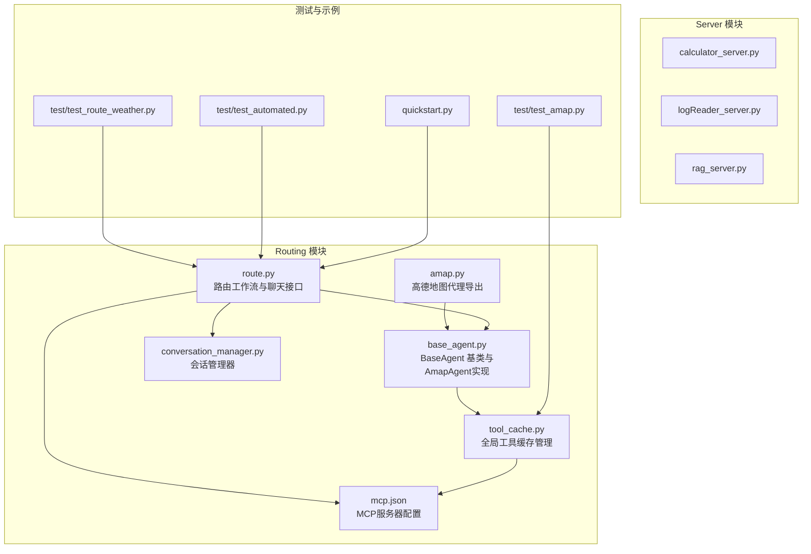
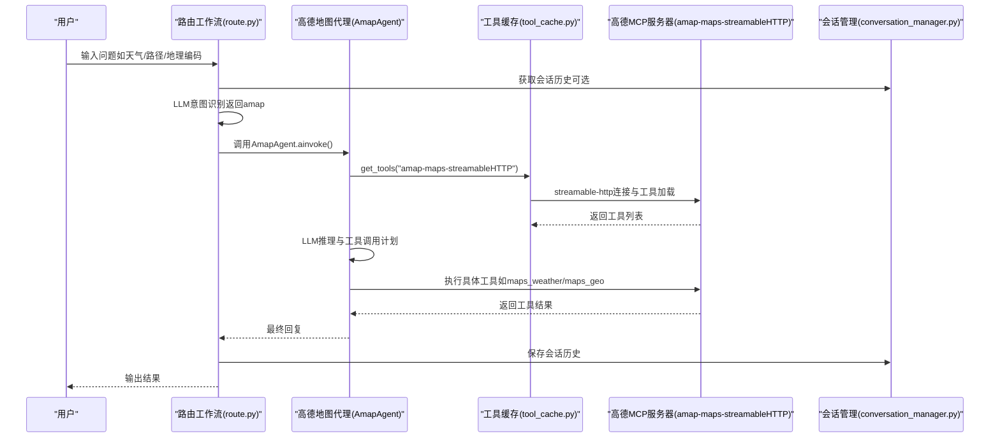
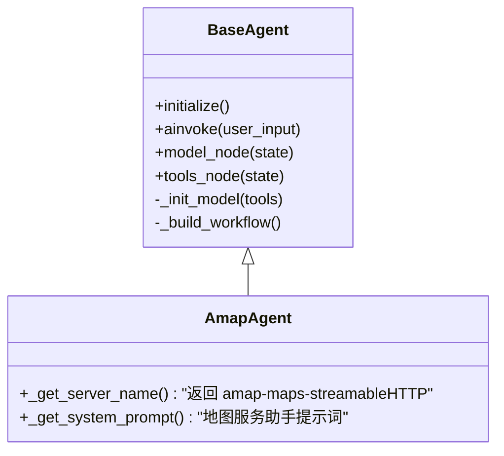
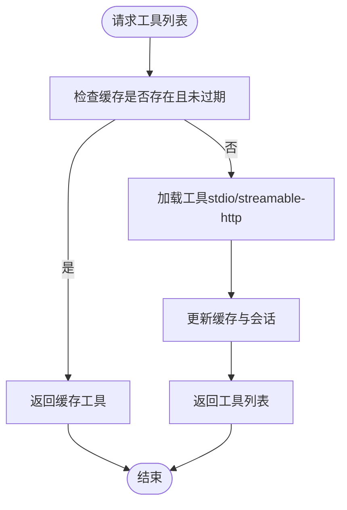
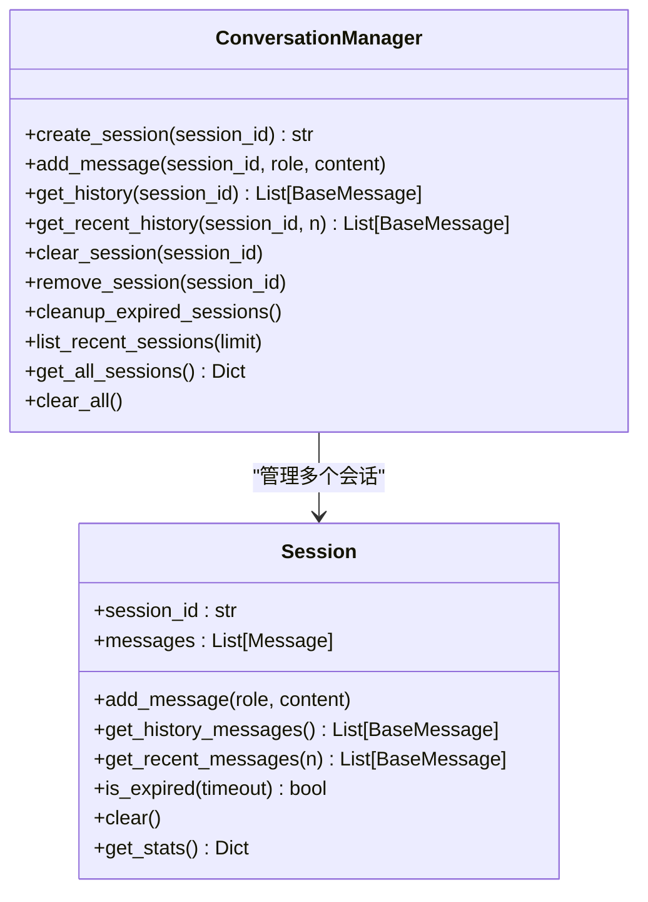
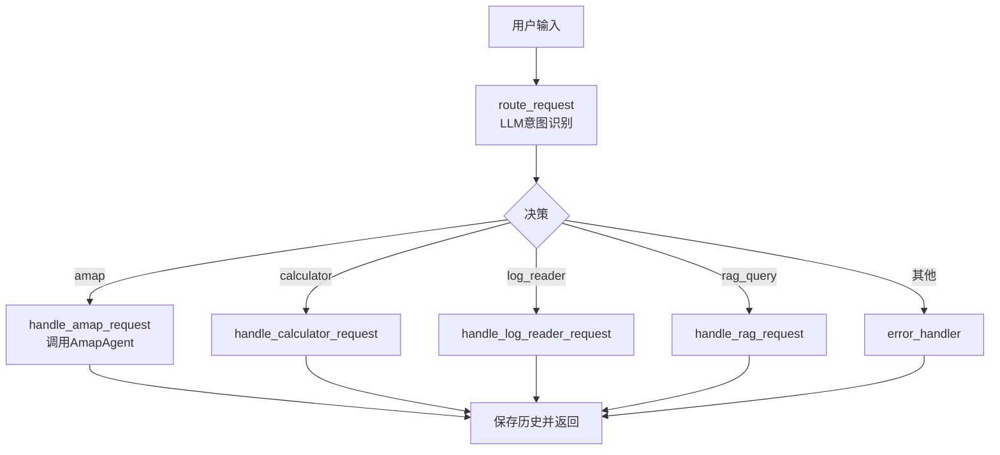
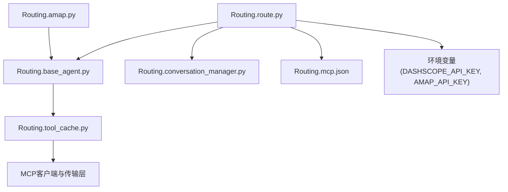

# 高德地图集成

<cite>
**本文档引用的文件**
- [README.md](file://README.md)
- [requirements.txt](file://requirements.txt)
- [Routing/amap.py](file://Routing/amap.py)
- [Routing/base_agent.py](file://Routing/base_agent.py)
- [Routing/tool_cache.py](file://Routing/tool_cache.py)
- [Routing/conversation_manager.py](file://Routing/conversation_manager.py)
- [Routing/route.py](file://Routing/route.py)
- [Routing/mcp.json](file://Routing/mcp.json)
- [test/test_amap.py](file://test/test_amap.py)
- [test/test_route_weather.py](file://test/test_route_weather.py)
- [test/test_automated.py](file://test/test_automated.py)
- [quickstart.py](file://quickstart.py)
</cite>

## 目录
1. [简介](#简介)
2. [项目结构](#项目结构)
3. [核心组件](#核心组件)
4. [架构总览](#架构总览)
5. [详细组件分析](#详细组件分析)
6. [依赖关系分析](#依赖关系分析)
7. [性能考虑](#性能考虑)
8. [故障排除指南](#故障排除指南)
9. [结论](#结论)
10. [附录](#附录)

## 简介
本文件面向希望集成高德开放平台API的开发者，系统性阐述基于MCP（Model Context Protocol）协议的高德地图集成方案。项目通过LangGraph与LangChain MCP适配器，将高德地图服务以工具形式动态加载并注入到智能代理工作流中，实现天气查询、地理编码、路径规划、POI搜索、IP定位等能力的无缝调用。

项目特性包括：
- 基于MCP协议的动态工具加载与缓存
- 高德地图服务（天气、地理编码、路径规划等）的工具化接入
- 多服务器支持（计算器、日志读取、高德地图、RAG知识库）
- 智能路由与多轮对话上下文管理
- 会话持久化与Redis集成

## 项目结构
项目采用模块化设计，围绕Routing模块组织高德地图代理、工具缓存、会话管理与路由工作流；Server目录提供MCP服务器实现；test目录包含功能与集成测试；README提供快速开始与功能概览。

**图表来源**
- [Routing/amap.py:1-11](file://Routing/amap.py#L1-L11)
- [Routing/base_agent.py:418-431](file://Routing/base_agent.py#L418-L431)
- [Routing/tool_cache.py:1-302](file://Routing/tool_cache.py#L1-L302)
- [Routing/conversation_manager.py:82-275](file://Routing/conversation_manager.py#L82-L275)
- [Routing/route.py:1-553](file://Routing/route.py#L1-L553)
- [Routing/mcp.json:1-29](file://Routing/mcp.json#L1-L29)
- [test/test_amap.py:1-68](file://test/test_amap.py#L1-L68)
- [test/test_route_weather.py:1-56](file://test/test_route_weather.py#L1-L56)
- [test/test_automated.py:1-52](file://test/test_automated.py#L1-L52)
- [quickstart.py:1-68](file://quickstart.py#L1-L68)

**章节来源**
- [README.md:1-125](file://README.md#L1-L125)
- [Routing/mcp.json:1-29](file://Routing/mcp.json#L1-L29)

## 核心组件
- 高德地图代理（AmapAgent）：继承BaseAgent，负责加载amap-maps-streamableHTTP服务器工具，提供地图相关能力。
- 工具缓存（GlobalToolCache）：统一管理MCP服务器连接与工具列表，支持TTL过期与会话生命周期管理。
- 会话管理（ConversationManager）：支持多轮对话历史存储、Redis持久化与过期清理。
- 路由工作流（Router Workflow）：基于LangGraph的状态机，根据用户输入路由到相应代理（含高德地图）。
- MCP配置（mcp.json）：声明amap-maps-streamableHTTP服务器URL与传输方式（streamable-http）。

**章节来源**
- [Routing/base_agent.py:418-431](file://Routing/base_agent.py#L418-L431)
- [Routing/tool_cache.py:39-117](file://Routing/tool_cache.py#L39-L117)
- [Routing/conversation_manager.py:82-121](file://Routing/conversation_manager.py#L82-L121)
- [Routing/route.py:149-233](file://Routing/route.py#L149-L233)
- [Routing/mcp.json:3-6](file://Routing/mcp.json#L3-L6)

## 架构总览
下图展示了从用户输入到高德地图工具调用的端到端流程，包括路由决策、工具加载、LLM推理与工具执行。

**图表来源**
- [Routing/route.py:149-233](file://Routing/route.py#L149-L233)
- [Routing/base_agent.py:418-431](file://Routing/base_agent.py#L418-L431)
- [Routing/tool_cache.py:198-243](file://Routing/tool_cache.py#L198-L243)
- [Routing/conversation_manager.py:166-184](file://Routing/conversation_manager.py#L166-L184)

## 详细组件分析

### 高德地图代理（AmapAgent）
- 服务器标识：amap-maps-streamableHTTP
- 系统提示词：专注于地图服务问答，提供友好且准确的信息
- 工作流：通过BaseAgent的模型节点与工具节点协作，按需调用高德工具

**图表来源**
- [Routing/base_agent.py:29-318](file://Routing/base_agent.py#L29-L318)
- [Routing/base_agent.py:418-431](file://Routing/base_agent.py#L418-L431)

**章节来源**
- [Routing/base_agent.py:418-431](file://Routing/base_agent.py#L418-L431)

### 工具缓存（GlobalToolCache）
- 缓存策略：按服务器名缓存工具列表，默认TTL 300秒
- 传输协议：支持stdio与streamable-http两种
- HTTP加载：通过streamable_http_client建立连接，设置超时，加载工具并保持会话
- 清理机制：过期清理、异常静默处理、对话结束统一清理

**图表来源**
- [Routing/tool_cache.py:85-117](file://Routing/tool_cache.py#L85-L117)
- [Routing/tool_cache.py:198-243](file://Routing/tool_cache.py#L198-L243)

**章节来源**
- [Routing/tool_cache.py:39-117](file://Routing/tool_cache.py#L39-L117)
- [Routing/tool_cache.py:198-243](file://Routing/tool_cache.py#L198-L243)

### 会话管理（ConversationManager）
- 多轮对话：每个会话维护消息队列，限制最大历史长度
- 持久化：可选Redis存储，支持过期清理与内存回填
- 接口：创建、添加、获取历史、清空、删除、统计与清理

**图表来源**
- [Routing/conversation_manager.py:35-80](file://Routing/conversation_manager.py#L35-L80)
- [Routing/conversation_manager.py:82-275](file://Routing/conversation_manager.py#L82-L275)

**章节来源**
- [Routing/conversation_manager.py:82-275](file://Routing/conversation_manager.py#L82-L275)

### 路由工作流（Router Workflow）
- 意图识别：使用LLM根据历史与当前输入判断下一步（calculator/log_reader/amap/rag_query）
- 节点：route_request（意图识别）、handle_amap_request（调用AmapAgent）、error_handler（错误处理）
- 边条件：根据意图路由到对应节点或错误处理
- 会话集成：在构建输入时拼接历史上下文，支持多轮对话

**图表来源**
- [Routing/route.py:149-233](file://Routing/route.py#L149-L233)
- [Routing/route.py:242-256](file://Routing/route.py#L242-L256)
- [Routing/route.py:86-95](file://Routing/route.py#L86-L95)

**章节来源**
- [Routing/route.py:149-233](file://Routing/route.py#L149-L233)
- [Routing/route.py:86-95](file://Routing/route.py#L86-L95)

### MCP配置与API密钥
- 配置文件：mcp.json声明amap-maps-streamableHTTP服务器URL与传输方式
- API密钥：AMAP_API_KEY通过环境变量注入到URL中
- 依赖：requirements.txt包含fastmcp、mcp、langchain-mcp-adapters等

**章节来源**
- [Routing/mcp.json:3-6](file://Routing/mcp.json#L3-L6)
- [README.md:64-69](file://README.md#L64-L69)
- [requirements.txt:1-17](file://requirements.txt#L1-L17)

## 依赖关系分析
- Routing.amap依赖Routing.base_agent中的AmapAgent与工厂方法
- 路由工作流依赖各Agent工厂方法与工具缓存
- 工具缓存依赖MCP客户端与传输层（stdio/streamable-http）
- 会话管理可选依赖Redis存储

**图表来源**
- [Routing/amap.py:7-10](file://Routing/amap.py#L7-L10)
- [Routing/base_agent.py:481-485](file://Routing/base_agent.py#L481-L485)
- [Routing/route.py:18-23](file://Routing/route.py#L18-L23)
- [Routing/tool_cache.py:18-24](file://Routing/tool_cache.py#L18-L24)
- [Routing/mcp.json:3-6](file://Routing/mcp.json#L3-L6)

**章节来源**
- [Routing/amap.py:7-10](file://Routing/amap.py#L7-L10)
- [Routing/route.py:18-23](file://Routing/route.py#L18-L23)
- [Routing/tool_cache.py:18-24](file://Routing/tool_cache.py#L18-L24)

## 性能考虑
- 工具缓存：通过TTL减少重复连接与工具加载开销，建议合理设置缓存过期时间
- 传输协议：streamable-http具备连接复用与超时控制，适合高频调用场景
- 会话管理：限制历史消息数量与会话超时，避免内存膨胀
- 并发与清理：对话结束后统一清理缓存与会话，释放资源

[本节为通用性能建议，无需特定文件引用]

## 故障排除指南
- 环境变量未设置
  - 现象：AMAP_API_KEY未设置导致HTTP工具加载失败
  - 处理：在.env中配置AMAP_API_KEY，重启应用
- 连接超时
  - 现象：streamable-http连接超时（默认10秒）
  - 处理：检查网络与API密钥有效性，必要时增加超时或重试
- 工具调用失败
  - 现象：工具执行抛出异常，返回错误消息
  - 处理：查看工具返回内容与参数，确认高德API可用性
- 会话持久化失败
  - 现象：Redis初始化失败，自动降级为内存模式
  - 处理：检查Redis连接配置与网络，或禁用Redis持久化

**章节来源**
- [Routing/tool_cache.py:212-223](file://Routing/tool_cache.py#L212-L223)
- [Routing/tool_cache.py:240-242](file://Routing/tool_cache.py#L240-L242)
- [Routing/conversation_manager.py:112-118](file://Routing/conversation_manager.py#L112-L118)

## 结论
本项目通过MCP协议将高德地图服务工具化接入LangGraph工作流，实现了天气查询、地理编码、路径规划等能力的统一调度与多轮对话支持。借助工具缓存与会话管理，系统在性能与可维护性方面取得良好平衡。建议在生产环境中结合限流与监控策略，确保API调用的稳定性与成本可控。

[本节为总结性内容，无需特定文件引用]

## 附录

### 使用示例与最佳实践
- 环境准备与API密钥配置
  - 在.env中配置DASHSCOPE_API_KEY与AMAP_API_KEY
  - 安装依赖：pip install -r requirements.txt
- 基础调用流程
  - 通过chat_with_session发起对话，系统自动路由到AmapAgent
  - AmapAgent通过工具缓存加载amap-maps-streamableHTTP工具并执行
- 参数与响应处理
  - 工具参数由LLM根据用户输入生成，工具返回结果经提取后反馈给用户
  - 对于计算器工具，仅传递result字段数值，避免LLM被原始数据干扰
- 错误处理与重试
  - 工具调用失败时返回错误消息，可在上层进行重试或提示用户
- 性能优化建议
  - 合理设置工具缓存TTL与会话超时
  - 对高频工具调用启用连接复用与超时控制
  - 使用Redis持久化会话，提升多实例部署下的一致性

**章节来源**
- [README.md:64-78](file://README.md#L64-L78)
- [Routing/base_agent.py:168-194](file://Routing/base_agent.py#L168-L194)
- [Routing/route.py:351-414](file://Routing/route.py#L351-L414)

### 测试与验证
- 工具加载测试：验证amap-maps-streamableHTTP工具加载与描述
- 路由流程测试：验证天气查询的完整路由与多轮对话
- 自动化测试：模拟多组用户输入，验证系统稳定性

**章节来源**
- [test/test_amap.py:14-67](file://test/test_amap.py#L14-L67)
- [test/test_route_weather.py:14-55](file://test/test_route_weather.py#L14-L55)
- [test/test_automated.py:12-51](file://test/test_automated.py#L12-L51)