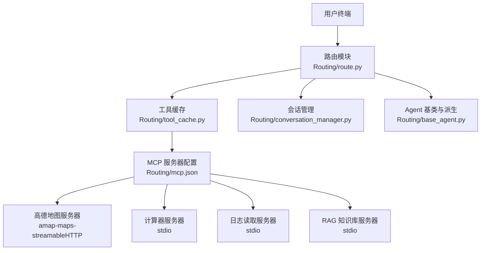
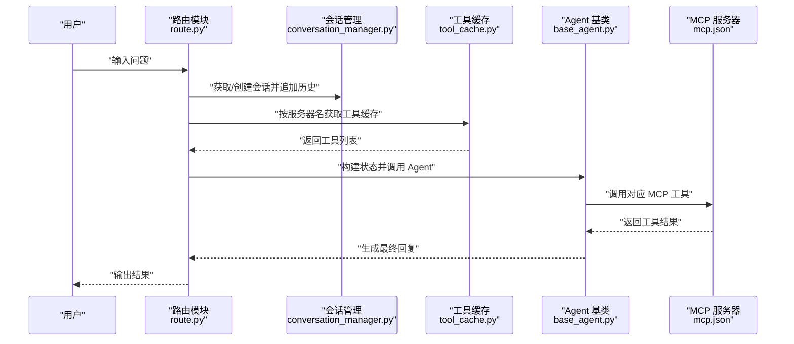
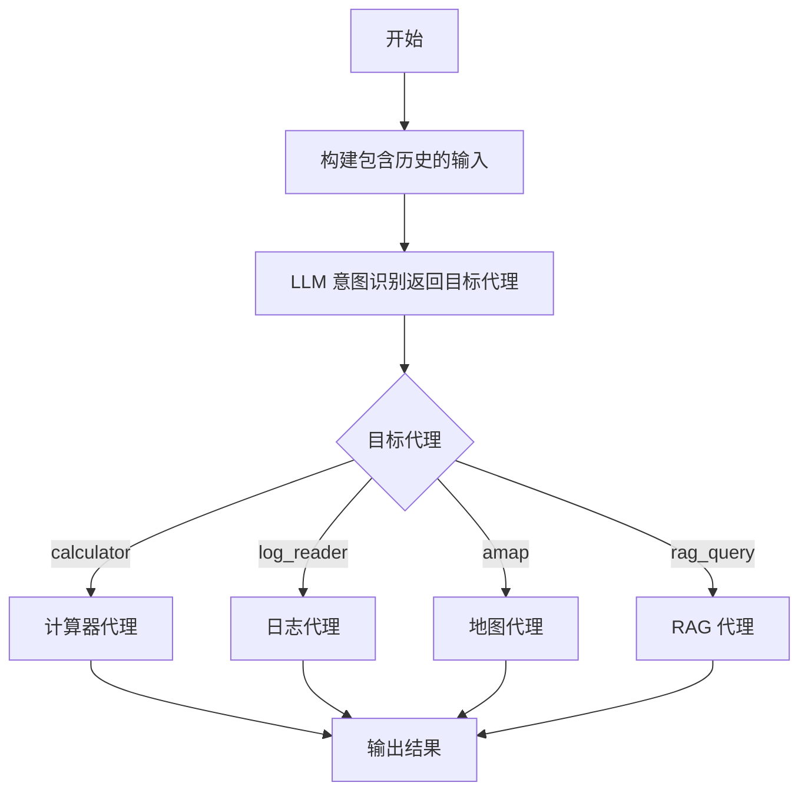
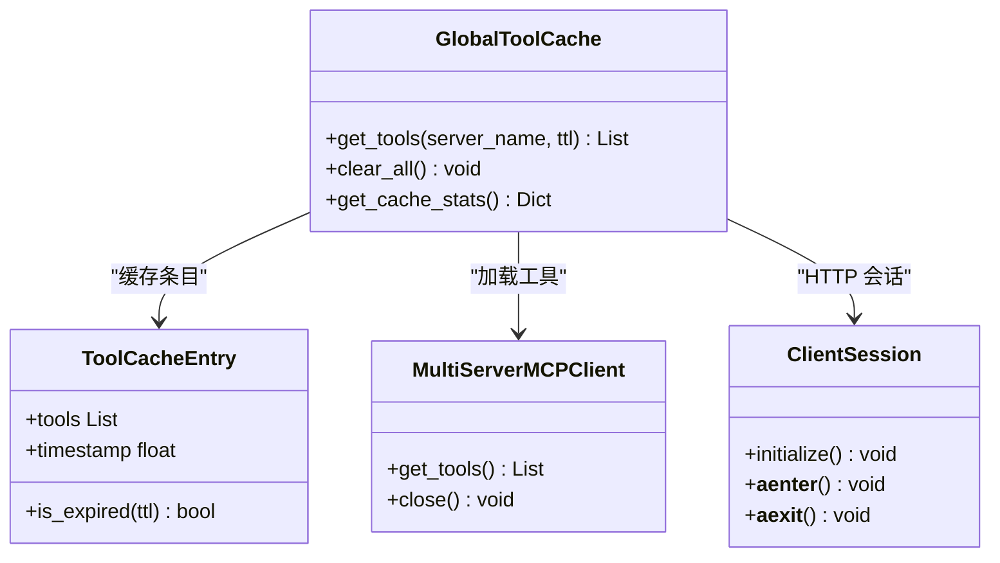
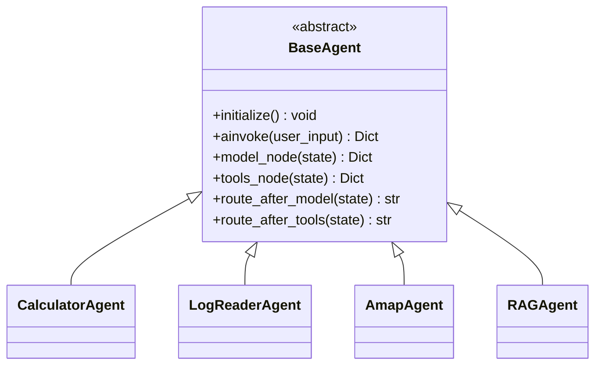
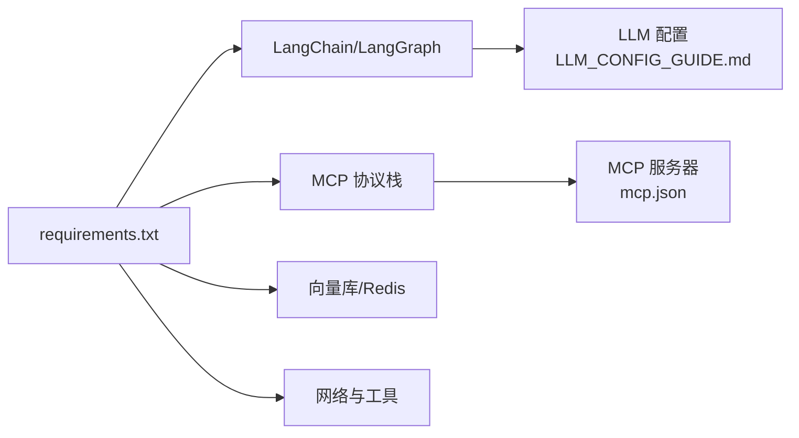

# 快速开始

<cite>
**本文引用的文件**
- [README.md](file://README.md)
- [requirements.txt](file://requirements.txt)
- [quickstart.py](file://quickstart.py)
- [demo_conversation.py](file://demo_conversation.py)
- [LLM_CONFIG_GUIDE.md](file://LLM_CONFIG_GUIDE.md)
- [Routing/mcp.json](file://Routing/mcp.json)
- [Routing/route.py](file://Routing/route.py)
- [Routing/base_agent.py](file://Routing/base_agent.py)
- [Routing/tool_cache.py](file://Routing/tool_cache.py)
- [Routing/conversation_manager.py](file://Routing/conversation_manager.py)
</cite>

## 目录
1. [简介](#简介)
2. [项目结构](#项目结构)
3. [核心组件](#核心组件)
4. [架构总览](#架构总览)
5. [详细组件分析](#详细组件分析)
6. [依赖关系分析](#依赖关系分析)
7. [性能考虑](#性能考虑)
8. [故障排查指南](#故障排查指南)
9. [结论](#结论)
10. [附录](#附录)

## 简介
本指南面向新用户，帮助你在约30分钟内完成 AiOps 项目的环境准备、依赖安装、API 密钥配置与首次运行。项目基于 Model Context Protocol (MCP) 构建，通过标准化协议连接 AI 模型与外部工具/数据源，支持计算器、日志读取、高德地图、RAG 知识库等能力，并提供 LangGraph 版本与交互式聊天两种运行方式。

## 项目结构
- 顶层入口与配置
  - README.md：项目说明、快速开始、技术栈与使用示例
  - requirements.txt：Python 依赖清单
  - quickstart.py：快速启动脚本，演示 Agent 创建与工具列表展示
  - demo_conversation.py：演示工具缓存与循环对话
  - LLM_CONFIG_GUIDE.md：LLM 模型配置指南（含 DashScope/OpenAI/本地等）
  - mcp.json：MCP 服务器配置（高德地图、计算器、日志读取、RAG）
- 路由与代理
  - Routing/route.py：LangGraph 路由工作流、会话管理、历史上下文构建
  - Routing/base_agent.py：Agent 基类与具体计算器/日志/地图/RAG Agent
  - Routing/tool_cache.py：全局工具缓存（避免重复加载 MCP 工具）
  - Routing/conversation_manager.py：会话管理（内存/Redis 持久化）
- 服务器端组件（示例）
  - Server/calculator_server.py、logReader_server.py、rag_server.py：本地 MCP 服务器示例

图表来源
- [Routing/route.py:1-553](file://Routing/route.py#L1-L553)
- [Routing/tool_cache.py:1-302](file://Routing/tool_cache.py#L1-L302)
- [Routing/mcp.json:1-29](file://Routing/mcp.json#L1-L29)
- [Routing/conversation_manager.py:1-275](file://Routing/conversation_manager.py#L1-L275)
- [Routing/base_agent.py:1-497](file://Routing/base_agent.py#L1-L497)

章节来源
- [README.md:1-125](file://README.md#L1-L125)
- [Routing/mcp.json:1-29](file://Routing/mcp.json#L1-L29)

## 核心组件
- 环境与依赖
  - Python 版本要求与依赖安装参见“环境准备”与“依赖安装”
  - LLM 配置与模型切换参见“LLM 模型配置指南”
- 路由与会话
  - 路由模块负责意图识别与节点调度，支持多轮对话与历史上下文
  - 会话管理器支持内存与 Redis 持久化，自动清理过期会话
- 工具缓存
  - 全局缓存 MCP 工具，避免重复加载；支持 stdio 与 streamable-http 两种传输协议
- Agent 基类
  - 统一模型初始化、工具绑定、节点工作流构建与错误处理

章节来源
- [quickstart.py:1-68](file://quickstart.py#L1-L68)
- [demo_conversation.py:1-102](file://demo_conversation.py#L1-L102)
- [Routing/route.py:1-553](file://Routing/route.py#L1-L553)
- [Routing/conversation_manager.py:1-275](file://Routing/conversation_manager.py#L1-L275)
- [Routing/tool_cache.py:1-302](file://Routing/tool_cache.py#L1-L302)
- [Routing/base_agent.py:1-497](file://Routing/base_agent.py#L1-L497)

## 架构总览
下图展示了从用户输入到工具调用与结果返回的完整流程，包括 LangGraph 路由、会话上下文注入、工具缓存与 MCP 服务器交互。

图表来源
- [Routing/route.py:111-146](file://Routing/route.py#L111-L146)
- [Routing/conversation_manager.py:166-184](file://Routing/conversation_manager.py#L166-L184)
- [Routing/tool_cache.py:85-116](file://Routing/tool_cache.py#L85-L116)
- [Routing/base_agent.py:102-130](file://Routing/base_agent.py#L102-L130)
- [Routing/mcp.json:1-29](file://Routing/mcp.json#L1-L29)

## 详细组件分析

### 环境准备与安装
- Python 版本要求
  - Python >= 3.9
- 创建并激活虚拟环境
  - Windows: 使用 venv 并激活脚本
  - Linux/Mac: 使用 venv 并激活脚本
- 安装依赖
  - 通过 requirements.txt 安装所需包
- 配置环境变量
  - 在项目根目录创建 .env 文件，配置 DashScope API Key 与 LLM 基础 URL、模型与温度
  - 若使用高德地图，还需配置 AMAP_API_KEY
- 运行示例
  - LangGraph 版本：运行路由模块主程序，支持多轮对话与会话管理
  - 交互式聊天：运行交互式聊天脚本（如存在）

章节来源
- [README.md:53-78](file://README.md#L53-L78)
- [requirements.txt:1-17](file://requirements.txt#L1-L17)
- [LLM_CONFIG_GUIDE.md:1-92](file://LLM_CONFIG_GUIDE.md#L1-L92)
- [Routing/mcp.json:1-29](file://Routing/mcp.json#L1-L29)

### 环境变量配置（DashScope 与高德地图）
- .env 文件位置与内容
  - .env 文件位于项目根目录
  - 至少包含 DashScope API Key 与 LLM 基础 URL、模型与温度
  - 若使用高德地图 MCP 服务，需配置 AMAP_API_KEY
- LLM 模型切换
  - 支持 DashScope、OpenAI、DeepSeek、Moonshot、本地 Ollama 等
  - 修改 LLM_BASE_URL、LLM_MODEL、LLM_TEMPERATURE
  - 配合相应 API Key 使用

章节来源
- [LLM_CONFIG_GUIDE.md:1-92](file://LLM_CONFIG_GUIDE.md#L1-L92)
- [Routing/mcp.json:1-29](file://Routing/mcp.json#L1-L29)

### 快速启动与示例运行
- 快速启动脚本
  - 展示 Agent 创建、工具列表与示例对话
  - 异常时提示检查虚拟环境、依赖与 .env 配置
- 演示脚本（工具缓存与循环对话）
  - 展示首次调用加载工具、后续使用缓存、多轮对话上下文保持
  - 提供会话管理与资源清理示例

章节来源
- [quickstart.py:1-68](file://quickstart.py#L1-L68)
- [demo_conversation.py:1-102](file://demo_conversation.py#L1-L102)

### LangGraph 路由与会话管理
- 路由工作流
  - 通过 LangGraph StateGraph 构建节点与条件边
  - 意图识别节点根据历史与当前输入返回目标代理
- 会话管理
  - 支持内存与 Redis 持久化，自动清理过期会话
  - 提供历史消息获取、会话统计与清理接口

图表来源
- [Routing/route.py:149-233](file://Routing/route.py#L149-L233)
- [Routing/route.py:258-291](file://Routing/route.py#L258-L291)

章节来源
- [Routing/route.py:1-553](file://Routing/route.py#L1-L553)
- [Routing/conversation_manager.py:1-275](file://Routing/conversation_manager.py#L1-L275)

### 工具缓存与 MCP 服务器
- 工具缓存
  - 基于服务器名缓存工具与会话，支持 TTL 过期
  - 支持 stdio 与 streamable-http 两种传输协议
  - 提供缓存统计与清理接口
- MCP 服务器配置
  - 高德地图：streamable-http，URL 中包含 AMAP_API_KEY 占位符
  - 计算器、日志读取、RAG：stdio，通过相对路径启动本地服务器

图表来源
- [Routing/tool_cache.py:39-302](file://Routing/tool_cache.py#L39-L302)

章节来源
- [Routing/tool_cache.py:1-302](file://Routing/tool_cache.py#L1-L302)
- [Routing/mcp.json:1-29](file://Routing/mcp.json#L1-L29)

### Agent 基类与派生
- 统一初始化
  - 从工具缓存加载工具，绑定 LLM，构建 LangGraph 工作流
- 节点与路由
  - 模型节点：添加系统提示词并调用 LLM
  - 工具节点：执行工具调用并将结果注入消息流
  - 路由：根据是否有工具调用决定下一步
- 具体 Agent
  - CalculatorAgent、LogReaderAgent、AmapAgent、RAGAgent
  - 提供系统提示词与服务器名映射

图表来源
- [Routing/base_agent.py:29-497](file://Routing/base_agent.py#L29-L497)

章节来源
- [Routing/base_agent.py:1-497](file://Routing/base_agent.py#L1-L497)

## 依赖关系分析
- 语言与框架
  - Python >= 3.9
  - LangChain >= 0.3.0、LangGraph >= 0.2.0
  - MCP 协议与适配器：mcp、langchain-mcp-adapters、fastmcp
- 数据与存储
  - ChromaDB、Pymilvus、Redis（可选）
- 网络与工具
  - requests、httpx、sshtunnel、paramiko
- LLM 与地图
  - DashScope API、高德开放平台 API

图表来源
- [requirements.txt:1-17](file://requirements.txt#L1-L17)
- [LLM_CONFIG_GUIDE.md:1-92](file://LLM_CONFIG_GUIDE.md#L1-L92)
- [Routing/mcp.json:1-29](file://Routing/mcp.json#L1-L29)

章节来源
- [requirements.txt:1-17](file://requirements.txt#L1-L17)
- [README.md:91-101](file://README.md#L91-L101)

## 性能考虑
- 工具缓存
  - 首次加载工具成本较高，建议使用全局缓存减少重复连接
  - TTL 控制缓存生命周期，避免过期连接占用资源
- 会话管理
  - 合理设置会话超时与历史长度，避免内存膨胀
  - Redis 持久化可提升多实例场景下的会话一致性
- LLM 调用
  - 控制温度与上下文长度，平衡准确性与延迟
  - 对于高德地图等外部服务，注意网络超时与重试策略

## 故障排查指南
- 无法加载工具或连接 MCP 服务器
  - 检查 .env 中 AMAP_API_KEY 是否正确配置
  - 确认 MCP 服务器配置文件路径与传输协议正确
  - 查看工具缓存统计与清理接口，必要时手动清理过期缓存
- LLM 调用失败
  - 检查 DashScope API Key 与 LLM 基础 URL、模型名称
  - 尝试切换到更稳定的模型或调整温度参数
- 会话历史异常
  - 检查会话管理器的内存/Redis 配置
  - 使用清理接口清空无效会话，避免资源泄漏
- 依赖安装问题
  - 确保使用与项目匹配的 Python 版本与虚拟环境
  - 重新安装 requirements.txt 中的依赖

章节来源
- [quickstart.py:60-68](file://quickstart.py#L60-L68)
- [Routing/tool_cache.py:281-297](file://Routing/tool_cache.py#L281-L297)
- [Routing/conversation_manager.py:267-271](file://Routing/conversation_manager.py#L267-L271)
- [LLM_CONFIG_GUIDE.md:76-82](file://LLM_CONFIG_GUIDE.md#L76-L82)

## 结论
通过本快速开始指南，你可以在30分钟内完成环境准备、依赖安装与 API 密钥配置，并成功运行 LangGraph 版本与交互式聊天示例。建议在开发过程中充分利用工具缓存、会话管理与多模型配置能力，以获得更好的性能与体验。

## 附录
- 常用运行命令
  - 创建并激活虚拟环境
  - 安装依赖
  - 运行 LangGraph 路由主程序
  - 运行交互式聊天脚本（如存在）
- 参考文件
  - README.md：项目说明与使用示例
  - LLM_CONFIG_GUIDE.md：LLM 模型配置与切换
  - mcp.json：MCP 服务器配置
  - requirements.txt：依赖清单

章节来源
- [README.md:51-78](file://README.md#L51-L78)
- [LLM_CONFIG_GUIDE.md:83-92](file://LLM_CONFIG_GUIDE.md#L83-L92)
- [Routing/mcp.json:1-29](file://Routing/mcp.json#L1-L29)
- [requirements.txt:1-17](file://requirements.txt#L1-L17)