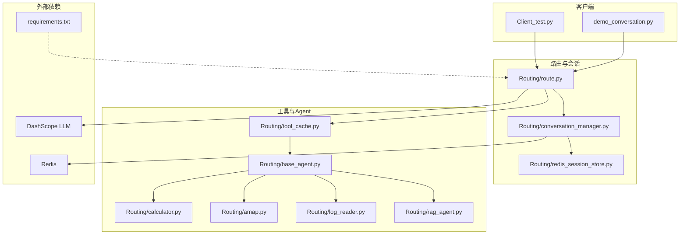
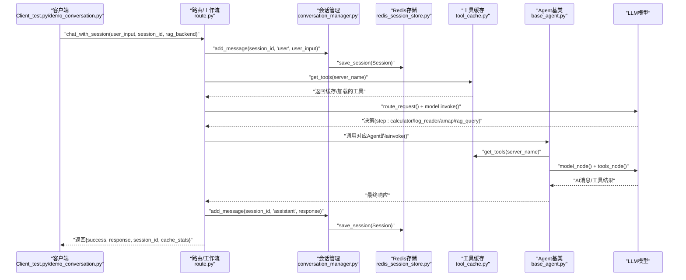
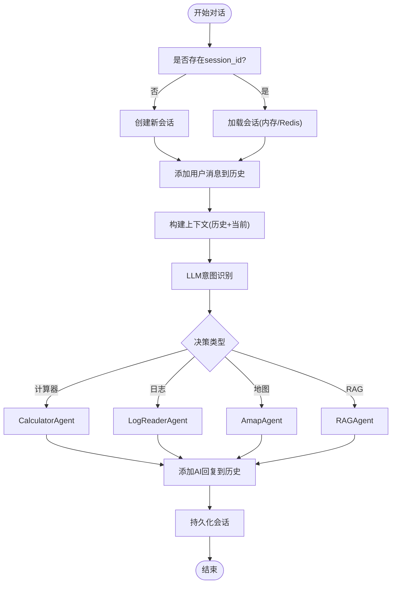
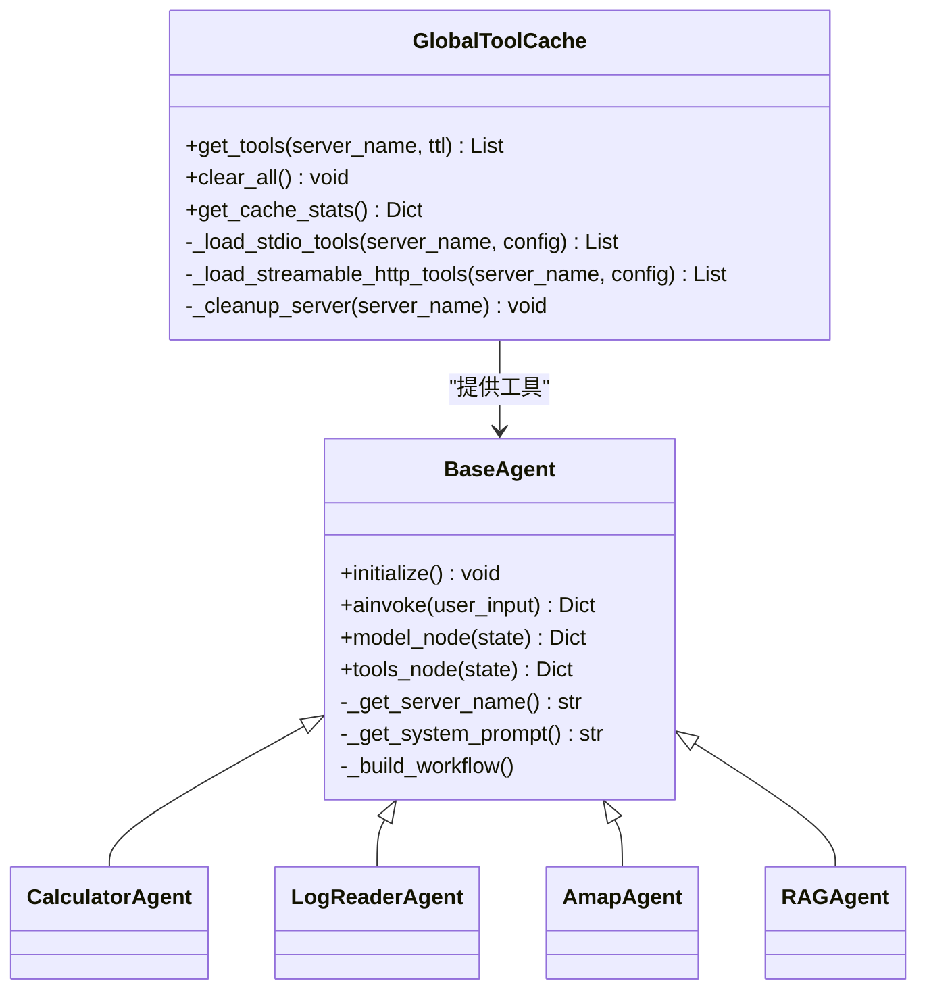
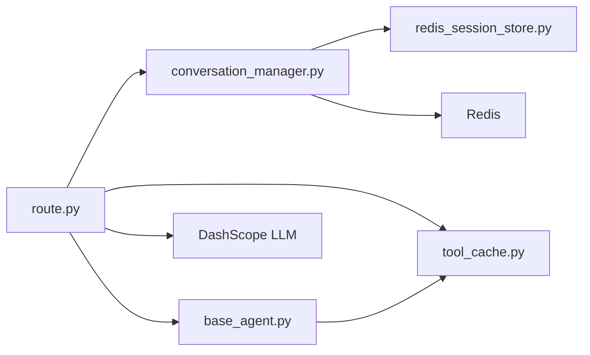

# API扩展模式

<cite>
**本文档引用的文件**
- [Client_test.py](file://Client/Client_test.py)
- [demo_conversation.py](file://demo_conversation.py)
- [route.py](file://Routing/route.py)
- [conversation_manager.py](file://Routing/conversation_manager.py)
- [redis_session_store.py](file://Routing/redis_session_store.py)
- [tool_cache.py](file://Routing/tool_cache.py)
- [base_agent.py](file://Routing/base_agent.py)
- [calculator.py](file://Routing/calculator.py)
- [amap.py](file://Routing/amap.py)
- [log_reader.py](file://Routing/log_reader.py)
- [rag_agent.py](file://Routing/rag_agent.py)
- [README.md](file://README.md)
- [requirements.txt](file://requirements.txt)
</cite>

## 目录
1. [简介](#简介)
2. [项目结构](#项目结构)
3. [核心组件](#核心组件)
4. [架构总览](#架构总览)
5. [详细组件分析](#详细组件分析)
6. [依赖分析](#依赖分析)
7. [性能考虑](#性能考虑)
8. [故障排查指南](#故障排查指南)
9. [结论](#结论)
10. [附录](#附录)

## 简介
本指南面向希望基于现有客户端API（Client_test.py、demo_conversation.py）扩展新API接口的开发者，重点讲解如何在现有会话管理、工具缓存与LangGraph路由框架之上，安全、稳定且高性能地扩展新的业务API。内容涵盖：
- 会话管理API的扩展方法：多轮对话、状态管理、持久化存储
- API设计最佳实践：RESTful接口设计、WebSocket实时通信、异步处理模式
- API版本控制与向后兼容策略
- 安全、认证授权与限流保护
- 如何扩展现有会话管理功能以支持新业务场景

## 项目结构
该项目采用模块化设计，围绕“路由-会话-工具缓存-Agent”的分层架构组织代码。核心模块包括：
- 客户端入口：Client_test.py、demo_conversation.py
- 路由与工作流：Routing/route.py
- 会话管理：Routing/conversation_manager.py、Routing/redis_session_store.py
- 工具缓存：Routing/tool_cache.py
- Agent基类与具体Agent：Routing/base_agent.py、Routing/calculator.py、Routing/amap.py、Routing/log_reader.py、Routing/rag_agent.py
- 依赖与环境：requirements.txt、README.md

**图表来源**
- [route.py:1-553](file://Routing/route.py#L1-L553)
- [conversation_manager.py:1-275](file://Routing/conversation_manager.py#L1-L275)
- [redis_session_store.py:1-228](file://Routing/redis_session_store.py#L1-L228)
- [tool_cache.py:1-302](file://Routing/tool_cache.py#L1-L302)
- [base_agent.py:1-497](file://Routing/base_agent.py#L1-L497)
- [calculator.py:1-11](file://Routing/calculator.py#L1-L11)
- [amap.py:1-11](file://Routing/amap.py#L1-L11)
- [log_reader.py:1-11](file://Routing/log_reader.py#L1-L11)
- [rag_agent.py:1-11](file://Routing/rag_agent.py#L1-L11)

**章节来源**
- [README.md:1-125](file://README.md#L1-L125)
- [requirements.txt:1-17](file://requirements.txt#L1-L17)

## 核心组件
- 路由与工作流（Routing/route.py）
  - 基于LangGraph StateGraph构建，支持会话ID、历史消息、RAG后端等状态字段
  - 提供chat_with_session、clear_session、get_session_info、cleanup_all等高级API
  - 通过LLM进行意图识别，路由到Calculator、LogReader、Amap、RAG四个Agent
- 会话管理（Routing/conversation_manager.py + redis_session_store.py）
  - 会话对象Session与全局单例ConversationManager
  - 支持内存与Redis双层持久化，自动清理过期会话
  - 提供最近会话列表、统计信息、批量清理等管理能力
- 工具缓存（Routing/tool_cache.py）
  - 全局单例缓存，避免重复加载MCP服务器工具
  - 支持stdio与streamable-http两种传输协议，TTL过期策略
- Agent基类与具体Agent（Routing/base_agent.py + 各Agent实现）
  - BaseAgent统一初始化、消息处理、工具调用与错误处理
  - Calculator、Amap、LogReader、RAGAgent继承基类，工厂函数保持向后兼容

**章节来源**
- [route.py:50-295](file://Routing/route.py#L50-L295)
- [conversation_manager.py:82-275](file://Routing/conversation_manager.py#L82-L275)
- [redis_session_store.py:14-228](file://Routing/redis_session_store.py#L14-L228)
- [tool_cache.py:39-302](file://Routing/tool_cache.py#L39-L302)
- [base_agent.py:29-497](file://Routing/base_agent.py#L29-L497)

## 架构总览
下图展示了从客户端到LLM再到Agent与工具的完整调用链，以及会话管理与缓存的作用点。

**图表来源**
- [Client_test.py:40-230](file://Client/Client_test.py#L40-L230)
- [demo_conversation.py:19-102](file://demo_conversation.py#L19-L102)
- [route.py:351-415](file://Routing/route.py#L351-L415)
- [conversation_manager.py:166-184](file://Routing/conversation_manager.py#L166-L184)
- [redis_session_store.py:36-88](file://Routing/redis_session_store.py#L36-L88)
- [tool_cache.py:85-117](file://Routing/tool_cache.py#L85-L117)
- [base_agent.py:258-318](file://Routing/base_agent.py#L258-L318)

## 详细组件分析

### 会话管理API扩展
目标：在现有会话管理基础上，新增业务相关的会话状态字段、生命周期钩子与持久化策略，支持多轮对话、状态迁移与跨进程/跨实例共享。

- 扩展点建议
  - 会话状态字段：在Session类中增加业务状态字段（如任务进度、用户偏好、权限等级等），并在ConversationManager中提供读写接口
  - 生命周期钩子：在Session对象中增加事件回调（创建、过期、清理），在ConversationManager中触发
  - 持久化策略：在Redis存储中增加业务键空间（如session:{id}:business），与meta/messages分离，便于迁移与清理
  - 批量操作：提供批量查询最近N个会话、按状态筛选、批量清理过期会话等API

- 接口设计要点
  - GET /sessions/{id}：获取会话详情（含业务状态）
  - PATCH /sessions/{id}：更新会话业务状态
  - DELETE /sessions/{id}：删除会话（含业务数据）
  - GET /sessions?status=...&limit=...：分页查询会话
  - POST /sessions/cleanup：清理过期会话（含业务数据）

- 与现有代码的对接
  - 在chat_with_session中调用add_message后，同时写入业务状态
  - 在cleanup_all中增加业务数据清理逻辑
  - 在Redis存储中新增业务键空间，避免与meta/messages冲突

**章节来源**
- [conversation_manager.py:35-80](file://Routing/conversation_manager.py#L35-L80)
- [conversation_manager.py:122-146](file://Routing/conversation_manager.py#L122-L146)
- [conversation_manager.py:216-233](file://Routing/conversation_manager.py#L216-L233)
- [redis_session_store.py:14-88](file://Routing/redis_session_store.py#L14-L88)

### 多轮对话处理与状态管理
- 现状
  - 路由层通过State携带session_id与history，结合conversation_manager.get_recent_history构建上下文
  - Agent基类统一处理messages、tool_calls与最终响应
- 扩展建议
  - 引入“上下文窗口”策略：根据tokens或消息条数动态裁剪历史
  - 引入“意图记忆”：在会话中记录用户意图标签，辅助后续路由
  - 引入“状态机”：在Session中维护业务状态机，支持条件分支与回滚

**图表来源**
- [route.py:111-147](file://Routing/route.py#L111-L147)
- [route.py:149-234](file://Routing/route.py#L149-L234)
- [route.py:351-415](file://Routing/route.py#L351-L415)
- [conversation_manager.py:166-184](file://Routing/conversation_manager.py#L166-L184)

**章节来源**
- [route.py:50-58](file://Routing/route.py#L50-L58)
- [route.py:111-147](file://Routing/route.py#L111-L147)
- [route.py:351-415](file://Routing/route.py#L351-L415)
- [base_agent.py:102-129](file://Routing/base_agent.py#L102-L129)

### 工具缓存与Agent扩展
- 现状
  - GlobalToolCache统一管理MCP工具，支持stdio与streamable-http，TTL过期
  - BaseAgent统一初始化、消息处理、工具调用与错误处理
- 扩展建议
  - 新增Agent：继承BaseAgent，实现_get_server_name与_get_system_prompt
  - 新增MCP服务器：在mcp.json中配置，支持stdio或HTTP
  - 新增缓存策略：针对不同服务器设置独立TTL或强制刷新

**图表来源**
- [tool_cache.py:39-302](file://Routing/tool_cache.py#L39-L302)
- [base_agent.py:29-497](file://Routing/base_agent.py#L29-L497)
- [calculator.py:1-11](file://Routing/calculator.py#L1-L11)
- [log_reader.py:1-11](file://Routing/log_reader.py#L1-L11)
- [amap.py:1-11](file://Routing/amap.py#L1-L11)
- [rag_agent.py:1-11](file://Routing/rag_agent.py#L1-L11)

**章节来源**
- [tool_cache.py:85-140](file://Routing/tool_cache.py#L85-L140)
- [base_agent.py:44-67](file://Routing/base_agent.py#L44-L67)
- [base_agent.py:322-401](file://Routing/base_agent.py#L322-L401)

### API设计最佳实践
- RESTful接口设计
  - 资源命名：使用名词复数形式，如/sessions、/agents
  - 动作映射：GET/POST/PUT/PATCH/DELETE对应查询、创建、完整更新、部分更新、删除
  - 状态码：200/201/204/400/401/403/404/422/500
  - 错误响应：统一错误结构{code, message, details?}
- WebSocket实时通信
  - 会话建立：客户端发起握手，携带session_id与鉴权信息
  - 消息格式：{type: "text"|"event"|"ack", payload: any, ts: number}
  - 事件驱动：支持断线重连、心跳保活、批量消息合并
- 异步处理模式
  - 路由层与Agent层均采用async/await，避免阻塞
  - 工具调用与LLM调用使用超时控制与重试策略
  - 会话持久化采用异步队列或后台任务

**章节来源**
- [route.py:351-415](file://Routing/route.py#L351-L415)
- [base_agent.py:258-318](file://Routing/base_agent.py#L258-L318)

### API版本控制与向后兼容
- 版本策略
  - URL前缀：/api/v1、/api/v2
  - 请求头：Accept: application/vnd.company.v1+json
  - 响应头：Content-Type: application/vnd.company.v2+json
- 兼容性原则
  - 不破坏已有字段与语义
  - 新增字段默认可选
  - 废弃字段保留但标记deprecated
- 迁移路径
  - 提供过渡期（如6个月）的双版本支持
  - 记录变更日志与升级指南

[本节为概念性指导，不直接分析具体文件]

### 安全、认证授权与限流保护
- 认证
  - JWT令牌：登录后颁发，有效期可配置
  - OAuth2：第三方登录（如需要）
- 授权
  - RBAC：基于角色的权限控制
  - 资源级授权：按会话ID或租户隔离
- 限流
  - 滑动窗口：每分钟请求数限制
  - 令牌桶：突发流量控制
  - 细粒度限流：按用户、会话、API端点分别限流
- 审计与监控
  - 记录关键操作日志
  - 监控QPS、P95延迟、错误率

[本节为概念性指导，不直接分析具体文件]

### 扩展现有会话管理功能
- 新业务场景
  - 多模态会话：在Session中增加媒体文件引用
  - 任务编排：在会话状态中嵌入任务流程图
  - 个性化：在会话中保存用户偏好与历史行为
- 用户需求
  - 会话导出：支持导出为标准格式（JSON/CSV）
  - 会话归档：长期保存与检索
  - 会话分享：生成临时链接与只读权限

**章节来源**
- [conversation_manager.py:254-265](file://Routing/conversation_manager.py#L254-L265)
- [redis_session_store.py:133-166](file://Routing/redis_session_store.py#L133-L166)

## 依赖分析
- 内部依赖
  - route.py依赖conversation_manager、tool_cache、base_agent等模块
  - base_agent依赖tool_cache与LLM模型
  - conversation_manager依赖redis_session_store（可选）
- 外部依赖
  - LangChain、LangGraph、DashScope LLM
  - Redis、SSH隧道、MCP协议栈

**图表来源**
- [route.py:14-38](file://Routing/route.py#L14-L38)
- [base_agent.py:50-89](file://Routing/base_agent.py#L50-L89)
- [conversation_manager.py:100-120](file://Routing/conversation_manager.py#L100-L120)

**章节来源**
- [requirements.txt:1-17](file://requirements.txt#L1-L17)
- [README.md:91-101](file://README.md#L91-L101)

## 性能考虑
- 工具加载优化
  - 使用GlobalToolCache减少重复启动MCP服务器的成本
  - 针对高频服务器设置较短TTL，低频服务器较长TTL
- 会话持久化
  - Redis使用管道与批处理减少网络往返
  - 控制消息列表长度，避免过长历史影响性能
- 并发与异步
  - 使用async/await避免阻塞IO
  - 合理设置LLM调用超时与重试次数
- 缓存与压缩
  - 对历史消息进行压缩存储（可选）
  - 使用LRU策略管理内存中的会话对象

[本节提供一般性指导，不直接分析具体文件]

## 故障排查指南
- 常见问题
  - Redis连接失败：检查主机、端口、密码与TTL配置
  - MCP服务器启动失败：检查mcp.json配置与环境变量
  - 会话加载为空：确认session_id正确与Redis中存在对应键
  - LLM调用超时：调整超时参数与重试策略
- 调试建议
  - 启用详细日志，定位具体环节
  - 使用demo_conversation.py验证工具缓存与会话管理
  - 在Client_test.py中手动输入命令测试会话管理API

**章节来源**
- [route.py:298-347](file://Routing/route.py#L298-L347)
- [redis_session_store.py:217-228](file://Routing/redis_session_store.py#L217-L228)
- [tool_cache.py:194-242](file://Routing/tool_cache.py#L194-L242)
- [demo_conversation.py:19-102](file://demo_conversation.py#L19-L102)
- [Client_test.py:40-230](file://Client/Client_test.py#L40-L230)

## 结论
通过在现有路由、会话管理与工具缓存框架之上进行扩展，可以高效地实现新的API接口与业务场景。建议遵循RESTful设计、异步处理与版本控制策略，结合Redis持久化与工具缓存，确保系统的可扩展性、稳定性与性能。同时，完善安全与限流机制，保障生产环境的可靠性。

## 附录
- 快速开始
  - 安装依赖：pip install -r requirements.txt
  - 配置环境变量：DASHSCOPE_API_KEY、AMAP_API_KEY等
  - 运行演示：python demo_conversation.py
  - 交互测试：python Client/Client_test.py

**章节来源**
- [README.md:51-79](file://README.md#L51-L79)
- [requirements.txt:1-17](file://requirements.txt#L1-L17)
- [demo_conversation.py:19-102](file://demo_conversation.py#L19-L102)
- [Client_test.py:218-230](file://Client/Client_test.py#L218-L230)