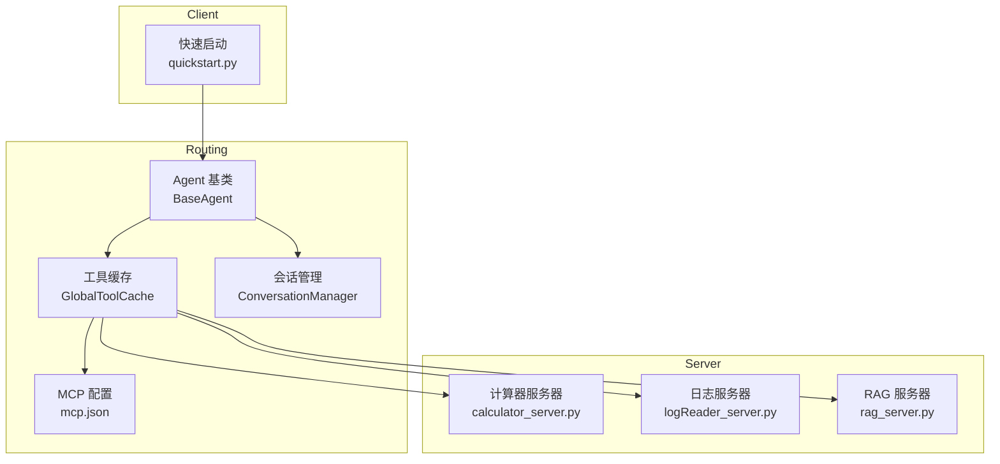
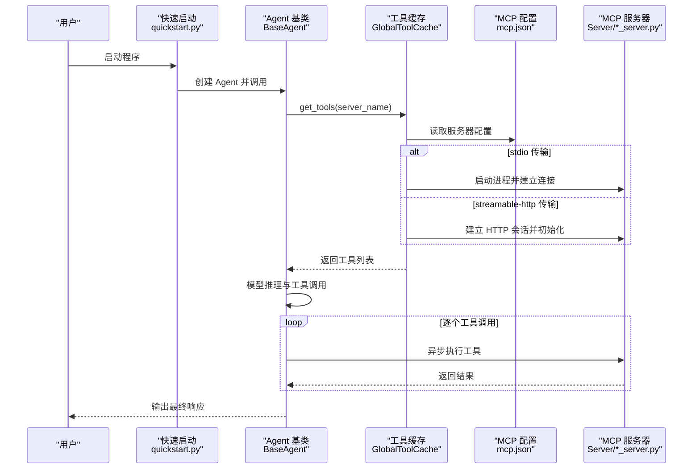
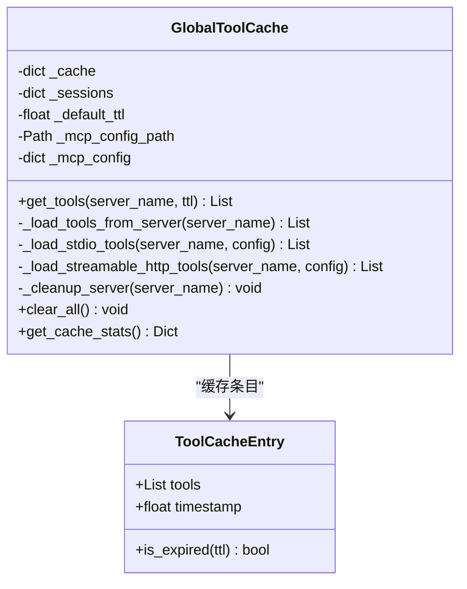
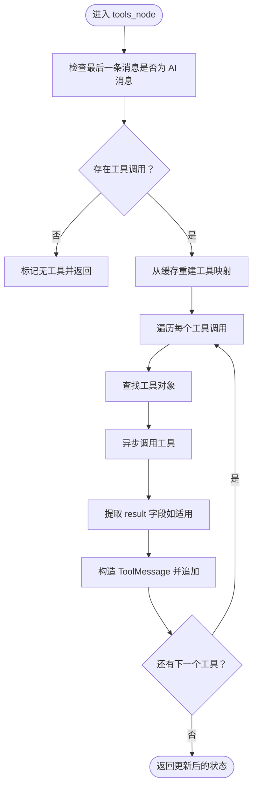
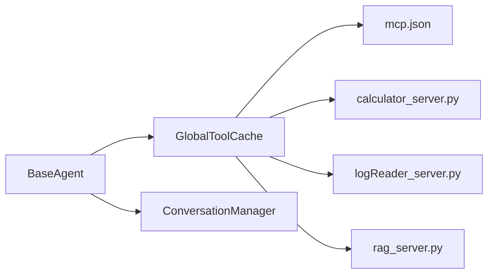

# 工具集成扩展

<cite>
**本文引用的文件**
- [Routing/tool_cache.py](file://Routing/tool_cache.py)
- [Routing/mcp.json](file://Routing/mcp.json)
- [Routing/base_agent.py](file://Routing/base_agent.py)
- [Routing/conversation_manager.py](file://Routing/conversation_manager.py)
- [Server/calculator_server.py](file://Server/calculator_server.py)
- [Server/logReader_server.py](file://Server/logReader_server.py)
- [Server/rag_server.py](file://Server/rag_server.py)
- [quickstart.py](file://quickstart.py)
- [requirements.txt](file://requirements.txt)
- [README.md](file://README.md)
</cite>

## 目录
1. [简介](#简介)
2. [项目结构](#项目结构)
3. [核心组件](#核心组件)
4. [架构总览](#架构总览)
5. [详细组件分析](#详细组件分析)
6. [依赖分析](#依赖分析)
7. [性能考虑](#性能考虑)
8. [故障排查指南](#故障排查指南)
9. [结论](#结论)
10. [附录](#附录)

## 简介
本指南面向希望扩展与集成新 MCP 工具的开发者，系统讲解工具缓存系统的架构设计与工作原理，覆盖全局工具缓存的生命周期、TTL 过期策略、线程安全访问与会话管理；详述将新工具集成到现有系统的方法，包括工具发现、注册与调用机制；提供工具配置文件格式规范与参数定义方法；解释工具调用的异步处理与错误处理策略；给出性能监控与调试技巧，以及工具版本管理与兼容性处理建议；最后展示如何扩展现有工具功能与创建复合工具的实现模式。

## 项目结构
该项目采用模块化组织，围绕“Agent + 工具缓存 + MCP 服务器”的分层设计：
- Routing：核心业务逻辑与工具缓存
  - tool_cache.py：全局工具缓存管理器（单例）
  - base_agent.py：Agent 基类与具体 Agent 实现
  - conversation_manager.py：会话管理（多轮对话历史）
  - mcp.json：MCP 服务器配置
- Server：MCP 工具服务器（计算器、日志读取、RAG 知识库）
- quickstart.py：快速启动演示脚本
- requirements.txt：运行依赖清单
- README.md：项目说明与使用示例

图表来源
- [Routing/tool_cache.py:1-302](file://Routing/tool_cache.py#L1-L302)
- [Routing/base_agent.py:1-497](file://Routing/base_agent.py#L1-L497)
- [Routing/conversation_manager.py:1-275](file://Routing/conversation_manager.py#L1-L275)
- [Routing/mcp.json:1-29](file://Routing/mcp.json#L1-L29)
- [Server/calculator_server.py:1-111](file://Server/calculator_server.py#L1-L111)
- [Server/logReader_server.py:1-151](file://Server/logReader_server.py#L1-L151)
- [Server/rag_server.py:1-363](file://Server/rag_server.py#L1-L363)
- [quickstart.py:1-68](file://quickstart.py#L1-L68)

章节来源
- [README.md:1-125](file://README.md#L1-L125)
- [requirements.txt:1-17](file://requirements.txt#L1-L17)

## 核心组件
- 全局工具缓存 GlobalToolCache
  - 单例模式，生命周期贯穿应用启动至对话结束
  - 支持基于服务器名称的 TTL 缓存与过期清理
  - 线程安全访问，内部使用锁保护
  - 统一管理所有 Agent 的工具加载与会话复用
- Agent 基类 BaseAgent
  - 统一工具加载、消息处理、错误处理与工作流构建
  - 工具调用节点按 LLM 的工具调用结果逐个执行，保证链式与顺序性
- 会话管理 ConversationManager
  - 单例模式，支持内存与 Redis 持久化双层存储
  - 自动清理过期会话，提供历史消息获取与统计接口
- MCP 服务器配置 mcp.json
  - 定义各 MCP 服务器的传输方式（stdio/streamable-http）、命令/URL、参数等
- MCP 工具服务器
  - 计算器、日志读取、RAG 知识库三类工具服务器，均以 stdio 方式运行
  - RAG 服务器支持本地 ChromaDB 与远程 Milvus（SSH 隧道）两种后端

章节来源
- [Routing/tool_cache.py:39-302](file://Routing/tool_cache.py#L39-L302)
- [Routing/base_agent.py:29-318](file://Routing/base_agent.py#L29-L318)
- [Routing/conversation_manager.py:82-275](file://Routing/conversation_manager.py#L82-L275)
- [Routing/mcp.json:1-29](file://Routing/mcp.json#L1-L29)
- [Server/calculator_server.py:1-111](file://Server/calculator_server.py#L1-L111)
- [Server/logReader_server.py:1-151](file://Server/logReader_server.py#L1-L151)
- [Server/rag_server.py:1-363](file://Server/rag_server.py#L1-L363)

## 架构总览
系统通过 LangChain MCP 适配器动态加载 MCP 服务器提供的工具，Agent 基类负责将 LLM 推荐的工具调用转化为实际的异步执行，并将工具返回结果注入到后续推理中。工具缓存负责跨 Agent 的工具复用与会话复用，降低重复连接成本。

图表来源
- [quickstart.py:8-57](file://quickstart.py#L8-L57)
- [Routing/base_agent.py:102-217](file://Routing/base_agent.py#L102-L217)
- [Routing/tool_cache.py:85-140](file://Routing/tool_cache.py#L85-L140)
- [Routing/mcp.json:1-29](file://Routing/mcp.json#L1-L29)
- [Server/calculator_server.py:108-111](file://Server/calculator_server.py#L108-L111)
- [Server/logReader_server.py:148-151](file://Server/logReader_server.py#L148-L151)
- [Server/rag_server.py:356-363](file://Server/rag_server.py#L356-L363)

## 详细组件分析

### 工具缓存系统（GlobalToolCache）
- 设计要点
  - 单例模式，全局共享缓存与会话
  - 基于服务器名称的 TTL 缓存，支持默认 TTL 与按调用传入 TTL 覆盖
  - 线程安全：使用锁保护缓存与会话字典的并发访问
  - 传输协议支持：stdio 与 streamable-http 两种
  - 过期清理：过期缓存自动清理并关闭对应会话/客户端
  - 统计接口：提供缓存服务器数量、活跃会话数等信息
- 关键流程
  - get_tools：命中缓存直接返回；过期则清理并重新加载
  - _load_stdio_tools/_load_streamable_http_tools：分别建立 stdio 进程连接与 HTTP 会话
  - _cleanup_server：优雅关闭会话、客户端与传输层
  - clear_all：应用结束时清空所有缓存与会话
- 性能与优化
  - TTL 控制：合理设置 TTL，平衡新鲜度与性能
  - 复用会话：避免重复建立连接，减少冷启动开销
  - 超时控制：HTTP 连接设置超时，防止阻塞
  - 路径与环境变量处理：对相对路径与占位符进行解析，提升部署灵活性

图表来源
- [Routing/tool_cache.py:27-302](file://Routing/tool_cache.py#L27-L302)

章节来源
- [Routing/tool_cache.py:39-302](file://Routing/tool_cache.py#L39-L302)

### Agent 基类（BaseAgent）
- 设计要点
  - 延迟初始化：首次使用时才加载工具与构建工作流
  - 统一模型绑定：从环境变量读取 LLM 配置，绑定工具
  - 工作流：模型节点 → 工具节点 → 模型节点（循环），支持条件路由
  - 工具执行：按 LLM 的工具调用列表逐个异步执行，构造 ToolMessage 注入
  - 结果提取：对计算器工具特殊处理，仅传递 result 字段的数值，避免泄露原始结构
- 关键流程
  - initialize：从缓存获取工具，初始化模型，构建并编译工作流
  - model_node：添加系统提示词，调用 LLM，异常捕获
  - tools_node：构建工具映射，逐个执行工具，构造工具消息，记录结果
  - ainvoke：构建初始状态，执行工作流，提取最终响应
- 错误处理
  - 模型调用失败、工具执行失败、工具缺失等情况均记录错误并注入消息

图表来源
- [Routing/base_agent.py:131-217](file://Routing/base_agent.py#L131-L217)

章节来源
- [Routing/base_agent.py:29-318](file://Routing/base_agent.py#L29-L318)

### 会话管理（ConversationManager）
- 设计要点
  - 单例模式，支持内存与 Redis 双层存储
  - 自动清理过期会话（默认 1 小时）
  - 提供创建、获取、添加消息、清理、统计等接口
- 与 Agent 的协作
  - Agent 可通过会话管理器维护多轮对话历史，增强上下文连贯性

章节来源
- [Routing/conversation_manager.py:82-275](file://Routing/conversation_manager.py#L82-L275)

### MCP 服务器配置（mcp.json）
- 配置项
  - mcpServers：服务器列表
    - serverName：服务器标识
      - transport：传输协议（stdio/streamable-http）
      - command/args：stdio 时的命令与参数（支持相对路径与占位符替换）
      - url：streamable-http 时的 URL（支持占位符替换）
- 集成示例
  - 计算器、日志读取、RAG 知识库、高德地图（streamable-http）

章节来源
- [Routing/mcp.json:1-29](file://Routing/mcp.json#L1-L29)

### MCP 工具服务器
- 计算器服务器（stdio）
  - 工具：加法、减法、乘法、除法
  - 异常处理：除零场景返回错误
- 日志读取服务器（stdio）
  - 工具：读取最新日志、按关键词搜索、获取日志统计
  - 异常处理：文件不存在、读取异常返回错误
- RAG 知识库服务器（stdio）
  - 工具：知识检索、切换后端、手动加载文档、获取索引统计
  - 后端：ChromaDB（本地）与 Milvus（SSH 隧道，可选依赖）
  - 异常处理：连接失败、搜索异常返回错误

章节来源
- [Server/calculator_server.py:16-105](file://Server/calculator_server.py#L16-L105)
- [Server/logReader_server.py:18-145](file://Server/logReader_server.py#L18-L145)
- [Server/rag_server.py:193-353](file://Server/rag_server.py#L193-L353)

## 依赖分析
- 运行时依赖
  - fastmcp、langchain、langchain-mcp-adapters、mcp、httpx、chromadb、langchain-chroma、pymilvus、redis、paramiko、sshtunnel 等
- 模块间耦合
  - BaseAgent 依赖 GlobalToolCache 进行工具加载
  - GlobalToolCache 依赖 mcp.json 进行服务器配置解析
  - GlobalToolCache 与各 MCP 服务器（stdio/HTTP）交互
  - ConversationManager 与 Agent 协作维护上下文

图表来源
- [Routing/base_agent.py:44-66](file://Routing/base_agent.py#L44-L66)
- [Routing/tool_cache.py:67-84](file://Routing/tool_cache.py#L67-L84)
- [Routing/mcp.json:1-29](file://Routing/mcp.json#L1-L29)
- [Server/calculator_server.py:108-111](file://Server/calculator_server.py#L108-L111)
- [Server/logReader_server.py:148-151](file://Server/logReader_server.py#L148-L151)
- [Server/rag_server.py:356-363](file://Server/rag_server.py#L356-L363)

章节来源
- [requirements.txt:1-17](file://requirements.txt#L1-L17)

## 性能考虑
- 工具缓存
  - TTL 设置：根据工具稳定性与更新频率设定合理 TTL，避免频繁重载
  - 会话复用：stdio 与 HTTP 会话应尽量复用，减少进程/连接创建开销
  - 超时控制：HTTP 连接设置超时，防止长时间阻塞
- Agent 执行
  - 工具串行执行：严格按 LLM 推荐顺序执行，避免并行导致状态不一致
  - 结果裁剪：仅注入必要字段（如计算器的 result），减少上下文污染
- 向量检索（RAG）
  - 后端选择：本地 ChromaDB 适合小规模数据，远程 Milvus 适合大规模数据
  - 批量查询与统计：注意 Milvus 查询的分批处理与连接管理
- 会话管理
  - 过期清理：定期清理过期会话，避免内存泄漏
  - Redis 持久化：在高并发场景下启用 Redis，提升会话持久化与共享能力

## 故障排查指南
- 工具加载失败
  - 检查 mcp.json 中服务器配置是否正确（transport、command/url、args）
  - 确认 stdio 命令与参数路径有效，必要时使用相对路径并由缓存解析
  - streamable-http 需要网络可达与超时设置，确认 URL 与鉴权参数
- 工具执行异常
  - 查看 Agent 的 tools_node 输出，定位具体工具调用与错误信息
  - 对于计算器除零等边界情况，确保工具返回结构符合预期
- 会话问题
  - 检查会话超时与清理策略，确认 Redis 配置与可用性
- 缓存与会话清理
  - 使用 GlobalToolCache 的清理接口在异常或应用关闭时释放资源
  - 使用 ConversationManager 的清理接口定期清理过期会话

章节来源
- [Routing/tool_cache.py:194-242](file://Routing/tool_cache.py#L194-L242)
- [Routing/base_agent.py:196-210](file://Routing/base_agent.py#L196-L210)
- [Routing/conversation_manager.py:234-253](file://Routing/conversation_manager.py#L234-L253)

## 结论
本系统通过全局工具缓存与 Agent 基类实现了 MCP 工具的高效、可扩展集成。工具缓存提供跨 Agent 的工具与会话复用、TTL 过期与清理机制；Agent 基类统一了工具加载、消息处理与工作流编排；会话管理保障多轮对话的上下文一致性。按照本文档的配置规范与集成步骤，开发者可快速将新的 MCP 工具接入系统，并通过合理的 TTL、会话复用与错误处理策略获得稳定高效的运行表现。

## 附录

### 新工具集成步骤
- 步骤一：编写 MCP 服务器
  - 选择 stdio 或 streamable-http 传输方式
  - 使用装饰器声明工具函数，明确参数与返回结构
  - 为工具函数提供完善的错误处理与边界条件判断
- 步骤二：更新 MCP 配置
  - 在 mcp.json 中新增服务器条目，配置 transport、command/url、args/url 参数
  - 如使用占位符（如 AMAP_API_KEY），确保环境变量已设置
- 步骤三：在 Agent 中使用
  - 在 Agent 子类中实现 _get_server_name，返回服务器名称
  - 初始化时会自动通过 GlobalToolCache 加载工具
  - 工具调用由 BaseAgent 的 tools_node 逐个异步执行
- 步骤四：验证与调试
  - 使用 quickstart.py 或交互式脚本验证工具可用性
  - 关注工具返回结构，必要时在 Agent 中进行结果裁剪

章节来源
- [Routing/mcp.json:1-29](file://Routing/mcp.json#L1-L29)
- [Routing/base_agent.py:322-496](file://Routing/base_agent.py#L322-L496)
- [quickstart.py:8-57](file://quickstart.py#L8-L57)

### 工具配置文件格式规范
- 文件位置：Routing/mcp.json
- 结构
  - mcpServers：服务器集合
    - serverName：服务器标识
      - transport：传输协议（"stdio" 或 "streamable-http"）
      - command/args：stdio 时的命令与参数数组（支持相对路径与占位符替换）
      - url：streamable-http 时的 URL（支持占位符替换）
- 示例参考
  - 计算器、日志读取、RAG 知识库、高德地图（streamable-http）

章节来源
- [Routing/mcp.json:1-29](file://Routing/mcp.json#L1-L29)

### 工具调用的异步处理与错误处理
- 异步处理
  - 工具调用通过异步方法执行，逐个工具串行调用，避免并发冲突
  - 工具返回结果转换为 ToolMessage 注入到消息流中
- 错误处理
  - 捕获模型调用与工具执行异常，记录错误并注入错误消息
  - 对于工具缺失或不可用的情况，提供明确的错误提示

章节来源
- [Routing/base_agent.py:102-217](file://Routing/base_agent.py#L102-L217)

### 性能监控与调试技巧
- 工具缓存统计
  - 使用 GlobalToolCache 的统计接口查看缓存服务器数量与活跃会话数
- 会话统计
  - 使用 ConversationManager 的统计接口查看会话数量、时长与消息数
- 调试建议
  - 在工具服务器中增加日志输出，定位参数与返回结构
  - 在 Agent 中打印工具调用与结果，便于问题定位

章节来源
- [Routing/tool_cache.py:291-297](file://Routing/tool_cache.py#L291-L297)
- [Routing/conversation_manager.py:260-265](file://Routing/conversation_manager.py#L260-L265)

### 工具版本管理与兼容性
- 版本管理
  - 通过服务器名称区分不同版本的工具集（例如在 mcp.json 中为不同版本命名）
  - 在 Agent 中通过 _get_server_name 返回对应版本的服务器名称
- 兼容性处理
  - 工具返回结构变化时，在 Agent 的 tools_node 中进行兼容性处理（如字段裁剪）
  - 对于可选依赖（如 Milvus），在工具服务器中提供降级方案（如回退到 ChromaDB）

章节来源
- [Server/rag_server.py:177-182](file://Server/rag_server.py#L177-L182)
- [Routing/base_agent.py:173-181](file://Routing/base_agent.py#L173-L181)

### 扩展现有工具与复合工具实现模式
- 扩展现有工具
  - 在对应 MCP 服务器中新增工具函数，保持参数与返回结构的一致性
  - 更新 Agent 的系统提示词，引导 LLM 正确使用新工具
- 复合工具模式
  - 在 Agent 的 tools_node 中，对多个工具调用进行编排，形成链式调用
  - 对工具返回进行二次处理（如格式化、聚合），形成复合结果

章节来源
- [Routing/base_agent.py:131-217](file://Routing/base_agent.py#L131-L217)