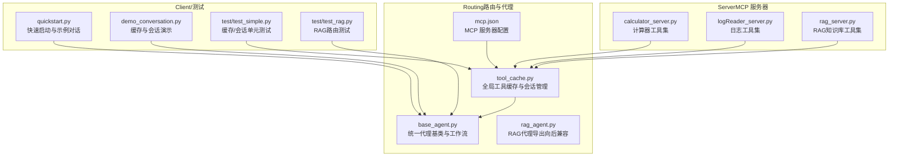
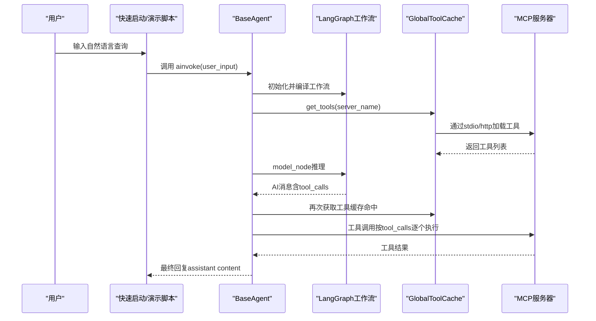
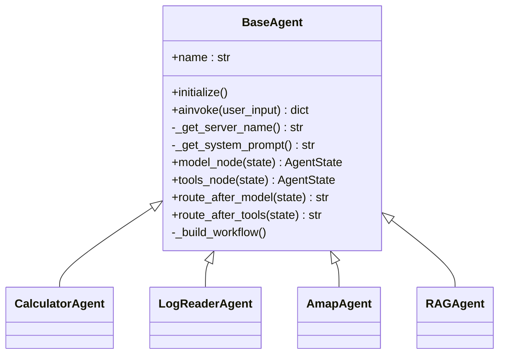
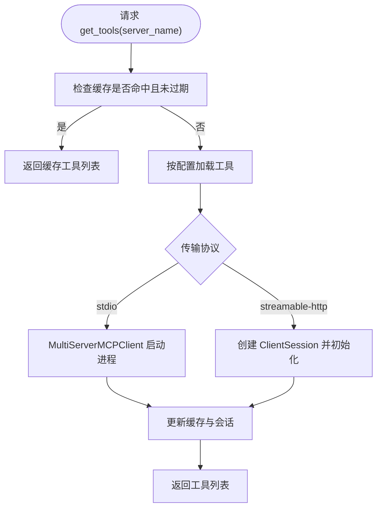
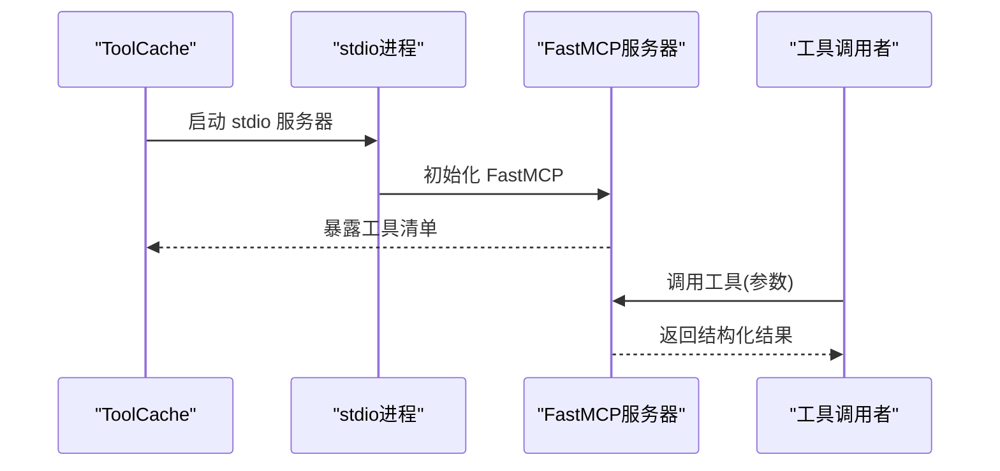
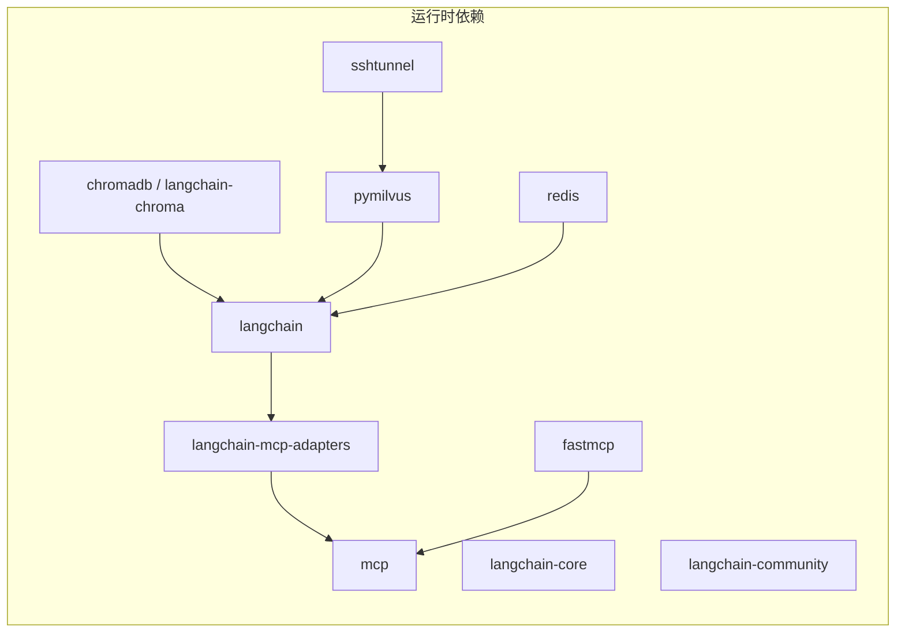

# 扩展开发

<cite>
**本文引用的文件**   
- [README.md](file://README.md)
- [quickstart.py](file://quickstart.py)
- [requirements.txt](file://requirements.txt)
- [Routing/base_agent.py](file://Routing/base_agent.py)
- [Routing/tool_cache.py](file://Routing/tool_cache.py)
- [Routing/mcp.json](file://Routing/mcp.json)
- [Routing/rag_agent.py](file://Routing/rag_agent.py)
- [Server/__init__.py](file://Server/__init__.py)
- [Server/calculator_server.py](file://Server/calculator_server.py)
- [Server/logReader_server.py](file://Server/logReader_server.py)
- [Server/rag_server.py](file://Server/rag_server.py)
- [demo_conversation.py](file://demo_conversation.py)
- [test/test_simple.py](file://test/test_simple.py)
- [test/test_rag.py](file://test/test_rag.py)
</cite>

## 目录
1. [简介](#简介)
2. [项目结构](#项目结构)
3. [核心组件](#核心组件)
4. [架构总览](#架构总览)
5. [详细组件分析](#详细组件分析)
6. [依赖分析](#依赖分析)
7. [性能考量](#性能考量)
8. [故障排查指南](#故障排查指南)
9. [结论](#结论)
10. [附录](#附录)

## 简介
本指南面向希望在 AiOps 项目中进行扩展开发的工程师，目标是帮助你：
- 快速开发新的 MCP 服务器（工具集合）
- 新增代理类型（Agent），复用统一的基类与缓存机制
- 集成新的工具到现有工作流中
- 识别并利用扩展点（插件化、钩子式的工作流节点）
- 设计可维护、可演进的架构扩展方案
- 提供完整开发示例与模板，覆盖从“新增服务器”到“集成到代理”的全流程
- 讨论版本兼容性与向后兼容注意事项
- 给出测试与验证方法，确保扩展稳定可靠

## 项目结构
该项目采用模块化分层设计，围绕“工具与模型”“状态”“模型节点”“工具节点”“结束逻辑”“构建与编译”六大模块组织，结合 MCP 协议实现跨进程/跨网络的工具动态加载与调用。

图表来源
- [Routing/base_agent.py:1-497](file://Routing/base_agent.py#L1-L497)
- [Routing/tool_cache.py:1-302](file://Routing/tool_cache.py#L1-L302)
- [Routing/mcp.json:1-29](file://Routing/mcp.json#L1-L29)
- [Routing/rag_agent.py:1-11](file://Routing/rag_agent.py#L1-L11)
- [Server/calculator_server.py:1-111](file://Server/calculator_server.py#L1-L111)
- [Server/logReader_server.py:1-151](file://Server/logReader_server.py#L1-L151)
- [Server/rag_server.py:1-363](file://Server/rag_server.py#L1-L363)
- [quickstart.py:1-68](file://quickstart.py#L1-L68)
- [demo_conversation.py:1-102](file://demo_conversation.py#L1-L102)
- [test/test_simple.py:1-103](file://test/test_simple.py#L1-L103)
- [test/test_rag.py:1-50](file://test/test_rag.py#L1-L50)

章节来源
- [README.md:1-125](file://README.md#L1-L125)
- [Routing/mcp.json:1-29](file://Routing/mcp.json#L1-L29)

## 核心组件
- 代理基类与工作流
  - 统一的状态结构、模型节点、工具节点、条件路由与编译流程，便于新增代理类型时最小改动复用
- 全局工具缓存
  - 基于服务器名的 TTL 缓存、会话管理、stdio/http 两种传输协议适配
- MCP 服务器配置
  - mcp.json 中集中声明各服务器的传输方式、命令/URL 参数
- 服务器实现
  - 计算器、日志读取、RAG 知识库三类服务器，均以 stdio 方式运行，工具通过装饰器注册

章节来源
- [Routing/base_agent.py:1-497](file://Routing/base_agent.py#L1-L497)
- [Routing/tool_cache.py:1-302](file://Routing/tool_cache.py#L1-L302)
- [Routing/mcp.json:1-29](file://Routing/mcp.json#L1-L29)
- [Server/calculator_server.py:1-111](file://Server/calculator_server.py#L1-L111)
- [Server/logReader_server.py:1-151](file://Server/logReader_server.py#L1-L151)
- [Server/rag_server.py:1-363](file://Server/rag_server.py#L1-L363)

## 架构总览
整体采用“LangGraph 工作流 + MCP 工具动态加载”的架构。Agent 基类负责构建状态与节点，工具缓存负责按服务器名加载/缓存工具，MCP 服务器提供具体工具实现。

图表来源
- [Routing/base_agent.py:238-318](file://Routing/base_agent.py#L238-L318)
- [Routing/tool_cache.py:85-140](file://Routing/tool_cache.py#L85-L140)
- [Server/calculator_server.py:108-111](file://Server/calculator_server.py#L108-L111)
- [Server/logReader_server.py:148-151](file://Server/logReader_server.py#L148-L151)
- [Server/rag_server.py:356-363](file://Server/rag_server.py#L356-L363)

## 详细组件分析

### 组件A：代理基类与工作流（BaseAgent）
- 设计要点
  - 统一状态结构（消息、当前步骤、工具调用与结果、错误）
  - 模型节点：注入系统提示词，调用 LLM 并追加消息
  - 工具节点：解析 AI 消息中的 tool_calls，按名称映射工具并异步执行
  - 路由逻辑：根据是否存在 tool_calls 决定流转至工具节点或结束
  - 延迟初始化：首次使用时才加载工具、构建工作流，减少冷启动成本
- 扩展点
  - 子类只需实现服务器名与系统提示词，即可获得完整的工具驱动对话能力
  - 可在工具节点中加入“结果裁剪/摘要”逻辑，避免 LLM 被原始数据干扰
- 最佳实践
  - 工具调用严格按顺序逐个执行，避免并行导致状态不一致
  - 工具返回值建议统一包装，必要时仅透传关键字段

图表来源
- [Routing/base_agent.py:29-497](file://Routing/base_agent.py#L29-L497)

章节来源
- [Routing/base_agent.py:1-497](file://Routing/base_agent.py#L1-L497)

### 组件B：全局工具缓存（GlobalToolCache）
- 设计要点
  - 单例模式，生命周期贯穿应用运行期
  - 基于服务器名的 TTL 缓存，避免重复连接与工具加载
  - 支持 stdio 与 streamable-http 两种传输协议
  - 自动管理会话与清理，防止资源泄露
- 扩展点
  - 新增服务器时，在 mcp.json 中添加配置即可；缓存自动适配
  - 可调整默认 TTL 以平衡性能与新鲜度
- 最佳实践
  - 为长会话场景预留缓存刷新策略
  - 对 HTTP 服务器设置合理超时与重试

图表来源
- [Routing/tool_cache.py:85-140](file://Routing/tool_cache.py#L85-L140)
- [Routing/tool_cache.py:141-243](file://Routing/tool_cache.py#L141-L243)

章节来源
- [Routing/tool_cache.py:1-302](file://Routing/tool_cache.py#L1-L302)
- [Routing/mcp.json:1-29](file://Routing/mcp.json#L1-L29)

### 组件C：MCP 服务器（示例：计算器、日志、RAG）
- 设计要点
  - 基于 FastMCP 装饰器注册工具
  - 以 stdio 方式运行，便于与缓存层协作
  - 工具返回值统一结构，便于下游消费
- 扩展点
  - 新增工具：在对应服务器文件中添加新的 @mcp.tool() 函数
  - 新增服务器：在 mcp.json 中新增条目，实现对应服务器文件
- 最佳实践
  - 工具参数与返回值保持明确的结构化 JSON
  - 对异常情况返回标准错误结构，便于上层统一处理

图表来源
- [Server/calculator_server.py:16-105](file://Server/calculator_server.py#L16-L105)
- [Server/logReader_server.py:18-102](file://Server/logReader_server.py#L18-L102)
- [Server/rag_server.py:193-354](file://Server/rag_server.py#L193-L354)

章节来源
- [Server/calculator_server.py:1-111](file://Server/calculator_server.py#L1-L111)
- [Server/logReader_server.py:1-151](file://Server/logReader_server.py#L1-L151)
- [Server/rag_server.py:1-363](file://Server/rag_server.py#L1-L363)

### 组件D：RAG 代理（向后兼容导出）
- 设计要点
  - RAGAgent 已重构为继承 BaseAgent，并通过 rag_agent.py 保持对外导出兼容
- 扩展点
  - 可直接使用 create_rag_agent 工厂函数创建实例，或直接构造 RAGAgent
- 最佳实践
  - 在系统提示词中明确后端差异（ChromaDB vs Milvus），并在工具调用时传参区分

章节来源
- [Routing/rag_agent.py:1-11](file://Routing/rag_agent.py#L1-L11)
- [Routing/base_agent.py:433-463](file://Routing/base_agent.py#L433-L463)

## 依赖分析
- 核心依赖
  - langchain、langchain-core、langchain-community：LLM 与工具绑定
  - langchain-mcp-adapters、mcp：MCP 协议客户端与适配
  - fastmcp：MCP 服务器端框架
  - chromadb、langchain-chroma：本地向量库
  - redis、pymilvus、sshtunnel：远程 Milvus 与会话/隧道支持
- 版本与兼容性
  - 项目要求 Python >= 3.9，LangChain >= 0.3.0，LangGraph >= 0.2.0，MCP 协议 >= 1.0.0
  - 为保证向后兼容，建议在新增功能时保留旧工厂函数导出（如 RAGAgent）

图表来源
- [requirements.txt:1-17](file://requirements.txt#L1-L17)

章节来源
- [requirements.txt:1-17](file://requirements.txt#L1-L17)
- [README.md:91-100](file://README.md#L91-L100)

## 性能考量
- 工具缓存
  - 通过 TTL 缓存工具与会话，显著降低重复加载成本
  - 建议根据服务器稳定性与数据新鲜度调整 TTL
- 传输协议
  - stdio：进程内通信，低延迟；适合本地工具
  - streamable-http：网络传输，需设置超时与重试
- 工具执行
  - 工具节点逐个执行，避免并发竞争；若工具具备幂等性，可在上层做批量调度优化
- 向量检索
  - Milvus 远程搜索需考虑网络延迟；可结合 SSH 隧道与连接池优化

章节来源
- [Routing/tool_cache.py:62-140](file://Routing/tool_cache.py#L62-L140)
- [Server/rag_server.py:51-159](file://Server/rag_server.py#L51-L159)

## 故障排查指南
- 常见问题与定位
  - 工具未加载：检查 mcp.json 中服务器配置与传输协议是否正确
  - 连接超时：确认 streamable-http URL 与 AMAP_API_KEY 是否配置
  - 工具执行失败：查看工具返回的错误结构，定位参数或权限问题
  - 缓存未命中：确认服务器名与缓存键一致，检查 TTL 设置
- 测试与验证
  - 使用 demo_conversation.py 观察缓存与会话行为
  - 使用 test/test_simple.py 验证缓存与会话管理
  - 使用 test/test_rag.py 验证路由决策

章节来源
- [demo_conversation.py:1-102](file://demo_conversation.py#L1-L102)
- [test/test_simple.py:1-103](file://test/test_simple.py#L1-L103)
- [test/test_rag.py:1-50](file://test/test_rag.py#L1-L50)

## 结论
本项目通过“代理基类 + 全局工具缓存 + MCP 协议”的组合，实现了高度可扩展的工具驱动对话系统。新增 MCP 服务器与代理类型的成本极低，只需遵循统一的工具结构与配置规范，即可快速融入现有工作流。建议在扩展过程中坚持“结构化返回、明确错误、最小改动”的原则，并配合完善的测试与缓存策略，确保系统的稳定性与可维护性。

## 附录

### A. 开发新 MCP 服务器（工具集）步骤
- 步骤
  1) 在 Server 目录新增服务器文件，使用 FastMCP 装饰器注册工具
  2) 在 Routing/mcp.json 中添加服务器配置（stdio/http 任选其一）
  3) 在代理中通过 _get_server_name 返回服务器名，即可自动加载工具
- 参考路径
  - [Server/calculator_server.py:1-111](file://Server/calculator_server.py#L1-L111)
  - [Server/logReader_server.py:1-151](file://Server/logReader_server.py#L1-L151)
  - [Server/rag_server.py:1-363](file://Server/rag_server.py#L1-L363)
  - [Routing/mcp.json:1-29](file://Routing/mcp.json#L1-L29)

章节来源
- [Server/calculator_server.py:1-111](file://Server/calculator_server.py#L1-L111)
- [Server/logReader_server.py:1-151](file://Server/logReader_server.py#L1-L151)
- [Server/rag_server.py:1-363](file://Server/rag_server.py#L1-L363)
- [Routing/mcp.json:1-29](file://Routing/mcp.json#L1-L29)

### B. 开发新代理类型（Agent）步骤
- 步骤
  1) 继承 BaseAgent，实现 _get_server_name 与 _get_system_prompt
  2) 如需特殊路由/节点逻辑，可覆写相应方法
  3) 使用工厂函数或直接构造实例，调用 ainvoke 处理用户输入
- 参考路径
  - [Routing/base_agent.py:29-497](file://Routing/base_agent.py#L29-L497)

章节来源
- [Routing/base_agent.py:29-497](file://Routing/base_agent.py#L29-L497)

### C. 集成新工具到现有工作流
- 步骤
  1) 在对应服务器文件中新增 @mcp.tool() 工具
  2) 无需修改代理与工作流，工具将自动被缓存与加载
  3) 若工具返回复杂结构，可在工具节点中进行裁剪，仅保留关键字段
- 参考路径
  - [Routing/tool_cache.py:141-243](file://Routing/tool_cache.py#L141-L243)
  - [Routing/base_agent.py:131-218](file://Routing/base_agent.py#L131-L218)

章节来源
- [Routing/tool_cache.py:141-243](file://Routing/tool_cache.py#L141-L243)
- [Routing/base_agent.py:131-218](file://Routing/base_agent.py#L131-L218)

### D. 版本兼容性与向后兼容
- 保持对外导出
  - 通过 rag_agent.py 导出 RAGAgent 与工厂函数，确保旧调用方式不变
- 依赖版本
  - 严格遵循 requirements.txt 中的最低版本要求
- 最佳实践
  - 新增功能尽量通过“新增文件 + 配置 + 继承基类”的方式实现，避免破坏既有接口

章节来源
- [Routing/rag_agent.py:1-11](file://Routing/rag_agent.py#L1-L11)
- [requirements.txt:1-17](file://requirements.txt#L1-L17)

### E. 测试与验证方法
- 缓存与会话
  - 使用 demo_conversation.py 观察缓存命中与会话上下文
  - 使用 test/test_simple.py 验证缓存与会话管理
- 路由与意图
  - 使用 test/test_rag.py 验证 RAG 路由决策
- 快速启动
  - 使用 quickstart.py 进行端到端示例对话

章节来源
- [demo_conversation.py:1-102](file://demo_conversation.py#L1-L102)
- [test/test_simple.py:1-103](file://test/test_simple.py#L1-L103)
- [test/test_rag.py:1-50](file://test/test_rag.py#L1-L50)
- [quickstart.py:1-68](file://quickstart.py#L1-L68)