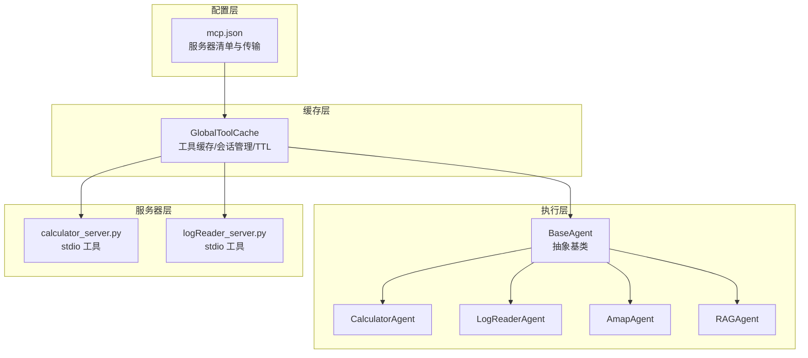
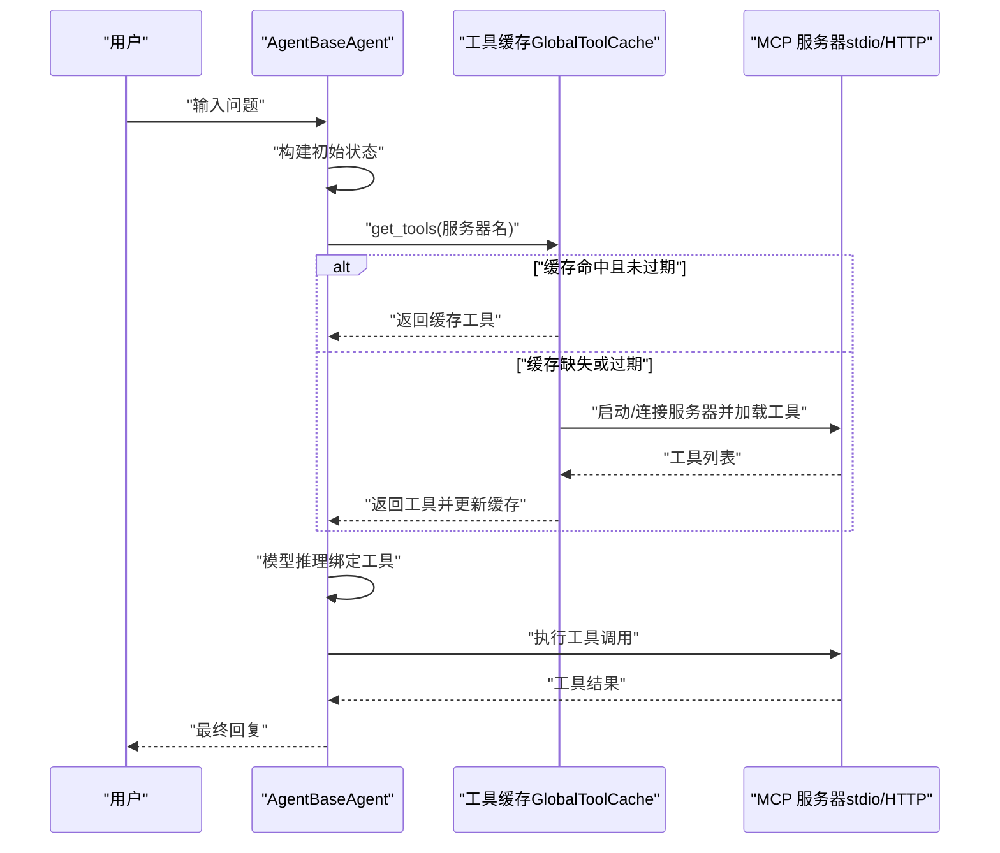
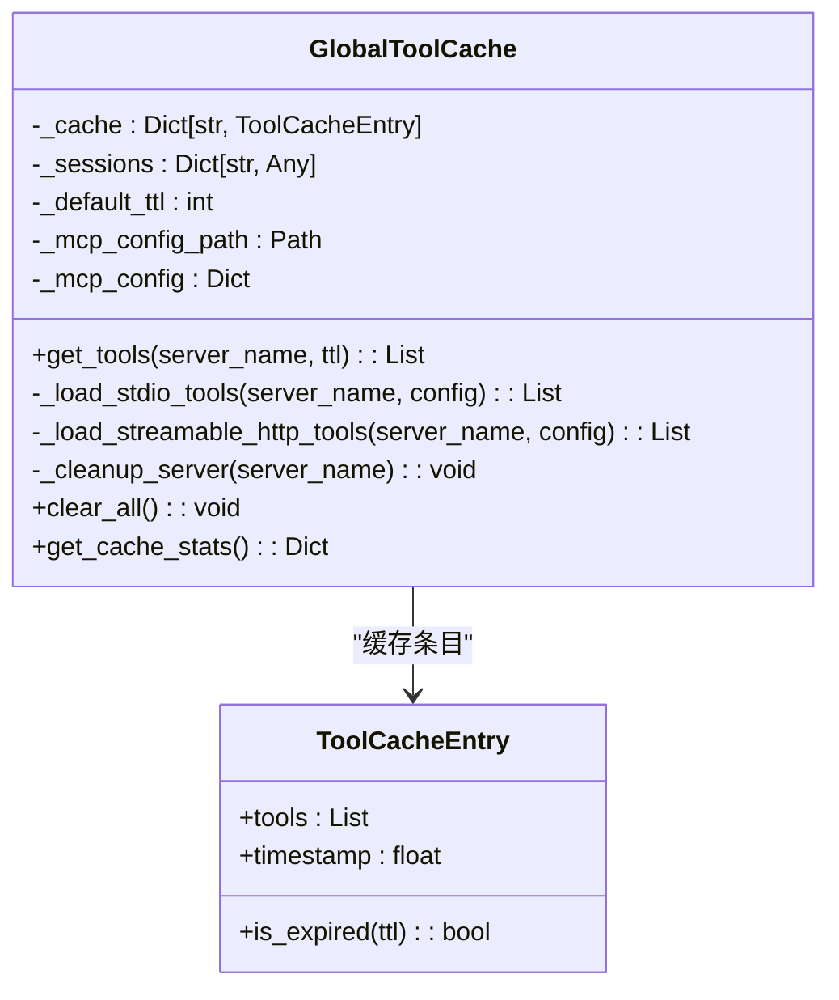
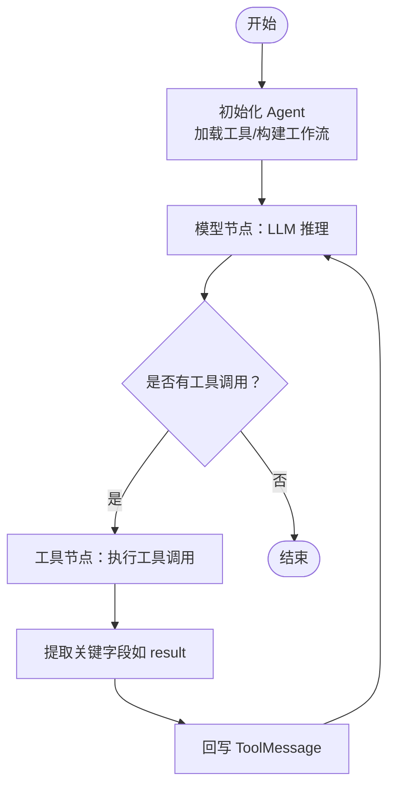
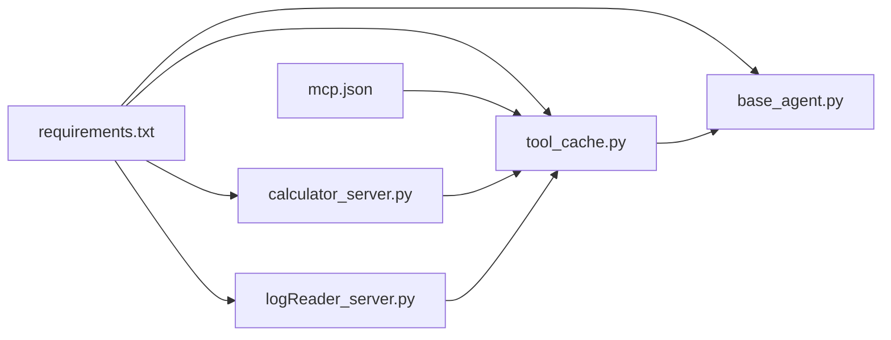

# 插件系统使用

<cite>
**本文引用的文件**
- [mcp.json](file://Routing/mcp.json)
- [tool_cache.py](file://Routing/tool_cache.py)
- [base_agent.py](file://Routing/base_agent.py)
- [amap.py](file://Routing/amap.py)
- [calculator_server.py](file://Server/calculator_server.py)
- [logReader_server.py](file://Server/logReader_server.py)
- [quickstart.py](file://quickstart.py)
- [README.md](file://README.md)
- [requirements.txt](file://requirements.txt)
</cite>

## 目录
1. [简介](#简介)
2. [项目结构](#项目结构)
3. [核心组件](#核心组件)
4. [架构总览](#架构总览)
5. [详细组件分析](#详细组件分析)
6. [依赖分析](#依赖分析)
7. [性能考虑](#性能考虑)
8. [故障排查指南](#故障排查指南)
9. [结论](#结论)
10. [附录](#附录)

## 简介
本指南面向希望在 AiOps 项目中扩展与使用插件（MCP 服务器）的开发者。文档聚焦于：
- 插件架构与扩展点识别
- 通过配置文件（mcp.json）添加新的 MCP 服务器
- 插件开发标准流程与最佳实践（接口定义、生命周期、资源清理）
- 插件间依赖与冲突处理
- 插件测试、部署与版本管理
- 利用工具缓存机制实现高效加载与管理
- 插件开发模板与示例路径

## 项目结构
AiOps 的插件体系围绕“配置驱动 + 工具缓存 + Agent 工作流”展开：
- 配置层：mcp.json 定义 MCP 服务器清单与传输方式
- 缓存层：GlobalToolCache 负责统一加载、缓存与会话管理
- 执行层：BaseAgent 及其子类（计算器、日志、高德、RAG）通过缓存获取工具并驱动 LangGraph 工作流
- 服务器层：Server 目录下各 stdio MCP 服务器实现具体工具

图表来源
- [mcp.json:1-29](file://Routing/mcp.json#L1-L29)
- [tool_cache.py:39-302](file://Routing/tool_cache.py#L39-L302)
- [base_agent.py:29-497](file://Routing/base_agent.py#L29-L497)
- [calculator_server.py:1-111](file://Server/calculator_server.py#L1-L111)
- [logReader_server.py:1-151](file://Server/logReader_server.py#L1-L151)

章节来源
- [README.md:1-125](file://README.md#L1-L125)
- [mcp.json:1-29](file://Routing/mcp.json#L1-L29)
- [tool_cache.py:1-302](file://Routing/tool_cache.py#L1-L302)
- [base_agent.py:1-497](file://Routing/base_agent.py#L1-L497)
- [calculator_server.py:1-111](file://Server/calculator_server.py#L1-L111)
- [logReader_server.py:1-151](file://Server/logReader_server.py#L1-L151)

## 核心组件
- 配置文件（mcp.json）
  - 定义多个 MCP 服务器，每个服务器包含名称、传输方式（stdio/streamable-http）及启动参数（命令、参数或 URL）
  - 支持环境变量替换（如 AMAP_API_KEY）
- 工具缓存（GlobalToolCache）
  - 单例模式，按服务器名称缓存工具列表与会话
  - 支持 TTL 过期策略、线程安全、超时控制、异常静默清理
  - 自动解析相对路径、环境变量，适配 stdio 与 streamable-http 两种传输
- Agent 基类（BaseAgent）
  - 统一初始化、工具绑定、工作流构建
  - 子类仅需实现服务器名称与系统提示词
  - 工具执行时仅透传必要字段，避免 LLM 被冗余信息干扰

章节来源
- [mcp.json:1-29](file://Routing/mcp.json#L1-L29)
- [tool_cache.py:39-302](file://Routing/tool_cache.py#L39-L302)
- [base_agent.py:29-497](file://Routing/base_agent.py#L29-L497)

## 架构总览
插件系统采用“配置驱动 + 缓存复用 + 工作流编排”的三层架构：
- 配置驱动：mcp.json 决定可用插件与传输方式
- 缓存复用：GlobalToolCache 统一加载与缓存，避免重复启动
- 工作流编排：BaseAgent 将 LLM 推理与工具调用解耦，形成“模型-工具”循环

图表来源
- [base_agent.py:44-66](file://Routing/base_agent.py#L44-L66)
- [tool_cache.py:85-140](file://Routing/tool_cache.py#L85-L140)
- [tool_cache.py:141-243](file://Routing/tool_cache.py#L141-L243)

## 详细组件分析

### 配置文件（mcp.json）与插件注册
- 结构要点
  - 顶层键为 mcpServers，值为服务器对象集合
  - 每个服务器对象包含：
    - url（HTTP 类型）或 command/args（stdio 类型）
    - transport：stdio 或 streamable-http
- 新增插件步骤
  - 在 mcpServers 中新增一项，命名唯一
  - 若为 HTTP：填写 url 并在环境变量中提供密钥；若为 stdio：填写 command 与 args（支持相对路径自动解析）
  - 如需环境变量替换，使用占位符并在运行前注入环境变量
- 传输类型差异
  - stdio：由缓存层通过 MultiServerMCPClient 启动子进程并加载工具
  - streamable-http：通过 HTTP 客户端建立会话并初始化，支持超时控制

章节来源
- [mcp.json:1-29](file://Routing/mcp.json#L1-L29)
- [tool_cache.py:128-139](file://Routing/tool_cache.py#L128-L139)
- [tool_cache.py:141-197](file://Routing/tool_cache.py#L141-L197)
- [tool_cache.py:198-243](file://Routing/tool_cache.py#L198-L243)

### 工具缓存（GlobalToolCache）设计与实现
- 设计目标
  - 统一加载与缓存，避免重复启动 MCP 服务器
  - 支持 TTL 过期、线程安全、异常静默清理
  - 自动解析相对路径与环境变量，兼容 stdio 与 HTTP
- 关键流程
  - get_tools：命中缓存直接返回；过期则清理并重新加载
  - _load_stdio_tools：解析 args 中的相对路径与环境变量，启动子进程并获取工具
  - _load_streamable_http_tools：解析 URL 中的环境变量，建立会话并初始化
  - _cleanup_server：关闭会话/客户端/传输，释放资源
  - clear_all：对话结束时清空所有缓存与会话
- 性能与可靠性
  - TTL 控制缓存有效期，减少重复加载
  - 超时控制（HTTP）避免阻塞
  - 异常静默清理保证稳定性

图表来源
- [tool_cache.py:27-66](file://Routing/tool_cache.py#L27-L66)
- [tool_cache.py:85-140](file://Routing/tool_cache.py#L85-L140)
- [tool_cache.py:141-243](file://Routing/tool_cache.py#L141-L243)
- [tool_cache.py:244-298](file://Routing/tool_cache.py#L244-L298)

章节来源
- [tool_cache.py:1-302](file://Routing/tool_cache.py#L1-L302)

### Agent 基类（BaseAgent）与工作流
- 统一初始化
  - 通过工具缓存按服务器名加载工具，绑定至 LLM
  - 构建 StateGraph，包含 model 与 tools 两个节点
- 工具执行策略
  - 仅提取工具返回中的关键字段（如 result），避免泄露原始数据
  - 将工具调用结果封装为 ToolMessage 回写到消息流
- 子类扩展
  - CalculatorAgent、LogReaderAgent、AmapAgent、RAGAgent 分别实现服务器名与系统提示词
  - 通过工厂函数或直接实例化创建 Agent

图表来源
- [base_agent.py:44-66](file://Routing/base_agent.py#L44-L66)
- [base_agent.py:102-130](file://Routing/base_agent.py#L102-L130)
- [base_agent.py:131-218](file://Routing/base_agent.py#L131-L218)
- [base_agent.py:238-257](file://Routing/base_agent.py#L238-L257)

章节来源
- [base_agent.py:1-497](file://Routing/base_agent.py#L1-L497)
- [amap.py:1-11](file://Routing/amap.py#L1-L11)

### MCP 服务器实现（示例：计算器与日志）
- 服务器规范
  - 使用 FastMCP 定义工具函数，装饰器声明为工具
  - 以 stdio 模式运行，由缓存层通过 MultiServerMCPClient 启动
- 关键点
  - 工具函数参数与返回值应结构化，便于 Agent 提取关键字段
  - 服务器启动路径支持相对路径自动解析，便于跨目录引用

章节来源
- [calculator_server.py:1-111](file://Server/calculator_server.py#L1-L111)
- [logReader_server.py:1-151](file://Server/logReader_server.py#L1-L151)

### 快速开始与示例
- 快速启动脚本演示了 Agent 创建、工具展示与对话测试流程
- 建议在新增插件后，先通过该脚本验证工具可用性与返回结构

章节来源
- [quickstart.py:1-68](file://quickstart.py#L1-L68)

## 依赖分析
- 外部依赖
  - fastmcp、mcp、langchain-mcp-adapters、langchain 系列等构成插件生态基础
- 内部依赖
  - tool_cache 依赖 mcp.json 与环境变量
  - base_agent 依赖 tool_cache 并绑定 LLM
  - 服务器层通过 FastMCP 暴露工具，供缓存层加载

图表来源
- [requirements.txt:1-17](file://requirements.txt#L1-L17)
- [mcp.json:1-29](file://Routing/mcp.json#L1-L29)
- [tool_cache.py:1-302](file://Routing/tool_cache.py#L1-L302)
- [base_agent.py:1-497](file://Routing/base_agent.py#L1-L497)
- [calculator_server.py:1-111](file://Server/calculator_server.py#L1-L111)
- [logReader_server.py:1-151](file://Server/logReader_server.py#L1-L151)

章节来源
- [requirements.txt:1-17](file://requirements.txt#L1-L17)

## 性能考虑
- 缓存策略
  - TTL 默认 300 秒，可根据插件复杂度调整；过期自动清理并重建
- 传输优化
  - HTTP 传输设置超时，避免长时间阻塞；stdio 传输通过进程池化减少频繁启动开销
- 工具返回精简
  - Agent 仅提取关键字段（如 result），降低上下文噪声，提升 LLM 效率

## 故障排查指南
- 配置问题
  - 服务器名拼写错误：检查 mcp.json 中的键名与 Agent 中的服务器名一致
  - 传输类型不匹配：确认 transport 与实际服务器类型一致
- 环境变量
  - HTTP 服务器需提供密钥；stdio 服务器需正确解析相对路径
- 资源清理
  - 工具缓存会在过期或异常时尝试清理会话与客户端；如遇资源泄漏，可在 Agent 生命周期末尾调用缓存清理接口
- 常见错误定位
  - 工具加载失败：查看缓存层打印与异常堆栈
  - 工具执行失败：检查工具返回结构与 Agent 的字段提取逻辑

章节来源
- [tool_cache.py:244-298](file://Routing/tool_cache.py#L244-L298)
- [base_agent.py:168-194](file://Routing/base_agent.py#L168-L194)

## 结论
AiOps 的插件系统通过“配置驱动 + 工具缓存 + 工作流编排”实现了高扩展性与高可用性。开发者只需在配置文件中注册新服务器，编写符合规范的工具函数，并在 Agent 中按需使用，即可快速扩展能力边界。配合缓存与超时控制，系统在性能与稳定性之间取得良好平衡。

## 附录

### 插件开发标准流程与最佳实践
- 接口定义
  - 使用装饰器声明工具，参数与返回值结构化
  - 工具函数职责单一，返回明确的关键字段（如 result）
- 生命周期管理
  - 服务器以 stdio 方式启动，由缓存层统一管理进程与会话
  - 工具缓存负责 TTL 与清理，Agent 不直接管理底层资源
- 资源清理
  - HTTP 传输与 stdio 客户端均支持异常静默清理
  - 对话结束时可调用缓存清理接口清空所有会话与缓存

章节来源
- [calculator_server.py:1-111](file://Server/calculator_server.py#L1-L111)
- [logReader_server.py:1-151](file://Server/logReader_server.py#L1-L151)
- [tool_cache.py:244-298](file://Routing/tool_cache.py#L244-L298)

### 插件间依赖与冲突处理
- 依赖识别
  - 通过 mcp.json 的服务器名区分不同插件
  - 工具缓存按服务器名隔离缓存与会话
- 冲突处理
  - 工具名冲突：确保不同服务器的工具名唯一
  - 资源冲突：stdio 服务器通过独立进程隔离；HTTP 服务器通过独立会话隔离

章节来源
- [mcp.json:1-29](file://Routing/mcp.json#L1-L29)
- [tool_cache.py:60-66](file://Routing/tool_cache.py#L60-L66)

### 插件测试、部署与版本管理
- 测试
  - 使用快速启动脚本验证工具可用性与返回结构
  - 针对工具函数编写单元测试，覆盖正常与异常分支
- 部署
  - 将服务器脚本放置于可执行路径或使用相对路径引用
  - 在运行环境中配置所需环境变量
- 版本管理
  - 通过 requirements.txt 管理依赖版本
  - 对服务器脚本与配置文件进行版本控制，变更前先在测试环境验证

章节来源
- [quickstart.py:1-68](file://quickstart.py#L1-L68)
- [requirements.txt:1-17](file://requirements.txt#L1-L17)
- [README.md:51-78](file://README.md#L51-L78)

### 利用工具缓存机制实现高效加载与管理
- 首次加载：根据 transport 选择启动方式，加载工具并写入缓存
- 命中缓存：直接返回工具列表，避免重复启动
- 过期清理：按 TTL 清理缓存与会话，重建连接
- 统一管理：集中处理 stdio 与 HTTP 的连接与会话，简化 Agent 侧逻辑

章节来源
- [tool_cache.py:85-140](file://Routing/tool_cache.py#L85-L140)
- [tool_cache.py:141-243](file://Routing/tool_cache.py#L141-L243)

### 插件开发模板与示例路径
- 模板步骤
  - 在 mcp.json 中新增服务器项（stdio 或 HTTP）
  - 编写工具函数并以装饰器声明
  - 在 Agent 中实现服务器名与系统提示词
- 示例路径
  - 新增服务器：参考计算器与日志服务器的实现
  - Agent 扩展：参考计算器 Agent 与日志 Agent 的实现

章节来源
- [mcp.json:1-29](file://Routing/mcp.json#L1-L29)
- [calculator_server.py:1-111](file://Server/calculator_server.py#L1-L111)
- [logReader_server.py:1-151](file://Server/logReader_server.py#L1-L151)
- [base_agent.py:322-401](file://Routing/base_agent.py#L322-L401)
- [base_agent.py:403-416](file://Routing/base_agent.py#L403-L416)