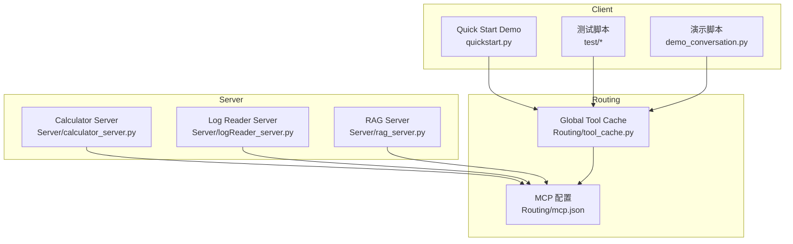
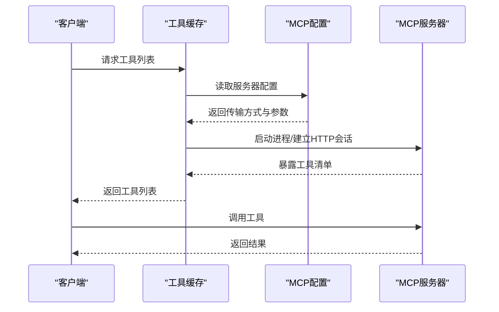
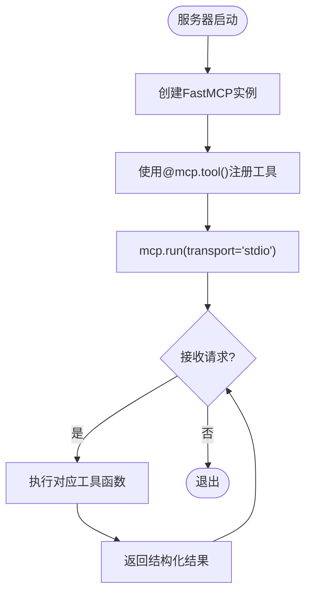
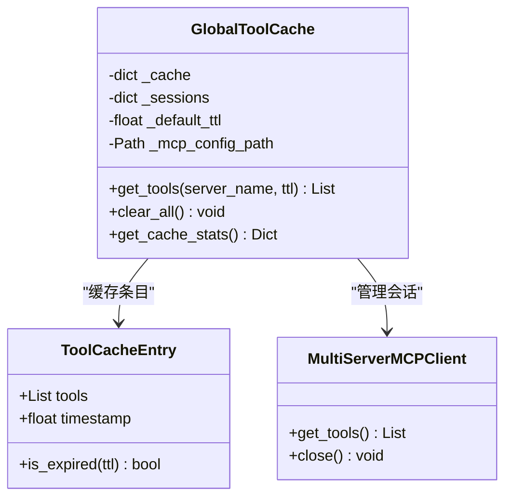
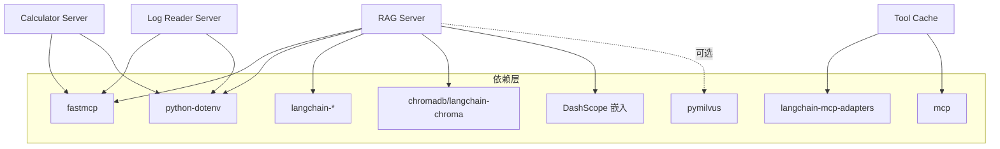

# 新MCP服务器开发

<cite>
**本文档引用的文件**
- [Server/calculator_server.py](file://Server/calculator_server.py)
- [Server/logReader_server.py](file://Server/logReader_server.py)
- [Server/rag_server.py](file://Server/rag_server.py)
- [Routing/tool_cache.py](file://Routing/tool_cache.py)
- [Routing/mcp.json](file://Routing/mcp.json)
- [quickstart.py](file://quickstart.py)
- [requirements.txt](file://requirements.txt)
- [README.md](file://README.md)
- [test/test_rag.py](file://test/test_rag.py)
- [test/test_chain_calculation.py](file://test/test_chain_calculation.py)
- [demo_conversation.py](file://demo_conversation.py)
</cite>

## 目录
1. [简介](#简介)
2. [项目结构](#项目结构)
3. [核心组件](#核心组件)
4. [架构总览](#架构总览)
5. [详细组件分析](#详细组件分析)
6. [依赖关系分析](#依赖关系分析)
7. [性能考虑](#性能考虑)
8. [故障排除指南](#故障排除指南)
9. [结论](#结论)
10. [附录](#附录)

## 简介
本指南面向希望基于现有MCP服务器实现开发新MCP服务器的开发者。文档解释MCP协议的基本概念与服务器架构设计原理，详细说明如何参考CalculatorServer、LogReaderServer、RAGServer的实现模式，完成新服务器的初始化、工具注册、消息处理与错误处理的完整流程。同时提供代码模板、配置示例、异步处理与工具缓存系统的集成方法、测试与调试步骤，以及性能优化最佳实践。

## 项目结构
该项目采用模块化设计，将MCP服务器实现与工具缓存、路由、会话管理等模块分离，便于维护与扩展。核心目录与职责如下：
- Server：MCP服务器实现（计算器、日志读取、RAG知识库）
- Routing：工具缓存、路由、会话管理与MCP配置
- test：单元测试与功能测试
- mcp_client：LangChain/LangGraph客户端（用于集成与测试）

**图表来源**
- [Server/calculator_server.py:1-111](file://Server/calculator_server.py#L1-L111)
- [Server/logReader_server.py:1-151](file://Server/logReader_server.py#L1-L151)
- [Server/rag_server.py:1-363](file://Server/rag_server.py#L1-L363)
- [Routing/tool_cache.py:1-302](file://Routing/tool_cache.py#L1-L302)
- [Routing/mcp.json:1-29](file://Routing/mcp.json#L1-L29)
- [quickstart.py:1-68](file://quickstart.py#L1-L68)
- [test/test_rag.py:1-50](file://test/test_rag.py#L1-L50)
- [test/test_chain_calculation.py:1-65](file://test/test_chain_calculation.py#L1-L65)
- [demo_conversation.py:1-102](file://demo_conversation.py#L1-L102)

**章节来源**
- [README.md:1-125](file://README.md#L1-L125)
- [requirements.txt:1-17](file://requirements.txt#L1-L17)

## 核心组件
本节概述MCP服务器开发所需的核心组件与职责：
- FastMCP实例：负责创建MCP服务器、注册工具、处理消息流
- 工具装饰器：通过@mcp.tool()将函数暴露为可调用工具
- 工具缓存系统：统一管理MCP服务器连接与工具列表，支持TTL缓存与多传输协议
- MCP配置文件：定义各服务器的传输方式、命令与参数
- 客户端集成：通过langchain-mcp-adapters加载工具，实现动态工具加载与会话管理

**章节来源**
- [Server/calculator_server.py:13-111](file://Server/calculator_server.py#L13-L111)
- [Server/logReader_server.py:14-151](file://Server/logReader_server.py#L14-L151)
- [Server/rag_server.py:44-363](file://Server/rag_server.py#L44-L363)
- [Routing/tool_cache.py:39-302](file://Routing/tool_cache.py#L39-L302)
- [Routing/mcp.json:1-29](file://Routing/mcp.json#L1-L29)

## 架构总览
下图展示了MCP服务器与客户端的交互架构：客户端通过工具缓存系统加载MCP服务器工具，工具缓存根据mcp.json配置选择stdio或streamable-http传输协议，服务器以stdio模式运行并暴露工具接口。

**图表来源**
- [Routing/tool_cache.py:85-196](file://Routing/tool_cache.py#L85-L196)
- [Routing/mcp.json:1-29](file://Routing/mcp.json#L1-L29)
- [Server/calculator_server.py:108-111](file://Server/calculator_server.py#L108-L111)
- [Server/logReader_server.py:148-151](file://Server/logReader_server.py#L148-L151)
- [Server/rag_server.py:356-363](file://Server/rag_server.py#L356-L363)

## 详细组件分析

### FastMCP服务器基础实现
- 服务器初始化：创建FastMCP实例，传入服务器名称
- 工具注册：使用@mcp.tool()装饰器将函数注册为工具
- 消息处理：以stdio模式运行，框架自动处理请求/响应
- 错误处理：在工具内部进行异常捕获与结构化返回

**图表来源**
- [Server/calculator_server.py:13-111](file://Server/calculator_server.py#L13-L111)
- [Server/logReader_server.py:14-151](file://Server/logReader_server.py#L14-L151)
- [Server/rag_server.py:44-363](file://Server/rag_server.py#L44-L363)

**章节来源**
- [Server/calculator_server.py:1-111](file://Server/calculator_server.py#L1-L111)
- [Server/logReader_server.py:1-151](file://Server/logReader_server.py#L1-L151)
- [Server/rag_server.py:1-363](file://Server/rag_server.py#L1-L363)

### 工具缓存系统与配置集成
- 全局工具缓存：单例模式，支持TTL过期与线程安全
- 多传输协议：支持stdio与streamable-http两种传输方式
- 配置驱动：通过mcp.json定义服务器命令、参数与传输方式
- 会话管理：保持客户端会话，避免重复加载

**图表来源**
- [Routing/tool_cache.py:39-302](file://Routing/tool_cache.py#L39-L302)

**章节来源**
- [Routing/tool_cache.py:1-302](file://Routing/tool_cache.py#L1-L302)
- [Routing/mcp.json:1-29](file://Routing/mcp.json#L1-L29)

### MCP配置文件格式与参数设置
- mcpServers：服务器集合
  - key：服务器名称（如calculator、log-reader、rag-knowledge）
  - command：启动命令（通常为python）
  - args：参数数组（相对路径指向Server目录下的具体服务器脚本）
  - transport：传输协议（stdio或streamable-http）
- 环境变量：可通过{ENV_VAR}占位符注入（如AMAP_API_KEY）

**章节来源**
- [Routing/mcp.json:1-29](file://Routing/mcp.json#L1-L29)

### 异步处理与工具缓存集成
- 异步加载：工具缓存使用async/await实现异步加载与会话管理
- TTL缓存：默认5分钟，避免重复加载服务器工具
- 会话复用：同一服务器的多次调用复用已建立的会话
- 超时控制：HTTP传输设置超时，防止阻塞

**章节来源**
- [Routing/tool_cache.py:85-243](file://Routing/tool_cache.py#L85-L243)

### 测试与调试方法
- 快速启动测试：通过quickstart.py验证Agent创建与工具加载
- 功能演示：demo_conversation.py展示工具缓存与多轮对话
- 单元测试：test/test_rag.py与test/test_chain_calculation.py分别验证RAG路由与链式计算

**章节来源**
- [quickstart.py:1-68](file://quickstart.py#L1-L68)
- [demo_conversation.py:1-102](file://demo_conversation.py#L1-L102)
- [test/test_rag.py:1-50](file://test/test_rag.py#L1-L50)
- [test/test_chain_calculation.py:1-65](file://test/test_chain_calculation.py#L1-L65)

## 依赖关系分析
- 服务器实现依赖FastMCP框架与dotenv环境变量加载
- 工具缓存依赖langchain-mcp-adapters与mcp协议库
- RAG服务器额外依赖ChromaDB、DashScope嵌入模型与可选的Milvus
- 客户端通过requirements.txt声明依赖

**图表来源**
- [requirements.txt:1-17](file://requirements.txt#L1-L17)
- [Server/calculator_server.py:5-10](file://Server/calculator_server.py#L5-L10)
- [Server/logReader_server.py:5-9](file://Server/logReader_server.py#L5-L9)
- [Server/rag_server.py:6-35](file://Server/rag_server.py#L6-L35)
- [Routing/tool_cache.py:18-24](file://Routing/tool_cache.py#L18-L24)

**章节来源**
- [requirements.txt:1-17](file://requirements.txt#L1-L17)

## 性能考虑
- 工具缓存：启用TTL缓存减少重复加载，建议根据服务器负载调整默认TTL
- 会话复用：避免频繁启动/销毁进程，提高响应速度
- 传输协议选择：本地工具使用stdio，远程服务使用streamable-http并设置合理超时
- 向量检索优化：RAG服务器支持ChromaDB与Milvus双后端，按场景选择合适后端并配置搜索参数
- 异步并发：利用异步加载与非阻塞I/O，避免主线程阻塞

## 故障排除指南
- 服务器无法启动
  - 检查mcp.json中command与args是否正确，确认相对路径解析
  - 确认Python虚拟环境已激活且依赖已安装
- 工具加载失败
  - 查看工具缓存日志，确认传输协议与超时设置
  - 检查环境变量是否正确注入（如AMAP_API_KEY）
- RAG搜索异常
  - 确认DashScope API密钥配置
  - 检查向量库初始化状态与权限
- 日志读取失败
  - 确认logs目录存在且文件可读
  - 检查文件编码与路径拼接

**章节来源**
- [Routing/tool_cache.py:198-243](file://Routing/tool_cache.py#L198-L243)
- [Server/rag_server.py:35-45](file://Server/rag_server.py#L35-L45)
- [Server/logReader_server.py:29-44](file://Server/logReader_server.py#L29-L44)

## 结论
通过参考CalculatorServer、LogReaderServer、RAGServer的实现模式，开发者可以快速构建新的MCP服务器。关键在于：正确初始化FastMCP实例、使用@mcp.tool()注册工具、以stdio模式运行、在工具内部进行完善的错误处理；同时通过mcp.json配置服务器参数，借助工具缓存系统实现高效的动态工具加载与会话管理。结合测试与调试脚本，能够有效验证与优化新服务器的功能与性能。

## 附录

### 新服务器开发步骤模板
- 创建服务器脚本：参考现有实现，创建FastMCP实例并注册工具
- 工具函数设计：确保输入参数类型明确、返回结构化结果、包含错误处理
- 服务器启动：在__main__中调用mcp.run(transport="stdio")
- 配置注册：在mcp.json中添加服务器配置，设置command、args与transport
- 集成测试：使用quickstart.py与demo_conversation.py验证工具加载与会话管理

**章节来源**
- [Server/calculator_server.py:108-111](file://Server/calculator_server.py#L108-L111)
- [Server/logReader_server.py:148-151](file://Server/logReader_server.py#L148-L151)
- [Server/rag_server.py:356-363](file://Server/rag_server.py#L356-L363)
- [Routing/mcp.json:7-27](file://Routing/mcp.json#L7-L27)

### 配置文件示例与参数说明
- 服务器配置字段
  - name：服务器唯一标识
  - command：启动命令（如python）
  - args：参数数组（相对路径指向Server目录下的脚本）
  - transport：传输协议（stdio或streamable-http）
- 环境变量注入：使用{ENV_VAR}占位符自动替换

**章节来源**
- [Routing/mcp.json:1-29](file://Routing/mcp.json#L1-L29)

### 测试与调试脚本
- 快速启动：验证Agent创建与工具加载数量
- 功能演示：展示工具缓存与多轮对话
- 单元测试：验证RAG路由与链式计算

**章节来源**
- [quickstart.py:1-68](file://quickstart.py#L1-L68)
- [demo_conversation.py:1-102](file://demo_conversation.py#L1-L102)
- [test/test_rag.py:1-50](file://test/test_rag.py#L1-L50)
- [test/test_chain_calculation.py:1-65](file://test/test_chain_calculation.py#L1-L65)