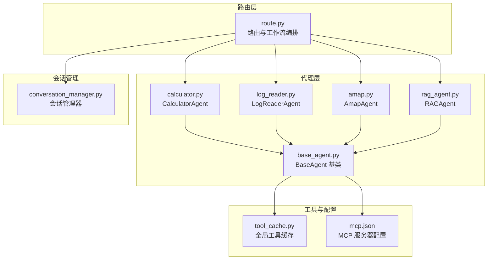
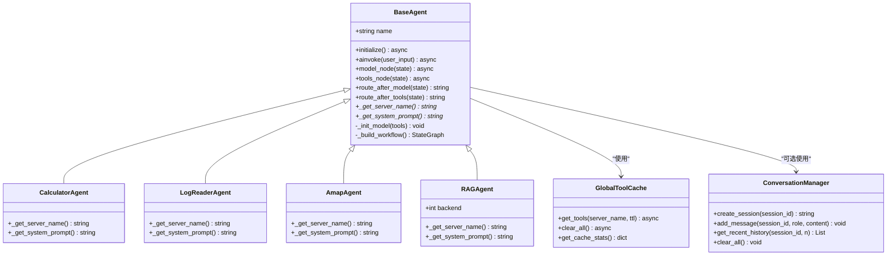
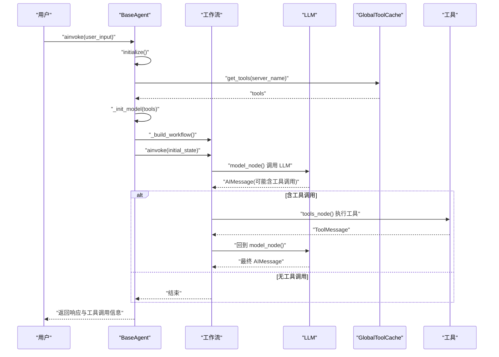
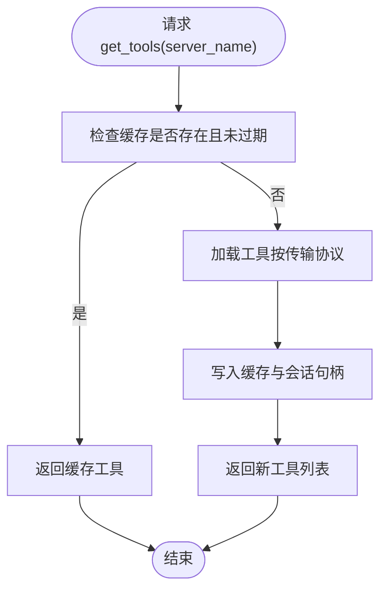
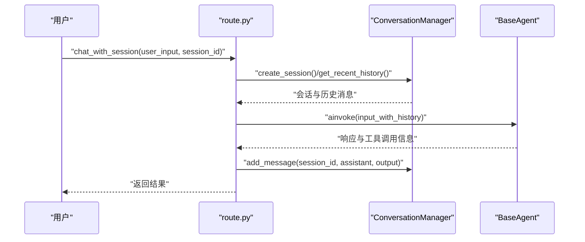
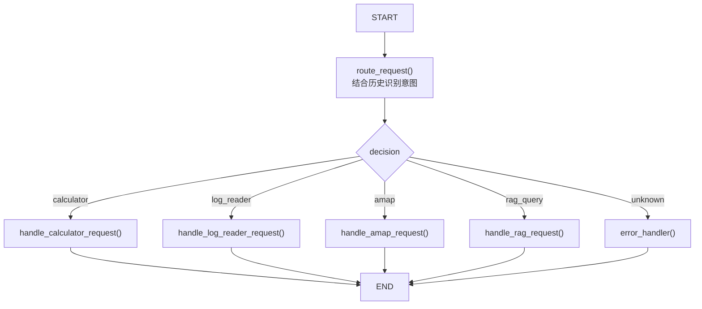
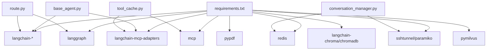

# 新代理类型实现

<cite>
**本文档引用的文件**
- [Routing/base_agent.py](file://Routing/base_agent.py)
- [Routing/tool_cache.py](file://Routing/tool_cache.py)
- [Routing/conversation_manager.py](file://Routing/conversation_manager.py)
- [Routing/route.py](file://Routing/route.py)
- [Routing/mcp.json](file://Routing/mcp.json)
- [Routing/calculator.py](file://Routing/calculator.py)
- [Routing/log_reader.py](file://Routing/log_reader.py)
- [Routing/amap.py](file://Routing/amap.py)
- [Routing/rag_agent.py](file://Routing/rag_agent.py)
- [requirements.txt](file://requirements.txt)
- [README.md](file://README.md)
- [test/test_chain_calculation.py](file://test/test_chain_calculation.py)
- [test/test_simple.py](file://test/test_simple.py)
- [demo_conversation.py](file://demo_conversation.py)
</cite>

## 目录
1. [简介](#简介)
2. [项目结构](#项目结构)
3. [核心组件](#核心组件)
4. [架构总览](#架构总览)
5. [详细组件分析](#详细组件分析)
6. [依赖分析](#依赖分析)
7. [性能考虑](#性能考虑)
8. [故障排除指南](#故障排除指南)
9. [结论](#结论)
10. [附录](#附录)

## 简介
本指南面向希望创建“新代理类型”的开发者，系统讲解基于 BaseAgent 基类的设计模式与扩展机制，结合 CalculatorAgent、LogReaderAgent、AmapAgent、RAGAgent 的实现范式，给出从“代理初始化、系统提示词配置、工具调用处理、工作流编排”到“代理工厂函数与向后兼容性、状态管理、消息处理与错误恢复”的完整开发流程。文档同时提供可视化架构图、序列图、流程图与最佳实践建议，帮助你在复杂业务场景中实现稳定的多步骤工作流。

## 项目结构
该项目采用模块化分层设计，围绕“路由-代理-工具缓存-会话管理-工作流编排”展开：
- 路由层：负责意图识别与代理选择，支持多轮对话上下文注入
- 代理层：统一基类 BaseAgent，封装模型调用、工具调用、状态流转
- 工具缓存层：全局单例缓存 MCP 服务器工具，避免重复加载
- 会话管理层：多轮对话上下文持久化与清理
- 配置层：MCP 服务器清单与环境变量

图表来源
- [Routing/route.py:260-291](file://Routing/route.py#L260-L291)
- [Routing/base_agent.py:238-256](file://Routing/base_agent.py#L238-L256)
- [Routing/tool_cache.py:301](file://Routing/tool_cache.py#L301)
- [Routing/mcp.json:1-29](file://Routing/mcp.json#L1-L29)
- [Routing/conversation_manager.py:82-275](file://Routing/conversation_manager.py#L82-L275)

章节来源
- [README.md:1-125](file://README.md#L1-L125)
- [Routing/route.py:1-553](file://Routing/route.py#L1-L553)
- [Routing/base_agent.py:1-497](file://Routing/base_agent.py#L1-L497)
- [Routing/tool_cache.py:1-302](file://Routing/tool_cache.py#L1-L302)
- [Routing/conversation_manager.py:1-275](file://Routing/conversation_manager.py#L1-L275)
- [Routing/mcp.json:1-29](file://Routing/mcp.json#L1-L29)

## 核心组件
- BaseAgent 基类：统一工具加载、消息处理、错误处理与工作流编排；子类仅需实现服务器名与系统提示词
- GlobalToolCache：全局单例缓存，按服务器名与 TTL 管理工具加载与连接生命周期
- ConversationManager：多轮对话上下文管理，支持内存与 Redis 持久化
- 路由工作流：LangGraph StateGraph，结合历史上下文进行意图识别与代理路由

章节来源
- [Routing/base_agent.py:29-318](file://Routing/base_agent.py#L29-L318)
- [Routing/tool_cache.py:39-301](file://Routing/tool_cache.py#L39-L301)
- [Routing/conversation_manager.py:82-275](file://Routing/conversation_manager.py#L82-L275)
- [Routing/route.py:259-291](file://Routing/route.py#L259-L291)

## 架构总览
下面的类图展示了 BaseAgent 及其具体实现类的关系，以及与工具缓存、会话管理的协作：

图表来源
- [Routing/base_agent.py:29-497](file://Routing/base_agent.py#L29-L497)
- [Routing/tool_cache.py:39-301](file://Routing/tool_cache.py#L39-L301)
- [Routing/conversation_manager.py:82-275](file://Routing/conversation_manager.py#L82-L275)

## 详细组件分析

### BaseAgent 基类设计与扩展机制
- 设计要点
  - 抽象方法：子类必须实现服务器名与系统提示词
  - 延迟初始化：首次调用才加载工具与构建工作流
  - 统一工作流：模型节点 → 工具节点 → 回到模型节点，直至无工具调用
  - 错误处理：捕获模型调用与工具执行异常，记录错误并回传
- 关键流程
  - 初始化：从全局缓存获取工具 → 绑定工具 → 构建 LangGraph 工作流
  - 推理：若无系统消息则注入系统提示词 → 调用 LLM → 更新状态
  - 工具调用：解析 AI 消息中的工具调用 → 通过缓存映射执行 → 生成工具消息
  - 路由：模型节点 → 判断是否含工具调用 → 工具有则进入工具节点 → 工具执行完回到模型节点

图表来源
- [Routing/base_agent.py:44-66](file://Routing/base_agent.py#L44-L66)
- [Routing/base_agent.py:102-130](file://Routing/base_agent.py#L102-L130)
- [Routing/base_agent.py:131-217](file://Routing/base_agent.py#L131-L217)
- [Routing/base_agent.py:238-256](file://Routing/base_agent.py#L238-L256)

章节来源
- [Routing/base_agent.py:29-318](file://Routing/base_agent.py#L29-L318)

### 工具缓存与连接管理
- 全局单例：进程生命周期内复用工具与会话
- TTL 过期：默认 300 秒，过期自动清理并重建连接
- 传输协议：支持 stdio 与 streamable-http，自动解析环境变量与相对路径
- 清理策略：显式 clear_all 与异常保护，避免资源泄漏

图表来源
- [Routing/tool_cache.py:85-117](file://Routing/tool_cache.py#L85-L117)
- [Routing/tool_cache.py:118-243](file://Routing/tool_cache.py#L118-L243)

章节来源
- [Routing/tool_cache.py:1-302](file://Routing/tool_cache.py#L1-L302)

### 会话管理与上下文保持
- 单例会话管理器：支持内存与 Redis 持久化，自动清理过期会话
- 多轮上下文：每次对话将用户与 AI 消息写入历史，路由时注入最近 N 条消息
- 统一接口：创建、添加、查询、清理、统计与全量清理

图表来源
- [Routing/route.py:351-414](file://Routing/route.py#L351-L414)
- [Routing/conversation_manager.py:122-184](file://Routing/conversation_manager.py#L122-L184)

章节来源
- [Routing/conversation_manager.py:1-275](file://Routing/conversation_manager.py#L1-L275)
- [Routing/route.py:111-147](file://Routing/route.py#L111-L147)

### 路由与工作流编排
- LangGraph StateGraph：定义状态字段（输入、会话ID、决策、输出、历史），节点函数负责具体代理调用
- 意图识别：结合历史上下文，使用 LLM 识别“calculator/log_reader/amap/rag_query”
- 条件边：根据决策路由到对应处理节点，最终汇聚到结束节点

图表来源
- [Routing/route.py:149-256](file://Routing/route.py#L149-L256)
- [Routing/route.py:259-291](file://Routing/route.py#L259-L291)

章节来源
- [Routing/route.py:1-553](file://Routing/route.py#L1-L553)

### 代理工厂函数与向后兼容性
- 工厂函数：每个具体代理提供异步工厂函数，内部创建实例并调用 initialize，确保工具缓存与工作流就绪
- 导出兼容：各代理模块导出类与工厂函数，保持对外 API 稳定
- 使用示例：测试脚本与演示脚本均展示工厂函数的使用方式

章节来源
- [Routing/calculator.py:1-11](file://Routing/calculator.py#L1-L11)
- [Routing/log_reader.py:1-11](file://Routing/log_reader.py#L1-L11)
- [Routing/amap.py:1-11](file://Routing/amap.py#L1-L11)
- [Routing/rag_agent.py:1-11](file://Routing/rag_agent.py#L1-L11)
- [Routing/base_agent.py:467-497](file://Routing/base_agent.py#L467-L497)
- [test/test_chain_calculation.py:14-65](file://test/test_chain_calculation.py#L14-L65)

### 代理初始化、系统提示词与工具调用处理
- 初始化流程：检查是否已初始化 → 从全局缓存获取工具 → 初始化 LLM 并绑定工具 → 构建工作流
- 系统提示词：子类实现 _get_system_prompt，模型节点在首次推理时注入 SystemMessage
- 工具调用：解析 AIMessage 中的 tool_calls → 通过缓存映射执行 → 生成 ToolMessage 并回传给模型继续推理

章节来源
- [Routing/base_agent.py:44-66](file://Routing/base_agent.py#L44-L66)
- [Routing/base_agent.py:102-130](file://Routing/base_agent.py#L102-L130)
- [Routing/base_agent.py:131-217](file://Routing/base_agent.py#L131-L217)

### 工作流编排与状态管理
- AgentState：messages、current_step、tool_calls、tool_results、final_response、error
- 节点状态推进：model → tools → model（直到无工具调用）
- 错误状态：任一环节异常写入 error 字段，最终响应以 error 为准

章节来源
- [Routing/base_agent.py:19-27](file://Routing/base_agent.py#L19-L27)
- [Routing/base_agent.py:219-236](file://Routing/base_agent.py#L219-L236)
- [Routing/base_agent.py:28-318](file://Routing/base_agent.py#L28-L318)

### 消息处理与错误恢复机制
- 消息类型：HumanMessage、AIMessage、SystemMessage、ToolMessage
- 错误恢复：模型调用失败、工具执行失败均记录错误并回传，最终状态包含 error 字段
- 异常保护：工具缓存清理过程静默处理异常，避免影响主流程

章节来源
- [Routing/base_agent.py:102-130](file://Routing/base_agent.py#L102-L130)
- [Routing/base_agent.py:131-217](file://Routing/base_agent.py#L131-L217)
- [Routing/tool_cache.py:244-290](file://Routing/tool_cache.py#L244-L290)

## 依赖分析
- 运行时依赖：LangChain、LangGraph、langchain-mcp-adapters、MCP 协议栈、Redis、SSH 隧道等
- 配置依赖：MCP 服务器清单、环境变量（API Key、LLM 配置）

图表来源
- [requirements.txt:1-17](file://requirements.txt#L1-L17)
- [Routing/base_agent.py:11-16](file://Routing/base_agent.py#L11-L16)
- [Routing/route.py:14-28](file://Routing/route.py#L14-L28)
- [Routing/tool_cache.py:18-24](file://Routing/tool_cache.py#L18-L24)
- [Routing/conversation_manager.py:100-120](file://Routing/conversation_manager.py#L100-L120)

章节来源
- [requirements.txt:1-17](file://requirements.txt#L1-L17)
- [Routing/base_agent.py:1-16](file://Routing/base_agent.py#L1-L16)
- [Routing/route.py:1-29](file://Routing/route.py#L1-L29)
- [Routing/tool_cache.py:1-25](file://Routing/tool_cache.py#L1-L25)
- [Routing/conversation_manager.py:1-120](file://Routing/conversation_manager.py#L1-L120)

## 性能考虑
- 工具缓存命中：首次加载工具成本高，后续调用直接命中缓存，显著降低延迟
- 连接复用：同一服务器的工具与会话在全局缓存中复用，减少 TCP/HTTP 建连开销
- TTL 控制：合理设置 TTL，在性能与资源占用间平衡
- 会话清理：定期清理过期会话，避免内存膨胀
- 超时控制：HTTP 传输设置超时，防止阻塞

章节来源
- [Routing/tool_cache.py:62-65](file://Routing/tool_cache.py#L62-L65)
- [Routing/tool_cache.py:217-223](file://Routing/tool_cache.py#L217-L223)
- [Routing/conversation_manager.py:234-253](file://Routing/conversation_manager.py#L234-L253)

## 故障排除指南
- 工具加载失败
  - 检查 MCP 服务器配置与传输协议
  - 确认环境变量（如高德 API Key）已正确设置
  - 查看缓存清理日志，必要时调用 clear_all 重置
- 会话持久化失败
  - Redis 连接失败时自动降级为内存模式
  - 检查 SSH 隧道配置与网络可达性
- 路由识别异常
  - 检查历史消息长度与格式，确保上下文清晰
  - 调整 LLM 参数（温度、模型）以提升意图识别稳定性
- 错误恢复
  - 所有异常均写入 error 字段，前端可根据状态码与错误信息进行提示
  - 工具执行失败时，工具节点会生成 ToolMessage 并回传给模型继续推理

章节来源
- [Routing/tool_cache.py:194-196](file://Routing/tool_cache.py#L194-L196)
- [Routing/tool_cache.py:244-290](file://Routing/tool_cache.py#L244-L290)
- [Routing/conversation_manager.py:112-119](file://Routing/conversation_manager.py#L112-L119)
- [Routing/route.py:196-233](file://Routing/route.py#L196-L233)
- [Routing/base_agent.py:122-129](file://Routing/base_agent.py#L122-L129)

## 结论
通过 BaseAgent 基类与全局工具缓存、会话管理的协同，系统实现了“统一抽象、可插拔扩展、稳定可靠”的代理体系。开发者只需专注于“服务器名与系统提示词”的实现，即可快速创建新的代理类型，并通过工厂函数与向后兼容导出，无缝接入现有路由与工作流。配合完善的错误处理与性能优化策略，可在复杂业务场景中实现可靠的多步骤工作流。

## 附录

### 如何创建一个新的代理类型（完整步骤）
- 步骤 1：继承 BaseAgent，实现抽象方法
  - 实现 _get_server_name：返回 MCP 服务器名称（需与 mcp.json 中一致）
  - 实现 _get_system_prompt：编写系统提示词，明确任务目标、约束与输出规范
- 步骤 2：创建代理模块与工厂函数
  - 在 Routing 目录新增 myagent.py，导出 MyAgent 类与 create_myagent_agent 工厂函数
  - 工厂函数内部创建实例并 await agent.initialize()
- 步骤 3：配置 MCP 服务器
  - 在 mcp.json 中添加对应服务器配置（stdio 或 streamable-http）
  - 若使用 HTTP，确保环境变量已设置（如 API Key）
- 步骤 4：注册到路由
  - 在 route.py 中导入 create_myagent_agent
  - 在 handle_myagent_request 节点中调用工厂函数并执行 agent.ainvoke
  - 在 route_request 与 route_decision 中增加“myagent”分支
- 步骤 5：测试与验证
  - 使用测试脚本验证链路：工具缓存、会话上下文、多轮对话
  - 参考现有测试用例组织测试流程

章节来源
- [Routing/base_agent.py:90-98](file://Routing/base_agent.py#L90-L98)
- [Routing/base_agent.py:467-497](file://Routing/base_agent.py#L467-L497)
- [Routing/mcp.json:1-29](file://Routing/mcp.json#L1-L29)
- [Routing/route.py:16-24](file://Routing/route.py#L16-L24)
- [Routing/route.py:61-109](file://Routing/route.py#L61-L109)
- [test/test_simple.py:11-103](file://test/test_simple.py#L11-L103)

### 代码示例与最佳实践
- 示例参考
  - 计算器代理：链式计算、工具调用提取与结果规范化
  - 日志代理：简洁提示词与明确职责边界
  - 地图代理：HTTP 传输与 API Key 注入
  - RAG 代理：后端参数注入与提示词差异化
- 最佳实践
  - 提示词明确：写出“严禁行为”“输出模板”，避免 LLM 自作主张
  - 工具调用严格：一次仅调用一个工具，按优先级与顺序执行
  - 上下文注入：在路由层将历史消息拼接到用户输入，提升理解一致性
  - 错误最小化：对工具返回进行结果抽取与格式化，避免泄露内部结构
  - 资源清理：对话结束调用 cleanup_all，确保缓存与会话被释放

章节来源
- [Routing/base_agent.py:322-401](file://Routing/base_agent.py#L322-L401)
- [Routing/base_agent.py:403-416](file://Routing/base_agent.py#L403-L416)
- [Routing/base_agent.py:418-431](file://Routing/base_agent.py#L418-L431)
- [Routing/base_agent.py:433-463](file://Routing/base_agent.py#L433-L463)
- [Routing/route.py:111-147](file://Routing/route.py#L111-L147)
- [test/demo_conversation.py:19-98](file://demo_conversation.py#L19-L98)