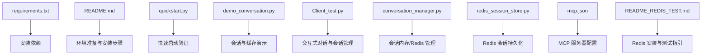
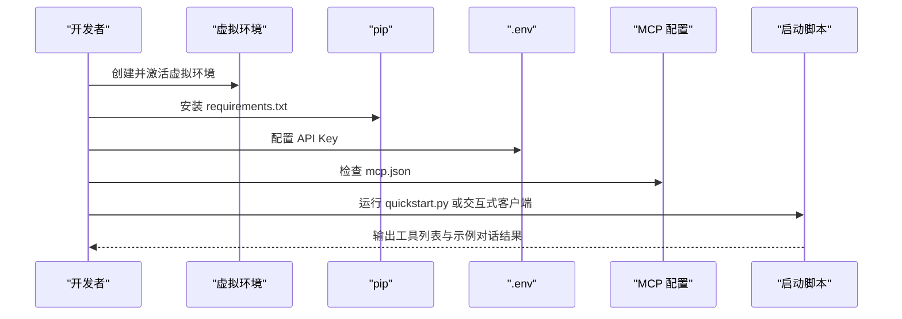
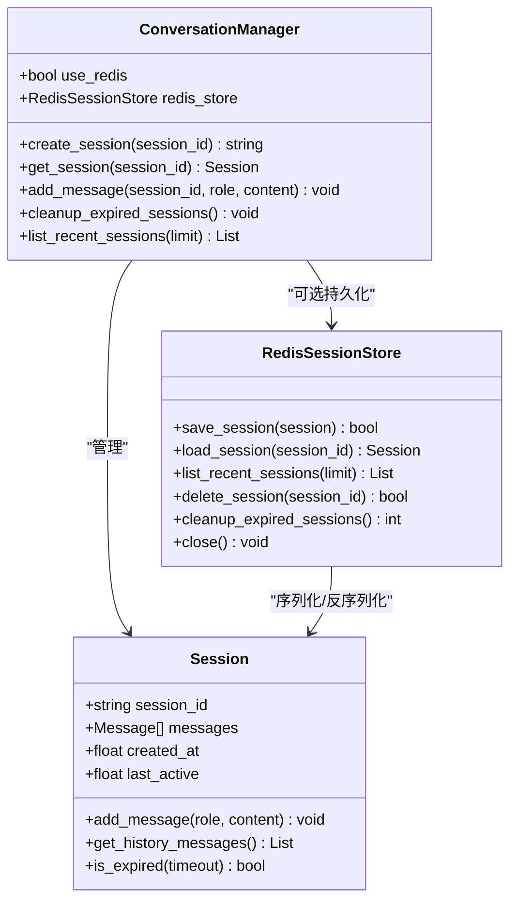
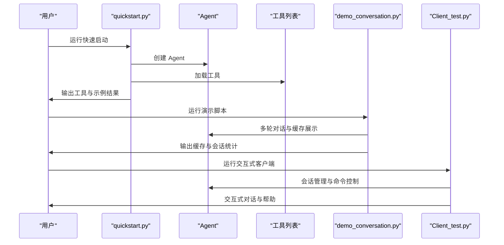
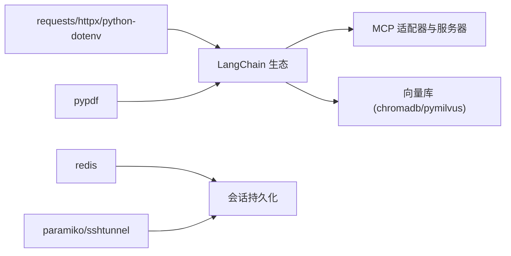

# 安装问题

<cite>
**本文引用的文件**
- [requirements.txt](file://requirements.txt)
- [README.md](file://README.md)
- [quickstart.py](file://quickstart.py)
- [demo_conversation.py](file://demo_conversation.py)
- [Client_test.py](file://Client/Client_test.py)
- [conversation_manager.py](file://Routing/conversation_manager.py)
- [redis_session_store.py](file://Routing/redis_session_store.py)
- [mcp.json](file://Routing/mcp.json)
- [README_REDIS_TEST.md](file://test/README_REDIS_TEST.md)
</cite>

## 目录
1. [简介](#简介)
2. [项目结构](#项目结构)
3. [核心组件](#核心组件)
4. [架构总览](#架构总览)
5. [详细组件分析](#详细组件分析)
6. [依赖关系分析](#依赖关系分析)
7. [性能考虑](#性能考虑)
8. [故障排除指南](#故障排除指南)
9. [结论](#结论)
10. [附录](#附录)

## 简介
本指南聚焦于 AiOps 项目的安装问题排查，覆盖 Python 版本兼容性、虚拟环境创建失败、依赖安装错误、pip 安装常见错误、不同操作系统（Windows/Linux/macOS）的安装注意事项、环境变量配置错误的诊断与修复、SSL 证书相关问题，以及完整的安装验证步骤与常见错误的快速解决方案。

## 项目结构
该项目采用模块化组织，核心安装相关文件包括：
- requirements.txt：定义 Python 依赖及其版本范围
- README.md：包含环境准备、安装与运行说明
- 快速启动与演示脚本：quickstart.py、demo_conversation.py、Client/Client_test.py
- 会话与 Redis 持久化：Routing/conversation_manager.py、Routing/redis_session_store.py
- MCP 服务器配置：Routing/mcp.json
- Redis 测试与说明：test/README_REDIS_TEST.md

**图表来源**
- [requirements.txt](file://requirements.txt)
- [README.md](file://README.md)
- [quickstart.py](file://quickstart.py)
- [demo_conversation.py](file://demo_conversation.py)
- [Client/Client_test.py](file://Client/Client_test.py)
- [Routing/conversation_manager.py](file://Routing/conversation_manager.py)
- [Routing/redis_session_store.py](file://Routing/redis_session_store.py)
- [Routing/mcp.json](file://Routing/mcp.json)
- [test/README_REDIS_TEST.md](file://test/README_REDIS_TEST.md)

**章节来源**
- [README.md](file://README.md)
- [requirements.txt](file://requirements.txt)

## 核心组件
- 依赖清单与版本约束：通过 requirements.txt 统一管理，包含 LangChain 生态、MCP 相关库、向量库、Redis、SSH 隧道、PDF 处理等。
- 环境准备与激活：README 提供虚拟环境创建与激活的跨平台命令。
- MCP 服务器配置：mcp.json 定义高德地图、计算器、日志读取、RAG 知识库等服务器连接方式。
- 会话与 Redis：会话管理器与 Redis 存储负责多轮对话的上下文持久化与恢复。
- 快速启动与演示：quickstart.py、demo_conversation.py、Client/Client_test.py 提供安装后的验证路径。

**章节来源**
- [requirements.txt](file://requirements.txt)
- [README.md](file://README.md)
- [Routing/mcp.json](file://Routing/mcp.json)
- [Routing/conversation_manager.py](file://Routing/conversation_manager.py)
- [Routing/redis_session_store.py](file://Routing/redis_session_store.py)
- [quickstart.py](file://quickstart.py)
- [demo_conversation.py](file://demo_conversation.py)
- [Client/Client_test.py](file://Client/Client_test.py)

## 架构总览
安装与运行涉及的关键流程：
- 环境准备：创建并激活虚拟环境
- 依赖安装：pip 安装 requirements.txt
- 环境变量配置：.env 文件配置 API Key
- MCP 服务器配置：mcp.json 指定服务器与传输方式
- 启动验证：运行 quickstart.py 或交互式客户端

**图表来源**
- [README.md](file://README.md)
- [requirements.txt](file://requirements.txt)
- [Routing/mcp.json](file://Routing/mcp.json)
- [quickstart.py](file://quickstart.py)
- [Client/Client_test.py](file://Client/Client_test.py)

## 详细组件分析

### 依赖清单与安装顺序
- 依赖分组与作用：
  - LangChain 生态：langchain、langchain-community、langchain-core、langchain-mcp-adapters、langchain-chroma
  - MCP 相关：fastmcp、mcp
  - 网络与请求：requests、httpx
  - 向量库：chromadb、pymilvus
  - 文档处理：pypdf
  - 缓存与会话：redis
  - SSH 与隧道：paramiko、sshtunnel
  - 环境变量：python-dotenv
- 安装顺序建议：
  - 优先安装网络与基础库（requests、httpx、python-dotenv）
  - 安装 LangChain 生态与 MCP 相关库
  - 安装向量库（chromadb、pymilvus）
  - 安装 redis、paramiko、sshtunnel
  - 安装 pypdf
- 版本要求注意：
  - Python >= 3.9（技术栈声明）
  - langchain >= 0.3.0、langchain-community >= 0.3.0、langchain-core >= 0.3.0
  - langchain-chroma >= 0.1.0
  - chromadb >= 0.4.0
  - pymilvus >= 2.4.0
  - paramiko 固定为 3.4.0（避免新版本移除 DSSKey 导致的兼容问题）

**章节来源**
- [requirements.txt](file://requirements.txt)
- [README.md](file://README.md)

### MCP 服务器配置与依赖
- mcp.json 定义了四个服务器：
  - 高德地图（streamable-http）
  - 计算器（stdio）
  - 日志读取（stdio）
  - RAG 知识库（stdio）
- 服务器启动与连接：
  - 高德地图通过 HTTP 流式传输访问
  - 本地服务器通过 Python 进程 stdio 通信
- 依赖影响：
  - 需要正确安装 fastmcp、mcp、langchain-mcp-adapters
  - 确保网络可达与 API Key 配置

**章节来源**
- [Routing/mcp.json](file://Routing/mcp.json)
- [requirements.txt](file://requirements.txt)

### 会话管理与 Redis 持久化
- 会话管理器（ConversationManager）：
  - 支持内存会话与 Redis 持久化
  - 提供创建、加载、清理、过期会话管理
- Redis 存储（RedisSessionStore）：
  - 会话元数据与消息列表的键空间设计
  - 活跃会话索引与历史会话列表
  - TTL 控制与过期清理
- Redis 测试与前置条件：
  - README_REDIS_TEST.md 提供本地安装、Docker、远程 Redis 与 SSH 隧道的部署指引
  - 包含 paramiko DSSKey 兼容性问题的解决方案

**图表来源**
- [Routing/conversation_manager.py](file://Routing/conversation_manager.py)
- [Routing/redis_session_store.py](file://Routing/redis_session_store.py)

**章节来源**
- [Routing/conversation_manager.py](file://Routing/conversation_manager.py)
- [Routing/redis_session_store.py](file://Routing/redis_session_store.py)
- [test/README_REDIS_TEST.md](file://test/README_REDIS_TEST.md)

### 快速启动与演示脚本
- quickstart.py：创建 Agent、列出工具、执行示例对话，异常时给出常见安装问题提示
- demo_conversation.py：演示工具缓存与多轮对话，展示会话管理与资源清理
- Client/Client_test.py：交互式对话、会话选择、命令控制（clear/info/stats/backend/help）

**图表来源**
- [quickstart.py](file://quickstart.py)
- [demo_conversation.py](file://demo_conversation.py)
- [Client/Client_test.py](file://Client/Client_test.py)

**章节来源**
- [quickstart.py](file://quickstart.py)
- [demo_conversation.py](file://demo_conversation.py)
- [Client/Client_test.py](file://Client/Client_test.py)

## 依赖关系分析
- 安装依赖的耦合与顺序：
  - 网络与基础库（requests、httpx、python-dotenv）为上层组件提供基础能力
  - LangChain 生态与 MCP 相关库依赖网络与基础库
  - 向量库（chromadb、pymilvus）对底层系统库有更高要求
  - redis、paramiko、sshtunnel 与会话/隧道功能强相关
- 外部依赖与集成点：
  - 高德地图 MCP 服务（HTTP 流式传输）
  - 本地 MCP 服务器（Python 进程 stdio）
  - Redis 作为会话持久化存储

**图表来源**
- [requirements.txt](file://requirements.txt)
- [Routing/mcp.json](file://Routing/mcp.json)
- [Routing/conversation_manager.py](file://Routing/conversation_manager.py)
- [Routing/redis_session_store.py](file://Routing/redis_session_store.py)

**章节来源**
- [requirements.txt](file://requirements.txt)
- [Routing/mcp.json](file://Routing/mcp.json)
- [Routing/conversation_manager.py](file://Routing/conversation_manager.py)
- [Routing/redis_session_store.py](file://Routing/redis_session_store.py)

## 性能考虑
- 依赖安装性能：
  - 分组安装可减少冲突与回滚重试
  - 使用镜像源或离线包可加速安装
- 运行性能：
  - 工具缓存与会话复用减少重复加载
  - 合理设置会话超时与历史长度
  - 向量库后端切换（ChromaDB/Milvus）影响检索性能与资源占用

[本节为通用指导，无需具体文件分析]

## 故障排除指南

### Python 版本兼容性问题
- 现象
  - 安装时报“不支持的 Python 版本”或运行时报错
- 原因
  - 项目技术栈要求 Python >= 3.9
- 解决方案
  - 升级至 Python 3.9 或更高版本
  - 使用 pyenv 或版本管理器确保虚拟环境使用正确版本

**章节来源**
- [README.md](file://README.md)

### 虚拟环境创建失败
- 现象
  - venv 创建失败、激活命令不生效
- 原因
  - Python 未正确安装或 PATH 未配置
  - 权限不足或磁盘空间不足
- 解决方案
  - Windows：使用管理员权限，确认 Python 已加入 PATH
  - Linux/macOS：使用 sudo 或检查 ~/.local/bin 是否在 PATH
  - 重新安装 Python 并确保安装 pip 与 venv

**章节来源**
- [README.md](file://README.md)

### 依赖包安装错误
- 现象
  - pip 安装失败、版本冲突、编译错误
- 常见原因
  - 网络不稳定、镜像源不可用
  - 依赖版本不兼容（如 langchain 与 langchain-community 版本不匹配）
  - 本地系统缺少编译依赖（C/C++ 编译器、头文件）
- 解决方案
  - 使用国内镜像源（如清华、阿里）加速下载
  - 按建议顺序安装，先网络与基础库，再 LangChain 生态，最后向量库与 redis
  - 安装系统编译工具链与依赖头文件
  - 若出现冲突，先卸载冲突包再重装

**章节来源**
- [requirements.txt](file://requirements.txt)
- [README.md](file://README.md)

### pip 安装过程中的常见错误
- SSL 证书错误
  - 现象：SSL: CERTIFICATE_VERIFY_FAILED
  - 解决：使用镜像源；在企业网络下配置代理；临时信任证书（仅开发环境）
- 权限错误
  - 现象：Permission denied
  - 解决：使用 --user 或虚拟环境；避免使用 sudo
- 依赖冲突
  - 现象：Requirement already satisfied 与 Uninstalling 循环
  - 解决：清理缓存、升级 pip/setuptools、使用 --force-reinstall

**章节来源**
- [README.md](file://README.md)

### 不同操作系统（Windows/Linux/macOS）的安装注意事项
- Windows
  - 使用 PowerShell 或 CMD，注意路径分隔符
  - 安装 Microsoft C++ Build Tools 以支持编译
  - 使用 venv\Scripts\activate
- Linux
  - Ubuntu/Debian：sudo apt install python3-venv python3-pip
  - CentOS/RHEL：sudo yum install python3-venv python3-pip
  - 使用 venv/bin/activate
- macOS
  - 使用 Homebrew 安装 Python 3.9+
  - 使用 venv/bin/activate
  - 若遇到 OpenSSL 相关问题，确保系统证书链有效

**章节来源**
- [README.md](file://README.md)

### 环境变量配置错误的诊断与修复
- 现象
  - 运行时报 API Key 未配置或为空
- 诊断
  - 检查 .env 文件是否存在且格式正确
  - 确认 DASHSCOPE_API_KEY 与 AMAP_API_KEY 已填写
- 修复
  - 在项目根目录创建 .env 文件并填入正确的 API Key
  - 运行前确保已加载 .env（脚本中已包含加载逻辑）

**章节来源**
- [README.md](file://README.md)

### SSL 证书相关的安装问题处理
- 现象
  - pip 下载失败，提示 SSL 证书错误
- 处理
  - 切换为国内镜像源
  - 在公司网络下配置 HTTP 代理
  - 临时信任证书（开发环境，不建议生产）

**章节来源**
- [README.md](file://README.md)

### Redis 相关安装与连接问题
- 现象
  - 集成测试失败、连接被拒绝、ping 失败
- 诊断
  - Redis 服务是否在 localhost:6379 运行
  - 防火墙是否阻断端口
  - 远程 Redis 是否通过 SSH 隧道正确转发
- 解决方案
  - 本地安装：Windows 下载 Redis for Windows；Linux/macOS 使用包管理器或 Docker
  - Docker：docker run -d --name redis-test -p 6379:6379 redis:latest
  - SSH 隧道：在 .env 中配置 SSH 参数，或手动建立隧道
  - 兼容性：若使用较新 paramiko，固定版本为 3.4.0 或更新 ssh_tunnel_manager 以移除对 DSSKey 的依赖

**章节来源**
- [test/README_REDIS_TEST.md](file://test/README_REDIS_TEST.md)
- [Routing/redis_session_store.py](file://Routing/redis_session_store.py)

### 安装验证步骤
- 步骤 1：创建并激活虚拟环境
  - 参考 README 的环境准备与激活命令
- 步骤 2：安装依赖
  - pip install -r requirements.txt
- 步骤 3：配置环境变量
  - 在 .env 中填入 API Key
- 步骤 4：运行快速启动
  - python quickstart.py，检查工具列表与示例结果
- 步骤 5：运行交互式客户端
  - python Client/Client_test.py，进行多轮对话与会话管理验证
- 步骤 6：Redis 验证（可选）
  - 使用 redis-cli ping 验证连接；或参考 README_REDIS_TEST.md 的测试脚本

**章节来源**
- [README.md](file://README.md)
- [quickstart.py](file://quickstart.py)
- [Client/Client_test.py](file://Client/Client_test.py)
- [test/README_REDIS_TEST.md](file://test/README_REDIS_TEST.md)

### 常见安装错误的快速解决方案
- “找不到模块”或“ImportError”
  - 确认已在正确虚拟环境中安装依赖
  - 检查 Python 版本与依赖版本兼容性
- “无法连接 MCP 服务器”
  - 检查 mcp.json 中的 URL 与传输方式
  - 确认网络可达与 API Key 配置
- “会话无法持久化”
  - 确认 Redis 服务运行正常
  - 检查 .env 中的 Redis/SSH 配置
- “paramiko DSSKey 不存在”
  - 固定 paramiko 版本为 3.4.0，或更新 ssh_tunnel_manager

**章节来源**
- [requirements.txt](file://requirements.txt)
- [Routing/mcp.json](file://Routing/mcp.json)
- [test/README_REDIS_TEST.md](file://test/README_REDIS_TEST.md)

## 结论
通过遵循本指南的安装步骤与故障排除策略，可有效解决 AiOps 项目在不同操作系统上的安装问题。重点在于：正确的 Python 版本、稳定的虚拟环境、按顺序安装的依赖、准确的环境变量配置、以及 Redis 与 MCP 服务器的正确部署与连接。安装完成后，利用 quickstart.py、demo_conversation.py 与 Client/Client_test.py 进行验证，可快速定位问题并确认系统正常运行。

[本节为总结性内容，无需具体文件分析]

## 附录

### 依赖安装顺序与版本要求对照表
- 网络与基础
  - requests >= 2.31.0
  - httpx >= 0.25.0
  - python-dotenv >= 1.0.0
- LangChain 生态
  - langchain >= 0.3.0
  - langchain-community >= 0.3.0
  - langchain-core >= 0.3.0
  - langchain-mcp-adapters >= 0.1.0
  - langchain-chroma >= 0.1.0
- MCP
  - fastmcp >= 0.1.0
  - mcp >= 1.0.0
- 向量库
  - chromadb >= 0.4.0
  - pymilvus >= 2.4.0
- 文档处理
  - pypdf >= 3.0.0
- 缓存与会话
  - redis >= 4.0.0
- SSH 与隧道
  - paramiko == 3.4.0
  - sshtunnel >= 0.4.0

**章节来源**
- [requirements.txt](file://requirements.txt)
- [README.md](file://README.md)