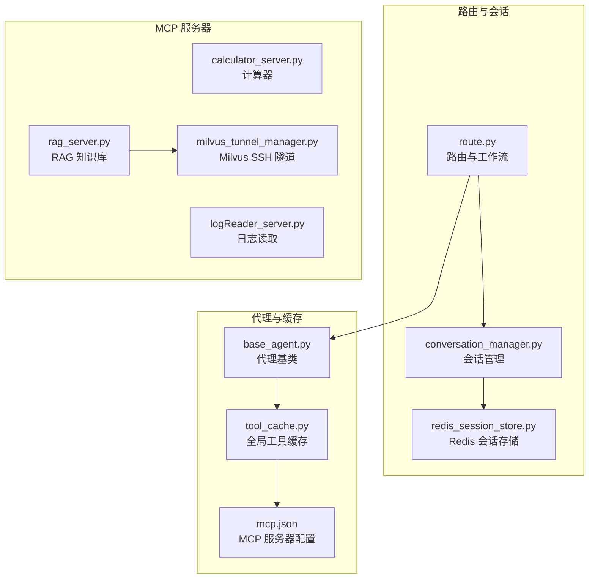
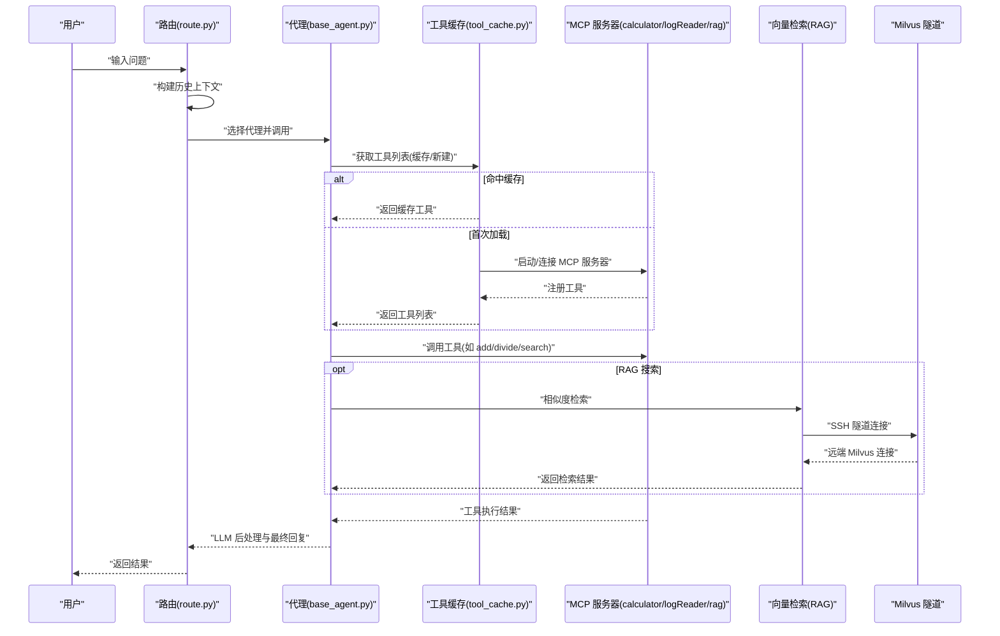
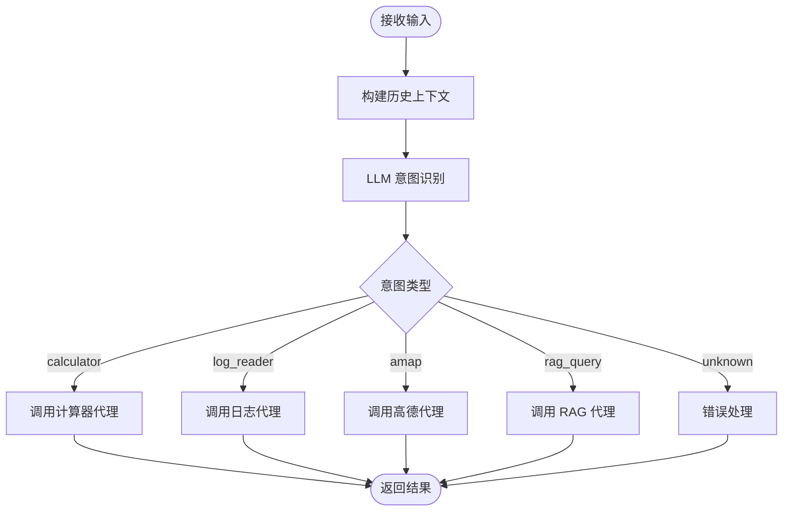
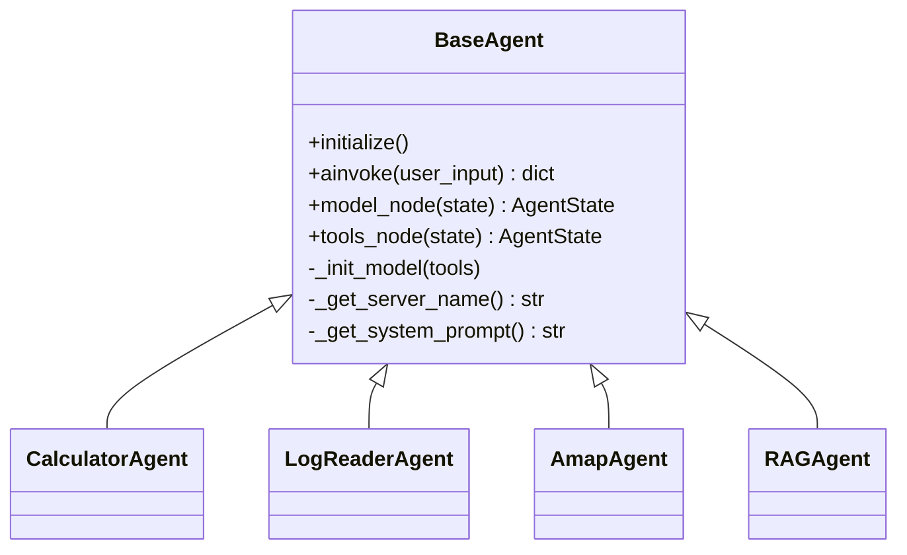
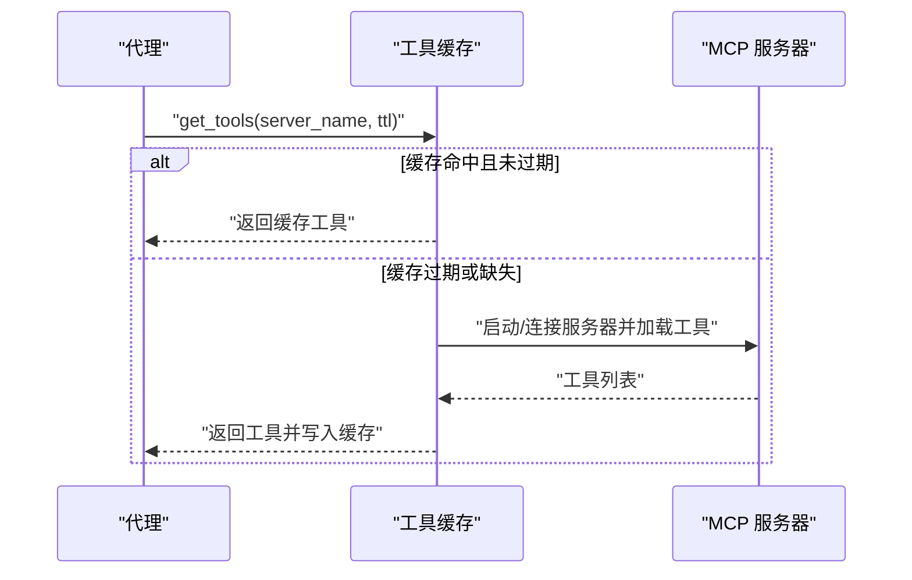
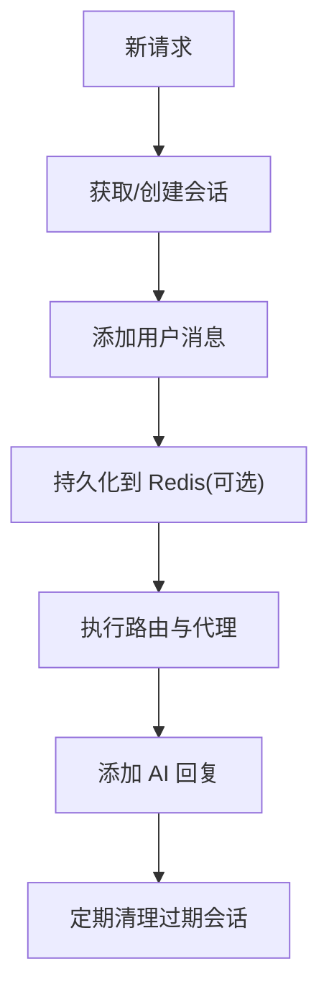
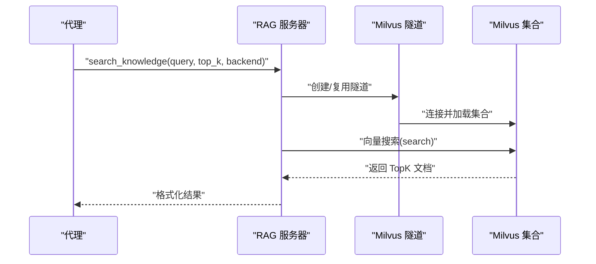
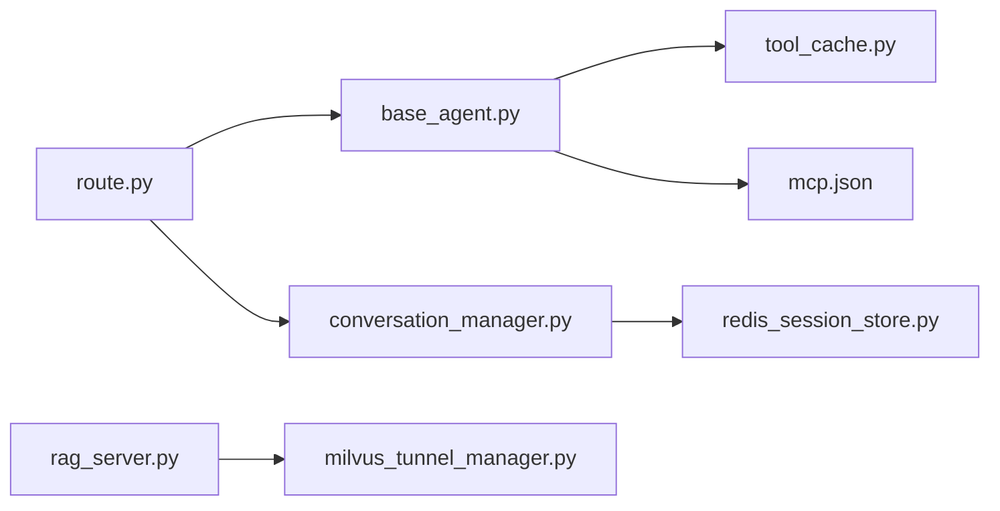

# 性能问题

<cite>
**本文档引用的文件**
- [README.md](file://README.md)
- [requirements.txt](file://requirements.txt)
- [mcp.json](file://Routing/mcp.json)
- [route.py](file://Routing/route.py)
- [base_agent.py](file://Routing/base_agent.py)
- [tool_cache.py](file://Routing/tool_cache.py)
- [conversation_manager.py](file://Routing/conversation_manager.py)
- [redis_session_store.py](file://Routing/redis_session_store.py)
- [milvus_tunnel_manager.py](file://Routing/milvus_tunnel_manager.py)
- [calculator_server.py](file://Server/calculator_server.py)
- [rag_server.py](file://Server/rag_server.py)
- [logReader_server.py](file://Server/logReader_server.py)
- [demo_conversation.py](file://demo_conversation.py)
- [test_rag.py](file://test/test_rag.py)
</cite>

## 目录
1. [简介](#简介)
2. [项目结构](#项目结构)
3. [核心组件](#核心组件)
4. [架构总览](#架构总览)
5. [详细组件分析](#详细组件分析)
6. [依赖分析](#依赖分析)
7. [性能考虑](#性能考虑)
8. [故障排查指南](#故障排查指南)
9. [结论](#结论)
10. [附录](#附录)

## 简介
本指南聚焦于 AiOps 项目在实际运行中的性能问题诊断与优化。围绕 CPU 使用率、内存占用、网络延迟、I/O 瓶颈等常见问题，结合项目现有架构与组件（LangGraph 工作流、MCP 工具缓存、会话与 Redis 存储、RAG 向量检索、SSH 隧道等），提供可操作的诊断流程、优化策略与最佳实践。同时给出日志分析中性能指标提取方法、不同场景的优化建议以及性能基准测试思路。

## 项目结构
项目采用“路由 + 代理 + MCP 工具”的分层架构：
- 路由层：根据用户输入与历史上下文，选择合适的专用代理（计算器、日志读取、高德地图、RAG 知识库）
- 代理层：每个代理封装 LLM 推理与工具调用，统一使用全局工具缓存
- 工具层：MCP 服务器（计算器、日志读取、RAG 知识库）以 stdio 或 streamable-http 方式提供工具
- 存储层：会话管理支持内存与 Redis 持久化；RAG 向量检索支持本地 ChromaDB 与远程 Milvus（SSH 隧道）

图表来源
- [route.py:1-553](file://Routing/route.py#L1-L553)
- [base_agent.py:1-497](file://Routing/base_agent.py#L1-L497)
- [tool_cache.py:1-302](file://Routing/tool_cache.py#L1-L302)
- [mcp.json:1-29](file://Routing/mcp.json#L1-L29)
- [conversation_manager.py:1-275](file://Routing/conversation_manager.py#L1-L275)
- [redis_session_store.py:1-228](file://Routing/redis_session_store.py#L1-L228)
- [calculator_server.py:1-111](file://Server/calculator_server.py#L1-L111)
- [rag_server.py:1-363](file://Server/rag_server.py#L1-L363)
- [logReader_server.py:1-151](file://Server/logReader_server.py#L1-L151)
- [milvus_tunnel_manager.py:1-101](file://Routing/milvus_tunnel_manager.py#L1-L101)

章节来源
- [README.md:1-125](file://README.md#L1-L125)
- [requirements.txt:1-17](file://requirements.txt#L1-L17)
- [mcp.json:1-29](file://Routing/mcp.json#L1-L29)

## 核心组件
- 路由与工作流：基于 LangGraph 的状态机，支持历史上下文注入与条件路由，减少不必要的工具调用与 LLM 推理次数
- 代理基类：统一封装 LLM 初始化、工具绑定、节点执行与错误处理，降低重复开销
- 全局工具缓存：对 MCP 服务器连接与工具列表进行缓存，避免重复加载与进程启动
- 会话管理：支持内存与 Redis 双层持久化，控制历史长度与过期清理，降低内存膨胀
- RAG 知识库：支持本地 ChromaDB 与远程 Milvus（SSH 隧道），提供向量检索与统计接口
- MCP 服务器：计算器、日志读取、RAG 知识库以 stdio 运行，减少网络开销

章节来源
- [route.py:1-553](file://Routing/route.py#L1-L553)
- [base_agent.py:1-497](file://Routing/base_agent.py#L1-L497)
- [tool_cache.py:1-302](file://Routing/tool_cache.py#L1-L302)
- [conversation_manager.py:1-275](file://Routing/conversation_manager.py#L1-L275)
- [rag_server.py:1-363](file://Server/rag_server.py#L1-L363)
- [calculator_server.py:1-111](file://Server/calculator_server.py#L1-L111)
- [logReader_server.py:1-151](file://Server/logReader_server.py#L1-L151)

## 架构总览
下图展示了典型请求从用户输入到工具执行与结果返回的完整链路，以及关键性能影响点（缓存命中、会话上下文、向量检索、SSH 隧道）：

图表来源
- [route.py:149-234](file://Routing/route.py#L149-L234)
- [base_agent.py:102-217](file://Routing/base_agent.py#L102-L217)
- [tool_cache.py:85-196](file://Routing/tool_cache.py#L85-L196)
- [rag_server.py:193-244](file://Server/rag_server.py#L193-L244)
- [milvus_tunnel_manager.py:20-90](file://Routing/milvus_tunnel_manager.py#L20-L90)

## 详细组件分析

### 路由与工作流（route.py）
- 作用：根据历史上下文与当前输入，调用 LLM 进行意图识别，路由到对应代理；支持多轮对话上下文拼接
- 性能要点：
  - 历史消息截断与限制长度，避免 LLM 输入膨胀导致推理变慢
  - 仅在必要时构建包含历史的输入，减少不必要的字符串拼接
  - 条件边路由避免无效分支执行

图表来源
- [route.py:149-234](file://Routing/route.py#L149-L234)
- [route.py:258-291](file://Routing/route.py#L258-L291)

章节来源
- [route.py:1-553](file://Routing/route.py#L1-L553)

### 代理基类与工具调用（base_agent.py）
- 作用：统一初始化 LLM、绑定工具、执行模型节点与工具节点，支持错误处理与结果提取
- 性能要点：
  - 工具调用前严格校验 AI 消息与工具调用字段，避免无效调用
  - 对工具返回进行“result”字段提取，减少 LLM 见到冗余信息
  - 通过全局缓存复用工具，避免重复加载

图表来源
- [base_agent.py:29-318](file://Routing/base_agent.py#L29-L318)

章节来源
- [base_agent.py:1-497](file://Routing/base_agent.py#L1-L497)

### 全局工具缓存（tool_cache.py）
- 作用：对 MCP 服务器连接与工具列表进行缓存，支持 TTL 过期、线程安全、不同传输协议（stdio/streamable-http）
- 性能要点：
  - 首次加载后缓存工具，显著降低后续请求的工具发现与连接成本
  - 支持 stdio 与 streamable-http 两种传输，按配置选择
  - 提供清理接口，对话结束或过期后及时释放资源

图表来源
- [tool_cache.py:85-196](file://Routing/tool_cache.py#L85-L196)
- [mcp.json:1-29](file://Routing/mcp.json#L1-L29)

章节来源
- [tool_cache.py:1-302](file://Routing/tool_cache.py#L1-L302)
- [mcp.json:1-29](file://Routing/mcp.json#L1-L29)

### 会话管理与 Redis 存储（conversation_manager.py、redis_session_store.py）
- 作用：管理多轮对话历史，支持内存与 Redis 持久化，自动清理过期会话
- 性能要点：
  - 限制历史消息数量，避免上下文过长导致 LLM 推理缓慢
  - Redis 持久化支持跨进程/容器共享会话，但需关注网络延迟与序列化开销
  - 定期清理过期会话，防止内存与磁盘膨胀

图表来源
- [conversation_manager.py:122-253](file://Routing/conversation_manager.py#L122-L253)
- [redis_session_store.py:36-220](file://Routing/redis_session_store.py#L36-L220)

章节来源
- [conversation_manager.py:1-275](file://Routing/conversation_manager.py#L1-L275)
- [redis_session_store.py:1-228](file://Routing/redis_session_store.py#L1-L228)

### RAG 知识库与 Milvus 隧道（rag_server.py、milvus_tunnel_manager.py）
- 作用：提供向量检索与统计接口，支持本地 ChromaDB 与远程 Milvus（通过 SSH 隧道）
- 性能要点：
  - 向量检索前建立 SSH 隧道与连接，注意隧道建立的时延
  - Milvus 查询参数（如 nprobe）与分页批量查询影响延迟与吞吐
  - 统计接口分批拉取源文件列表，避免一次性全量扫描

图表来源
- [rag_server.py:51-159](file://Server/rag_server.py#L51-L159)
- [milvus_tunnel_manager.py:20-90](file://Routing/milvus_tunnel_manager.py#L20-L90)

章节来源
- [rag_server.py:1-363](file://Server/rag_server.py#L1-L363)
- [milvus_tunnel_manager.py:1-101](file://Routing/milvus_tunnel_manager.py#L1-L101)

### MCP 服务器（calculator_server.py、logReader_server.py）
- 作用：提供计算器与日志读取工具，以 stdio 方式运行
- 性能要点：
  - stdio 启动成本低，适合轻量工具；复杂工具建议使用 streamable-http
  - 日志读取为纯文件 I/O，注意大文件读取与编码处理

章节来源
- [calculator_server.py:1-111](file://Server/calculator_server.py#L1-L111)
- [logReader_server.py:1-151](file://Server/logReader_server.py#L1-L151)

## 依赖分析
- 外部依赖：LangChain、LangGraph、FastMCP、DashScope Embeddings、ChromaDB、Milvus、Redis、Paramiko/SSHTunnel 等
- 组件耦合：
  - 路由依赖代理工厂与工具缓存
  - 代理依赖工具缓存与 LLM
  - RAG 依赖 Milvus 隧道与嵌入模型
  - 会话管理依赖 Redis 存储（可选）

图表来源
- [route.py:1-553](file://Routing/route.py#L1-L553)
- [base_agent.py:1-497](file://Routing/base_agent.py#L1-L497)
- [tool_cache.py:1-302](file://Routing/tool_cache.py#L1-L302)
- [mcp.json:1-29](file://Routing/mcp.json#L1-L29)
- [conversation_manager.py:1-275](file://Routing/conversation_manager.py#L1-L275)
- [redis_session_store.py:1-228](file://Routing/redis_session_store.py#L1-L228)
- [rag_server.py:1-363](file://Server/rag_server.py#L1-L363)
- [milvus_tunnel_manager.py:1-101](file://Routing/milvus_tunnel_manager.py#L1-L101)

章节来源
- [requirements.txt:1-17](file://requirements.txt#L1-L17)

## 性能考虑

### CPU 使用率过高
- 可能原因
  - LLM 推理与工具调用频繁，历史上下文过长
  - RAG 向量检索参数不当（nprobe 过小导致多次重试）
  - 工具缓存未生效导致重复加载
- 优化建议
  - 控制历史消息长度与截断策略，减少 LLM 输入规模
  - 调整 Milvus 搜索参数（如 nprobe），平衡精度与延迟
  - 确保工具缓存 TTL 设置合理，避免频繁重建连接
  - 对长文本工具返回进行裁剪或仅提取关键字段

章节来源
- [route.py:111-147](file://Routing/route.py#L111-L147)
- [rag_server.py:98-126](file://Server/rag_server.py#L98-L126)
- [tool_cache.py:62-66](file://Routing/tool_cache.py#L62-L66)

### 内存泄漏与内存膨胀
- 可能原因
  - 会话历史未清理或 TTL 设置过大
  - Redis 持久化未正确关闭连接
  - 工具缓存未清理导致会话句柄堆积
- 优化建议
  - 启用并定期调用会话清理（内存与 Redis 双层）
  - 在应用关闭时调用清理接口，确保连接与缓存释放
  - 控制会话最大历史条数，避免无限增长

章节来源
- [conversation_manager.py:234-253](file://Routing/conversation_manager.py#L234-L253)
- [redis_session_store.py:193-228](file://Routing/redis_session_store.py#L193-L228)
- [route.py:434-456](file://Routing/route.py#L434-L456)

### 网络延迟与连接抖动
- 可能原因
  - Milvus SSH 隧道建立失败或不稳定
  - streamable-http 连接超时
  - Redis 连接池未复用
- 优化建议
  - 预热 Milvus 隧道与连接，减少首次请求延迟
  - 为 HTTP 传输设置合理的超时与重试策略
  - 使用连接池与长连接，避免频繁握手

章节来源
- [milvus_tunnel_manager.py:20-90](file://Routing/milvus_tunnel_manager.py#L20-L90)
- [tool_cache.py:212-242](file://Routing/tool_cache.py#L212-L242)
- [redis_session_store.py:17-35](file://Routing/redis_session_store.py#L17-L35)

### I/O 瓶颈（日志读取、向量检索）
- 可能原因
  - 大日志文件全量读取
  - Milvus 批量查询未分页或字段过多
- 优化建议
  - 日志读取按需读取尾部行数，避免全量扫描
  - 向量检索限制返回字段与数量，分批查询

章节来源
- [logReader_server.py:18-103](file://Server/logReader_server.py#L18-L103)
- [rag_server.py:134-158](file://Server/rag_server.py#L134-L158)

### 并发与吞吐
- 策略
  - 使用异步工作流（LangGraph/AsyncIO）提升并发
  - 工具缓存与会话管理均支持异步接口
  - 合理设置 LLM 温度与提示词长度，减少推理时间
- 验证
  - 通过演示脚本观察缓存命中与会话生命周期

章节来源
- [demo_conversation.py:19-102](file://demo_conversation.py#L19-L102)
- [route.py:351-415](file://Routing/route.py#L351-L415)

### 缓存机制（连接池与工具缓存）
- 连接池
  - 工具缓存对 MCP 服务器连接进行复用，避免重复启动
  - HTTP 传输设置超时，避免阻塞
- 工具缓存
  - TTL 控制缓存有效期，避免过期工具导致异常
  - 支持清理接口，对话结束或异常时释放资源

章节来源
- [tool_cache.py:85-290](file://Routing/tool_cache.py#L85-L290)

### 日志分析中的性能指标提取
- 指标建议
  - 工具加载耗时（首次加载 vs 缓存命中）
  - LLM 推理耗时（模型节点）
  - 工具调用耗时（工具节点）
  - RAG 检索耗时（Milvus 隧道 + 搜索）
  - 会话持久化耗时（Redis 写入/读取）
- 方法
  - 在代理模型节点与工具节点之间埋点计时
  - 在 RAG 搜索前后记录时间戳
  - 在会话保存/加载前后记录耗时

章节来源
- [base_agent.py:102-217](file://Routing/base_agent.py#L102-L217)
- [rag_server.py:193-244](file://Server/rag_server.py#L193-L244)
- [redis_session_store.py:36-132](file://Routing/redis_session_store.py#L36-L132)

### 不同场景的优化建议
- 大数据量处理（RAG 检索）
  - 合理设置 Milvus 搜索参数与分页批量查询
  - 仅返回必要字段，减少序列化与传输开销
- 高并发请求
  - 使用异步工作流与连接池
  - 控制历史上下文长度，避免 LLM 输入膨胀
- 长时间运行任务（会话持久化）
  - 合理设置 TTL 与清理周期
  - 使用 Redis 持久化时关注网络延迟与序列化成本

章节来源
- [rag_server.py:98-158](file://Server/rag_server.py#L98-L158)
- [conversation_manager.py:234-253](file://Routing/conversation_manager.py#L234-L253)
- [redis_session_store.py:17-35](file://Routing/redis_session_store.py#L17-L35)

### 性能基准测试方法与工具推荐
- 方法
  - 基准脚本：对同一问题重复执行 N 次，统计平均/中位/95 分位耗时
  - 分层拆解：分别测量“工具加载/LLM 推理/工具调用/RAG 检索/会话持久化”
  - 压力测试：逐步增加并发数，观察延迟与错误率变化
- 工具建议
  - Python：timeit、cProfile、memory_profiler
  - 系统：top/htop、iotop、netstat/ss
  - 网络：ping/traceroute、Wireshark 抓包
  - Redis：redis-cli --latency、INFO 命令
  - Milvus：官方监控与日志

章节来源
- [requirements.txt:1-17](file://requirements.txt#L1-L17)

## 故障排查指南
- 工具加载失败
  - 检查 MCP 配置文件与传输协议
  - 查看工具缓存的异常打印与清理日志
- RAG 检索异常
  - 检查 Milvus 隧道是否建立成功
  - 核对嵌入模型 API Key 与集合名称
- 会话持久化失败
  - 检查 Redis 连接参数与网络连通性
  - 确认 TTL 设置与清理逻辑
- 日志读取异常
  - 检查日志文件路径与编码
  - 确认文件权限与是否存在

章节来源
- [mcp.json:1-29](file://Routing/mcp.json#L1-L29)
- [tool_cache.py:194-290](file://Routing/tool_cache.py#L194-L290)
- [rag_server.py:31-33](file://Server/rag_server.py#L31-L33)
- [milvus_tunnel_manager.py:84-90](file://Routing/milvus_tunnel_manager.py#L84-L90)
- [redis_session_store.py:193-228](file://Routing/redis_session_store.py#L193-L228)
- [logReader_server.py:40-58](file://Server/logReader_server.py#L40-L58)

## 结论
通过对路由、代理、缓存、会话与 RAG 检索等关键组件的性能分析与优化建议，可以在不改变整体架构的前提下显著提升系统稳定性与响应速度。建议优先实施以下措施：
- 启用并优化工具缓存与会话持久化
- 控制历史上下文长度与 LLM 输入规模
- 调优 Milvus 搜索参数与批量策略
- 建立完善的埋点与基准测试体系

## 附录
- 快速验证
  - 运行演示脚本观察缓存命中与会话生命周期
  - 使用测试脚本验证路由意图识别准确性

章节来源
- [demo_conversation.py:19-102](file://demo_conversation.py#L19-L102)
- [test_rag.py:14-49](file://test/test_rag.py#L14-L49)