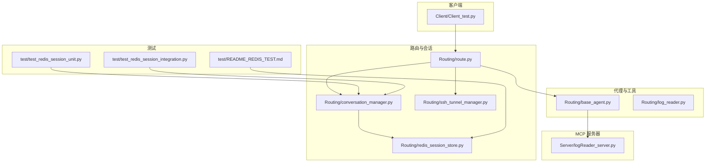
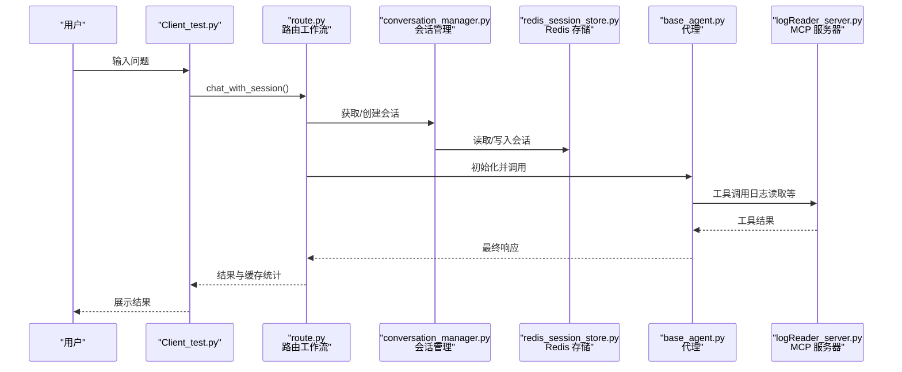
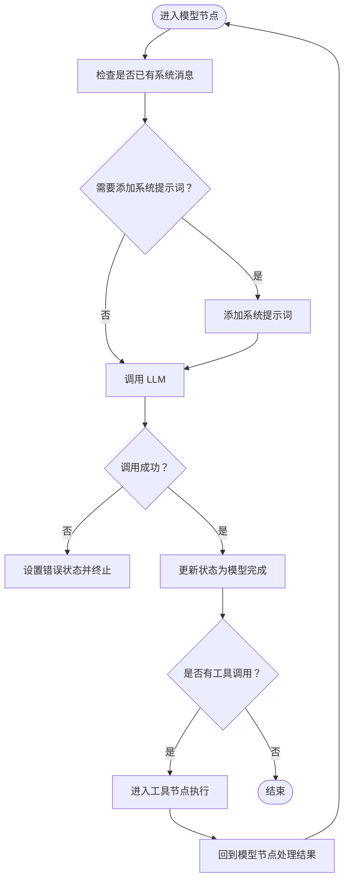
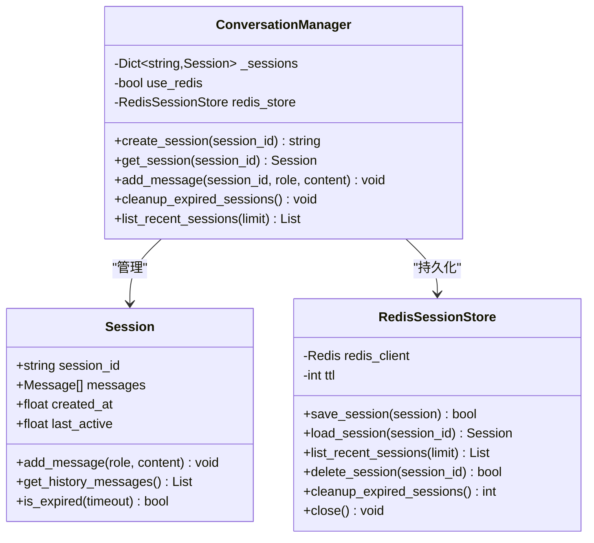
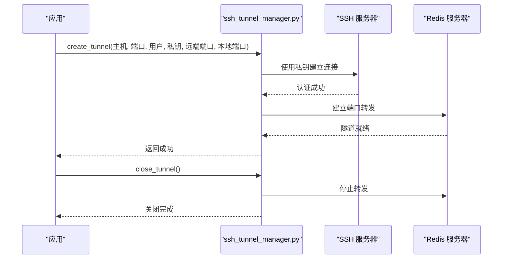
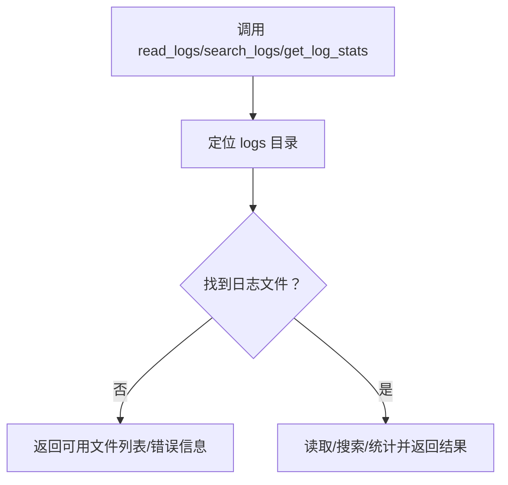
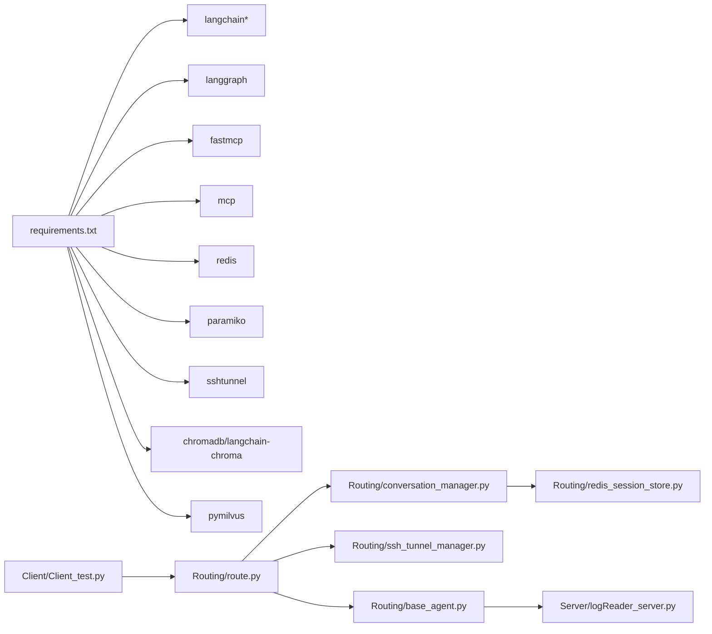

# 故障排除

<cite>
**本文引用的文件**   
- [README.md](file://README.md)
- [quickstart.py](file://quickstart.py)
- [requirements.txt](file://requirements.txt)
- [test/README_REDIS_TEST.md](file://test/README_REDIS_TEST.md)
- [Routing/base_agent.py](file://Routing/base_agent.py)
- [Routing/log_reader.py](file://Routing/log_reader.py)
- [Routing/redis_session_store.py](file://Routing/redis_session_store.py)
- [Routing/ssh_tunnel_manager.py](file://Routing/ssh_tunnel_manager.py)
- [Routing/conversation_manager.py](file://Routing/conversation_manager.py)
- [Routing/route.py](file://Routing/route.py)
- [Server/logReader_server.py](file://Server/logReader_server.py)
- [Client/Client_test.py](file://Client/Client_test.py)
- [test/test_redis_session_integration.py](file://test/test_redis_session_integration.py)
- [test/test_redis_session_unit.py](file://test/test_redis_session_unit.py)
</cite>

## 目录
1. [简介](#简介)
2. [项目结构](#项目结构)
3. [核心组件](#核心组件)
4. [架构总览](#架构总览)
5. [详细组件分析](#详细组件分析)
6. [依赖分析](#依赖分析)
7. [性能考虑](#性能考虑)
8. [故障排除指南](#故障排除指南)
9. [结论](#结论)
10. [附录](#附录)

## 简介
本指南面向 AiOps 项目的使用者与开发者，提供系统化的故障排除与调试方法。内容涵盖安装与环境配置、运行时异常、日志分析、网络与 Redis 连接诊断、工具缓存与会话持久化问题、性能优化建议，以及社区支持与问题反馈流程。文档以“问题-现象-原因-定位-修复”为主线，配合图示与参考路径，帮助快速定位并解决问题。

## 项目结构
项目采用模块化设计，围绕“路由与会话管理”“工具与代理”“MCP 服务器”“测试与验证”四个维度组织。关键目录与文件如下：
- Client：交互式客户端与会话管理入口
- Routing：路由、会话、工具缓存、SSH 隧道与基础代理
- Server：MCP 服务器（日志读取等）
- test：Redis 会话持久化单元与集成测试
- logs：日志目录（日志读取服务器读取）

**图表来源**
- [Client/Client_test.py:1-230](file://Client/Client_test.py#L1-L230)
- [Routing/route.py:298-328](file://Routing/route.py#L298-L328)
- [Routing/conversation_manager.py:100-121](file://Routing/conversation_manager.py#L100-L121)
- [Routing/redis_session_store.py:14-35](file://Routing/redis_session_store.py#L14-L35)
- [Routing/ssh_tunnel_manager.py:12-100](file://Routing/ssh_tunnel_manager.py#L12-L100)
- [Routing/base_agent.py:29-66](file://Routing/base_agent.py#L29-L66)
- [Routing/log_reader.py:1-11](file://Routing/log_reader.py#L1-L11)
- [Server/logReader_server.py:148-151](file://Server/logReader_server.py#L148-L151)
- [test/test_redis_session_unit.py:1-294](file://test/test_redis_session_unit.py#L1-L294)
- [test/test_redis_session_integration.py:1-328](file://test/test_redis_session_integration.py#L1-L328)
- [test/README_REDIS_TEST.md:1-174](file://test/README_REDIS_TEST.md#L1-L174)

**章节来源**
- [README.md:5-36](file://README.md#L5-L36)
- [requirements.txt:1-17](file://requirements.txt#L1-L17)

## 核心组件
- 基础代理与工作流：统一工具加载、消息处理、错误处理与 LangGraph 工作流编排
- 会话管理：内存与 Redis 双层缓存，支持历史消息、过期清理与并发会话
- SSH 隧道：安全连接远程 Redis，支持多种密钥类型与错误处理
- MCP 服务器：日志读取工具，提供读取、搜索与统计接口
- 客户端：循环对话、会话选择、工具缓存统计、RAG 后端切换与资源清理

**章节来源**
- [Routing/base_agent.py:29-66](file://Routing/base_agent.py#L29-L66)
- [Routing/conversation_manager.py:82-121](file://Routing/conversation_manager.py#L82-L121)
- [Routing/ssh_tunnel_manager.py:12-100](file://Routing/ssh_tunnel_manager.py#L12-L100)
- [Server/logReader_server.py:18-103](file://Server/logReader_server.py#L18-L103)
- [Client/Client_test.py:40-230](file://Client/Client_test.py#L40-L230)

## 架构总览
下图展示从客户端发起请求到工具执行与结果返回的关键路径，以及会话持久化与 SSH 隧道的集成点。

**图表来源**
- [Client/Client_test.py:180-198](file://Client/Client_test.py#L180-L198)
- [Routing/route.py:258-291](file://Routing/route.py#L258-L291)
- [Routing/conversation_manager.py:148-184](file://Routing/conversation_manager.py#L148-L184)
- [Routing/redis_session_store.py:36-88](file://Routing/redis_session_store.py#L36-L88)
- [Routing/base_agent.py:102-130](file://Routing/base_agent.py#L102-L130)
- [Server/logReader_server.py:18-103](file://Server/logReader_server.py#L18-L103)

## 详细组件分析

### 组件A：基础代理与工具调用
- 统一初始化：从全局工具缓存加载工具，绑定 LLM 并构建工作流
- 模型节点：注入系统提示词，调用 LLM，捕获异常并记录错误
- 工具节点：解析工具调用，执行并构造 ToolMessage，仅传递必要字段
- 路由逻辑：根据 AI 消息是否包含工具调用决定下一步

**图表来源**
- [Routing/base_agent.py:102-130](file://Routing/base_agent.py#L102-L130)
- [Routing/base_agent.py:131-217](file://Routing/base_agent.py#L131-L217)
- [Routing/base_agent.py:219-236](file://Routing/base_agent.py#L219-L236)

**章节来源**
- [Routing/base_agent.py:29-66](file://Routing/base_agent.py#L29-L66)
- [Routing/base_agent.py:102-130](file://Routing/base_agent.py#L102-L130)
- [Routing/base_agent.py:131-217](file://Routing/base_agent.py#L131-L217)
- [Routing/base_agent.py:219-236](file://Routing/base_agent.py#L219-L236)

### 组件B：会话管理与 Redis 持久化
- 会话对象：消息队列、时间戳、历史长度限制
- 会话管理器：内存优先，Redis 备份；自动清理过期会话；提供历史与统计接口
- Redis 存储：会话元数据、消息列表、活跃会话索引与历史列表；TTL 控制；过期清理

**图表来源**
- [Routing/conversation_manager.py:35-80](file://Routing/conversation_manager.py#L35-L80)
- [Routing/conversation_manager.py:82-121](file://Routing/conversation_manager.py#L82-L121)
- [Routing/redis_session_store.py:14-35](file://Routing/redis_session_store.py#L14-L35)

**章节来源**
- [Routing/conversation_manager.py:122-147](file://Routing/conversation_manager.py#L122-L147)
- [Routing/conversation_manager.py:148-184](file://Routing/conversation_manager.py#L148-L184)
- [Routing/conversation_manager.py:234-253](file://Routing/conversation_manager.py#L234-L253)
- [Routing/redis_session_store.py:36-88](file://Routing/redis_session_store.py#L36-L88)
- [Routing/redis_session_store.py:193-219](file://Routing/redis_session_store.py#L193-L219)

### 组件C：SSH 隧道与远程 Redis
- 支持多种密钥类型加载；创建隧道并启动；异常处理与资源关闭
- 客户端通过环境变量配置 SSH 主机、端口、用户、私钥路径与本地/远端端口映射

**图表来源**
- [Routing/ssh_tunnel_manager.py:19-80](file://Routing/ssh_tunnel_manager.py#L19-L80)
- [Routing/route.py:298-328](file://Routing/route.py#L298-L328)

**章节来源**
- [Routing/ssh_tunnel_manager.py:12-100](file://Routing/ssh_tunnel_manager.py#L12-L100)
- [Routing/route.py:298-328](file://Routing/route.py#L298-L328)

### 组件D：MCP 日志读取服务器
- 提供 read_logs、search_logs、get_log_stats 三类工具
- 从 logs 目录读取日志文件，支持多种文件名；异常时返回错误信息

**图表来源**
- [Server/logReader_server.py:18-103](file://Server/logReader_server.py#L18-L103)
- [Server/logReader_server.py:105-145](file://Server/logReader_server.py#L105-L145)

**章节来源**
- [Server/logReader_server.py:18-103](file://Server/logReader_server.py#L18-L103)
- [Server/logReader_server.py:105-145](file://Server/logReader_server.py#L105-L145)

## 依赖分析
- Python 与第三方库：LangChain、LangGraph、FastMCP、MCP 协议、Redis、Paramiko、SSH 隧道、向量库（ChromaDB/Milvus）
- 组件耦合：客户端依赖路由与会话管理；路由依赖代理与工具缓存；代理依赖 MCP 服务器；会话管理依赖 Redis 存储；SSH 隧道为远程 Redis 提供通道

**图表来源**
- [requirements.txt:1-17](file://requirements.txt#L1-L17)
- [Client/Client_test.py:22-23](file://Client/Client_test.py#L22-L23)
- [Routing/route.py:298-328](file://Routing/route.py#L298-L328)
- [Routing/conversation_manager.py:112-118](file://Routing/conversation_manager.py#L112-L118)
- [Routing/redis_session_store.py:27-33](file://Routing/redis_session_store.py#L27-L33)
- [Routing/ssh_tunnel_manager.py:12-18](file://Routing/ssh_tunnel_manager.py#L12-L18)
- [Routing/base_agent.py:50-51](file://Routing/base_agent.py#L50-L51)
- [Server/logReader_server.py:5](file://Server/logReader_server.py#L5)

**章节来源**
- [requirements.txt:1-17](file://requirements.txt#L1-L17)

## 性能考虑
- 工具调用与消息序列化：尽量减少不必要的工具调用次数，避免大体积消息频繁写入 Redis
- 会话 TTL 与清理：合理设置会话 TTL 与过期清理周期，平衡内存占用与恢复需求
- SSH 隧道稳定性：在高并发场景下，确保隧道资源及时释放，避免连接泄漏
- 向量库选择：本地 ChromaDB 适合小规模数据，远程 Milvus 适合大规模检索，注意网络延迟与参数传递

[本节为通用指导，无需引用具体文件]

## 故障排除指南

### 一、安装与环境问题
- 症状：运行时报模块导入错误或依赖缺失
  - 排查：确认虚拟环境已激活，依赖已安装
  - 参考：[requirements.txt:1-17](file://requirements.txt#L1-L17)
- 症状：运行快速启动脚本报错
  - 排查：检查虚拟环境、依赖安装、.env 中 API Key 配置
  - 参考：[quickstart.py:61-68](file://quickstart.py#L61-L68)

**章节来源**
- [requirements.txt:1-17](file://requirements.txt#L1-L17)
- [quickstart.py:61-68](file://quickstart.py#L61-L68)

### 二、配置错误
- 症状：MCP 服务器无法连接或工具不可用
  - 排查：确认 MCP 服务器已启动，客户端工具缓存加载正常
  - 参考：[Routing/base_agent.py:44-66](file://Routing/base_agent.py#L44-L66)
- 症状：日志读取工具报“日志文件不存在”
  - 排查：确认 logs 目录存在，文件名为 app.log 或 Logs.txt
  - 参考：[Server/logReader_server.py:29-44](file://Server/logReader_server.py#L29-L44)

**章节来源**
- [Routing/base_agent.py:44-66](file://Routing/base_agent.py#L44-L66)
- [Server/logReader_server.py:29-44](file://Server/logReader_server.py#L29-L44)

### 三、运行时异常
- 症状：代理调用 LLM 失败或工具执行异常
  - 排查：查看代理错误处理分支，定位具体异常来源
  - 参考：[Routing/base_agent.py:122-129](file://Routing/base_agent.py#L122-L129)，[Routing/base_agent.py:196-210](file://Routing/base_agent.py#L196-L210)
- 症状：客户端交互中断或资源未清理
  - 排查：确认信号处理与资源清理流程
  - 参考：[Client/Client_test.py:26-38](file://Client/Client_test.py#L26-L38)，[Client/Client_test.py:202-216](file://Client/Client_test.py#L202-L216)

**章节来源**
- [Routing/base_agent.py:122-129](file://Routing/base_agent.py#L122-L129)
- [Routing/base_agent.py:196-210](file://Routing/base_agent.py#L196-L210)
- [Client/Client_test.py:26-38](file://Client/Client_test.py#L26-L38)
- [Client/Client_test.py:202-216](file://Client/Client_test.py#L202-L216)

### 四、日志分析
- 症状：日志读取失败或结果为空
  - 排查：确认日志文件存在与可读，关键词大小写不敏感
  - 参考：[Server/logReader_server.py:60-102](file://Server/logReader_server.py#L60-L102)，[Server/logReader_server.py:105-145](file://Server/logReader_server.py#L105-L145)
- 症状：日志读取服务器未启动
  - 排查：确认以 stdio 模式运行
  - 参考：[Server/logReader_server.py:148-151](file://Server/logReader_server.py#L148-L151)

**章节来源**
- [Server/logReader_server.py:60-102](file://Server/logReader_server.py#L60-L102)
- [Server/logReader_server.py:105-145](file://Server/logReader_server.py#L105-L145)
- [Server/logReader_server.py:148-151](file://Server/logReader_server.py#L148-L151)

### 五、网络与 Redis 诊断
- 症状：Redis 连接失败或集成测试失败
  - 排查：确认 Redis 服务运行、端口可达、防火墙放行；若使用远程 Redis，检查 SSH 隧道
  - 参考：[test/README_REDIS_TEST.md:96-107](file://test/README_REDIS_TEST.md#L96-L107)，[test/README_REDIS_TEST.md:45-64](file://test/README_REDIS_TEST.md#L45-L64)
- 症状：Paramiko DSSKey 报错
  - 排查：降级 paramiko 或更新 ssh_tunnel_manager 的密钥加载逻辑
  - 参考：[test/README_REDIS_TEST.md:68-78](file://test/README_REDIS_TEST.md#L68-L78)，[Routing/ssh_tunnel_manager.py:42-59](file://Routing/ssh_tunnel_manager.py#L42-L59)
- 症状：会话无法加载或过期清理异常
  - 排查：检查 Redis 中会话键结构、TTL 设置与过期清理逻辑
  - 参考：[Routing/redis_session_store.py:193-219](file://Routing/redis_session_store.py#L193-L219)，[Routing/conversation_manager.py:234-253](file://Routing/conversation_manager.py#L234-L253)

**章节来源**
- [test/README_REDIS_TEST.md:96-107](file://test/README_REDIS_TEST.md#L96-L107)
- [test/README_REDIS_TEST.md:45-64](file://test/README_REDIS_TEST.md#L45-L64)
- [test/README_REDIS_TEST.md:68-78](file://test/README_REDIS_TEST.md#L68-L78)
- [Routing/ssh_tunnel_manager.py:42-59](file://Routing/ssh_tunnel_manager.py#L42-L59)
- [Routing/redis_session_store.py:193-219](file://Routing/redis_session_store.py#L193-L219)
- [Routing/conversation_manager.py:234-253](file://Routing/conversation_manager.py#L234-L253)

### 六、性能问题诊断与优化
- 诊断：观察工具缓存命中率、会话持久化写入频率、SSH 隧道连接数
- 优化建议：
  - 合理设置会话 TTL 与历史长度，减少 Redis 写放大
  - 使用内存缓存热点会话，降低 Redis 压力
  - 在高并发场景下，评估 Milvus 远程向量库的网络延迟
- 参考：[Client/Client_test.py:149-156](file://Client/Client_test.py#L149-L156)，[Routing/conversation_manager.py:100-121](file://Routing/conversation_manager.py#L100-L121)

**章节来源**
- [Client/Client_test.py:149-156](file://Client/Client_test.py#L149-L156)
- [Routing/conversation_manager.py:100-121](file://Routing/conversation_manager.py#L100-L121)

### 七、测试与回归
- 单元测试：验证启动逻辑、会话创建与保存、消息同步、资源清理
  - 参考：[test/test_redis_session_unit.py:22-46](file://test/test_redis_session_unit.py#L22-L46)，[test/test_redis_session_unit.py:90-132](file://test/test_redis_session_unit.py#L90-L132)
- 集成测试：验证真实 Redis 环境下的会话生命周期、恢复、并发与过期清理
  - 参考：[test/test_redis_session_integration.py:26-107](file://test/test_redis_session_integration.py#L26-L107)，[test/test_redis_session_integration.py:110-168](file://test/test_redis_session_integration.py#L110-L168)

**章节来源**
- [test/test_redis_session_unit.py:22-46](file://test/test_redis_session_unit.py#L22-L46)
- [test/test_redis_session_unit.py:90-132](file://test/test_redis_session_unit.py#L90-L132)
- [test/test_redis_session_integration.py:26-107](file://test/test_redis_session_integration.py#L26-L107)
- [test/test_redis_session_integration.py:110-168](file://test/test_redis_session_integration.py#L110-L168)

### 八、社区支持与问题反馈
- 项目贡献：欢迎提交 Issue 与 Pull Request
- 参考：[README.md:122-125](file://README.md#L122-L125)

**章节来源**
- [README.md:122-125](file://README.md#L122-L125)

## 结论
通过本指南，用户与开发者可以系统化地定位与解决 AiOps 项目在安装、配置、运行、日志、网络与 Redis、性能等方面的问题。建议在日常开发中结合测试用例与日志分析，持续优化工具缓存与会话持久化策略，确保系统稳定与高效。

## 附录
- 快速启动与环境准备参考：[README.md:53-78](file://README.md#L53-L78)
- Redis 测试说明与前置条件：[test/README_REDIS_TEST.md:1-174](file://test/README_REDIS_TEST.md#L1-L174)