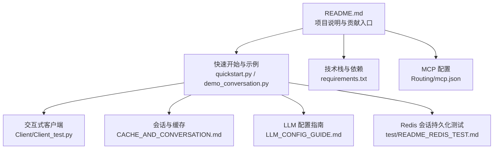
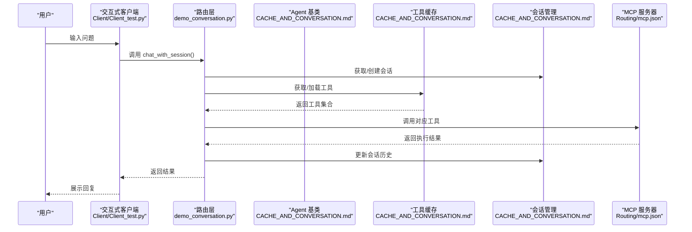
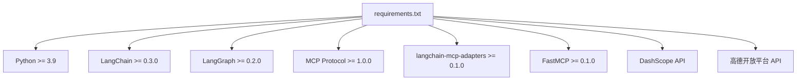

# 社区支持

<cite>
**本文引用的文件**
- [README.md](file://README.md)
- [requirements.txt](file://requirements.txt)
- [CACHE_AND_CONVERSATION.md](file://CACHE_AND_CONVERSATION.md)
- [LLM_CONFIG_GUIDE.md](file://LLM_CONFIG_GUIDE.md)
- [test/README_REDIS_TEST.md](file://test/README_REDIS_TEST.md)
- [Routing/mcp.json](file://Routing/mcp.json)
- [quickstart.py](file://quickstart.py)
- [demo_conversation.py](file://demo_conversation.py)
- [Client/Client_test.py](file://Client/Client_test.py)
</cite>

## 目录
1. [简介](#简介)
2. [项目结构](#项目结构)
3. [核心组件](#核心组件)
4. [架构总览](#架构总览)
5. [详细组件分析](#详细组件分析)
6. [依赖分析](#依赖分析)
7. [性能考虑](#性能考虑)
8. [故障排查指南](#故障排查指南)
9. [结论](#结论)
10. [附录](#附录)

## 简介
本指南面向 AiOps 项目的使用者与贡献者，提供社区支持与问题反馈的完整流程，涵盖官方文档与示例获取、参与社区讨论与技术交流的方法、如何正确提交 Issue（含问题描述规范、日志与复现步骤要求）、社区渠道（技术论坛、QQ 群、微信群等）使用建议、问题反馈最佳实践（分类、标签、优先级）、技术支持与商业咨询渠道，以及贡献代码与文档的流程。

## 项目结构
AiOps 是一个基于 Model Context Protocol（MCP）的智能代理系统，通过标准化协议连接 AI 模型与外部工具/数据源。项目采用模块化设计，围绕“工具与模型、状态、模型节点、工具节点、结束逻辑、构建与编译”六大模块组织代码，并提供 LangGraph MCP Agent、MCP 服务器（计算器、日志读取、高德地图等）以及丰富的测试与示例。

图表来源
- [README.md:1-125](file://README.md#L1-L125)
- [quickstart.py:1-68](file://quickstart.py#L1-L68)
- [demo_conversation.py:1-102](file://demo_conversation.py#L1-L102)
- [requirements.txt:1-17](file://requirements.txt#L1-L17)
- [Routing/mcp.json:1-29](file://Routing/mcp.json#L1-L29)
- [CACHE_AND_CONVERSATION.md:1-335](file://CACHE_AND_CONVERSATION.md#L1-L335)
- [LLM_CONFIG_GUIDE.md:1-92](file://LLM_CONFIG_GUIDE.md#L1-L92)
- [test/README_REDIS_TEST.md:1-174](file://test/README_REDIS_TEST.md#L1-L174)
- [Client/Client_test.py](file://Client/Client_test.py)

章节来源
- [README.md:1-125](file://README.md#L1-L125)

## 核心组件
- 交互式客户端与示例：提供快速启动与演示脚本，便于用户快速体验系统能力与进行问题复现。
- 会话与缓存：通过全局工具缓存与会话管理，支持多轮对话与上下文保持，显著提升响应速度与用户体验。
- LLM 配置：集中管理 LLM API Key、基础 URL、模型与温度等参数，支持多厂商与本地模型切换。
- Redis 会话持久化：提供单元与集成测试，验证会话生命周期、恢复与并发管理。
- MCP 配置：统一管理各 MCP 服务器的连接方式与传输协议，便于扩展与维护。

章节来源
- [quickstart.py:1-68](file://quickstart.py#L1-L68)
- [demo_conversation.py:1-102](file://demo_conversation.py#L1-L102)
- [CACHE_AND_CONVERSATION.md:1-335](file://CACHE_AND_CONVERSATION.md#L1-L335)
- [LLM_CONFIG_GUIDE.md:1-92](file://LLM_CONFIG_GUIDE.md#L1-L92)
- [test/README_REDIS_TEST.md:1-174](file://test/README_REDIS_TEST.md#L1-L174)
- [Routing/mcp.json:1-29](file://Routing/mcp.json#L1-L29)

## 架构总览
下图展示了 AiOps 的典型交互流程：用户通过交互式客户端发起请求，系统经路由层选择合适 Agent，结合全局工具缓存与会话管理，最终调用 MCP 服务器完成任务。

图表来源
- [Client/Client_test.py](file://Client/Client_test.py)
- [demo_conversation.py:1-102](file://demo_conversation.py#L1-L102)
- [CACHE_AND_CONVERSATION.md:1-335](file://CACHE_AND_CONVERSATION.md#L1-L335)
- [Routing/mcp.json:1-29](file://Routing/mcp.json#L1-L29)

## 详细组件分析

### 交互式客户端与示例
- 快速启动脚本与演示脚本提供了标准的使用路径与示例对话，便于用户快速验证环境与功能。
- 若启动失败，脚本会提示检查虚拟环境、依赖安装与 API Key 配置。

章节来源
- [quickstart.py:1-68](file://quickstart.py#L1-L68)
- [demo_conversation.py:1-102](file://demo_conversation.py#L1-L102)

### 会话与缓存机制
- 全局工具缓存：避免重复加载 MCP 服务器工具，显著降低延迟；支持 TTL 过期策略与统计信息。
- 循环对话：支持多轮上下文传递，维护独立会话历史，具备超时清理与资源回收。
- 架构简化：Agent 统一基类大幅减少重复代码，提升可维护性。

章节来源
- [CACHE_AND_CONVERSATION.md:1-335](file://CACHE_AND_CONVERSATION.md#L1-L335)

### LLM 配置指南
- 集中管理 LLM API Key、基础 URL、模型名称与温度参数，支持切换至多家厂商或本地模型。
- 修改后需重启程序生效；提供快速测试命令验证配置。

章节来源
- [LLM_CONFIG_GUIDE.md:1-92](file://LLM_CONFIG_GUIDE.md#L1-L92)

### Redis 会话持久化测试
- 提供单元测试与集成测试，验证会话生命周期、恢复、并发与过期清理。
- 集成测试支持本地安装、Docker 与 SSH 隧道访问远程 Redis。
- 常见问题与排错建议，包括 Redis 连接、Paramiko 版本兼容等。

章节来源
- [test/README_REDIS_TEST.md:1-174](file://test/README_REDIS_TEST.md#L1-L174)

### MCP 配置
- 统一管理各 MCP 服务器的连接方式（stdio/streamable-http）与传输协议，便于扩展与维护。
- 示例中包含计算器、日志读取、RAG 知识库与高德地图服务。

章节来源
- [Routing/mcp.json:1-29](file://Routing/mcp.json#L1-L29)

## 依赖分析
- 技术栈与版本要求：项目明确列出 Python、LangChain、LangGraph、MCP 协议、langchain-mcp-adapters、FastMCP、DashScope API、高德开放平台 API 等依赖。
- 依赖安装：通过 requirements.txt 统一管理，建议在虚拟环境中安装。

图表来源
- [requirements.txt:1-17](file://requirements.txt#L1-L17)

章节来源
- [requirements.txt:1-17](file://requirements.txt#L1-L17)

## 性能考虑
- 工具缓存：首次调用加载工具，后续调用使用缓存，响应速度提升显著。
- 会话管理：限制历史消息数量与会话超时，避免内存膨胀。
- 资源清理：应用退出时调用清理函数释放 MCP 连接与缓存。

章节来源
- [CACHE_AND_CONVERSATION.md:239-244](file://CACHE_AND_CONVERSATION.md#L239-L244)

## 故障排查指南
- 工具加载失败：检查 MCP 配置文件中的路径与可执行权限，确认依赖安装正确。
- 会话历史未保持：确保传递正确的会话 ID，检查历史打包逻辑与消息数量限制。
- 内存占用过高：调低历史消息上限、缩短会话超时、定期清理过期会话。
- Redis 相关问题：确认 Redis 服务运行状态、防火墙与 SSH 隧道配置；若遇 Paramiko 版本问题，按测试文档建议处理。

章节来源
- [CACHE_AND_CONVERSATION.md:296-324](file://CACHE_AND_CONVERSATION.md#L296-L324)
- [test/README_REDIS_TEST.md:94-174](file://test/README_REDIS_TEST.md#L94-L174)

## 结论
通过本指南，用户可以高效获取官方文档与示例、参与社区讨论、正确提交 Issue 并获得支持，同时掌握问题反馈的最佳实践与技术支持渠道。项目提供了完善的示例、配置与测试文档，便于快速上手与稳定运行。

## 附录

### 官方文档与示例获取
- 项目说明与贡献入口：[README.md](file://README.md)
- 快速启动与演示：[quickstart.py](file://quickstart.py)、[demo_conversation.py](file://demo_conversation.py)
- 会话与缓存说明：[CACHE_AND_CONVERSATION.md](file://CACHE_AND_CONVERSATION.md)
- LLM 配置指南：[LLM_CONFIG_GUIDE.md](file://LLM_CONFIG_GUIDE.md)
- Redis 会话持久化测试：[test/README_REDIS_TEST.md](file://test/README_REDIS_TEST.md)
- MCP 配置：[Routing/mcp.json](file://Routing/mcp.json)

章节来源
- [README.md:1-125](file://README.md#L1-L125)
- [quickstart.py:1-68](file://quickstart.py#L1-L68)
- [demo_conversation.py:1-102](file://demo_conversation.py#L1-L102)
- [CACHE_AND_CONVERSATION.md:1-335](file://CACHE_AND_CONVERSATION.md#L1-L335)
- [LLM_CONFIG_GUIDE.md:1-92](file://LLM_CONFIG_GUIDE.md#L1-L92)
- [test/README_REDIS_TEST.md:1-174](file://test/README_REDIS_TEST.md#L1-L174)
- [Routing/mcp.json:1-29](file://Routing/mcp.json#L1-L29)

### 如何参与社区讨论与技术交流
- 贡献入口：项目 README 明确欢迎提交 Issue 与 Pull Request。
- 建议在提交 Issue 前，先查阅相关文档与测试说明，确保问题可复现且信息完整。

章节来源
- [README.md:122-125](file://README.md#L122-L125)

### 如何正确提交 Issue
- 问题描述规范
  - 明确复现步骤：按顺序列出操作步骤，便于他人复现。
  - 提供预期行为与实际行为差异，突出异常表现。
  - 附带环境信息：操作系统、Python 版本、依赖版本、LLM 配置等。
- 日志与附件
  - 附带系统日志与错误堆栈；若涉及 LLM 调用，附带关键请求与响应片段。
  - 若涉及 Redis 或网络问题，附带连接状态与网络诊断输出。
- 示例与最小复现
  - 提供最小可运行示例（如使用快速启动脚本或演示脚本），便于维护者快速定位问题。
- 会话与缓存相关问题
  - 说明是否使用了会话 ID、历史消息数量、缓存状态等信息，有助于定位上下文丢失或缓存失效问题。

章节来源
- [quickstart.py:1-68](file://quickstart.py#L1-L68)
- [demo_conversation.py:1-102](file://demo_conversation.py#L1-L102)
- [CACHE_AND_CONVERSATION.md:1-335](file://CACHE_AND_CONVERSATION.md#L1-L335)
- [test/README_REDIS_TEST.md:1-174](file://test/README_REDIS_TEST.md#L1-L174)

### 社区渠道使用建议
- GitHub Issues：用于缺陷报告、功能请求与技术讨论。
- 讨论区/论坛：可在 README 中提供的链接进行技术交流（若存在）。
- QQ 群/微信群：用于快速沟通与经验分享（若存在），建议遵守群规并提供必要信息以便高效协助。

章节来源
- [README.md:1-125](file://README.md#L1-L125)

### 问题反馈最佳实践
- 问题分类：按“功能缺陷/配置问题/性能问题/集成问题/文档问题”等分类，便于优先处理。
- 标签使用：建议使用“bug”、“enhancement”、“question”、“help wanted”、“good first issue”等标签（若仓库启用）。
- 优先级评估：依据影响范围、复现难度与紧急程度评估优先级；提供最小复现与日志有助于加速评估。

章节来源
- [README.md:122-125](file://README.md#L122-L125)

### 技术支持与商业咨询渠道
- 技术支持：优先通过 GitHub Issues 提交问题，并在问题中附带必要的日志与复现步骤。
- 商业咨询：若涉及定制化需求或商业合作，可通过 README 中提供的联系方式进行对接（若存在）。

章节来源
- [README.md:1-125](file://README.md#L1-L125)

### 贡献代码与文档的流程指南
- 提交 Pull Request：在提交前，确保本地测试通过（包括单元与集成测试），并在 PR 描述中清晰说明变更内容、动机与验证方式。
- 文档贡献：更新相关文档（如 CACHE_AND_CONVERSATION.md、LLM_CONFIG_GUIDE.md、test/README_REDIS_TEST.md 等），确保示例与配置一致。
- 代码风格与测试：遵循现有代码风格，补充必要的测试用例，确保改动不影响现有功能。

章节来源
- [README.md:122-125](file://README.md#L122-L125)
- [CACHE_AND_CONVERSATION.md:1-335](file://CACHE_AND_CONVERSATION.md#L1-L335)
- [LLM_CONFIG_GUIDE.md:1-92](file://LLM_CONFIG_GUIDE.md#L1-L92)
- [test/README_REDIS_TEST.md:1-174](file://test/README_REDIS_TEST.md#L1-L174)