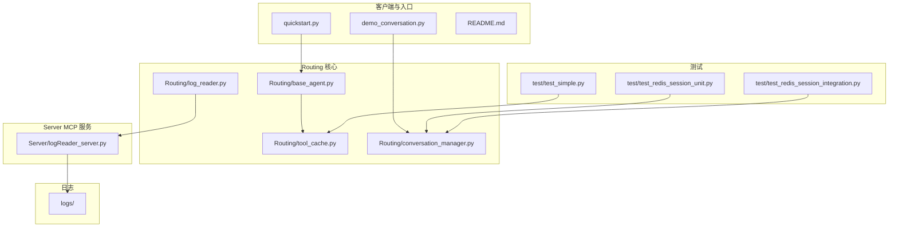
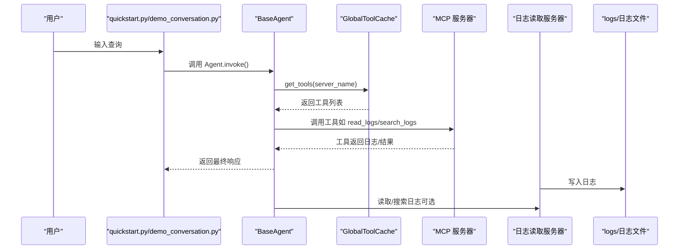
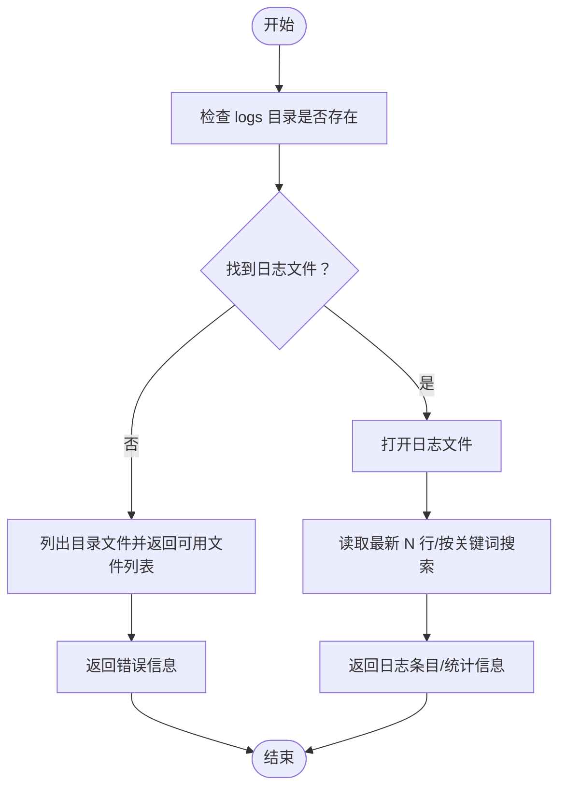
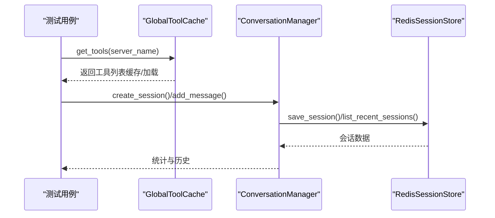
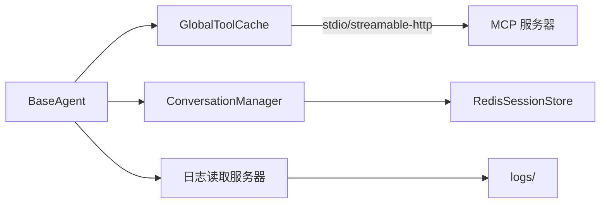

# 调试工具

<cite>
**本文档引用的文件**
- [README.md](file://README.md)
- [quickstart.py](file://quickstart.py)
- [demo_conversation.py](file://demo_conversation.py)
- [requirements.txt](file://requirements.txt)
- [Routing/base_agent.py](file://Routing/base_agent.py)
- [Routing/tool_cache.py](file://Routing/tool_cache.py)
- [Routing/conversation_manager.py](file://Routing/conversation_manager.py)
- [Routing/log_reader.py](file://Routing/log_reader.py)
- [Server/logReader_server.py](file://Server/logReader_server.py)
- [test/test_simple.py](file://test/test_simple.py)
- [test/test_redis_session_unit.py](file://test/test_redis_session_unit.py)
- [test/test_redis_session_integration.py](file://test/test_redis_session_integration.py)
</cite>

## 目录
1. [简介](#简介)
2. [项目结构](#项目结构)
3. [核心组件](#核心组件)
4. [架构总览](#架构总览)
5. [组件详解](#组件详解)
6. [依赖关系分析](#依赖关系分析)
7. [性能考量](#性能考量)
8. [故障排查指南](#故障排查指南)
9. [结论](#结论)
10. [附录](#附录)

## 简介
本指南面向 AiOps 项目的开发者与运维人员，系统梳理项目中的调试工具与方法，覆盖日志系统配置与定位、Python 调试器（pdb）使用技巧、网络调试工具（curl、Postman）、Python 单元测试与调试、第三方 IDE 调试器（PyCharm、VS Code）以及远程与生产环境调试最佳实践。文档结合仓库现有代码，提供可操作的步骤、可视化图示与排障建议。

## 项目结构
项目采用模块化设计，围绕“Agent 基类 + 工具缓存 + 会话管理 + MCP 服务器”的架构组织代码。关键目录与文件如下：
- Routing：核心业务逻辑与基础设施（Agent、缓存、会话、工具等）
- Server：MCP 服务器实现（日志读取、计算器、RAG 等）
- test：单元与集成测试，验证缓存、会话、Redis 持久化等
- logs：日志输出目录（由日志读取服务器写入）

图表来源
- [quickstart.py:1-68](file://quickstart.py#L1-L68)
- [demo_conversation.py:1-102](file://demo_conversation.py#L1-L102)
- [Routing/base_agent.py:1-497](file://Routing/base_agent.py#L1-L497)
- [Routing/tool_cache.py:1-302](file://Routing/tool_cache.py#L1-L302)
- [Routing/conversation_manager.py:1-275](file://Routing/conversation_manager.py#L1-L275)
- [Routing/log_reader.py:1-11](file://Routing/log_reader.py#L1-L11)
- [Server/logReader_server.py:1-151](file://Server/logReader_server.py#L1-L151)
- [test/test_simple.py:1-103](file://test/test_simple.py#L1-L103)
- [test/test_redis_session_unit.py:1-294](file://test/test_redis_session_unit.py#L1-L294)
- [test/test_redis_session_integration.py:1-328](file://test/test_redis_session_integration.py#L1-L328)

章节来源
- [README.md:1-125](file://README.md#L1-L125)
- [quickstart.py:1-68](file://quickstart.py#L1-L68)
- [demo_conversation.py:1-102](file://demo_conversation.py#L1-L102)

## 核心组件
- Agent 基类与具体 Agent：统一模型初始化、工具绑定、工作流编排与错误处理；提供计算器、日志读取、高德地图、RAG 等专用 Agent。
- 工具缓存（GlobalToolCache）：集中管理 MCP 服务器连接与工具列表，支持 stdio/streamable-http 两种传输协议，具备 TTL 缓存与会话生命周期管理。
- 会话管理（ConversationManager）：多轮对话上下文管理，支持内存与 Redis 持久化，具备过期清理与统计接口。
- 日志读取 MCP 服务器：提供读取最新日志、按关键词搜索、统计信息等工具，输出日志文件位于 logs 目录。

章节来源
- [Routing/base_agent.py:1-497](file://Routing/base_agent.py#L1-L497)
- [Routing/tool_cache.py:1-302](file://Routing/tool_cache.py#L1-L302)
- [Routing/conversation_manager.py:1-275](file://Routing/conversation_manager.py#L1-L275)
- [Server/logReader_server.py:1-151](file://Server/logReader_server.py#L1-L151)

## 架构总览
下图展示了从用户输入到工具执行与日志读取的整体流程，以及关键组件间的交互关系。

图表来源
- [quickstart.py:1-68](file://quickstart.py#L1-L68)
- [demo_conversation.py:1-102](file://demo_conversation.py#L1-L102)
- [Routing/base_agent.py:1-497](file://Routing/base_agent.py#L1-L497)
- [Routing/tool_cache.py:1-302](file://Routing/tool_cache.py#L1-L302)
- [Server/logReader_server.py:1-151](file://Server/logReader_server.py#L1-L151)

## 组件详解

### 日志系统配置与使用
- 日志读取服务器：提供读取最新日志、按关键词搜索、统计信息等工具，日志文件位于 logs 目录，支持 app.log 与 Logs.txt。
- 日志写入：日志读取服务器在启动时打印启动信息，并将日志写入 logs 目录下的日志文件。
- 日志定位：通过日志读取工具或直接查看 logs 目录中的日志文件，定位错误、警告与关键信息。

图表来源
- [Server/logReader_server.py:18-151](file://Server/logReader_server.py#L18-L151)

章节来源
- [Server/logReader_server.py:1-151](file://Server/logReader_server.py#L1-L151)
- [Routing/log_reader.py:1-11](file://Routing/log_reader.py#L1-L11)

### Python 调试器（pdb）使用技巧
- 断点设置：在关键函数入口或异常处插入断点，例如在 Agent 初始化、工具调用、会话管理等流程中。
- 变量检查：进入交互模式后，检查状态字典（如 messages、tool_calls、tool_results）与缓存统计信息。
- 调用栈分析：利用 p 打印当前状态，u/ d 上下移动查看调用栈，结合 print 输出定位问题。
- 建议实践：在 BaseAgent 的 model_node/tools_node 中设置断点，观察 LLM 推理与工具调用过程；在 ToolCache 的工具加载与会话管理中设置断点，验证缓存与持久化行为。

章节来源
- [Routing/base_agent.py:100-318](file://Routing/base_agent.py#L100-L318)
- [Routing/tool_cache.py:85-243](file://Routing/tool_cache.py#L85-L243)
- [Routing/conversation_manager.py:122-271](file://Routing/conversation_manager.py#L122-L271)

### 网络调试工具
- curl：用于直接调用 MCP 服务器工具，验证工具签名与返回格式。示例场景：调用 read_logs、search_logs、get_log_stats 等工具。
- Postman：通过 HTTP 客户端工具发送请求，设置请求头与参数，捕获响应与错误信息，辅助定位网络与协议问题。
- 注意事项：确保 MCP 服务器正确监听 stdio 或 streamable-http，必要时使用隧道或代理工具。

章节来源
- [Routing/tool_cache.py:198-243](file://Routing/tool_cache.py#L198-L243)
- [Server/logReader_server.py:148-151](file://Server/logReader_server.py#L148-L151)

### Python 单元测试与调试
- 测试用例：test/test_simple.py 验证工具缓存与会话管理；test/test_redis_session_unit.py 与 test/test_redis_session_integration.py 验证 Redis 持久化与会话生命周期。
- 调试方法：在测试中使用断点，观察缓存命中、会话创建与消息同步、过期清理等行为；结合 print 输出与异常堆栈定位问题。

图表来源
- [test/test_simple.py:11-103](file://test/test_simple.py#L11-L103)
- [test/test_redis_session_unit.py:90-294](file://test/test_redis_session_unit.py#L90-L294)
- [test/test_redis_session_integration.py:26-328](file://test/test_redis_session_integration.py#L26-L328)

章节来源
- [test/test_simple.py:1-103](file://test/test_simple.py#L1-L103)
- [test/test_redis_session_unit.py:1-294](file://test/test_redis_session_unit.py#L1-L294)
- [test/test_redis_session_integration.py:1-328](file://test/test_redis_session_integration.py#L1-L328)

### 第三方调试工具（PyCharm/VS Code）
- PyCharm：设置断点、使用调试器逐步执行、查看变量与调用栈；可配置环境变量与运行参数，便于调试 MCP 服务器与 Agent。
- VS Code：使用 Python 扩展设置断点、条件断点与日志输出；结合任务配置运行入口脚本与测试用例。
- 建议：在 BaseAgent、ToolCache、ConversationManager 的关键节点设置断点，观察状态变化与异常抛出位置。

章节来源
- [Routing/base_agent.py:1-497](file://Routing/base_agent.py#L1-L497)
- [Routing/tool_cache.py:1-302](file://Routing/tool_cache.py#L1-L302)
- [Routing/conversation_manager.py:1-275](file://Routing/conversation_manager.py#L1-L275)

### 远程调试与生产环境调试最佳实践
- 远程调试：通过 SSH 隧道或反向代理暴露 MCP 服务器；在远端开启日志读取服务器，本地通过隧道访问；使用 IDE 的远程调试功能连接远端进程。
- 生产环境调试：开启细粒度日志（如 DEBUG 级别），结合日志读取工具定期巡检；对关键路径增加 print/日志输出；使用超时与重试策略，避免阻塞；在工具加载与会话管理处增加异常捕获与降级逻辑。
- 安全与可观测性：在生产环境限制调试接口访问；记录关键事件与错误堆栈；使用集中式日志收集与告警。

## 依赖关系分析
- 工具加载依赖：BaseAgent 通过 GlobalToolCache 获取工具，支持 stdio 与 streamable-http 两种传输协议。
- 会话持久化依赖：ConversationManager 可选 Redis 持久化，提供会话创建、消息同步、过期清理与统计接口。
- 日志系统依赖：日志读取服务器负责日志写入与读取，Agent 可调用其工具进行日志分析。

图表来源
- [Routing/base_agent.py:1-497](file://Routing/base_agent.py#L1-L497)
- [Routing/tool_cache.py:1-302](file://Routing/tool_cache.py#L1-L302)
- [Routing/conversation_manager.py:1-275](file://Routing/conversation_manager.py#L1-L275)
- [Server/logReader_server.py:1-151](file://Server/logReader_server.py#L1-L151)

章节来源
- [requirements.txt:1-17](file://requirements.txt#L1-L17)

## 性能考量
- 工具缓存：通过 TTL 缓存减少重复加载 MCP 服务器的成本，提高响应速度；注意缓存过期与清理策略。
- 会话管理：限制历史消息数量与会话超时时间，避免内存膨胀；Redis 持久化需考虑网络延迟与序列化开销。
- 日志读取：批量读取与关键词搜索可能产生 IO 压力，建议分页与索引优化；在生产环境控制日志级别与频率。

## 故障排查指南
- 工具加载失败：检查 MCP 配置文件与传输协议；确认 stdio 命令与参数、streamable-http URL 与 API Key；查看 ToolCache 的异常输出与超时处理。
- 会话异常：验证 Redis 连接与认证；检查会话创建、消息添加与清理流程；使用单元测试与集成测试验证生命周期。
- 日志不可见：确认日志文件路径与权限；使用日志读取工具验证文件存在与内容；检查日志写入与刷新策略。
- 单元测试失败：在测试用例中设置断点，逐段验证缓存命中、消息同步与清理逻辑；结合异常堆栈定位问题。

章节来源
- [Routing/tool_cache.py:198-243](file://Routing/tool_cache.py#L198-L243)
- [Routing/conversation_manager.py:122-271](file://Routing/conversation_manager.py#L122-L271)
- [Server/logReader_server.py:18-151](file://Server/logReader_server.py#L18-L151)
- [test/test_simple.py:1-103](file://test/test_simple.py#L1-L103)
- [test/test_redis_session_unit.py:1-294](file://test/test_redis_session_unit.py#L1-L294)
- [test/test_redis_session_integration.py:1-328](file://test/test_redis_session_integration.py#L1-L328)

## 结论
通过统一的 Agent 基类、工具缓存与会话管理，结合日志读取服务器与完善的测试体系，AiOps 项目提供了可扩展、可观测、易调试的开发与运维能力。建议在日常开发中充分利用断点、日志与测试用例，在远程与生产环境中遵循安全与性能最佳实践，持续优化调试效率与系统稳定性。

## 附录
- 快速启动与演示：参考 quickstart.py 与 demo_conversation.py 的运行方式与输出，验证 Agent 初始化、工具缓存与会话管理。
- 环境与依赖：确保 Python 版本与依赖满足要求，配置 .env 中的 API Key 与 LLM 参数。

章节来源
- [quickstart.py:1-68](file://quickstart.py#L1-L68)
- [demo_conversation.py:1-102](file://demo_conversation.py#L1-L102)
- [requirements.txt:1-17](file://requirements.txt#L1-L17)
- [README.md:64-78](file://README.md#L64-L78)