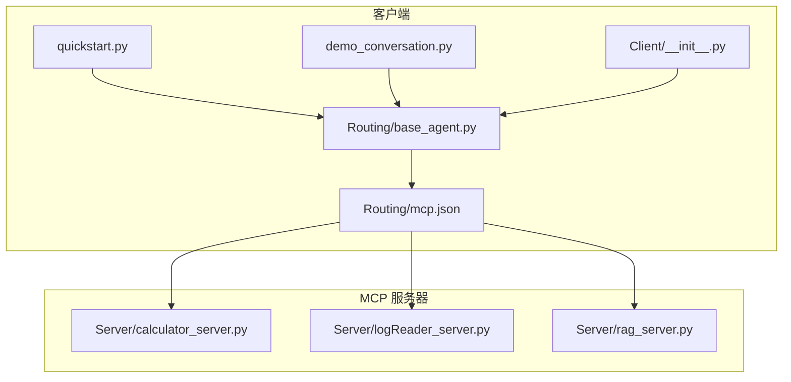
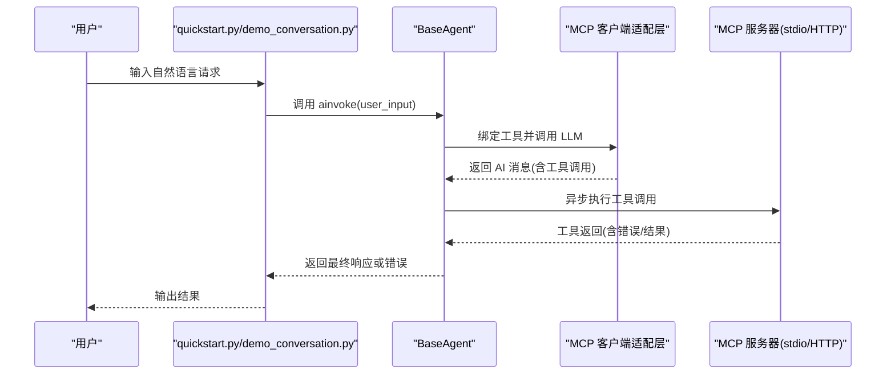
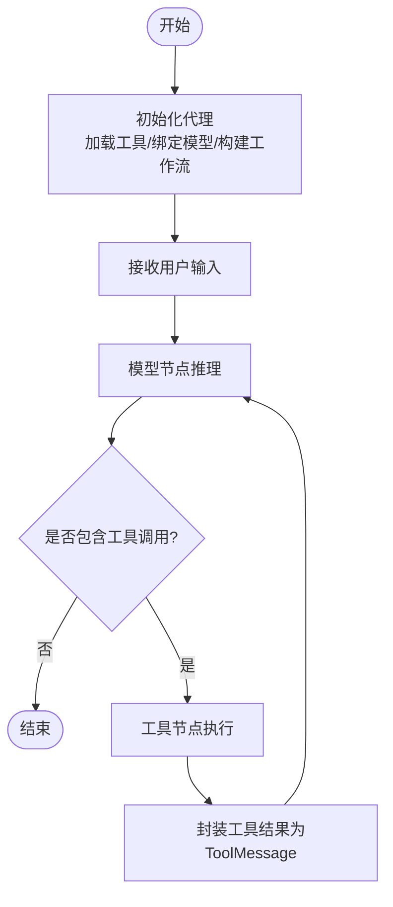
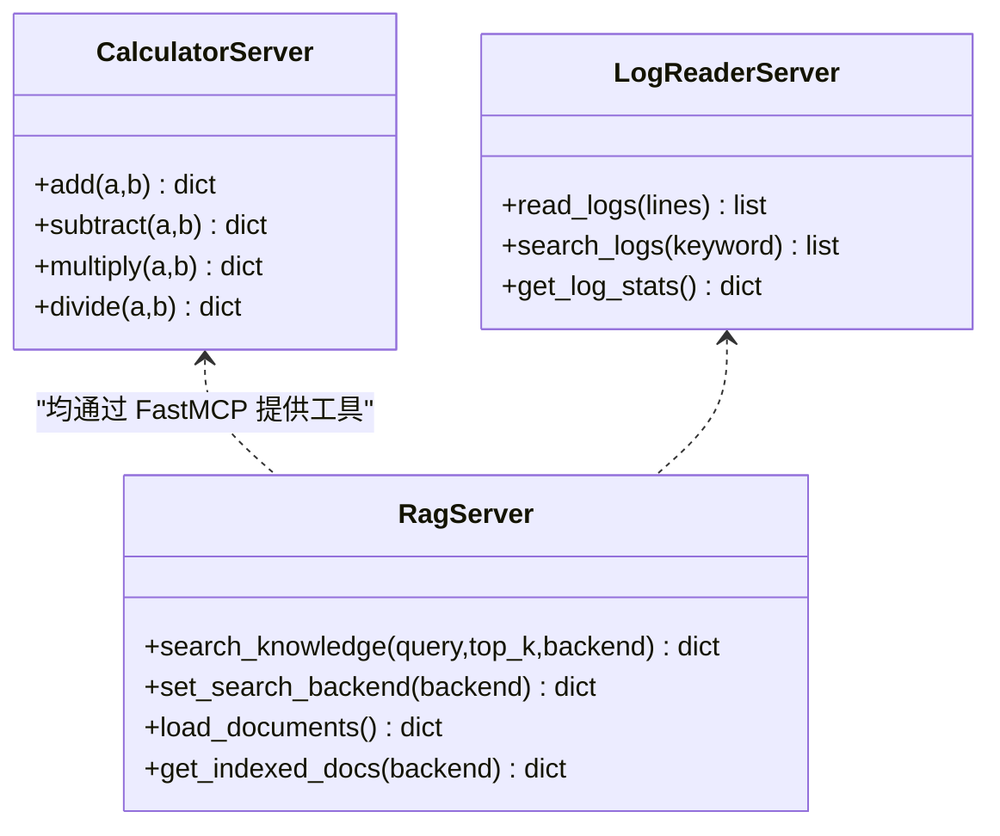
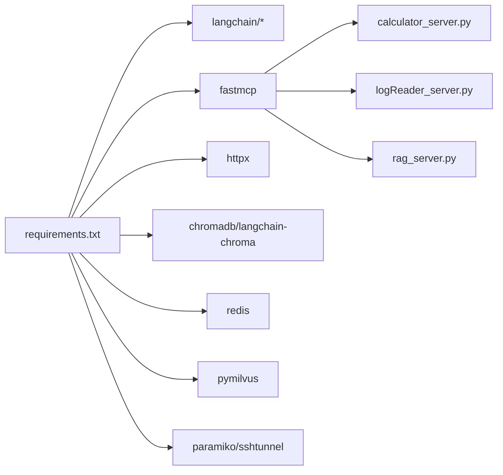

# 运行时错误

<cite>
**本文引用的文件**
- [README.md](file://README.md)
- [quickstart.py](file://quickstart.py)
- [requirements.txt](file://requirements.txt)
- [Routing/mcp.json](file://Routing/mcp.json)
- [Routing/base_agent.py](file://Routing/base_agent.py)
- [Server/calculator_server.py](file://Server/calculator_server.py)
- [Server/logReader_server.py](file://Server/logReader_server.py)
- [Server/rag_server.py](file://Server/rag_server.py)
- [demo_conversation.py](file://demo_conversation.py)
- [Client/__init__.py](file://Client/__init__.py)
</cite>

## 目录
1. [简介](#简介)
2. [项目结构](#项目结构)
3. [核心组件](#核心组件)
4. [架构总览](#架构总览)
5. [详细组件分析](#详细组件分析)
6. [依赖分析](#依赖分析)
7. [性能考虑](#性能考虑)
8. [故障排除指南](#故障排除指南)
9. [结论](#结论)
10. [附录](#附录)

## 简介
本指南聚焦于 AiOps 项目在运行时可能出现的错误与异常，覆盖 MCP 连接失败、代理执行异常、工具调用错误等典型场景。文档提供系统化的诊断流程、异常堆栈解读方法、常见错误分类与处理策略，并给出网络连接、服务器响应超时、工具执行失败等场景的排查步骤。同时，说明如何区分客户端错误与服务器端错误，并提供日志分析、网络抓包、进程监控等调试手段。

## 项目结构
该项目采用“客户端 + 多个 MCP 服务器”的架构，客户端通过 LangGraph/LangChain 与 MCP 服务器交互，服务器以 stdio 或 HTTP 传输方式提供工具能力。关键目录与文件如下：
- 客户端入口与包装：Client、quickstart.py、demo_conversation.py
- 路由与工具缓存：Routing/mcp.json、Routing/base_agent.py
- MCP 服务器：Server/calculator_server.py、Server/logReader_server.py、Server/rag_server.py
- 依赖与版本：requirements.txt
- 顶层说明：README.md

图表来源
- [quickstart.py:1-68](file://quickstart.py#L1-L68)
- [demo_conversation.py:1-102](file://demo_conversation.py#L1-L102)
- [Client/__init__.py:1-12](file://Client/__init__.py#L1-L12)
- [Routing/base_agent.py:1-497](file://Routing/base_agent.py#L1-L497)
- [Routing/mcp.json:1-29](file://Routing/mcp.json#L1-L29)
- [Server/calculator_server.py:1-111](file://Server/calculator_server.py#L1-L111)
- [Server/logReader_server.py:1-151](file://Server/logReader_server.py#L1-L151)
- [Server/rag_server.py:1-363](file://Server/rag_server.py#L1-L363)

章节来源
- [README.md:1-125](file://README.md#L1-L125)
- [quickstart.py:1-68](file://quickstart.py#L1-L68)
- [requirements.txt:1-17](file://requirements.txt#L1-L17)
- [Routing/mcp.json:1-29](file://Routing/mcp.json#L1-L29)
- [Routing/base_agent.py:1-497](file://Routing/base_agent.py#L1-L497)
- [Server/calculator_server.py:1-111](file://Server/calculator_server.py#L1-L111)
- [Server/logReader_server.py:1-151](file://Server/logReader_server.py#L1-L151)
- [Server/rag_server.py:1-363](file://Server/rag_server.py#L1-L363)
- [demo_conversation.py:1-102](file://demo_conversation.py#L1-L102)
- [Client/__init__.py:1-12](file://Client/__init__.py#L1-L12)

## 核心组件
- 客户端与代理
  - BaseAgent：统一的代理基类，负责模型初始化、工具绑定、工作流构建与执行；提供模型节点与工具节点的异步处理逻辑，内置错误捕获与状态管理。
  - 代理工厂：CalculatorAgent、LogReaderAgent、AmapAgent、RAGAgent，分别绑定不同的 MCP 服务器名称与系统提示词。
- MCP 服务器
  - 计算器服务器：提供加减乘除工具，包含除零保护与错误返回。
  - 日志读取服务器：提供读取最新日志、按关键词搜索、统计信息获取等工具，包含文件存在性检查与异常捕获。
  - RAG 服务器：提供知识检索、切换后端、手动加载文档、统计信息获取等工具，包含 ChromaDB 与 Milvus 双后端回退逻辑。
- 配置与路由
  - mcp.json：定义多个 MCP 服务器（高德地图 HTTP、计算器/日志读取/知识库 stdio），指定传输方式与命令行参数。
  - requirements.txt：声明 fastmcp、langchain、httpx、chromadb、redis、pymilvus 等关键依赖。

章节来源
- [Routing/base_agent.py:1-497](file://Routing/base_agent.py#L1-L497)
- [Server/calculator_server.py:1-111](file://Server/calculator_server.py#L1-L111)
- [Server/logReader_server.py:1-151](file://Server/logReader_server.py#L1-L151)
- [Server/rag_server.py:1-363](file://Server/rag_server.py#L1-L363)
- [Routing/mcp.json:1-29](file://Routing/mcp.json#L1-L29)
- [requirements.txt:1-17](file://requirements.txt#L1-L17)

## 架构总览
下图展示了客户端与各 MCP 服务器之间的交互关系，以及工具调用与错误传播路径。

图表来源
- [quickstart.py:1-68](file://quickstart.py#L1-L68)
- [demo_conversation.py:1-102](file://demo_conversation.py#L1-L102)
- [Routing/base_agent.py:1-497](file://Routing/base_agent.py#L1-L497)
- [Server/calculator_server.py:1-111](file://Server/calculator_server.py#L1-L111)
- [Server/logReader_server.py:1-151](file://Server/logReader_server.py#L1-L151)
- [Server/rag_server.py:1-363](file://Server/rag_server.py#L1-L363)

## 详细组件分析

### 客户端与代理执行流程
- 初始化阶段：BaseAgent 从全局工具缓存加载工具，初始化 LLM 并绑定工具，构建 StateGraph 工作流。
- 推理阶段：model_node 调用 LLM，若返回包含工具调用，则进入 tools_node。
- 工具执行阶段：tools_node 根据工具名称查找缓存工具并异步调用，对返回结果进行裁剪与封装，生成 ToolMessage。
- 结果聚合：工具结果回传至模型节点，形成多轮对话闭环；若出现异常，记录错误并终止流程。

图表来源
- [Routing/base_agent.py:1-497](file://Routing/base_agent.py#L1-L497)

章节来源
- [Routing/base_agent.py:1-497](file://Routing/base_agent.py#L1-L497)

### MCP 服务器工具实现与错误处理
- 计算器服务器
  - 工具：加法、减法、乘法、除法；除法包含除零保护，返回错误字段。
- 日志读取服务器
  - 工具：读取最新日志、按关键词搜索、统计信息；若日志文件不存在，返回可用文件列表；读取异常时返回错误信息。
- RAG 服务器
  - 工具：知识检索、切换后端、加载文档、统计信息；支持 ChromaDB 与 Milvus 双后端，Milvus 不可用时回退到 ChromaDB；异常时返回错误状态。

图表来源
- [Server/calculator_server.py:1-111](file://Server/calculator_server.py#L1-L111)
- [Server/logReader_server.py:1-151](file://Server/logReader_server.py#L1-L151)
- [Server/rag_server.py:1-363](file://Server/rag_server.py#L1-L363)

章节来源
- [Server/calculator_server.py:1-111](file://Server/calculator_server.py#L1-L111)
- [Server/logReader_server.py:1-151](file://Server/logReader_server.py#L1-L151)
- [Server/rag_server.py:1-363](file://Server/rag_server.py#L1-L363)

### 客户端错误与服务器端错误的区分
- 客户端错误
  - 代理初始化失败：模型绑定工具失败、工作流构建异常、环境变量缺失。
  - 工具调用异常：找不到工具名称、工具参数不合法、工具返回格式不符合预期。
  - 网络/传输错误：MCP 服务器未启动、stdio 通道不可用、HTTP 服务器不可达。
- 服务器端错误
  - 工具内部异常：文件不存在、数据库连接失败、API 调用失败、权限不足。
  - 参数校验失败：除零、非法参数类型、必填字段缺失。

章节来源
- [Routing/base_agent.py:1-497](file://Routing/base_agent.py#L1-L497)
- [Server/calculator_server.py:1-111](file://Server/calculator_server.py#L1-L111)
- [Server/logReader_server.py:1-151](file://Server/logReader_server.py#L1-L151)
- [Server/rag_server.py:1-363](file://Server/rag_server.py#L1-L363)

## 依赖分析
- 客户端依赖
  - fastmcp、langchain、langchain-mcp-adapters、httpx：用于 MCP 协议、LangChain 适配与 HTTP 传输。
  - chromadb、langchain-chroma：本地向量检索后端。
  - redis、pymilvus、paramiko、sshtunnel：会话缓存、远程 Milvus 连接与 SSH 隧道。
- 服务器依赖
  - fastmcp：提供工具装饰器与运行时框架。
  - dashscope embeddings：RAG 向量化。
  - python-dotenv：读取环境变量。

图表来源
- [requirements.txt:1-17](file://requirements.txt#L1-L17)
- [Server/calculator_server.py:1-111](file://Server/calculator_server.py#L1-L111)
- [Server/logReader_server.py:1-151](file://Server/logReader_server.py#L1-L151)
- [Server/rag_server.py:1-363](file://Server/rag_server.py#L1-L363)

章节来源
- [requirements.txt:1-17](file://requirements.txt#L1-L17)

## 性能考虑
- 工具缓存：BaseAgent 通过全局工具缓存减少重复加载，降低冷启动开销。
- 会话管理：demo_conversation.py 展示了会话复用与资源清理，有助于减少频繁初始化带来的性能损耗。
- 向量检索后端：RAG 服务器支持 ChromaDB 与 Milvus 双后端，可根据数据规模与延迟需求选择；Milvus 需要 SSH 隧道与连接管理，注意连接池与断线重连策略。

章节来源
- [Routing/base_agent.py:1-497](file://Routing/base_agent.py#L1-L497)
- [demo_conversation.py:1-102](file://demo_conversation.py#L1-L102)
- [Server/rag_server.py:1-363](file://Server/rag_server.py#L1-L363)

## 故障排除指南

### 一、MCP 连接失败
- 症状
  - 客户端无法发现工具、工具列表为空、代理初始化报错。
- 常见原因
  - mcp.json 中服务器配置错误（URL/命令行参数/传输方式）。
  - 服务器未启动或进程崩溃（stdio 通道不可用）。
  - 环境变量缺失导致 API Key 未注入。
- 排查步骤
  1) 校验 mcp.json 的服务器配置与传输方式。
  2) 确认对应服务器进程已启动且监听 stdio/HTTP。
  3) 检查 .env 或环境变量中 API Key 是否正确。
  4) 使用最小化示例（quickstart.py）验证连接。
- 解决方案
  - 修正 mcp.json 配置或启动参数。
  - 重启服务器进程，确认日志输出。
  - 补充缺失的环境变量。

章节来源
- [Routing/mcp.json:1-29](file://Routing/mcp.json#L1-L29)
- [quickstart.py:1-68](file://quickstart.py#L1-L68)
- [README.md:64-69](file://README.md#L64-L69)

### 二、代理执行异常
- 症状
  - model_node 抛出异常、代理执行中断、返回错误信息。
- 常见原因
  - LLM 模型配置错误（base_url、model、temperature）。
  - 工具绑定失败或工具名称不匹配。
  - 环境变量缺失导致模型初始化失败。
- 排查步骤
  1) 检查 LLM_BASE_URL、LLM_MODEL、LLM_TEMPERATURE 等环境变量。
  2) 确认工具缓存中存在目标工具名称。
  3) 使用最小化示例（quickstart.py）验证模型调用。
- 解决方案
  - 补充或修正环境变量。
  - 确保工具名称与服务器一致。
  - 更换可用的模型或调整 base_url。

章节来源
- [Routing/base_agent.py:68-89](file://Routing/base_agent.py#L68-L89)
- [Routing/base_agent.py:111-129](file://Routing/base_agent.py#L111-L129)
- [quickstart.py:60-68](file://quickstart.py#L60-L68)

### 三、工具调用错误
- 症状
  - tools_node 抛出异常、工具返回错误字段、ToolMessage 内容异常。
- 常见原因
  - 工具名称未找到、参数类型不匹配、工具内部异常。
  - 计算器除零、日志文件不存在、RAG 后端不可用。
- 排查步骤
  1) 检查最后一次 AI 消息中的工具调用名称与参数。
  2) 核对服务器工具清单与参数签名。
  3) 针对特定工具检查其前置条件（如日志文件存在性、Milvus 可用性）。
- 解决方案
  - 修正工具名称或参数。
  - 处理除零或文件不存在等边界情况。
  - 切换 RAG 后端或补齐依赖。

章节来源
- [Routing/base_agent.py:131-217](file://Routing/base_agent.py#L131-L217)
- [Server/calculator_server.py:95-98](file://Server/calculator_server.py#L95-L98)
- [Server/logReader_server.py:41-44](file://Server/logReader_server.py#L41-L44)
- [Server/rag_server.py:177-182](file://Server/rag_server.py#L177-L182)

### 四、网络连接问题
- 症状
  - HTTP 服务器不可达、超时、握手失败。
- 常见原因
  - 端口占用、防火墙阻断、证书问题、跨域配置。
- 排查步骤
  1) 使用 curl 或浏览器访问服务器 URL，确认可达性。
  2) 检查服务器日志与端口监听状态。
  3) 如使用 HTTPS，确认证书与域名匹配。
- 解决方案
  - 释放端口或修改监听地址。
  - 放通防火墙规则。
  - 修正证书或降级为 HTTP（开发环境）。

章节来源
- [requirements.txt:9](file://requirements.txt#L9)
- [README.md:80-90](file://README.md#L80-L90)

### 五、服务器响应超时
- 症状
  - 客户端等待超时、工具调用长时间无响应。
- 常见原因
  - 服务器负载过高、数据库连接池耗尽、Milvus 连接不稳定。
- 排查步骤
  1) 监控服务器 CPU/内存/IO。
  2) 检查数据库连接与查询性能。
  3) 对 Milvus 后端检查 SSH 隧道与连接池。
- 解决方案
  - 优化查询或增加连接池大小。
  - 降级到 ChromaDB 或扩容 Milvus。
  - 调整客户端超时阈值与重试策略。

章节来源
- [Server/rag_server.py:51-85](file://Server/rag_server.py#L51-L85)
- [requirements.txt:10-16](file://requirements.txt#L10-L16)

### 六、工具执行失败
- 症状
  - 工具返回错误字段、日志读取失败、RAG 搜索无结果。
- 常见原因
  - 文件路径错误、权限不足、嵌入模型 API Key 缺失。
- 排查步骤
  1) 检查日志文件路径与权限。
  2) 确认 DASHSCOPE_API_KEY 设置。
  3) 验证向量库初始化状态与集合存在性。
- 解决方案
  1) 修正日志文件路径或权限。
  2) 补充 API Key 或更换可用模型。
  3) 手动触发文档加载与索引。

章节来源
- [Server/logReader_server.py:29-44](file://Server/logReader_server.py#L29-L44)
- [Server/rag_server.py:34-38](file://Server/rag_server.py#L34-L38)
- [Server/rag_server.py:287-303](file://Server/rag_server.py#L287-L303)

### 七、异常堆栈分析与解读
- 客户端侧异常
  - BaseAgent 的 model_node、tools_node、ainvoke 均包含 try/catch，异常会被记录并写入状态 error 字段，最终以错误响应返回。
  - 建议优先查看最后一次 AI 消息与工具调用详情，结合服务器日志定位具体工具与参数。
- 服务器侧异常
  - 各工具函数内均包含异常捕获，返回包含 error 字段的结构，便于客户端识别与展示。
  - 对于日志读取与 RAG 统计，若文件或集合不存在，会返回可用文件/集合列表，辅助定位问题。

章节来源
- [Routing/base_agent.py:111-129](file://Routing/base_agent.py#L111-L129)
- [Routing/base_agent.py:196-210](file://Routing/base_agent.py#L196-L210)
- [Routing/base_agent.py:306-317](file://Routing/base_agent.py#L306-L317)
- [Server/logReader_server.py:41-44](file://Server/logReader_server.py#L41-L44)
- [Server/logReader_server.py:82-86](file://Server/logReader_server.py#L82-L86)
- [Server/rag_server.py:214-220](file://Server/rag_server.py#L214-L220)

### 八、调试工具与方法
- 日志分析
  - 客户端：查看 BaseAgent 初始化与工具调用过程中的打印信息，定位异常发生阶段。
  - 服务器：查看工具函数内的异常返回与可用文件列表，辅助判断文件路径与权限问题。
- 网络抓包
  - 使用 httpx 或 curl 验证 HTTP 服务器可达性与响应头。
  - 对 Milvus 后端，检查 SSH 隧道与连接状态。
- 进程监控
  - 监控服务器进程 CPU/内存/IO，识别热点工具与慢查询。
  - 对 RAG 服务器，关注向量库连接与查询耗时。

章节来源
- [Routing/base_agent.py:171-177](file://Routing/base_agent.py#L171-L177)
- [Server/logReader_server.py:46-57](file://Server/logReader_server.py#L46-L57)
- [Server/rag_server.py:92-125](file://Server/rag_server.py#L92-L125)

## 结论
本指南提供了从客户端到服务器的全链路运行时错误排查方法。通过理解 BaseAgent 的执行流程、MCP 服务器工具的错误返回机制、以及网络与依赖层面的关键点，可以高效定位并解决 MCP 连接失败、代理执行异常、工具调用错误等常见问题。建议在日常运维中结合日志分析、网络抓包与进程监控，持续优化性能与稳定性。

## 附录
- 快速启动与示例
  - 使用 quickstart.py 运行最小化示例，验证连接与工具可用性。
  - 使用 demo_conversation.py 展示工具缓存与会话管理效果。
- 客户端导出
  - Client 包导出 LangGraph 与 LangChain 两种 Agent 创建方式，便于按需选择。

章节来源
- [quickstart.py:1-68](file://quickstart.py#L1-L68)
- [demo_conversation.py:1-102](file://demo_conversation.py#L1-L102)
- [Client/__init__.py:1-12](file://Client/__init__.py#L1-L12)