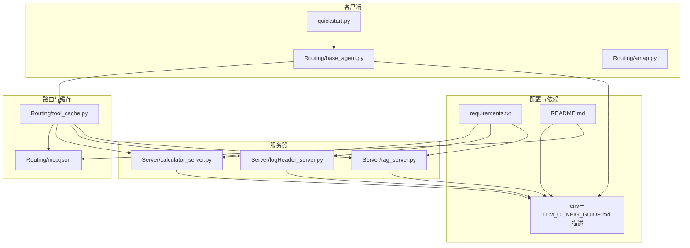
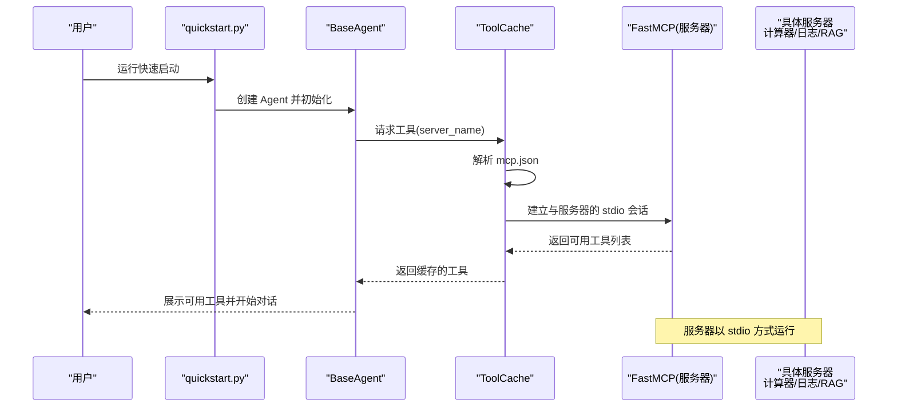
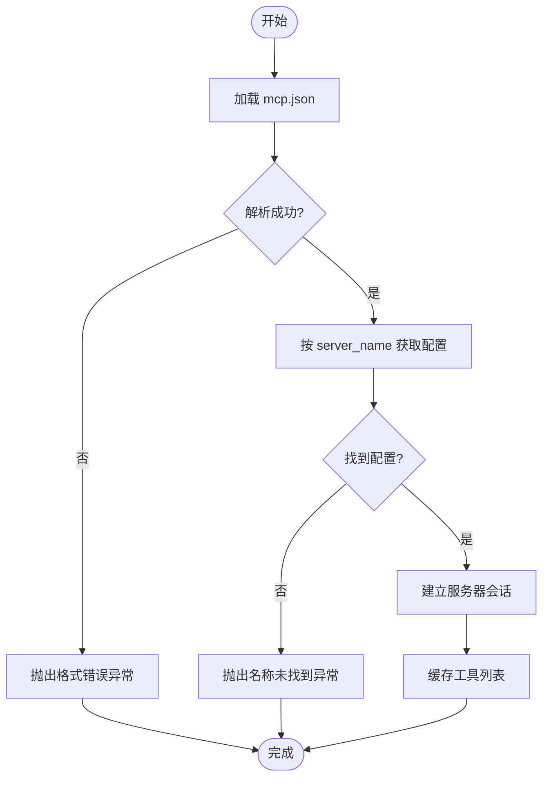
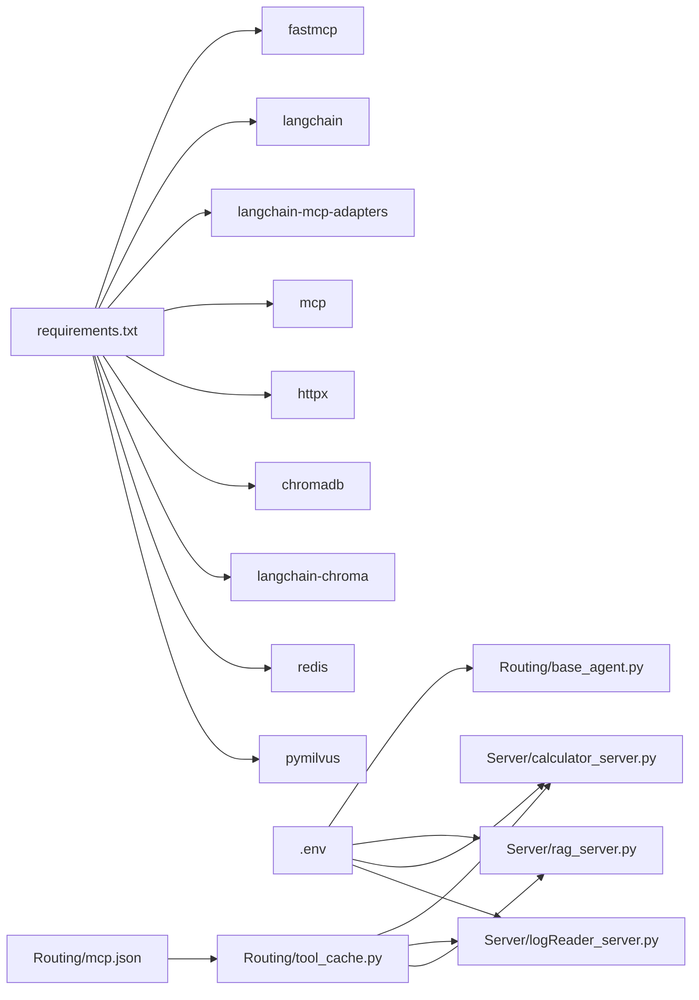

# 配置错误

<cite>
**本文引用的文件**
- [mcp.json](file://Routing/mcp.json)
- [README.md](file://README.md)
- [LLM_CONFIG_GUIDE.md](file://LLM_CONFIG_GUIDE.md)
- [requirements.txt](file://requirements.txt)
- [quickstart.py](file://quickstart.py)
- [base_agent.py](file://Routing/base_agent.py)
- [tool_cache.py](file://Routing/tool_cache.py)
- [calculator_server.py](file://Server/calculator_server.py)
- [logReader_server.py](file://Server/logReader_server.py)
- [rag_server.py](file://Server/rag_server.py)
- [amap.py](file://Routing/amap.py)
</cite>

## 目录
1. [简介](#简介)
2. [项目结构](#项目结构)
3. [核心组件](#核心组件)
4. [架构总览](#架构总览)
5. [详细组件分析](#详细组件分析)
6. [依赖分析](#依赖分析)
7. [性能考虑](#性能考虑)
8. [故障排除指南](#故障排除指南)
9. [结论](#结论)
10. [附录](#附录)

## 简介
本指南聚焦于 AiOps 项目中“配置错误”的综合排查与修复，覆盖以下方面：
- mcp.json 配置文件的语法与结构校验
- .env 文件中 API 密钥与 LLM 参数配置的正确性
- MCP 服务器、工具加载、传输通道、路径解析等关键配置问题
- 网络与端口、SSL 证书等专业配置注意事项
- 配置验证方法、工具与最佳实践，帮助避免常见陷阱

## 项目结构
项目采用“客户端-路由-服务器”三层结构，配合环境变量与 JSON 配置文件驱动运行时行为。

图表来源
- [quickstart.py:1-68](file://quickstart.py#L1-L68)
- [base_agent.py:68-89](file://Routing/base_agent.py#L68-L89)
- [tool_cache.py:67-78](file://Routing/tool_cache.py#L67-L78)
- [mcp.json:1-29](file://Routing/mcp.json#L1-L29)
- [calculator_server.py:1-111](file://Server/calculator_server.py#L1-L111)
- [logReader_server.py:1-151](file://Server/logReader_server.py#L1-L151)
- [rag_server.py:1-363](file://Server/rag_server.py#L1-L363)
- [README.md:64-69](file://README.md#L64-L69)
- [LLM_CONFIG_GUIDE.md:3-16](file://LLM_CONFIG_GUIDE.md#L3-L16)
- [requirements.txt:1-17](file://requirements.txt#L1-L17)

章节来源
- [README.md:5-36](file://README.md#L5-L36)
- [LLM_CONFIG_GUIDE.md:3-16](file://LLM_CONFIG_GUIDE.md#L3-L16)
- [requirements.txt:1-17](file://requirements.txt#L1-L17)

## 核心组件
- mcp.json：定义 MCP 服务器清单与传输方式，客户端通过工具缓存按名称解析并加载工具。
- 工具缓存（tool_cache）：负责加载 mcp.json、解析服务器配置、建立会话、缓存工具列表。
- 服务器侧：计算器、日志读取、RAG 知识库三类 MCP 服务器，均以 stdio 传输方式运行。
- 客户端 Agent：统一加载工具、绑定 LLM、执行工具调用；LLM 配置来自 .env。
- 环境变量与依赖：.env 中的 API Key 与 LLM 参数；requirements.txt 约束运行时依赖。

章节来源
- [mcp.json:1-29](file://Routing/mcp.json#L1-L29)
- [tool_cache.py:67-78](file://Routing/tool_cache.py#L67-L78)
- [base_agent.py:68-89](file://Routing/base_agent.py#L68-L89)
- [calculator_server.py:108-111](file://Server/calculator_server.py#L108-L111)
- [logReader_server.py:148-151](file://Server/logReader_server.py#L148-L151)
- [rag_server.py:356-363](file://Server/rag_server.py#L356-L363)
- [README.md:64-69](file://README.md#L64-L69)
- [LLM_CONFIG_GUIDE.md:3-16](file://LLM_CONFIG_GUIDE.md#L3-L16)
- [requirements.txt:1-17](file://requirements.txt#L1-L17)

## 架构总览
下图展示从启动到工具加载的关键流程，以及配置文件与运行时的关系。

图表来源
- [quickstart.py:14-18](file://quickstart.py#L14-L18)
- [base_agent.py:44-66](file://Routing/base_agent.py#L44-L66)
- [tool_cache.py:85-116](file://Routing/tool_cache.py#L85-L116)
- [calculator_server.py:108-111](file://Server/calculator_server.py#L108-L111)
- [logReader_server.py:148-151](file://Server/logReader_server.py#L148-L151)
- [rag_server.py:356-363](file://Server/rag_server.py#L356-L363)

## 详细组件分析

### mcp.json 配置文件
- 结构要点
  - 顶层键为 mcpServers，包含若干服务器条目。
  - 每个服务器条目包含 url/transport 或 command/args/transport 等字段。
  - 传输方式支持 streamable-http 与 stdio。
- 常见问题
  - 语法错误：JSON 格式不合法、缺少逗号或括号不匹配。
  - 字段缺失：缺少 transport、url/command+args 等关键字段。
  - 路径错误：command+args 指向的服务器脚本路径不正确。
  - 服务器名称不一致：客户端按名称查找工具，名称必须与 mcp.json 中一致。
- 诊断与修复
  - 使用 JSON 校验工具（如在线 JSON 校验器或编辑器内置校验）逐行检查。
  - 确认每个服务器条目包含正确的字段组合（HTTP 用 url+transport，本地进程用 command/args+transport）。
  - 校验路径是否存在且可执行，必要时使用相对路径或绝对路径。
  - 与客户端代码中的 server_name 保持一致。

章节来源
- [mcp.json:1-29](file://Routing/mcp.json#L1-L29)
- [tool_cache.py:80-83](file://Routing/tool_cache.py#L80-L83)

### 工具缓存与配置加载
- 工作机制
  - ToolCache 读取 mcp.json，按 server_name 获取对应配置。
  - 通过适配器建立与服务器的会话，缓存工具列表以提升性能。
- 常见问题
  - mcp.json 不存在或不可读：抛出文件不存在异常。
  - JSON 格式错误：抛出 JSON 解码错误。
  - 服务器名称未找到：返回空工具列表或报错。
- 诊断与修复
  - 确保 mcp.json 放置于工具缓存能访问的路径。
  - 修复 JSON 语法错误，确保键名拼写正确。
  - 若服务器名称不匹配，统一修改为 mcp.json 中的名称。

图表来源
- [tool_cache.py:67-78](file://Routing/tool_cache.py#L67-L78)
- [tool_cache.py:80-83](file://Routing/tool_cache.py#L80-L83)
- [tool_cache.py:85-116](file://Routing/tool_cache.py#L85-L116)

章节来源
- [tool_cache.py:67-78](file://Routing/tool_cache.py#L67-L78)
- [tool_cache.py:80-83](file://Routing/tool_cache.py#L80-L83)
- [tool_cache.py:85-116](file://Routing/tool_cache.py#L85-L116)

### LLM 与 .env 配置
- 配置来源
  - .env 文件中包含 LLM_BASE_URL、LLM_MODEL、LLM_TEMPERATURE、DASHSCOPE_API_KEY 等。
  - README 与 LLM_CONFIG_GUIDE 文档描述了配置项与切换方法。
- 常见问题
  - API Key 与 BASE_URL 不匹配：导致 LLM 调用失败。
  - 温度参数越界：超出 0-1 范围影响输出稳定性。
  - 未重启进程：修改 .env 后未重启导致配置未生效。
- 诊断与修复
  - 对照文档核对键名与默认值。
  - 使用文档提供的测试命令验证配置。
  - 修改后重启 Python 进程使环境变量生效。

章节来源
- [README.md:64-69](file://README.md#L64-L69)
- [LLM_CONFIG_GUIDE.md:3-16](file://LLM_CONFIG_GUIDE.md#L3-L16)
- [LLM_CONFIG_GUIDE.md:76-81](file://LLM_CONFIG_GUIDE.md#L76-L81)
- [base_agent.py:68-89](file://Routing/base_agent.py#L68-L89)

### MCP 服务器配置与传输
- 服务器类型
  - 计算器服务器：以 stdio 传输方式运行。
  - 日志读取服务器：以 stdio 传输方式运行。
  - RAG 知识库服务器：以 stdio 传输方式运行。
- 常见问题
  - 传输方式不匹配：客户端期望 stdio，但服务器未以 stdio 启动。
  - 服务器未就绪：进程未正确启动或阻塞。
  - 路径问题：command+args 指向的脚本路径错误。
- 诊断与修复
  - 确认 mcp.json 中 transport 与服务器实际运行方式一致。
  - 检查服务器脚本是否存在、可执行权限与路径。
  - 通过服务器启动日志确认是否以 stdio 成功启动。

章节来源
- [mcp.json:7-27](file://Routing/mcp.json#L7-L27)
- [calculator_server.py:108-111](file://Server/calculator_server.py#L108-L111)
- [logReader_server.py:148-151](file://Server/logReader_server.py#L148-L151)
- [rag_server.py:356-363](file://Server/rag_server.py#L356-L363)

### RAG 服务器与 Milvus/ChromaDB 后端
- 后端选择
  - 默认使用 ChromaDB（本地持久化）。
  - 可选 Milvus（远程，需 SSH 隧道），若依赖缺失则回退到 ChromaDB。
- 常见问题
  - 缺少 Milvus 依赖：Milvus 不可用，回退到 ChromaDB。
  - Milvus 连接失败：SSH 隧道或连接参数错误。
  - 向量库未初始化：首次使用时未创建持久化目录。
- 诊断与修复
  - 安装可选依赖以启用 Milvus。
  - 核对 Milvus 连接参数与本地端口。
  - 确认向量存储持久化目录存在或允许自动创建。

章节来源
- [rag_server.py:17-33](file://Server/rag_server.py#L17-L33)
- [rag_server.py:161-190](file://Server/rag_server.py#L161-L190)
- [rag_server.py:356-363](file://Server/rag_server.py#L356-L363)

## 依赖分析
- 运行时依赖
  - fastmcp、langchain、langchain-mcp-adapters、mcp、httpx、chromadb、langchain-chroma、redis、pymilvus 等。
- 配置与依赖关系
  - .env 中的 API Key 与 LLM 参数影响 LLM 调用。
  - mcp.json 决定工具来源与传输方式，间接影响工具可用性。
  - 服务器脚本依赖 dotenv 加载环境变量。

图表来源
- [requirements.txt:1-17](file://requirements.txt#L1-L17)
- [base_agent.py:73-78](file://Routing/base_agent.py#L73-L78)
- [rag_server.py:37-38](file://Server/rag_server.py#L37-L38)
- [calculator_server.py:9-10](file://Server/calculator_server.py#L9-L10)
- [logReader_server.py:9-12](file://Server/logReader_server.py#L9-L12)
- [mcp.json:1-29](file://Routing/mcp.json#L1-L29)
- [tool_cache.py:63-64](file://Routing/tool_cache.py#L63-L64)

章节来源
- [requirements.txt:1-17](file://requirements.txt#L1-L17)
- [base_agent.py:73-78](file://Routing/base_agent.py#L73-L78)
- [rag_server.py:37-38](file://Server/rag_server.py#L37-L38)
- [calculator_server.py:9-10](file://Server/calculator_server.py#L9-L10)
- [logReader_server.py:9-12](file://Server/logReader_server.py#L9-L12)
- [mcp.json:1-29](file://Routing/mcp.json#L1-L29)
- [tool_cache.py:63-64](file://Routing/tool_cache.py#L63-L64)

## 性能考虑
- 工具缓存：ToolCache 对工具列表进行缓存，减少重复连接与加载成本。
- 传输方式：stdio 适合本地进程，避免网络开销；HTTP 适合远端服务，注意网络延迟与超时。
- 向量库后端：Milvus 性能更优但配置复杂，ChromaDB 便于本地开发与测试。
- 环境变量加载：dotenv 在服务器脚本中按需加载，避免全局污染。

## 故障排除指南

### 1) mcp.json 语法与结构错误
- 症状
  - 工具缓存抛出 JSON 解码错误或找不到服务器名称。
- 排查步骤
  - 使用 JSON 校验工具检查语法。
  - 确认 mcpServers 下每个条目包含 transport 字段。
  - 对于本地进程服务器，确保 command+args 指向正确脚本。
- 修复建议
  - 严格遵循 mcp.json 的键名与层级。
  - 服务器名称与客户端调用保持一致。

章节来源
- [tool_cache.py:75-76](file://Routing/tool_cache.py#L75-L76)
- [mcp.json:1-29](file://Routing/mcp.json#L1-L29)

### 2) 服务器参数配置错误（transport、command/args）
- 症状
  - 工具加载失败或连接超时。
- 排查步骤
  - 检查 mcp.json 中 transport 是否与服务器实际运行方式一致。
  - 校验 command+args 指向的脚本是否存在、可执行。
- 修复建议
  - 本地服务器统一使用 stdio。
  - 使用相对路径或绝对路径明确脚本位置。

章节来源
- [mcp.json:7-27](file://Routing/mcp.json#L7-L27)
- [calculator_server.py:108-111](file://Server/calculator_server.py#L108-L111)
- [logReader_server.py:148-151](file://Server/logReader_server.py#L148-L151)
- [rag_server.py:356-363](file://Server/rag_server.py#L356-L363)

### 3) .env 中 API 密钥与 LLM 参数错误
- 症状
  - LLM 调用失败或返回认证错误。
- 排查步骤
  - 对照 README 与 LLM_CONFIG_GUIDE 核对键名与默认值。
  - 确认 API Key 与 BASE_URL 匹配。
  - 检查温度参数范围是否在 0-1。
- 修复建议
  - 按文档更新 .env。
  - 修改后重启进程使环境变量生效。

章节来源
- [README.md:64-69](file://README.md#L64-L69)
- [LLM_CONFIG_GUIDE.md:3-16](file://LLM_CONFIG_GUIDE.md#L3-L16)
- [LLM_CONFIG_GUIDE.md:76-81](file://LLM_CONFIG_GUIDE.md#L76-L81)
- [base_agent.py:73-78](file://Routing/base_agent.py#L73-L78)

### 4) 路径配置不正确（日志文件、向量库目录）
- 症状
  - 日志读取服务器找不到日志文件或读取失败。
  - RAG 服务器提示向量库未初始化。
- 排查步骤
  - 确认 logs 目录下存在 app.log 或 Logs.txt。
  - 确认 vector_store 目录存在或允许自动创建。
- 修复建议
  - 在项目根目录创建 logs 与 vector_store 目录。
  - 确保脚本有读取权限。

章节来源
- [logReader_server.py:29-44](file://Server/logReader_server.py#L29-L44)
- [logReader_server.py:71-86](file://Server/logReader_server.py#L71-L86)
- [rag_server.py:48-48](file://Server/rag_server.py#L48-L48)

### 5) 网络端口与 SSL 证书配置
- 说明
  - 项目中本地服务器以 stdio 传输为主，HTTP 服务通常由外部 MCP 服务器提供。
  - 若使用 streamable-http，需确保目标服务的端口与证书有效。
- 建议
  - 对于本地开发，优先使用 stdio。
  - 对于 HTTP 服务，检查端口连通性与证书链有效性。

章节来源
- [mcp.json:3-5](file://Routing/mcp.json#L3-L5)
- [README.md:12-12](file://README.md#L12-L12)

### 6) 配置验证方法与工具
- JSON 校验
  - 使用在线 JSON 校验器或编辑器内置校验功能。
- 运行时验证
  - 通过 quickstart.py 启动并观察工具加载数量。
  - 检查服务器启动日志确认以 stdio 启动成功。
- 环境变量验证
  - 在 Agent 初始化阶段打印或记录 LLM_BASE_URL、LLM_MODEL、DASHSCOPE_API_KEY 等关键变量。

章节来源
- [quickstart.py:14-18](file://quickstart.py#L14-L18)
- [calculator_server.py:108-111](file://Server/calculator_server.py#L108-L111)
- [base_agent.py:73-78](file://Routing/base_agent.py#L73-L78)

### 7) 配置模板与最佳实践
- mcp.json 模板要点
  - 服务器名称与客户端调用一致。
  - 本地进程服务器使用 stdio，command+args 指向正确脚本。
  - HTTP 服务器使用 streamable-http，url 指向有效服务。
- .env 模板要点
  - DASHSCOPE_API_KEY、AMAP_API_KEY 等键名与 README/LLM_CONFIG_GUIDE 一致。
  - LLM_BASE_URL、LLM_MODEL、LLM_TEMPERATURE 设置合理范围。
- 最佳实践
  - 本地开发优先使用 stdio，减少网络依赖。
  - 修改 .env 后重启进程。
  - 为不同后端（Milvus/ChromaDB）准备独立的配置说明与测试流程。

章节来源
- [mcp.json:1-29](file://Routing/mcp.json#L1-L29)
- [README.md:64-69](file://README.md#L64-L69)
- [LLM_CONFIG_GUIDE.md:3-16](file://LLM_CONFIG_GUIDE.md#L3-L16)
- [rag_server.py:177-182](file://Server/rag_server.py#L177-L182)

## 结论
- mcp.json 与 .env 是系统运行的核心配置，任何语法或字段缺失都会导致工具加载失败或 LLM 调用异常。
- 服务器以 stdio 传输为主，路径与权限是关键；HTTP 服务需关注端口与证书。
- 借助 JSON 校验、运行时日志与最小化复现，可快速定位并修复配置问题。
- 建议在团队内统一配置模板与校验流程，降低配置错误率。

## 附录

### A. 常见错误对照表
- mcp.json
  - 缺少 transport：工具加载失败
  - command/args 路径错误：服务器无法启动
  - 服务器名称不一致：找不到工具
- .env
  - API Key 与 BASE_URL 不匹配：LLM 调用失败
  - 温度参数越界：输出不稳定
  - 未重启进程：配置未生效

章节来源
- [tool_cache.py:75-76](file://Routing/tool_cache.py#L75-L76)
- [mcp.json:1-29](file://Routing/mcp.json#L1-L29)
- [README.md:64-69](file://README.md#L64-L69)
- [LLM_CONFIG_GUIDE.md:76-81](file://LLM_CONFIG_GUIDE.md#L76-L81)
- [quickstart.py:61-68](file://quickstart.py#L61-L68)