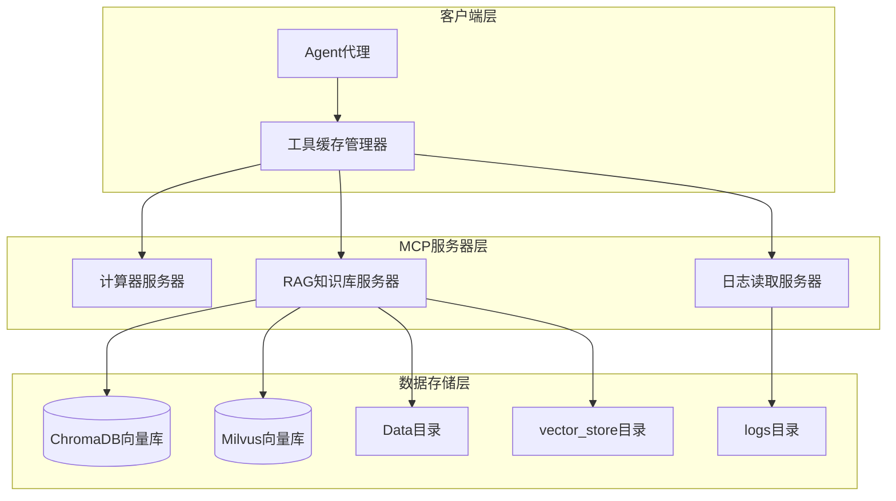
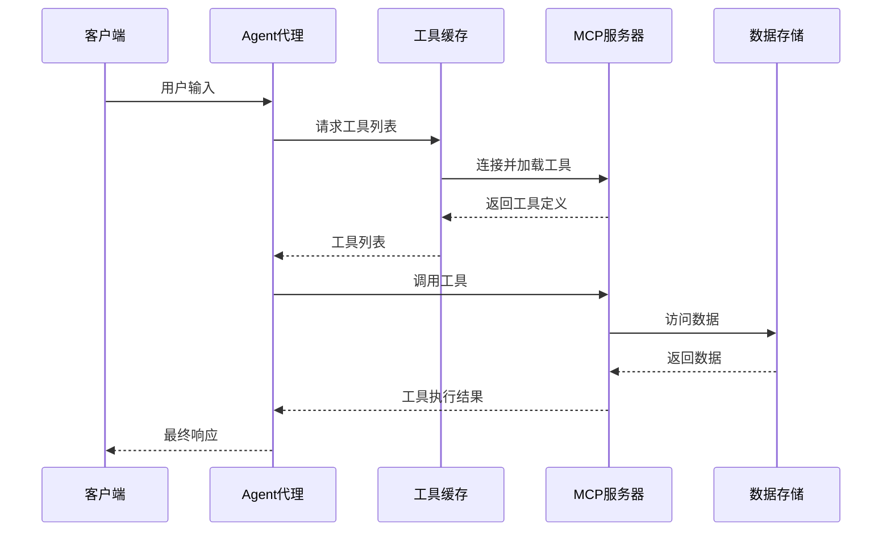
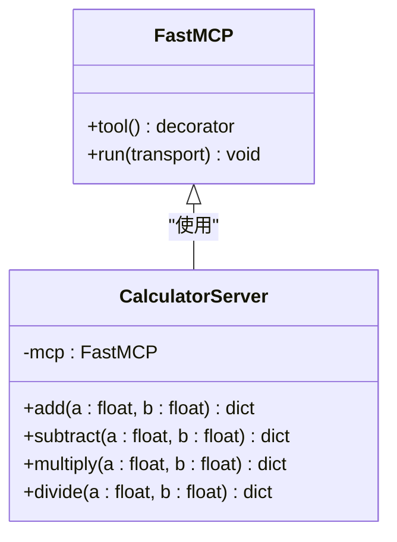
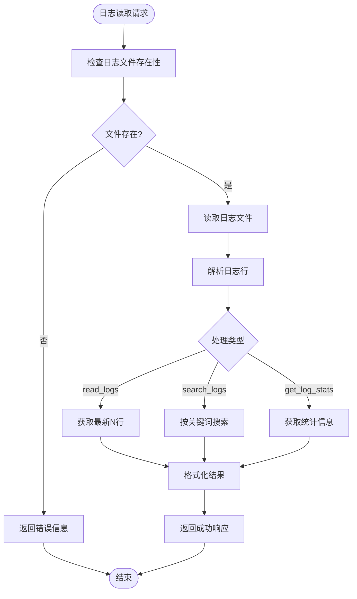
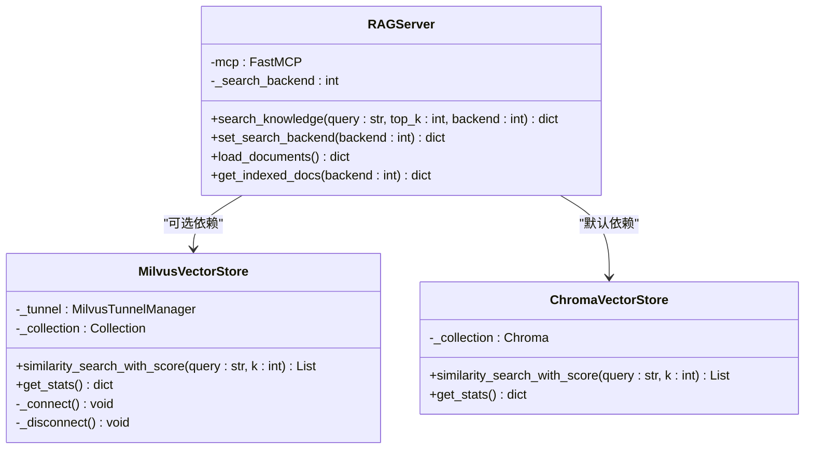
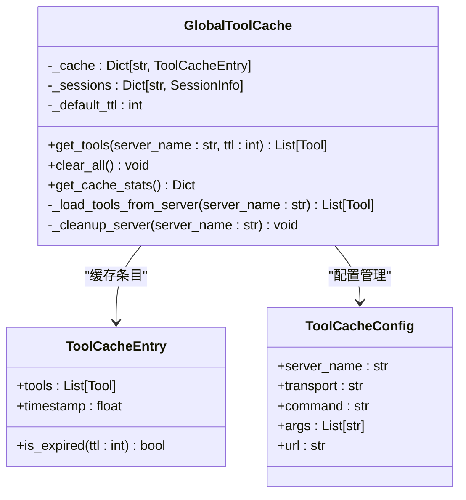
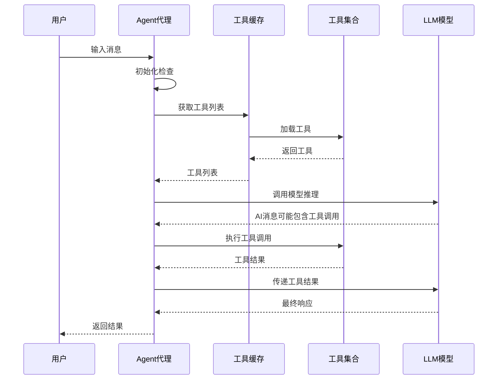
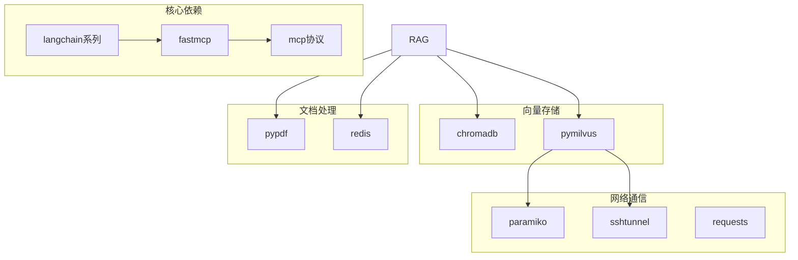
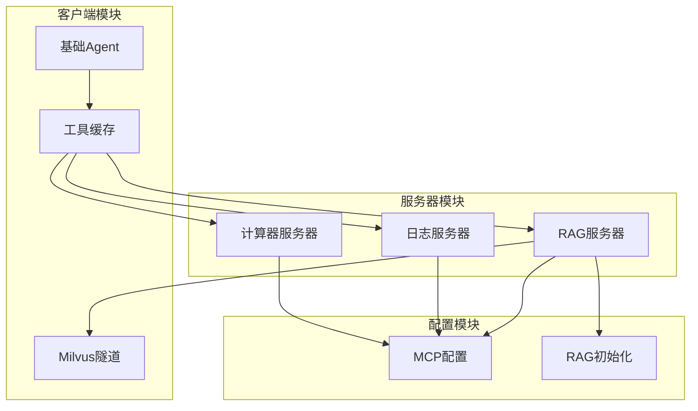

# MCP服务器架构

<cite>
**本文档引用的文件**
- [Server/__init__.py](file://Server/__init__.py)
- [Server/calculator_server.py](file://Server/calculator_server.py)
- [Server/logReader_server.py](file://Server/logReader_server.py)
- [Server/rag_server.py](file://Server/rag_server.py)
- [Server/init_rag.py](file://Server/init_rag.py)
- [Routing/mcp.json](file://Routing/mcp.json)
- [Routing/base_agent.py](file://Routing/base_agent.py)
- [Routing/tool_cache.py](file://Routing/tool_cache.py)
- [Routing/milvus_tunnel_manager.py](file://Routing/milvus_tunnel_manager.py)
- [quickstart.py](file://quickstart.py)
- [README.md](file://README.md)
- [requirements.txt](file://requirements.txt)
</cite>

## 目录
1. [简介](#简介)
2. [项目结构](#项目结构)
3. [核心组件](#核心组件)
4. [架构总览](#架构总览)
5. [详细组件分析](#详细组件分析)
6. [依赖关系分析](#依赖关系分析)
7. [性能考虑](#性能考虑)
8. [故障排除指南](#故障排除指南)
9. [结论](#结论)
10. [附录](#附录)

## 简介
本项目基于 Model Context Protocol (MCP) 构建，采用模块化设计，通过标准化协议连接 AI 模型与外部工具/数据源。系统包含多个 MCP 服务器，支持计算器、日志读取、RAG 知识库等多种工具能力，并通过 LangGraph/LangChain 客户端实现智能路由与对话管理。

## 项目结构
项目采用分层模块化组织，核心目录包括：
- Server：MCP 服务器实现（计算器、日志读取、RAG知识库）
- Routing：客户端代理与工具缓存管理
- Data：RAG知识库文档数据
- vector_store：ChromaDB向量存储持久化目录
- logs：日志文件目录
- mcp_client：LangChain MCP 客户端模块

**图表来源**
- [Routing/base_agent.py:1-497](file://Routing/base_agent.py#L1-L497)
- [Routing/tool_cache.py:1-302](file://Routing/tool_cache.py#L1-L302)
- [Server/calculator_server.py:1-111](file://Server/calculator_server.py#L1-L111)
- [Server/logReader_server.py:1-151](file://Server/logReader_server.py#L1-L151)
- [Server/rag_server.py:1-363](file://Server/rag_server.py#L1-L363)

**章节来源**
- [README.md:1-125](file://README.md#L1-L125)
- [Routing/mcp.json:1-29](file://Routing/mcp.json#L1-L29)

## 核心组件
系统由以下核心组件构成：

### 1. MCP服务器模块
- **计算器服务器**：提供基础数学运算工具（加减乘除）
- **日志读取服务器**：提供日志文件读取、搜索和统计功能
- **RAG知识库服务器**：提供向量检索知识问答服务，支持ChromaDB和Milvus两种后端

### 2. 客户端代理系统
- **BaseAgent基类**：统一的代理抽象，实现工具加载、消息处理和错误处理
- **具体Agent实现**：计算器Agent、日志读取Agent、高德地图Agent、RAG Agent
- **工具缓存管理器**：全局缓存MCP服务器连接和工具列表，支持TTL过期策略

### 3. 传输协议支持
- **stdio传输**：本地进程间通信，适用于计算器、日志读取、RAG服务器
- **streamable-http传输**：HTTP流式通信，适用于高德地图等远程服务

**章节来源**
- [Server/calculator_server.py:1-111](file://Server/calculator_server.py#L1-L111)
- [Server/logReader_server.py:1-151](file://Server/logReader_server.py#L1-L151)
- [Server/rag_server.py:1-363](file://Server/rag_server.py#L1-L363)
- [Routing/base_agent.py:1-497](file://Routing/base_agent.py#L1-L497)
- [Routing/tool_cache.py:1-302](file://Routing/tool_cache.py#L1-L302)

## 架构总览
系统采用分层架构设计，通过MCP协议实现客户端与服务器的松耦合通信。

**图表来源**
- [Routing/base_agent.py:258-318](file://Routing/base_agent.py#L258-L318)
- [Routing/tool_cache.py:85-117](file://Routing/tool_cache.py#L85-L117)
- [Routing/tool_cache.py:118-140](file://Routing/tool_cache.py#L118-L140)

## 详细组件分析

### 计算器服务器分析
计算器服务器实现了四个基本数学运算工具，采用装饰器模式注册工具函数。

**图表来源**
- [Server/calculator_server.py:5-13](file://Server/calculator_server.py#L5-L13)
- [Server/calculator_server.py:16-105](file://Server/calculator_server.py#L16-L105)

**实现特点**：
- 使用`@mcp.tool()`装饰器注册工具函数
- 每个工具函数返回标准化的数据结构
- 支持除零错误处理
- 以stdio模式运行，便于与客户端通信

**章节来源**
- [Server/calculator_server.py:1-111](file://Server/calculator_server.py#L1-L111)

### 日志读取服务器分析
日志读取服务器提供了三种核心功能：最新日志读取、关键词搜索和日志统计。

**图表来源**
- [Server/logReader_server.py:18-102](file://Server/logReader_server.py#L18-L102)
- [Server/logReader_server.py:105-145](file://Server/logReader_server.py#L105-L145)

**实现特点**：
- 支持多种日志文件命名约定
- 提供完整的错误处理和异常捕获
- 统一的返回数据格式
- 支持大小写不敏感的关键词搜索

**章节来源**
- [Server/logReader_server.py:1-151](file://Server/logReader_server.py#L1-L151)

### RAG知识库服务器分析
RAG服务器是最复杂的组件，实现了向量检索、文档加载和后端切换功能。

**图表来源**
- [Server/rag_server.py:44-45](file://Server/rag_server.py#L44-L45)
- [Server/rag_server.py:51-159](file://Server/rag_server.py#L51-L159)
- [Server/rag_server.py:161-190](file://Server/rag_server.py#L161-L190)

**核心功能**：
- **向量检索**：支持ChromaDB和Milvus两种后端
- **文档加载**：自动扫描Data目录并建立索引
- **后端切换**：运行时切换向量存储后端
- **统计查询**：获取索引状态和统计信息

**章节来源**
- [Server/rag_server.py:1-363](file://Server/rag_server.py#L1-L363)

### 工具缓存管理器分析
工具缓存管理器实现了全局缓存机制，支持多种传输协议和TTL过期策略。

**图表来源**
- [Routing/tool_cache.py:39-66](file://Routing/tool_cache.py#L39-L66)
- [Routing/tool_cache.py:27-37](file://Routing/tool_cache.py#L27-L37)
- [Routing/tool_cache.py:85-117](file://Routing/tool_cache.py#L85-L117)

**实现特点**：
- 单例模式确保全局唯一性
- 支持stdio和streamable-http两种传输协议
- TTL过期机制避免资源泄漏
- 异步操作支持高并发场景

**章节来源**
- [Routing/tool_cache.py:1-302](file://Routing/tool_cache.py#L1-L302)

### Agent代理系统分析
Agent代理系统提供了统一的工具加载和消息处理框架。

**图表来源**
- [Routing/base_agent.py:44-67](file://Routing/base_agent.py#L44-L67)
- [Routing/base_agent.py:102-130](file://Routing/base_agent.py#L102-L130)
- [Routing/base_agent.py:131-218](file://Routing/base_agent.py#L131-L218)

**章节来源**
- [Routing/base_agent.py:1-497](file://Routing/base_agent.py#L1-L497)

## 依赖关系分析

### 外部依赖关系
系统依赖以下关键库：
- **fastmcp**：MCP协议实现
- **langchain系列**：AI模型和工具集成
- **chromadb**：本地向量存储
- **pymilvus**：远程Milvus向量存储
- **paramiko/sshtunnel**：SSH隧道管理

**图表来源**
- [requirements.txt:1-17](file://requirements.txt#L1-L17)
- [Server/rag_server.py:10-16](file://Server/rag_server.py#L10-L16)

**章节来源**
- [requirements.txt:1-17](file://requirements.txt#L1-L17)

### 内部模块依赖
各模块间的依赖关系如下：

**图表来源**
- [Routing/base_agent.py:49-58](file://Routing/base_agent.py#L49-L58)
- [Routing/tool_cache.py:63-78](file://Routing/tool_cache.py#L63-L78)
- [Server/rag_server.py:24-32](file://Server/rag_server.py#L24-L32)

**章节来源**
- [Routing/base_agent.py:1-497](file://Routing/base_agent.py#L1-L497)
- [Routing/tool_cache.py:1-302](file://Routing/tool_cache.py#L1-L302)

## 性能考虑
系统在设计时充分考虑了性能优化：

### 并发处理能力
- **异步工具调用**：Agent代理使用async/await模式支持并发执行
- **工具缓存**：避免重复连接和工具加载，减少延迟
- **批量处理**：RAG服务器支持批量向量化和插入操作

### 资源管理策略
- **TTL过期机制**：工具缓存默认5分钟过期，防止内存泄漏
- **连接池管理**：MCP客户端连接复用，减少握手开销
- **SSH隧道优化**：Milvus隧道按需建立和销毁

### 缓存策略
- **多级缓存**：工具定义缓存 + 会话缓存
- **智能清理**：过期检测和主动清理
- **线程安全**：使用锁机制保证并发安全

## 故障排除指南

### 常见问题诊断
1. **MCP服务器无法启动**
   - 检查Python环境和依赖安装
   - 验证mcp.json配置文件语法
   - 确认服务器文件路径正确

2. **工具加载失败**
   - 检查工具缓存是否过期
   - 验证MCP服务器进程状态
   - 查看网络连接和防火墙设置

3. **RAG知识库问题**
   - 确认Data目录存在且可读
   - 检查向量存储初始化状态
   - 验证API密钥配置

### 调试建议
- 启用详细日志输出
- 使用独立脚本测试单个组件
- 检查环境变量配置
- 验证网络连通性

**章节来源**
- [Routing/tool_cache.py:194-196](file://Routing/tool_cache.py#L194-L196)
- [Server/rag_server.py:357-362](file://Server/rag_server.py#L357-L362)

## 结论
本MCP服务器架构采用模块化设计，通过标准化协议实现了客户端与多种工具服务器的松耦合集成。系统具有良好的可扩展性，支持新增工具和服务器类型。通过工具缓存、异步处理和多后端支持等机制，系统在性能和可靠性方面表现优异。未来可进一步扩展支持更多类型的MCP服务器和工具，满足更复杂的业务需求。

## 附录

### 新工具添加指南
1. 在对应服务器文件中添加新的工具函数
2. 使用`@mcp.tool()`装饰器注册工具
3. 确保返回数据格式标准化
4. 更新mcp.json配置文件
5. 在Agent中添加相应的系统提示词

### 服务器扩展方法
1. 创建新的服务器类继承FastMCP
2. 实现所需的工具函数
3. 配置传输协议（stdio或HTTP）
4. 添加到mcp.json配置文件
5. 在Agent中集成新服务器

### 配置文件说明
- **mcp.json**：定义MCP服务器配置和传输协议
- **.env**：环境变量配置（API密钥、端口等）
- **requirements.txt**：Python依赖包管理