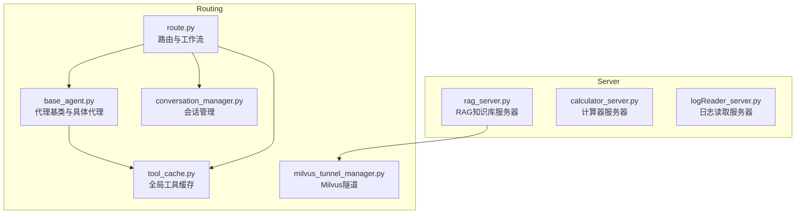
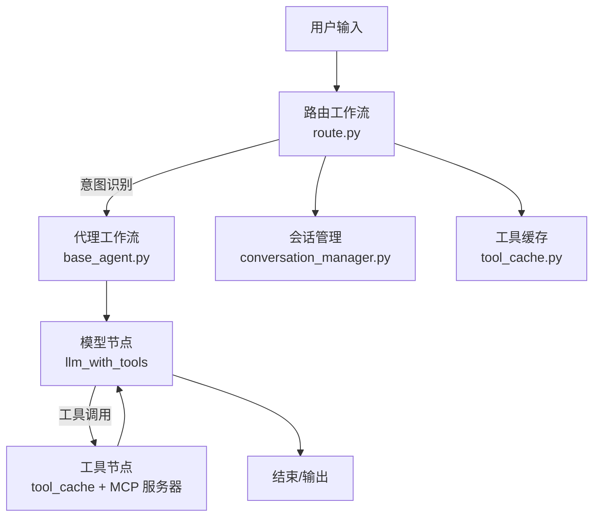
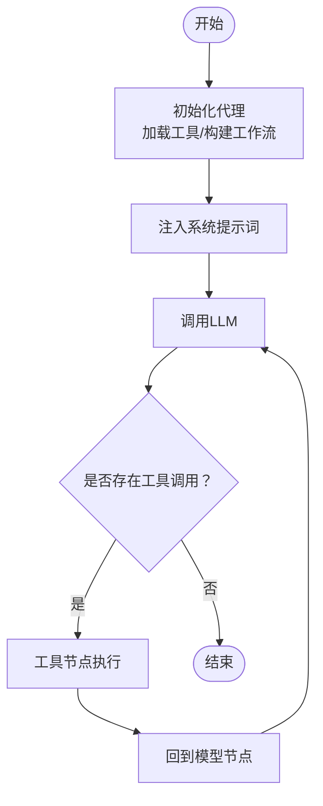
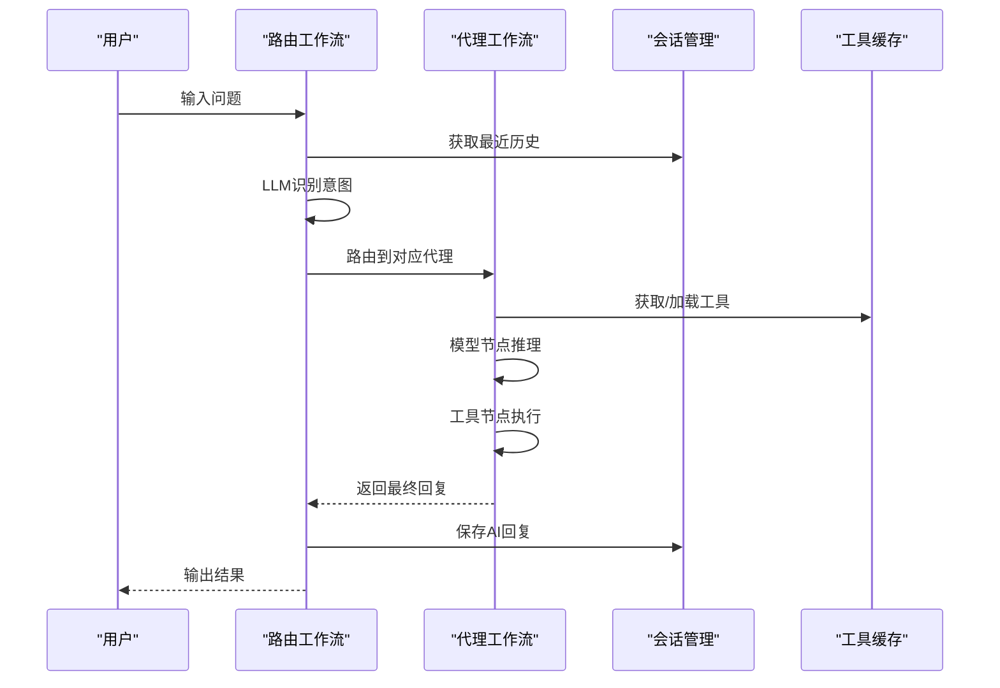
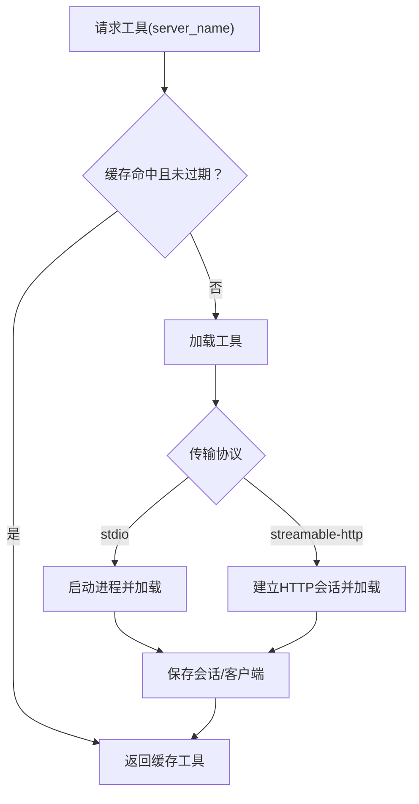
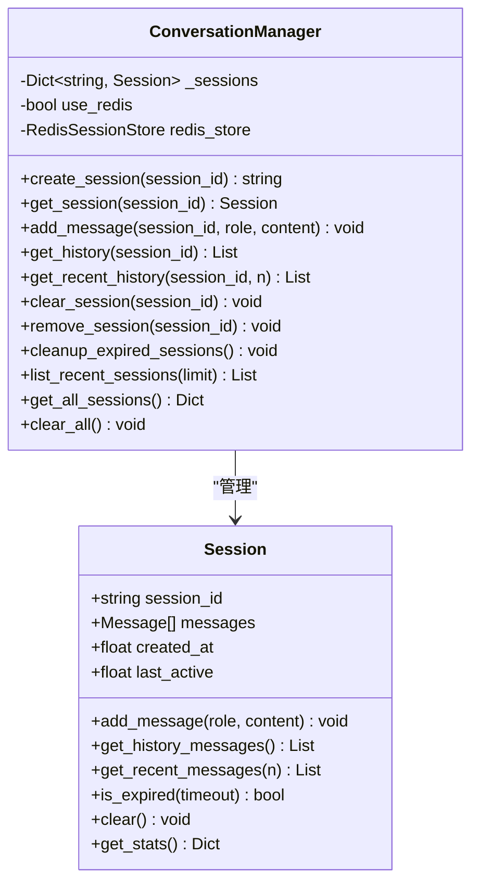
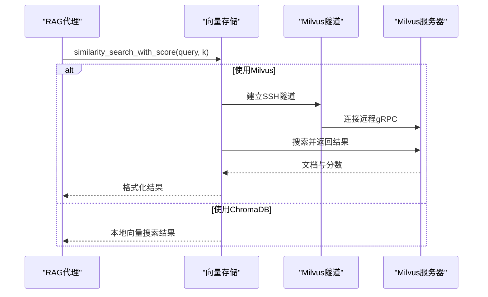
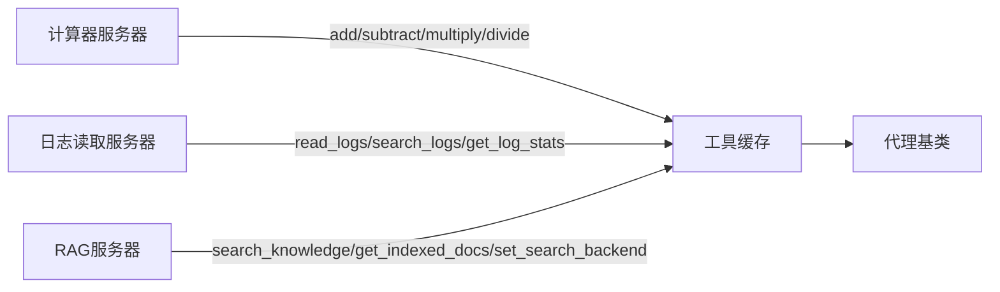
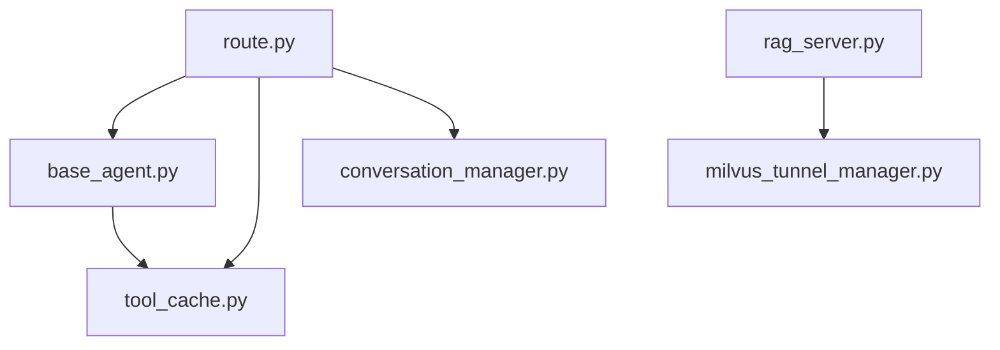

# 代理系统设计

<cite>
**本文引用的文件**   
- [Routing/base_agent.py](file://Routing/base_agent.py)
- [Routing/route.py](file://Routing/route.py)
- [Routing/tool_cache.py](file://Routing/tool_cache.py)
- [Routing/conversation_manager.py](file://Routing/conversation_manager.py)
- [Routing/milvus_tunnel_manager.py](file://Routing/milvus_tunnel_manager.py)
- [Server/rag_server.py](file://Server/rag_server.py)
- [Server/calculator_server.py](file://Server/calculator_server.py)
- [Server/logReader_server.py](file://Server/logReader_server.py)
- [Routing/mcp.json](file://Routing/mcp.json)
- [README.md](file://README.md)
- [requirements.txt](file://requirements.txt)
- [quickstart.py](file://quickstart.py)
- [demo_conversation.py](file://demo_conversation.py)
</cite>

## 目录
1. [简介](#简介)
2. [项目结构](#项目结构)
3. [核心组件](#核心组件)
4. [架构总览](#架构总览)
5. [详细组件分析](#详细组件分析)
6. [依赖分析](#依赖分析)
7. [性能考量](#性能考量)
8. [故障排查指南](#故障排查指南)
9. [结论](#结论)
10. [附录](#附录)

## 简介
本设计文档围绕基于 LangGraph 的智能代理系统展开，系统通过 Model Context Protocol (MCP) 将 LLM 与外部工具/数据源解耦，形成“路由-代理-工具”的分层架构。系统具备如下关键能力：
- 代理状态管理：统一的状态类型与节点驱动的工作流
- 工具调用机制：通过全局缓存加载 MCP 工具，按需绑定到 LLM
- 决策逻辑：路由模块根据用户输入与历史上下文选择合适代理
- 多轮对话与上下文管理：会话管理器持久化与限长控制历史消息
- 扩展性设计：新增代理类型与工具的最小改动路径
- 错误处理与异常恢复：统一的错误捕获与降级策略
- 性能监控与调试：缓存统计、会话统计与资源清理

## 项目结构
系统采用模块化组织，核心目录与职责如下：
- Routing：路由与代理实现、工具缓存、会话管理、隧道管理
- Server：MCP 工具服务器（计算器、日志读取、RAG 知识库）
- Client：客户端测试与示例（本仓库未深入分析）
- 数据与配置：mcp.json（MCP 服务器配置）、.env（环境变量）、requirements.txt（依赖）

**图表来源**
- [Routing/base_agent.py:1-497](file://Routing/base_agent.py#L1-L497)
- [Routing/route.py:1-553](file://Routing/route.py#L1-L553)
- [Routing/tool_cache.py:1-302](file://Routing/tool_cache.py#L1-L302)
- [Routing/conversation_manager.py:1-275](file://Routing/conversation_manager.py#L1-L275)
- [Routing/milvus_tunnel_manager.py:1-101](file://Routing/milvus_tunnel_manager.py#L1-L101)
- [Server/rag_server.py:1-363](file://Server/rag_server.py#L1-L363)
- [Server/calculator_server.py:1-111](file://Server/calculator_server.py#L1-L111)
- [Server/logReader_server.py:1-151](file://Server/logReader_server.py#L1-L151)

**章节来源**
- [README.md:1-125](file://README.md#L1-L125)
- [Routing/mcp.json:1-29](file://Routing/mcp.json#L1-L29)
- [requirements.txt:1-17](file://requirements.txt#L1-L17)

## 核心组件
- 代理基类与具体代理
  - 代理基类提供统一的工具加载、消息处理、错误处理与工作流构建；具体代理（计算器、日志读取、高德地图、RAG）通过系统提示词与服务器名称区分领域。
- 路由模块
  - 基于 LangGraph 的状态机，负责意图识别与代理路由，支持会话与历史上下文注入。
- 工具缓存
  - 全局单例缓存，按服务器名称与 TTL 管理 MCP 工具，避免重复加载；支持 stdio 与 streamable-http 两种传输协议。
- 会话管理
  - 单例会话管理器，支持内存与 Redis 持久化，自动清理过期会话，提供历史消息的获取与添加。
- MCP 工具服务器
  - 计算器、日志读取、RAG 知识库三类工具服务器，通过 FastMCP 暴露工具接口。

**章节来源**
- [Routing/base_agent.py:29-497](file://Routing/base_agent.py#L29-L497)
- [Routing/route.py:50-291](file://Routing/route.py#L50-L291)
- [Routing/tool_cache.py:39-302](file://Routing/tool_cache.py#L39-L302)
- [Routing/conversation_manager.py:82-275](file://Routing/conversation_manager.py#L82-L275)
- [Server/calculator_server.py:1-111](file://Server/calculator_server.py#L1-L111)
- [Server/logReader_server.py:1-151](file://Server/logReader_server.py#L1-L151)
- [Server/rag_server.py:1-363](file://Server/rag_server.py#L1-L363)

## 架构总览
系统采用“路由-代理-工具”三层架构：
- 路由层：根据用户输入与历史上下文选择代理
- 代理层：基于 LangGraph 的工作流，模型节点与工具节点交替执行
- 工具层：MCP 工具服务器，提供具体能力（计算、日志、RAG）

**图表来源**
- [Routing/route.py:149-233](file://Routing/route.py#L149-L233)
- [Routing/base_agent.py:102-130](file://Routing/base_agent.py#L102-L130)
- [Routing/base_agent.py:131-217](file://Routing/base_agent.py#L131-L217)
- [Routing/tool_cache.py:85-116](file://Routing/tool_cache.py#L85-L116)
- [Routing/conversation_manager.py:166-184](file://Routing/conversation_manager.py#L166-L184)

## 详细组件分析

### 代理基类与工作流
- 状态定义：统一的 AgentState 包含消息列表、当前步骤、工具调用记录、工具结果、最终响应与错误字段。
- 节点函数：
  - 模型节点：统一注入系统提示词，调用 LLM 并更新状态
  - 工具节点：解析上一轮 AI 消息的工具调用，按名称映射到缓存工具，执行并构造 ToolMessage
- 路由逻辑：
  - 模型节点后：若存在工具调用则转向工具节点，否则结束
  - 工具节点后：总是回到模型节点处理工具返回
- 错误处理：节点内捕获异常并写入状态 error，统一在 ainvoke 中返回

**图表来源**
- [Routing/base_agent.py:102-130](file://Routing/base_agent.py#L102-L130)
- [Routing/base_agent.py:131-217](file://Routing/base_agent.py#L131-L217)
- [Routing/base_agent.py:219-236](file://Routing/base_agent.py#L219-L236)
- [Routing/base_agent.py:238-256](file://Routing/base_agent.py#L238-L256)

**章节来源**
- [Routing/base_agent.py:19-317](file://Routing/base_agent.py#L19-L317)

### 路由与多轮对话
- 路由节点：基于 LLM 的结构化输出识别意图（计算器、日志读取、高德地图、RAG 查询），并支持历史上下文注入
- 会话管理：将用户输入与 AI 回复分别追加到历史，限制最近 N 轮，支持 Redis 持久化
- 高级 API：chat_with_session 支持循环对话，自动保存历史并返回会话 ID 与缓存统计

**图表来源**
- [Routing/route.py:149-233](file://Routing/route.py#L149-L233)
- [Routing/route.py:351-414](file://Routing/route.py#L351-L414)
- [Routing/conversation_manager.py:166-184](file://Routing/conversation_manager.py#L166-L184)
- [Routing/tool_cache.py:85-116](file://Routing/tool_cache.py#L85-L116)

**章节来源**
- [Routing/route.py:50-291](file://Routing/route.py#L50-L291)
- [Routing/conversation_manager.py:185-214](file://Routing/conversation_manager.py#L185-L214)

### 工具缓存与工具加载
- 缓存策略：按服务器名称与 TTL 缓存工具列表；首次加载后复用
- 传输协议：
  - stdio：通过 MultiServerMCPClient 启动本地进程并加载工具
  - streamable-http：通过 HTTP 会话初始化并加载工具，支持超时控制
- 连接管理：缓存 ClientSession/Transport，清理时优雅关闭
- 配置来源：mcp.json 定义各服务器的传输方式与参数

**图表来源**
- [Routing/tool_cache.py:85-116](file://Routing/tool_cache.py#L85-L116)
- [Routing/tool_cache.py:118-140](file://Routing/tool_cache.py#L118-L140)
- [Routing/tool_cache.py:141-197](file://Routing/tool_cache.py#L141-L197)
- [Routing/tool_cache.py:198-243](file://Routing/tool_cache.py#L198-L243)
- [Routing/mcp.json:1-29](file://Routing/mcp.json#L1-L29)

**章节来源**
- [Routing/tool_cache.py:39-298](file://Routing/tool_cache.py#L39-L298)
- [Routing/mcp.json:1-29](file://Routing/mcp.json#L1-L29)

### 会话管理与上下文
- 会话对象：保存消息列表、创建时间、最后活跃时间，支持限长保留与过期检查
- 会话管理器：单例，支持内存与 Redis 双层持久化，自动清理过期会话
- 历史注入：路由阶段将最近 N 轮历史拼接到系统提示词与用户输入之间，增强上下文连贯性

**图表来源**
- [Routing/conversation_manager.py:35-79](file://Routing/conversation_manager.py#L35-L79)
- [Routing/conversation_manager.py:82-275](file://Routing/conversation_manager.py#L82-L275)

**章节来源**
- [Routing/conversation_manager.py:18-275](file://Routing/conversation_manager.py#L18-L275)

### RAG 知识库与 Milvus 隧道
- 向量后端：支持 ChromaDB（本地持久化）与 Milvus（远程 SSH 隧道）
- Milvus 隧道：通过 SSH 私钥建立本地到远程 gRPC 端口的转发，保证安全连接
- 工具接口：search_knowledge、get_indexed_docs、set_search_backend 等

**图表来源**
- [Server/rag_server.py:51-160](file://Server/rag_server.py#L51-L160)
- [Routing/milvus_tunnel_manager.py:20-89](file://Routing/milvus_tunnel_manager.py#L20-L89)

**章节来源**
- [Server/rag_server.py:161-363](file://Server/rag_server.py#L161-L363)
- [Routing/milvus_tunnel_manager.py:14-101](file://Routing/milvus_tunnel_manager.py#L14-L101)

### 工具服务器与系统集成
- 计算器服务器：提供加减乘除工具，返回标准结构
- 日志读取服务器：读取最新日志、按关键词搜索、获取统计信息
- RAG 服务器：提供知识检索、索引统计、后端切换

**图表来源**
- [Server/calculator_server.py:16-105](file://Server/calculator_server.py#L16-L105)
- [Server/logReader_server.py:18-145](file://Server/logReader_server.py#L18-L145)
- [Server/rag_server.py:193-353](file://Server/rag_server.py#L193-L353)
- [Routing/tool_cache.py:85-116](file://Routing/tool_cache.py#L85-L116)

**章节来源**
- [Server/calculator_server.py:1-111](file://Server/calculator_server.py#L1-L111)
- [Server/logReader_server.py:1-151](file://Server/logReader_server.py#L1-L151)
- [Server/rag_server.py:1-363](file://Server/rag_server.py#L1-L363)

## 依赖分析
- 外部依赖：LangChain、LangGraph、MCP 协议、FastMCP、DashScope、Redis、SSH 隧道、Milvus 等
- 模块耦合：
  - base_agent 依赖 tool_cache 与 LLM
  - route 依赖 base_agent、tool_cache、conversation_manager
  - rag_server 依赖 Milvus 隧道与嵌入模型
- 潜在风险：工具加载超时、SSH 隧道失败、Redis 连接异常

**图表来源**
- [Routing/route.py:14-28](file://Routing/route.py#L14-L28)
- [Routing/base_agent.py:49-88](file://Routing/base_agent.py#L49-L88)
- [Server/rag_server.py:17-33](file://Server/rag_server.py#L17-L33)

**章节来源**
- [requirements.txt:1-17](file://requirements.txt#L1-L17)
- [Routing/route.py:14-28](file://Routing/route.py#L14-L28)
- [Routing/base_agent.py:49-88](file://Routing/base_agent.py#L49-L88)

## 性能考量
- 工具缓存命中率：通过 TTL 与全局缓存减少重复加载，显著降低冷启动延迟
- 会话历史长度：限制最近 N 轮，避免上下文过长导致的性能与成本上升
- 连接复用：缓存 MCP 会话与客户端，避免频繁创建销毁
- 异步执行：LangGraph 与 asyncio 并行处理，提高吞吐
- 资源清理：会话结束时清理缓存与连接，防止资源泄漏

[本节为通用性能建议，不直接分析具体文件]

## 故障排查指南
- 工具加载失败
  - 检查 mcp.json 中服务器配置与传输协议
  - stdio：确认命令与参数路径正确，权限允许
  - streamable-http：检查网络与超时设置
- SSH 隧道失败
  - 核对密钥格式与路径，确认远端端口可达
- Redis 连接异常
  - 检查主机、端口、密码与 TTL 配置
- 代理执行错误
  - 查看代理节点的错误状态字段，结合工具返回内容定位问题
- 资源清理
  - 使用清理接口确保缓存与连接被释放

**章节来源**
- [Routing/tool_cache.py:198-243](file://Routing/tool_cache.py#L198-L243)
- [Routing/milvus_tunnel_manager.py:50-89](file://Routing/milvus_tunnel_manager.py#L50-L89)
- [Routing/route.py:434-456](file://Routing/route.py#L434-L456)

## 结论
该系统通过 LangGraph 与 MCP 协议实现了高内聚、低耦合的智能代理架构。统一的代理基类与工具缓存消除了重复代码，路由模块与会话管理提供了强大的多轮对话能力。RAG 与 Milvus 隧道的结合满足了远程向量检索需求。整体设计具备良好的扩展性与可维护性，适合持续演进与功能扩展。

[本节为总结性内容，不直接分析具体文件]

## 附录

### 扩展性设计要点
- 新增代理类型
  - 继承代理基类，实现服务器名称与系统提示词
  - 在路由模块中注册处理节点与条件边
- 新增工具
  - 在对应 MCP 服务器中新增工具函数，更新 mcp.json 配置
  - 代理基类自动加载并绑定工具
- 新增向量后端
  - 在 RAG 服务器中扩展后端切换逻辑，必要时新增隧道管理器

**章节来源**
- [Routing/base_agent.py:322-497](file://Routing/base_agent.py#L322-L497)
- [Routing/route.py:258-291](file://Routing/route.py#L258-L291)
- [Server/rag_server.py:161-277](file://Server/rag_server.py#L161-L277)

### 快速开始与演示
- 快速启动：创建代理、查看工具、发起示例对话
- 演示脚本：展示工具缓存、循环对话与会话管理

**章节来源**
- [quickstart.py:1-68](file://quickstart.py#L1-L68)
- [demo_conversation.py:19-102](file://demo_conversation.py#L19-L102)