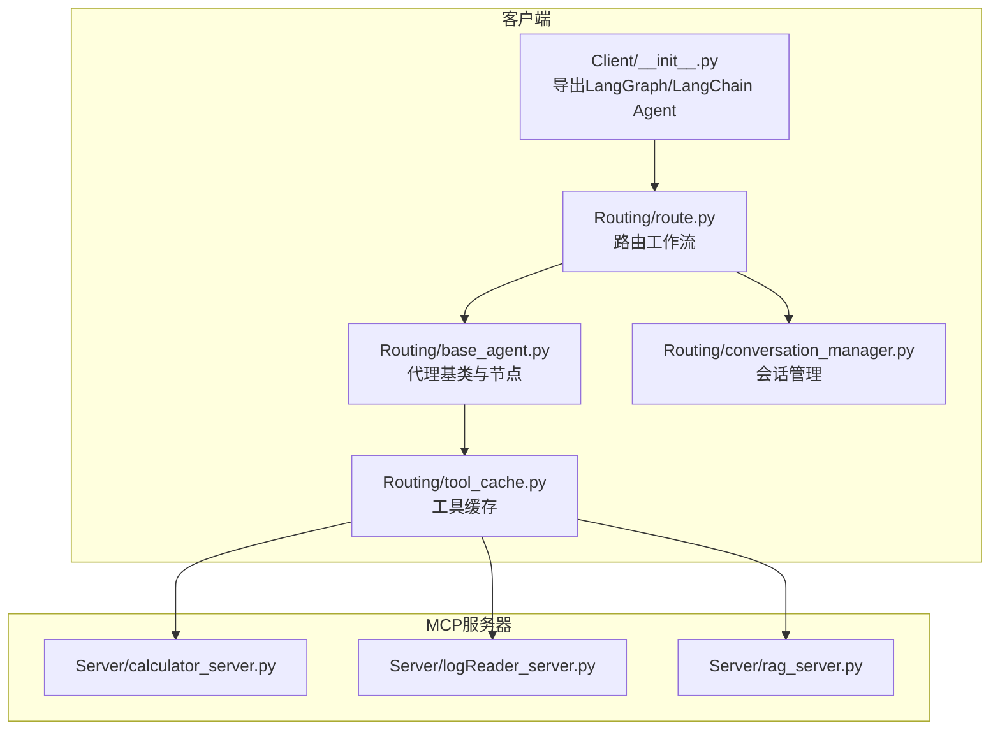
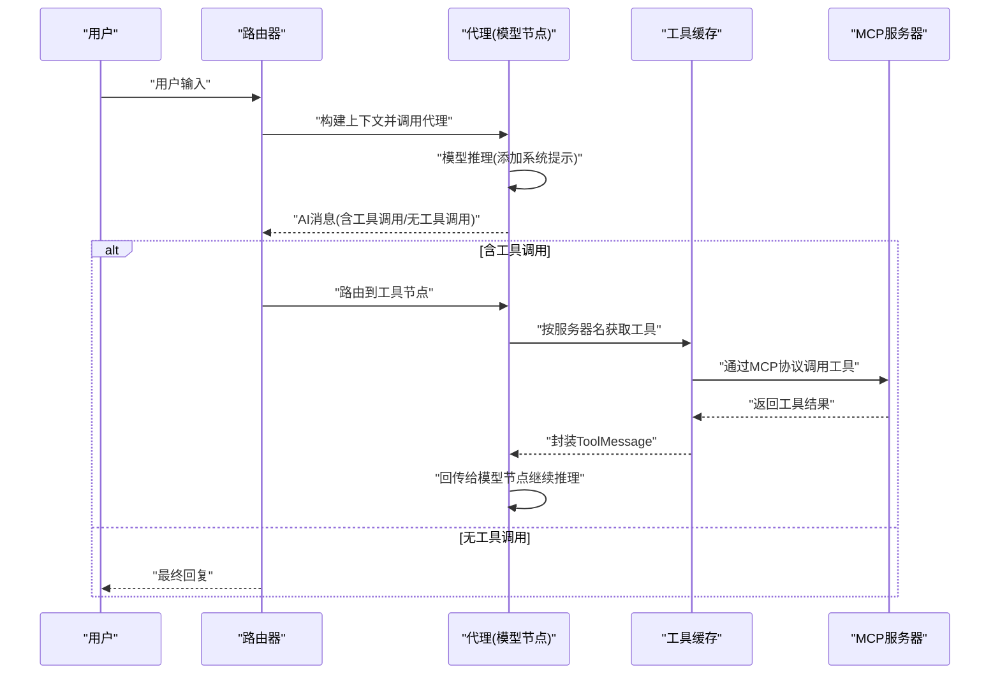
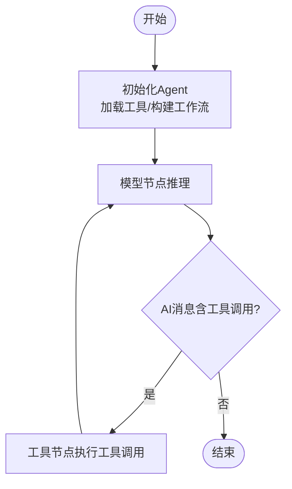
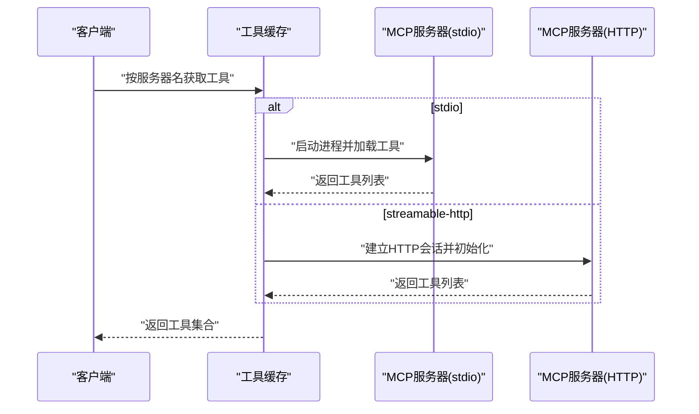
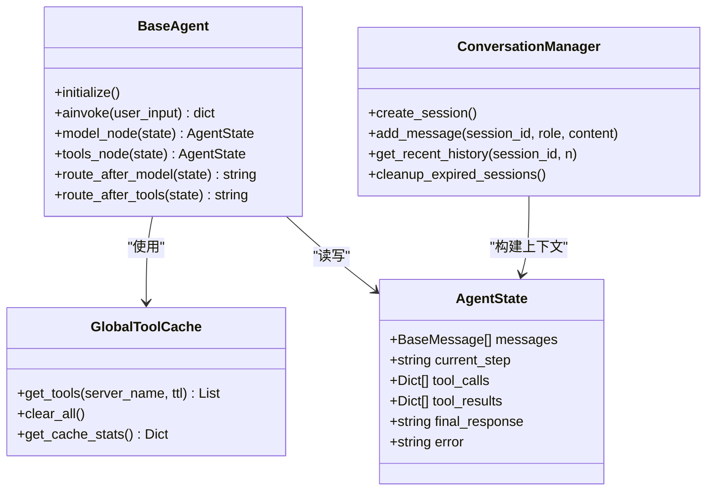
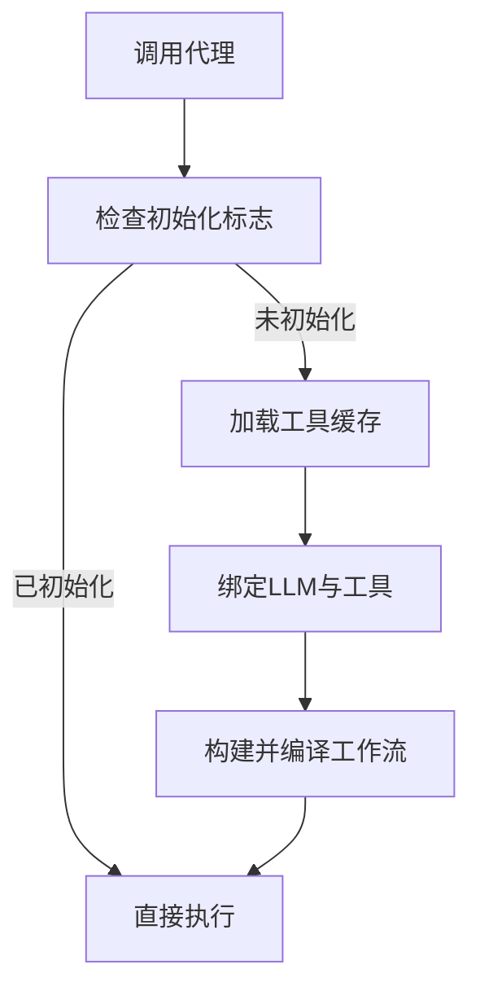
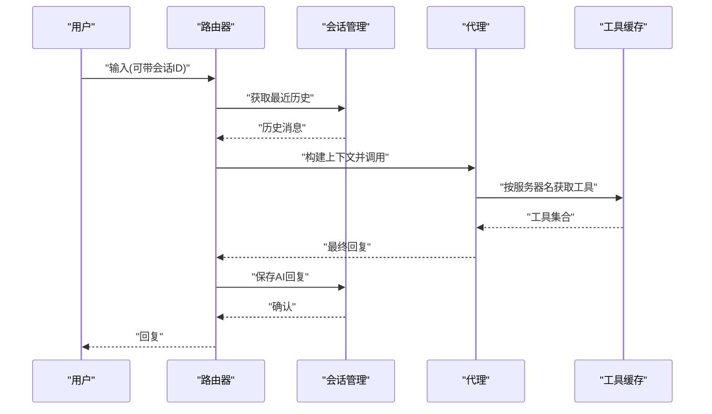
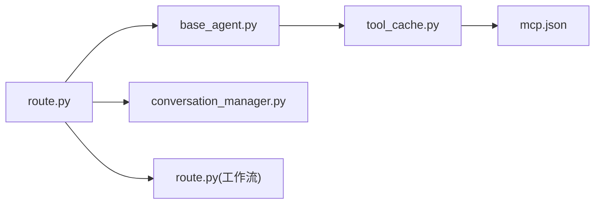

# 客户端架构设计

<cite>
**本文档引用的文件**
- [Client/__init__.py](file://Client/__init__.py)
- [Routing/base_agent.py](file://Routing/base_agent.py)
- [Routing/route.py](file://Routing/route.py)
- [Routing/tool_cache.py](file://Routing/tool_cache.py)
- [Routing/conversation_manager.py](file://Routing/conversation_manager.py)
- [Routing/mcp.json](file://Routing/mcp.json)
- [quickstart.py](file://quickstart.py)
- [demo_conversation.py](file://demo_conversation.py)
- [requirements.txt](file://requirements.txt)
- [README.md](file://README.md)
</cite>

## 目录
1. [引言](#引言)
2. [项目结构](#项目结构)
3. [核心组件](#核心组件)
4. [架构总览](#架构总览)
5. [详细组件分析](#详细组件分析)
6. [依赖关系分析](#依赖关系分析)
7. [性能考虑](#性能考虑)
8. [故障排除指南](#故障排除指南)
9. [结论](#结论)
10. [附录](#附录)

## 引言
本文件面向基于LangGraph的MCP客户端实现，系统性阐述其架构设计、状态管理机制、与MCP服务器的通信协议与数据交换格式、模块化职责划分、初始化与配置管理、错误处理机制，以及请求处理的完整生命周期。同时提供架构图与数据流图，帮助读者快速理解系统的整体运作方式。

## 项目结构
该项目采用模块化组织方式，围绕“路由-代理-工具缓存-会话管理”四个核心维度展开：
- Client：对外导出LangGraph MCP Agent与LangChain MCP Agent的创建入口
- Routing：路由与代理实现、工具缓存、会话管理、工具节点与结束逻辑
- Server：MCP服务器示例（计算器、日志读取、RAG）
- Client与Server之间通过MCP协议通信，工具通过langchain-mcp-adapters动态加载

**图表来源**
- [Client/__init__.py:1-12](file://Client/__init__.py#L1-L12)
- [Routing/route.py:1-553](file://Routing/route.py#L1-L553)
- [Routing/base_agent.py:1-497](file://Routing/base_agent.py#L1-L497)
- [Routing/tool_cache.py:1-302](file://Routing/tool_cache.py#L1-L302)
- [Routing/conversation_manager.py:1-275](file://Routing/conversation_manager.py#L1-L275)

**章节来源**
- [README.md:1-125](file://README.md#L1-L125)
- [requirements.txt:1-17](file://requirements.txt#L1-L17)

## 核心组件
- LangGraph MCP Agent：基于LangGraph的状态机，包含模型节点、工具节点与条件路由，支持工具调用与结果回传
- 工具缓存（GlobalToolCache）：统一管理MCP服务器连接与工具列表，支持TTL过期与多传输协议（stdio/streamable-http）
- 会话管理（ConversationManager）：支持多轮对话历史、Redis持久化、自动清理
- 路由器（Router Workflow）：根据用户输入与历史上下文进行意图识别与代理路由
- MCP配置（mcp.json）：定义各MCP服务器的传输方式与参数

**章节来源**
- [Routing/base_agent.py:19-318](file://Routing/base_agent.py#L19-L318)
- [Routing/tool_cache.py:27-297](file://Routing/tool_cache.py#L27-L297)
- [Routing/conversation_manager.py:18-274](file://Routing/conversation_manager.py#L18-L274)
- [Routing/route.py:50-291](file://Routing/route.py#L50-L291)
- [Routing/mcp.json:1-29](file://Routing/mcp.json#L1-L29)

## 架构总览
LangGraph MCP Agent采用“状态驱动”的工作流模式：用户输入进入初始状态，经模型节点生成AI消息（可能包含工具调用），工具节点执行具体工具调用并将结果作为ToolMessage回传给模型节点，形成“模型-工具-模型”的迭代直至结束。

**图表来源**
- [Routing/route.py:60-147](file://Routing/route.py#L60-L147)
- [Routing/base_agent.py:102-217](file://Routing/base_agent.py#L102-L217)
- [Routing/tool_cache.py:85-140](file://Routing/tool_cache.py#L85-L140)

## 详细组件分析

### LangGraph Agent工作原理与状态管理
- 状态定义：AgentState包含消息列表、当前步骤、工具调用记录、工具结果、最终响应与错误字段
- 节点职责：
  - 模型节点：注入系统提示词，调用LLM生成AI消息；异常时记录错误
  - 工具节点：解析AI消息中的工具调用，按服务器名从缓存获取工具并执行，封装ToolMessage回传
- 路由逻辑：
  - 模型节点后：若AI消息含工具调用则路由到工具节点，否则结束
  - 工具节点后：总是回到模型节点处理工具结果
- 结束逻辑：当模型节点无工具调用时，工作流结束，返回最终AI消息内容或错误信息

**图表来源**
- [Routing/base_agent.py:19-318](file://Routing/base_agent.py#L19-L318)

**章节来源**
- [Routing/base_agent.py:19-318](file://Routing/base_agent.py#L19-L318)

### 客户端与MCP服务器通信协议与数据交换
- 传输协议：
  - stdio：通过MultiServerMCPClient启动本地进程，适用于计算器、日志读取、RAG服务器
  - streamable-http：通过streamable_http_client建立HTTP会话，适用于高德地图服务器
- 数据交换格式：
  - 工具调用：AI消息包含工具调用数组（名称、参数、ID）
  - 工具结果：ToolMessage（内容为工具返回值，ToolMessage.id对应调用ID）
  - 错误处理：工具执行异常时ToolMessage内容为错误信息
- 配置文件：mcp.json定义服务器名称、传输方式与参数（命令/参数或URL）

**图表来源**
- [Routing/tool_cache.py:118-243](file://Routing/tool_cache.py#L118-L243)
- [Routing/mcp.json:1-29](file://Routing/mcp.json#L1-L29)

**章节来源**
- [Routing/tool_cache.py:118-243](file://Routing/tool_cache.py#L118-L243)
- [Routing/mcp.json:1-29](file://Routing/mcp.json#L1-L29)

### 模块化设计与职责划分
- 状态定义（AgentState）：统一消息、步骤、工具调用与结果、错误与最终响应
- 节点实现：
  - 模型节点：负责LLM推理与系统提示词注入
  - 工具节点：负责工具解析、执行与结果封装
- 工具节点与结束逻辑：
  - 工具节点：按服务器名映射工具并执行，异常时记录错误
  - 结束逻辑：无工具调用即结束，返回最终AI消息或错误
- 路由模块：根据历史上下文与用户输入进行意图识别，路由到相应代理

**图表来源**
- [Routing/base_agent.py:19-318](file://Routing/base_agent.py#L19-L318)
- [Routing/tool_cache.py:27-297](file://Routing/tool_cache.py#L27-L297)
- [Routing/conversation_manager.py:18-274](file://Routing/conversation_manager.py#L18-L274)

**章节来源**
- [Routing/base_agent.py:19-318](file://Routing/base_agent.py#L19-L318)
- [Routing/conversation_manager.py:18-274](file://Routing/conversation_manager.py#L18-L274)

### 初始化流程、配置管理与错误处理
- 初始化流程：
  - 延迟初始化：首次调用时才加载工具、构建工作流
  - 工具加载：按服务器名从缓存获取工具，支持TTL过期与重载
  - LLM绑定：从环境变量读取LLM配置，绑定工具
- 配置管理：
  - 环境变量：DASHSCOPE_API_KEY、LLM_BASE_URL、LLM_MODEL、LLM_TEMPERATURE
  - MCP配置：mcp.json定义服务器与传输方式
  - 会话持久化：Redis配置（主机、端口、密码、TTL）
- 错误处理：
  - 模型节点：捕获LLM调用异常并记录错误
  - 工具节点：捕获工具执行异常并封装ToolMessage
  - 路由器：未知意图返回错误处理器

**图表来源**
- [Routing/base_agent.py:44-66](file://Routing/base_agent.py#L44-L66)
- [Routing/base_agent.py:68-89](file://Routing/base_agent.py#L68-L89)

**章节来源**
- [Routing/base_agent.py:44-89](file://Routing/base_agent.py#L44-L89)
- [Routing/route.py:298-347](file://Routing/route.py#L298-L347)
- [Routing/mcp.json:1-29](file://Routing/mcp.json#L1-L29)

### 请求处理完整生命周期
- 路由阶段：根据会话历史与当前输入，使用LLM识别意图并路由到相应代理
- 代理阶段：代理内部工作流循环（模型-工具-模型），直到无工具调用结束
- 会话阶段：将用户输入与AI回复写入会话历史，支持多轮对话

**图表来源**
- [Routing/route.py:111-147](file://Routing/route.py#L111-L147)
- [Routing/route.py:351-414](file://Routing/route.py#L351-L414)
- [Routing/conversation_manager.py:166-184](file://Routing/conversation_manager.py#L166-L184)

**章节来源**
- [Routing/route.py:111-147](file://Routing/route.py#L111-L147)
- [Routing/route.py:351-414](file://Routing/route.py#L351-L414)
- [Routing/conversation_manager.py:166-184](file://Routing/conversation_manager.py#L166-L184)

## 依赖关系分析
- 外部依赖：langchain、langgraph、mcp、langchain-mcp-adapters、fastmcp、redis、sshtunnel等
- 内部模块耦合：
  - BaseAgent依赖GlobalToolCache与环境变量
  - Router依赖BaseAgent工厂方法与ConversationManager
  - GlobalToolCache依赖mcp.json与MCP服务器

**图表来源**
- [Routing/base_agent.py:49-60](file://Routing/base_agent.py#L49-L60)
- [Routing/route.py:16-24](file://Routing/route.py#L16-L24)
- [Routing/tool_cache.py:67-78](file://Routing/tool_cache.py#L67-L78)

**章节来源**
- [requirements.txt:1-17](file://requirements.txt#L1-L17)
- [Routing/base_agent.py:49-60](file://Routing/base_agent.py#L49-L60)
- [Routing/route.py:16-24](file://Routing/route.py#L16-L24)
- [Routing/tool_cache.py:67-78](file://Routing/tool_cache.py#L67-L78)

## 性能考虑
- 工具缓存：避免重复加载MCP服务器工具，支持TTL过期与连接复用
- 会话管理：限制历史长度、定期清理过期会话，降低内存占用
- 并发处理：异步调用LLM与工具，减少阻塞；工具执行串行避免竞态（根据系统需求可扩展为批量）
- 网络优化：HTTP传输设置超时，stdio进程按需启动，减少无效连接
- 配置优化：通过环境变量统一管理LLM参数，便于部署与扩缩容

[本节为通用性能建议，无需特定文件引用]

## 故障排除指南
- 工具加载失败：
  - 检查mcp.json中服务器配置与传输方式
  - 确认stdio服务器路径与权限、streamable-http URL与API Key
- LLM调用异常：
  - 核对DASHSCOPE_API_KEY与LLM_BASE_URL、LLM_MODEL、LLM_TEMPERATURE
- 会话持久化问题：
  - 检查Redis连接参数与网络可达性
- 超时与连接失败：
  - 调整HTTP超时时间，检查SSH隧道配置

**章节来源**
- [Routing/tool_cache.py:194-196](file://Routing/tool_cache.py#L194-L196)
- [Routing/tool_cache.py:222-223](file://Routing/tool_cache.py#L222-L223)
- [Routing/route.py:302-324](file://Routing/route.py#L302-L324)

## 结论
该LangGraph MCP客户端通过“状态驱动”的工作流模式实现了与MCP服务器的高效协作，配合全局工具缓存与会话管理，提供了稳定、可扩展的多轮对话能力。模块化设计使代理、路由、缓存与会话管理职责清晰，便于维护与演进。建议在生产环境中进一步完善并发控制、监控与可观测性，以支撑更高负载场景。

## 附录
- 快速启动：参考quickstart.py与README.md的使用说明
- 演示脚本：demo_conversation.py展示工具缓存与多轮对话效果
- 自动化测试：test_automated.py提供天气查询的自动化测试用例

**章节来源**
- [quickstart.py:1-68](file://quickstart.py#L1-L68)
- [demo_conversation.py:1-102](file://demo_conversation.py#L1-L102)
- [test/test_automated.py:1-52](file://test/test_automated.py#L1-L52)
- [README.md:51-78](file://README.md#L51-L78)