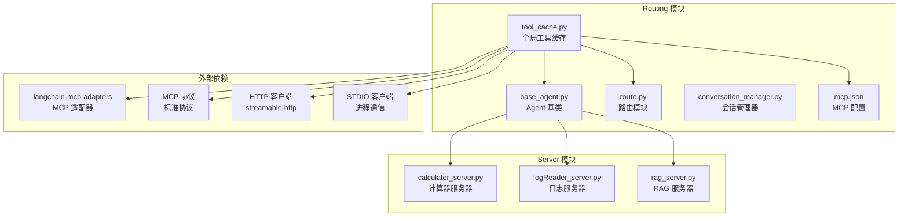
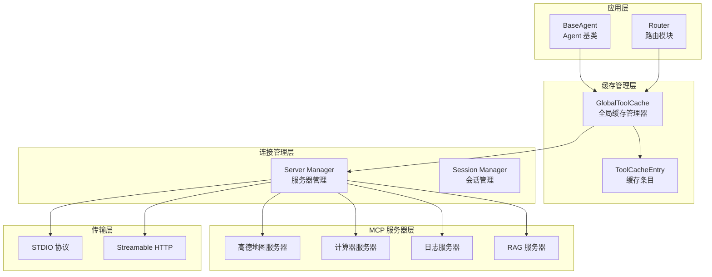
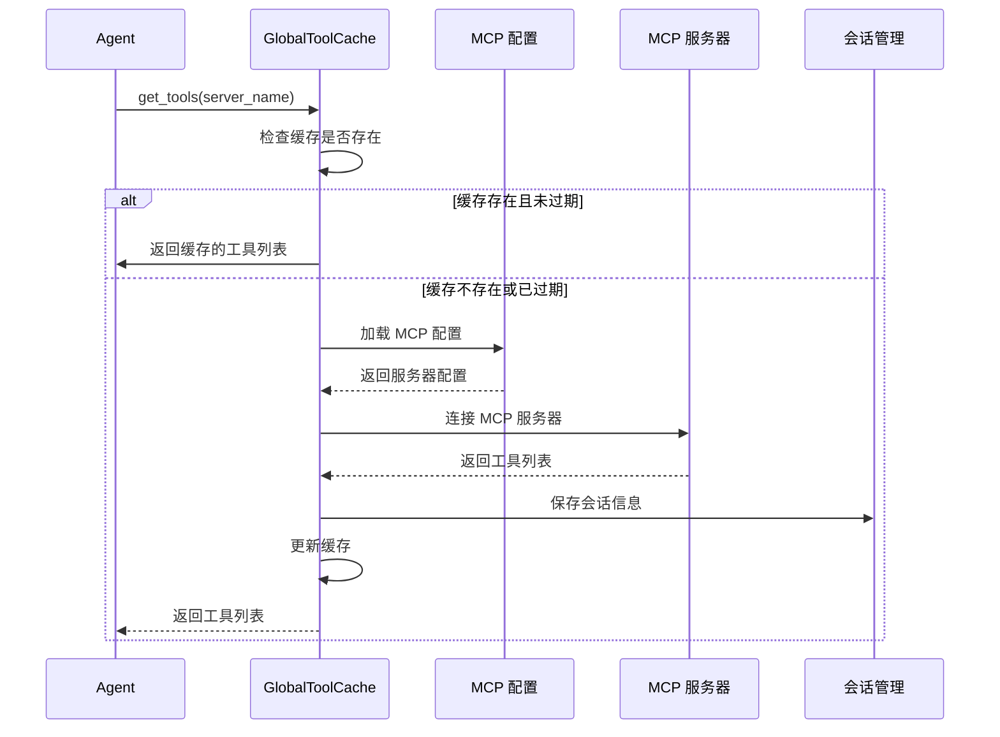
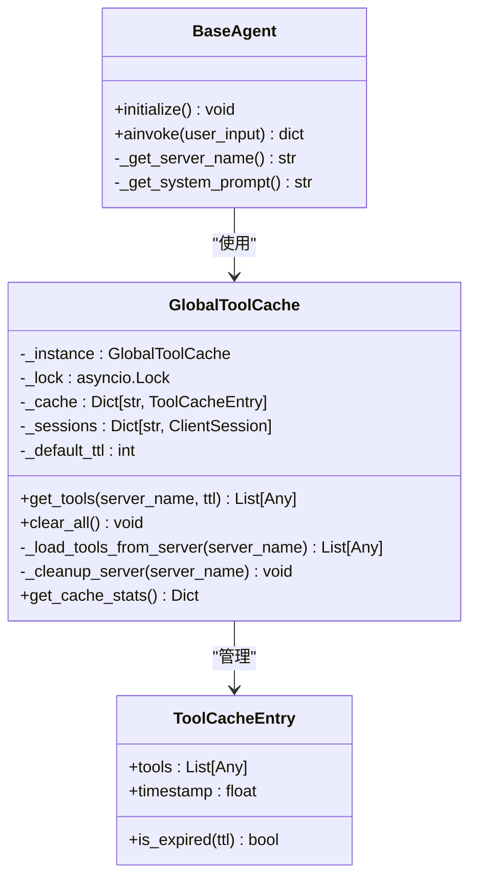
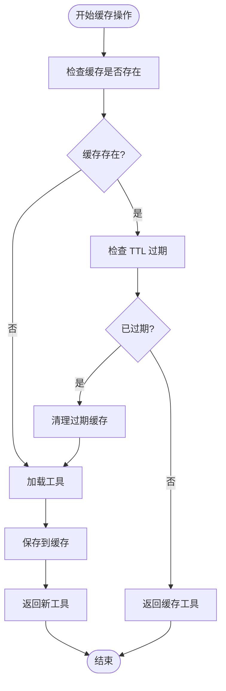
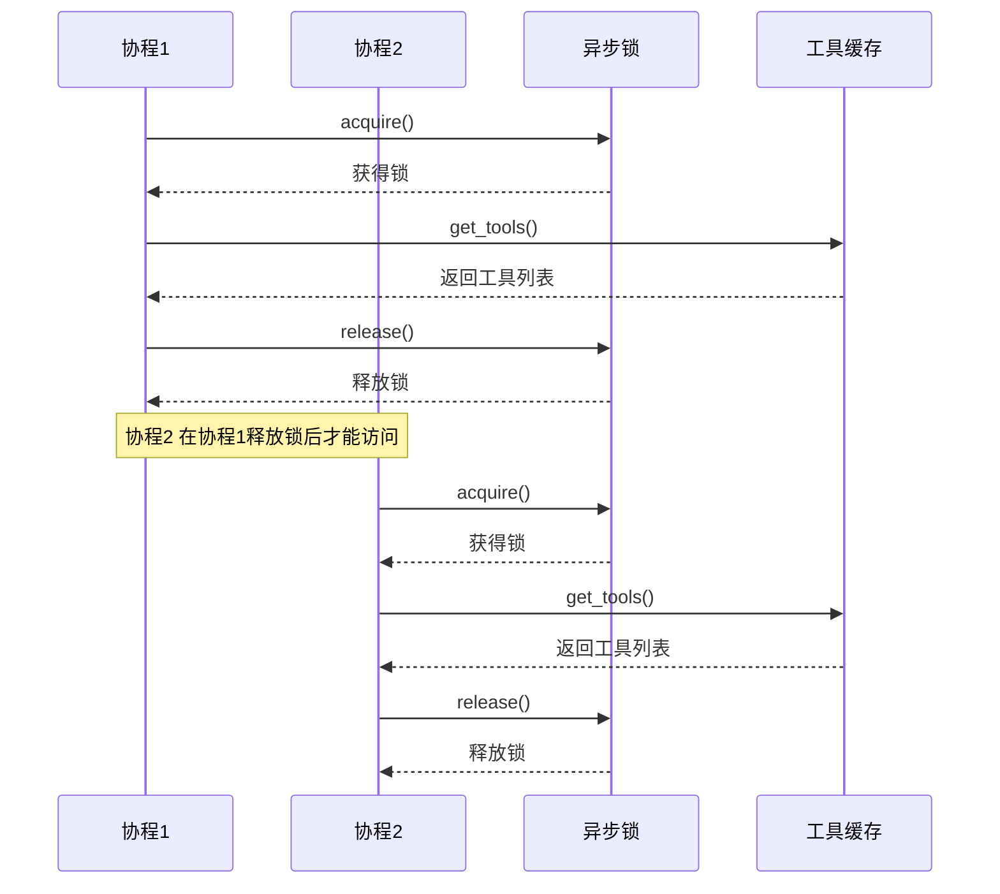
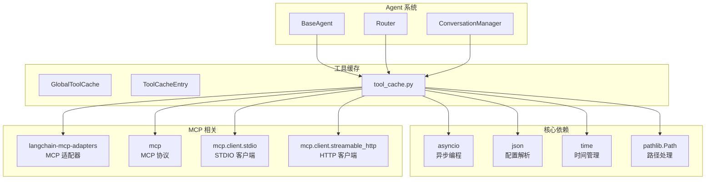

# 工具缓存系统

<cite>
**本文档引用的文件**
- [tool_cache.py](file://Routing/tool_cache.py)
- [base_agent.py](file://Routing/base_agent.py)
- [route.py](file://Routing/route.py)
- [mcp.json](file://Routing/mcp.json)
- [conversation_manager.py](file://Routing/conversation_manager.py)
- [requirements.txt](file://requirements.txt)
- [README.md](file://README.md)
</cite>

## 目录
1. [简介](#简介)
2. [项目结构](#项目结构)
3. [核心组件](#核心组件)
4. [架构概览](#架构概览)
5. [详细组件分析](#详细组件分析)
6. [依赖关系分析](#依赖关系分析)
7. [性能考虑](#性能考虑)
8. [故障排除指南](#故障排除指南)
9. [结论](#结论)

## 简介

工具缓存系统是基于 Model Context Protocol (MCP) 构建的智能代理系统的核心组件，旨在通过标准化协议连接 AI 模型与外部工具/数据源。该系统的主要目标是避免重复连接 MCP 服务器，提高系统性能和响应速度。

系统采用全局单例模式设计，实现了基于 TTL 的缓存策略，支持多种传输协议（stdio 和 streamable-http），并通过异步锁确保线程安全。工具缓存系统不仅管理 MCP 服务器连接，还负责工具列表的生命周期管理、内存控制和并发访问控制。

## 项目结构

工具缓存系统位于 Routing 目录下，与路由模块、会话管理器等核心组件协同工作：

**图表来源**
- [tool_cache.py:1-302](file://Routing/tool_cache.py#L1-L302)
- [base_agent.py:1-497](file://Routing/base_agent.py#L1-L497)
- [route.py:1-553](file://Routing/route.py#L1-L553)

**章节来源**
- [tool_cache.py:1-302](file://Routing/tool_cache.py#L1-L302)
- [base_agent.py:1-497](file://Routing/base_agent.py#L1-L497)
- [route.py:1-553](file://Routing/route.py#L1-L553)

## 核心组件

### GlobalToolCache 类

GlobalToolCache 是工具缓存系统的核心类，采用单例模式设计，提供全局唯一的缓存实例。该类实现了完整的缓存管理功能，包括工具加载、TTL 过期检查、连接管理等。

**主要特性：**
- 全局单例模式，确保缓存的一致性
- 异步锁保护，保证线程安全
- 基于服务器名称的 TTL 缓存策略
- 支持多种 MCP 传输协议
- 自动连接管理和清理

### ToolCacheEntry 类

ToolCacheEntry 是缓存条目的数据结构，包含工具列表和时间戳信息。该类提供了过期检查功能，用于判断缓存是否仍然有效。

**关键属性：**
- `tools`: 工具列表
- `timestamp`: 缓存创建时间戳
- `is_expired()`: 过期检查方法

### MCP 配置管理

系统通过 mcp.json 文件管理 MCP 服务器配置，支持多种传输协议：
- **stdio**: 本地进程通信，适用于本地服务器
- **streamable-http**: HTTP 通信，适用于远程服务器

**章节来源**
- [tool_cache.py:27-117](file://Routing/tool_cache.py#L27-L117)
- [mcp.json:1-29](file://Routing/mcp.json#L1-L29)

## 架构概览

工具缓存系统采用分层架构设计，实现了清晰的关注点分离：

**图表来源**
- [tool_cache.py:39-302](file://Routing/tool_cache.py#L39-L302)
- [base_agent.py:29-66](file://Routing/base_agent.py#L29-L66)
- [route.py:149-234](file://Routing/route.py#L149-L234)

## 详细组件分析

### 工具缓存生命周期管理

工具缓存系统实现了完整的生命周期管理，包括缓存创建、使用、过期检查和清理：

**图表来源**
- [tool_cache.py:85-117](file://Routing/tool_cache.py#L85-L117)
- [tool_cache.py:118-243](file://Routing/tool_cache.py#L118-L243)

### 线程安全设计

系统采用异步锁确保线程安全，防止并发访问导致的数据竞争：

**图表来源**
- [tool_cache.py:39-66](file://Routing/tool_cache.py#L39-L66)
- [tool_cache.py:27-37](file://Routing/tool_cache.py#L27-L37)
- [base_agent.py:29-43](file://Routing/base_agent.py#L29-L43)

### 缓存策略与过期管理

系统实现了基于 TTL 的缓存策略，支持灵活的过期时间配置：

**图表来源**
- [tool_cache.py:96-116](file://Routing/tool_cache.py#L96-L116)
- [tool_cache.py:244-280](file://Routing/tool_cache.py#L244-L280)

**章节来源**
- [tool_cache.py:39-117](file://Routing/tool_cache.py#L39-L117)
- [tool_cache.py:244-298](file://Routing/tool_cache.py#L244-L298)

### 并发访问控制

系统通过异步锁实现并发访问控制，确保多协程环境下的数据一致性：

**图表来源**
- [tool_cache.py:48](file://Routing/tool_cache.py#L48)
- [tool_cache.py:85-117](file://Routing/tool_cache.py#L85-L117)

**章节来源**
- [tool_cache.py:48](file://Routing/tool_cache.py#L48)
- [tool_cache.py:85-117](file://Routing/tool_cache.py#L85-L117)

### 内存控制机制

系统实现了智能的内存控制机制，包括缓存大小限制、过期清理和连接池管理：

**内存控制特性：**
- 缓存条目按服务器名称组织
- 自动清理过期的缓存条目
- 连接会话的生命周期管理
- 统计信息收集和监控

**章节来源**
- [tool_cache.py:60-65](file://Routing/tool_cache.py#L60-L65)
- [tool_cache.py:291-298](file://Routing/tool_cache.py#L291-L298)

## 依赖关系分析

工具缓存系统依赖于多个外部库和内部模块：

**图表来源**
- [tool_cache.py:11-25](file://Routing/tool_cache.py#L11-L25)
- [requirements.txt:1-17](file://requirements.txt#L1-L17)

**章节来源**
- [tool_cache.py:11-25](file://Routing/tool_cache.py#L11-L25)
- [requirements.txt:1-17](file://requirements.txt#L1-L17)

## 性能考虑

### 缓存命中率优化策略

系统采用了多种策略来优化缓存命中率：

1. **合理的 TTL 设置**：默认 5 分钟的 TTL 平衡了性能和新鲜度
2. **按服务器名称缓存**：避免跨服务器的缓存污染
3. **延迟加载机制**：仅在需要时才加载工具，减少不必要的开销
4. **连接复用**：同一服务器的多次调用复用已建立的连接

### 缓存失效策略

系统实现了多层次的缓存失效机制：

1. **TTL 过期**：基于时间的自动失效
2. **手动清理**：支持主动清理特定服务器的缓存
3. **应用关闭清理**：程序退出时清理所有缓存
4. **异常清理**：连接异常时自动清理相关缓存

### 性能监控指标

系统提供了丰富的监控指标：

- **缓存服务器数量**：当前缓存的服务器数量
- **缓存条目数量**：总缓存条目数
- **活跃会话数**：当前活跃的 MCP 会话数
- **连接状态**：各服务器的连接状态

**章节来源**
- [tool_cache.py:291-298](file://Routing/tool_cache.py#L291-L298)
- [route.py:434-456](file://Routing/route.py#L434-L456)

## 故障排除指南

### 常见问题及解决方案

**问题1：MCP 配置文件加载失败**
- **症状**：抛出 FileNotFoundError 异常
- **原因**：mcp.json 文件不存在或路径错误
- **解决方案**：检查文件路径和权限，确保配置文件完整

**问题2：MCP 服务器连接超时**
- **症状**：TimeoutError 异常，连接超时
- **原因**：网络问题或服务器不可达
- **解决方案**：检查网络连接，验证服务器配置

**问题3：工具加载失败**
- **症状**：ValueError 异常，工具列表为空
- **原因**：MCP 服务器返回错误或配置错误
- **解决方案**：检查服务器状态，验证传输协议配置

**问题4：缓存清理异常**
- **症状**：清理过程中出现异常
- **原因**：会话连接异常或资源释放失败
- **解决方案**：系统会自动忽略清理异常，不影响正常功能

### 调试和诊断

系统提供了详细的日志输出，帮助开发者诊断问题：

- **工具加载日志**：显示工具加载过程和结果
- **缓存状态日志**：显示缓存命中和过期情况
- **连接状态日志**：显示 MCP 服务器连接状态
- **错误日志**：记录异常和错误信息

**章节来源**
- [tool_cache.py:73-78](file://Routing/tool_cache.py#L73-L78)
- [tool_cache.py:194-197](file://Routing/tool_cache.py#L194-L197)
- [tool_cache.py:240-243](file://Routing/tool_cache.py#L240-L243)

## 结论

工具缓存系统通过精心设计的架构和实现，成功解决了 MCP 服务器连接的重复加载问题。系统的主要优势包括：

1. **高效性**：通过缓存避免重复连接，显著提升性能
2. **可靠性**：完善的错误处理和异常恢复机制
3. **可扩展性**：支持多种传输协议和服务器类型
4. **易维护性**：清晰的代码结构和完整的文档

系统采用的单例模式、异步锁保护和 TTL 缓存策略，确保了在高并发场景下的稳定性和性能。通过合理的内存控制和连接管理，系统能够在长时间运行中保持良好的性能表现。

未来可以考虑的改进方向包括：增加缓存统计和监控功能、支持更灵活的缓存策略配置、增强错误恢复能力等。