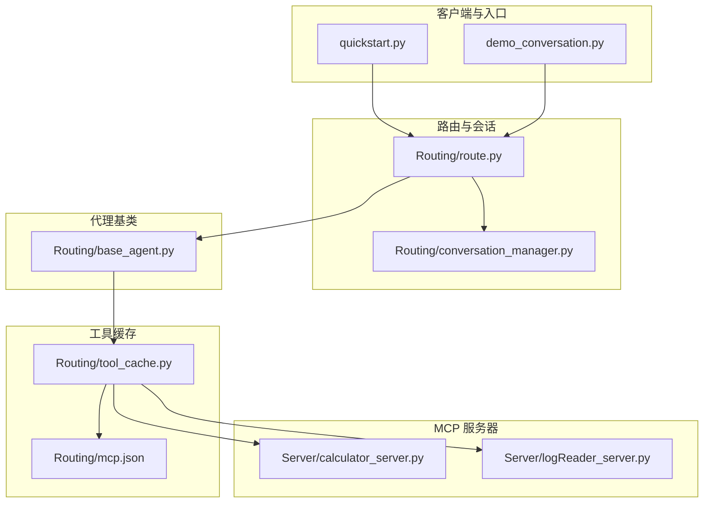
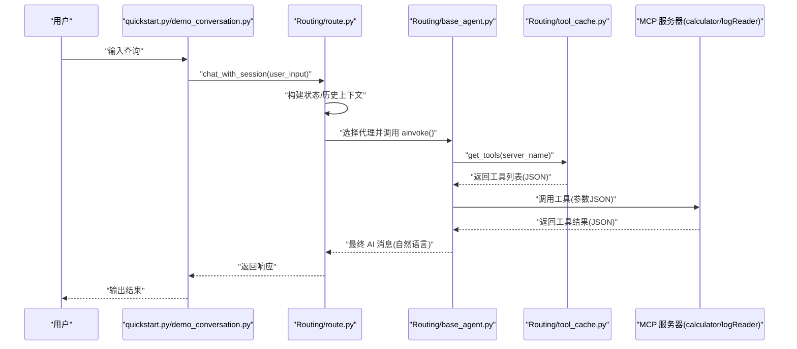
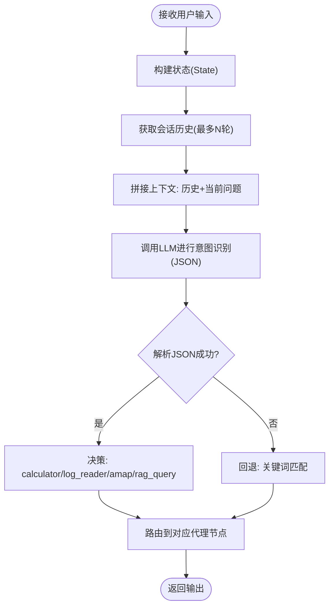
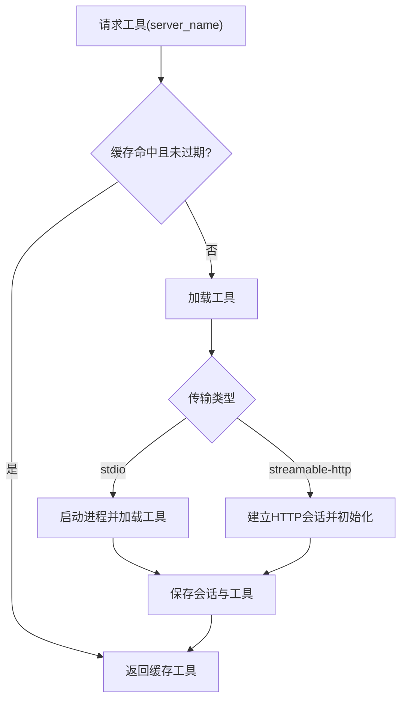
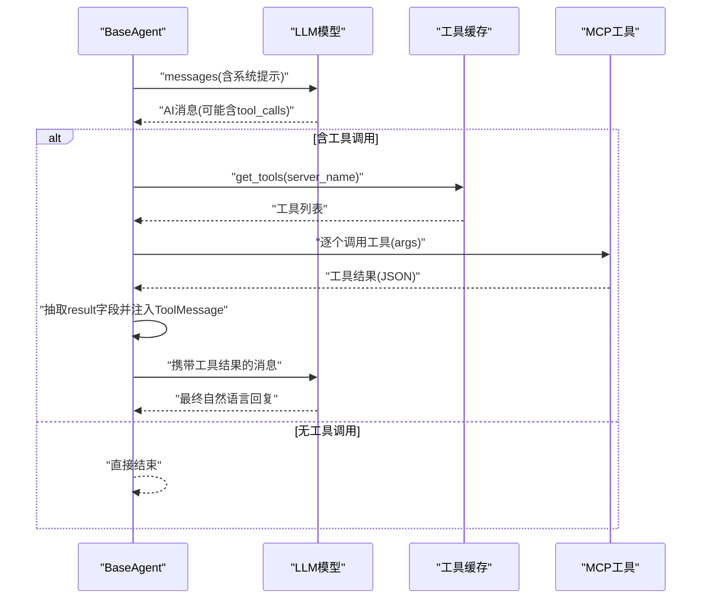
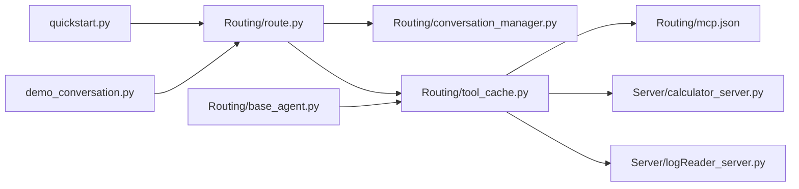

# 数据流设计

<cite>
**本文引用的文件**
- [README.md](file://README.md)
- [quickstart.py](file://quickstart.py)
- [demo_conversation.py](file://demo_conversation.py)
- [Routing/route.py](file://Routing/route.py)
- [Routing/conversation_manager.py](file://Routing/conversation_manager.py)
- [Routing/tool_cache.py](file://Routing/tool_cache.py)
- [Routing/base_agent.py](file://Routing/base_agent.py)
- [Routing/mcp.json](file://Routing/mcp.json)
- [requirements.txt](file://requirements.txt)
- [Server/calculator_server.py](file://Server/calculator_server.py)
- [Server/logReader_server.py](file://Server/logReader_server.py)
</cite>

## 目录
1. [引言](#引言)
2. [项目结构](#项目结构)
3. [核心组件](#核心组件)
4. [架构总览](#架构总览)
5. [详细组件分析](#详细组件分析)
6. [依赖分析](#依赖分析)
7. [性能考虑](#性能考虑)
8. [故障排查指南](#故障排查指南)
9. [结论](#结论)
10. [附录](#附录)

## 引言
本设计文档聚焦 AiOps 系统中的数据流设计，覆盖从用户输入到最终输出的完整数据路径，解释数据在客户端、代理、MCP 服务器之间的传递格式与转换规则；分析 JSON 序列化与反序列化、二进制数据处理、数据验证与清洗流程；并提供关键操作的数据变化时序图与数据流图，讨论性能优化与错误处理策略。

## 项目结构
该项目采用模块化分层组织，围绕“路由与会话管理”“工具缓存与代理基类”“MCP 服务器”三大块展开，配合配置文件与依赖清单支撑整体数据流。

图表来源
- [quickstart.py:1-68](file://quickstart.py#L1-L68)
- [demo_conversation.py:1-102](file://demo_conversation.py#L1-L102)
- [Routing/route.py:1-553](file://Routing/route.py#L1-L553)
- [Routing/conversation_manager.py:1-275](file://Routing/conversation_manager.py#L1-L275)
- [Routing/tool_cache.py:1-302](file://Routing/tool_cache.py#L1-L302)
- [Routing/mcp.json:1-29](file://Routing/mcp.json#L1-L29)
- [Routing/base_agent.py:1-497](file://Routing/base_agent.py#L1-L497)
- [Server/calculator_server.py:1-111](file://Server/calculator_server.py#L1-L111)
- [Server/logReader_server.py:1-151](file://Server/logReader_server.py#L1-L151)

章节来源
- [README.md:1-125](file://README.md#L1-L125)
- [requirements.txt:1-17](file://requirements.txt#L1-L17)

## 核心组件
- 路由与会话管理：负责意图识别、多轮上下文构建、会话持久化与清理。
- 工具缓存：统一加载与缓存 MCP 工具，支持 stdio 与 streamable-http 两种传输协议。
- 代理基类：封装模型推理、工具调用、错误处理与工作流编排。
- MCP 服务器：计算器与日志读取工具的具体实现，暴露标准工具接口。

章节来源
- [Routing/route.py:149-256](file://Routing/route.py#L149-L256)
- [Routing/conversation_manager.py:82-275](file://Routing/conversation_manager.py#L82-L275)
- [Routing/tool_cache.py:39-302](file://Routing/tool_cache.py#L39-L302)
- [Routing/base_agent.py:29-318](file://Routing/base_agent.py#L29-L318)
- [Server/calculator_server.py:16-105](file://Server/calculator_server.py#L16-L105)
- [Server/logReader_server.py:18-145](file://Server/logReader_server.py#L18-L145)

## 架构总览
系统采用“LangGraph + MCP + 工具缓存 + 会话管理”的组合架构。用户输入经路由节点识别意图，构建包含历史上下文的输入，随后进入对应代理工作流；代理通过工具缓存获取工具并调用 MCP 服务器；服务器返回结构化结果，代理将结果注入消息流，最终生成自然语言回复。

图表来源
- [quickstart.py:29-57](file://quickstart.py#L29-L57)
- [demo_conversation.py:19-92](file://demo_conversation.py#L19-L92)
- [Routing/route.py:351-414](file://Routing/route.py#L351-L414)
- [Routing/base_agent.py:258-318](file://Routing/base_agent.py#L258-L318)
- [Routing/tool_cache.py:85-140](file://Routing/tool_cache.py#L85-L140)
- [Server/calculator_server.py:16-105](file://Server/calculator_server.py#L16-L105)
- [Server/logReader_server.py:18-145](file://Server/logReader_server.py#L18-L145)

## 详细组件分析

### 1) 路由与会话管理
- 意图识别：基于 LLM 的结构化 JSON 输出，限定在预设意图集合内，结合历史上下文提升准确性。
- 上下文构建：将最近 N 轮消息拼接为“对话历史 + 当前问题”，减少歧义。
- 会话持久化：支持内存与 Redis 双存储，自动清理过期会话，提供会话统计与查询接口。

图表来源
- [Routing/route.py:149-233](file://Routing/route.py#L149-L233)
- [Routing/route.py:111-146](file://Routing/route.py#L111-L146)
- [Routing/conversation_manager.py:185-214](file://Routing/conversation_manager.py#L185-L214)

章节来源
- [Routing/route.py:149-233](file://Routing/route.py#L149-L233)
- [Routing/route.py:111-146](file://Routing/route.py#L111-L146)
- [Routing/conversation_manager.py:82-275](file://Routing/conversation_manager.py#L82-L275)

### 2) 工具缓存与传输协议
- 缓存策略：按服务器名缓存工具列表与会话句柄，支持 TTL 过期与显式清理。
- 传输协议：
  - stdio：通过进程启动服务器脚本，适用于本地计算器与日志读取。
  - streamable-http：通过 HTTP 通道连接远端高德地图 MCP 服务。
- 超时与异常：对 HTTP 连接设置超时，捕获并上报错误，避免阻塞主线程。

图表来源
- [Routing/tool_cache.py:85-140](file://Routing/tool_cache.py#L85-L140)
- [Routing/tool_cache.py:141-243](file://Routing/tool_cache.py#L141-L243)
- [Routing/mcp.json:1-29](file://Routing/mcp.json#L1-L29)

章节来源
- [Routing/tool_cache.py:39-302](file://Routing/tool_cache.py#L39-L302)
- [Routing/mcp.json:1-29](file://Routing/mcp.json#L1-L29)

### 3) 代理基类与工具调用
- 工作流：模型节点 → 工具节点 → 模型节点（循环直至无工具调用）→ 结束。
- 工具调用：将工具返回的结构化结果抽取为字符串内容注入消息流，避免 LLM 见到原始复杂数据。
- 错误处理：捕获模型调用与工具执行异常，构造 ToolMessage 并记录错误。

图表来源
- [Routing/base_agent.py:102-237](file://Routing/base_agent.py#L102-L237)
- [Routing/base_agent.py:131-217](file://Routing/base_agent.py#L131-L217)
- [Routing/base_agent.py:258-318](file://Routing/base_agent.py#L258-L318)

章节来源
- [Routing/base_agent.py:29-318](file://Routing/base_agent.py#L29-L318)

### 4) MCP 服务器实现
- 计算器服务器：提供加减乘除工具，返回结构化 JSON，包含运算类型与结果。
- 日志读取服务器：提供读取最新日志、按关键词搜索、统计信息等工具，返回结构化 JSON 或错误信息。

章节来源
- [Server/calculator_server.py:16-105](file://Server/calculator_server.py#L16-L105)
- [Server/logReader_server.py:18-145](file://Server/logReader_server.py#L18-L145)

### 5) 数据序列化与反序列化
- JSON 交换：MCP 工具参数与返回值均采用 JSON；路由节点解析 LLM 的结构化 JSON 输出；工具返回值经抽取后注入消息流。
- 文本与二进制：当前实现以文本 JSON 为主；若引入二进制数据（如图片、音频），建议在工具层进行 base64 编解码并在消息中传递字符串，避免跨进程/网络传输复杂性。

章节来源
- [Routing/route.py:196-231](file://Routing/route.py#L196-L231)
- [Routing/base_agent.py:173-181](file://Routing/base_agent.py#L173-L181)

### 6) 数据验证与清洗
- 输入清洗：路由阶段将历史消息截断并限制长度，避免上下文过长影响性能与成本。
- 结果抽取：仅从工具返回中提取“result”字段作为 LLM 可见内容，降低噪声与幻觉风险。
- 错误收敛：统一包装为 ToolMessage，便于后续模型再次推理或错误提示。

章节来源
- [Routing/route.py:134-146](file://Routing/route.py#L134-L146)
- [Routing/base_agent.py:173-181](file://Routing/base_agent.py#L173-L181)

## 依赖分析
- 外部依赖：langchain、langgraph、mcp、fastmcp、httpx、chromadb、redis、milvus 等，支撑 LLM 推理、MCP 协议、向量检索与会话存储。
- 组件耦合：路由依赖会话管理与工具缓存；代理依赖工具缓存；工具缓存依赖 MCP 配置与传输层；服务器独立运行并通过标准协议暴露工具。

图表来源
- [requirements.txt:1-17](file://requirements.txt#L1-L17)
- [Routing/route.py:1-553](file://Routing/route.py#L1-L553)
- [Routing/conversation_manager.py:1-275](file://Routing/conversation_manager.py#L1-L275)
- [Routing/tool_cache.py:1-302](file://Routing/tool_cache.py#L1-L302)
- [Routing/mcp.json:1-29](file://Routing/mcp.json#L1-L29)
- [Server/calculator_server.py:1-111](file://Server/calculator_server.py#L1-L111)
- [Server/logReader_server.py:1-151](file://Server/logReader_server.py#L1-L151)

## 性能考虑
- 工具缓存命中：通过全局缓存避免重复加载 MCP 服务器，显著降低冷启动开销。
- 会话持久化：Redis 存储可跨实例共享会话，减少重复初始化成本。
- 上下文裁剪：限制历史消息数量与长度，控制 LLM 输入规模，降低成本与延迟。
- 异步与超时：工具加载与 HTTP 连接采用异步与超时控制，避免阻塞。
- 向量检索优化：RAG 后端可切换至 Milvus 以提升大规模检索性能（需正确传递 backend 参数）。

章节来源
- [Routing/tool_cache.py:281-298](file://Routing/tool_cache.py#L281-L298)
- [Routing/route.py:134-146](file://Routing/route.py#L134-L146)
- [Routing/base_agent.py:448-462](file://Routing/base_agent.py#L448-L462)

## 故障排查指南
- 工具加载失败：检查 MCP 配置文件与传输协议，确认 stdio 服务器路径与 streamable-http URL/密钥正确。
- HTTP 连接超时：查看工具加载超时日志，适当增加超时阈值或检查网络连通性。
- 会话异常：确认 Redis 配置与隧道是否正常，必要时降级为内存模式。
- LLM 结果非结构化：路由节点会尝试 JSON 截取与关键词回退，若仍失败，调整系统提示词约束输出格式。
- 工具返回噪声：代理仅注入“result”字段，确保工具返回结构化且包含该字段。

章节来源
- [Routing/tool_cache.py:212-223](file://Routing/tool_cache.py#L212-L223)
- [Routing/tool_cache.py:240-242](file://Routing/tool_cache.py#L240-L242)
- [Routing/conversation_manager.py:108-119](file://Routing/conversation_manager.py#L108-L119)
- [Routing/route.py:196-231](file://Routing/route.py#L196-L231)
- [Routing/base_agent.py:173-181](file://Routing/base_agent.py#L173-L181)

## 结论
本系统通过“路由 + 会话管理 + 工具缓存 + 代理基类 + MCP 服务器”的分层设计，实现了稳定、可扩展的数据流。JSON 作为主要交换格式，辅以严格的上下文裁剪与结果抽取策略，确保数据质量与系统稳定性。通过缓存、异步与超时控制，系统在性能与可靠性之间取得平衡。

## 附录
- 快速开始与示例对话：参考入口脚本与演示脚本，验证端到端数据流。
- 配置与依赖：确保 MCP 配置文件与依赖版本一致，避免运行时错误。

章节来源
- [quickstart.py:14-57](file://quickstart.py#L14-L57)
- [demo_conversation.py:19-92](file://demo_conversation.py#L19-L92)
- [README.md:51-78](file://README.md#L51-L78)