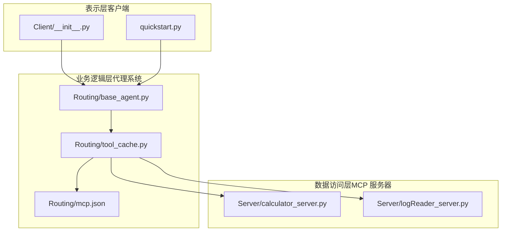
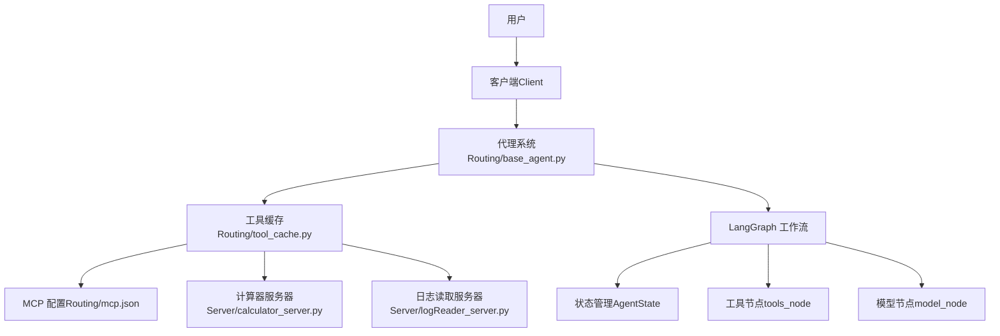
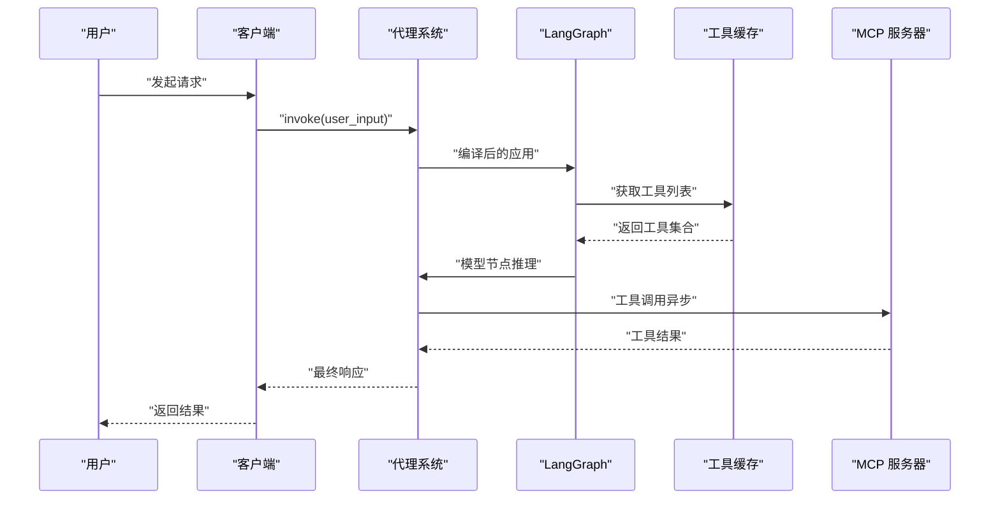
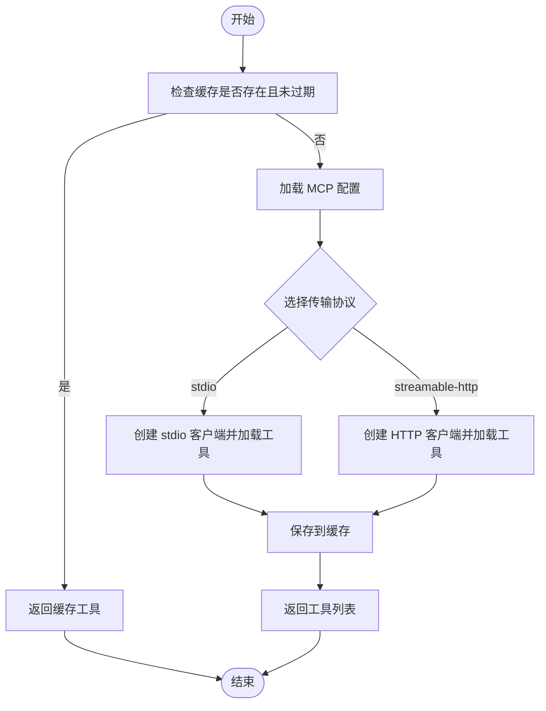
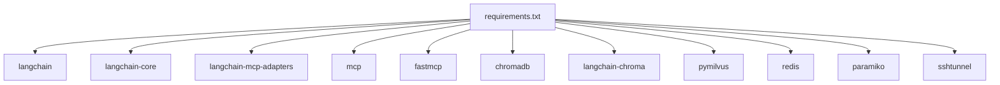

# 整体架构概览

<cite>
**本文档引用的文件**
- [README.md](file://README.md)
- [quickstart.py](file://quickstart.py)
- [requirements.txt](file://requirements.txt)
- [Routing/base_agent.py](file://Routing/base_agent.py)
- [Routing/tool_cache.py](file://Routing/tool_cache.py)
- [Routing/mcp.json](file://Routing/mcp.json)
- [Server/calculator_server.py](file://Server/calculator_server.py)
- [Server/logReader_server.py](file://Server/logReader_server.py)
- [Client/__init__.py](file://Client/__init__.py)
</cite>

## 目录
1. [引言](#引言)
2. [项目结构](#项目结构)
3. [核心组件](#核心组件)
4. [架构总览](#架构总览)
5. [详细组件分析](#详细组件分析)
6. [依赖关系分析](#依赖关系分析)
7. [性能考虑](#性能考虑)
8. [故障排除指南](#故障排除指南)
9. [结论](#结论)
10. [附录](#附录)

## 引言
本项目基于 Model Context Protocol（MCP）协议，采用三层架构设计：表示层（客户端）、业务逻辑层（代理系统）、数据访问层（MCP 服务器）。系统通过 LangGraph 作为工作流引擎，结合 MCP 协议实现与外部工具/数据源的标准化连接，具备良好的模块化、可扩展性和可维护性。

## 项目结构
项目采用按功能域划分的模块化组织方式，核心目录与职责如下：
- Client：客户端入口与封装，提供 LangGraph/LangChain 客户端接口
- Routing：代理系统与工具缓存，包含基础代理类、工具缓存管理、MCP 配置
- Server：MCP 服务器实现，提供计算器、日志读取、RAG 等工具服务
- 数据与测试：日志、测试用例与向量存储
- 文档与配置：README、需求清单、快速启动脚本

**图示来源**
- [Client/__init__.py:1-12](file://Client/__init__.py#L1-L12)
- [quickstart.py:1-68](file://quickstart.py#L1-L68)
- [Routing/base_agent.py:1-497](file://Routing/base_agent.py#L1-L497)
- [Routing/tool_cache.py:1-302](file://Routing/tool_cache.py#L1-L302)
- [Routing/mcp.json:1-29](file://Routing/mcp.json#L1-L29)
- [Server/calculator_server.py:1-111](file://Server/calculator_server.py#L1-L111)
- [Server/logReader_server.py:1-151](file://Server/logReader_server.py#L1-L151)

**章节来源**
- [README.md:1-125](file://README.md#L1-L125)
- [Client/__init__.py:1-12](file://Client/__init__.py#L1-L12)
- [Routing/base_agent.py:1-497](file://Routing/base_agent.py#L1-L497)
- [Routing/tool_cache.py:1-302](file://Routing/tool_cache.py#L1-L302)
- [Routing/mcp.json:1-29](file://Routing/mcp.json#L1-L29)
- [Server/calculator_server.py:1-111](file://Server/calculator_server.py#L1-L111)
- [Server/logReader_server.py:1-151](file://Server/logReader_server.py#L1-L151)

## 核心组件
- 表示层（客户端）
  - 提供统一的 Agent 创建与调用接口，支持 LangGraph/LangChain 两种客户端实现
  - 快速启动脚本演示 Agent 创建、工具展示与对话测试流程
- 业务逻辑层（代理系统）
  - 基础代理类：统一工具加载、消息处理、错误处理与工作流构建
  - 工具缓存：集中管理 MCP 服务器连接与工具列表，支持 TTL 过期与多传输协议
  - MCP 配置：集中定义服务器名称、传输协议与参数
- 数据访问层（MCP 服务器）
  - 计算器服务器：提供加减乘除等数学运算工具
  - 日志读取服务器：提供日志读取、搜索与统计工具
  - 可扩展至 RAG 等其他工具服务器

**章节来源**
- [Client/__init__.py:1-12](file://Client/__init__.py#L1-L12)
- [quickstart.py:1-68](file://quickstart.py#L1-L68)
- [Routing/base_agent.py:1-497](file://Routing/base_agent.py#L1-L497)
- [Routing/tool_cache.py:1-302](file://Routing/tool_cache.py#L1-L302)
- [Routing/mcp.json:1-29](file://Routing/mcp.json#L1-L29)
- [Server/calculator_server.py:1-111](file://Server/calculator_server.py#L1-L111)
- [Server/logReader_server.py:1-151](file://Server/logReader_server.py#L1-L151)

## 架构总览
系统采用三层架构，职责清晰、边界明确：
- 表示层（客户端）：负责用户交互与调用入口，封装 Agent 创建与调用
- 业务逻辑层（代理系统）：负责工作流编排、工具调度与状态管理
- 数据访问层（MCP 服务器）：负责具体工具实现与数据服务

**图示来源**
- [Client/__init__.py:1-12](file://Client/__init__.py#L1-L12)
- [Routing/base_agent.py:1-497](file://Routing/base_agent.py#L1-L497)
- [Routing/tool_cache.py:1-302](file://Routing/tool_cache.py#L1-L302)
- [Routing/mcp.json:1-29](file://Routing/mcp.json#L1-L29)
- [Server/calculator_server.py:1-111](file://Server/calculator_server.py#L1-L111)
- [Server/logReader_server.py:1-151](file://Server/logReader_server.py#L1-L151)

## 详细组件分析

### 代理系统（Routing/base_agent.py）
- 设计要点
  - 统一工具加载：通过全局工具缓存按服务器名称加载工具，减少重复初始化
  - 工作流编排：基于 LangGraph 构建状态图，包含模型节点与工具节点的条件边
  - 错误处理：统一捕获模型调用与工具执行异常，保证流程稳定性
- 关键流程
  - 初始化：加载工具、绑定模型、构建工作流
  - 模型节点：添加系统提示词，调用 LLM 推理
  - 工具节点：解析工具调用，执行工具并生成工具消息
  - 路由控制：根据是否有工具调用决定后续节点

**图示来源**
- [Routing/base_agent.py:102-318](file://Routing/base_agent.py#L102-L318)
- [Routing/tool_cache.py:85-117](file://Routing/tool_cache.py#L85-L117)

**章节来源**
- [Routing/base_agent.py:1-497](file://Routing/base_agent.py#L1-L497)

### 工具缓存（Routing/tool_cache.py）
- 设计要点
  - 单例模式：全局唯一缓存实例，贯穿应用生命周期
  - 多传输协议：支持 stdio 与 streamable-http 两种传输方式
  - TTL 过期：按服务器名称缓存工具列表，支持自定义过期时间
  - 会话管理：维护服务器连接与会话，支持清理与重连
- 关键流程
  - 首次加载：根据配置选择传输协议，创建客户端并加载工具
  - 缓存命中：直接返回缓存工具列表
  - 过期清理：关闭会话与客户端，释放资源

**图示来源**
- [Routing/tool_cache.py:85-140](file://Routing/tool_cache.py#L85-L140)
- [Routing/tool_cache.py:198-243](file://Routing/tool_cache.py#L198-L243)

**章节来源**
- [Routing/tool_cache.py:1-302](file://Routing/tool_cache.py#L1-L302)

### MCP 配置（Routing/mcp.json）
- 设计要点
  - 集中式配置：统一管理服务器名称、传输协议与参数
  - 多服务器支持：支持高德地图、计算器、日志读取、RAG 等服务器
  - 环境变量替换：支持在 URL 中使用占位符替换 API Key
- 关键字段
  - 服务器名称：如 amap-maps-streamableHTTP、calculator、log-reader、rag-knowledge
  - 传输协议：stdio 或 streamable-http
  - 参数：命令行参数或 URL

**章节来源**
- [Routing/mcp.json:1-29](file://Routing/mcp.json#L1-L29)

### MCP 服务器（Server）
- 计算器服务器
  - 工具：add、subtract、multiply、divide
  - 传输：stdio
  - 错误处理：除零保护
- 日志读取服务器
  - 工具：read_logs、search_logs、get_log_stats
  - 传输：stdio
  - 错误处理：文件不存在与读取异常

**章节来源**
- [Server/calculator_server.py:1-111](file://Server/calculator_server.py#L1-L111)
- [Server/logReader_server.py:1-151](file://Server/logReader_server.py#L1-L151)

### 客户端入口（Client）
- 设计要点
  - LangGraph/LangChain 双实现：提供统一接口
  - 导出函数：create_langchain_agent、create_langgraph_agent
- 关键流程
  - 创建 Agent：初始化并返回可用的代理实例
  - 工具展示：打印可用工具列表
  - 对话测试：批量执行示例对话

**章节来源**
- [Client/__init__.py:1-12](file://Client/__init__.py#L1-L12)
- [quickstart.py:1-68](file://quickstart.py#L1-L68)

## 依赖关系分析
系统依赖关系围绕 MCP 协议与 LangGraph 展开，核心依赖包括：
- langchain、langchain-core、langchain-community：LLM 与工具绑定
- langchain-mcp-adapters：MCP 工具适配器
- mcp、fastmcp：MCP 协议与服务器框架
- chromadb、langchain-chroma、pymilvus：向量数据库支持
- redis、paramiko、sshtunnel：会话存储与隧道管理

**图示来源**
- [requirements.txt:1-17](file://requirements.txt#L1-L17)

**章节来源**
- [requirements.txt:1-17](file://requirements.txt#L1-L17)

## 性能考虑
- 工具缓存与连接复用：通过全局工具缓存减少重复连接与初始化开销
- 异步执行：工具调用与模型推理均采用异步方式，提升并发性能
- 传输协议优化：stdio 适合本地工具，streamable-http 适合远程服务，按场景选择
- TTL 过期策略：合理设置缓存过期时间，在性能与一致性之间平衡
- 资源清理：会话与客户端在清理阶段优雅关闭，避免资源泄漏

## 故障排除指南
- 环境变量缺失
  - 确认 .env 中配置 DASHSCOPE_API_KEY、AMAP_API_KEY
- MCP 配置错误
  - 检查 mcp.json 中服务器名称与传输协议是否正确
  - 确认 streamable-http URL 中的 API Key 已替换
- 工具加载失败
  - 检查 stdio 服务器命令与参数路径是否正确
  - 查看工具缓存日志，确认连接与初始化过程
- 服务器启动问题
  - 确认服务器文件存在且可执行
  - 检查服务器日志输出，定位异常原因

**章节来源**
- [Routing/tool_cache.py:198-243](file://Routing/tool_cache.py#L198-L243)
- [Routing/mcp.json:1-29](file://Routing/mcp.json#L1-L29)

## 结论
本项目通过 LangGraph 与 MCP 协议实现了清晰的三层架构：表示层负责交互，业务逻辑层负责编排，数据访问层负责工具实现。该设计具备良好的模块化、可扩展性与可维护性，能够灵活接入各类外部工具与数据源，满足复杂业务场景的需求。

## 附录
- 快速启动流程
  - 创建 Agent 并加载工具
  - 展示可用工具列表
  - 执行示例对话并输出结果
- 未来演进方向
  - 扩展更多 MCP 服务器与工具类型
  - 引入更丰富的路由策略与状态管理
  - 增强监控与可观测性，完善日志与指标收集

**章节来源**
- [quickstart.py:1-68](file://quickstart.py#L1-L68)
- [README.md:111-125](file://README.md#L111-L125)