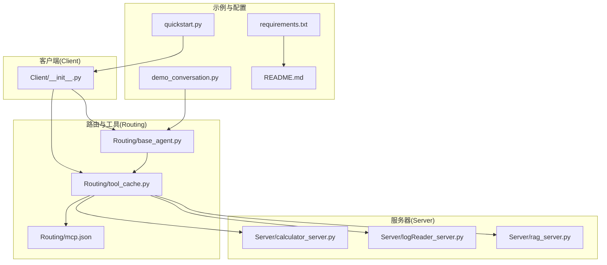
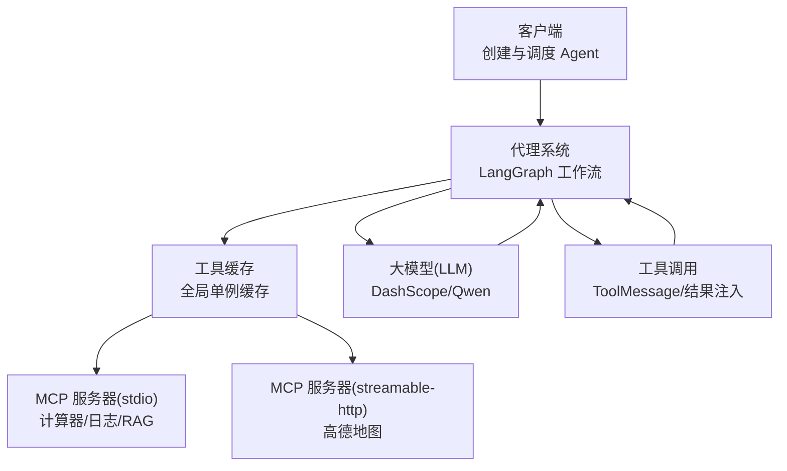
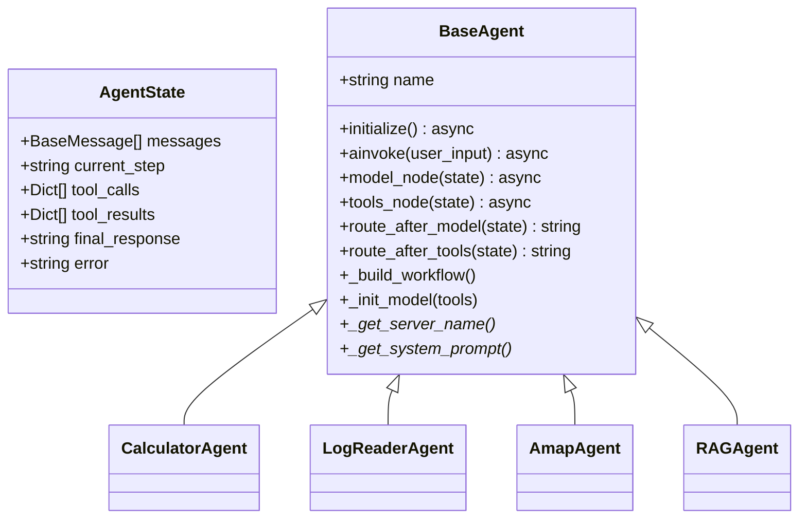
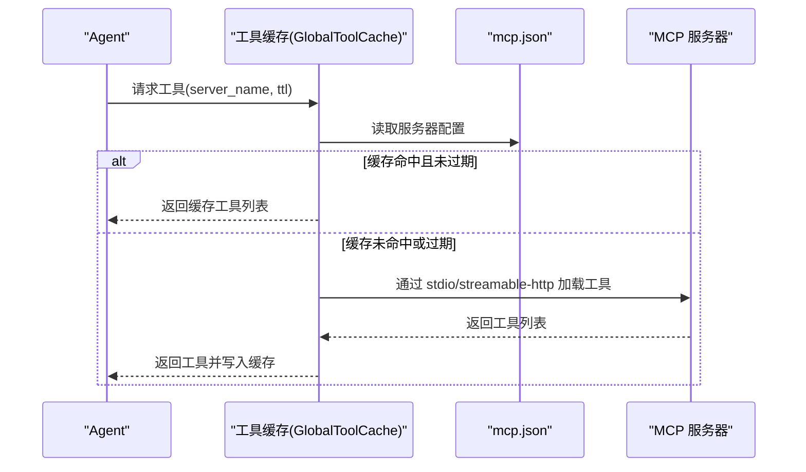
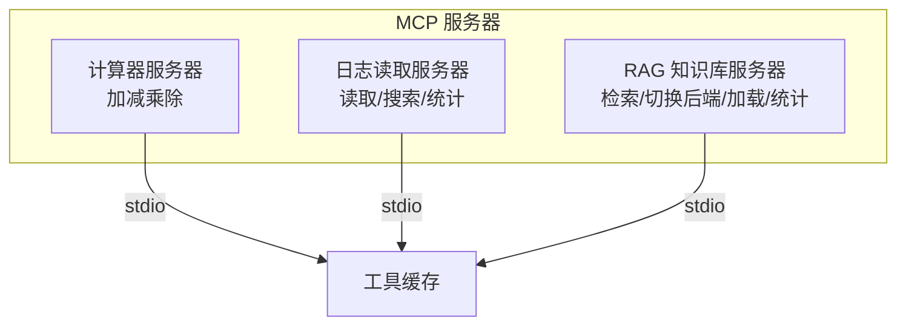
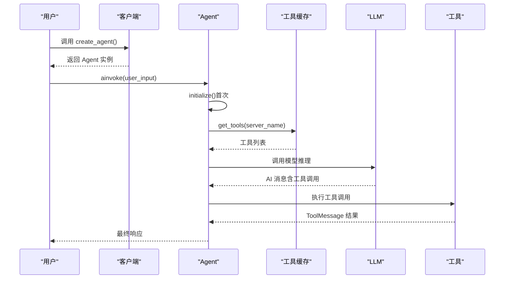
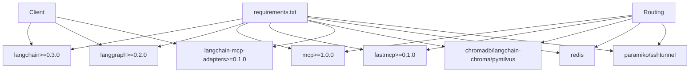

# 架构设计

<cite>
**本文档引用的文件**
- [README.md](file://README.md)
- [quickstart.py](file://quickstart.py)
- [demo_conversation.py](file://demo_conversation.py)
- [requirements.txt](file://requirements.txt)
- [Routing/base_agent.py](file://Routing/base_agent.py)
- [Routing/tool_cache.py](file://Routing/tool_cache.py)
- [Routing/mcp.json](file://Routing/mcp.json)
- [Client/__init__.py](file://Client/__init__.py)
- [Server/calculator_server.py](file://Server/calculator_server.py)
- [Server/logReader_server.py](file://Server/logReader_server.py)
- [Server/rag_server.py](file://Server/rag_server.py)
</cite>

## 目录
1. [简介](#简介)
2. [项目结构](#项目结构)
3. [核心组件](#核心组件)
4. [架构总览](#架构总览)
5. [详细组件分析](#详细组件分析)
6. [依赖分析](#依赖分析)
7. [性能考虑](#性能考虑)
8. [故障排查指南](#故障排查指南)
9. [结论](#结论)
10. [附录](#附录)

## 简介
本项目基于 Model Context Protocol（MCP）协议，采用 LangGraph 作为工作流引擎，构建了一个模块化、可扩展的智能代理系统。系统通过统一的工具缓存机制，动态加载并复用来自多个 MCP 服务器的工具，结合 LangGraph 的状态机模型实现“模型推理—工具调用—结果反馈”的闭环流程。该架构强调分层设计与模块解耦，支持计算器、日志读取、高德地图、RAG 知识库等多种工具域，具备良好的可维护性与扩展性。

## 项目结构
项目采用按功能域划分的模块化组织方式，核心目录与职责如下：
- Client：客户端聚合导出，提供 LangGraph/LangChain 两种 Agent 的创建入口
- Routing：路由与工具缓存、状态定义、Agent 基类、会话管理等核心逻辑
- Server：各 MCP 服务器实现（计算器、日志读取、RAG 知识库）
- 数据与配置：日志、评测数据、MCP 配置文件
- 测试与示例：快速启动、演示脚本、自动化测试

**图表来源**
- [Client/__init__.py:1-12](file://Client/__init__.py#L1-L12)
- [Routing/base_agent.py:1-497](file://Routing/base_agent.py#L1-L497)
- [Routing/tool_cache.py:1-302](file://Routing/tool_cache.py#L1-L302)
- [Routing/mcp.json:1-29](file://Routing/mcp.json#L1-L29)
- [Server/calculator_server.py:1-111](file://Server/calculator_server.py#L1-L111)
- [Server/logReader_server.py:1-151](file://Server/logReader_server.py#L1-L151)
- [Server/rag_server.py:1-363](file://Server/rag_server.py#L1-L363)
- [quickstart.py:1-68](file://quickstart.py#L1-L68)
- [demo_conversation.py:1-102](file://demo_conversation.py#L1-L102)
- [requirements.txt:1-17](file://requirements.txt#L1-L17)
- [README.md:1-125](file://README.md#L1-L125)

**章节来源**
- [README.md:5-36](file://README.md#L5-L36)
- [Client/__init__.py:1-12](file://Client/__init__.py#L1-L12)
- [Routing/base_agent.py:1-497](file://Routing/base_agent.py#L1-L497)
- [Routing/tool_cache.py:1-302](file://Routing/tool_cache.py#L1-L302)
- [Routing/mcp.json:1-29](file://Routing/mcp.json#L1-L29)
- [Server/calculator_server.py:1-111](file://Server/calculator_server.py#L1-L111)
- [Server/logReader_server.py:1-151](file://Server/logReader_server.py#L1-L151)
- [Server/rag_server.py:1-363](file://Server/rag_server.py#L1-L363)
- [quickstart.py:1-68](file://quickstart.py#L1-L68)
- [demo_conversation.py:1-102](file://demo_conversation.py#L1-L102)
- [requirements.txt:1-17](file://requirements.txt#L1-L17)

## 核心组件
- 客户端聚合导出：提供 LangGraph 与 LangChain 两种 Agent 的工厂方法，统一对外接口
- Agent 基类与专用 Agent：统一的状态定义、节点函数、路由逻辑；内置计算器、日志读取、高德地图、RAG 知识库等专用 Agent
- 工具缓存：全局单例缓存，支持 TTL 过期、线程安全、多传输协议（stdio/streamable-http）加载
- MCP 服务器：计算器、日志读取、RAG 知识库三类工具服务，分别以 stdio 方式运行
- 配置与依赖：MCP 配置文件集中管理服务器清单与传输参数；requirements.txt 明确技术栈版本

**章节来源**
- [Client/__init__.py:4-11](file://Client/__init__.py#L4-L11)
- [Routing/base_agent.py:19-318](file://Routing/base_agent.py#L19-L318)
- [Routing/tool_cache.py:27-298](file://Routing/tool_cache.py#L27-L298)
- [Routing/mcp.json:1-29](file://Routing/mcp.json#L1-L29)
- [Server/calculator_server.py:1-111](file://Server/calculator_server.py#L1-L111)
- [Server/logReader_server.py:1-151](file://Server/logReader_server.py#L1-L151)
- [Server/rag_server.py:1-363](file://Server/rag_server.py#L1-L363)
- [requirements.txt:1-17](file://requirements.txt#L1-L17)

## 架构总览
系统采用“客户端-代理-工具缓存-MCP服务器”四层协作架构：
- 客户端负责创建与调度 Agent
- 代理通过 LangGraph 工作流驱动“模型推理—工具调用—结果反馈”
- 工具缓存统一管理 MCP 服务器连接与工具加载，支持跨 Agent 复用
- MCP 服务器提供具体工具能力，支持本地 stdio 与远端 streamable-http

**图表来源**
- [Client/__init__.py:4-11](file://Client/__init__.py#L4-L11)
- [Routing/base_agent.py:102-256](file://Routing/base_agent.py#L102-L256)
- [Routing/tool_cache.py:85-242](file://Routing/tool_cache.py#L85-L242)
- [Routing/mcp.json:2-28](file://Routing/mcp.json#L2-L28)
- [Server/calculator_server.py:108-111](file://Server/calculator_server.py#L108-L111)
- [Server/logReader_server.py:148-151](file://Server/logReader_server.py#L148-L151)
- [Server/rag_server.py:356-363](file://Server/rag_server.py#L356-L363)

## 详细组件分析

### 组件A：Agent 基类与专用 Agent
- 统一状态模型：包含消息列表、当前步骤、工具调用与结果、最终响应与错误字段
- 节点函数：
  - 模型节点：注入系统提示词，调用 LLM 并更新状态
  - 工具节点：解析上次 AI 消息的工具调用，执行并生成 ToolMessage
- 路由逻辑：根据是否存在工具调用决定流转至工具节点或结束
- 工作流构建：使用 StateGraph 定义 START→模型→条件边→工具→模型 的循环
- 专用 Agent：计算器、日志读取、高德地图、RAG 知识库，各自提供服务器名与系统提示词

**图表来源**
- [Routing/base_agent.py:19-318](file://Routing/base_agent.py#L19-L318)

**章节来源**
- [Routing/base_agent.py:19-318](file://Routing/base_agent.py#L19-L318)

### 组件B：工具缓存与 MCP 服务器加载
- 缓存策略：基于服务器名的 TTL 缓存，支持过期清理与线程安全
- 传输协议：
  - stdio：通过命令与参数启动本地服务器进程，使用 MultiServerMCPClient 管理会话
  - streamable-http：通过 URL 建立 HTTP 会话，支持超时控制与初始化
- 配置来源：mcp.json 中集中声明各服务器的传输类型、命令/URL、参数
- 生命周期：应用运行期间常驻，对话结束后可统一清理

**图表来源**
- [Routing/tool_cache.py:85-242](file://Routing/tool_cache.py#L85-L242)
- [Routing/mcp.json:1-29](file://Routing/mcp.json#L1-L29)

**章节来源**
- [Routing/tool_cache.py:27-298](file://Routing/tool_cache.py#L27-L298)
- [Routing/mcp.json:1-29](file://Routing/mcp.json#L1-L29)

### 组件C：MCP 服务器实现
- 计算器服务器：提供加减乘除工具，以 stdio 方式运行
- 日志读取服务器：提供读取最新日志、关键词搜索、日志统计工具，以 stdio 方式运行
- RAG 知识库服务器：提供知识检索、后端切换、文档加载、索引统计工具，支持本地 ChromaDB 与远程 Milvus（SSH 隧道），以 stdio 方式运行

**图表来源**
- [Server/calculator_server.py:16-105](file://Server/calculator_server.py#L16-L105)
- [Server/logReader_server.py:18-145](file://Server/logReader_server.py#L18-L145)
- [Server/rag_server.py:193-353](file://Server/rag_server.py#L193-L353)

**章节来源**
- [Server/calculator_server.py:1-111](file://Server/calculator_server.py#L1-L111)
- [Server/logReader_server.py:1-151](file://Server/logReader_server.py#L1-L151)
- [Server/rag_server.py:1-363](file://Server/rag_server.py#L1-L363)

### 组件D：客户端与工作流调用序列
- 客户端导出 LangGraph 与 LangChain Agent 工厂方法
- Agent.initialize 延迟初始化：加载工具缓存、绑定 LLM、构建并编译工作流
- Agent.ainvoke 接收用户输入，构造初始状态，执行工作流，提取最终响应

**图表来源**
- [Client/__init__.py:4-11](file://Client/__init__.py#L4-L11)
- [Routing/base_agent.py:44-318](file://Routing/base_agent.py#L44-L318)
- [Routing/tool_cache.py:85-116](file://Routing/tool_cache.py#L85-L116)

**章节来源**
- [Client/__init__.py:1-12](file://Client/__init__.py#L1-L12)
- [Routing/base_agent.py:44-318](file://Routing/base_agent.py#L44-L318)
- [Routing/tool_cache.py:85-116](file://Routing/tool_cache.py#L85-L116)

## 依赖分析
- 技术栈版本要求明确，涵盖 LangChain/LangGraph、MCP 协议、FastMCP、向量库与 Redis 等
- 客户端与路由模块松耦合：客户端仅通过工厂方法获取 Agent，Agent 内部通过工具缓存访问工具
- 工具缓存与 MCP 服务器解耦：通过 mcp.json 配置抽象传输细节，支持 stdio 与 streamable-http

**图表来源**
- [requirements.txt:1-17](file://requirements.txt#L1-L17)
- [Client/__init__.py:4-11](file://Client/__init__.py#L4-L11)
- [Routing/tool_cache.py:18-24](file://Routing/tool_cache.py#L18-L24)

**章节来源**
- [requirements.txt:1-17](file://requirements.txt#L1-L17)
- [Client/__init__.py:1-12](file://Client/__init__.py#L1-L12)
- [Routing/tool_cache.py:18-24](file://Routing/tool_cache.py#L18-L24)

## 性能考虑
- 工具缓存与 TTL：避免重复连接与工具加载，降低冷启动延迟
- 传输协议选择：本地 stdio 低延迟，远端 streamable-http 支持超时与初始化校验
- 工具调用策略：每次仅执行一个工具调用，减少并发复杂度与资源竞争
- 向量检索后端：本地 ChromaDB 适合小规模场景，远程 Milvus 适合大规模检索，支持 SSH 隧道与连接池化
- 会话与资源管理：演示脚本展示会话管理与资源清理，建议在生产中同样在对话结束时释放缓存与连接

**章节来源**
- [Routing/tool_cache.py:62-116](file://Routing/tool_cache.py#L62-L116)
- [Server/rag_server.py:51-159](file://Server/rag_server.py#L51-L159)
- [demo_conversation.py:76-88](file://demo_conversation.py#L76-L88)

## 故障排查指南
- 环境变量缺失：确认 DASHSCOPE_API_KEY、AMAP_API_KEY 等已在 .env 中配置
- MCP 服务器不可达：检查 mcp.json 中的 transport、command/url、args 是否正确
- 连接超时：streamable-http 加载工具时存在 10 秒超时，必要时检查网络与密钥
- 工具执行失败：查看工具节点对异常的捕获与 ToolMessage 错误内容
- 资源清理：演示脚本提供 cleanup_all，生产中应在异常或会话结束时调用

**章节来源**
- [quickstart.py:60-68](file://quickstart.py#L60-L68)
- [Routing/mcp.json:1-29](file://Routing/mcp.json#L1-L29)
- [Routing/tool_cache.py:212-223](file://Routing/tool_cache.py#L212-L223)
- [Routing/base_agent.py:196-210](file://Routing/base_agent.py#L196-L210)
- [demo_conversation.py:84-88](file://demo_conversation.py#L84-L88)

## 结论
本架构以 LangGraph 为核心，结合 MCP 协议与统一工具缓存，实现了“模型推理—工具调用—结果反馈”的高效闭环。通过模块化与分层设计，系统具备良好的扩展性与可维护性：新增工具域只需实现 MCP 服务器并更新配置，Agent 侧无需改动；缓存与会话管理保证了性能与资源可控。LangGraph 的选择在于其对状态机与条件边的良好支持，便于实现多轮对话与工具调用的精细控制，相较其他工作流框架更具表达力与可读性。

## 附录
- 快速启动与演示：通过 quickstart.py 与 demo_conversation.py 展示工具缓存与多轮对话效果
- 配置参考：mcp.json 中集中管理服务器清单与传输参数
- 技术栈：明确版本要求，确保兼容性与稳定性

**章节来源**
- [quickstart.py:1-68](file://quickstart.py#L1-L68)
- [demo_conversation.py:1-102](file://demo_conversation.py#L1-L102)
- [Routing/mcp.json:1-29](file://Routing/mcp.json#L1-L29)
- [requirements.txt:1-17](file://requirements.txt#L1-L17)