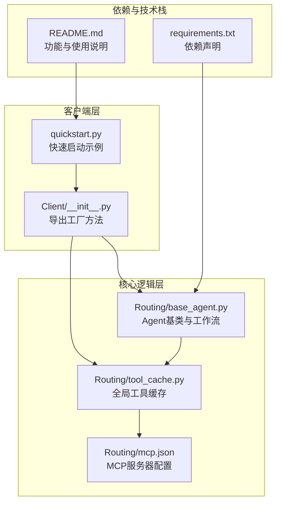
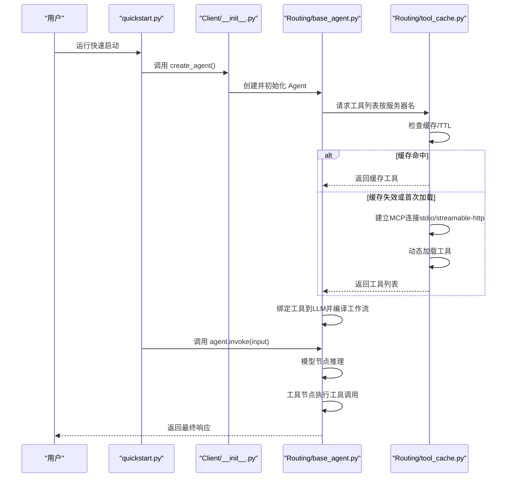
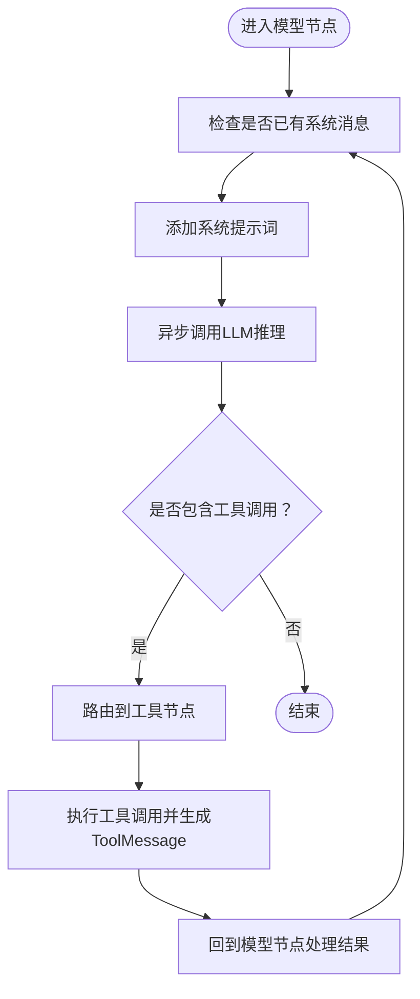
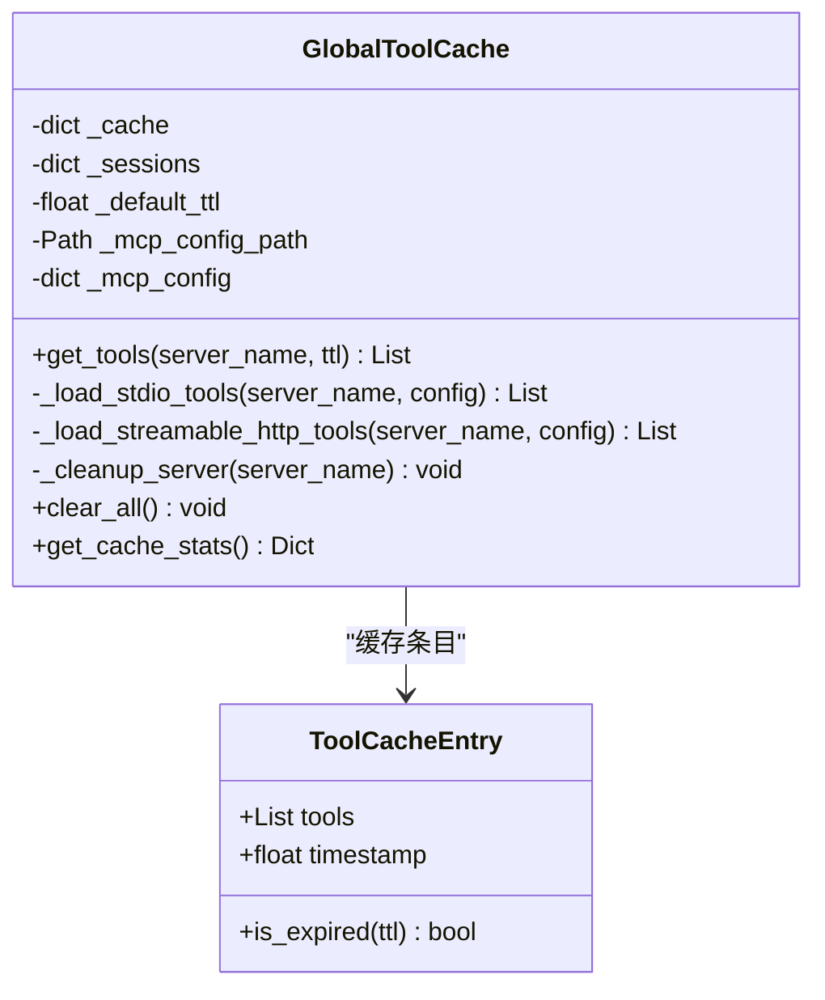
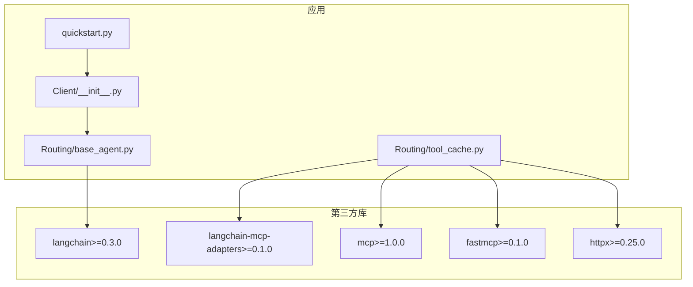

# LangChain客户端

<cite>
**本文档引用的文件**
- [README.md](file://README.md)
- [quickstart.py](file://quickstart.py)
- [requirements.txt](file://requirements.txt)
- [Routing/base_agent.py](file://Routing/base_agent.py)
- [Routing/tool_cache.py](file://Routing/tool_cache.py)
- [Routing/mcp.json](file://Routing/mcp.json)
- [Client/__init__.py](file://Client/__init__.py)
</cite>

## 目录
1. [简介](#简介)
2. [项目结构](#项目结构)
3. [核心组件](#核心组件)
4. [架构总览](#架构总览)
5. [详细组件分析](#详细组件分析)
6. [依赖关系分析](#依赖关系分析)
7. [性能考虑](#性能考虑)
8. [故障排除指南](#故障排除指南)
9. [结论](#结论)

## 简介
本文件面向希望在智能代理系统中使用LangChain框架实现MCP（Model Context Protocol）客户端的开发者。该系统通过标准化协议连接AI模型与外部工具/数据源，支持动态加载MCP服务器提供的工具，并在LangGraph工作流中实现“模型-工具”循环调用。本文档将深入解释LangChain客户端的设计原理、架构特点与实现细节，涵盖初始化流程、配置参数、连接建立与消息处理机制，并提供性能优化、错误处理与最佳实践建议。

## 项目结构
该项目采用模块化设计，将工具定义、状态管理、模型节点、工具节点、结束逻辑与构建编译分离，便于维护与扩展。LangChain客户端的核心实现位于Routing模块中，配合Client包导出的工厂方法与工具缓存机制，形成完整的MCP客户端体系。

**图表来源**
- [Client/__init__.py:1-12](file://Client/__init__.py#L1-L12)
- [quickstart.py:1-68](file://quickstart.py#L1-L68)
- [Routing/base_agent.py:1-497](file://Routing/base_agent.py#L1-L497)
- [Routing/tool_cache.py:1-302](file://Routing/tool_cache.py#L1-L302)
- [Routing/mcp.json:1-29](file://Routing/mcp.json#L1-L29)
- [requirements.txt:1-17](file://requirements.txt#L1-L17)
- [README.md:1-125](file://README.md#L1-L125)

**章节来源**
- [README.md:1-125](file://README.md#L1-L125)
- [Client/__init__.py:1-12](file://Client/__init__.py#L1-L12)
- [quickstart.py:1-68](file://quickstart.py#L1-L68)
- [Routing/base_agent.py:1-497](file://Routing/base_agent.py#L1-L497)
- [Routing/tool_cache.py:1-302](file://Routing/tool_cache.py#L1-L302)
- [Routing/mcp.json:1-29](file://Routing/mcp.json#L1-L29)
- [requirements.txt:1-17](file://requirements.txt#L1-L17)

## 核心组件
- Agent基类与工作流：封装统一的工具加载、消息处理与错误处理逻辑，支持动态路由到工具节点与模型节点的循环。
- 全局工具缓存：负责MCP服务器连接与工具列表的生命周期管理，支持TTL缓存与多传输协议（stdio、streamable-http）。
- 工厂方法：提供便捷的Agent创建接口，内部完成初始化与工作流编译。
- 配置文件：集中管理MCP服务器的URL、命令、参数与传输协议。

**章节来源**
- [Routing/base_agent.py:29-318](file://Routing/base_agent.py#L29-L318)
- [Routing/tool_cache.py:39-302](file://Routing/tool_cache.py#L39-L302)
- [Client/__init__.py:4-12](file://Client/__init__.py#L4-L12)
- [Routing/mcp.json:1-29](file://Routing/mcp.json#L1-L29)

## 架构总览
LangChain客户端通过以下层次协作：
- 客户端入口：通过工厂方法创建Agent实例，内部调用基类的异步初始化流程。
- 工具加载：全局工具缓存按服务器名称加载工具，支持stdio与streamable-http两种传输协议。
- 工作流编译：基于LangGraph的状态图构建“模型-工具”循环，自动路由工具调用与结果回传。
- 消息处理：统一处理HumanMessage、AIMessage、ToolMessage，确保LLM仅接收精简后的工具结果。

**图表来源**
- [quickstart.py:14-57](file://quickstart.py#L14-L57)
- [Client/__init__.py:4-12](file://Client/__init__.py#L4-L12)
- [Routing/base_agent.py:44-66](file://Routing/base_agent.py#L44-L66)
- [Routing/base_agent.py:102-130](file://Routing/base_agent.py#L102-L130)
- [Routing/base_agent.py:131-217](file://Routing/base_agent.py#L131-L217)
- [Routing/tool_cache.py:85-116](file://Routing/tool_cache.py#L85-L116)
- [Routing/tool_cache.py:141-196](file://Routing/tool_cache.py#L141-L196)
- [Routing/tool_cache.py:198-242](file://Routing/tool_cache.py#L198-L242)

## 详细组件分析

### Agent基类与工作流
- 初始化流程：延迟初始化，首次使用时才加载工具、绑定LLM与编译工作流。
- LLM绑定：从环境变量读取LLM配置，绑定工具列表，确保工具调用由LLM触发。
- 模型节点：自动注入系统提示词，调用异步LLM推理，更新状态。
- 工具节点：解析AI消息中的工具调用，执行工具并构造ToolMessage，仅传递精简结果。
- 路由逻辑：根据是否存在工具调用决定流转至工具节点或结束。
- 异常处理：捕获模型调用与工具执行异常，记录错误并返回统一格式。

**图表来源**
- [Routing/base_agent.py:102-130](file://Routing/base_agent.py#L102-L130)
- [Routing/base_agent.py:131-217](file://Routing/base_agent.py#L131-L217)
- [Routing/base_agent.py:219-236](file://Routing/base_agent.py#L219-L236)

**章节来源**
- [Routing/base_agent.py:44-66](file://Routing/base_agent.py#L44-L66)
- [Routing/base_agent.py:68-89](file://Routing/base_agent.py#L68-L89)
- [Routing/base_agent.py:102-130](file://Routing/base_agent.py#L102-L130)
- [Routing/base_agent.py:131-217](file://Routing/base_agent.py#L131-L217)
- [Routing/base_agent.py:219-236](file://Routing/base_agent.py#L219-L236)
- [Routing/base_agent.py:238-256](file://Routing/base_agent.py#L238-L256)
- [Routing/base_agent.py:258-317](file://Routing/base_agent.py#L258-L317)

### 全局工具缓存
- 缓存策略：按服务器名称缓存工具列表与会话，支持TTL过期；线程安全，避免重复加载。
- 传输协议支持：stdio（本地进程）、streamable-http（远程HTTP）。
- 配置加载：从mcp.json读取服务器配置，支持环境变量替换与相对路径解析。
- 连接管理：保持会话或客户端引用，确保工具调用期间连接稳定；提供清理方法。
- 超时控制：HTTP传输设置超时，防止长时间阻塞。

**图表来源**
- [Routing/tool_cache.py:39-302](file://Routing/tool_cache.py#L39-L302)

**章节来源**
- [Routing/tool_cache.py:85-116](file://Routing/tool_cache.py#L85-L116)
- [Routing/tool_cache.py:118-140](file://Routing/tool_cache.py#L118-L140)
- [Routing/tool_cache.py:141-196](file://Routing/tool_cache.py#L141-L196)
- [Routing/tool_cache.py:198-242](file://Routing/tool_cache.py#L198-L242)
- [Routing/tool_cache.py:244-297](file://Routing/tool_cache.py#L244-L297)

### 工厂方法与客户端入口
- 导出接口：提供LangChain与LangGraph版本的Agent创建方法，便于外部调用。
- 快速启动：示例脚本演示如何创建Agent、列出工具并发起对话测试。

**章节来源**
- [Client/__init__.py:4-12](file://Client/__init__.py#L4-L12)
- [quickstart.py:14-57](file://quickstart.py#L14-L57)

### MCP服务器配置
- 多服务器支持：配置高德地图（HTTP）、计算器与日志读取（本地进程）等服务器。
- 传输协议：stdio与streamable-http混合使用，满足不同部署场景。
- 环境变量：支持在URL与参数中使用环境变量占位符。

**章节来源**
- [Routing/mcp.json:1-29](file://Routing/mcp.json#L1-L29)

## 依赖关系分析
系统依赖LangChain生态与MCP适配器，通过requirements.txt声明核心依赖。LangGraph用于构建状态图工作流，langchain-mcp-adapters负责动态加载MCP工具，mcp库提供底层会话与传输抽象。

**图表来源**
- [requirements.txt:1-17](file://requirements.txt#L1-L17)
- [Routing/base_agent.py:70-85](file://Routing/base_agent.py#L70-L85)
- [Routing/tool_cache.py:18-24](file://Routing/tool_cache.py#L18-L24)
- [Client/__init__.py:4-5](file://Client/__init__.py#L4-L5)

**章节来源**
- [requirements.txt:1-17](file://requirements.txt#L1-L17)
- [Routing/base_agent.py:70-85](file://Routing/base_agent.py#L70-L85)
- [Routing/tool_cache.py:18-24](file://Routing/tool_cache.py#L18-L24)
- [Client/__init__.py:4-5](file://Client/__init__.py#L4-L5)

## 性能考虑
- 工具缓存与复用：通过全局工具缓存减少重复连接与工具加载开销，建议合理设置TTL以平衡新鲜度与性能。
- 异步执行：模型推理与工具调用均采用异步方式，提升并发处理能力。
- 传输协议选择：本地工具使用stdio降低网络开销；远程服务使用streamable-http时注意超时与重试策略。
- 结果精简：工具返回仅传递必要字段，避免LLM被冗余数据干扰，提高推理稳定性。
- 并发与锁：工具缓存使用异步锁保证线程安全，避免竞态条件。

[本节为通用性能建议，无需特定文件引用]

## 故障排除指南
- 环境变量缺失：确认.DASHSCOPE_API_KEY与AMAP_API_KEY已正确配置。
- MCP配置文件错误：检查mcp.json格式与路径，确保服务器名称与传输协议匹配。
- 连接超时：HTTP传输设置10秒超时，若频繁超时需检查网络与服务器状态。
- 工具执行失败：工具节点会捕获异常并返回错误消息，检查工具参数与服务器可用性。
- 缓存清理：对话结束后可调用清理方法释放会话与客户端资源。

**章节来源**
- [Routing/tool_cache.py:212-223](file://Routing/tool_cache.py#L212-L223)
- [Routing/tool_cache.py:244-297](file://Routing/tool_cache.py#L244-L297)
- [Routing/base_agent.py:122-129](file://Routing/base_agent.py#L122-L129)
- [Routing/base_agent.py:196-210](file://Routing/base_agent.py#L196-L210)

## 结论
LangChain客户端通过全局工具缓存与LangGraph工作流，实现了对MCP服务器的动态工具加载与高效调用。其异步初始化、统一消息处理与错误恢复机制，使得在复杂代理系统中具备良好的可维护性与扩展性。结合合理的缓存策略与传输协议选择，可在保证性能的同时提升系统的稳定性与用户体验。