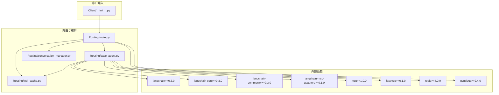
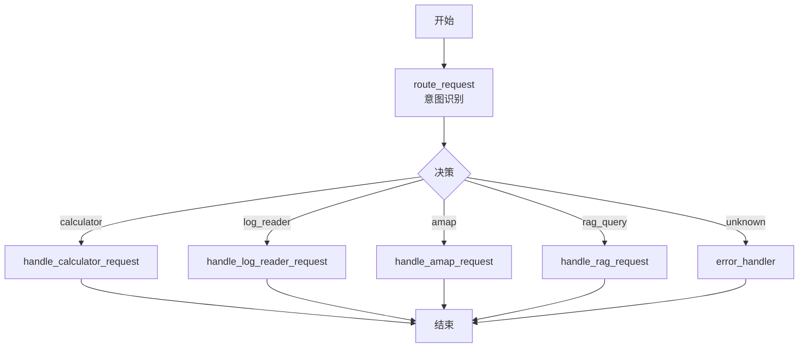
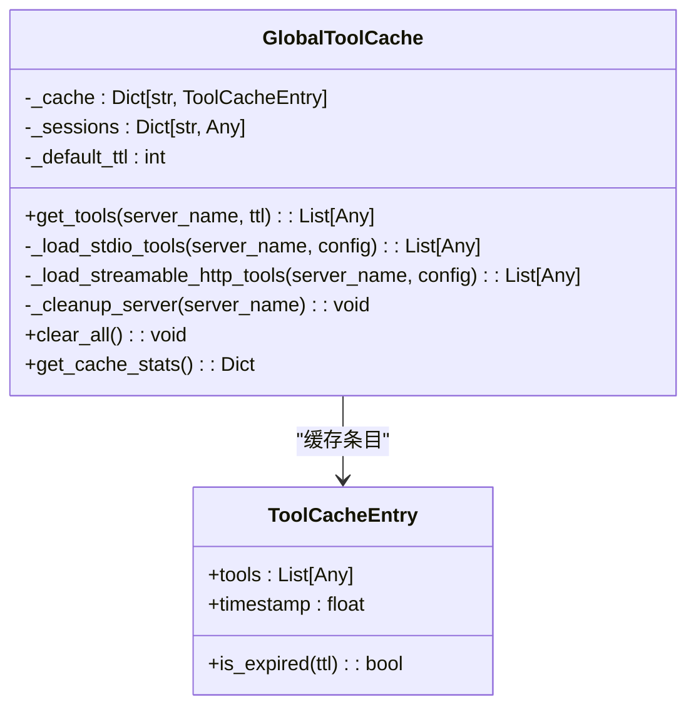
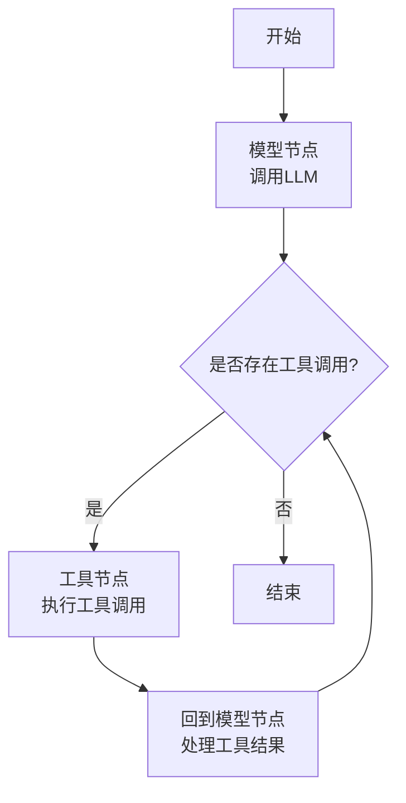
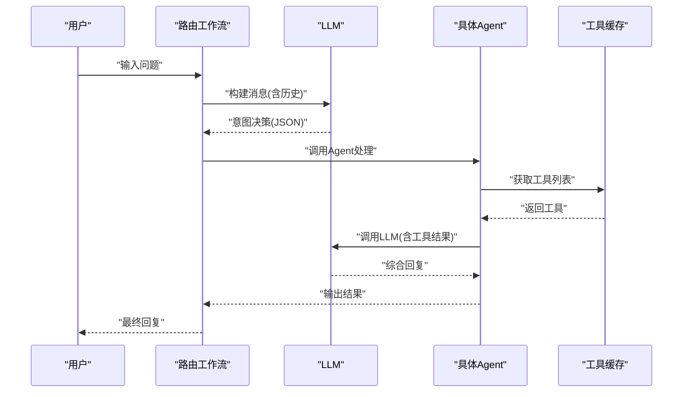
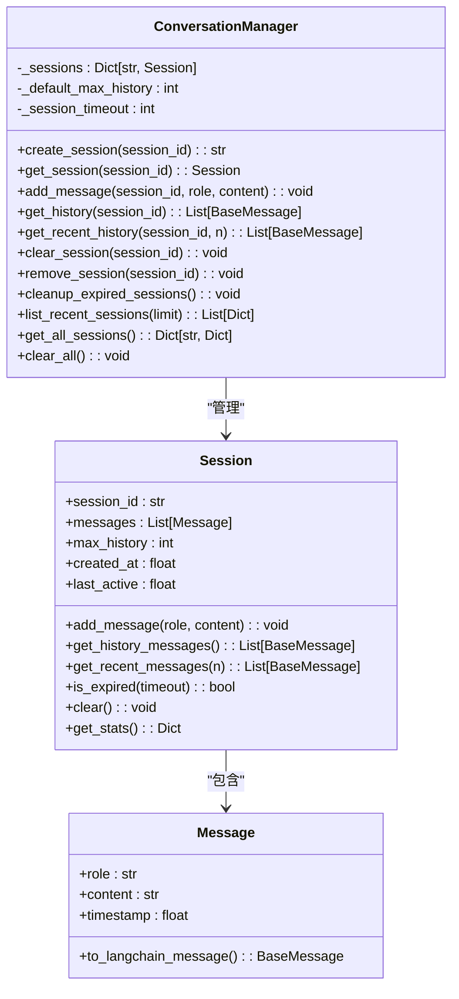
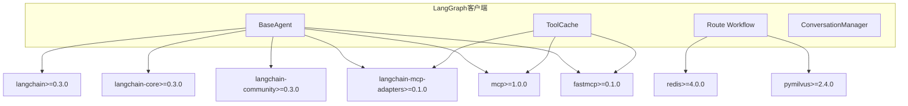

# LangGraph客户端

<cite>
**本文档引用的文件**
- [README.md](file://README.md)
- [requirements.txt](file://requirements.txt)
- [quickstart.py](file://quickstart.py)
- [demo_conversation.py](file://demo_conversation.py)
- [Client/__init__.py](file://Client/__init__.py)
- [Routing/base_agent.py](file://Routing/base_agent.py)
- [Routing/tool_cache.py](file://Routing/tool_cache.py)
- [Routing/route.py](file://Routing/route.py)
- [Routing/conversation_manager.py](file://Routing/conversation_manager.py)
- [Routing/milvus_tunnel_manager.py](file://Routing/milvus_tunnel_manager.py)
</cite>

## 目录
1. [简介](#简介)
2. [项目结构](#项目结构)
3. [核心组件](#核心组件)
4. [架构总览](#架构总览)
5. [详细组件分析](#详细组件分析)
6. [依赖分析](#依赖分析)
7. [性能考虑](#性能考虑)
8. [故障排查指南](#故障排查指南)
9. [结论](#结论)
10. [附录](#附录)

## 简介
本文件面向希望使用LangGraph框架实现MCP（Model Context Protocol）客户端的开发者，系统阐述LangGraph客户端的设计理念、工作流编排能力与实现特色。文档重点覆盖：
- 客户端初始化流程与延迟加载机制
- 状态管理与消息流转
- 节点连接与条件边处理逻辑
- 多步骤任务的编排与消息传递路径
- 在复杂业务流程中的优势与LangChain客户端的对比
- 工作流设计模式、性能调优与调试技巧

LangGraph客户端采用“工具缓存 + 会话管理 + 路由编排”的三层架构，结合LangGraph的状态图与条件边，实现从意图识别到工具调用再到LLM综合反馈的完整闭环。

## 项目结构
该项目围绕Routing与Client两大模块组织，其中Routing负责工具缓存、会话管理、路由与具体Agent实现；Client提供LangGraph/LangChain两种MCP客户端入口与导出。

图表来源
- [Client/__init__.py:1-12](file://Client/__init__.py#L1-L12)
- [Routing/route.py:1-553](file://Routing/route.py#L1-L553)
- [Routing/base_agent.py:1-497](file://Routing/base_agent.py#L1-L497)
- [Routing/tool_cache.py:1-302](file://Routing/tool_cache.py#L1-L302)
- [Routing/conversation_manager.py:1-275](file://Routing/conversation_manager.py#L1-L275)
- [requirements.txt:1-17](file://requirements.txt#L1-L17)

章节来源
- [README.md:1-125](file://README.md#L1-L125)
- [requirements.txt:1-17](file://requirements.txt#L1-L17)
- [Client/__init__.py:1-12](file://Client/__init__.py#L1-L12)

## 核心组件
- 工具缓存与MCP连接管理：统一加载与复用MCP服务器工具，支持stdio与streamable-http两种传输协议，具备TTL过期与会话生命周期管理。
- 基类Agent与具体Agent：抽象出通用状态、节点函数与路由逻辑，派生出计算器、日志读取、高德地图、RAG等专用Agent。
- 路由工作流：基于LangGraph构建的顶层状态图，负责意图识别、会话上下文注入与到具体Agent的路由。
- 会话管理：支持内存与Redis持久化的多轮对话历史管理，提供超时清理与统计接口。
- 快速启动与演示：提供一键启动与多轮对话演示脚本，验证工具缓存与会话管理效果。

章节来源
- [Routing/tool_cache.py:1-302](file://Routing/tool_cache.py#L1-L302)
- [Routing/base_agent.py:1-497](file://Routing/base_agent.py#L1-L497)
- [Routing/route.py:1-553](file://Routing/route.py#L1-L553)
- [Routing/conversation_manager.py:1-275](file://Routing/conversation_manager.py#L1-L275)
- [quickstart.py:1-68](file://quickstart.py#L1-L68)
- [demo_conversation.py:1-102](file://demo_conversation.py#L1-L102)

## 架构总览
LangGraph客户端采用“顶层路由 + Agent工作流”的双层结构：
- 顶层路由工作流：根据用户输入与会话历史，识别意图并路由到对应Agent。
- Agent工作流：每个Agent内部包含“模型节点”和“工具节点”，通过条件边在两者间往返，直至无工具调用为止。

图表来源
- [Routing/route.py:258-291](file://Routing/route.py#L258-L291)
- [Routing/route.py:149-233](file://Routing/route.py#L149-L233)

章节来源
- [Routing/route.py:258-291](file://Routing/route.py#L258-L291)

## 详细组件分析

### 工具缓存与MCP连接管理（GlobalToolCache）
- 设计目标：避免重复加载MCP服务器工具，降低冷启动开销；统一管理stdio与streamable-http两类传输协议；提供TTL过期与会话生命周期管理。
- 关键机制：
  - 缓存条目封装工具列表与时间戳，按服务器名索引。
  - 支持stdio：通过MultiServerMCPClient启动子进程并加载工具，保存客户端引用以维持连接。
  - 支持streamable-http：通过ClientSession建立长连接，初始化后加载工具。
  - TTL过期：超过阈值自动清理并重建连接。
  - 清理策略：显式清理与异常静默处理，避免影响主流程。
- 与Agent协作：Agent在初始化时通过工具缓存获取工具列表，绑定至LLM，随后构建工作流。

图表来源
- [Routing/tool_cache.py:27-302](file://Routing/tool_cache.py#L27-L302)

章节来源
- [Routing/tool_cache.py:85-116](file://Routing/tool_cache.py#L85-L116)
- [Routing/tool_cache.py:118-140](file://Routing/tool_cache.py#L118-L140)
- [Routing/tool_cache.py:198-243](file://Routing/tool_cache.py#L198-L243)
- [Routing/tool_cache.py:244-290](file://Routing/tool_cache.py#L244-L290)

### 基类Agent与具体Agent（BaseAgent）
- 设计理念：统一工具加载、消息处理、错误处理与工作流构建；通过抽象方法注入服务器名与系统提示词，派生Agent实现领域逻辑。
- 状态模型：AgentState包含消息列表、当前步骤、工具调用记录、工具结果、最终响应与错误字段。
- 节点函数：
  - 模型节点：自动注入系统消息，调用LLM并追加AI消息。
  - 工具节点：解析AI消息中的工具调用，按名称映射到缓存工具，执行并生成工具消息，仅传递必要结果内容。
- 路由逻辑：
  - 模型节点后：若存在工具调用则进入工具节点，否则结束。
  - 工具节点后：总是回到模型节点以处理工具结果。
- 工作流构建：使用StateGraph添加节点与边，编译得到可执行应用。

图表来源
- [Routing/base_agent.py:102-130](file://Routing/base_agent.py#L102-L130)
- [Routing/base_agent.py:131-217](file://Routing/base_agent.py#L131-L217)
- [Routing/base_agent.py:219-236](file://Routing/base_agent.py#L219-L236)
- [Routing/base_agent.py:238-256](file://Routing/base_agent.py#L238-L256)

章节来源
- [Routing/base_agent.py:19-27](file://Routing/base_agent.py#L19-L27)
- [Routing/base_agent.py:102-130](file://Routing/base_agent.py#L102-L130)
- [Routing/base_agent.py:131-217](file://Routing/base_agent.py#L131-L217)
- [Routing/base_agent.py:219-236](file://Routing/base_agent.py#L219-L236)
- [Routing/base_agent.py:238-256](file://Routing/base_agent.py#L238-L256)

### 路由工作流（route.py）
- 意图识别：基于系统消息与会话历史，调用LLM输出受限JSON，明确下一步代理类型。
- 会话上下文注入：在构建Agent输入时，拼接最近N轮历史，增强上下文连贯性。
- 节点与边：
  - 节点：四个专用处理节点与意图识别节点、错误处理节点。
  - 边：从START到route_request，再依据决策条件边路由到对应处理节点，最终均到达END。
- 高级API：chat_with_session支持多轮对话，自动保存用户与AI消息，返回会话ID与缓存统计。

图表来源
- [Routing/route.py:149-233](file://Routing/route.py#L149-L233)
- [Routing/route.py:60-108](file://Routing/route.py#L60-L108)
- [Routing/route.py:351-414](file://Routing/route.py#L351-L414)

章节来源
- [Routing/route.py:149-233](file://Routing/route.py#L149-L233)
- [Routing/route.py:60-108](file://Routing/route.py#L60-L108)
- [Routing/route.py:351-414](file://Routing/route.py#L351-L414)

### 会话管理（ConversationManager）
- 单例模式：全局唯一实例，支持内存与Redis双重存储。
- 会话生命周期：创建、添加消息、获取历史、清理过期会话、统计信息。
- 与路由协作：在多轮对话中，将最近历史注入到Agent输入，保证上下文一致性。

图表来源
- [Routing/conversation_manager.py:18-80](file://Routing/conversation_manager.py#L18-L80)
- [Routing/conversation_manager.py:82-275](file://Routing/conversation_manager.py#L82-L275)

章节来源
- [Routing/conversation_manager.py:100-146](file://Routing/conversation_manager.py#L100-L146)
- [Routing/conversation_manager.py:166-184](file://Routing/conversation_manager.py#L166-L184)
- [Routing/conversation_manager.py:234-253](file://Routing/conversation_manager.py#L234-L253)

### 客户端入口与使用示例
- 客户端导出：Client/__init__.py同时导出LangChain与LangGraph两种MCP客户端，便于按需切换。
- 快速启动：quickstart.py演示创建Agent、列出工具、发起对话与查看结果。
- 演示脚本：demo_conversation.py展示工具缓存、循环对话与会话管理的实际效果。

章节来源
- [Client/__init__.py:1-12](file://Client/__init__.py#L1-L12)
- [quickstart.py:8-57](file://quickstart.py#L8-L57)
- [demo_conversation.py:19-98](file://demo_conversation.py#L19-L98)

## 依赖分析
LangGraph客户端依赖LangChain系列与MCP生态的关键组件，形成“LLM + 工具适配 + 传输协议 + 存储”的技术栈。

图表来源
- [requirements.txt:1-17](file://requirements.txt#L1-L17)
- [Routing/base_agent.py:68-89](file://Routing/base_agent.py#L68-L89)
- [Routing/tool_cache.py:18-25](file://Routing/tool_cache.py#L18-L25)
- [Routing/route.py:14-28](file://Routing/route.py#L14-L28)

章节来源
- [requirements.txt:1-17](file://requirements.txt#L1-L17)

## 性能考虑
- 工具缓存与复用：通过GlobalToolCache减少MCP服务器连接与工具加载次数，显著降低延迟。
- 传输协议选择：stdio适合本地或可控环境，streamable-http适合远程服务，注意超时与重试策略。
- 会话历史截断：ConversationManager限制最大历史轮数，避免上下文过长导致LLM负担。
- 并发与清理：清理过期会话与关闭连接，防止资源泄漏；在应用退出时统一清理。
- RAG后端优化：根据Milvus或ChromaDB选择合适后端，合理设置查询参数与索引策略。

## 故障排查指南
- 工具加载失败：
  - 检查MCP配置文件与服务器名称是否匹配。
  - 确认stdio命令与参数、streamable-http URL与API Key正确。
  - 观察超时与异常日志，必要时增加超时时间或重试。
- 连接异常：
  - stdio：确认子进程可正常启动且工具适配器可用。
  - streamable-http：检查网络连通性与API Key，关注初始化阶段的超时。
- 会话管理问题：
  - Redis不可用时回退到内存模式；检查Redis连接参数与TTL设置。
  - 过期会话清理策略是否生效，避免内存泄漏。
- 调试技巧：
  - 启用详细日志，观察工具缓存命中率与会话统计。
  - 使用演示脚本验证工具缓存与循环对话功能。
  - 在Agent节点中打印关键状态，定位消息流转问题。

章节来源
- [Routing/tool_cache.py:194-196](file://Routing/tool_cache.py#L194-L196)
- [Routing/tool_cache.py:240-242](file://Routing/tool_cache.py#L240-L242)
- [Routing/conversation_manager.py:112-118](file://Routing/conversation_manager.py#L112-L118)
- [demo_conversation.py:19-98](file://demo_conversation.py#L19-L98)

## 结论
LangGraph客户端通过“工具缓存 + 会话管理 + 路由编排”的架构，实现了MCP工具的高效复用、多轮对话的上下文保持与复杂业务流程的可组合编排。相较传统LangChain客户端，LangGraph的优势在于：
- 更清晰的工作流可视化与条件边控制，便于扩展与维护
- 与会话管理深度集成，天然支持多轮对话
- 统一的Agent基类抽象，降低Agent实现成本

在实际部署中，建议结合工具缓存、传输协议优化与会话清理策略，持续监控缓存命中率与响应时延，以获得最佳体验。

## 附录

### 如何创建LangGraph客户端（步骤指引）
- 初始化工具缓存：确保MCP配置文件存在，服务器名称与传输协议正确。
- 创建Agent：通过工厂函数或直接实例化具体Agent，调用initialize触发延迟加载。
- 构建工作流：Agent内部使用StateGraph构建节点与边，编译得到可执行应用。
- 发起对话：构造初始状态，调用ainvoke执行工作流，获取最终响应与工具调用记录。

章节来源
- [Routing/base_agent.py:44-66](file://Routing/base_agent.py#L44-L66)
- [Routing/base_agent.py:258-317](file://Routing/base_agent.py#L258-L317)

### 配置工作流节点与消息传递路径
- 节点定义：模型节点与工具节点分别负责LLM推理与工具调用。
- 条件边：模型节点后根据是否存在工具调用决定路由；工具节点后总是回到模型节点。
- 消息传递：工具节点将工具结果封装为ToolMessage注入消息流，供LLM二次处理。

章节来源
- [Routing/base_agent.py:102-130](file://Routing/base_agent.py#L102-L130)
- [Routing/base_agent.py:131-217](file://Routing/base_agent.py#L131-L217)
- [Routing/base_agent.py:219-236](file://Routing/base_agent.py#L219-L236)

### LangGraph vs LangChain：对比与选型建议
- LangGraph优势：
  - 明确的状态图与条件边，适合复杂多步骤任务与多Agent协作。
  - 与会话管理天然契合，易于实现多轮对话。
- LangChain优势：
  - 生态丰富，链式组合灵活；适合快速原型与简单场景。
- 选型建议：
  - 复杂业务流程与多Agent编排：优先LangGraph。
  - 快速实验与简单工具链：可考虑LangChain。

章节来源
- [README.md:38-125](file://README.md#L38-L125)