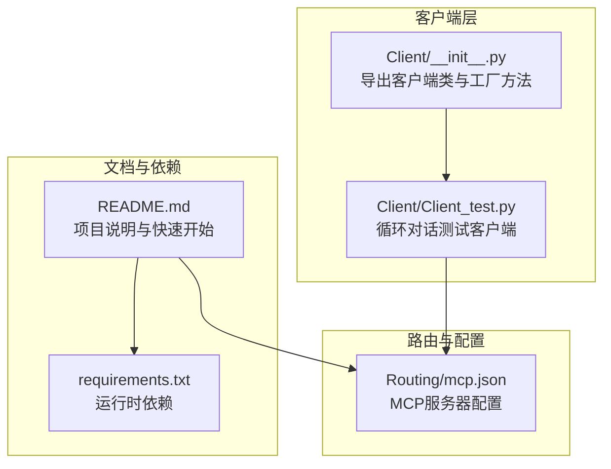
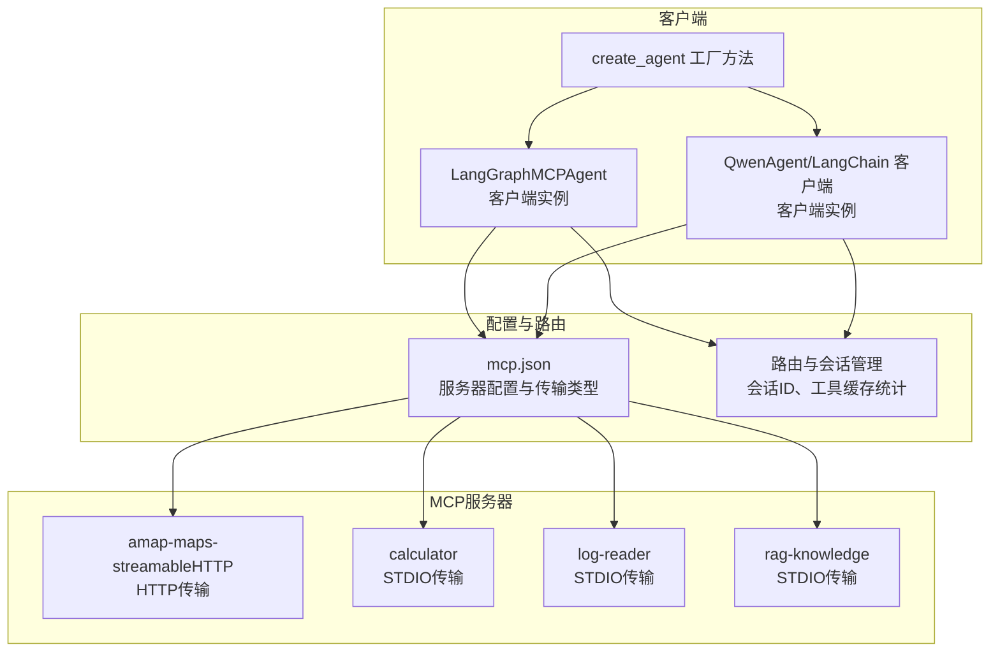
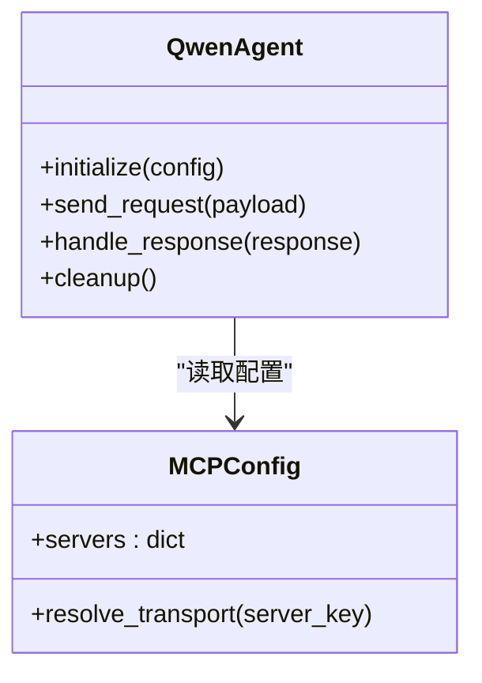
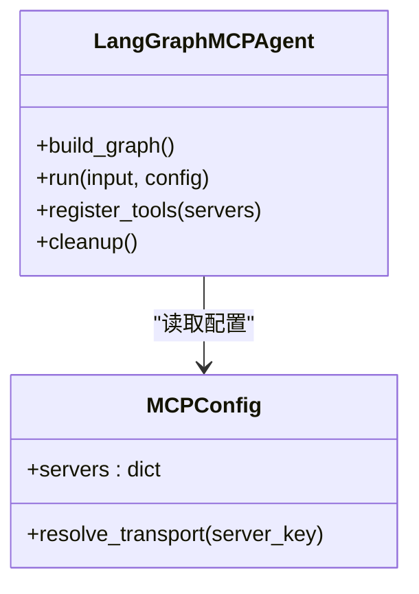
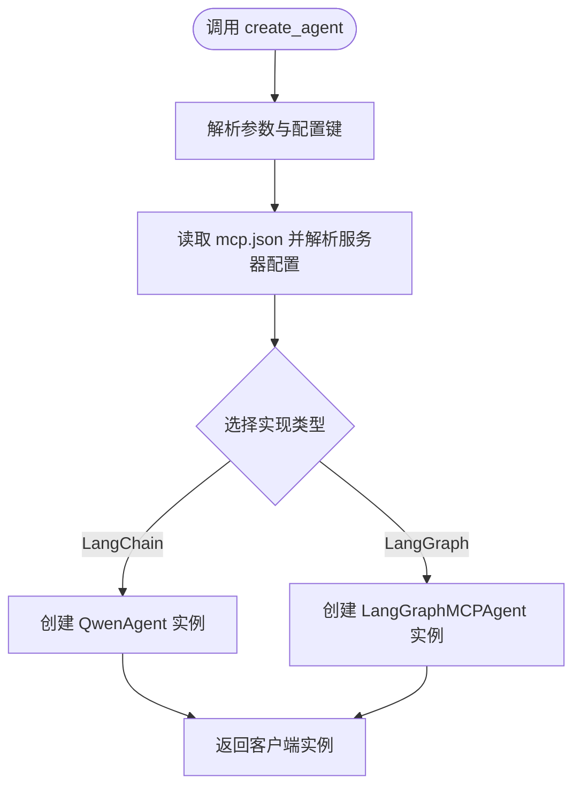
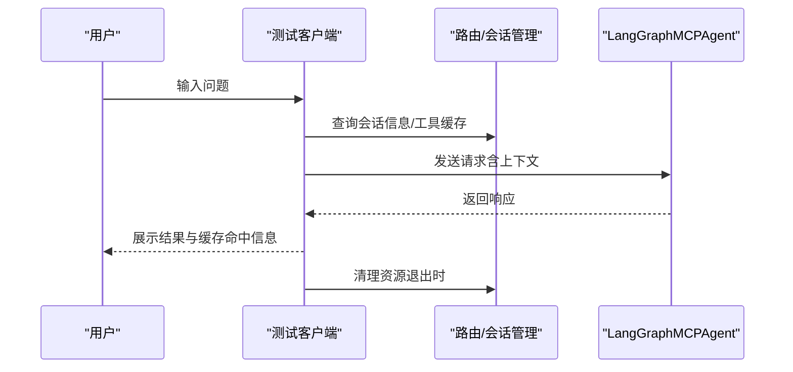
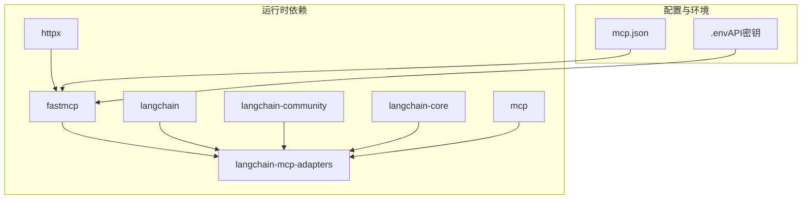

# MCP客户端

<cite>
**本文引用的文件**
- [Client/__init__.py](file://Client/__init__.py)
- [Client/Client_test.py](file://Client/Client_test.py)
- [Routing/mcp.json](file://Routing/mcp.json)
- [README.md](file://README.md)
- [requirements.txt](file://requirements.txt)
</cite>

## 目录
1. [简介](#简介)
2. [项目结构](#项目结构)
3. [核心组件](#核心组件)
4. [架构总览](#架构总览)
5. [详细组件分析](#详细组件分析)
6. [依赖分析](#依赖分析)
7. [性能考虑](#性能考虑)
8. [故障排除指南](#故障排除指南)
9. [结论](#结论)
10. [附录](#附录)

## 简介
本文件面向MCP（Model Context Protocol）客户端组件，聚焦于LangChain与LangGraph两种客户端实现的设计差异、功能特性与使用场景。文档将详细说明客户端初始化流程、连接管理、消息传递机制与错误处理策略，并结合仓库中的配置与测试样例，给出可操作的实践指导与优化建议。

## 项目结构
该项目围绕MCP协议构建智能代理系统，客户端侧通过LangChain与LangGraph两种实现接入MCP服务器，配合路由与会话管理模块完成端到端的对话与工具调用。核心文件与职责如下：
- Client/__init__.py：导出LangChain与LangGraph客户端类及工厂方法，作为统一入口。
- Client/Client_test.py：提供循环对话测试客户端，演示会话管理、工具缓存统计与RAG后端切换等能力。
- Routing/mcp.json：MCP服务器配置文件，定义多个服务器及其传输方式（HTTP/STDIO）。
- README.md：项目总体介绍、快速开始与功能特性说明。
- requirements.txt：运行时依赖清单，包含fastmcp、langchain、langchain-mcp-adapters、mcp等。

**图表来源**
- [Client/__init__.py:1-12](file://Client/__init__.py#L1-L12)
- [Client/Client_test.py:1-230](file://Client/Client_test.py#L1-L230)
- [Routing/mcp.json:1-29](file://Routing/mcp.json#L1-L29)
- [README.md:1-125](file://README.md#L1-L125)
- [requirements.txt:1-16](file://requirements.txt#L1-L16)

**章节来源**
- [Client/__init__.py:1-12](file://Client/__init__.py#L1-L12)
- [Client/Client_test.py:1-230](file://Client/Client_test.py#L1-L230)
- [Routing/mcp.json:1-29](file://Routing/mcp.json#L1-L29)
- [README.md:1-125](file://README.md#L1-L125)
- [requirements.txt:1-16](file://requirements.txt#L1-L16)

## 核心组件
- LangChain MCP客户端：通过langchain-mcp-adapters动态加载MCP服务器提供的工具，适合与LangChain生态深度集成。
- LangGraph MCP客户端：通过langchain-mcp-adapters实现动态工具加载与智能路由，强调图式工作流与工具编排。
- 客户端工厂方法：提供create_agent接口，用于创建对应实现的客户端实例。
- 会话与路由测试客户端：演示循环对话、会话管理、工具缓存统计与RAG后端切换。

**章节来源**
- [Client/__init__.py:4-11](file://Client/__init__.py#L4-L11)
- [Client/Client_test.py:40-230](file://Client/Client_test.py#L40-L230)
- [README.md:38-78](file://README.md#L38-L78)

## 架构总览
下图展示了客户端与MCP服务器的交互关系，以及配置驱动的连接管理方式：

**图表来源**
- [Client/__init__.py:4-11](file://Client/__init__.py#L4-L11)
- [Routing/mcp.json:1-29](file://Routing/mcp.json#L1-L29)
- [Client/Client_test.py:180-198](file://Client/Client_test.py#L180-L198)

**章节来源**
- [Client/__init__.py:4-11](file://Client/__init__.py#L4-L11)
- [Routing/mcp.json:1-29](file://Routing/mcp.json#L1-L29)
- [Client/Client_test.py:40-230](file://Client/Client_test.py#L40-L230)

## 详细组件分析

### LangChain MCP客户端（QwenAgent）
- 设计定位：面向LangChain生态的MCP客户端，通过langchain-mcp-adapters实现工具动态加载与调用。
- 初始化流程：通过create_agent工厂方法创建实例，内部依据mcp.json配置解析服务器与传输方式。
- 连接管理：支持HTTP与STDIO两种传输；HTTP场景下需关注URL与鉴权参数；STDIO场景下通过进程管理与标准输入输出进行通信。
- 消息传递机制：将用户输入封装为MCP请求，经适配器转发至MCP服务器，接收响应后回传给上层应用。
- 错误处理策略：对连接失败、工具不可用、响应异常等情况进行捕获与降级处理，确保会话不中断。

**图表来源**
- [Client/__init__.py:4-5](file://Client/__init__.py#L4-L5)
- [Routing/mcp.json:1-29](file://Routing/mcp.json#L1-L29)

**章节来源**
- [Client/__init__.py:4-5](file://Client/__init__.py#L4-L5)
- [Routing/mcp.json:1-29](file://Routing/mcp.json#L1-L29)

### LangGraph MCP客户端（LangGraphMCPAgent）
- 设计定位：强调图式工作流与工具编排，通过langchain-mcp-adapters实现动态工具加载与智能路由。
- 初始化流程：create_agent工厂方法返回LangGraphMCPAgent实例，内部完成MCP服务器发现、工具注册与图式节点构建。
- 连接管理：与LangChain版本类似，支持HTTP与STDIO传输；在图式执行过程中维护状态与上下文。
- 消息传递机制：将用户输入与历史上下文合并，经工具节点执行后生成最终响应。
- 错误处理策略：在节点执行失败时进行重试或跳过，保证整体流程的鲁棒性。

**图表来源**
- [Client/__init__.py:5-5](file://Client/__init__.py#L5-L5)
- [Routing/mcp.json:1-29](file://Routing/mcp.json#L1-L29)

**章节来源**
- [Client/__init__.py:5-5](file://Client/__init__.py#L5-L5)
- [Routing/mcp.json:1-29](file://Routing/mcp.json#L1-L29)

### 客户端工厂方法（create_agent）
- 统一入口：提供create_agent工厂方法，根据传入参数返回LangChain或LangGraph客户端实例。
- 参数与行为：支持传入配置键（如服务器名）、传输类型、鉴权参数等，内部按需解析mcp.json并建立连接。
- 返回值：返回对应客户端实例，供上层调用send_request/run等方法。

**图表来源**
- [Client/__init__.py:4-11](file://Client/__init__.py#L4-L11)
- [Routing/mcp.json:1-29](file://Routing/mcp.json#L1-L29)

**章节来源**
- [Client/__init__.py:4-11](file://Client/__init__.py#L4-L11)
- [Routing/mcp.json:1-29](file://Routing/mcp.json#L1-L29)

### 会话与路由测试客户端
- 循环对话：支持连续提问、显示工具缓存状态、会话管理命令与RAG后端切换。
- 会话管理：提供会话列表、会话信息查询、清空历史与统计信息展示。
- 资源管理：在程序退出时清理Redis连接与SSH隧道，确保资源释放。

**图表来源**
- [Client/Client_test.py:40-230](file://Client/Client_test.py#L40-L230)

**章节来源**
- [Client/Client_test.py:40-230](file://Client/Client_test.py#L40-L230)

## 依赖分析
- 运行时依赖：项目依赖fastmcp、langchain、langchain-community、langchain-core、langchain-mcp-adapters、mcp、httpx等，确保MCP协议支持与LangChain生态集成。
- 配置驱动：通过mcp.json集中管理MCP服务器地址、命令与传输方式，降低硬编码耦合。
- 环境变量：README中建议在.env中配置API密钥，如高德地图API密钥等。

**图表来源**
- [requirements.txt:1-16](file://requirements.txt#L1-L16)
- [Routing/mcp.json:1-29](file://Routing/mcp.json#L1-L29)
- [README.md:64-69](file://README.md#L64-L69)

**章节来源**
- [requirements.txt:1-16](file://requirements.txt#L1-L16)
- [Routing/mcp.json:1-29](file://Routing/mcp.json#L1-L29)
- [README.md:64-69](file://README.md#L64-L69)

## 性能考虑
- 连接复用：在HTTP传输场景下，建议复用连接池以减少握手开销；在STDIO场景下避免频繁重启子进程。
- 工具缓存：利用工具缓存统计信息（来自测试客户端）评估命中率，合理设置缓存生命周期。
- 超时与重试：为HTTP请求设置合理的超时阈值与指数退避重试策略，避免阻塞主线程。
- 资源管理：在退出时主动清理Redis连接与SSH隧道，防止句柄泄漏。
- 图式优化：LangGraph场景下，尽量减少不必要的节点拆分与状态拷贝，提升执行效率。

## 故障排除指南
- 连接超时：检查网络连通性与服务器可达性；调整HTTP超时参数；确认防火墙与代理设置。
- 重连策略：在STDIO场景下，若子进程异常退出，应具备自动重启能力；在HTTP场景下采用指数退避重试。
- 鉴权失败：确认.env中的API密钥配置正确；检查MCP服务器端的鉴权策略与令牌有效期。
- 工具不可用：通过工具缓存统计查看可用性；必要时重新注册工具或重建客户端实例。
- 资源泄漏：确保finally块中执行清理逻辑，关闭Redis连接与SSH隧道；监控内存与文件描述符使用情况。

## 结论
本MCP客户端组件通过LangChain与LangGraph两种实现，提供了灵活的工具加载与编排能力。结合mcp.json配置与测试客户端，能够快速搭建从对话到工具调用的完整链路。建议在生产环境中重视连接管理、超时与重试策略、资源清理与性能优化，以获得稳定高效的用户体验。

## 附录
- 快速开始：参考README中的快速开始章节，完成环境准备与运行示例。
- 配置示例：参考mcp.json中的服务器配置，了解HTTP与STDIO传输方式的差异。
- 测试客户端：参考Client_test.py，掌握循环对话、会话管理与工具缓存统计的使用方法。

**章节来源**
- [README.md:51-78](file://README.md#L51-L78)
- [Routing/mcp.json:1-29](file://Routing/mcp.json#L1-L29)
- [Client/Client_test.py:40-230](file://Client/Client_test.py#L40-L230)