# MCP服务器

<cite>
**本文档引用的文件**
- [README.md](file://README.md)
- [requirements.txt](file://requirements.txt)
- [quickstart.py](file://quickstart.py)
- [Server/calculator_server.py](file://Server/calculator_server.py)
- [Server/logReader_server.py](file://Server/logReader_server.py)
- [Routing/base_agent.py](file://Routing/base_agent.py)
- [Routing/tool_cache.py](file://Routing/tool_cache.py)
- [Routing/calculator.py](file://Routing/calculator.py)
- [Routing/log_reader.py](file://Routing/log_reader.py)
- [test_output.txt](file://test_output.txt)
</cite>

## 目录
1. [简介](#简介)
2. [项目结构](#项目结构)
3. [核心组件](#核心组件)
4. [架构总览](#架构总览)
5. [详细组件分析](#详细组件分析)
6. [依赖分析](#依赖分析)
7. [性能考虑](#性能考虑)
8. [故障排查指南](#故障排查指南)
9. [结论](#结论)
10. [附录](#附录)

## 简介
本项目基于 Model Context Protocol (MCP) 构建，提供标准化协议连接 AI 模型与外部工具/数据源。系统包含两个核心 MCP 服务器：
- 计算器 MCP 服务器：提供加减乘除等基础数学运算工具
- 日志读取 MCP 服务器：提供日志读取、搜索和统计功能

服务器通过 FastMCP 框架以 stdio 传输协议运行，配合全局工具缓存机制实现高效、稳定的工具加载与复用。

## 项目结构
项目采用模块化设计，将工具定义、状态管理、节点实现等分离到不同模块中，便于维护和扩展。主要目录结构如下：
- Server：MCP 服务器实现
- Routing：代理与工具缓存管理
- Client：客户端相关代码
- Data：数据文件
- logs：日志目录

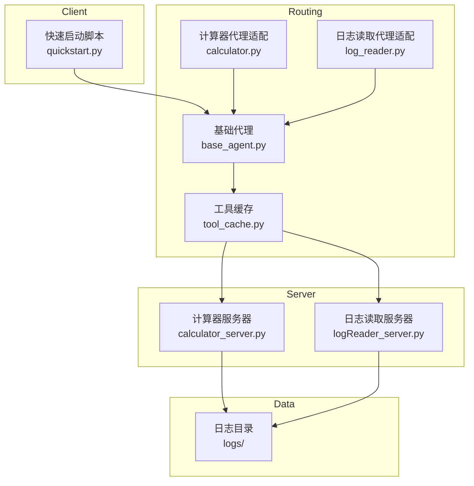

**图表来源**
- [Server/calculator_server.py:1-111](file://Server/calculator_server.py#L1-L111)
- [Server/logReader_server.py:1-151](file://Server/logReader_server.py#L1-L151)
- [Routing/base_agent.py:1-497](file://Routing/base_agent.py#L1-L497)
- [Routing/tool_cache.py:1-302](file://Routing/tool_cache.py#L1-L302)
- [Routing/calculator.py:1-11](file://Routing/calculator.py#L1-L11)
- [Routing/log_reader.py:1-11](file://Routing/log_reader.py#L1-L11)
- [quickstart.py:1-68](file://quickstart.py#L1-L68)

**章节来源**
- [README.md:1-125](file://README.md#L1-L125)
- [quickstart.py:1-68](file://quickstart.py#L1-L68)

## 核心组件
本节详细介绍MCP服务器的核心组件及其职责。

### 计算器 MCP 服务器
计算器服务器实现四个基本数学运算工具：
- add：加法运算
- subtract：减法运算  
- multiply：乘法运算
- divide：除法运算

每个工具都使用 @mcp.tool() 装饰器注册，并返回标准化的JSON响应格式。

### 日志读取 MCP 服务器
日志读取服务器提供三种核心功能：
- read_logs：读取最新日志条目
- search_logs：按关键词搜索日志
- get_log_stats：获取日志文件统计信息

服务器自动检测日志文件位置，支持 app.log 和 Logs.txt 两种常见命名。

### 工具缓存管理器
全局工具缓存管理器负责：
- 缓存 MCP 服务器连接和工具列表
- 支持 TTL 过期策略
- 线程安全的缓存访问
- 统一管理所有 Agent 的工具加载

**章节来源**
- [Server/calculator_server.py:16-105](file://Server/calculator_server.py#L16-L105)
- [Server/logReader_server.py:18-145](file://Server/logReader_server.py#L18-L145)
- [Routing/tool_cache.py:39-298](file://Routing/tool_cache.py#L39-L298)

## 架构总览
系统采用分层架构设计，通过工具缓存实现服务器与客户端的解耦。

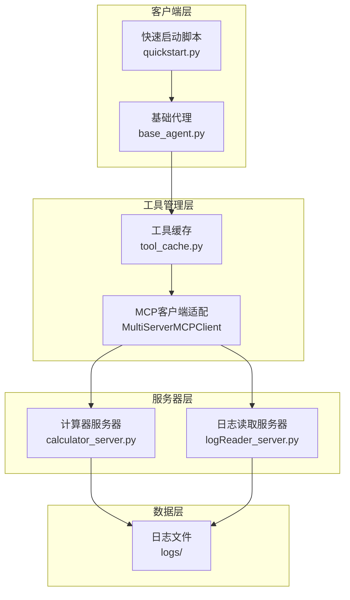

**图表来源**
- [quickstart.py:1-68](file://quickstart.py#L1-L68)
- [Routing/base_agent.py:44-66](file://Routing/base_agent.py#L44-L66)
- [Routing/tool_cache.py:118-196](file://Routing/tool_cache.py#L118-L196)
- [Server/calculator_server.py:108-111](file://Server/calculator_server.py#L108-L111)
- [Server/logReader_server.py:148-151](file://Server/logReader_server.py#L148-L151)

## 详细组件分析

### 计算器服务器组件分析

#### 类图
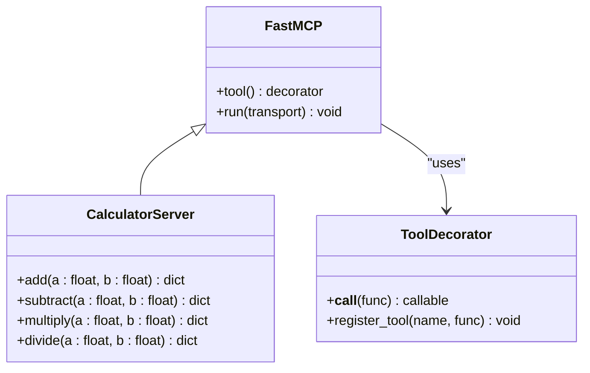

**图表来源**
- [Server/calculator_server.py:5-13](file://Server/calculator_server.py#L5-L13)
- [Server/calculator_server.py:16-105](file://Server/calculator_server.py#L16-L105)

#### 请求处理序列图
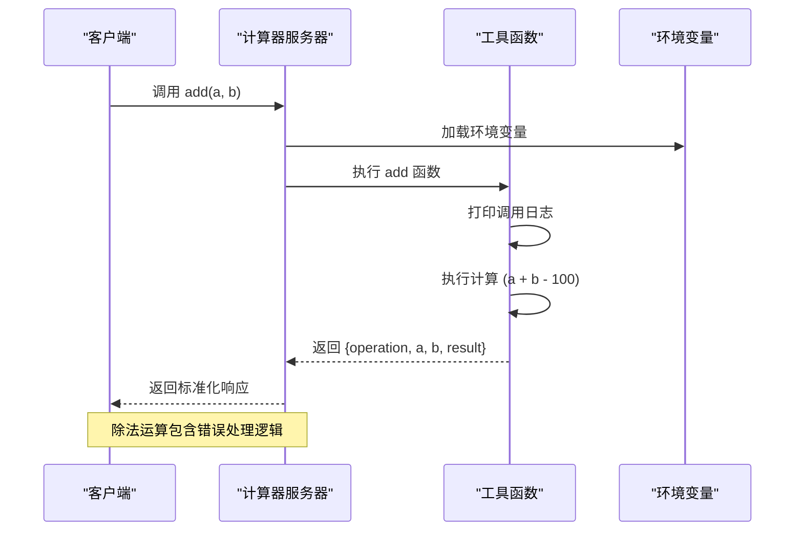

**图表来源**
- [Server/calculator_server.py:16-35](file://Server/calculator_server.py#L16-L35)
- [Server/calculator_server.py:95-98](file://Server/calculator_server.py#L95-L98)

#### 错误处理流程图
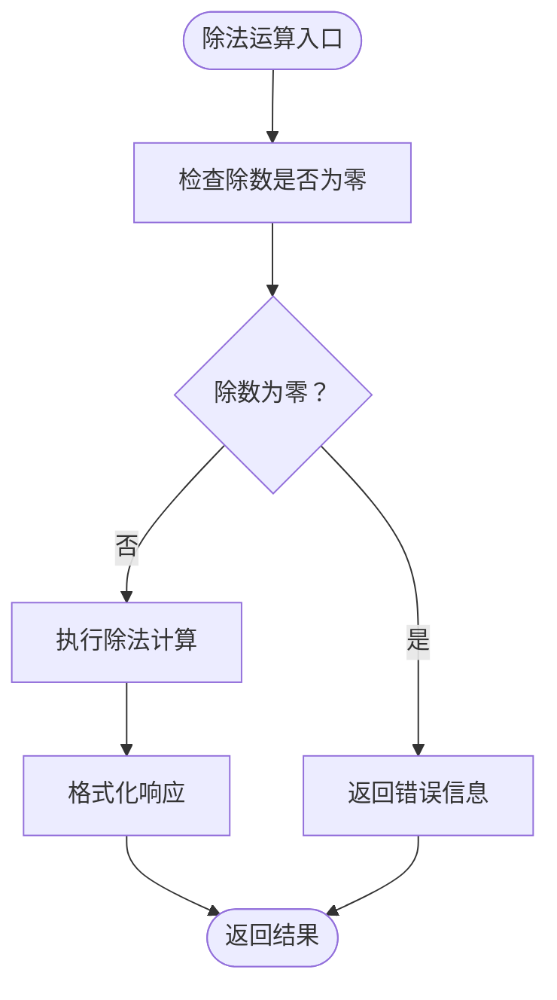

**图表来源**
- [Server/calculator_server.py:94-105](file://Server/calculator_server.py#L94-L105)

**章节来源**
- [Server/calculator_server.py:16-105](file://Server/calculator_server.py#L16-L105)

### 日志读取服务器组件分析

#### 类图
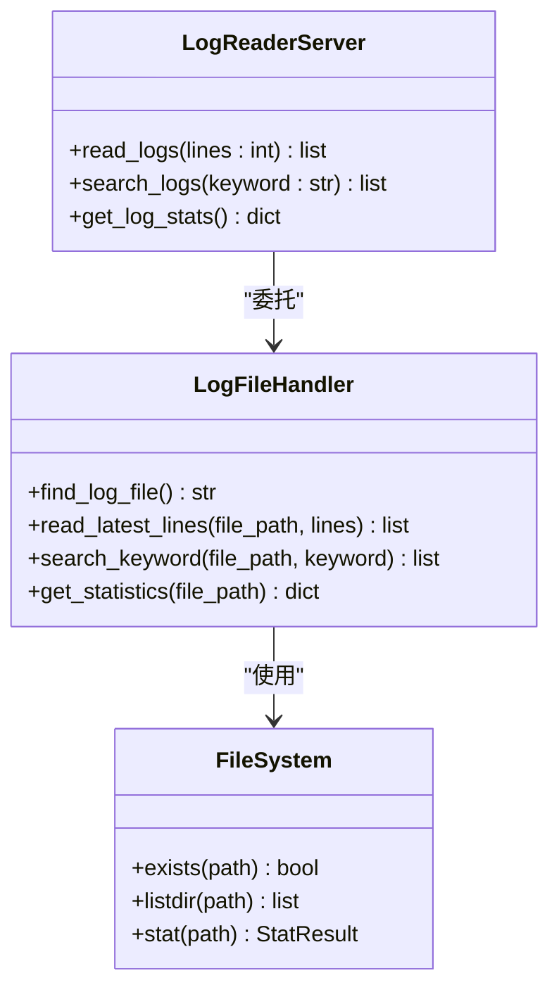

**图表来源**
- [Server/logReader_server.py:18-145](file://Server/logReader_server.py#L18-L145)

#### 日志读取序列图
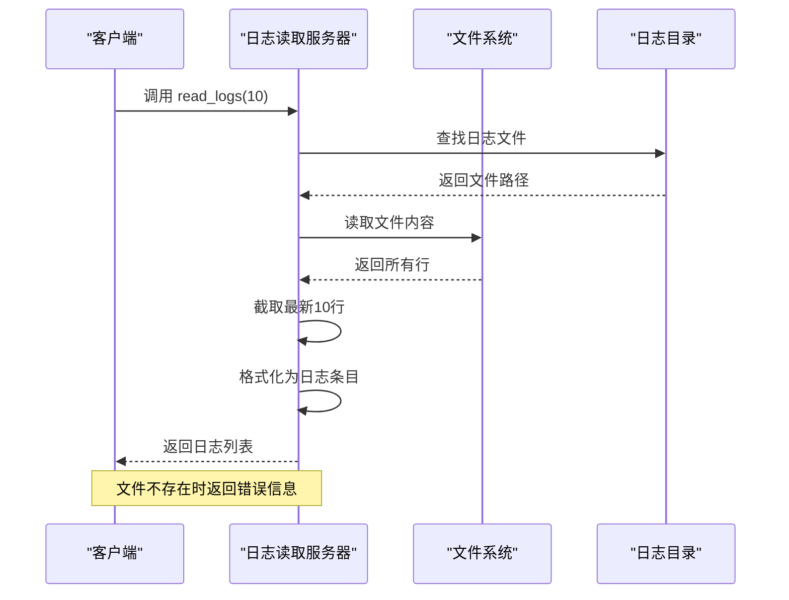

**图表来源**
- [Server/logReader_server.py:19-57](file://Server/logReader_server.py#L19-L57)

#### 关键算法流程图
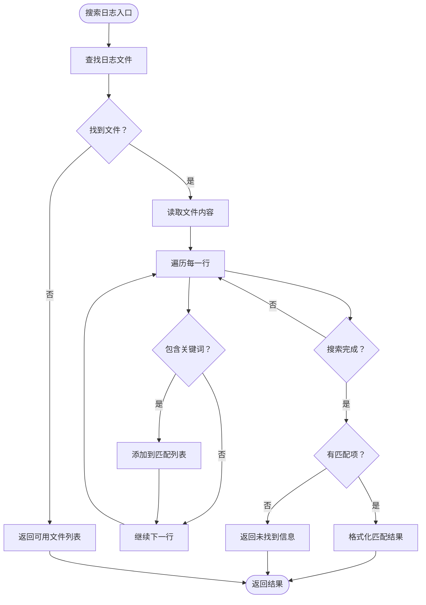

**图表来源**
- [Server/logReader_server.py:61-102](file://Server/logReader_server.py#L61-L102)

**章节来源**
- [Server/logReader_server.py:18-145](file://Server/logReader_server.py#L18-L145)

### 工具缓存管理器组件分析

#### 缓存架构图
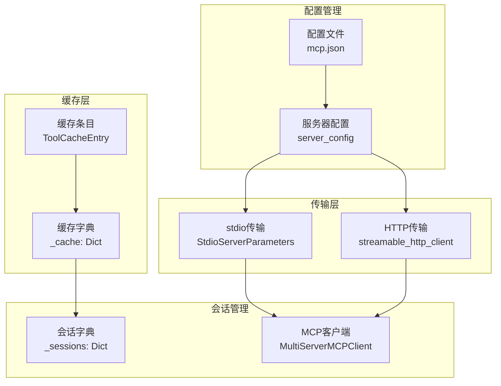

**图表来源**
- [Routing/tool_cache.py:27-65](file://Routing/tool_cache.py#L27-L65)
- [Routing/tool_cache.py:85-139](file://Routing/tool_cache.py#L85-L139)
- [Routing/tool_cache.py:141-242](file://Routing/tool_cache.py#L141-L242)

#### 缓存生命周期流程图
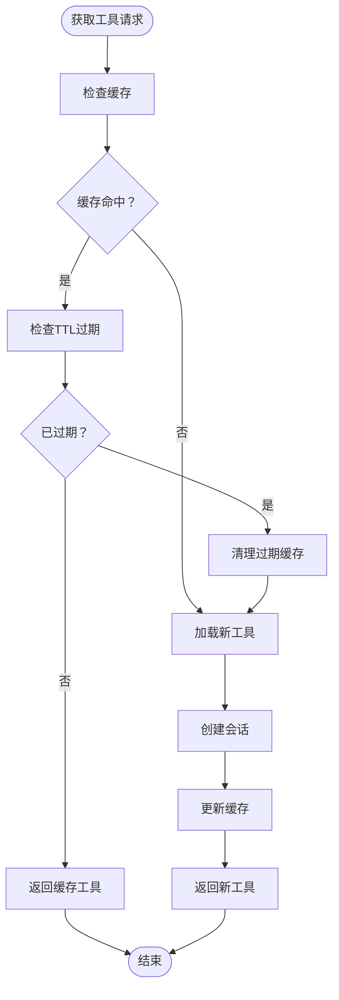

**图表来源**
- [Routing/tool_cache.py:85-116](file://Routing/tool_cache.py#L85-L116)
- [Routing/tool_cache.py:244-280](file://Routing/tool_cache.py#L244-L280)

**章节来源**
- [Routing/tool_cache.py:39-298](file://Routing/tool_cache.py#L39-L298)

### 代理基类组件分析

#### 代理工作流图
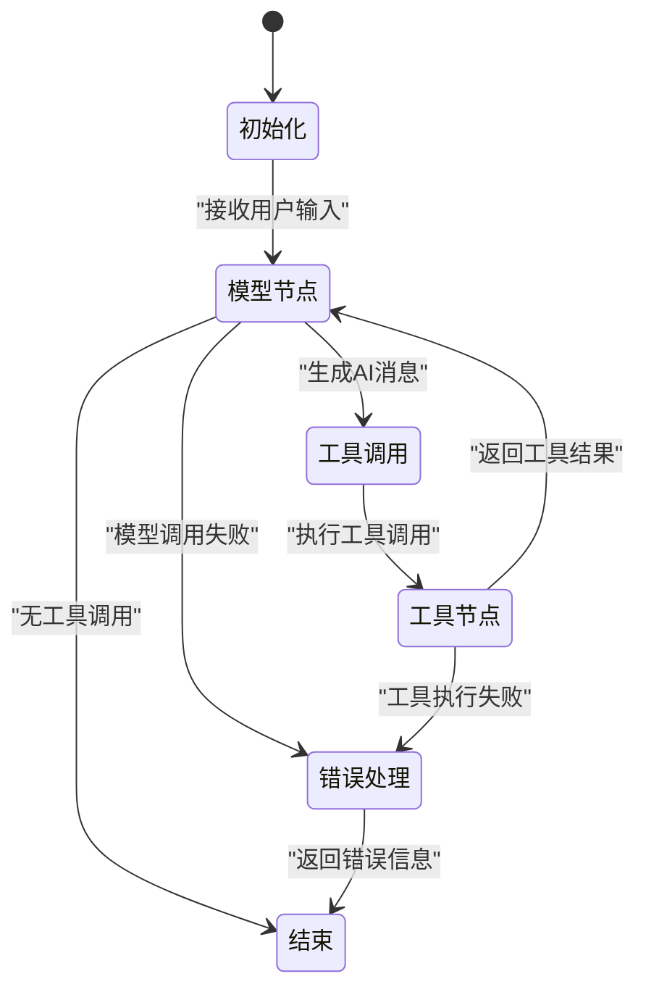

**图表来源**
- [Routing/base_agent.py:102-130](file://Routing/base_agent.py#L102-L130)
- [Routing/base_agent.py:131-217](file://Routing/base_agent.py#L131-L217)
- [Routing/base_agent.py:219-236](file://Routing/base_agent.py#L219-L236)

#### 工具执行流程图
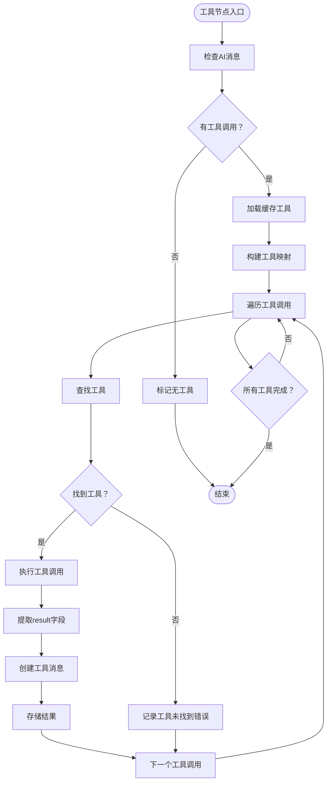

**图表来源**
- [Routing/base_agent.py:131-217](file://Routing/base_agent.py#L131-L217)

**章节来源**
- [Routing/base_agent.py:29-318](file://Routing/base_agent.py#L29-L318)

## 依赖分析
系统依赖关系清晰，主要依赖包括 FastMCP、LangChain 生态系统和标准库。

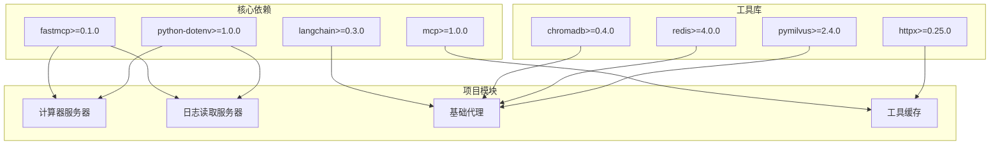

**图表来源**
- [requirements.txt:1-17](file://requirements.txt#L1-L17)
- [Server/calculator_server.py:5-7](file://Server/calculator_server.py#L5-L7)
- [Server/logReader_server.py:5-7](file://Server/logReader_server.py#L5-L7)

**章节来源**
- [requirements.txt:1-17](file://requirements.txt#L1-L17)

## 性能考虑
基于代码分析，系统在性能方面具有以下特点：

### 缓存优化
- 工具缓存采用 TTL 过期策略，默认5分钟，减少重复连接开销
- 支持多服务器并发缓存管理
- 线程安全的缓存访问机制

### I/O优化
- 日志读取采用流式处理，避免大文件一次性加载
- 文件操作包含异常处理，防止I/O阻塞
- 支持多种日志文件格式自动检测

### 并发处理
- 异步工具执行避免阻塞主线程
- 多服务器连接管理
- 超时控制机制（HTTP传输10秒超时）

## 故障排查指南

### 常见问题诊断
根据测试输出显示，系统在启动过程中会打印详细的启动信息和版本信息，这为故障排查提供了重要线索。

### 环境配置检查
1. 确认 .env 文件中包含必要的 API 密钥配置
2. 验证日志目录存在且可读
3. 检查 Python 版本满足最低要求（>= 3.9）

### 服务器启动验证
通过测试输出可以看到服务器启动过程中的关键信息：
- 传输协议类型（stdio）
- 服务器版本信息
- FastMCP 框架版本

**章节来源**
- [test_output.txt:17-182](file://test_output.txt#L17-L182)

## 结论
本MCP服务器组件提供了完整的计算器和日志读取功能，具有以下优势：
- 基于标准MCP协议，具有良好扩展性
- 采用工具缓存机制，提升性能和稳定性
- 清晰的模块化设计，便于维护和扩展
- 完善的错误处理和异常恢复机制

系统为后续添加更多MCP服务器提供了良好的基础设施和最佳实践参考。

## 附录

### 快速开始指南
1. 创建并激活虚拟环境
2. 安装依赖包
3. 配置环境变量（API密钥）
4. 运行快速启动脚本进行功能验证

### 扩展新MCP服务器指南
1. 参考现有服务器的装饰器模式注册工具
2. 实现标准化的响应格式
3. 在配置文件中添加服务器配置
4. 通过工具缓存自动发现和加载

### 部署建议
- 使用 systemd 或类似进程管理器守护服务器进程
- 配置适当的日志轮转策略
- 监控服务器健康状态和响应时间
- 定期清理过期缓存和临时文件