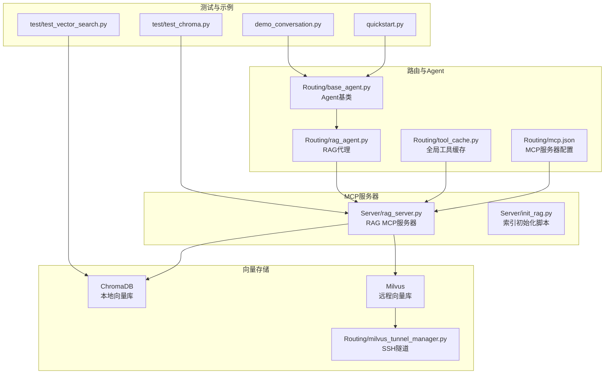
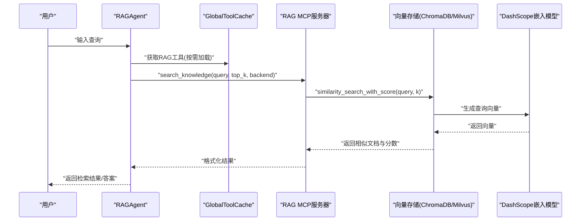
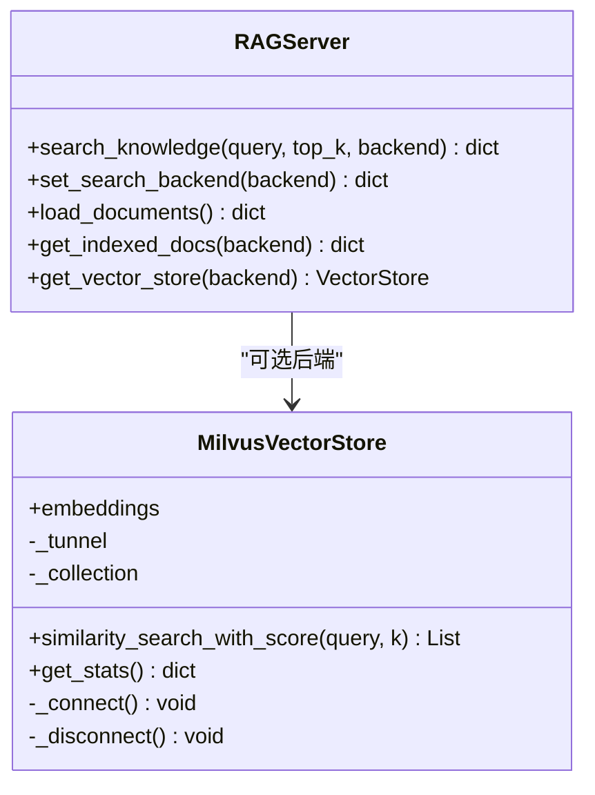
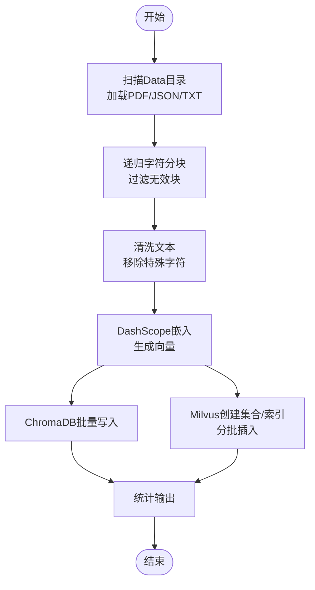
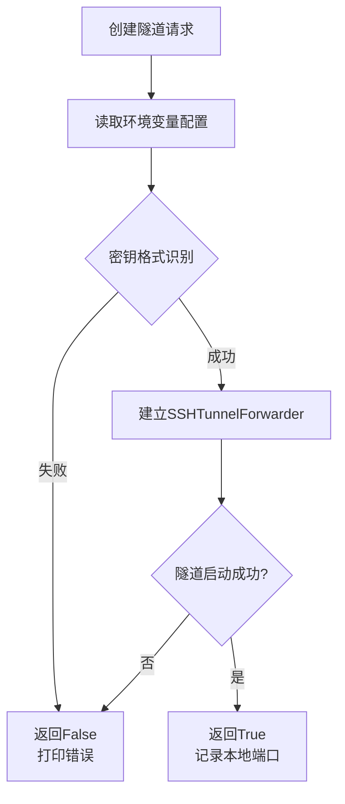
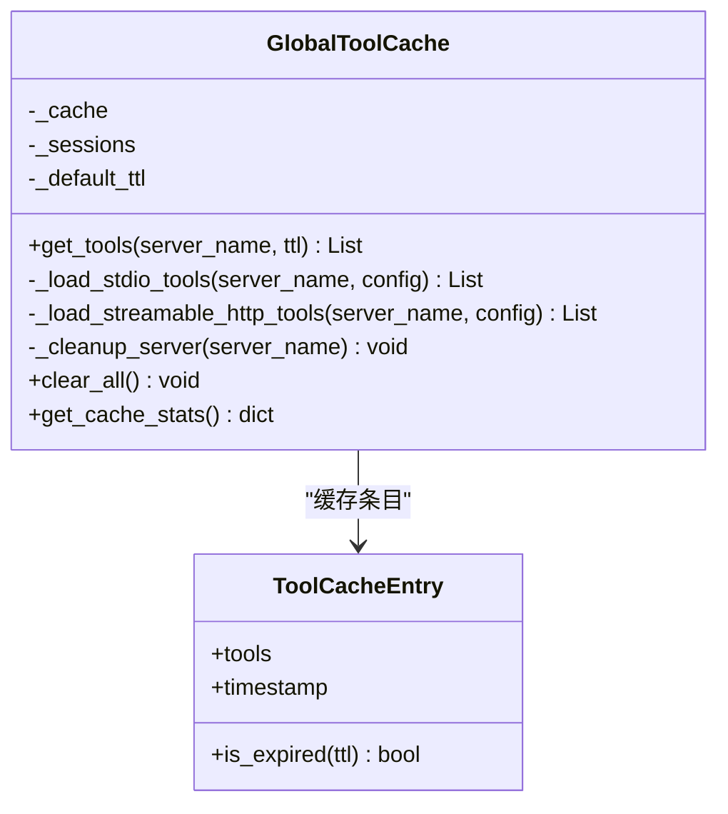
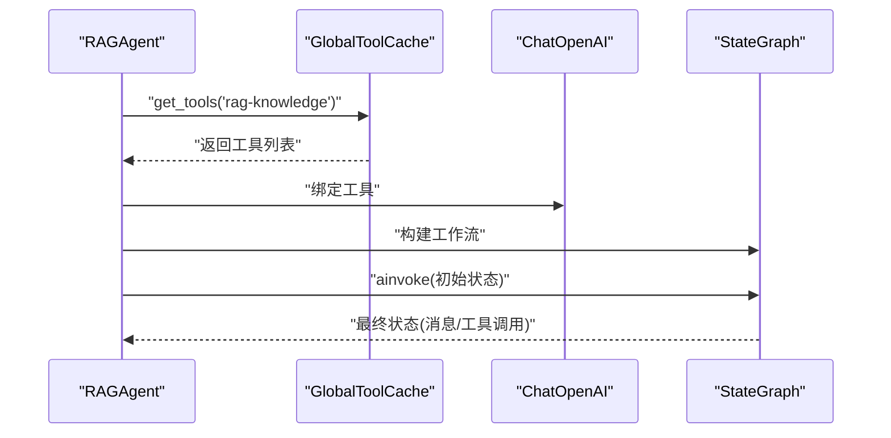
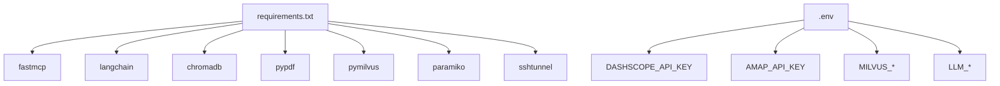

# RAG知识库服务器

<cite>
**本文档引用的文件**
- [Server/rag_server.py](file://Server/rag_server.py)
- [Server/init_rag.py](file://Server/init_rag.py)
- [Routing/milvus_tunnel_manager.py](file://Routing/milvus_tunnel_manager.py)
- [Routing/tool_cache.py](file://Routing/tool_cache.py)
- [Routing/base_agent.py](file://Routing/base_agent.py)
- [Routing/rag_agent.py](file://Routing/rag_agent.py)
- [Routing/mcp.json](file://Routing/mcp.json)
- [test/test_chroma.py](file://test/test_chroma.py)
- [test/test_vector_search.py](file://test/test_vector_search.py)
- [requirements.txt](file://requirements.txt)
- [README.md](file://README.md)
- [quickstart.py](file://quickstart.py)
- [demo_conversation.py](file://demo_conversation.py)
</cite>

## 目录
1. [简介](#简介)
2. [项目结构](#项目结构)
3. [核心组件](#核心组件)
4. [架构总览](#架构总览)
5. [详细组件分析](#详细组件分析)
6. [依赖关系分析](#依赖关系分析)
7. [性能考虑](#性能考虑)
8. [故障排查指南](#故障排查指南)
9. [结论](#结论)
10. [附录](#附录)

## 简介
本文件面向RAG（Retrieval-Augmented Generation）知识库MCP服务器，系统性阐述其架构设计、向量检索机制与知识问答流程。重点覆盖文档索引构建、向量嵌入处理、相似度匹配算法、答案生成流程；同时提供与ChromaDB/Milvus的集成方式、缓存策略与并发访问控制说明，并给出部署指南、模型配置与性能调优建议。

## 项目结构
该项目采用模块化组织，围绕“MCP协议 + LangGraph + LangChain”构建智能代理系统，其中RAG知识库服务器作为MCP工具之一，被其他Agent通过统一缓存机制按需加载与复用。

图表来源
- [Server/rag_server.py:1-363](file://Server/rag_server.py#L1-L363)
- [Server/init_rag.py:1-506](file://Server/init_rag.py#L1-L506)
- [Routing/base_agent.py:1-497](file://Routing/base_agent.py#L1-L497)
- [Routing/tool_cache.py:1-302](file://Routing/tool_cache.py#L1-L302)
- [Routing/milvus_tunnel_manager.py:1-101](file://Routing/milvus_tunnel_manager.py#L1-L101)
- [Routing/mcp.json:1-29](file://Routing/mcp.json#L1-L29)
- [test/test_chroma.py:1-29](file://test/test_chroma.py#L1-L29)
- [test/test_vector_search.py:1-66](file://test/test_vector_search.py#L1-L66)
- [quickstart.py:1-68](file://quickstart.py#L1-L68)
- [demo_conversation.py:1-102](file://demo_conversation.py#L1-L102)

章节来源
- [README.md:1-125](file://README.md#L1-L125)
- [Routing/mcp.json:1-29](file://Routing/mcp.json#L1-L29)

## 核心组件
- RAG MCP服务器：提供知识库查询、后端切换、文档加载与统计查询等工具，支持ChromaDB与Milvus两种向量后端。
- 索引初始化脚本：扫描Data目录，加载PDF/JSON/TXT，分块与清洗，生成向量并写入ChromaDB与Milvus。
- Milvus隧道管理器：通过SSH隧道安全连接远程Milvus，提供本地端口转发。
- 全局工具缓存：统一管理MCP服务器连接与工具列表，支持TTL过期与线程安全。
- Agent基类与RAG代理：统一的消息处理、工具绑定、工作流编排，支持多后端提示词注入。

章节来源
- [Server/rag_server.py:193-354](file://Server/rag_server.py#L193-L354)
- [Server/init_rag.py:294-496](file://Server/init_rag.py#L294-L496)
- [Routing/milvus_tunnel_manager.py:14-101](file://Routing/milvus_tunnel_manager.py#L14-L101)
- [Routing/tool_cache.py:39-302](file://Routing/tool_cache.py#L39-L302)
- [Routing/base_agent.py:29-497](file://Routing/base_agent.py#L29-L497)

## 架构总览
RAG知识库服务器通过FastMCP暴露工具，内部使用DashScope文本嵌入模型生成向量，ChromaDB作为默认本地向量库，Milvus作为可选远程向量库。Agent通过全局工具缓存按需加载RAG工具，形成“提示词注入 + 工具调用 + 向量检索”的问答闭环。

图表来源
- [Routing/base_agent.py:44-66](file://Routing/base_agent.py#L44-L66)
- [Routing/tool_cache.py:85-117](file://Routing/tool_cache.py#L85-L117)
- [Server/rag_server.py:193-244](file://Server/rag_server.py#L193-L244)
- [Server/rag_server.py:86-126](file://Server/rag_server.py#L86-L126)

## 详细组件分析

### RAG MCP服务器（Server/rag_server.py）
- 工具定义
  - search_knowledge：在知识库中检索与查询相关的文档片段，支持指定后端与top_k返回数量。
  - set_search_backend：切换RAG搜索使用的向量库后端（0=ChromaDB，1=Milvus）。
  - load_documents：手动触发Data目录下文档的加载与索引。
  - get_indexed_docs：获取已索引文档列表与统计信息。
- 向量存储工厂
  - get_vector_store：根据后端参数返回ChromaDB或Milvus封装对象；默认使用DashScope文本嵌入模型。
- MilvusVectorStore封装
  - 提供与ChromaDB兼容的similarity_search_with_score接口。
  - 通过MilvusTunnelManager建立SSH隧道并连接远程集合，使用COSINE距离与nprobe参数进行近似最近邻搜索。
  - 提供get_stats统计方法，汇总实体数量与索引文件列表。
- ChromaDB集成
  - 使用LangChain Chroma封装，持久化目录位于项目根目录下的vector_store，集合名为knowledge_base。
- 运行模式
  - 以stdio模式运行，配合MCP客户端加载工具。

图表来源
- [Server/rag_server.py:51-159](file://Server/rag_server.py#L51-L159)
- [Server/rag_server.py:161-190](file://Server/rag_server.py#L161-L190)
- [Server/rag_server.py:193-354](file://Server/rag_server.py#L193-L354)

章节来源
- [Server/rag_server.py:193-354](file://Server/rag_server.py#L193-L354)

### 索引初始化脚本（Server/init_rag.py）
- 文档加载
  - 支持PDF、JSON问答对、TXT文本，自动标注source与file_type元数据。
  - JSON问答对支持多种键名变体（question/q/query/问题 与 answer/a/response/答案）。
- 文本分块
  - 使用递归字符分块器，设定chunk_size与chunk_overlap，按中英文标点与空白分割。
  - 过滤空内容与过短文档块。
- 向量嵌入与存储
  - 使用DashScope text-embedding-v3生成向量，ChromaDB批量add_texts持久化。
  - Milvus侧独立初始化Collection、创建索引（IVF_FLAT/COSINE），分批插入向量并flush。
- 数据清洗
  - 移除控制字符与特殊Unicode字符，保留中英文、CJK标点、常见全角字符与换行制表符。
- 统计输出
  - 源文件数、文件类型分布、向量总数等。

图表来源
- [Server/init_rag.py:294-496](file://Server/init_rag.py#L294-L496)
- [Server/init_rag.py:48-158](file://Server/init_rag.py#L48-L158)
- [Server/init_rag.py:208-292](file://Server/init_rag.py#L208-L292)

章节来源
- [Server/init_rag.py:294-496](file://Server/init_rag.py#L294-L496)

### Milvus隧道管理器（Routing/milvus_tunnel_manager.py）
- 功能
  - 从环境变量读取SSH主机、端口、用户名、私钥路径、远程端口与本地转发端口。
  - 自动尝试RSA/ECDSA/Ed25519密钥格式加载。
  - 通过SSHTunnelForwarder建立隧道，将远程gRPC端口转发到本地端口。
- 异常处理
  - 密钥文件不存在、密钥格式不识别、隧道建立失败均返回False并打印错误信息。

图表来源
- [Routing/milvus_tunnel_manager.py:20-90](file://Routing/milvus_tunnel_manager.py#L20-L90)

章节来源
- [Routing/milvus_tunnel_manager.py:14-101](file://Routing/milvus_tunnel_manager.py#L14-L101)

### 全局工具缓存（Routing/tool_cache.py）
- 设计目标
  - 缓存MCP服务器连接与工具列表，避免重复加载；支持TTL过期策略；线程安全访问。
- 加载策略
  - 支持stdio与streamable-http两种传输协议；按服务器名称缓存；路径与环境变量解析。
- 生命周期
  - 应用启动到对话结束；提供clear_all统一清理；记录活跃会话与缓存统计。
- 并发与稳定性
  - 使用异步锁保护缓存更新；对会话关闭进行静默处理，避免影响用户。

图表来源
- [Routing/tool_cache.py:27-302](file://Routing/tool_cache.py#L27-L302)

章节来源
- [Routing/tool_cache.py:39-302](file://Routing/tool_cache.py#L39-L302)

### Agent基类与RAG代理（Routing/base_agent.py, Routing/rag_agent.py）
- Agent基类
  - 统一初始化：从全局工具缓存加载工具、绑定LLM、构建LangGraph工作流。
  - 模型节点与工具节点：按条件边路由，支持多轮对话与错误处理。
  - 系统提示词注入：根据后端类型动态注入提示词，指导工具调用参数。
- RAG代理
  - 继承BaseAgent，重写_get_server_name与_get_system_prompt，明确RAG MCP服务器名称与后端提示词。
  - 支持构造时指定后端（0=ChromaDB，1=Milvus）。

图表来源
- [Routing/base_agent.py:44-66](file://Routing/base_agent.py#L44-L66)
- [Routing/base_agent.py:102-130](file://Routing/base_agent.py#L102-L130)
- [Routing/base_agent.py:131-217](file://Routing/base_agent.py#L131-L217)
- [Routing/base_agent.py:238-256](file://Routing/base_agent.py#L238-L256)
- [Routing/rag_agent.py:433-463](file://Routing/rag_agent.py#L433-L463)

章节来源
- [Routing/base_agent.py:29-497](file://Routing/base_agent.py#L29-L497)
- [Routing/rag_agent.py:1-11](file://Routing/rag_agent.py#L1-L11)

### MCP服务器配置（Routing/mcp.json）
- 定义四个MCP服务器：amap-maps-streamableHTTP（HTTP）、calculator与log-reader（stdio）、rag-knowledge（stdio）。
- rag-knowledge指向Server/rag_server.py，通过stdio传输协议与客户端通信。

章节来源
- [Routing/mcp.json:1-29](file://Routing/mcp.json#L1-L29)

## 依赖关系分析
- 运行时依赖
  - fastmcp、langchain、langchain-community、langchain-core、langchain-mcp-adapters、mcp、httpx、chromadb、langchain-chroma、pypdf、redis、paramiko、sshtunnel、pymilvus。
- 环境变量
  - DASHSCOPE_API_KEY：DashScope嵌入与LLM服务密钥。
  - AMAP_API_KEY：高德地图MCP服务密钥。
  - MILVUS_*：Milvus隧道与连接参数（SSH主机、端口、用户名、私钥路径、远程端口、本地端口）。
  - LLM_*：LLM基础URL、模型、温度等参数（Agent基类使用）。

图表来源
- [requirements.txt:1-17](file://requirements.txt#L1-L17)
- [README.md:64-69](file://README.md#L64-L69)

章节来源
- [requirements.txt:1-17](file://requirements.txt#L1-L17)
- [README.md:64-69](file://README.md#L64-L69)

## 性能考虑
- 向量检索性能
  - Milvus：使用COSINE距离与IVF_FLAT索引，nprobe参数控制召回与性能权衡；建议根据数据规模调整nlist与nprobe。
  - ChromaDB：基于本地磁盘持久化，适合小规模数据；大规模场景建议迁移至Milvus。
- 批处理与限流
  - 向量嵌入与Milvus插入采用分批处理（batch_size=20），避免API限制与内存峰值。
- 文本清洗与分块
  - 递归字符分块器结合中英文标点与空白，减少跨句切分；清洗阶段移除无效字符，降低噪声。
- 缓存策略
  - GlobalToolCache默认TTL=300秒，避免频繁重启MCP服务器；会话结束后统一清理，防止资源泄漏。
- 并发与稳定性
  - 工具缓存使用异步锁；SSH隧道连接在异常时静默关闭，避免阻塞；Milvus连接断开时捕获异常并清理。

章节来源
- [Server/init_rag.py:404-456](file://Server/init_rag.py#L404-L456)
- [Server/init_rag.py:208-292](file://Server/init_rag.py#L208-L292)
- [Routing/tool_cache.py:85-117](file://Routing/tool_cache.py#L85-L117)
- [Server/rag_server.py:98-106](file://Server/rag_server.py#L98-L106)

## 故障排查指南
- Milvus不可用
  - 现象：RAG Server打印Milvus不可用并回退到ChromaDB。
  - 排查：确认pymilvus安装、SSH隧道配置正确、远程Milvus服务可达。
- SSH隧道建立失败
  - 现象：Milvus隧道管理器返回False并打印错误。
  - 排查：检查密钥文件路径与权限、密钥格式是否受支持、SSH主机与端口配置。
- 向量检索无结果
  - 现象：search_knowledge返回空结果或错误。
  - 排查：确认Data目录存在且包含可识别文件；检查向量索引是否已初始化；验证嵌入模型API密钥。
- 工具缓存异常
  - 现象：Agent初始化失败或工具加载超时。
  - 排查：检查mcp.json配置、服务器命令与参数、网络连接（HTTP或stdio）；查看缓存统计与活跃会话。

章节来源
- [Server/rag_server.py:31-33](file://Server/rag_server.py#L31-L33)
- [Routing/milvus_tunnel_manager.py:84-89](file://Routing/milvus_tunnel_manager.py#L84-L89)
- [test/test_chroma.py:15-24](file://test/test_chroma.py#L15-L24)
- [Routing/tool_cache.py:194-196](file://Routing/tool_cache.py#L194-L196)

## 结论
本RAG知识库MCP服务器以模块化设计实现了“文档索引—向量嵌入—相似度检索—答案生成”的完整链路。通过DashScope嵌入模型与ChromaDB/Milvus双后端支持，结合全局工具缓存与Agent基类的统一工作流，既保证了易用性，又具备良好的扩展性与性能潜力。建议在生产环境中优先采用Milvus并结合合理的索引与nprobe参数，同时完善监控与日志以便持续优化。

## 附录

### 部署指南
- 环境准备
  - 创建并激活Python虚拟环境，安装依赖。
- 环境变量配置
  - 在.env中配置DASHSCOPE_API_KEY与AMAP_API_KEY；如使用Milvus，配置MILVUS_*相关变量。
- 初始化索引
  - 运行索引初始化脚本，扫描Data目录并生成向量索引。
- 启动RAG MCP服务器
  - 以stdio模式运行Server/rag_server.py，或通过MCP客户端加载工具。
- 验证
  - 使用test/test_chroma.py或test/test_vector_search.py验证ChromaDB检索；使用quickstart.py或demo_conversation.py进行端到端演示。

章节来源
- [README.md:51-78](file://README.md#L51-L78)
- [README.md:64-69](file://README.md#L64-L69)
- [test/test_chroma.py:1-29](file://test/test_chroma.py#L1-L29)
- [test/test_vector_search.py:1-66](file://test/test_vector_search.py#L1-L66)
- [quickstart.py:1-68](file://quickstart.py#L1-L68)
- [demo_conversation.py:1-102](file://demo_conversation.py#L1-L102)

### 模型配置与性能调优建议
- 嵌入模型
  - 使用DashScope text-embedding-v3，确保API密钥有效。
- 向量库参数
  - Milvus：根据数据规模调整nlist与nprobe；COSINE距离与IVF_FLAT索引适合大规模相似度检索。
  - ChromaDB：适合小规模数据与快速迭代；注意磁盘空间与I/O瓶颈。
- 文本清洗与分块
  - 保持合理的chunk_size与chunk_overlap，避免过度切分导致语义断裂。
- 缓存与并发
  - 合理设置GlobalToolCache TTL，平衡响应速度与资源占用；在高并发场景下增加连接池与会话复用。

章节来源
- [Server/init_rag.py:348-351](file://Server/init_rag.py#L348-L351)
- [Server/rag_server.py:98-106](file://Server/rag_server.py#L98-L106)
- [Routing/tool_cache.py:62-65](file://Routing/tool_cache.py#L62-L65)