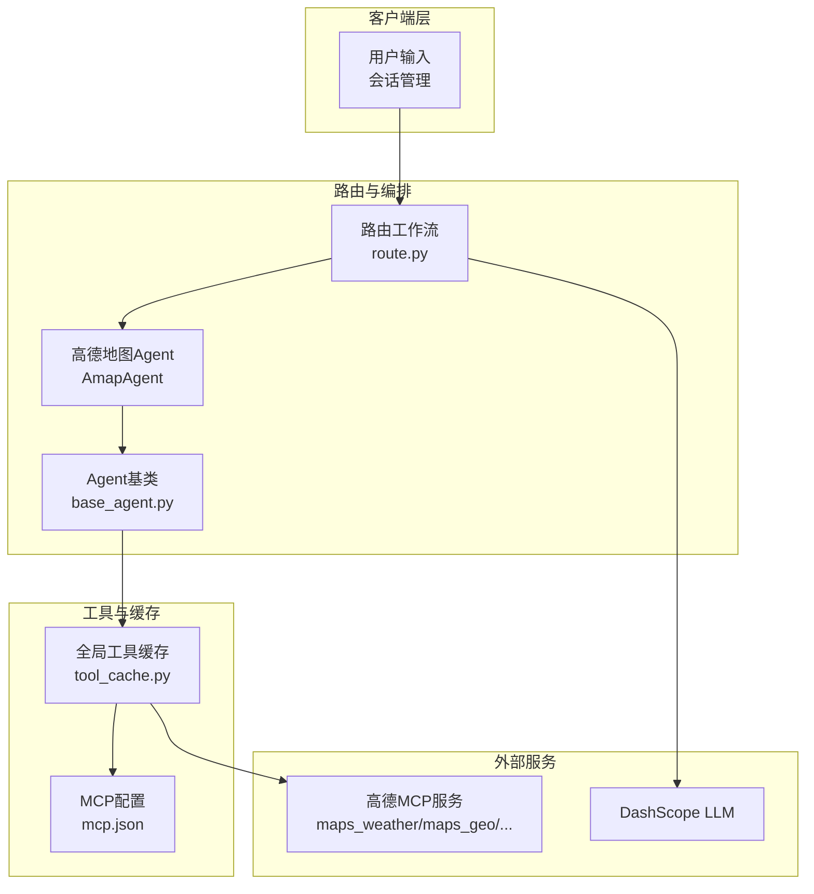
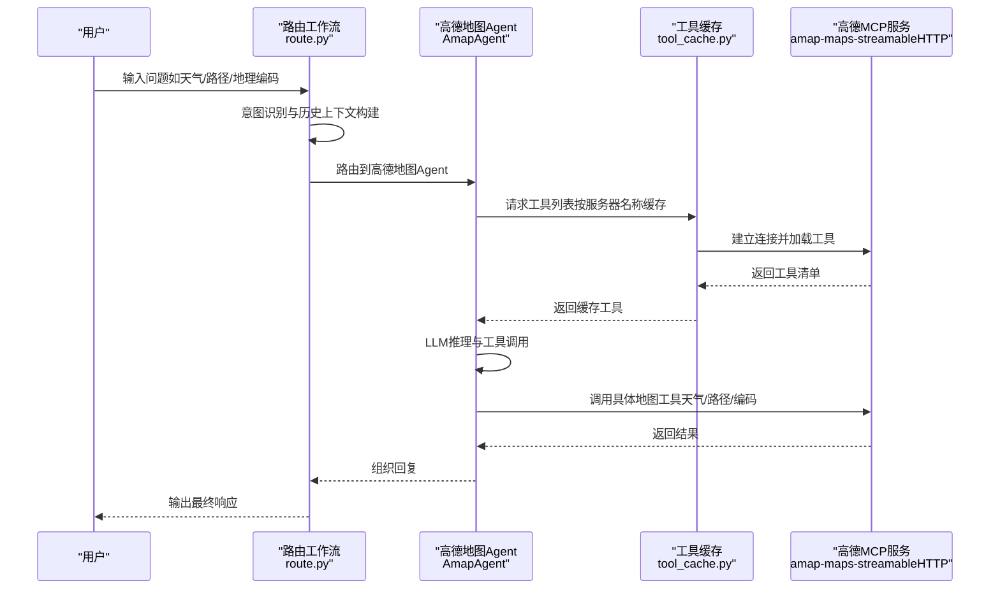
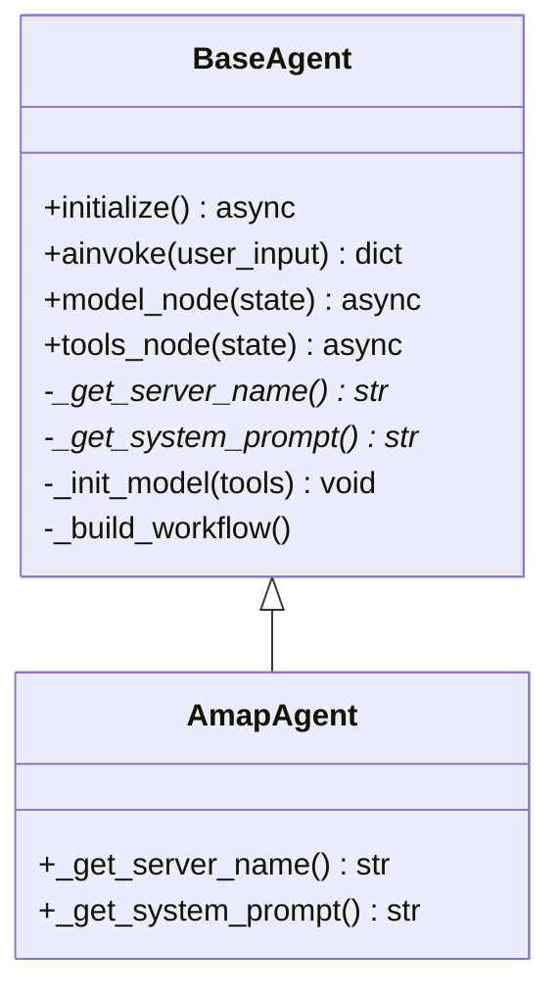
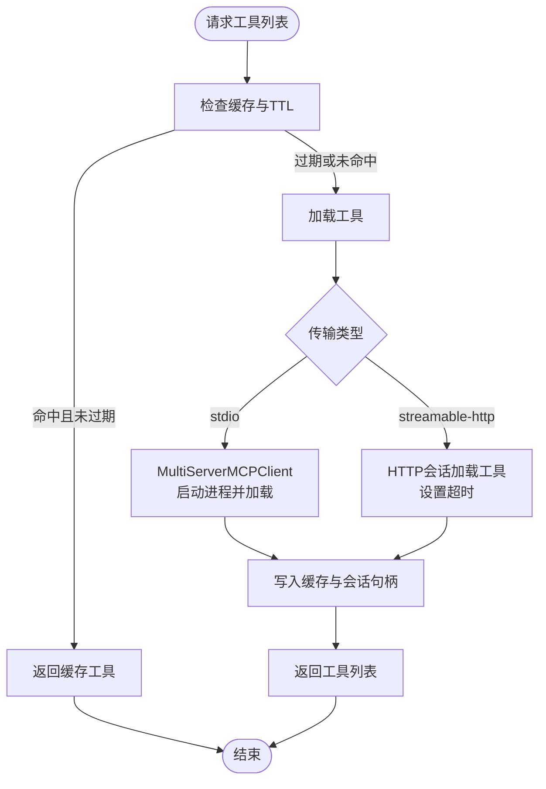
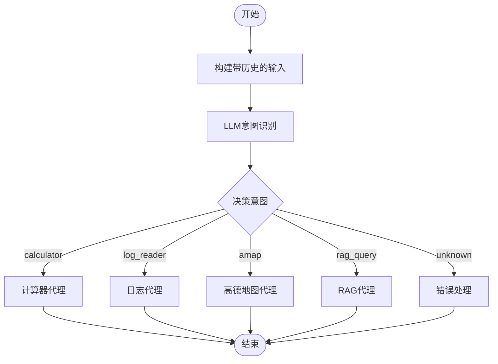
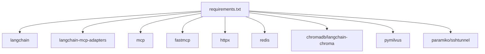

# 地图服务服务器

<cite>
**本文档引用的文件**
- [README.md](file://README.md)
- [requirements.txt](file://requirements.txt)
- [Routing/base_agent.py](file://Routing/base_agent.py)
- [Routing/amap.py](file://Routing/amap.py)
- [Routing/tool_cache.py](file://Routing/tool_cache.py)
- [Routing/mcp.json](file://Routing/mcp.json)
- [Routing/route.py](file://Routing/route.py)
- [test/test_amap.py](file://test/test_amap.py)
- [test/test_route_weather.py](file://test/test_route_weather.py)
- [Server/calculator_server.py](file://Server/calculator_server.py)
- [Server/logReader_server.py](file://Server/logReader_server.py)
- [Server/rag_server.py](file://Server/rag_server.py)
</cite>

## 目录
1. [简介](#简介)
2. [项目结构](#项目结构)
3. [核心组件](#核心组件)
4. [架构总览](#架构总览)
5. [详细组件分析](#详细组件分析)
6. [依赖分析](#依赖分析)
7. [性能考虑](#性能考虑)
8. [故障排除指南](#故障排除指南)
9. [结论](#结论)
10. [附录](#附录)

## 简介
本项目基于 Model Context Protocol (MCP) 构建，通过标准化协议连接 AI 模型与外部工具/数据源。地图服务模块专注于高德开放平台的地图能力集成，包括地理编码、路径规划、天气查询、POI 搜索、IP 定位等功能。系统采用 LangGraph 实现智能路由与会话管理，配合全局工具缓存与会话持久化，提供稳定、可扩展的地图服务。

## 项目结构
项目采用模块化设计，核心围绕 Routing（路由与工具）、Server（MCP 服务器）、测试与文档组成。地图服务通过 MCP 协议对接高德地图服务，工具缓存统一管理连接与生命周期，路由模块负责意图识别与工作流编排。

**图表来源**
- [Routing/route.py:1-553](file://Routing/route.py#L1-L553)
- [Routing/base_agent.py:1-497](file://Routing/base_agent.py#L1-L497)
- [Routing/tool_cache.py:1-302](file://Routing/tool_cache.py#L1-L302)
- [Routing/mcp.json:1-29](file://Routing/mcp.json#L1-L29)

**章节来源**
- [README.md:1-125](file://README.md#L1-L125)
- [Routing/mcp.json:1-29](file://Routing/mcp.json#L1-L29)

## 核心组件
- Agent 基类与具体 Agent：统一工具加载、消息处理、错误处理与工作流构建；高德地图 Agent 通过 MCP 服务器名称标识连接高德地图工具集。
- 全局工具缓存：集中管理 MCP 服务器连接、工具列表缓存、TTL 过期与线程安全访问；支持 stdio 与 streamable-http 两种传输协议。
- 路由工作流：基于 LangGraph 的意图识别与节点编排，支持会话历史上下文注入与多轮对话。
- MCP 配置：集中定义 amap-maps-streamableHTTP、calculator、log-reader、rag-knowledge 等服务器的传输方式与参数。

**章节来源**
- [Routing/base_agent.py:29-497](file://Routing/base_agent.py#L29-L497)
- [Routing/tool_cache.py:39-302](file://Routing/tool_cache.py#L39-L302)
- [Routing/route.py:50-291](file://Routing/route.py#L50-L291)
- [Routing/mcp.json:1-29](file://Routing/mcp.json#L1-L29)

## 架构总览
系统通过路由模块识别用户意图，将请求路由至相应 Agent；Agent 使用全局工具缓存加载高德地图工具，LLM 与工具协同完成任务；会话管理器持久化对话历史，提升用户体验。

**图表来源**
- [Routing/route.py:149-233](file://Routing/route.py#L149-L233)
- [Routing/base_agent.py:102-318](file://Routing/base_agent.py#L102-L318)
- [Routing/tool_cache.py:85-140](file://Routing/tool_cache.py#L85-L140)
- [Routing/mcp.json:3-6](file://Routing/mcp.json#L3-L6)

## 详细组件分析

### Agent 基类与高德地图 Agent
- 统一初始化：延迟初始化，按需加载工具，绑定 LLM 与工具。
- 工作流构建：基于 LangGraph 的状态机，包含 model 节点与 tools 节点，条件边控制工具调用与结果回传。
- 错误处理：捕获模型调用与工具执行异常，生成统一错误消息。
- 高德地图 Agent：通过服务器名称标识 amap-maps-streamableHTTP，系统提示词引导专业地图服务助手行为。

**图表来源**
- [Routing/base_agent.py:29-497](file://Routing/base_agent.py#L29-L497)

**章节来源**
- [Routing/base_agent.py:44-66](file://Routing/base_agent.py#L44-L66)
- [Routing/base_agent.py:102-217](file://Routing/base_agent.py#L102-L217)
- [Routing/base_agent.py:418-431](file://Routing/base_agent.py#L418-L431)

### 全局工具缓存（ToolCache）
- 缓存策略：以服务器名为键，TTL 控制过期；线程安全锁保证并发一致性。
- 传输支持：stdio 与 streamable-http 两种协议；stdio 通过 MultiServerMCPClient 管理进程；streamable-http 通过 HTTP 会话加载工具。
- 环境变量解析：URL 中的 {AMAP_API_KEY} 自动替换为环境变量值；stdio 参数中支持相对路径转换。
- 超时与清理：HTTP 连接超时控制；清理过期缓存与会话，避免资源泄漏。

**图表来源**
- [Routing/tool_cache.py:85-140](file://Routing/tool_cache.py#L85-L140)
- [Routing/tool_cache.py:198-242](file://Routing/tool_cache.py#L198-L242)

**章节来源**
- [Routing/tool_cache.py:27-37](file://Routing/tool_cache.py#L27-L37)
- [Routing/tool_cache.py:85-116](file://Routing/tool_cache.py#L85-L116)
- [Routing/tool_cache.py:198-242](file://Routing/tool_cache.py#L198-L242)

### 路由工作流与会话管理
- 意图识别：基于 LLM 的结构化输出，识别 calculator、log_reader、amap、rag_query 四类意图。
- 历史上下文：会话管理器维护最近 N 轮对话，构建带上下文的输入，提升多轮对话准确性。
- 节点编排：路由节点 → 业务代理节点（计算器/日志/RAG/地图）→ 结束节点；错误处理节点兜底。
- 资源清理：应用关闭时统一清理工具缓存、会话与网络隧道。

**图表来源**
- [Routing/route.py:149-233](file://Routing/route.py#L149-L233)
- [Routing/route.py:258-291](file://Routing/route.py#L258-L291)

**章节来源**
- [Routing/route.py:50-147](file://Routing/route.py#L50-L147)
- [Routing/route.py:236-256](file://Routing/route.py#L236-L256)
- [Routing/route.py:434-456](file://Routing/route.py#L434-L456)

### MCP 配置与高德地图工具
- 配置文件集中定义各 MCP 服务器的传输方式与参数；高德地图使用 streamable-http，URL 中包含 API 密钥占位符。
- 工具加载：通过工具缓存按服务器名称加载工具；测试脚本演示如何获取天气工具并调用。
- 功能覆盖：天气查询、地理编码、逆地理编码、路径规划（驾车/步行等）、POI 搜索、IP 定位。

**章节来源**
- [Routing/mcp.json:3-6](file://Routing/mcp.json#L3-L6)
- [test/test_amap.py:28-64](file://test/test_amap.py#L28-L64)
- [README.md:80-90](file://README.md#L80-L90)

### 其他 MCP 服务器（对比参考）
- 计算器服务器：提供加减乘除工具，演示 stdio 传输与工具注册。
- 日志读取服务器：提供日志读取、搜索与统计工具，演示 stdio 传输与文件操作。
- RAG 服务器：提供知识库检索、后端切换与统计工具，演示 stdio 传输与向量存储抽象。

**章节来源**
- [Server/calculator_server.py:16-105](file://Server/calculator_server.py#L16-L105)
- [Server/logReader_server.py:18-145](file://Server/logReader_server.py#L18-L145)
- [Server/rag_server.py:193-353](file://Server/rag_server.py#L193-L353)

## 依赖分析
- 核心依赖：langchain、langchain-mcp-adapters、mcp、fastmcp 等，支撑 MCP 协议与工具加载。
- 传输协议：stdio 与 streamable-http 并存，满足不同部署场景。
- 环境变量：AMAP_API_KEY、DASHSCOPE_API_KEY、LLM_BASE_URL、LLM_MODEL、LLM_TEMPERATURE 等影响运行时行为。

**图表来源**
- [requirements.txt:1-17](file://requirements.txt#L1-L17)

**章节来源**
- [requirements.txt:1-17](file://requirements.txt#L1-L17)

## 性能考虑
- 工具缓存：默认 300 秒 TTL，减少重复连接与加载开销；缓存命中时直接返回工具列表。
- 传输优化：streamable-http 支持会话复用与超时控制；stdio 通过 MultiServerMCPClient 管理进程生命周期。
- 并发处理：工具缓存使用异步锁保证线程安全；路由工作流基于异步执行，适合高并发场景。
- 会话持久化：Redis 会话存储支持 TTL 与集群部署，降低内存压力。
- 限流机制：当前实现未内置显式限流策略，建议在网关或上游服务层增加速率限制与配额管理。

[本节为通用性能建议，无需特定文件引用]

## 故障排除指南
- 环境变量缺失：AMAP_API_KEY 未设置会导致 streamable-http 加载失败；DASHSCOPE_API_KEY 缺失会影响 LLM 调用。
- 工具加载失败：检查 MCP 配置文件与服务器可达性；stdio 服务器需确保路径与权限正确。
- 连接超时：streamable-http 设置了 10 秒超时，网络不稳定时可适当放宽或重试。
- 缓存异常：清理工具缓存与会话后重试；确认服务器名称与 TTL 配置。
- 多轮对话异常：检查会话 ID 与历史注入逻辑；确保会话存储可用。

**章节来源**
- [Routing/tool_cache.py:202-223](file://Routing/tool_cache.py#L202-L223)
- [Routing/tool_cache.py:244-279](file://Routing/tool_cache.py#L244-L279)
- [test/test_amap.py:20-27](file://test/test_amap.py#L20-L27)

## 结论
本地图服务服务器通过 MCP 协议与全局工具缓存，实现了高德地图能力的标准化接入与高效复用。结合 LangGraph 的路由与会话管理，系统具备良好的扩展性与稳定性。建议在生产环境中完善限流与监控策略，并持续优化缓存与传输策略以提升整体性能。

[本节为总结性内容，无需特定文件引用]

## 附录

### API 接口与响应格式（基于工具名称）
- 天气查询：maps_weather（按城市名称查询天气信息）
- 地理编码：maps_geo（地址转经纬度）
- 逆地理编码：maps_regeocode（经纬度转地址）
- 路径规划：maps_direction_driving、maps_direction_walking 等（多种出行方式）
- POI 搜索：maps_text_search、maps_around_search
- IP 定位：maps_ip_location

**章节来源**
- [README.md:84-89](file://README.md#L84-L89)

### 使用示例与最佳实践
- 配置 API 密钥：在 .env 中设置 AMAP_API_KEY 与 DASHSCOPE_API_KEY。
- 启动与测试：运行路由演示脚本，支持多轮对话与会话信息查看。
- 工具调用：通过工具缓存获取 amap-maps-streamableHTTP 工具集合，按需调用具体工具。

**章节来源**
- [README.md:64-79](file://README.md#L64-L79)
- [test/test_route_weather.py:14-56](file://test/test_route_weather.py#L14-L56)