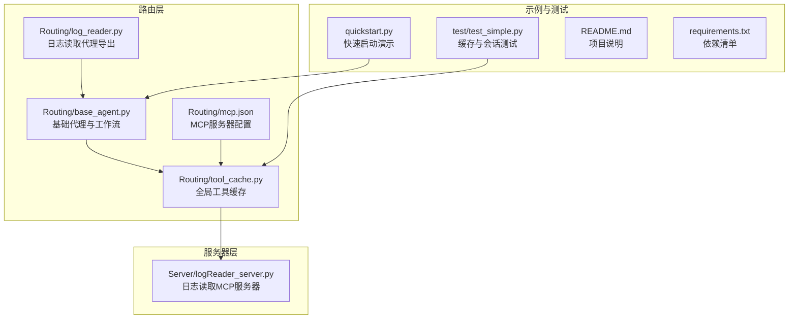
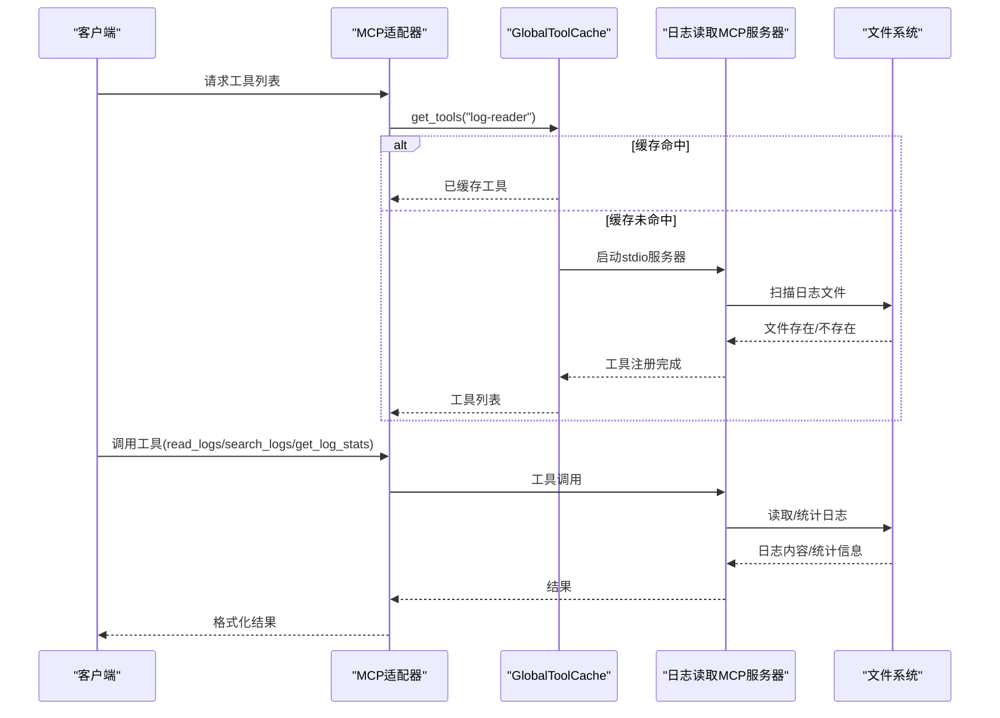
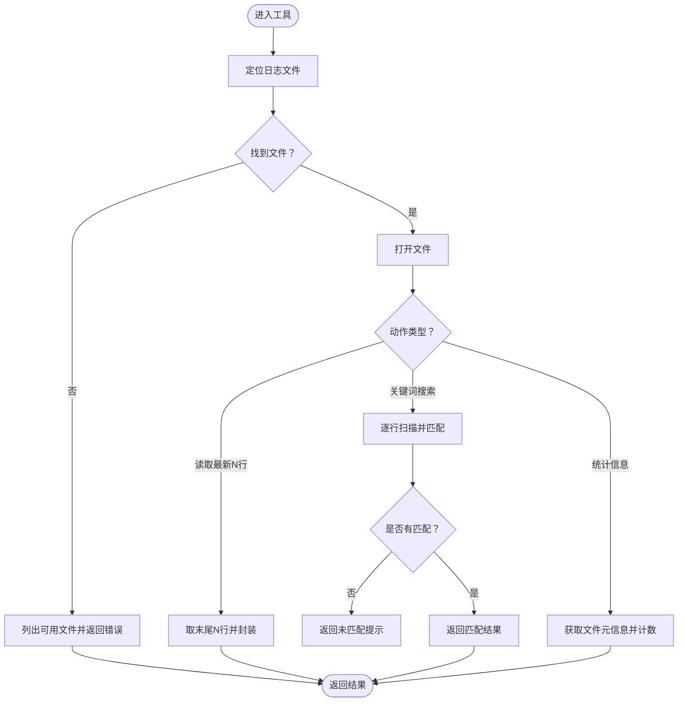
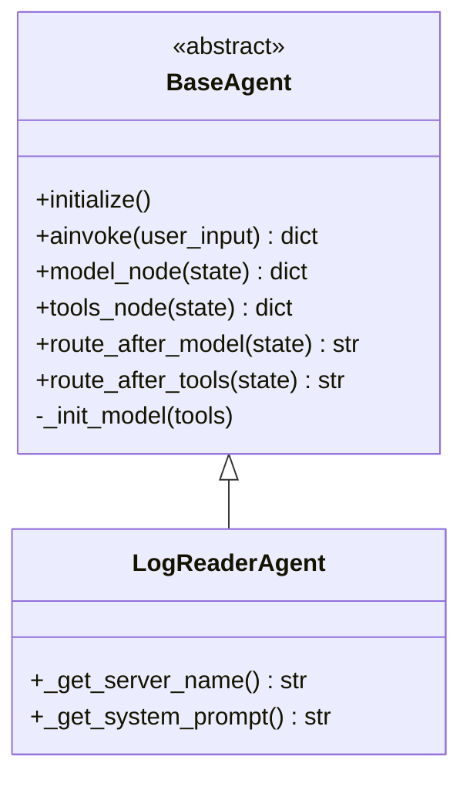
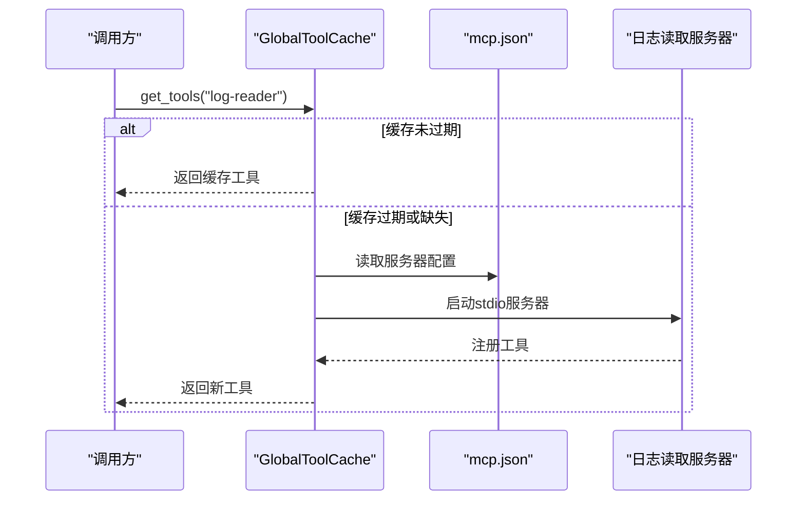
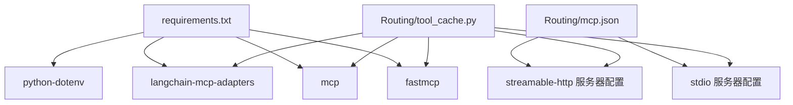

# 日志读取服务器

<cite>
**本文档引用的文件**
- [Server/logReader_server.py](file://Server/logReader_server.py)
- [Routing/base_agent.py](file://Routing/base_agent.py)
- [Routing/tool_cache.py](file://Routing/tool_cache.py)
- [Routing/log_reader.py](file://Routing/log_reader.py)
- [Routing/mcp.json](file://Routing/mcp.json)
- [quickstart.py](file://quickstart.py)
- [README.md](file://README.md)
- [requirements.txt](file://requirements.txt)
- [test/test_simple.py](file://test/test_simple.py)
</cite>

## 目录
1. [简介](#简介)
2. [项目结构](#项目结构)
3. [核心组件](#核心组件)
4. [架构总览](#架构总览)
5. [详细组件分析](#详细组件分析)
6. [依赖分析](#依赖分析)
7. [性能考虑](#性能考虑)
8. [故障排除指南](#故障排除指南)
9. [结论](#结论)
10. [附录](#附录)

## 简介
本文件面向“日志读取MCP服务器”的技术文档，系统性阐述其功能特性、数据处理能力与API接口设计，深入解析日志文件解析算法、过滤条件设置、统计分析功能与结果格式化机制，并提供实际代码示例路径，说明如何实现日志分析工具、配置过滤规则与处理大规模日志数据。同时，解释服务器的数据结构设计、内存管理策略与并发处理能力，给出最佳实践、性能调优方法与故障排除指南。

## 项目结构
该仓库采用模块化设计，围绕MCP协议构建智能代理系统，日志读取服务器作为其中一个MCP工具服务器，通过标准输入输出(stdio)与客户端通信；路由层负责统一加载与缓存MCP工具，代理层负责对话流程编排与工具调用。

**图表来源**
- [Routing/base_agent.py:1-497](file://Routing/base_agent.py#L1-L497)
- [Routing/tool_cache.py:1-302](file://Routing/tool_cache.py#L1-L302)
- [Routing/log_reader.py:1-11](file://Routing/log_reader.py#L1-L11)
- [Routing/mcp.json:1-29](file://Routing/mcp.json#L1-L29)
- [Server/logReader_server.py:1-151](file://Server/logReader_server.py#L1-L151)
- [quickstart.py:1-68](file://quickstart.py#L1-L68)
- [test/test_simple.py:1-103](file://test/test_simple.py#L1-L103)
- [README.md:1-125](file://README.md#L1-L125)
- [requirements.txt:1-17](file://requirements.txt#L1-L17)

**章节来源**
- [README.md:1-125](file://README.md#L1-L125)
- [Routing/mcp.json:1-29](file://Routing/mcp.json#L1-L29)

## 核心组件
- 日志读取MCP服务器：提供读取最新日志、按关键词搜索、获取日志统计三项工具，以stdio方式运行。
- 路由与代理：基于BaseAgent抽象，统一工具加载、消息处理与错误处理；通过GlobalToolCache缓存MCP工具，避免重复加载。
- 配置与发现：通过mcp.json声明各MCP服务器的传输方式与启动参数，支持stdio与streamable-http两种传输。
- 快速启动与示例：quickstart.py演示如何创建Agent并调用日志读取工具；test/test_simple.py验证缓存与会话管理。

**章节来源**
- [Server/logReader_server.py:1-151](file://Server/logReader_server.py#L1-L151)
- [Routing/base_agent.py:1-497](file://Routing/base_agent.py#L1-L497)
- [Routing/tool_cache.py:1-302](file://Routing/tool_cache.py#L1-L302)
- [Routing/mcp.json:1-29](file://Routing/mcp.json#L1-L29)
- [quickstart.py:1-68](file://quickstart.py#L1-L68)
- [test/test_simple.py:1-103](file://test/test_simple.py#L1-L103)

## 架构总览
日志读取服务器通过FastMCP注册工具，客户端通过MCP适配器动态加载这些工具。工具调用经由GlobalToolCache统一管理，支持stdio传输与会话复用，减少重复启动成本。

**图表来源**
- [Routing/tool_cache.py:85-140](file://Routing/tool_cache.py#L85-L140)
- [Routing/mcp.json:14-20](file://Routing/mcp.json#L14-L20)
- [Server/logReader_server.py:18-151](file://Server/logReader_server.py#L18-L151)

## 详细组件分析

### 日志读取MCP服务器
- 工具注册：使用@mcp.tool()装饰器注册三类工具，分别对应“读取最新日志”、“按关键词搜索”、“获取日志统计”。
- 工具实现要点：
  - 日志文件定位：在项目根/logs目录下尝试常见文件名(app.log、Logs.txt)，若均不存在则返回可用文件列表。
  - 读取策略：读取全部行后取末尾N行；搜索策略：逐行匹配关键词（大小写不敏感）；统计策略：使用os.stat获取文件大小与修改时间，并再次打开文件计数行数。
  - 结果格式：读取与搜索返回结构化列表；统计返回结构化字典；异常统一包装为错误对象。
- 并发与稳定性：当前实现为同步文件IO，适合中小规模日志；对大文件建议采用流式读取与分页策略。

**图表来源**
- [Server/logReader_server.py:18-151](file://Server/logReader_server.py#L18-L151)

**章节来源**
- [Server/logReader_server.py:1-151](file://Server/logReader_server.py#L1-L151)

### 路由与代理（BaseAgent）
- 统一工作流：模型节点(model_node)负责LLM推理；工具节点(tools_node)负责执行具体工具调用；路由(route_after_model/route_after_tools)控制流转。
- 工具加载：通过GlobalToolCache按服务器名称获取工具，支持TTL缓存与会话复用。
- 错误处理：捕获LLM调用与工具执行异常，生成ToolMessage并记录错误，保证流程可控。

**图表来源**
- [Routing/base_agent.py:29-497](file://Routing/base_agent.py#L29-L497)

**章节来源**
- [Routing/base_agent.py:1-497](file://Routing/base_agent.py#L1-L497)

### 全局工具缓存（GlobalToolCache）
- 缓存策略：以服务器名为键，存储工具列表与时间戳；支持TTL过期与清理。
- 传输支持：stdio与streamable-http两种传输方式；stdio通过MultiServerMCPClient启动子进程，streamable-http通过HTTP会话加载工具。
- 会话管理：缓存ClientSession与transport，避免重复建立连接；提供clear_all清理所有会话。

**图表来源**
- [Routing/tool_cache.py:85-140](file://Routing/tool_cache.py#L85-L140)
- [Routing/mcp.json:14-20](file://Routing/mcp.json#L14-L20)

**章节来源**
- [Routing/tool_cache.py:1-302](file://Routing/tool_cache.py#L1-L302)
- [Routing/mcp.json:1-29](file://Routing/mcp.json#L1-L29)

### 日志读取代理导出
- 保持向后兼容：通过log_reader.py导出LogReaderAgent与工厂函数，简化调用。

**章节来源**
- [Routing/log_reader.py:1-11](file://Routing/log_reader.py#L1-L11)

### 快速启动与示例
- quickstart.py：创建Agent并演示调用日志读取工具，展示工具描述与调用结果。
- test/test_simple.py：验证工具缓存与会话管理，确认缓存命中与清理流程。

**章节来源**
- [quickstart.py:1-68](file://quickstart.py#L1-L68)
- [test/test_simple.py:1-103](file://test/test_simple.py#L1-L103)

## 依赖分析
- 运行时依赖：fastmcp、mcp、langchain-mcp-adapters、python-dotenv等，满足MCP协议与工具加载需求。
- 传输与会话：stdio通过MultiServerMCPClient与子进程交互；streamable-http通过HTTP会话加载工具。
- 配置驱动：mcp.json集中声明各服务器的传输方式、命令与参数，便于扩展与维护。

**图表来源**
- [requirements.txt:1-17](file://requirements.txt#L1-L17)
- [Routing/mcp.json:1-29](file://Routing/mcp.json#L1-L29)
- [Routing/tool_cache.py:1-302](file://Routing/tool_cache.py#L1-L302)

**章节来源**
- [requirements.txt:1-17](file://requirements.txt#L1-L17)
- [Routing/mcp.json:1-29](file://Routing/mcp.json#L1-L29)
- [Routing/tool_cache.py:1-302](file://Routing/tool_cache.py#L1-L302)

## 性能考虑
- IO策略
  - 当前实现一次性读取全部行再切片，适合中小规模日志；对于超大文件，建议改为流式读取与滑动窗口，避免内存峰值。
  - 行计数采用逐字符遍历，复杂度O(N)；可结合文件系统元信息估算行数以减少一次全量扫描。
- 缓存优化
  - TTL默认5分钟，可根据工具更新频率调整；对高频调用场景可降低TTL提升一致性。
  - stdio服务器启动成本较高，尽量复用会话；必要时预热工具列表。
- 并发与扩展
  - 工具节点串行执行，避免竞态；如需并行，应在工具内部实现或引入队列。
  - 对多服务器场景，建议按服务器维度隔离缓存与会话，防止相互影响。
- 内存管理
  - 控制单次读取行数上限，避免内存暴涨；对搜索结果进行分页返回。
  - 统一错误包装，避免异常传播导致资源泄漏。

[本节为通用性能指导，无需特定文件来源]

## 故障排除指南
- 日志文件未找到
  - 现象：返回可用文件列表或错误提示。
  - 排查：确认logs目录存在且包含app.log或Logs.txt；检查路径拼接与权限。
  - 参考路径：[Server/logReader_server.py:41-44](file://Server/logReader_server.py#L41-L44)、[Server/logReader_server.py:82-86](file://Server/logReader_server.py#L82-L86)、[Server/logReader_server.py:124-128](file://Server/logReader_server.py#L124-L128)
- 工具加载失败
  - 现象：工具列表为空或报错。
  - 排查：检查mcp.json中服务器配置与传输方式；确认stdio命令与参数正确；查看工具缓存日志。
  - 参考路径：[Routing/mcp.json:14-20](file://Routing/mcp.json#L14-L20)、[Routing/tool_cache.py:134-139](file://Routing/tool_cache.py#L134-L139)、[Routing/tool_cache.py:194-196](file://Routing/tool_cache.py#L194-L196)
- 连接超时（HTTP传输）
  - 现象：HTTP工具加载超时。
  - 排查：检查网络连通性与API密钥；适当增加超时时间；确认URL格式。
  - 参考路径：[Routing/tool_cache.py:217-223](file://Routing/tool_cache.py#L217-L223)
- 缓存与会话问题
  - 现象：工具重复加载或会话未释放。
  - 排查：确认TTL设置；调用clear_all清理；检查异常分支是否触发清理。
  - 参考路径：[Routing/tool_cache.py:281-290](file://Routing/tool_cache.py#L281-L290)

**章节来源**
- [Server/logReader_server.py:41-44](file://Server/logReader_server.py#L41-L44)
- [Server/logReader_server.py:82-86](file://Server/logReader_server.py#L82-L86)
- [Server/logReader_server.py:124-128](file://Server/logReader_server.py#L124-L128)
- [Routing/mcp.json:14-20](file://Routing/mcp.json#L14-L20)
- [Routing/tool_cache.py:134-139](file://Routing/tool_cache.py#L134-L139)
- [Routing/tool_cache.py:194-196](file://Routing/tool_cache.py#L194-L196)
- [Routing/tool_cache.py:217-223](file://Routing/tool_cache.py#L217-L223)
- [Routing/tool_cache.py:281-290](file://Routing/tool_cache.py#L281-L290)

## 结论
日志读取MCP服务器以简洁的工具集实现了日志读取、搜索与统计功能，配合路由层的统一缓存与会话管理，形成可扩展、可维护的MCP工具体系。通过合理配置与性能优化，可在中小规模日志场景下高效稳定运行；对于大规模日志，建议引入流式处理与分页策略，进一步提升吞吐与稳定性。

[本节为总结性内容，无需特定文件来源]

## 附录

### API接口设计与调用示例
- 工具清单与描述
  - read_logs(lines: int = 10) -> list：读取最新N条日志条目。
  - search_logs(keyword: str) -> list：按关键词搜索日志条目。
  - get_log_stats() -> dict：获取日志文件统计信息（大小、修改时间、行数、路径）。
- 调用示例路径
  - 快速启动演示：[quickstart.py:35-38](file://quickstart.py#L35-L38)
  - 工具缓存与会话测试：[test/test_simple.py:24-36](file://test/test_simple.py#L24-L36)

**章节来源**
- [quickstart.py:1-68](file://quickstart.py#L1-L68)
- [test/test_simple.py:1-103](file://test/test_simple.py#L1-L103)

### 数据结构与复杂度
- 日志读取
  - 时间复杂度：O(N)（N为文件行数）；空间复杂度：O(N)（读取全部行）。
  - 优化：流式读取与滑动窗口，复杂度降为O(K)空间（K为窗口大小）。
- 关键词搜索
  - 时间复杂度：O(N·M)（N为行数，M为平均行长度）；空间复杂度：O(R)（R为匹配行数）。
  - 优化：正则表达式预编译；大小写不敏感可通过预处理或lower()实现。
- 统计信息
  - 时间复杂度：O(N)（二次扫描）；空间复杂度：O(1)。
  - 优化：结合文件系统元信息估算行数，减少一次全量扫描。

[本节为通用算法分析，无需特定文件来源]

### 最佳实践与性能调优
- 配置层面
  - 在mcp.json中明确stdio命令与参数，确保路径正确。
  - 合理设置TTL，平衡一致性与性能。
- 代码层面
  - 对超大文件采用流式读取与分页返回。
  - 对搜索关键词进行预处理（如正则编译、大小写归一化）。
  - 统一错误包装与日志记录，便于追踪问题。
- 运维层面
  - 定期清理过期缓存与会话，避免资源泄露。
  - 监控工具加载与调用耗时，及时发现异常。

[本节为通用指导，无需特定文件来源]